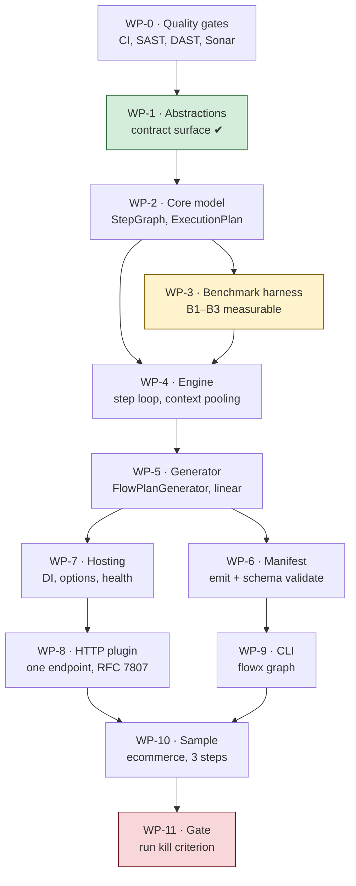

# Implementation Plan

> **Scope:** work-package detail for **P0 — Walking skeleton**, plus the entry
> criteria for P1. Phase-level planning lives in
> [docs/20-Roadmap.md](docs/20-Roadmap.md); this document is what a contributor
> picks work from.
>
> **Companion:** [CHECKLIST.md](CHECKLIST.md) carries live status and is updated
> with every change. This document changes only when the *plan* changes.

---

## 1. What P0 exists to prove

P0 is not "the foundation". It is a **falsification attempt** against the
platform's central bet, stated in
[ADR-0002](docs/adr/ADR-0002-compile-time-orchestration.md):

> A Roslyn source generator can emit an execution plan that is correct,
> debuggable, and fast enough that compile-time orchestration beats a
> reflection-based mediator by an order of magnitude.

Everything else in FlowX is downstream of that sentence. If it is false, the
right outcome for P0 is to **discover it in three weeks**, not to discover it in
month nine with eight phases built on top.

**Kill criterion (unchanged from the roadmap):** if generated dispatch cannot
reach **B1 ≤ 5 µs p99** and **B2 = 0 allocations**, stop. Do not proceed to P1.
Revisit ADR-0002 first.

---

## 2. Sequencing

**WP-3 is scheduled before the engine on purpose.** A performance budget that
becomes measurable only after the thing it constrains is built is a budget that
gets renegotiated instead of met. The benchmark harness measures an empty step
loop first, so every subsequent commit is measured against a number that already
exists.

---

## 3. Work packages

Each package states its goal, the tests written **first**, the deliverable, and
an exit criterion that is mechanically checkable.

### WP-0 — Quality gates and CI

| | |
|---|---|
| **Goal** | Every gate in [21-Quality-Gates](docs/21-Quality-Gates.md) runs before there is code to violate it |
| **Tests first** | n/a — this *is* the test infrastructure |
| **Deliverable** | `.github/workflows/ci.yml` (build, fitness, AOT, docs, attribution) · `security.yml` (CodeQL, Semgrep, Gitleaks, Trivy, SCA) · `quality.yml` (Sonar, coverage, Stryker) · `.github/dependabot.yml` · PR template with the Definition of Done |
| **Exit** | A deliberately introduced violation of each gate class is caught. Verified by pushing a throwaway branch per gate. |
| **Depends on** | — |

### WP-1 — Contract surface

| | |
|---|---|
| **Goal** | `FlowX.Abstractions` — what all user code and every plugin reference |
| **Tests first** | `AbstractionsHasNoDependencies`, `LayersPointInward`, `ContractSurfaceTests` |
| **Deliverable** | `Result<T>`, `Error`, `ErrorCategory`, `ICapability<,>`, `Flow<,>`, `IFlowBuilder<,>`, contexts, trigger attributes, `PolicySet` |
| **Exit** | Solution compiles with zero warnings; fitness functions green; zero package references |
| **Status** | **Done.** 0 warnings, 30/30 fitness tests, 47 behavioural tests |

### WP-2 — Core execution model

| | |
|---|---|
| **Goal** | The immutable data model an execution plan is made of. No I/O, no engine, no generator — just the shapes. |
| **Tests first** | `StepGraphTests` (construction, invariants) · `ExecutionPlanTests` (ordering, compensation stack) · `NoCyclicDependencies` |
| **Deliverable** | `FlowX.Core`: `StepGraph`, `StepNode`, `ExecutionPlan`, `CompensationStack`, `FlowDescriptor`, `CapabilityDescriptor`, `PolicyChain` |
| **Exit** | A three-step linear plan with one compensation is constructible, immutable, and asserts its own invariants. Mutation score ≥ 70 %. |
| **Depends on** | WP-1 |
| **Status** | **Done.** Built red → green; 58 tests; 98.5 % line / 95.6 % branch coverage. Mutation score not yet measured — Stryker is wired but unrun. |

### WP-3 — Benchmark harness *(before the engine — see §2)*

| | |
|---|---|
| **Goal** | B1, B2 and B3 are measurable and gated in CI against a committed baseline |
| **Tests first** | The benchmarks are the tests |
| **Deliverable** | `tests/FlowX.Benchmarks` with BenchmarkDotNet · `MemoryDiagnoser` with a hard-zero assertion for B2 · baseline JSON committed · CI job failing on > 5 % regression |
| **Exit** | `dotnet run -c Release --project tests/FlowX.Benchmarks` reports B1–B3; CI fails on an injected 10 % regression |
| **Depends on** | WP-2 |
| **Status** | **Done.** Gate verified by injecting a 64 B allocation regression — rejected, exit 1. Results: [docs/benchmarks](docs/benchmarks/README.md) |

### WP-4 — Flow engine

| | |
|---|---|
| **Goal** | The step loop: execute an `ExecutionPlan`, thread a pooled context, honour deadlines, unwind compensation on failure |
| **Tests first** | `FlowEngineTests` — happy path, failure path, compensation ordering (**strict reverse**), deadline expiry, cancellation propagation · `ContextPoolingTests` — zero allocation across N executions |
| **Deliverable** | `FlowX.Runtime`: `FlowEngine`, `CapabilityEngine`, pooled `FlowContext`/`CapabilityContext`, `IClock` |
| **Exit** | B2 = 0 allocations on a 4-step flow; compensation ordering proven by test, not by inspection |
| **Depends on** | WP-2, WP-3 |
| **Status** | **Done.** 0 B on a 4-step flow (592 B → 0 B after three fixes found by measurement); 28 tests including concurrency; B1 = 169 ns against a 5 000 ns budget |

### WP-5 — Source generator *(the risk)*

| | |
|---|---|
| **Goal** | Emit a compile-time `ExecutionPlan` from a `Define` method — linear steps only |
| **Tests first** | Generator **snapshot** tests (Verify) · `EmittedCodeIsDebuggable` (line directives present) · `EveryDiagnosticIsHelpful` · a golden-file test per DSL shape |
| **Deliverable** | `FlowX.Compiler`: `FlowPlanGenerator` (incremental), a syntax→model layer kept separate from emission, diagnostics FLOWX1001–1010 |
| **Exit** | The sample flow's plan is generated, readable, breakpoint-able; B1 ≤ 5 µs; build overhead ≤ 8 % on a 20-flow solution |
| **Risk** | **R1.** If the generator's model layer and emission layer blur together here, P1 becomes unmaintainable. Keep them separate from the first commit. |
| **Depends on** | WP-4 |
| **Status** | **Partial.** Generating end to end against a real compilation; 40 tests. Remaining: five diagnostics that need a separate `DiagnosticAnalyzer`, the branching DSL, budget B12, and the exit criterion itself (needs WP-10's sample). |

### WP-6 — Manifest emission

| | |
|---|---|
| **Goal** | `flowx.manifest.json` v0 emitted at build, validating against the committed schema |
| **Tests first** | `ManifestValidatesAgainstSchema` · `ManifestContainsNoSecrets` · `ManifestIsDeterministic` (same input → byte-identical output) |
| **Deliverable** | Manifest writer in `FlowX.Compiler`; schema already committed at `schemas/flowx.manifest.schema.json` |
| **Exit** | Sample build emits a manifest that validates; two consecutive builds are byte-identical |
| **Depends on** | WP-5 |

### WP-7 — Hosting and composition

| | |
|---|---|
| **Goal** | `AddFlowX()` wires generated registrations; configuration validated at **startup**, not first use |
| **Tests first** | `StartupValidationRejectsMisconfiguration` (A05) · `HealthCheckReportsReadiness` |
| **Deliverable** | `FlowX.Hosting`: DI extensions, options with validation, health checks, graceful shutdown draining |
| **Exit** | A misconfigured host refuses to start with a message naming the setting; in-flight flows drain on SIGTERM |
| **Depends on** | WP-5 |

### WP-8 — HTTP trigger plugin

| | |
|---|---|
| **Goal** | Generated endpoint, generated binder, generated OpenAPI, RFC 7807 errors |
| **Tests first** | `ErrorCategoryMapsToProblemDetails` (all six) · `IdempotencyKeyIsEnforced` · `TenantComesFromClaimsOnly` (A07) · `EgressIsAllowListed` (A10) |
| **Deliverable** | `plugins/FlowX.Http`: endpoint generation, model binding, Problem Details mapping, OpenAPI document |
| **Exit** | Sample serves `POST /api/v1/orders`; ZAP baseline scan clean; B9 measured |
| **Depends on** | WP-7 |

### WP-9 — CLI

| | |
|---|---|
| **Goal** | `flowx graph` renders the manifest as Mermaid |
| **Tests first** | `GraphOutputIsValidMermaid` · `GraphIsDeterministic` |
| **Deliverable** | `FlowX.Cli` with the `graph` verb |
| **Exit** | Rendered graph of the sample parses with `mmdc` in CI |
| **Depends on** | WP-6 |

### WP-10 — Reference sample

| | |
|---|---|
| **Goal** | `samples/ecommerce` runs a real 3-step ephemeral flow over HTTP |
| **Tests first** | End-to-end test hitting the endpoint · `CapabilityTestedWithoutHost` (proves quality goal Q2) |
| **Deliverable** | Three capabilities, one flow, one trigger, integration test, README |
| **Exit** | `dotnet run` serves the endpoint; ZAP baseline clean; `flowx graph` renders it |
| **Depends on** | WP-8, WP-9 |

### WP-11 — P0 gate: run the kill criterion

| | |
|---|---|
| **Goal** | Answer the question P0 was built to answer |
| **Deliverable** | A benchmark report committed to `docs/benchmarks/P0.md` with the measured numbers, the hardware, and an explicit **pass/fail against ADR-0002** |
| **Exit** | B1 ≤ 5 µs **and** B2 = 0 → proceed to P1. Otherwise → stop, write the ADR that supersedes ADR-0002, and re-plan. |
| **Depends on** | WP-10 |

---

## 4. Definition of Ready

A work package may start only when all are true. This prevents the most common
failure mode in a spec-heavy project: building something the spec describes but
nobody can verify.

- [ ] Its exit criterion is mechanically checkable (a command, not a judgement)
- [ ] Its tests-first artifacts are named
- [ ] Its dependencies are complete
- [ ] The documentation section it implements is identified

---

## 5. Estimation and staffing

Deliberately absent. This is a specification-driven project with one
contributor's throughput unknown; a date column here would be fiction, and
fiction in a plan is worse than a blank. Sequencing and exit criteria are the
real content — they hold regardless of pace.

The [roadmap gantt](docs/20-Roadmap.md) carries indicative durations for
phase-level planning only.

---

## 6. Open items blocking the plan

| # | Item | Blocks | Owner |
|---|---|---|---|
| 1 | Three infographic PNGs must be committed to `docs/assets/` — see [the asset manifest](docs/assets/README.md) | CI `docs` job | repository owner |
| 2 | ~~Never compiled~~ **Resolved.** SDK 10.0.110 installs from the Ubuntu archive; the official installer hosts are proxy-blocked but `packages.microsoft.com` is not | — | — |
| 3 | ~~Stray `claude/` branch on the remote~~ **Resolved.** Deleted | — | — |
| 4 | `SONAR_TOKEN` repository secret not configured; the `sonar` job no-ops without it | Sonar gate | repository owner |
| 5 | Benchmarks recorded on shared container hardware with 10 iterations. WP-11 must re-record on dedicated hardware before publishing the kill-criterion report | WP-11 | — |

Item 1 is the only one blocking a green CI run.

---

**Back to:** [README](README.md) · [Checklist](CHECKLIST.md) · [Roadmap](docs/20-Roadmap.md) · [Quality gates](docs/21-Quality-Gates.md)
