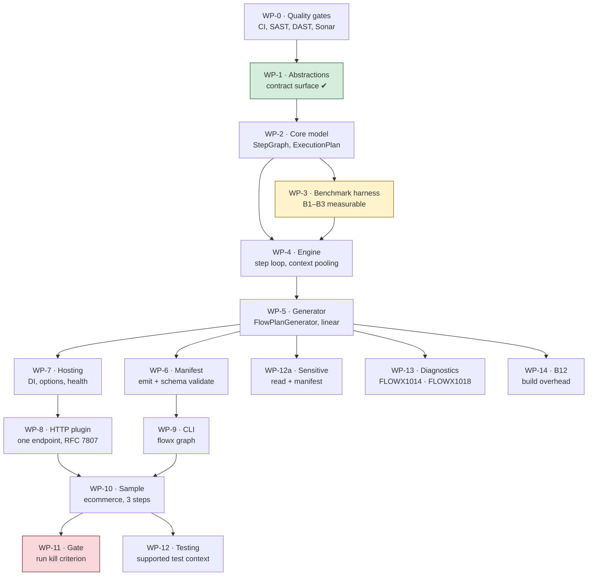

# Implementation Plan

> **Scope:** work-package detail for **P0 — Walking skeleton**, plus the entry
> criteria for P1. Phase-level planning lives in
> [docs/20-Roadmap.md](docs/20-Roadmap.md); this document is what a contributor
> picks work from.
>
> **Companion:** [CHECKLIST.md](CHECKLIST.md) carries live status and is updated
> with every change. This document changes only when the *plan* changes.

---

## 1. What P0 exists to prove

P0 is not "the foundation". It is a **falsification attempt** against the
platform's central bet, stated in
[ADR-0002](docs/adr/ADR-0002-compile-time-orchestration.md):

> A Roslyn source generator can emit an execution plan that is correct,
> debuggable, and fast enough that compile-time orchestration beats a
> reflection-based mediator by an order of magnitude.

Everything else in FlowX is downstream of that sentence. If it is false, the
right outcome for P0 is to **discover it in three weeks**, not to discover it in
month nine with eight phases built on top.

**Kill criterion (unchanged from the roadmap):** if generated dispatch cannot
reach **B1 ≤ 5 µs p99** and **B2 = 0 allocations**, stop. Do not proceed to P1.
Revisit ADR-0002 first.

---

## 2. Sequencing

**WP-3 is scheduled before the engine on purpose.** A performance budget that
becomes measurable only after the thing it constrains is built is a budget that
gets renegotiated instead of met. The benchmark harness measures an empty step
loop first, so every subsequent commit is measured against a number that already
exists.

---

## 3. Work packages

Each package states its goal, the tests written **first**, the deliverable, and
an exit criterion that is mechanically checkable.

### WP-0 — Quality gates and CI

| | |
|---|---|
| **Goal** | Every gate in [21-Quality-Gates](docs/21-Quality-Gates.md) runs before there is code to violate it |
| **Tests first** | n/a — this *is* the test infrastructure |
| **Deliverable** | `.github/workflows/ci.yml` (build, fitness, AOT, docs, attribution) · `security.yml` (CodeQL, Semgrep, Gitleaks, Trivy, SCA) · `quality.yml` (Sonar, coverage, Stryker) · `.github/dependabot.yml` · PR template with the Definition of Done |
| **Exit** | A deliberately introduced violation of each gate class is caught. Verified by pushing a throwaway branch per gate. |
| **Depends on** | — |

### WP-1 — Contract surface

| | |
|---|---|
| **Goal** | `FlowX.Abstractions` — what all user code and every plugin reference |
| **Tests first** | `AbstractionsHasNoDependencies`, `LayersPointInward`, `ContractSurfaceTests` |
| **Deliverable** | `Result<T>`, `Error`, `ErrorCategory`, `ICapability<,>`, `Flow<,>`, `IFlowBuilder<,>`, contexts, trigger attributes, `PolicySet` |
| **Exit** | Solution compiles with zero warnings; fitness functions green; zero package references |
| **Status** | **Done.** 0 warnings, 30/30 fitness tests, 47 behavioural tests |

### WP-2 — Core execution model

| | |
|---|---|
| **Goal** | The immutable data model an execution plan is made of. No I/O, no engine, no generator — just the shapes. |
| **Tests first** | `StepGraphTests` (construction, invariants) · `ExecutionPlanTests` (ordering, compensation stack) · `NoCyclicDependencies` |
| **Deliverable** | `FlowX.Core`: `StepGraph`, `StepNode`, `ExecutionPlan`, `CompensationStack`, `FlowDescriptor`, `CapabilityDescriptor`, `PolicyChain` |
| **Exit** | A three-step linear plan with one compensation is constructible, immutable, and asserts its own invariants. Mutation score ≥ 70 %. |
| **Depends on** | WP-1 |
| **Status** | **Done.** Built red → green; 58 tests; 98.5 % line / 95.6 % branch coverage. Mutation score not yet measured — Stryker is wired but unrun. |

### WP-3 — Benchmark harness *(before the engine — see §2)*

| | |
|---|---|
| **Goal** | B1, B2 and B3 are measurable and gated in CI against a committed baseline |
| **Tests first** | The benchmarks are the tests |
| **Deliverable** | `tests/FlowX.Benchmarks` with BenchmarkDotNet · `MemoryDiagnoser` with a hard-zero assertion for B2 · baseline JSON committed · CI job failing on > 5 % regression |
| **Exit** | `dotnet run -c Release --project tests/FlowX.Benchmarks` reports B1–B3; CI fails on an injected 10 % regression |
| **Depends on** | WP-2 |
| **Status** | **Done.** Gate verified by injecting a 64 B allocation regression — rejected, exit 1. Results: [docs/benchmarks](docs/benchmarks/README.md) |

### WP-4 — Flow engine

| | |
|---|---|
| **Goal** | The step loop: execute an `ExecutionPlan`, thread a pooled context, honour deadlines, unwind compensation on failure |
| **Tests first** | `FlowEngineTests` — happy path, failure path, compensation ordering (**strict reverse**), deadline expiry, cancellation propagation · `ContextPoolingTests` — zero allocation across N executions |
| **Deliverable** | `FlowX.Runtime`: `FlowEngine`, `CapabilityEngine`, pooled `FlowContext`/`CapabilityContext`, `IClock` |
| **Exit** | B2 = 0 allocations on a 4-step flow; compensation ordering proven by test, not by inspection |
| **Depends on** | WP-2, WP-3 |
| **Status** | **Done.** 0 B on a 4-step flow (592 B → 0 B after three fixes found by measurement); 28 tests including concurrency; B1 = 169 ns against a 5 000 ns budget |

### WP-5 — Source generator *(the risk)*

| | |
|---|---|
| **Goal** | Emit a compile-time `ExecutionPlan` from a `Define` method — linear steps only |
| **Tests first** | Generator **snapshot** tests (Verify) · `EmittedCodeIsDebuggable` (line directives present) · `EveryDiagnosticIsHelpful` · a golden-file test per DSL shape |
| **Deliverable** | `FlowX.Compiler`: `FlowPlanGenerator` (incremental), a syntax→model layer kept separate from emission, diagnostics FLOWX1001–1010 |
| **Exit** | The sample flow's plan is generated, readable, breakpoint-able; B1 ≤ 5 µs; build overhead ≤ 8 % on a 20-flow solution |
| **Risk** | **R1.** If the generator's model layer and emission layer blur together here, P1 becomes unmaintainable. Keep them separate from the first commit. |
| **Depends on** | WP-4 |
| **Status** | **Partial.** Generating end to end against a real compilation, exercised by the sample at WP-10. The diagnostics landed at WP-13 and budget B12 at WP-14. **Remaining: the branching DSL** — `When` / `Switch` / `Parallel` / `ForEach` / `SubFlow`. |

### WP-6 — Manifest emission

| | |
|---|---|
| **Goal** | `flowx.manifest.json` v0 emitted at build, validating against the committed schema |
| **Tests first** | `ManifestValidatesAgainstSchema` · `ManifestContainsNoSecrets` · `ManifestIsDeterministic` (same input → byte-identical output) |
| **Deliverable** | Manifest writer in `FlowX.Compiler`; schema already committed at `schemas/flowx.manifest.schema.json` |
| **Exit** | Sample build emits a manifest that validates; two consecutive builds are byte-identical |
| **Depends on** | WP-5 |
| **Status** | **Done.** Schema-valid against the committed schema with negative controls; byte-identical across runs and independent of flow discovery order. The on-disk file waits for the CLI at WP-9, because a generator must not do file IO. |

### WP-7 — Hosting and composition

| | |
|---|---|
| **Goal** | `AddFlowX()` wires generated registrations; configuration validated at **startup**, not first use |
| **Tests first** | `StartupValidationRejectsMisconfiguration` (A05) · `HealthCheckReportsReadiness` |
| **Deliverable** | `FlowX.Hosting`: DI extensions, options with validation, health checks, graceful shutdown draining |
| **Exit** | A misconfigured host refuses to start with a message naming the setting; in-flight flows drain on SIGTERM |
| **Status** | **Done.** 19 tests. Validation runs at startup rather than first use, reports every problem at once, and names each setting. Drain refuses new work, is bounded, and reports whether it succeeded. |
| **Depends on** | WP-5 |

### WP-8 — HTTP trigger plugin

| | |
|---|---|
| **Goal** | Generated endpoint, generated binder, generated OpenAPI, RFC 7807 errors |
| **Tests first** | `ErrorCategoryMapsToProblemDetails` (all six) · `IdempotencyKeyIsEnforced` · `TenantComesFromClaimsOnly` (A07) · `EgressIsAllowListed` (A10) |
| **Deliverable** | `plugins/FlowX.Http`: endpoint generation, model binding, Problem Details mapping, OpenAPI document |
| **Exit** | Sample serves `POST /api/v1/orders`; ZAP baseline scan clean; B9 measured |
| **Depends on** | WP-7 |
| **Status** | **Mostly done.** The endpoint serves over a real TestServer with RFC 7807 mapping and claims-only tenant resolution; 59 tests. Generated endpoints, OpenAPI, ZAP and B9 all wait for the sample at WP-10. |

### WP-9 — CLI

| | |
|---|---|
| **Goal** | `flowx graph` renders the manifest as Mermaid |
| **Tests first** | `GraphOutputIsValidMermaid` · `GraphIsDeterministic` |
| **Deliverable** | `FlowX.Cli` with the `graph` verb |
| **Exit** | Rendered graph of the sample parses with `mmdc` in CI |
| **Depends on** | WP-6 |
| **Status** | **Done.** Verified: `mmdc` renders the diagram to a 58 KB SVG, and the check is now a CI step. Also delivered `flowx manifest`, the on-disk artifact WP-6 deferred. |

### WP-10 — Reference sample

| | |
|---|---|
| **Goal** | `samples/ecommerce` runs a real 3-step ephemeral flow over HTTP |
| **Tests first** | End-to-end test hitting the endpoint · `CapabilityTestedWithoutHost` (proves quality goal Q2) |
| **Deliverable** | Four capabilities, one flow, one endpoint, 20 tests, README |
| **Exit** | `dotnet run` serves the endpoint; ZAP baseline clean; `flowx graph` renders it |
| **Depends on** | WP-8, WP-9 |
| **Status** | **Done**, bar the ZAP baseline. The endpoint serves the flow's declared output over HTTP and as a NativeAOT binary; `flowx graph` renders the sample's real manifest; 20 tests. |

**What the first consumer found.** The sample was the first code written against the
platform from outside it, and it found six defects that no test inside the platform
could have:

| Found | Was |
|---|---|
| `Result<T>` had no implicit conversions | The documented capability style did not compile. Restored; the `T = Error` collision is real but is a loud `CS0457`, not a silent mis-resolution. |
| Every step's `#line` directive pointed at the same line | A fluent chain nests its receiver, so each invocation's span starts at the head of the chain. A breakpoint on step three landed on step one. |
| `.Return(...)` was silently dropped | The flow declared an output type that nothing produced. The endpoint returned a step count. Now generated as a static projection. |
| `MapFlow` never read a request body | A flow whose first step binds to a contract had nothing to bind to. |
| `AddFlowX` registered the health-check **type**, not the check | `MapHealthChecks` threw at startup; with `AddHealthChecks` it returned a probe that never ran. |
| The manifest embedded an absolute source path | Broke the determinism ADR-0005 requires of it, and shipped the build agent's directory layout. |

Two more surfaced while getting the suite green:

- `.Emit<T>()` compiles into the plan and the manifest but publishes nothing. Now
  **FLOWX1024**, a warning — the only non-error diagnostic in the set — because the
  manifest promises consumers an event that does not arrive.
- The engine's allocation budgets are Release-only assertions that silently measured
  376 B of Debug scaffolding. CI runs Release and never saw it; every contributor
  running `dotnet test` did. Now skipped in Debug with the reason.

### WP-11 — P0 gate: run the kill criterion

| | |
|---|---|
| **Goal** | Answer the question P0 was built to answer |
| **Deliverable** | A benchmark report committed to `docs/benchmarks/P0.md` with the measured numbers, the hardware, and an explicit **pass/fail against ADR-0002** |
| **Exit** | B1 ≤ 5 µs **and** B2 = 0 → proceed to P1. Otherwise → stop, write the ADR that supersedes ADR-0002, and re-plan. |
| **Depends on** | WP-10 |
| **Status** | **Done. PASS.** B1 = **172.3 ns** against 5 000 ns (29× margin); B2 = **0 B** exactly. Report at [docs/benchmarks/P0.md](docs/benchmarks/P0.md); baseline re-recorded at 10 warmups / 30 iterations. |

**P0 proceeds to P1.** ADR-0002 stands: the compiled path delivers the budget it was
chosen for.

The hardware is still shared, which was open item 5 against this work package. The
report answers that head-on rather than deferring: the measured margin is 29×, the
worst run-to-run variance ever observed on this container is a factor of 2.6, and 2.6
does not close 29. Where the hardware genuinely is not good enough — the 10–30 %
ratio comparisons in `DispatchBenchmarks` — the report says so and does not lean on
them. Open item 5 is closed on that reasoning, not on new hardware.

Two things the report explicitly does **not** claim:

- **Not a p99 in the strict sense.** BenchmarkDotNet's percentiles are over iteration
  means, not individual operations, and at ~170 ns a single operation cannot be timed
  without the timer costing more than the work. The worst iteration mean was 184.8 ns;
  a true operation-level p99 would have to be 27× the mean to breach the budget, and
  the usual cause of a tail that shape is a GC pause, which a zero-allocation path
  does not create.
- **Not a retirement of risk R1.** This measures runtime performance; R1 is generator
  maintenance cost. Build overhead (**budget B12**) was measured at WP-14 and
  **passes at +0.4 %** — see [B12.md](docs/benchmarks/B12.md). The defect-count half of
  the clause is still not tracked.

### WP-12a — `[Sensitive]` is declared and unread

| | |
|---|---|
| **Goal** | The attribute does something |
| **Why** | `[Sensitive]` exists on the contract surface and the sample applies it to `PlaceOrder.PaymentToken`. The compiler never reads it: it is absent from the manifest, and no redaction is generated. An attribute that looks like a control and is not one is worse than no attribute — a reviewer sees the token marked and concludes it is handled. Found while checking the OWASP A02 row in `CHECKLIST.md`, which claimed it reached the manifest. It does not. |
| **Tests first** | A test asserting a sensitive member is absent from any emitted log or error payload · a manifest test asserting the field is marked |
| **Deliverable** | `CapabilityReader` reads `[Sensitive]`; the manifest records it; the generator emits redaction for it |
| **Exit** | A flow whose input carries a sensitive member cannot emit that member's value into a log record, a `Problem Details` extension, or a trace attribute |
| **Depends on** | WP-5 |
| **Status** | **Done for the one path that exists.** The compiler reads the attribute in both spellings, the manifest carries a `sensitive` array per contract, and the flow's partial class carries `SensitiveMembers`. The HTTP endpoint replaces matching structured error detail with `[redacted]` before writing the body — proven end to end with a dispatcher that deliberately attaches a secret. |

The attribute previously documented itself as "applied by the generated serialiser… with
no code path able to bypass it", while nothing read it at all. An attribute that reads as
a control while doing nothing is worse than no attribute: a reviewer sees the field
marked and concludes it is handled.

**The exit criterion named three sinks — a log record, a Problem Details extension, and a
trace attribute. Only the second exists.** There is no logging scope, no journal and no
replay view in this release, so there is nothing else to redact from. The criterion is
met for the sink that exists and cannot be met for the two that do not; both the
attribute's remarks and [12-Observability §4](docs/12-Observability.md) say so in those
words rather than implying coverage the release does not have. The remaining sinks arrive
with the observability work in P3 and re-open this.

Redaction matches by member name, case-insensitively, because the wire contract is
camelCase and the member is PascalCase — a capability writing `.With("paymentToken", …)`
is naming `PlaceOrder.PaymentToken`, and a case-sensitive match would let through exactly
the spelling people write. The value is replaced with `[redacted]` rather than dropped: a
key that silently vanishes reads as a field the server never received.

**Also found and fixed while here:** the manifest listed a compensation only as a name
on the step it undoes. `inventory.release` had no entry in `capabilities`, so its
authorisation stance (`Internal`), its side effects and its idempotency reached
nothing, and `flowx diff` could not have seen a breaking change to one. A compensation
is a capability that happens to run backwards; `StepModel.Compensation` is now a whole
`StepModel` rather than three loose strings, and the manifest lists it.

### WP-14 — Budget B12: build overhead

| | |
|---|---|
| **Goal** | Measure the number ADR-0002's revisit clause depends on |
| **Why** | ADR-0002 says to revisit the whole compile-time decision when *"build overhead > 8 % sustained"*. Nothing measured build overhead, so the clause could never have fired. The budget was declared in [14-Performance §1](docs/14-Performance.md) and left unmeasured through P0. |
| **Tests first** | The benchmark itself is the test; committed to the baseline like every other budget |
| **Deliverable** | `CompilerBenchmarks` (the file [14-Performance §7](docs/14-Performance.md) already named for B12) and a report |
| **Exit** | A number for build overhead, with an explicit pass or fail against 8 % |
| **Depends on** | WP-5 |
| **Status** | **Done. PASS at +0.4 % against a +8 % budget.** Report at [docs/benchmarks/B12.md](docs/benchmarks/B12.md). |

**It took two measurements, and the first one was the wrong shape.**

`CompilerBenchmarks` prices the generator in isolation at **~2.9 ms** per compilation
containing one flow. That number is real and committed to the baseline, but it is not a
build-overhead ratio: its control compiled a file with no plan and no dispatcher in it,
so most of the difference was binding code the control did not contain — work an
application written without FlowX would have hand-written and paid for anyway. Reporting
that ratio as build overhead would have overstated the cost by more than an order of
magnitude, which is the same class of claim WP-10 through WP-13 spent their time
removing. It was written up as *not settling the budget*, with what would settle it
spelled out.

`scripts/measure-build-overhead.sh` then did that: two builds of the reference sample
producing the **same final compilation**, differing only in whether the generator ran.
`Ecommerce.csproj` carries an MSBuild condition (`FlowXGeneratorDisabled`) that drops the
analyzer and compiles the previously generated sources as ordinary files, so the sample
genuinely builds both ways.

Over 15 alternating rounds: **2 613 ms with, 2 603 ms without — +0.4 % against a +8 %
budget.** The result is legible from the isolated number: ~3 ms of generator against a
~2.6 s project build is about a tenth of a percent.

**The report states what the figure cannot support.** The two arms' ranges overlap and
the within-arm spread is 14 %, so this cannot distinguish +0.4 % from −0.4 %. It is
evidence that the overhead is nowhere near 8 %, not evidence that it is exactly 0.4 %.
Sharpening it needs dedicated hardware, and no decision waits on the difference between
0.4 % and 2 %.

### WP-13 — The diagnostics that were documented and never raised

| | |
|---|---|
| **Goal** | Every diagnostic the docs call a compile error is one |
| **Why** | `FLOWX1014` — "a retry policy on a non-idempotent capability is a compile error" — is the safety property this repository advertises most loudly. `07-Capability-Model.md` said *"FlowX will not let you retry something that is unsafe to retry"*; the diagnostics index listed it as preventing **a duplicate charge**; the sample README told the reader to try it. Nothing raised it. `.WithPolicy(...)` stored the argument's source text, so no rule could ask what was in the set. `FLOWX1018` was in the same state. |
| **Tests first** | A generator test per rule, both directions · the sample itself, built with a Retry attached to `payment.capture` |
| **Deliverable** | `PolicySetReader` resolves a named set to the policies it declares; `FLOWX1014` and `FLOWX1018` raised; policies reach the manifest |
| **Exit** | Adding `.WithPolicy(retry)` to the sample's `CapturePayment` fails the build with `FLOWX1014` |
| **Depends on** | WP-5 |
| **Status** | **Done.** All four are raised, tested in both directions, and verified against the real sample rather than only the harness. Every diagnostic the docs call a compile error now is one. |

A policy set is declared as a fluent chain, so reading one is the same problem as
reading a `Define` body and reuses the same `FlowChainWalker`. A set that is not a field
or property initialiser — one built by a method call — cannot be inspected at compile
time, and the reader returns nothing rather than guessing: a diagnostic derived from a
guess is one nobody can act on.

The manifest now carries each step's policies, which the schema had declared and the
writer had never emitted. That required duplicating the kind-to-stage mapping into the
compiler, because it targets netstandard2.0 and cannot reference `FlowX.Abstractions`.
An unpinned copy of a safety ordering is exactly what drifts silently, so
`PolicyStagesMatchTheAbstraction` reads the real mapping by reflection and fails on any
disagreement, in both directions. It was verified by changing one entry and watching it
fail.

`FLOWX1003` and `FLOWX1004` needed a `DiagnosticAnalyzer` rather than more generator
work, because they read a capability's dependencies and no flow mentions those. Being an
analyzer also means they apply to every capability in the compilation, including one no
flow has a step for yet — a capability that violates Q4 is wrong whether or not anything
calls it. Generic wrappers are unwrapped, so a single `Lazy<>` cannot defeat either rule,
and the generated dispatcher is exempt because it legitimately holds every capability its
flow invokes.

**`FLOWX1003` has a limit, and the page says so.** It matches a list of transport
namespaces; there is no general way to recognise a transport. The sound alternative is an
attribute applied by transport authors, which is worth nothing until they adopt it. A
clean build means "no *known* transport", not proof, and the documentation says that
rather than implying coverage it does not have.

### WP-12 — A supported test context

| | |
|---|---|
| **Goal** | Constructing a `CapabilityContext` in a test costs one line, not nine |
| **Why** | Quality goal Q2 says a capability is testable by constructing it and calling it. It is — but `CapabilityContext` is abstract with nine members, so every consumer hand-writes the same stub. `tests/Ecommerce.Tests/CapabilityTests.cs` carries one; so will everybody else's first test file. Ceremony that every user pays is a platform defect, not a user problem. |
| **Tests first** | The sample's own capability tests, rewritten against it — if they do not get shorter, it is not worth shipping |
| **Deliverable** | `FlowX.Testing` with a context builder: fixed clock, fixed ids, seeded `Random`, overridable per test |
| **Exit** | `CapabilityTests` constructs its context in one expression and still pins every value it pins today |
| **Depends on** | WP-10 |
| **Status** | **Done.** `TestCapabilityContext` and `TestFlowContext` ship from `src/FlowX.Testing`; 30 tests. The sample's `CapabilityTests` builds its context in one expression and lost 27 lines of stub, pinning everything it pinned before. |

`TestFlowContext` was not in the original deliverable and is the more useful half. A
generated step dispatcher and a `.Return(...)` projection are ordinary methods that take
a `FlowContext`, so with a working typed bag they can be called directly — no engine, no
plan, no host. `Fail(error)` puts the context into the state a compensation actually
meets, which is otherwise unreachable.

**Also found and fixed while here:** `LayersPointInward` enumerates its projects in
hand-written `[InlineData]` rows, so adding `FlowX.Testing` created a `src/` project that
no fitness function checked — it could have referenced anything at all and the theory
would have passed without looking at it. `EverySourceProjectIsCoveredByTheLayeringRule`
now fails on any unlisted project; it was verified by deleting the row and watching it
fail. A rule with a hand-maintained subject list needs a rule about the list.

**Not shipped, and now said so in the docs:** [19-SDK §6](docs/19-SDK.md) described a
`FlowTestHost` with capability substitution, virtual time, crash simulation and a Kafka
integration harness. None of it exists. The section now separates what ships from what
is intended, rather than reading as a description of the current package.

---

## 4. Definition of Ready

A work package may start only when all are true. This prevents the most common
failure mode in a spec-heavy project: building something the spec describes but
nobody can verify.

- [ ] Its exit criterion is mechanically checkable (a command, not a judgement)
- [ ] Its tests-first artifacts are named
- [ ] Its dependencies are complete
- [ ] The documentation section it implements is identified

---

## 5. Estimation and staffing

Deliberately absent. This is a specification-driven project with one
contributor's throughput unknown; a date column here would be fiction, and
fiction in a plan is worse than a blank. Sequencing and exit criteria are the
real content — they hold regardless of pace.

The [roadmap gantt](docs/20-Roadmap.md) carries indicative durations for
phase-level planning only.

---

## 6. Open items blocking the plan

| # | Item | Blocks | Owner |
|---|---|---|---|
| 1 | Three infographic PNGs must be committed to `docs/assets/` — see [the asset manifest](docs/assets/README.md) | CI `docs` job | repository owner |
| 2 | ~~Never compiled~~ **Resolved.** SDK 10.0.110 installs from the Ubuntu archive; the official installer hosts are proxy-blocked but `packages.microsoft.com` is not | — | — |
| 3 | ~~Stray `claude/` branch on the remote~~ **Resolved.** Deleted | — | — |
| 4 | `SONAR_TOKEN` repository secret not configured; the `sonar` job no-ops without it | Sonar gate | repository owner |
| 5 | ~~Benchmarks recorded on shared container hardware with 10 iterations~~ **Resolved at WP-11**, without dedicated hardware. Re-recorded at 30 iterations; the 29× margin is ~11× clear of the worst observed noise factor (2.6×), and [P0.md §5](docs/benchmarks/P0.md) argues the case rather than assuming it. Timing figures remain advisory in the baseline | — | — |

Item 1 is the only one blocking a green CI run.

---

**Back to:** [README](README.md) · [Checklist](CHECKLIST.md) · [Roadmap](docs/20-Roadmap.md) · [Quality gates](docs/21-Quality-Gates.md)
