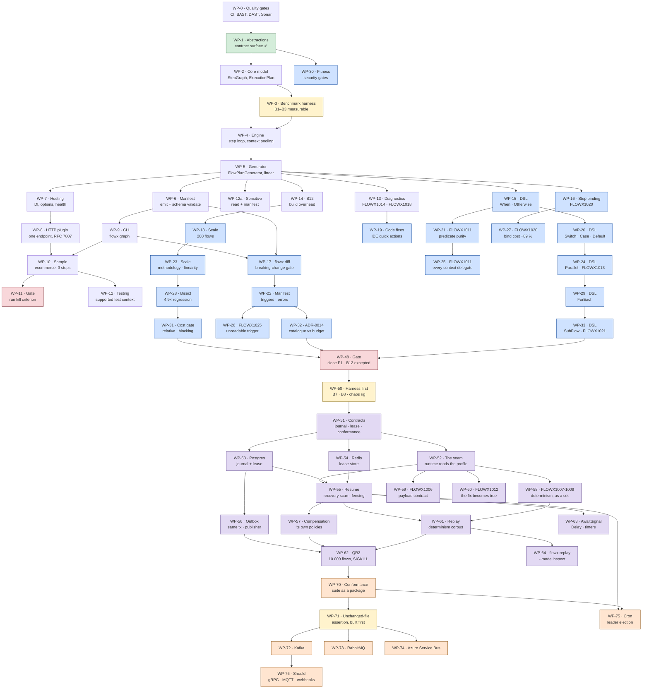

# Implementation Plan

> **Scope:** work-package detail for the phases in
> [docs/20-Roadmap.md](docs/20-Roadmap.md). The roadmap says what each phase must
> prove and when it is done; this document is what a contributor picks work from.
>
> **Companion:** [CHECKLIST.md](CHECKLIST.md) carries live status and is updated
> with every change. This document changes only when the *plan* changes.
>
> **Where we are:** **P0 is complete and passed its kill criterion** (B1 172 ns
> against 5 µs, B2 zero — [P0.md](docs/benchmarks/P0.md)). **P1 — Compiler hardening
> is closed with one exit criterion unmet and accepted** — the build-overhead
> budget, at **+67.1 %** against ≤ 8 %; see [§4](#4-p1--compiler-hardening), which
> states the exception before it states anything else. **P2 — Durable execution is
> in progress**: WP-51, WP-52, WP-53, WP-55 and WP-58 have shipped, WP-50 has not
> started, and [§5](#5-p2--durable-execution) carries the rest.
> [§6](#6-p3--transport-breadth) sketches P3, and
> [§6a](#6a-p4p9--what-this-plan-does-not-yet-contain) says plainly what this plan
> does not yet contain.
>
> **This plan is downstream of a vision, and [§1.1](#11-what-this-plan-is-held-to)
> is where it says so.** Until 2026-07-31 neither this file nor the checklist
> mentioned criteria **V1–V8** or quality goals **Q1–Q8** even once, while
> [P9's Done-when](docs/20-Roadmap.md#p9--hardening-and-10) is *"criteria V1–V8 are
> all met and gated in CI"*. A plan that never names its own terminal condition
> cannot be checked against it.

---

## 1. What P0 exists to prove

P0 is not "the foundation". It is a **falsification attempt** against the
platform's central bet, stated in
[ADR-0002](docs/adr/ADR-0002-compile-time-orchestration.md):

> A Roslyn source generator can emit an execution plan that is correct,
> debuggable, and fast enough that compile-time orchestration beats a
> reflection-based mediator by an order of magnitude.

Everything else in FlowX is downstream of that sentence. If it is false, the
right outcome for P0 is to **discover it in three weeks**, not to discover it in
month nine with eight phases built on top.

**Kill criterion (unchanged from the roadmap):** if generated dispatch cannot
reach **B1 ≤ 5 µs p99** and **B2 = 0 allocations**, stop. Do not proceed to P1.
Revisit ADR-0002 first.

> **The kill criterion passed and ADR-0002's *other* trigger has since fired.** That
> record's revisit condition is "> 3 generator defects per delivery phase, **or build
> overhead > 8 % sustained**". Build overhead is +67.1 % at 200 flows, sustained across
> two independent measurement campaigns. **ADR-0002 does not say so** — it is marked
> Accepted with no note, and the sentence above is the only place in the repository that
> connects the number to the record it is supposed to reopen.
> [ADR-0014](docs/adr/ADR-0014-derived-error-catalogue-vs-build-budget.md) exists to put
> the resulting choice in front of a decider and remains **Proposed**. **It is no longer
> tracked as an open item**: the repository owner removed it from §9 on 2026-07-31, which
> is a decision to leave the choice unmade rather than an oversight, and consistent with
> performance being set aside for this phase. The amendment ADR-0002 owed itself was
> [open item 11](#9-open-items-blocking-the-plan), and **was made on 2026-07-31** — that
> record now carries a status note naming the fired clause. *This sentence pointed at open
> item 9, which is the licence scan. A cross-reference to the wrong row is the same defect
> as a stale number, and it was in the paragraph arguing for accurate cross-references.*

---

## 1.1 What this plan is held to

Two sets of numbers define success, and neither was named anywhere in this file or the
checklist until 2026-07-31. They are reproduced here **with their real current state**, so
that a phase cannot be closed against a criterion nobody looked up.

### The vision's success criteria — [01 §7](docs/01-Vision.md#7-measurable-success-criteria)

P9 closes when all eight are met **and gated in CI**. Gated matters: three of the rows
below are satisfiable today and measured by nothing that can fail a build.

| # | Criterion | State | Owed to |
|---|---|---|---|
| **V1** | ≤ 3 files, ≤ 60 lines for a 4-step flow | **met, not gated.** A review, never automated; endpoint generation cut the sample's registration from 12 lines to 2, which moved the number and no assertion noticed | a fitness test, unscheduled |
| **V2** | HTTP → Kafka is an attribute change, zero logic edits | **not met.** One transport exists | WP-71 (the unchanged-file assertion), WP-72 |
| **V3** | p99 ≤ 5 µs, ≤ 1 alloc/step | **met and gated.** 172.3 ns against 5 000 ns; B2 exactly 0 B, re-verified after the durable seam | — |
| **V4** | durable checkpoint p99 ≤ 15 ms @ 5 000 flows/s/node, Postgres | **unreported.** *01 §7 says "there is no journal to checkpoint into"; since WP-53 there is.* What is missing is now only the harness | **WP-50** |
| **V5** | cold start ≤ 200 ms, NativeAOT | **unreported.** The AOT job proves the binary links and serves a request; nothing times it | P9 |
| **V6** | build overhead ≤ 8 % | **failing, and *not* gated in the sense P9 requires.** +67.1 % [+61.9, +73.6] at 200 flows. The `scale-overhead` job measures the criterion and is **advisory** — its effect on a pull request is suppressed by an explicit [ADR-0014](docs/adr/ADR-0014-derived-error-catalogue-vs-build-budget.md) §4(4) commitment, because a gate you already fail reds every PR over a defect none of them introduced. The blocking cost gate (`generator-cost`) is *relative*: it answers "did this change make it worse", never "is the build fast enough". **This row said "failing and gated" when first written on 2026-07-31 — copied from `01 §7`'s prose without reading `performance.yml`, which is the exact error this table exists to catch** | ADR-0014's decision |
| **V7** | 100 % of flows, capabilities, **policies and events** in the manifest | **partly met.** `ManifestIsComplete` covers flows and capabilities; the policies-and-events half is checked by nothing, because neither executes yet | P4, WP-56 |
| **V8** | a mid-level engineer ships a correct flow in ≤ 2 h, n ≥ 10 | **not run** | P9 |

**One met and gated. One failing, measured, and deliberately not blocking. Six unverified.**
That ratio is the honest summary of where the platform stands against its own definition of
success, and it belongs at the top of the plan rather than in a document nobody opens
mid-phase.

> **"Gated" is the word to be careful with, and this table got it wrong on its first
> draft.** P9's Done-when is *"V1–V8 are all met **and gated in CI**"*, so a criterion that
> is satisfied but unenforced does not close P9 — and one that is measured by an advisory
> job is not gated either. Exactly one of the eight (V3) is enforced by a check that can
> fail a build.

### The constraints — [05 §2](docs/05-Architecture.md#2-constraints)

Constraints are not goals: nothing is traded against them, they simply hold or the design is
wrong. Until 2026-07-31 only `C2` was named in this file, once, and only as an obstacle.

| # | Constraint | Enforced by |
|---|---|---|
| **C1** | .NET 10+, C# 14 | the SDK pin; `global.json` |
| **C2** | NativeAOT | the AOT job + `IsAotCompatible` analyzers |
| **C3** | hosts inside ASP.NET Core | nothing explicit. `FlowX.Hosting` is written to it; no test asserts the process lifecycle is not owned |
| **C4** | no 2-phase commit | nothing. Held by design — one transaction per store — and the outbox that makes it correct is WP-56 |
| **C5** | OpenTelemetry only | vacuous today: no telemetry of any kind is emitted (P5) |
| **C6** | Apache-2.0, no copyleft | `DependencyLicencesAreCompatible` in `DependencyLicenceTests`, against the [dependency licence register](docs/DEPENDENCIES.md). Covers the *resolved* transitive graph, not only what is declared — NuGet writes it to `obj/project.assets.json` and every package's `.nuspec` is on disk beside it, so the scan needs no network. **Findings on the first run: `Npgsql` (WP-53, unvetted until now) is the PostgreSQL Licence and permissive; `SonarAnalyzer.CSharp` is *not* MIT but the SONAR Source-Available Licence, and `Microsoft.NETCore.Platforms` 1.1.0 is a proprietary Microsoft EULA — both tolerated only because the resolved graph proves they contribute no assembly.** [What the gate cannot see](docs/DEPENDENCIES.md#3-what-this-gate-cannot-see) is written down, including the three projects outside `FlowX.slnx` whose closure is unread |
| **C7** | SemVer, 2-minor deprecation window | `flowx diff` detects breaking changes. **The deprecation *window* is enforced by nothing** — nothing tracks how long a member has been obsolete |
| **C8** | documentation-first | convention only. Held well in practice; no gate |

**Two of eight constraints have an enforcing gate.** For C1–C5 and C8 that is mostly
appropriate — a constraint held by construction needs no test. `C6` and `C7` were the two
where "nothing enforces it" was a real exposure rather than a formality; `C6` now has a
gate, and `C7` is the one left.

### The architecture's quality goals — [05 §1.2](docs/05-Architecture.md#12-quality-goals-measurable--arc42-12)

Q1–Q3 are the *architecture-defining* goals: 05 §1.2 requires an ADR wherever a design
choice trades one away.

| # | Goal | Where it is enforced today |
|---|---|---|
| **Q1** | predictable low latency | `EngineAllocationTests` (hard zero) + B1/B2 in CI. **The only goal with a gate that has ever failed a build** |
| **Q2** | durable correctness | conformance suite against real Postgres; lease + recovery scan. **The measure — p99 ≤ 15 ms — is unmeasured** (WP-50), and the *scenario* (a node killed mid-flow) has never been executed: WP-62 kills nothing yet |
| **Q3** | static knowability | `ManifestIsComplete`, `flowx diff`, the error catalogue. Same half-gap as V7 |
| **Q4** | transport portability | nothing. One transport (WP-72) |
| **Q5** | operational uniformity | nothing. No `ActivitySource`, no `Meter`, no exporter (P5) |
| **Q6** | extensibility | `RuntimeDoesNotReferenceAnyPlugin` + `PluginsPassConformance` (**blocked**). `plugins/FlowX.Postgres` is the first outside implementation to push back on a contract |
| **Q7** | startup and footprint | nothing. Same gap as V5 |
| **Q8** | multi-tenant isolation | nothing. `CrossTenantAccessIsDenied` is blocked on P4 and P3 |

**Q1 is the only quality goal with an enforcing gate that has ever failed a build.** Every
other row is either a test that cannot fail yet or an empty cell. That is expected this
early and it is not the same thing as being met, which is why this table says which is
which.

---

## 2. Sequencing

WP-0 through WP-14 are P0 (complete); WP-15 through WP-47 are **P1**, in blue; WP-50
onward are **P2**, in purple, and WP-70 onward **P3**, in orange. The DSL chain
WP-15 → 20 → 24 → 29 → 33 is **complete**: all five shapes the roadmap's full-DSL Must
names now ship. **WP-48 is a phase gate**, red like WP-11: P0's gate answered a kill
criterion, P1's records which criterion it is closing over.

> [!IMPORTANT]
> **Work-package numbers here are the only authoritative ones, and they were collided
> with — twice, and the second time after the warning was written.** Packages executed
> after P1 closed were labelled WP-49, WP-70, WP-71, WP-72 and WP-73 by the orchestration
> that ran them, while this file already reserved WP-70–WP-76 for P3's transports. The
> work is recorded under what it *did* — the `[TriggerKind]` marker is the abstraction
> half of WP-70 landing early; the rest were unnumbered maintenance — and **the P3
> numbers below are unchanged**.
>
> **Then it happened again.** Generated HTTP endpoint registration was executed as
> "WP-74", which this file reserves for Azure Service Bus. It is recorded below as
> **endpoint generation**, without a number, and WP-74 still means Azure Service Bus.
> That this recurred *after* the rule below was written is the more useful finding than
> the collision itself: a warning in a document does not allocate anything, and the next
> honest step is a check that fails rather than a paragraph that asks.
>
> This class of collision started with two diagnostics authored against `FLOWX1028` in
> separate branches on the same day, both having correctly read the index's next-free id.
> The rule `docs/diagnostics/README.md` adopted then applies here too: **claim the number
> in this file first, in its own commit, before doing the work.** Reading "the next free
> number" is not enough when someone else is reading it at the same time.
>
> **It happened a fourth time on 2026-07-31, and the fourth one shows the rule cannot work
> as written.** Two records were authored as **ADR-0017** — the manifest-freeze criteria
> and the outbox publication decision — in separate worktrees, from the same base commit,
> on the same day. **Both authors followed the rule.** Both claimed the number in
> `docs/adr/README.md` in its own commit first, exactly as instructed; they simply claimed
> it from the same starting point, so neither claim was visible to the other. The outbox
> record was renumbered to **ADR-0018** at merge.
>
> A claim-first rule serialises nothing when the claimants branch from one commit. This is
> not a discipline failure to be re-taught — it is the third time the instruction has been
> followed and the collision has happened anyway. **The fix is a check that fails, not
> another paragraph asking for care**: a duplicated id across the reachable history is
> mechanically detectable, and detecting it at merge is what all four collisions needed and
> none had.
>
> **That check now exists.** `IdentifierAllocationTests` in `tests/FlowX.Architecture.Tests`
> fails the build when an identifier is allocated twice, across all three families that have
> collided: ADR numbers, `FLOWX` diagnostic ids and the work-package numbers this file
> allocates. For work packages it reads **this file and nothing else** — a definition site is
> a `### WP-…` heading or a `| **WP-…** —` row of a phase's package table — and it asserts
> three things: no number defines two packages; every package sits inside the range its
> phase reserved, read from the sentence below and from [§6a](#6a-p4p9--what-this-plan-does-not-yet-contain)'s
> allocator table; and no two phases reserve the same numbers. The middle one is the rule
> WP-70 to WP-74 needed — none of those *duplicated* a number that had been spent, they took
> numbers a later phase was holding, which no duplicate check can see.
>
> **What it catches, stated so nobody relies on more:** a duplicate present in one working
> tree — a merge, a rebase onto the branch that took the number first, or one author writing
> both halves. **It cannot see a duplicate that exists only across two unmerged branches.** A
> test sees the tree it was built from; asking git about the other claim would need a ref
> this checkout does not have, and "which branches are live" is not a fact on disk. So it
> reports at the merge — which is exactly where all four of these were found by a human, and
> the only thing that was missing was a check that read it first.
>
> Claiming the number in this file before the work starts is still the instruction, and it is
> still worth following: it makes the collision visible in a one-line diff instead of in a
> finished package. What has changed is that following it is no longer the only thing
> standing between two branches and a number that means two things.

**The two yellow nodes are the same node WP-3 was.** WP-50 and WP-71 are harnesses
scheduled ahead of the things they measure, for the reason §2 has stated since P0 and
which P1 then proved the hard way — see [below](#the-lesson-b12-taught-twice).

**P2 numbering starts at WP-50, and the gap is deliberate.** WP-45 to WP-49 belong to
P1's close — WP-48 is this document's own package — and several are in flight on parallel
branches as this is written. Two rules were once authored against `FLOWX1028`
simultaneously in separate branches and collided at merge, which is why the diagnostics
index now requires an id to be claimed in one file, in its own commit, before the rule is
written. A work-package number is the same kind of object, and this file is where it is
claimed.

**This diagram stopped at WP-19 for most of P1 and was wrong the whole time.** It is
recorded here rather than quietly corrected, because the failure is the same one the
phase keeps finding elsewhere: a document that describes the plan as it was conceived
rather than as it is executed stops being read, and then stops being maintained. P1
grew from five packages to nineteen — the extra fourteen were not scope creep but work
each package *surfaced*, and a sequencing diagram that cannot show that is not a plan.

**The DSL chain is strictly sequential** (WP-15 → 20 → 24 → 29 → 33): every shape
touches the builder, the model, the analyzer, the emitter, `StepGraph` and the engine,
so no two can be built concurrently without fighting over the same six files. Everything
else in P1 ran in parallel batches of four, chosen for disjoint file ownership.

**Three chains exist because one package kept exposing the next.** WP-18 measured the
scale criterion and got a number its own noise swallowed; WP-23 rebuilt the methodology;
WP-28 bisected the 4.9× regression WP-23's numbers exposed; WP-31 built the gate that
would have caught it on the commit that caused it. Similarly WP-21 raised `FLOWX1011`
for `When` only, and WP-25 existed because WP-20 immediately added a second construct
under the identical rule.

**WP-3 is scheduled before the engine on purpose.** A performance budget that
becomes measurable only after the thing it constrains is built is a budget that
gets renegotiated instead of met. The benchmark harness measures an empty step
loop first, so every subsequent commit is measured against a number that already
exists.

### The lesson B12 taught twice

That sentence about WP-3 was written as a principle. **P1 then supplied the
counterexample, and it is the reason this phase closes over an unmet criterion.**

B12 — build overhead ≤ 8 % — was declared in [14-Performance §1](docs/14-Performance.md)
and had no harness through the whole of P0. Nothing measured it until WP-14, by which
point the generator existed; nothing measured it *at realistic scale* until WP-18, by
which point five DSL shapes and the derived error catalogue existed. The first honest
number arrived at **+18.4 %** and the current one is **+67.1 %**. The budget was never
renegotiated in words — it is renegotiated in fact, by being carried as an exception at
[§4](#4-p1--compiler-hardening). A 4.9× regression also merged in silence across four
packages, because the only gate was absolute and the absolute gate was already red.

**P2's budgets are in exactly the position B12 was in.** B7 (durable step commit, p99
15 ms at 5 000 commits/s/node) and B8 (rehydration p99 8 ms) are stated in
[14 §1](docs/14-Performance.md) and measured by nothing: `JournalBenchmarks` does not
exist, and [14 §8](docs/14-Performance.md#8-benchmark-suite-and-ci-gating) says so
plainly. QR2 — P2's entire Done-when — has no rig either. So **WP-50 comes first**, and
its exit criterion is a committed baseline and a chaos verdict produced *before* there is
a journal to measure. What can be measured before the journal exists is not nothing: the
store's commit latency under the exact transaction shape
[11 §5](docs/11-Distributed-Runtime.md#5-the-transactional-outbox) specifies is a property
of Postgres, not of FlowX, and the chaos rig run against today's ephemeral engine should
report **10 000 lost instances** — the honest floor QR2 is measured against. That is the
same move WP-3 made with an empty step loop.

### What can run concurrently in P2, from file ownership

The DSL chain was sequential because of files, not caution: every shape touched the
builder, the model, the analyzer, the emitter, `StepGraph` and the engine. P2 splits the
same way, and the split is legible before any of it is written.

| Cannot run concurrently | Because |
|---|---|
| WP-51 → WP-52 → WP-55 → WP-61 → WP-62 | All four land in `src/FlowX.Runtime` — `FlowEngine.cs`, `FlowExecutionContext.cs`, `ContextPool.cs` — plus `ExecutionPlan.cs` in `FlowX.Core`. That is five files and it is the DSL chain's problem exactly. WP-52 also edits the analyzer, two ADRs, three docs and deletes a fitness test; two packages doing that at once merge badly |
| WP-57 after WP-55 | Compensation across a resume is a property of the resumed loop, not an addition to it. Written first, it is written against a loop that cannot yet resume |

| Can run concurrently | Because |
|---|---|
| WP-53 ∥ WP-54 | Two new plugin projects, no shared source. They share the conformance suite **read-only**, which is what makes a conformance suite worth writing first |
| WP-56 ∥ WP-55 | The outbox is a table, a publisher and a transaction boundary; once WP-51 fixes the schema, it touches the Postgres adapter and its own project, not the engine |
| WP-58 ∥ WP-59 ∥ WP-60, **conditionally** | Three diagnostics in three different files under `src/FlowX.Compiler/Analysis` — but all three touch `FlowXDiagnostics.cs`, `AnalyzerReleases.Unshipped.md` and `docs/diagnostics/README.md`. Three shared files is the six-file problem in miniature. They parallelise **only** if the ids are claimed in the diagnostics index first, in one commit, which is the rule that file already carries after two rules collided on `FLOWX1028` |
| WP-63 ∥ WP-64 | A scheduler and a CLI verb; disjoint projects, both reading the journal contract |

**WP-50 is the only package that can start immediately**, because it is the only one that
touches nothing under `src/`.

---

## 3. P0 — Walking skeleton · work packages

**Complete.** The kill criterion passed at WP-11 and the phase's exit criteria are
met; see [CHECKLIST.md](CHECKLIST.md) for live status. WP-12 through WP-14 are
overruns — work P0 turned out to need once the reference sample was written, kept
here with the phase that produced them rather than renumbered into P1.

Each package states its goal, the tests written **first**, the deliverable, and
an exit criterion that is mechanically checkable.

### WP-0 — Quality gates and CI

| | |
|---|---|
| **Goal** | Every gate in [21-Quality-Gates](docs/21-Quality-Gates.md) runs before there is code to violate it |
| **Tests first** | n/a — this *is* the test infrastructure |
| **Deliverable** | `.github/workflows/ci.yml` (build, fitness, AOT, docs, attribution) · `security.yml` (CodeQL, Semgrep, Gitleaks, Trivy, SCA) · `quality.yml` (Sonar, coverage, Stryker) · `.github/dependabot.yml` · PR template with the Definition of Done |
| **Exit** | A deliberately introduced violation of each gate class is caught. Verified by pushing a throwaway branch per gate. |
| **Depends on** | — |

### WP-1 — Contract surface

| | |
|---|---|
| **Goal** | `FlowX.Abstractions` — what all user code and every plugin reference |
| **Tests first** | `AbstractionsHasNoDependencies`, `LayersPointInward`, `ContractSurfaceTests` |
| **Deliverable** | `Result<T>`, `Error`, `ErrorCategory`, `ICapability<,>`, `Flow<,>`, `IFlowBuilder<,>`, contexts, trigger attributes, `PolicySet` |
| **Exit** | Solution compiles with zero warnings; fitness functions green; zero package references |
| **Status** | **Done.** 0 warnings, 30/30 fitness tests, 47 behavioural tests |

### WP-2 — Core execution model

| | |
|---|---|
| **Goal** | The immutable data model an execution plan is made of. No I/O, no engine, no generator — just the shapes. |
| **Tests first** | `StepGraphTests` (construction, invariants) · `ExecutionPlanTests` (ordering, compensation stack) · `NoCyclicDependencies` |
| **Deliverable** | `FlowX.Core`: `StepGraph`, `StepNode`, `ExecutionPlan`, `CompensationStack`, `FlowDescriptor`, `CapabilityDescriptor`, `PolicyChain` |
| **Exit** | A three-step linear plan with one compensation is constructible, immutable, and asserts its own invariants. Mutation score ≥ 70 %. |
| **Depends on** | WP-1 |
| **Status** | **Done.** Built red → green; 58 tests; 98.5 % line / 95.6 % branch coverage. Mutation score not yet measured — Stryker is wired but unrun. |

### WP-3 — Benchmark harness *(before the engine — see §2)*

| | |
|---|---|
| **Goal** | B1, B2 and B3 are measurable and gated in CI against a committed baseline |
| **Tests first** | The benchmarks are the tests |
| **Deliverable** | `tests/FlowX.Benchmarks` with BenchmarkDotNet · `MemoryDiagnoser` with a hard-zero assertion for B2 · baseline JSON committed · CI job failing on > 5 % regression |
| **Exit** | `dotnet run -c Release --project tests/FlowX.Benchmarks` reports B1–B3; CI fails on an injected 10 % regression |
| **Depends on** | WP-2 |
| **Status** | **Done.** Gate verified by injecting a 64 B allocation regression — rejected, exit 1. Results: [docs/benchmarks](docs/benchmarks/README.md) |

### WP-4 — Flow engine

| | |
|---|---|
| **Goal** | The step loop: execute an `ExecutionPlan`, thread a pooled context, honour deadlines, unwind compensation on failure |
| **Tests first** | `FlowEngineTests` — happy path, failure path, compensation ordering (**strict reverse**), deadline expiry, cancellation propagation · `ContextPoolingTests` — zero allocation across N executions |
| **Deliverable** | `FlowX.Runtime`: `FlowEngine`, `CapabilityEngine`, pooled `FlowContext`/`CapabilityContext`, `IClock` |
| **Exit** | B2 = 0 allocations on a 4-step flow; compensation ordering proven by test, not by inspection |
| **Depends on** | WP-2, WP-3 |
| **Status** | **Done.** 0 B on a 4-step flow (592 B → 0 B after three fixes found by measurement); 28 tests including concurrency; B1 = 169 ns against a 5 000 ns budget |

### WP-5 — Source generator *(the risk)*

| | |
|---|---|
| **Goal** | Emit a compile-time `ExecutionPlan` from a `Define` method — linear steps only |
| **Tests first** | Generator **snapshot** tests (Verify) · `EmittedCodeIsDebuggable` (line directives present) · `EveryDiagnosticIsHelpful` · a golden-file test per DSL shape |
| **Deliverable** | `FlowX.Compiler`: `FlowPlanGenerator` (incremental), a syntax→model layer kept separate from emission, diagnostics FLOWX1001–1010 |
| **Exit** | The sample flow's plan is generated, readable, breakpoint-able; B1 ≤ 5 µs; build overhead ≤ 8 % on a 20-flow solution |
| **Risk** | **R1.** If the generator's model layer and emission layer blur together here, P1 becomes unmaintainable. Keep them separate from the first commit. |
| **Depends on** | WP-4 |
| **Status** | **Partial.** Generating end to end against a real compilation, exercised by the sample at WP-10. The diagnostics landed at WP-13 and budget B12 at WP-14. **Remaining: the branching DSL** — `ForEach` and `SubFlow`; `When`, `Switch` and `Parallel` ship. |

### WP-6 — Manifest emission

| | |
|---|---|
| **Goal** | `flowx.manifest.json` v0 emitted at build, validating against the committed schema |
| **Tests first** | `ManifestValidatesAgainstSchema` · `ManifestContainsNoSecrets` · `ManifestIsDeterministic` (same input → byte-identical output) |
| **Deliverable** | Manifest writer in `FlowX.Compiler`; schema already committed at `schemas/flowx.manifest.schema.json` |
| **Exit** | Sample build emits a manifest that validates; two consecutive builds are byte-identical |
| **Depends on** | WP-5 |
| **Status** | **Done.** Schema-valid against the committed schema with negative controls; byte-identical across runs and independent of flow discovery order. The on-disk file waits for the CLI at WP-9, because a generator must not do file IO. |

### WP-7 — Hosting and composition

| | |
|---|---|
| **Goal** | `AddFlowX()` wires generated registrations; configuration validated at **startup**, not first use |
| **Tests first** | `StartupValidationRejectsMisconfiguration` (A05) · `HealthCheckReportsReadiness` |
| **Deliverable** | `FlowX.Hosting`: DI extensions, options with validation, health checks, graceful shutdown draining |
| **Exit** | A misconfigured host refuses to start with a message naming the setting; in-flight flows drain on SIGTERM |
| **Status** | **Done.** 19 tests. Validation runs at startup rather than first use, reports every problem at once, and names each setting. Drain refuses new work, is bounded, and reports whether it succeeded. |
| **Depends on** | WP-5 |

### WP-8 — HTTP trigger plugin

| | |
|---|---|
| **Goal** | Generated endpoint, generated binder, generated OpenAPI, RFC 7807 errors |
| **Tests first** | `ErrorCategoryMapsToProblemDetails` (all six) · `IdempotencyKeyIsEnforced` · `TenantComesFromClaimsOnly` (A07) · `EgressIsAllowListed` (A10) |
| **Deliverable** | `plugins/FlowX.Http`: endpoint generation, model binding, Problem Details mapping, OpenAPI document |
| **Exit** | Sample serves `POST /api/v1/orders`; ZAP baseline scan clean; B9 measured |
| **Depends on** | WP-7 |
| **Status** | **Mostly done.** The endpoint serves over a real TestServer with RFC 7807 mapping and claims-only tenant resolution; 59 tests. Generated endpoints, OpenAPI, ZAP and B9 all wait for the sample at WP-10. |

### WP-9 — CLI

| | |
|---|---|
| **Goal** | `flowx graph` renders the manifest as Mermaid |
| **Tests first** | `GraphOutputIsValidMermaid` · `GraphIsDeterministic` |
| **Deliverable** | `FlowX.Cli` with the `graph` verb |
| **Exit** | Rendered graph of the sample parses with `mmdc` in CI |
| **Depends on** | WP-6 |
| **Status** | **Done.** Verified: `mmdc` renders the diagram to a 58 KB SVG, and the check is now a CI step. Also delivered `flowx manifest`, the on-disk artifact WP-6 deferred. |

### WP-10 — Reference sample

| | |
|---|---|
| **Goal** | `samples/ecommerce` runs a real 3-step ephemeral flow over HTTP |
| **Tests first** | End-to-end test hitting the endpoint · `CapabilityTestedWithoutHost` (proves quality goal Q2) |
| **Deliverable** | Four capabilities, one flow, one endpoint, 20 tests, README |
| **Exit** | `dotnet run` serves the endpoint; ZAP baseline clean; `flowx graph` renders it |
| **Depends on** | WP-8, WP-9 |
| **Status** | **Done**, bar the ZAP baseline. The endpoint serves the flow's declared output over HTTP and as a NativeAOT binary; `flowx graph` renders the sample's real manifest; 20 tests. |

**What the first consumer found.** The sample was the first code written against the
platform from outside it, and it found six defects that no test inside the platform
could have:

| Found | Was |
|---|---|
| `Result<T>` had no implicit conversions | The documented capability style did not compile. Restored; the `T = Error` collision is real but is a loud `CS0457`, not a silent mis-resolution. |
| Every step's `#line` directive pointed at the same line | A fluent chain nests its receiver, so each invocation's span starts at the head of the chain. A breakpoint on step three landed on step one. |
| `.Return(...)` was silently dropped | The flow declared an output type that nothing produced. The endpoint returned a step count. Now generated as a static projection. |
| `MapFlow` never read a request body | A flow whose first step binds to a contract had nothing to bind to. |
| `AddFlowX` registered the health-check **type**, not the check | `MapHealthChecks` threw at startup; with `AddHealthChecks` it returned a probe that never ran. |
| The manifest embedded an absolute source path | Made the artifact non-reproducible, and shipped the build agent's directory layout. *This cell cited "the determinism **ADR-0005 requires**"; that record requires the manifest be "complete, versioned, machine-readable" and says nothing about determinism, reproducibility or byte-identical builds. The requirement is real — `flowx diff` is meaningless without it — and it is enforced by tests rather than stated in an ADR, which is the actual gap.* |

Two more surfaced while getting the suite green:

- `.Emit<T>()` compiles into the plan and the manifest but publishes nothing. Now
  **FLOWX1024**, a warning — the first non-error diagnostic in the set — because the
  manifest promises consumers an event that does not arrive. *(It was described here as
  "the only" one until `FLOWX1011` and `FLOWX1025` joined it. Three warnings now, and
  they share a shape: the source is not wrong, the published artifact is incomplete.)*
- The engine's allocation budgets are Release-only assertions that silently measured
  376 B of Debug scaffolding. CI runs Release and never saw it; every contributor
  running `dotnet test` did. Now skipped in Debug with the reason.

### WP-11 — P0 gate: run the kill criterion

| | |
|---|---|
| **Goal** | Answer the question P0 was built to answer |
| **Deliverable** | A benchmark report committed to `docs/benchmarks/P0.md` with the measured numbers, the hardware, and an explicit **pass/fail against ADR-0002** |
| **Exit** | B1 ≤ 5 µs **and** B2 = 0 → proceed to P1. Otherwise → stop, write the ADR that supersedes ADR-0002, and re-plan. |
| **Depends on** | WP-10 |
| **Status** | **Done. PASS.** B1 = **172.3 ns** against 5 000 ns (29× margin); B2 = **0 B** exactly. Report at [docs/benchmarks/P0.md](docs/benchmarks/P0.md); baseline re-recorded at 10 warmups / 30 iterations. |

**P0 proceeds to P1.** ADR-0002 stands: the compiled path delivers the budget it was
chosen for.

The hardware is still shared, which was open item 5 against this work package. The
report answers that head-on rather than deferring: the measured margin is 29×, the
worst run-to-run variance ever observed on this container is a factor of 2.6, and 2.6
does not close 29. Where the hardware genuinely is not good enough — the 10–30 %
ratio comparisons in `DispatchBenchmarks` — the report says so and does not lean on
them. Open item 5 is closed on that reasoning, not on new hardware.

Two things the report explicitly does **not** claim:

- **Not a p99 in the strict sense.** BenchmarkDotNet's percentiles are over iteration
  means, not individual operations, and at ~170 ns a single operation cannot be timed
  without the timer costing more than the work. The worst iteration mean was 184.8 ns;
  a true operation-level p99 would have to be 27× the mean to breach the budget, and
  the usual cause of a tail that shape is a GC pause, which a zero-allocation path
  does not create.
- **Not a retirement of risk R1.** This measures runtime performance; R1 is generator
  maintenance cost. Build overhead (**budget B12**) was measured at WP-14 and
  **passes at +0.4 %** — see [B12.md](docs/benchmarks/B12.md). The defect-count half of
  the clause is still not tracked.

### WP-12 — A supported test context

| | |
|---|---|
| **Goal** | Constructing a `CapabilityContext` in a test costs one line, not nine |
| **Why** | Quality goal Q2 says a capability is testable by constructing it and calling it. It is — but `CapabilityContext` is abstract with nine members, so every consumer hand-writes the same stub. `tests/Ecommerce.Tests/CapabilityTests.cs` carries one; so will everybody else's first test file. Ceremony that every user pays is a platform defect, not a user problem. |
| **Tests first** | The sample's own capability tests, rewritten against it — if they do not get shorter, it is not worth shipping |
| **Deliverable** | `FlowX.Testing` with a context builder: fixed clock, fixed ids, seeded `Random`, overridable per test |
| **Exit** | `CapabilityTests` constructs its context in one expression and still pins every value it pins today |
| **Depends on** | WP-10 |
| **Status** | **Done.** `TestCapabilityContext` and `TestFlowContext` ship from `src/FlowX.Testing`; 30 tests. The sample's `CapabilityTests` builds its context in one expression and lost 27 lines of stub, pinning everything it pinned before. |

`TestFlowContext` was not in the original deliverable and is the more useful half. A
generated step dispatcher and a `.Return(...)` projection are ordinary methods that take
a `FlowContext`, so with a working typed bag they can be called directly — no engine, no
plan, no host. `Fail(error)` puts the context into the state a compensation actually
meets, which is otherwise unreachable.

**Also found and fixed while here:** `LayersPointInward` enumerates its projects in
hand-written `[InlineData]` rows, so adding `FlowX.Testing` created a `src/` project that
no fitness function checked — it could have referenced anything at all and the theory
would have passed without looking at it. `EverySourceProjectIsCoveredByTheLayeringRule`
now fails on any unlisted project; it was verified by deleting the row and watching it
fail. A rule with a hand-maintained subject list needs a rule about the list.

**Not shipped, and now said so in the docs:** [19-SDK §6](docs/19-SDK.md) described a
`FlowTestHost` with capability substitution, virtual time, crash simulation and a Kafka
integration harness. None of it exists. The section now separates what ships from what
is intended, rather than reading as a description of the current package.

---

### WP-12a — `[Sensitive]` is declared and unread

| | |
|---|---|
| **Goal** | The attribute does something |
| **Why** | `[Sensitive]` exists on the contract surface and the sample applies it to `PlaceOrder.PaymentToken`. The compiler never reads it: it is absent from the manifest, and no redaction is generated. An attribute that looks like a control and is not one is worse than no attribute — a reviewer sees the token marked and concludes it is handled. Found while checking the OWASP A02 row in `CHECKLIST.md`, which claimed it reached the manifest. It does not. |
| **Tests first** | A test asserting a sensitive member is absent from any emitted log or error payload · a manifest test asserting the field is marked |
| **Deliverable** | `CapabilityReader` reads `[Sensitive]`; the manifest records it; the generator emits redaction for it |
| **Exit** | A flow whose input carries a sensitive member cannot emit that member's value into a log record, a `Problem Details` extension, or a trace attribute |
| **Depends on** | WP-5 |
| **Status** | **Done for the one path that exists.** The compiler reads the attribute in both spellings, the manifest carries a `sensitive` array per contract, and the flow's partial class carries `SensitiveMembers`. The HTTP endpoint replaces matching structured error detail with `[redacted]` before writing the body — proven end to end with a dispatcher that deliberately attaches a secret. |

The attribute previously documented itself as "applied by the generated serialiser… with
no code path able to bypass it", while nothing read it at all. An attribute that reads as
a control while doing nothing is worse than no attribute: a reviewer sees the field
marked and concludes it is handled.

**The exit criterion named three sinks — a log record, a Problem Details extension, and a
trace attribute. Only the second exists.** There is no logging scope, no journal and no
replay view in this release, so there is nothing else to redact from. The criterion is
met for the sink that exists and cannot be met for the two that do not; both the
attribute's remarks and [12-Observability §4](docs/12-Observability.md) say so in those
words rather than implying coverage the release does not have. The remaining sinks arrive
with the observability work and re-open this.

**This paragraph said "in P3" until P1 closed, and it was wrong.** The roadmap puts
observability in **P5** and transport breadth in P3, and
[12-Observability](docs/12-Observability.md) says P5 too — so a plan file was the only
document naming the wrong phase for its own follow-up. Corrected rather than left, because
`RedactionCannotBeBypassed` is blocked on exactly these sinks and a blocker pointing at the
wrong phase is a blocker nobody schedules. The journal arrives earlier, in **P2**, which
means P2 creates a sink for sensitive values two phases before the package that redacts
them: **[WP-52](#wp-52--the-seam-the-runtime-reads-executionprofile) must not journal a
`[Sensitive]` member in the clear and leave it for P5.**

Redaction matches by member name, case-insensitively, because the wire contract is
camelCase and the member is PascalCase — a capability writing `.With("paymentToken", …)`
is naming `PlaceOrder.PaymentToken`, and a case-sensitive match would let through exactly
the spelling people write. The value is replaced with `[redacted]` rather than dropped: a
key that silently vanishes reads as a field the server never received.

**Also found and fixed while here:** the manifest listed a compensation only as a name
on the step it undoes. `inventory.release` had no entry in `capabilities`, so its
authorisation stance (`Internal`), its side effects and its idempotency reached
nothing, and `flowx diff` could not have seen a breaking change to one. A compensation
is a capability that happens to run backwards; `StepModel.Compensation` is now a whole
`StepModel` rather than three loose strings, and the manifest lists it.

### WP-13 — The diagnostics that were documented and never raised

| | |
|---|---|
| **Goal** | Every diagnostic the docs call a compile error is one |
| **Why** | `FLOWX1014` — "a retry policy on a non-idempotent capability is a compile error" — is the safety property this repository advertises most loudly. `07-Capability-Model.md` said *"FlowX will not let you retry something that is unsafe to retry"*; the diagnostics index listed it as preventing **a duplicate charge**; the sample README told the reader to try it. Nothing raised it. `.WithPolicy(...)` stored the argument's source text, so no rule could ask what was in the set. `FLOWX1018` was in the same state. |
| **Tests first** | A generator test per rule, both directions · the sample itself, built with a Retry attached to `payment.capture` |
| **Deliverable** | `PolicySetReader` resolves a named set to the policies it declares; `FLOWX1014` and `FLOWX1018` raised; policies reach the manifest |
| **Exit** | Adding `.WithPolicy(retry)` to the sample's `CapturePayment` fails the build with `FLOWX1014` |
| **Depends on** | WP-5 |
| **Status** | **Done.** All four are raised, tested in both directions, and verified against the real sample rather than only the harness. Every diagnostic the docs call a compile error now is one. |

A policy set is declared as a fluent chain, so reading one is the same problem as
reading a `Define` body and reuses the same `FlowChainWalker`. A set that is not a field
or property initialiser — one built by a method call — cannot be inspected at compile
time, and the reader returns nothing rather than guessing: a diagnostic derived from a
guess is one nobody can act on.

The manifest now carries each step's policies, which the schema had declared and the
writer had never emitted. That required duplicating the kind-to-stage mapping into the
compiler, because it targets netstandard2.0 and cannot reference `FlowX.Abstractions`.
An unpinned copy of a safety ordering is exactly what drifts silently, so
`PolicyStagesMatchTheAbstraction` reads the real mapping by reflection and fails on any
disagreement, in both directions. It was verified by changing one entry and watching it
fail.

`FLOWX1003` and `FLOWX1004` needed a `DiagnosticAnalyzer` rather than more generator
work, because they read a capability's dependencies and no flow mentions those. Being an
analyzer also means they apply to every capability in the compilation, including one no
flow has a step for yet — a capability that violates Q4 is wrong whether or not anything
calls it. Generic wrappers are unwrapped, so a single `Lazy<>` cannot defeat either rule,
and the generated dispatcher is exempt because it legitimately holds every capability its
flow invokes.

**`FLOWX1003` has a limit, and the page says so.** It matches a list of transport
namespaces; there is no general way to recognise a transport. The sound alternative is an
attribute applied by transport authors, which is worth nothing until they adopt it. A
clean build means "no *known* transport", not proof, and the documentation says that
rather than implying coverage it does not have.

### WP-14 — Budget B12: build overhead

| | |
|---|---|
| **Goal** | Measure the number ADR-0002's revisit clause depends on |
| **Why** | ADR-0002 says to revisit the whole compile-time decision when *"build overhead > 8 % sustained"*. Nothing measured build overhead, so the clause could never have fired. The budget was declared in [14-Performance §1](docs/14-Performance.md) and left unmeasured through P0. |
| **Tests first** | The benchmark itself is the test; committed to the baseline like every other budget |
| **Deliverable** | `CompilerBenchmarks` (the file [14-Performance §7](docs/14-Performance.md) already named for B12) and a report |
| **Exit** | A number for build overhead, with an explicit pass or fail against 8 % |
| **Depends on** | WP-5 |
| **Status** | **Done. PASS at +0.4 % against a +8 % budget.** Report at [docs/benchmarks/B12.md](docs/benchmarks/B12.md). |

**It took two measurements, and the first one was the wrong shape.**

`CompilerBenchmarks` prices the generator in isolation at **~2.9 ms** per compilation
containing one flow. That number is real and committed to the baseline, but it is not a
build-overhead ratio: its control compiled a file with no plan and no dispatcher in it,
so most of the difference was binding code the control did not contain — work an
application written without FlowX would have hand-written and paid for anyway. Reporting
that ratio as build overhead would have overstated the cost by more than an order of
magnitude, which is the same class of claim WP-10 through WP-13 spent their time
removing. It was written up as *not settling the budget*, with what would settle it
spelled out.

`scripts/measure-build-overhead.sh` then did that: two builds of the reference sample
producing the **same final compilation**, differing only in whether the generator ran.
`Ecommerce.csproj` carries an MSBuild condition (`FlowXGeneratorDisabled`) that drops the
analyzer and compiles the previously generated sources as ordinary files, so the sample
genuinely builds both ways.

Over 15 alternating rounds: **2 613 ms with, 2 603 ms without — +0.4 % against a +8 %
budget.** The result is legible from the isolated number: ~3 ms of generator against a
~2.6 s project build is about a tenth of a percent.

**The report states what the figure cannot support.** The two arms' ranges overlap and
the within-arm spread is 14 %, so this cannot distinguish +0.4 % from −0.4 %. It is
evidence that the overhead is nowhere near 8 %, not evidence that it is exactly 0.4 %.
Sharpening it needs dedicated hardware, and no decision waits on the difference between
0.4 % and 2 %.

## 4. P1 — Compiler hardening

> ## ⚠ P1 is closed with one exit criterion unmet, and that was a decision
>
> **The roadmap's P1 exit criterion "a 200-flow synthetic solution builds with ≤ 8 %
> overhead" is not met. The measured figure is +67.1 %, 95 % CI [+61.9, +73.6].** It is
> failed by 59 points. Nothing about it is close, and no rounding, hardware or
> methodology argument changes that: the measurement was taken on a quiet machine with a
> 10.6 % A/A noise floor, and its predecessor returned `INCONCLUSIVE` rather than
> manufacture a verdict it could not support.
>
> **The phase is closed anyway, deliberately, by the repository owner, on 2026-07-31.**
> Performance is set aside; the criterion is carried into P2 as a **named, accepted
> exception**. It is not deferred, not quietly dropped, and not restated as met.
>
> **Why this box exists at all.** A phase closed over a failing criterion that a later
> reader has to reconstruct from a benchmark file is precisely the quiet drift this
> project has spent P1 removing — a gate claimed and absent, a diagnostic documented and
> unraised, a fitness function named and never written. Closing P1 by hiding its one
> failure would be the same defect in the plan rather than in the code. So it is stated
> first, with the number, before anything P1 succeeded at.
>
> **What is actually known**, so the exception can be reasoned about rather than
> re-litigated:
>
> - `FlowPlanGenerator` is **90.5 %** of the marginal per-flow cost. `StepBindingAnalyzer`,
>   once 37 %, is **1.2 %** after WP-27's 89 % cut — a real saving that is invisible in the
>   criterion.
> - **Optimising all eight other components perfectly still leaves the criterion failing
>   by 54 points.** This is not a profiling backlog.
> - Reaching +8 % needs the generator at ~2.8 ms/flow against today's 23.25 — an **~8×
>   cut** — and the bulk of what would have to go is the derived error catalogue that
>   populates the manifest's `errors` field.
> - Growth is **linear** (R² 0.994). The design scales; the constant is too large. A
>   superlinear result would have been a kill-criterion-shaped finding and it is not what
>   was measured.
> - A **relative** cost gate is blocking (WP-31, threshold +2 % on a deterministic
>   allocation proxy), so the exception cannot silently get worse. It prints
>   `ABSOLUTE CRITERION — FAIL` on every run, including passing ones.
>
> **The open decision is not "optimise more".** It is
> [ADR-0014](docs/adr/ADR-0014-derived-error-catalogue-vs-build-budget.md) — the derived
> error catalogue or the budget, one of them gives way — and it is still **Proposed**.
> Closing P1 does not decide it; it decides only that P2 does not wait for it.
>
> **Risk R1's trigger has fired and its named action has not been taken.** The roadmap
> says: *freeze features; invest in the generator's test harness and model layer.*
> Features were not frozen. That is part of what is being accepted here, and it is written
> down so the next phase gate re-scores it against a fact rather than an impression.

The roadmap's [P1 scope](docs/20-Roadmap.md#3-increment-detail), item by item, with
what is already done from P0's overruns marked. P1 exists to mitigate **risk R1** —
generator complexity becoming our own legacy — so its exit criteria are about
maintainability and scale, not features.

| Roadmap item | Where it stands |
|---|---|
| Full DSL: `When`/`Otherwise`, `Switch`, `Parallel`, `ForEach`, `SubFlow` | **Done** — WP-15, WP-20, WP-24, WP-29, WP-33. All five ship end to end, with `FLOWX1013` and `FLOWX1021` raised. One documented mode does not: `SubFlow(AwaitCompletion)` is refused by `FLOWX1026`, because it needs a durable suspension point and P2 has not built one |
| Contract-compatibility checking | **WP-16**, done — as `FLOWX1020`, *step binding* |
| Diagnostics FLOWX1001–1023 with help URIs | **Nearly done, and this row has twice overstated it — first as *all raised*, then with a stale list.** Raised today: `1001`–`1005`, `1010`, `1011`, `1013`, `1014`, `1015`, `1016`, `1017`, `1018`, `1019`, `1020`, `1021`, `1023`, `1024`, `1025`, `1026`. **Reserved and raised by nothing: `1006`, `1007`–`1009`, `1012`, `1022`** — each blocked on something named, not merely undone. `1007`–`1009` were blocked on *severity*, not analysis: ADR-0003 **used to make** them Info under `Ephemeral`, which was the only profile that ran, so they would have shipped doing nothing anywhere. *That clause did not survive: WP-58 rejected Info outright and ADR-0003 now records the rejection. **All three shipped on 2026-07-31** — this row's "reserved and raised by nothing" list is down to `1006`, `1012` and `1022`.* **`1012` is implementable today and was deliberately not raised**: it would fire on every compensable flow including the sample, and its only available fix — `Profile = Durable` — changed nothing while there was no journal. *Both blockers were discharged by WP-52 on 2026-07-31; all four remain unwritten (WP-58, WP-60).* A rule whose fix is a lie is worse than an unraised id. `1006` needs a serialiser P2 chooses; `1022` needs two manifests and is `flowx diff`'s job |
| Manifest completeness | **WP-22**, done — `triggers` and per-capability `errors` were declared in the schema and emitted by nothing |
| Generator snapshot tests | **Done** at WP-5 and extended since |
| Readable emitted code | **Done** — on disk under `obj/generated`, with per-step `#line` directives (fixed at WP-10) |
| Build-overhead budget B12 | **FAILING at +67.1 %** [+61.9, +73.6] against +8 %. *This row read "**Done** at WP-14, **+0.4 %** against +8 %" until 2026-07-31 — a figure measured before the capability error catalogue existed, [publicly retracted in `14 §1.1`](docs/14-Performance.md), and left standing here about sixty lines below this section's own FAIL box. A retracted number surviving in a summary table is how a reader skims a failing budget as met* |
| *Should:* `flowx diff` v1 | **WP-17**, done |
| *Should:* IDE code fixes | **WP-19**, done |

**Exit criteria, from the roadmap — one of three unmet.** Each verdict below was
produced by a command in this working tree on 2026-07-31, not read off an earlier
document:

| Criterion | Verdict | Evidence |
|---|---|---|
| a 200-flow synthetic solution builds with ≤ 8 % overhead | **FAIL at +67.1 %** [+61.9, +73.6]; 50 flows **+46.5 %** | WP-43, quiet machine, 10.6 % A/A noise floor — [B12-scale.md](docs/benchmarks/B12-scale.md). **Closed as an accepted exception**, see the box above |
| every diagnostic passes `EveryDiagnosticIsHelpful` | **PASS** | `CompilerFitnessTests.EveryDiagnosticIsHelpful`, green. Re-run rather than assumed: the P0 gate's own report was written after a claim about a diagnostic turned out to be untrue |
| emitted code is breakpoint-able | **PASS** | `FlowPlanGeneratorTests.EachStepGetsItsOwnLineDirective`, plus five more line-directive tests across the emitter, `Fail`, and step-input mapping — all green. This one is pinned by test rather than by inspection precisely because WP-10 found every `#line` pointing at the same line |

**What P1 delivered, against the roadmap's own lists.**

| Roadmap **Must** | Outcome |
|---|---|
| Full DSL: `When`/`Otherwise`, `Switch`, `Parallel`, `ForEach`, `SubFlow` | **Met.** All five ship end to end. One documented mode does not: `SubFlow(AwaitCompletion)` is refused by `FLOWX1026` for want of a durable suspension point |
| Contract-compatibility checking | **Met** as `FLOWX1020`, step binding (WP-16) |
| Diagnostics with fixes and help URIs | **Met for every id that exists** — 23 pages, every help URI asserted to resolve. Five ids remain reserved and unraised, each with a named blocker |
| Generator snapshot tests | **Met** (WP-5, extended since; WP-20 made the harness actually compile its output) |
| Readable emitted code | **Met** — on disk under `obj/generated`, per-step `#line` directives |
| Build-overhead budget B12 | **Measured, and failing.** The Must was to *have* the budget, and it is measured, gated relatively, and reported honestly. The **exit criterion** on the same number is the exception above |

| Roadmap **Should** | Outcome |
|---|---|
| IDE code fixes | **Met** — WP-19, three diagnostics, in a separate assembly |
| `flowx diff` v1 | **Met** — WP-17, 29 rules, wired into CI |

P1 also carried P0's two unshipped *Should* items. **`FlowTestHost` shipped at WP-49**,
after `FlowX.Testing` had shipped context doubles under its name at WP-12 — three
documents described a host that ran flows while the package contained neither. It runs a
real engine with capabilities substituted by id; `For<TFlow>()` is deliberately not
offered, because discovering the generated dispatcher would need reflection over
generated members and constraint C2 forbids it. **`dotnet new flowx` is being attempted
in the current round**, after being carried forward unstarted twice. Until it lands, every
document that names it — [03 §12](docs/03-Design-Principles.md),
[19](docs/19-SDK.md), [20](docs/20-Roadmap.md) — is describing a command that does not
run, and none of them should be softened to hide it: the reason it is worth noticing is
that two carries is how an item stops being scope and becomes furniture.

**What P1 hands to P2**, in three named piles rather than as "remaining work":

1. **Five reserved diagnostics.** `FLOWX1006` (state must be serialisable),
   `FLOWX1007`–`FLOWX1009` (determinism in durable flows) and `FLOWX1012`
   (compensable-and-ephemeral). **Four of the five are blocked on *severity*, not on
   analysis** — `PredicatePurityAnalyzer` already does the work, and WP-25 rebuilt it
   around a table of constructs so the next rule is a row rather than a code path. They
   ship the day the runtime honours a profile. `FLOWX1006` needs the generated STJ
   serialiser the journal's payload path brings with it.
   *(`FLOWX1022` is also reserved and is **not** P2's: it is `flowx diff`'s question asked
   of two manifests, and an analyzer sees one compilation.)*
2. **Three blocked fitness functions**, each named with its blocker rather than skipped:
   `CrossTenantAccessIsDenied` (needs P4's policy execution **and** P2's journal for the
   audit event), `RedactionCannotBeBypassed` (needs sinks that do not exist — logs,
   traces, journal, replay), `PluginsPassConformance` (needs a conformance suite and a
   second plugin, both P3 — **WP-51 has since built a conformance project, but it holds
   journal and lease suites and no trigger suite, so this blocker is unchanged**). A test
   named after a gate is itself a claim of coverage, so none of them exists as a green
   stub.
3. **The build-overhead exception**, and [ADR-0014](docs/adr/ADR-0014-derived-error-catalogue-vs-build-budget.md)
   still open behind it.

Two further items travel with the phase and are not in any of those piles because they are
defects rather than scope: the derived error catalogue's remaining **withheld** rate
(42 % of a 38-capability corpus after WP-37), and `07-Capability-Model §4` prescribing a
layout — contracts in a dedicated assembly — under which the catalogue scan stops at the
assembly boundary and a conforming team gets no catalogue at all.

### WP-15 — The branching DSL

| | |
|---|---|
| **Goal** | A flow can express a condition, a fan-out and a loop, not only a straight line |
| **Why** | P0 shipped linear flows only, and said so. Every real saga branches; a platform that cannot express `When` sends its users back to writing the control flow by hand, which is the thing it exists to replace. [ADR-0010](docs/adr/ADR-0010-csharp-dsl-over-yaml.md) chose a C# DSL precisely so branching stays type-checked. |
| **Tests first** | A walker test per shape · a golden emitted file per shape · a runtime test proving each shape executes · `StepGraph` invariant tests for a non-linear graph |
| **Deliverable** | `When`/`Otherwise`, `Switch`, `Parallel`, `ForEach`, `SubFlow` through the whole stack: builder surface, model, analysis, emission, `StepGraph`, engine |
| **Exit** | A flow using every shape compiles, runs, appears correctly in the manifest, and renders in `flowx graph` |
| **Depends on** | WP-5 |
| **Status** | **`When` / `Otherwise` done**, through the whole stack. `Switch` followed at **WP-20**, `Parallel` at **WP-24**. `ForEach` and `SubFlow` are still open; the exit criterion above is not met until they land. |

The engine's step loop walked an array by index, and **budget B2 is a hard zero** — so
the shape of the change was constrained before it was designed: no allocation per step,
no iterator, no closure per branch.

**Branching did not make the graph a graph.** A conditional compiles into the *same flat
step array* as everything else — a `StepKind.Branch` carrying the false target, and a
`StepKind.Jump` closing the `then` block. The engine gained no branch stack and no
recursion; the only change to the loop is that the index sometimes moves by more than
one. A tree of nested plan objects would have read more naturally and would have cost an
enumerator per level on the hot path. `TakingEitherBranchOfAConditionalAllocatesNothing`
asserts **0 B on both directions** in Release, so B2 survived the DSL's most-used shape.

Termination is not an assumption: `StepGraph` rejects any target that is out of range or
points backwards, which is why that check exists and why the `while` loop is safe.

**The manifest does not carry the predicate.** This package proposed adding a
`condition` string to `$defs/step` holding the predicate's source text, so `flowx graph`
could label the branches. **Rejected.** Predicate text carries business values —
`order.Total > 80` — and the manifest's rule is *structure only, never values*. That rule
is what `ManifestContainsNoSecrets` asserts and what makes the file safe to publish to
consumers who are not entitled to the thresholds inside it. A renderer wanting labels can
read them from source, where the reader is already trusted.

Newly surfaced by this package, and open:

- **`FLOWX1011` (predicate purity) is unimplemented.** It was reserved when nothing could
  declare a predicate. Something can now, and `FlowErrors.PredicateFailed` documents the
  rule at run time that no analyzer enforces at build time. **Closed by WP-21.**
- **The `.Step<TCapability, TStepIn>(map)` overload is not honoured** by `FlowAnalyzer`
  or `FlowEmitter` — it parses and is then ignored, which is worse than not existing.
  **Closed by WP-41.**
- **Triggers and capability `errors` are in the manifest schema but never emitted.**

### WP-20 — `Switch` / `Case` / `Default`

| | |
|---|---|
| **Goal** | A flow can branch on a *value*, not only on a yes/no question |
| **Why** | The second shape in [08 §3.2](docs/08-Flow-Definition.md#32-branch-on-a-value), documented since before anything could compile it. Written as nested `When`s it costs one predicate per arm and reads nothing like the decision it is. |
| **Tests first** | Walker tests for the nested case blocks · model tests for the layout arithmetic · a pinned emitted file · runtime tests per arm and for the miss · an allocation theory over every arm · `StepGraph` invariant tests |
| **Deliverable** | `Switch`/`Case`/`Default` through the whole stack: builder surface, model, analysis, emission, `StepGraph`, engine |
| **Exit** | Every arm executes, the default catches a miss, **0 B on every arm**, and the manifest shows the shape without the values |
| **Depends on** | WP-15 |
| **Status** | **Done.** |

**A switch is one node, not a chain of branches.** It could have been desugared into
`n` `StepKind.Branch` steps comparing the selector against each case in turn, which would
have needed no new step kind, no new engine code and no change to `IStepDispatcher`. It
was rejected for two reasons: it re-evaluates the selector once per arm, and it publishes
the author's `Switch` to the manifest as a nest of conditionals — the manifest's whole
job is to show the shape that was declared. So `StepKind.Switch` carries a target per
case plus a default target, and the dispatcher gained
`int Select(int stepIndex, FlowContext ctx)` returning the matching arm, or `-1`.

`Select` returns an **`int`**, not the value it selected. Returning the value means
returning it as `object` — which boxes an `enum` on every switch a flow takes and loses
B2 — or making the method generic, which the engine cannot call because it does not know
the type. `TakingAnyCaseOfASwitchAllocatesNothing` covers all three arms, the miss, and
an out-of-range arm, and measures **0 B** on every one.

**A miss with no `Default` falls through.** Requiring a `Default` would force
`.Default(b => { })` onto every switch that legitimately special-cases a few values, and
would still not make the switch exhaustive — an `enum` can hold a value no member
declares. So the rule is `When`'s: a branch nobody took does nothing. Recorded in
[08 §3.2](docs/08-Flow-Definition.md#32-branch-on-a-value) and on `ISwitchBuilder`
itself, because a reader hits one of those two before they hit this file.

**The manifest carries neither the selector nor the case values**, for exactly the reason
WP-15 refused the predicate: `Channel.Wholesale` is a business value, and the file's rule
is structure only. The cases appear as positional `branches`, empty ones included, so a
reader sees that the flow branches three ways and what is in each arm.

Newly surfaced by this package, and open:

- **`.Fail(error)` is declared on the builder, listed in the §4 table, and not modelled
  by the compiler.** A block whose only call is `.Fail(...)` compiles to an *empty* block
  — so `08 §3.2`'s own example, `.Default(b => b.Fail(OrderErrors.UnsupportedChannel))`,
  currently compiles to a default that does nothing. Documented in place rather than left
  to be discovered.
- **`FLOWX1011` now has a second unenforced subject**: a `Switch` selector obeys the same
  purity rule as a `When` predicate, and nothing checks either.

### WP-16 — Step binding

| | |
|---|---|
| **Goal** | A flow whose steps cannot pass values to each other fails the build |
| **Why** | The generated dispatcher binds by type: `ctx.Get<TInput>()`. If no earlier step produced that type the flow compiles and throws on the first request — exactly the class of failure this platform exists to move to build time. |
| **Tests first** | Both directions per rule, plus the reference sample's real shape as a case that must stay silent |
| **Deliverable** | `FLOWX1020` raised by a `DiagnosticAnalyzer`, with its documentation page |
| **Exit** | Reordering the sample's steps fails its build; the unmodified sample still builds clean |
| **Depends on** | WP-5 |
| **Status** | **Done.** Verified by reordering the real sample's steps: `FLOWX1020` fires at the offending `.Step<>` type argument, naming the missing type and what the context can supply. |

**The id is 1020, not the 1022 this package was originally opened against.** The
reserved list assigns 1019–1022 to deadline coherence, **step binding**, sub-flow
cycles and contract compatibility, in that order — and `08-Flow-Definition.md` already
documented this exact check as `FLOWX1020`, with an example message nearly identical to
the one now emitted, as did `FlowContext.Get<T>` and `FlowExecutionContext.Get<T>`.
Shipping it as 1022 would have left three places pointing at a number nothing raised.
`FLOWX1022` stays reserved for contract compatibility **across versions** — the
analyzer counterpart of `flowx diff`, which is a different question.

The analyzer states its own limits rather than implying coverage it lacks: it checks by
**exact declared type**, because the context is a dictionary keyed on `typeof(T)` and a
base-class match would miss at run time; it stops at the first chain method it does not
understand, because a hidden branch may produce the next step's type; and it stays
silent on the explicit-mapping overload, which is the fix it recommends.

### WP-17 — `flowx diff` v1

| | |
|---|---|
| **Goal** | The manifest earns its keep: a breaking change is caught in CI, not by a consumer |
| **Why** | [ADR-0005](docs/adr/ADR-0005-manifest-as-build-artifact.md) makes the manifest a build artifact so it can be *compared*. Until something compares two of them, the artifact is a description nobody acts on. |
| **Tests first** | One test per classification rule, in both directions |
| **Deliverable** | `flowx diff --old --new`, text and JSON output, non-zero exit on a breaking change |
| **Exit** | Removing a capability, narrowing a contract, or loosening an authorisation stance each fail; a line-number change does not |
| **Depends on** | WP-6, WP-9 |
| **Status** | **Done.** 29 rules; wired into CI against a committed baseline. |

**The compatibility unit is `id@major`, not `id@version`.** Exact-version keying reports
a patch bump as a removal plus an addition; identity-only keying lets two side-by-side
majors collide and hides a real removal. Keying on the major gets both right, and
removes any "was the version bumped?" waiver — bumping the major *is* publishing a new
contract, and deleting the old one is what breaks people.

Three classifications worth recording, because each could reasonably have gone the other
way:

- **`[Sensitive]` is asymmetric.** Marking a member is *additive* — a gate that failed
  the build when an engineer marks a password teaches engineers not to mark passwords.
  Un-marking is *breaking*, and the more serious half: the value then reaches logs,
  traces and a journal retained for the replay window, with no signature change to catch
  it.
- **Both directions of an authorisation change are breaking**, under separate codes.
  Relaxing is a security regression. Tightening is the right change and still denies
  callers that worked yesterday — the gate is not saying it is wrong, it is saying that
  shipping it unannounced turns a security improvement into an outage.
- **Adding a side effect is breaking.** Nothing about the call changes, but
  `sideEffects` is what blast-radius review reads and what decides whether an agent
  confirms before invoking a tool. Every assessment made against the baseline is stale.

Deliberately never reported: `source` file:line, `application.version`, a flow's steps,
and array order. A gate that fires on every build is a gate people delete.

### WP-18 — Scale: 200 flows

| | |
|---|---|
| **Goal** | The roadmap's P1 exit criterion, measured rather than assumed |
| **Why** | B12 passed at **+0.4 %** on a sample with *one* flow. The generator's cost scales with flows; the budget was written for a realistic solution, and one flow does not test it. Superlinear behaviour would be a far more important finding than the ratio. |
| **Deliverable** | A synthetic-project generator, a measurement script, and a report |
| **Exit** | 200 flows build within the 8 % budget, and the cost is shown to scale linearly |
| **Depends on** | WP-14 |
| **Status** | **Harness done, budget FAILS.** WP-18's provisional **+23 %** is superseded by **WP-23**'s **+18.4 %, 95 % CI [+16.3, +19.9]**, against +8 %. See [B12-scale](docs/benchmarks/B12-scale.md). |

**WP-18's +23 % was directionally right and numerically inflated.** It was measured under
load average 2–34 with an 85 % spread *within* a single arm — error bars wider than the
budget being tested. WP-23 rebuilt the methodology and the answer moved by five points,
which is roughly what a noise floor that large is worth.

**The growth is linear, and that is the more important finding.** ≈ **3 ms fixed +
9.54 ms per flow**, R² **0.994**, replicated to within 1 % with the compiler server off.
The power-law exponent is 0.91, CI [0.82, 1.08]. No interval on either metric reaches
1.2. Superlinear growth would have meant the generator does not survive a real solution;
linear growth means the constant is simply too large.

**Where the cost is**, from Roslyn's own `/reportanalyzer`, marginal per flow:

| | ms/flow | share |
|---|---:|---:|
| `FlowPlanGenerator` | 8.07 | **62 %** |
| `StepBindingAnalyzer` (FLOWX1020) | 4.77 | **37 %** |
| `CapabilityAnalyzer` | 0.15 | 1 % |

A third of the bill is contract-compatibility checking rather than generation, which is a
different cost/benefit conversation from "the generator is slow". **WP-18's guess was
wrong**: it named `CapabilityAnalyzer` as the first place to look, on the reasoning that
it visits ~2 500 named types; it costs 51 ms of 12 s. Reducing this is its own package and
needs a profiler.

> ### ⚠ Regression: the table above is `a75c1f0`, and the generator has since tripled
>
> **`FlowPlanGenerator` is now ≈ 29 ms per flow, against the 8.07 recorded above.**
> Measured twice, independently: **28.7 ms/flow** at 200 flows by WP-27, and **+29.70
> ms/flow** at 50 flows in review on a quiet machine (load 2.52), CI [+1410, +1590] ms,
> verdict **FAIL at +47.8 – +55.2 %**. `StepBindingAnalyzer` and `CapabilityAnalyzer` both
> reproduced their old numbers to within 7 %, which is the control that makes the third
> reading trustworthy.
>
> **This slipped in because the scale job is advisory.** That was the right call while the
> measurement could not separate signal from load — but the cost of it is now visible: a
> 3× regression merged across four packages and nothing said a word. The job cannot simply
> be made blocking while the criterion is failing, so the gap needed a different answer:
> a *relative* gate against the committed figure rather than an absolute one against the
> budget. **Built at WP-31, and it would have caught this — see below.**
>
> **Bisected at WP-28. One commit, not a spread:** `c7ae70a`, WP-22's trigger and
> error-catalogue emission, took the generator from **5.60 → 27.28 ms/flow (×4.9)**.
> `Switch`, `Parallel` and the sort-key fix cost nothing detectable, and `FLOWX1011` never
> appeared in the generator's number at all, being an analyzer. Stubbing the catalogue read
> on current `dev` returns it to **7.36** — the control that closes the argument.
>
> **The mechanism was not the obvious one.** Of the reader's 1 229 ms at 50 flows, **1 118
> is `SemanticModel.GetTypeInfo`** across 39 964 calls; `GetSymbolInfo` is 13 ms. Asking an
> `InvocationExpression` its type costs 0.17 ms because it resolves the overload, and 4 268
> of those account for 64 % of the bill — while only **4 % of the 55 790 nodes visited are
> `Error`-typed at all**. `Roots` asked the same question about the same node twice, once in
> the `DescendantNodes` predicate and again in the `Where` after it: 20 762 of the 39 964
> binds were that duplicate. Fixed — **25.4 → 20.4 ms/flow, faster in 6 of 6 paired
> rounds**, with the sample's manifest byte-identical to the committed baseline.
>
> **The remaining ~80 % is what the feature costs, and that is now a product question.**
> Deriving `errors` from code means binding every capability body, so generator cost tracks
> **how much capability implementation exists**, not how many flows do — 262 capability
> types at ~3 ms each, on bodies the synthetic project keeps deliberately minimal, so a
> real project pays more. Three larger cuts were considered and refused: skipping binds in
> type-only syntactic positions (fails silently if the position list is wrong), caching a
> factory's catalogue across capabilities (staleness), and making `errors` opt-in (changes
> emission). The open question is whether an enumerated failure catalogue is worth roughly
> two thirds of the compile-time budget — not another profiling pass.

**The harness can now decline to answer.** Exit **2 = INCONCLUSIVE**, returned when the
within-arm spread is too wide for a verdict to mean anything. It fired on WP-23's own
first run — load peaking at 46.7 on four cores — and refused to publish a +23.3 % point
estimate whose CI was [+7.6, +42.6]. A measurement that reports "I cannot tell" is worth
more than one that always answers.

The CI job stays **advisory** (`continue-on-error: true`) because the report records a
FAIL, which is the contract `performance.yml` already stated. When it becomes blocking,
**exit 2 must remain non-blocking**: inconclusive is not evidence of a regression, and
failing a pull request for it fails it for the weather.

### WP-19 — IDE code fixes

| | |
|---|---|
| **Goal** | Every diagnostic that has one obvious fix offers it |
| **Why** | A diagnostic tells you that you are wrong; a code fix tells you what right looks like. `FLOWX1001` (add `partial`) and `FLOWX1010` (declare an authorisation stance) are mechanical, and leaving them manual is friction on every new flow. |
| **Deliverable** | A `CodeFixProvider` for the mechanically fixable diagnostics |
| **Exit** | The fix applies cleanly in a test harness and produces compiling code |
| **Depends on** | WP-13 |
| **Status** | **Done.** `FLOWX1001`, `FLOWX1010` and `FLOWX1017`. Tests apply each fix to the reference sample's own files and assert byte equality with what is on disk. |

**The fixes ship in their own assembly, and it must not reference the compiler.** The
original instruction for this package said to add a `ProjectReference` from
`FlowX.Compiler.CodeFixes` to `FlowX.Compiler`. That was wrong: both are
`DevelopmentDependency` analyzer assets, a development dependency does not flow
transitively, and the host would be handed an assembly whose reference it cannot
resolve. A compiler extension that fails to load is dropped **in silence** — it would
have surfaced as "the quick actions do not appear on my machine". The diagnostic ids are
string literals instead, pinned against `FlowXDiagnostics.All` by a fitness test in the
test project, which may reference both; a second fitness test asserts the seam itself.

**What the `FLOWX1010` fix refuses is the substance of it.** It offers `Authenticated`
and `Internal` only. `Public` would clear a security error with one keystroke and make
the capability world-readable — the outcome the rule exists to prevent. `Permission` and
`Policy` each need a name nothing in the source implies, and nothing rejects the stance
without it, so a fix emitting one would produce a declaration that compiles, reads as
enforced, and reaches the manifest as a claim about access control that nothing backs.
There is no Fix All for it either.

Not fixed, deliberately: `FLOWX1014` (the only mechanical repairs are asserting an
idempotency the tool cannot verify, or deleting the retry — and the diagnostic is what
prevents a duplicate charge), `FLOWX1018` (the repair is splitting a capability in two),
and `FLOWX1024` (suppression needs a `FLOWX-DEBT` owner and expiry a tool cannot
invent).

### WP-21 — `FLOWX1011`, predicate purity

| | |
|---|---|
| **Goal** | The determinism rule stated in two places is enforced in one |
| **Why** | `FLOWX1011` was reserved when nothing in the DSL could declare a predicate. WP-15 shipped `When`, so predicates exist — and the rule was documented in `08 §3.1` and restated by `FlowErrors.PredicateFailed` at run time while no analyzer checked it. A documented compile error that nothing raises is the failure mode P1 exists to remove |
| **Deliverable** | `PredicatePurityAnalyzer`, its documentation page, and a code fix for the type-exact rewrites |
| **Exit** | An impure predicate fails the reference sample's own build; a legitimate one stays silent |
| **Depends on** | WP-15 |
| **Status** | **Done.** Verified by injecting `DateTime.UtcNow` into the real sample: the build fails at the exact span, and reverts clean. |

**It separates what it proves from what it merely lists, and says which is which.**
Scope is a proof: whether a symbol was declared inside the predicate or outside it comes
from `DeclaringSyntaxReferences` and cannot be evaded, which is what catches an injected
service reached through `this` — no catalogue of impure types would ever contain the
application's own interface. The known-impure statics (`DateTime.UtcNow`, `Guid.NewGuid`,
`Random`, `Environment`, `File`, `HttpClient`, …) are **a list, not a proof**.

What it cannot catch is documented on the page rather than left for a user to discover:
**nothing is interprocedural**, so `ctx.Get<Order>().IsStillOpen()` is accepted and its
body may read a clock; a method-group predicate has no visible body at the call site;
`static readonly` is treated as constant and is only shallowly so.

**Severity deviates from the profile table, deliberately.** `06 §5` prescribes Info under
`Ephemeral`; this ships a Warning. Info never surfaces in a build log, and `Ephemeral` is
the only profile the runtime executes today — so Info would have shipped a rule that does
nothing anywhere, which is exactly the state `FLOWX1011` was already in. ADR-0003 assigns
the Info stance to `FLOWX1007`–`1009` specifically, not to this rule, so the ADR is not
contradicted; `06 §5` was amended to record the deviation and to say the remaining rules
should be revisited **as a set** rather than one row at a time.

**Scoped to `When` only.** `Return`, `Emit`, `EmitOnFailure`, `ForEach`'s selector,
`Step<T,TIn>`'s mapping and — since WP-20 — `Switch`'s selector all take the same
delegate shape and are subject to the same argument. Extending the analyzer is
mechanical; leaving it unstated would not be.

### WP-22 — The manifest's declared-but-unwritten fields

| | |
|---|---|
| **Goal** | The manifest emits everything its own schema declares |
| **Why** | `triggers` and per-capability `errors` were in the schema and written by nothing. A consumer reading the schema then cannot distinguish *"this capability declares no errors"* from *"the generator never looked"* — and `flowx diff`, blast-radius review and the P8 AI surface all read this file to make decisions. An ambiguous absence is worse than a missing field |
| **Deliverable** | `TriggerReader`, `ErrorCatalogueReader`, the emission, and `flowx diff` rules for both |
| **Exit** | The sample's manifest carries its real trigger and real error codes; the CI gate stays green; two builds are byte-identical |
| **Depends on** | WP-6, WP-17 |
| **Status** | **Done.** 1 trigger, 3 populated catalogues and 1 empty one on the sample. Determinism confirmed by identical SHA-256 across clean rebuilds. |

**Three states, three renderings.** `errors` is written when empty (`[]` — "declares
none"), and **withheld entirely** when the catalogue could not be resolved. This is the
actual fix for the ambiguity above: a catalogue short by one entry reads exactly like a
complete one, so an unresolvable case must be *visibly* absent rather than quietly
approximated. Unresolvable means a cross-assembly factory, a non-literal code, or an
`Error` arriving as a parameter.

**No error messages, only codes and categories.** A code is structure; a message
interpolating a runtime value is not, and the manifest's rule is the one WP-15 upheld
against predicate text — structure only, never values.

**A third-party `TriggerAttribute` subclass is skipped, not guessed at.** A trigger's
`Kind` is an overridden property, which is executable code rather than attribute data, so
it cannot be read from metadata for a type the abstractions do not ship. Declining to
invent it is right; doing so *silently* is not, and that gap is recorded in
[CHECKLIST §5c](CHECKLIST.md).

### WP-30 — The fitness functions that were listed and did not exist

| | |
|---|---|
| **Goal** | Every architecture gate the docs claim either runs, or is named as blocked |
| **Why** | `CHECKLIST` §4 listed 23 fitness functions; six existed nowhere, and **four of those are security gates** cited in the OWASP mapping and in `15-Security §10`. A control that is claimed and absent is worse than one never claimed: the claim is what stops anyone looking |
| **Deliverable** | The implementable ones, each proven able to fail; the blocked ones named with what blocks them |
| **Exit** | No gate in the list is both claimed and absent |
| **Status** | **Done.** Five implemented, two deliberately absent. |

**`ManifestContainsNoSecrets` could never have passed against real output.** The assertion
carrying that name forbids *words*, including `token` — and the manifest `samples/ecommerce`
actually emits contains `PaymentToken`, the name of a `[Sensitive]` member the manifest is
*supposed* to record. Pointing that list at real output fails on correct code, so it stayed
green only by running over a hand-built model. This is a sharper variant of the defect this
phase keeps finding: not a gate that is missing, but **a gate whose design guarantees it can
never be aimed at the thing it claims to guard**. Replaced with one that matches the *shape*
of a credential over every emitted manifest, asserts it found at least one so it cannot pass
by scanning nothing, and **masks what it finds** — a scanner that prints the credential into
the CI log has moved the leak, not caught it.

**Two OWASP rows were false as written.** A01 claimed `Authorization.Internal` is unreachable
from an external trigger; nothing in the runtime, the host or any plugin reads the stance —
it reaches the manifest and stops. A02 claimed `[Sensitive]` redaction is applied by the
*generated* serialiser so no path reaches logs, traces, journal or replay un-redacted;
redaction is not generated and three of those four sinks do not exist.

**`CrossTenantAccessIsDenied` and `RedactionCannotBeBypassed` are absent, not skipped.** They
need P4's policy stages and P2/P5's journal and sinks. A test named after a gate is itself a
claim of coverage.

### WP-31 — A gate that catches a regression while the budget is failing

| | |
|---|---|
| **Goal** | A cost regression fails the build that caused it, even though the absolute budget is already red |
| **Why** | The 4.9× regression above merged in silence precisely because the only cost gate was absolute, against a criterion already failing. An absolute gate you are failing catches nothing |
| **Deliverable** | A relative gate on a deterministic proxy, a committed baseline, and a self-test |
| **Exit** | The gate fails on the commit that caused the incident and passes on every no-op |
| **Status** | **Done.** Blocking. Validated against `c7ae70a`: **FAIL at +102 %**, fifty times the threshold, on the commit that did it. |

**Wall clock cannot do this, and the counterfactual is the most useful result.** Gating the
same in-process probe on *elapsed time* — MSBuild, restore and the compiler server already
removed — a no-op commit produces a false signal of up to **+166 %**, while the real 4.9×
regression produces **+39 % to +77 %**. A timing threshold wide enough not to fire on nothing
is two to four times too wide to fire on the incident. No number of rounds fixes a signal
smaller than its noise.

So the gated quantity is **bytes allocated by one `RunGeneratorsAndUpdateCompilation` call**.
That is close to a direct measure of what WP-28 found: the generator's cost *is* semantic-model
queries, answering one binds a statement, and binding allocates. It follows the precedent
`check-benchmark-budgets.py` already argues — allocations are exact on shared hardware,
timings are not.

**Threshold +2 %, chosen from measurement.** Twelve A/A runs under load 5.8–21.1: the gated
statistic's full range was **0.014 %** at 25 flows and **0.071 %** at 50. That is 29× headroom
over the worst deviation, and 5× the dearest *real* feature in the same window — `Switch`/`Case`
cost +0.41 %, `Parallel` +0.11 %. Confirmed in review under **load average 38.6**, where the
metric moved **+0.01 %**; the conditions that make wall clock useless move this by one part in
ten thousand.

**A passing relative gate is not a met budget, and the tool says so out loud.** The absolute
criterion is reprinted as `ABSOLUTE CRITERION — FAIL` on every run, passing ones included.
`scale-overhead` stays advisory, with its comment now explaining why this does not discharge it.

**Stated limits, not buried:** bytes are a proxy and not a conversion (2.05× here where
`/reportanalyzer` says 4.87×, so +2 % of bytes is not +2 % of milliseconds); the probe runs
neither MSBuild nor the analyzers and cannot see regressions there; and cross-machine
reproducibility is the one untested assumption, since Roslyn sizes some pools from
`ProcessorCount`.

---

### WP-33…WP-36 — the packages P1's own findings created

| | |
|---|---|
| **WP-34** | A test that can fail on the parallel context race. The window was not narrow — it did not exist: overwrites into an already-allocated dictionary slot cannot corrupt anything, and the pooled context keeps its buckets across `Reset`. Fixed with inserts, a fresh engine per iteration and a **spin** rendezvous. Verified by mutation: fails 4 of 4 unguarded |
| **WP-35** | The CI suppression step **deleted, not repaired** — two implementations of one rule, on the same triggers, with the weaker one being what a developer meets first. Six of seven fitness functions `05 §12` claimed now exist; `PluginsPassConformance` is named as blocked on a conformance suite and a second plugin |
| **WP-36** | The evidence ADR-0014 said nobody had. See below — the number is not the finding |

**WP-36's measurement is honest about what it cannot settle, and that is why it is
useful.** There is no FlowX code in the world, so the population is empty: the 39 %
withheld rate is a property of a 38-capability corpus one person chose, not a sample of
anything. What transfers is the **per-pattern table**, because whether
`Result.Fail<T>(code, message, category)` resolves is a fact about the reader rather
than about the corpus.

**The serious finding is that the derived catalogue can be positively wrong.** ADR-0014
§3 C rejects a *declared* list partly because a declared list can drift out of truth
while a derived one cannot. That premise is false. When a failure stays inside
`Result<T>` for its whole journey it never takes the shape of an `Error`, so the scan
finds nothing, finds nothing it *could not* follow, and emits `errors: []` — the
schema's positive statement that the capability returns no declared error. `flowx diff`
treats that as authoritative. A wrong contract is worse than a slow build, and this is
a different object from the one the ADR argues about.

**Correctness costs coverage.** Fixing the under-report moves the same corpus from 39 %
to 47 % withheld. That trade is the decision, and it is not one to make inside a
benchmark.

**Incremental invalidation is correct, and that is the cost.** The transform combines
with the `CompilationProvider` before it runs, so it re-runs for every capability on
every edit anywhere — Roslyn reports `Unchanged`, never `Cached`. The IDE's inner loop
pays full derivation per keystroke, by construction. That answers ADR-0014's revisit
trigger without a timing run.

**And a measurement defect in the ADR's own proposal.** §4(1) suggests re-expressing the
budget as *ms per capability type*. Measured, this generator reports 134 kB per
capability type on the default project and 526 kB on a reuse-heavy one — **3.9× on the
same compiler at the same flow count** — because dividing a per-*flow* term by a
capability count is not a per-unit figure. The proposed replacement budget has the
defect it exists to fix.

---

## 5. P2 — Durable execution

The roadmap's [P2 scope](docs/20-Roadmap.md#3-increment-detail), broken into packages.
P2 proves *crash-safe execution with no duplicate effects and no split brain*, and its
Done-when is **QR2**: kill any node at any step boundary, 10 000 flows, zero duplicate
non-idempotent effects, zero lost instances, resume p99 ≤ 45 s.

**The design these packages are held to is
[ADR-0015](docs/adr/ADR-0015-journal-schema-and-durable-execution.md)**, written for this
phase and **Accepted at WP-53**: it journals the step boundary on
`(instance, scope, step, attempt)` and resumes through the *same* step loop rather than a
second engine. It also carries the take-down list — what gets deleted the day the runtime
reads `ExecutionProfile`, which was WP-52 and has happened. *The ADR was held **Proposed**
through WP-51 and WP-52 on purpose, because the only implementation holding it up was an
in-memory reference with no transaction, no unique constraint and no migration to disagree
with it. WP-53 supplied a real one: all five Decision commitments held against PostgreSQL
16.13, and the three clauses that failed are amended in
[ADR-0016](docs/adr/ADR-0016-postgres-journal-adapter.md). **Accepted does not mean
measured** — B7 and B8 are still unreported, because WP-50 has not started.*

Two things shape the ordering and are argued in [§2](#2-sequencing) rather than here: the
**budgets come before the journal** (B12's lesson, learned the expensive way), and the
runtime chain is **sequential because of files**, exactly as the DSL chain was.

### WP-50 — The measurements, before the thing they measure — **not started**

| | |
|---|---|
| **Goal** | B7, B8 and QR2 are measurable, with a committed baseline and a stated noise floor, while there is still no journal |
| **Why** | This is the package that exists because of B12. A budget that becomes measurable only after the thing it constrains is built gets renegotiated instead of met — and P1 has now supplied the proof, closing over a criterion first measured at scale two-thirds of the way through the phase. `JournalBenchmarks` does not exist ([14 §8](docs/14-Performance.md#8-benchmark-suite-and-ci-gating)); the chaos rig does not exist ([21 §7](docs/21-Quality-Gates.md)). Both are named in P2's Must as *outcomes* and by nothing as *tooling* |
| **Tests first** | The benchmarks are the tests. The chaos rig gets a test of its own: run against today's ephemeral engine it must report **10 000 lost instances**, because a rig that cannot see the failure it exists to detect is WP-30's `ManifestContainsNoSecrets` again |
| **Deliverable** | `tests/FlowX.Benchmarks/JournalBenchmarks.cs` measuring the transaction shape [11 §5](docs/11-Distributed-Runtime.md#5-the-transactional-outbox) specifies — one `flow_step` insert, one `flow_instance` update, N outbox inserts, one commit — against a real Postgres; `scripts/chaos-qr2.sh` with a verdict and an `INCONCLUSIVE` exit, following WP-23's precedent; both baselines committed |
| **Exit** | B7 and B8 report a number with a confidence interval and an explicit pass/fail; the chaos rig reports the ephemeral floor and refuses to publish a verdict whose spread swallows it |
| **Depends on** | — (the only P2 package that touches nothing under `src/`) |

> [!IMPORTANT]
> **WP-51 shipped and WP-50 did not, which inverts the one ordering this section argues
> for at length.** `JournalBenchmarks` and `scripts/chaos-qr2.sh` do not exist; nothing
> under `tests/FlowX.Benchmarks/` or `scripts/` measures B7, B8 or QR2. The contracts and
> the conformance suite went in first anyway, so P2 is now in exactly the position
> [§2](#the-lesson-b12-taught-twice) describes B12 as having been in — a budget that
> becomes measurable only after the thing it constrains is built.
>
> The cost is smaller than it would have been at WP-53 and it is not zero: WP-51 added no
> execution path, so there is nothing yet whose commit latency could have been mismeasured,
> but the baseline WP-53 is supposed to be judged against still does not exist, and the day
> it is written it will be written by someone who already knows what the journal looks like.
> **WP-50 must land before WP-53**, not before WP-52, and that is a weaker claim than the
> one this document made.
>
> Two CI-gate repairs — the attribution guard and the DAST job — were carried out in the
> same round, and [21 §4](docs/21-Quality-Gates.md#4-security-testing-toolchain) and
> [21 §2.6](docs/21-Quality-Gates.md#26-what-the-analyzers-found-and-what-was-done-about-each)
> both credited them to WP-50. They are not in this package's deliverable row and never
> were; crediting them here made an unstarted package look partly delivered. Both labels
> are corrected. The work was real and unnumbered.

**What can honestly be measured before the journal exists**, since the objection is
obvious: the commit latency of that transaction shape is a property of Postgres and of the
schema, not of FlowX, and it is the number R5 turns on. WP-3 measured an empty step loop
for the same reason. What this package cannot do is price FlowX's own overhead, and its
report must say so in those words.

### WP-51 — `IFlowJournal`, `ILeaseStore`, and the conformance suite — **shipped**

| | |
|---|---|
| **Goal** | The two store contracts exist, in `FlowX.Abstractions`, with a shared conformance suite that a store either passes or fails |
| **Why** | [ADR-0006](docs/adr/ADR-0006-journal-and-leases.md) promises "a shared conformance suite, so Postgres, Redis, SQL Server or a custom store all behave identically" and there is neither interface nor suite. [ADR-0009](docs/adr/ADR-0009-plugin-contracts.md) fixes where they live. Writing the suite after two stores exist produces a suite shaped like those two stores — the same defect as writing a budget after the thing it constrains |
| **Tests first** | The conformance suite itself, run against an in-memory reference implementation; and a deliberately broken store — one that accepts a stale fencing token — which the suite must reject by name |
| **Deliverable** | `IFlowJournal`, `ILeaseStore`, the fencing-token type, the record shapes of [ADR-0015](docs/adr/ADR-0015-journal-schema-and-durable-execution.md) including `scope`, and `FlowX.Conformance.Tests` as a package |
| **Exit** | The in-memory store passes 100 % of the suite; the stale-token store fails on the assertion whose name says why; `AbstractionsHasNoDependencies` still green |
| **Depends on** | WP-50 |

**This deliverable named the package `FlowX.Conformance.Journal`, and this file was the
only place that said so.** [05 §5.3](docs/05-Architecture.md#53-target-code-structure),
[09 §11](docs/09-Trigger-Model.md#11-writing-a-trigger-plugin),
[17 §4](docs/17-Plugin-System.md#4-compatibility-policy) and
[ADR-0009](docs/adr/ADR-0009-plugin-contracts.md) all named
`FlowX.Conformance.Tests`, and that is what shipped. Four documents and the code against
one row: the row was wrong and has been corrected. The name also has to hold more than the
journal — `LeaseStoreConformance` is in it already, and four more suites are planned — so
`.Journal` would have been wrong on the merits as well as by majority.

**What shipped, and how it differs from the row above.**

- The contracts landed in **`src/FlowX.Abstractions/Durability/`**, which is where
  ADR-0009 requires them: a plugin references `FlowX.Abstractions` and nothing else, so a
  contract one layer up is a contract no third-party store can implement.
  `docs/05 §5.3` had them in `FlowX.Runtime.Durable/Journal/` and has been corrected.
- **`FenceAsync` was added to `IFlowJournal` to close a gap ADR-0015 left.** The ADR rests
  correctness on "committed rows and a fencing token" and never says *when* the fence
  rises. If a journal learned tokens only from writes, the sequence
  [11 §3](docs/11-Distributed-Runtime.md) draws — node-2 acquires token 8, reads history,
  and only then commits — leaves a window in which node-1's stale token 7 is still the
  highest the journal has seen, so it is accepted. That is split brain with an extra step.
  The fence has to rise on *acquisition*, and because the lease store and the journal are
  separate plugins with no shared transaction, the winning node is the only thing that can
  carry the token between them. `JournalConformance.TheFenceRisesOnAcquisitionNotOnTheFirstWrite`
  pins it. The ADR should be amended to match when it is next opened.
- The project is **a test project and is deliberately not packable.** The row says "as a
  package"; that half is unmet, and the reason is recorded in the `.csproj`: the only
  implementation held to the suite is the in-memory reference sitting beside it, and
  publishing a contract that nothing outside its author has pushed back on is how a
  contract ships wrong. It packs at WP-53/WP-54, when a second and third store exist.
  *WP-53 met the first half of that condition and the suite is still not packed: one
  outside implementation is one, and the row waits on WP-54.*

**This was to be where ADR-0015 becomes Accepted or changes. It stayed *Proposed*, and
that was the correct outcome, not a slip.** The ADR's own condition is that the suite hold
an *implementation* to the schema. At WP-51 the suite held an in-memory reference — a
dictionary that satisfies the assertions — which proves the schema is *expressible* and
proves nothing about whether it survives a real store's transaction boundaries, indexes or
expand/contract migration.

*Vindicated at WP-53.* Against PostgreSQL 16.13 all five Decision commitments held and
**three clauses did not** — one of them, `jsonb`'s key reordering, makes commitment 5 false
in a way no dictionary could have expressed. That is the exact class of disagreement this
paragraph was written to wait for. ADR-0015 is now **Accepted**, amended by
[ADR-0016](docs/adr/ADR-0016-postgres-journal-adapter.md).

### WP-52 — The seam: the runtime reads `ExecutionProfile`

**Shipped 2026-07-31.** *(The heading keeps its wording because three documents link to
its anchor.)*

| | |
|---|---|
| **Goal** | A `Durable` flow journals its step boundaries; an `Ephemeral` flow is byte-for-byte the execution it is today |
| **Why** | The keystone. `FlowX.Runtime` never read `ExecutionProfile`, so a `Durable` flow ran the ephemeral path — no journal, no lease, no resume — and a process kill lost it. That is why risk R2 was *unreachable* rather than mitigated, and why four diagnostics were blocked on severity. This package is the one the whole phase is named for |
| **Tests first** | `EngineAllocationTests` re-run unchanged — B2 must still be **0 B** for linear, conditional and switch flows, because a durable seam that charges the ephemeral path is a second engine wearing one engine's name; a journaled run whose committed rows reconstruct the execution exactly; `ExecutionProfileHonestyTests` observed **failing**, which is the signal to delete it |
| **Deliverable** | The step-boundary commit gated on a plan-level flag (the `ExecutionPlan.HasParallel` precedent), the `scope` key threaded from `IterationScope`, the derived resume cursor, the child-instance row for `SubFlow`, the journaled seed that makes `FlowExecutionContext.Random`'s own remarks true, and **redaction of `[Sensitive]` members from journal payloads** |
| **Exit** | Every row of [ADR-0015's take-down table](docs/adr/ADR-0015-journal-schema-and-durable-execution.md#what-lands-with-this-and-what-is-deleted) is discharged in this package's own commits: `ExecutionProfileHonestyTests` **deleted** rather than skipped, `FLOWX1028` narrowed to `Streaming`, the four warning boxes corrected. B2 = 0 B, measured. A flow whose input carries a `[Sensitive]` member journals it redacted, proven by a test that reads the row back |
| **Depends on** | WP-51 |

> **Shipped 2026-07-31, and here is what it did not buy.** The runtime reads the profile.
> A `Durable` flow commits one row per `(instance, scope, step, attempt)` — a failed attempt
> included — captures `ctx.UtcNow`, the ids `ctx.NewId()` minted and `Random`'s seed per
> step, gives a composed sub-flow its own instance row, and **resumes** by replaying its
> committed rows into the same `ExecuteAsync`. B2 is still 0 B on the ephemeral path;
> `Durable` costs 192 B per step, recorded as a ceiling. `ExecutionProfileHonestyTests` is
> deleted, `FLOWX1028` is narrowed to `Streaming`, and the take-down list is worked row by
> row in **WP-54**'s commits.
>
> **Lease acquisition, the recovery scan, Postgres, Redis, the outbox and `AwaitSignal` are
> not built.** The only `IFlowJournal` in the repository is the in-memory reference in
> `tests/FlowX.Conformance.Tests`. Nothing has run against a store, so nothing here should
> be read as durability working end to end — a killed node is still lost, because nothing
> looks for it. A `Durable` flow started with **no** journal is now refused
> (`flow.durability_not_configured`), which until **WP-55** means a durable flow is rejected
> at its first invocation unless its caller constructs the session itself.
>
> **Three things the package found and recorded rather than absorbed.** ADR-0015 said the
> journal must record the branch a `Switch` took and gave it no field to do so — resolved in
> favour of the Decision, by replaying pure predicates against the restored bag, and
> [amended](docs/adr/ADR-0015-journal-schema-and-durable-execution.md#amendments-the-first-implementation-forced-wp-52).
> Non-determinism attribution inside a `Parallel` is **best-effort**: one pooled context is
> shared by the branches, so a sibling's id can land on the wrong row — harmless while
> nothing replays a capture, and **WP-61** needs a per-branch context before it is not. And a
> skipped sub-flow's compensations are **not** rebuilt on resume, because the parent's entry
> binds to the child's context and that died with the node — **WP-57**'s package, named
> rather than approximated.

**The take-down is part of the deliverable, not follow-up.** `FLOWX1028` and its fitness
test are scaffolding for a gap; a scaffold nobody removes when it stops being true is
noise, and noise is what teaches people to suppress a catalogue. The reminder is written to
fail on this package and to name what to remove — leaving it red, or skipping it, converts
the one honest signal in the area into an ignored one.

### WP-53 — Postgres journal and lease store — **shipped, exit criterion half met**

> **Shipped 2026-07-31.** `plugins/FlowX.Postgres` implements `IFlowJournal`, `ILeaseStore`,
> migrations and retention against `FlowX.Abstractions` and nothing else. The WP-51 suite
> was inherited **unmodified from a different assembly** — the arrangement
> [17 §5](docs/17-Plugin-System.md) describes for a third party claiming conformance — and
> 45 conformance assertions plus 18 adapter tests are green against PostgreSQL 16.13. That
> the suite was derivable across an assembly boundary without an edit is the first evidence
> that the self-certification story works, and the precondition WP-70 needs before packing
> it.
>
> **Three ADR-0015 clauses failed contact with a database**, recorded in
> [ADR-0016](docs/adr/ADR-0016-postgres-journal-adapter.md): payload columns are `json`,
> because `jsonb` sorts object keys and re-renders separators and so makes commitment 5
> false outright; `flow_lease` carries **no foreign key** to `flow_instance`, because the
> lease is taken before the instance row exists and the constraint would refuse every first
> acquisition; and `flow_instance.state_bag_sequence` was added in migration `0002` to give
> B8's named mitigation the position ADR-0015 never gave it. Two of the three were in an ERD
> ADR-0015 already declared superseded. This is what an in-memory reference could not have
> found, and the argument for having held the record Proposed.
>
> **The exit criterion is half met, and the unmet half is not this package's to meet.**
> Conformance is green. **B7 and B8 are unreported** — WP-50, the baseline they are measured
> against, has not started. The criterion asks for an explicit pass or fail; the honest
> answer is *neither yet*, and it is recorded as such rather than quietly satisfied.
>
> **Deviation from the deliverable row, stated:** the row says Testcontainers, group-commit
> batching and a `tenant_id` partition key. The suite ran against a directly-provisioned
> PostgreSQL 16.13 rather than Testcontainers; batching and partitioning are **not built**,
> and both are optimisations that WP-50's absent numbers are the only rational basis for.
>
> **Two gaps found after the merge, by reading the adapter against the record.** The
> first is closed and the second is not, and the difference is the point.
>
> *Closed.* The adapter implemented **no `IRecoveryIndex`**, so WP-55's recovery scan —
> shipped, tested, correct — resolved its query to `null` on any Postgres-backed host and
> swept nothing. Both packages met their own exit criteria; the gap was *between* them,
> which is the failure mode an optional dependency produces when the only production
> implementation declines to supply it. `PostgresRecoveryIndex` and migration `0003` close
> it, and [ADR-0016 decision 4](docs/adr/ADR-0016-postgres-journal-adapter.md) records why
> it is a separate class and why `0002`'s index could never have served the query its own
> comment claims it was for.
>
> *Standing.* `state_bag_sequence` is written on every commit and **read by nothing**: the
> frontier query is `WHERE instance_id = @instance ORDER BY sequence`, with no lower bound.
> The column that exists to bound B8's read does not yet bound it. Recorded rather than
> fixed, because narrowing that query without a benchmark is the optimisation B12 taught
> this project not to make — and unlike the recovery index, nothing is *broken* by leaving
> it, only slower than the record implies.

| | |
|---|---|
| **Goal** | The reference store, passing the conformance suite against a real database in CI |
| **Tests first** | The conformance suite from WP-51 against Testcontainers Postgres; a migration test proving expand/contract ([11 §7](docs/11-Distributed-Runtime.md#7-deployment-safety)) rather than a breaking change |
| **Deliverable** | `plugins/FlowX.Postgres` — schema, migrations, group-commit batching, `tenant_id` partition key |
| **Exit** | Conformance green against Postgres in CI; **B7 and B8 reported against WP-50's committed baseline, with an explicit pass or fail** — the criterion is a stated verdict, not a passing one |
| **Depends on** | WP-51 |

### WP-54 — Redis lease store

| | |
|---|---|
| **Goal** | A second store, so "pluggable" is demonstrated rather than asserted |
| **Why** | ADR-0006's claim is that the two primitives are store-independent. One implementation cannot show that, and the fencing-token argument is the part most likely to be got wrong differently by a different store |
| **Tests first** | The same conformance suite, unmodified — if it needs a change to accept Redis, the suite was written against Postgres and WP-51 failed |
| **Deliverable** | `plugins/FlowX.Redis` lease store with monotonic token issuance |
| **Exit** | Identical conformance results to WP-53's lease half; the stale-token rejection proven against Redis; **`StepScope.Root` mapped explicitly** |
| **Depends on** | WP-51 · **concurrent with WP-53** — disjoint projects, shared suite read-only. *No longer concurrent in practice: WP-53 shipped and this did not, so WP-54 is now the only thing standing between "pluggable" as a claim and as a demonstration* |

> **A portability rule this package must obey, carried in two ADRs and in no plan until
> 2026-07-31.** [ADR-0016](docs/adr/ADR-0016-postgres-journal-adapter.md) and
> [ADR-0015](docs/adr/ADR-0015-journal-schema-and-durable-execution.md) both record that
> commitment 1 works in PostgreSQL *partly by luck of dialect*: `StepScope.Root` renders as
> the **empty string**, and PostgreSQL treats `''` as distinct from `NULL`, so the flow body
> is a legal primary-key component. A store that folds the two — Oracle is the usual
> example, and a Redis key space has its own version of the question — **rejects every
> root-scope row**. Any adapter after the first must map `Root` explicitly. WP-54 is the
> first adapter after the first, so it is where this stops being a note and becomes a test.

### WP-55 — Resume — **shipped, exit criterion half met**

> **Shipped 2026-07-31.** `DurableLease` acquires a lease and renews it in the background at
> TTL/3; `LeasePolicy` carries the TTL and the renewal stance. `FlowRecoveryScan` and
> `FlowRecoveryService` find instances whose lease has expired and hand each to the same
> `ExecuteAsync` — there is still **no second loop**, which is the property option A was
> rejected to preserve.
>
> **A fenced-out node stops without compensating.** `CompensationOutcome.Abandoned` is the
> recorded decision rather than an emergent one: the instance belongs to whichever node
> holds the lease, and a loser that unwound its own work would be undoing work its successor
> is about to redo or has already redone.
>
> This discharges WP-52's consequence that a `Durable` flow was rejected at its first
> invocation unless the caller built the session by hand. A host wires it now.
>
> **Ordering deviation, stated:** the row below depends on WP-54, and WP-54 has not started.
> The lease half of the suite is proved by Postgres alone, so "a second store proves the
> primitives are store-independent" is still unproved — that claim now rests entirely on
> WP-54.
>
> **The exit criterion is half met.** Multi-node kill behaviour is covered by tests over
> the lease and the scan, but **resume latency is not measured against 45 s**, because that
> is WP-50's rig and WP-62's scenario. Stated, not passed.

| | |
|---|---|
| **Goal** | A killed node's instance is finished by another node, once |
| **Tests first** | Kill mid-step and assert one completion, one effect, and the compensation stack intact across the boundary; a zombie writer with an expired token rejected at the journal, not at the lease |
| **Deliverable** | Lease acquisition and renewal, the recovery scan, and re-entry into `FlowEngine`'s loop from the derived cursor — no second loop |
| **Exit** | Three nodes, kill one at a step boundary: the instance completes exactly once and resume latency is **measured against 45 s**, stated whether or not it passes |
| **Depends on** | WP-52, WP-53, WP-54 |

### WP-56 — The transactional outbox

| | |
|---|---|
| **Goal** | State and event are committed atomically, and a crash between publishing and marking republishes rather than loses |
| **Why** | `.Emit<T>()` currently compiles into the plan and the manifest and publishes nothing — that is `FLOWX1024`, the first warning the catalogue ever raised. The outbox is what retires it |
| **Tests first** | Kill between `publish` and `UPDATE published_at`, assert a duplicate delivery rather than a lost one; two publishers against one table proving `FOR UPDATE SKIP LOCKED` does not double-publish |
| **Deliverable** | The outbox table in WP-53's schema, the polling publisher, per-`partition_key` ordering, and the honest statement that global ordering is not offered |
| **Exit** | An emitted event reaches a broker; a crash produces at-least-once and never zero; `FLOWX1024`'s status is revisited in the same commit; **retention no longer purges an unpublished event** |
| **Depends on** | WP-53 · **concurrent with WP-55** |

> **An obligation this package inherited and did not carry until 2026-07-31.**
> [ADR-0016](docs/adr/ADR-0016-postgres-journal-adapter.md) records, under Retention:
> *"purging an instance cascades to its outbox rows, including any that were never
> published. Today nothing publishes them, so nothing is lost; when WP-56 lands a
> publisher, the purge needs a guard against removing a pending event. **This is a note for
> WP-56**, not a defect in it."* It was a note for WP-56 that WP-56's row did not mention,
> which is how an inherited obligation becomes a bug. It is now in the Exit column.

### WP-57 — Compensation with its own policies

| | |
|---|---|
| **Goal** | A compensation that fails is retried under its own policy set and, if it exhausts, ends as `CompensationFailed` with an alert — not as a silent loss |
| **Why** | Strict-reverse unwind is proven for an in-process failure. Across a resume it is not: the compensation stack is rebuilt from the journal, and WP-33 made a sub-flow **one entry** in the parent's stack, so `A · child(X, Y) · B` must still unwind `B, Y, X, A` after the node that ran `X` has gone away |
| **Tests first** | Kill during compensation and assert the remaining unwind order; a compensation that fails permanently and reaches `CompensationFailed`; the sub-flow ordering above, resumed |
| **Deliverable** | Compensation policy sets, the `CompensationFailed` terminal state, the operator alert, and journal rows for compensating steps |
| **Exit** | The [11 §8](docs/11-Distributed-Runtime.md#8-failure-catalogue) row with "no automatic resolution" is reachable, observable, and covered by a test |
| **Depends on** | WP-55 |

> **This package has a dependency the roadmap does not show.** "Compensation with its own
> policies" is in **P2**'s Must, and **no policy executes at run time at all** — the
> policy engine is **P4**. Either P2 builds the slice it needs (retry with backoff, at the
> `Consistency` stage, honouring [ADR-0011](docs/adr/ADR-0011-fixed-policy-stage-order.md)'s
> fixed order) and P4 generalises it, or the item moves to P4 and P2 ships compensation
> with a fixed retry. It cannot ship as written without one of those two decisions being
> taken, and taking it silently is how a phase boundary stops meaning anything.

### WP-58 — `FLOWX1007`–`FLOWX1009`, and the severity stance as a set — **shipped**

> **Shipped 2026-07-31.** `DeterminismAnalyzer` raises ambient time (`FLOWX1007`), ambient
> identifiers and randomness (`FLOWX1008`) and mutable declared state (`FLOWX1009`), over
> capability bodies as well as flow delegates.
>
> **The stance was re-decided as a set, and `Info` was rejected outright.** ADR-0003
> specified Info under `Ephemeral` and Error under `Durable`. Info never reaches a build log
> and `Ephemeral` is the *default* profile, so an Info set would have done nothing in nearly
> every build — which is precisely the state all four ids were already in, and what kept
> them unraised through two phases. They ship **Warning by default, and Error where the
> compilation can prove the code is on a durable flow's replay path**. Escalation is a proof
> rather than a guess: a capability has no profile of its own, so it escalates only when a
> `Durable` flow *in this compilation* names it as a step. `FLOWX1011`'s deliberate Warning
> deviation stops being an exception and becomes the rule; ADR-0003's bullet is amended to
> record that the clause did not survive.
>
> **Exit criterion met on both halves:** `06 §5`'s table has no **no — P2** rows left except
> `FLOWX1006` (WP-59), and `FLOWX1011`'s deviation was re-argued rather than retired, in the
> same decision. `ICapability`'s doc comment moves three rules from "required, and not
> enforced" to "enforced at build time", leaving one.

| | |
|---|---|
| **Goal** | The determinism rules that are blocked on severity ship, and the whole stance is re-decided once |
| **Why** | The analysis exists. `PredicatePurityAnalyzer` already proves scope from `DeclaringSyntaxReferences` and carries the known-impure catalogue; WP-25 rebuilt it around a table of constructs so a new subject is a row. What blocked these three is that ADR-0003 **then made** them Info under `Ephemeral`, the only profile that ran — so they would have shipped doing nothing anywhere. WP-52 removed the blocker and **WP-58 shipped all three**, rejecting Info outright rather than inheriting it |
| **Tests first** | Both directions per rule, over capability bodies as well as flow delegates; the severity asserted per profile |
| **Deliverable** | The analyzer extension, three diagnostic pages, and the amendment to [06 §5](docs/06-Execution-Engine.md#5-the-determinism-boundary) — which asks for the stance to be revisited **as a set**, including `FLOWX1011`'s deliberate Warning deviation |
| **Exit** | `06 §5`'s table has no **no — P2** rows left except `FLOWX1006`; `FLOWX1011`'s deviation is either retired or re-argued in the same commit |
| **Depends on** | WP-52 · concurrent with WP-59 and WP-60 **only if the ids are claimed in the diagnostics index first** |

### WP-59 — `FLOWX1006` and the journal payload contract

| | |
|---|---|
| **Goal** | Anything the journal must serialise is provably serialisable at build time |
| **Why** | `FLOWX1006` is reserved against a generated `System.Text.Json` context that nothing generates, so there is no membership the rule could check. WP-52 built the *hole* it fits: a payload reaches the journal only through `JournalPayload.Of<T>`, which demands a `JsonTypeInfo<T>` only generated code can name — so the membership is already a compile-time requirement, and no generator satisfies it yet. The shipped dispatchers describe no payloads at all |
| **Tests first** | A state-bag member outside the generated context fails the build; one inside it is silent; a round trip through the journal preserves it |
| **Deliverable** | The generated STJ context [ADR-0008](docs/adr/ADR-0008-serialization-and-schema.md) chose, the payload writer, `FLOWX1006`, **the `schemaVersion` stamp and `IPayloadSerializer`** |
| **Exit** | A `Durable` flow whose state bag holds a non-serialisable type fails to build, naming the member; **the payload writer consults `SensitiveMembers`**, which the generator already emits |
| **Depends on** | WP-52 |

> **Two ADR-0008 commitments and one ADR-0015 commitment were owed to this package and named
> in no plan until 2026-07-31.** `schemaVersion` (the stamp that makes a stored payload
> readable by a later release) and `IPayloadSerializer` (the seam ADR-0008 needs before a
> binary plugin is even expressible) are both in that record's Decision and were in neither
> planning file. Separately, ADR-0015's commitment 5 states that the payload writer **must
> consult `SensitiveMembers`** — *"nothing new has to be discovered to do it, only
> remembered"* — and this is the package that would forget. Redaction on the journal is
> structural today because `JournalPayload.ToJson()` is the only exit; a *generated* writer
> is a second exit, and it is this package that opens it.

### WP-60 — `FLOWX1012`, once its fix stops being a lie

| | |
|---|---|
| **Goal** | A compensable flow declaring `Ephemeral` is told what it is giving up |
| **Why** | The check is one predicate — `.CompensateWith` under `Profile = Ephemeral` — and it was **deliberately not raised** in P1 because its only fix, `Profile = Durable`, changed nothing while there was no journal. A rule whose fix is a lie is worse than an unraised id. **WP-52 made the fix true, on 2026-07-31.** Its message must not overstate what `Durable` currently buys: a host with no journal wired refuses the flow (WP-55), and a resumed parent does not rebuild a skipped sub-flow's compensations (WP-57) |
| **Tests first** | Both directions; and the reference sample built with the rule on, because it will fire there |
| **Deliverable** | The analyzer, its page, and a decision — recorded — about what `samples/ecommerce` declares |
| **Exit** | The rule fires on a compensable ephemeral flow and its suggested fix produces a flow that is actually crash-safe |
| **Depends on** | WP-52 |

**The package is the decision, not the code.** It fires on every compensable flow in the
repository including the sample, so landing it means choosing whether the reference sample
becomes durable. That choice is worth a paragraph in this file, not a quiet edit.

### WP-61 — Replay determinism, and the corpus

| | |
|---|---|
| **Goal** | Replaying a completed durable instance produces byte-identical step inputs and identical control flow |
| **Why** | This contract is stated in [06 §5](docs/06-Execution-Engine.md#5-the-determinism-boundary), cited as risk R2's mitigation in [05 §11](docs/05-Architecture.md#11-risks-and-technical-debt), and verified by nothing — `ReplayDeterminismTest` does not exist and could not, there being no journal to replay from. R2's trigger is *any* replay divergence in the corpus, and the corpus does not exist either |
| **Tests first** | The corpus is the test: one journaled instance per DSL shape — linear, `When`, `Switch`, `Parallel`, `ForEach` with more than one element, `SubFlow` including a `Detached` child — replayed and compared byte-wise |
| **Deliverable** | `ReplayDeterminismTest`, the corpus, and the divergence report a failure produces |
| **Exit** | Every shape replays identically; an injected impurity (a captured clock read) is **caught by the test**, so it cannot pass by comparing nothing |
| **Depends on** | WP-55, WP-58 |

### WP-62 — QR2: the chaos test

| | |
|---|---|
| **Goal** | P2's Done-when, measured |
| **Tests first** | WP-50's rig, which already reported the ephemeral floor of 10 000 lost instances |
| **Deliverable** | The chaos run in CI (nightly), its report, and its verdict against every clause of QR2 separately |
| **Exit** | 10 000 flows, `SIGKILL` at every step boundary: **zero duplicate non-idempotent effects, zero lost instances, resume p99 ≤ 45 s** — each reported as its own number, and an `INCONCLUSIVE` exit that is never converted into a pass |
| **Depends on** | WP-56, WP-57, WP-61 |

### WP-63 — *Should:* `AwaitSignal`, `Delay`, timers

| | |
|---|---|
| **Goal** | A flow can wait for days without holding a thread, a lease or a context |
| **Why** | `FLOWX1017` is already an *error* on `AwaitSignal` without `Durable`, and `AwaitSignalRequiresDurableCodeFixProvider` already writes `Profile = Durable` — a quick action whose result currently buys nothing. `SubFlowMode.AwaitCompletion` is refused by `FLOWX1026` for the same missing suspension point, and is the one DSL mode P1 could not ship |
| **Deliverable** | Suspension and resumption through the journal, the scheduler for timers, the signal endpoint, and `AwaitCompletion` un-refused |
| **Exit** | A suspended instance costs one row and zero compute, proven by a memory and thread assertion over 10 000 suspended flows; `FLOWX1026`'s second cause is deleted from its page |
| **Depends on** | WP-55 · concurrent with WP-64 |

### WP-64 — *Should:* `flowx replay --mode inspect`

| | |
|---|---|
| **Goal** | An operator can read what an instance did without a debugger |
| **Deliverable** | The `replay` verb, `--mode inspect` only; the other three modes are P5 |
| **Exit** | The verb renders a completed and a failed instance from the journal; `CliDependsOnNothingButTheManifest` is re-argued or the CLI's dependency rule is amended deliberately — the journal is a second input and that rule currently forbids it |
| **Depends on** | WP-61 |

> **That exit criterion contains a real conflict, stated rather than discovered later.**
> `CliDependsOnNothingButTheManifest` is a green fitness function today. `flowx replay`
> reads a journal. One of the two has to give, and which one is an architecture decision
> — plausibly an ADR — not a test edit.

---

## 6. P3 — Transport breadth

Lighter than P2 on purpose: P3's packages are mostly one shape repeated, and the value of
detail here is lower than the value of naming the two things that are **not** repetition.
Full detail is written when P2 closes and the shape is known rather than guessed.

The roadmap's Must is Kafka, RabbitMQ, Azure Service Bus, Cron with leader election, and
the conformance suite as a published package; its Should is gRPC, MQTT and webhooks with
signature verification. Done when `samples/event-driven` moves a flow HTTP → Kafka → cron
with **zero** business-logic changes, proven by an unchanged-file assertion in CI.

| Package | Goal | Mechanically checkable exit | Depends on |
|---|---|---|---|
| **WP-70** — the transport conformance suite, published | One suite every transport plugin passes, written **before** the second and third transports | `plugins/FlowX.Http` passes it; a deliberately non-conforming plugin fails it by name; `PluginsPassConformance` — blocked since P1 — turns green | WP-62 |
| **WP-71** — the unchanged-file assertion | P3's Done-when is a *command*, not a judgement | The assertion runs against `samples/ecommerce` today, where it must pass trivially; it fails when a business file is touched | WP-70 |
| **WP-72** — Kafka | The first non-HTTP transport | Conformance green; the sample serves the same flow over Kafka | WP-71 |
| **WP-73** — RabbitMQ | The second | Same suite, unmodified | WP-71 · **concurrent with WP-72 and WP-74** |
| **WP-74** — Azure Service Bus | The third | Same suite, unmodified | WP-71 · concurrent |
| **WP-75** — Cron with leader election | A schedule fires once across N nodes | Three nodes, one fire per tick, proven under a kill | WP-70, **WP-55** — leader election *is* a lease, which is why P3 follows P2 |
| **WP-76** — *Should:* gRPC, MQTT, webhooks with signature verification | Breadth, plus the one transport with a security obligation | Conformance green; a webhook with a bad signature is rejected before the flow starts | WP-72 |

**Three transports concurrent, one sequential.** WP-72, WP-73 and WP-74 are three new
plugin projects with no shared source; they read the conformance suite and do not write it.
WP-75 is not one of them — it needs the lease store, and putting it in the parallel batch
is exactly the kind of optimism the DSL chain punished.

### `flowx verify --cost` — **shipped, unnumbered, and load-bearing in an ADR**

Recorded here on 2026-07-31 because it existed in `src/FlowX.Cli/Verification/` and in
[22-CLI §7](docs/22-CLI.md) and **appeared zero times in this file or the checklist** —
while [CHECKLIST §1](CHECKLIST.md) ticked *"every work package from WP-0 to WP-76 with a
mechanically checkable exit criterion"*.

It matters more than an unnumbered verb usually would, because
[ADR-0003](docs/adr/ADR-0003-execution-profiles.md) leans on it as the standing mitigation
for *"a wrong profile is a real bug class"*. An ADR's live mitigation being invisible to the
plan is the same class of gap as a work package with no exit criterion — the plan cannot
tell you whether the thing an ADR depends on still works.

It reads only the manifest, so it does not disturb `CliDependsOnNothingButTheManifest`.

> **What this section claimed on 2026-07-31 and what WP-60 found by reading the check.**
> It said the verb *"flags exactly the accident `FLOWX1012` would catch at build time"*, and
> ADR-0003 said the same. **Both were wrong, and the two rules are disjoint rather than
> overlapping.** `ProfileCostCheck` selects flows whose manifest profile is `Durable` and
> reports those with no compensation, no signal and no timer. **A compensable `Ephemeral`
> flow is never in the set it examines.** The verb catches the *expensive* half of a wrong
> profile — durability bought for nothing — and until WP-60 the *lossy* half had no check
> anywhere, at build time or after it.
>
> They are complementary: one is a judgement about intent across a whole manifest that no
> analyzer can make, the other a property of one source file that no manifest records.
> Neither retires the other. This is a small error with a specific shape worth naming — a
> mitigation was recorded as covering a gap because both concerned "the wrong profile", and
> nobody opened the file to check which half.

### The counterexample register [ADR-0011](docs/adr/ADR-0011-fixed-policy-stage-order.md) requires — **does not exist**

ADR-0011's revisit condition is *"three documented, legitimate counterexamples are
collected"*. **Nothing collects them, and no mechanism exists to.** By the ADR index's own
phrasing — *"an ADR with no 'Revisit when' is a decision nobody can ever safely change"* —
a revisit condition with no collection mechanism is the same defect wearing a different
shape: the condition is stated and unreachable.

This is cheap and belongs with P4, where the fixed order first executes and where anyone
would first hit a case it forces badly. Recorded here rather than as an open item because it
needs no decision, only somewhere to write the cases down.

### Endpoint generation — **shipped, unnumbered, out of phase**

Not in the table above, and deliberately given no number: it was executed as "WP-74", which
this file reserves for Azure Service Bus, and the collision is recorded in
[§2](#2-sequencing) rather than resolved by renumbering the phase around it.

A flow that declares an HTTP route no longer needs a hand-written `MapPost`.
`FlowXEndpoints.g.cs` is emitted into the *user's* assembly and registers every routed flow
from one call; `samples/ecommerce/Program.cs` drops from 12 lines of registration to 2.

**It does not cost `RuntimeDoesNotReferenceAnyPlugin`**, which is the interesting part. The
compiler emits the string `"FlowX.Http.FlowEndpointExtensions"` and resolves it through
`Compilation.GetTypeByMetadataName`, so `FlowX.Compiler` knows the transport's name and not
its assembly. Manifest output is byte-identical and the generator cost gate reports −0.50 %
allocations and −0.97 % elapsed, so this is emission the existing budgets already paid for.

It belongs here rather than in P1 because it is the ergonomic half of what P3's three
transports each have to repeat: the registration a plugin author would otherwise write by
hand once per transport. Whether the same emitter generalises to Kafka and Service Bus is
**unproved** — it has one transport to be right about.

**Two things in P3 are not repetition, and both are already visible:**

1. **`FLOWX1025`'s open cause blocks the Must.** A trigger's `Kind` is an overridden
   property — executable code, not attribute data — so a third-party `TriggerAttribute`
   subclass cannot be read from metadata, and WP-26 shipped a warning saying so rather than
   guessing. Today that costs one warning. In P3 it is hit **three times**: each of Kafka,
   RabbitMQ and Service Bus either uses a first-party attribute (which makes
   [ADR-0004](docs/adr/ADR-0004-universal-trigger-model.md)'s "one trigger abstraction for
   all transports" true only for transports we ship) or emits a manifest that cannot record
   its own trigger. **The abstractions need a way for a plugin author to declare a readable
   kind, and it belongs in WP-70 or it is paid for three times.** The roadmap's P3 Must
   does not mention it.

   **This half of WP-70 has shipped, three phases early.** `[TriggerKind(TriggerKind.Bus)]`
   carries the kind as an enum constructor argument, which survives to metadata where an
   overridden property does not; `TriggerReader` walks the base chain, because Roslyn does
   not honour `Inherited = true` for `ISymbol.GetAttributes` as reflection does. Severity
   follows who can apply the fix — Error when the attribute is declared in the compilation
   being built, Warning when it arrives as a reference. It was pulled forward because it is
   an *abstraction* change: leaving it until P3 means three plugins are written against a
   contract that is about to change, and this is the cheapest moment it will ever be.
   **The rest of WP-70 — a `TriggerSourceConformance` suite, `ITriggerSource` declared,
   the package published — has not shipped and `PluginsPassConformance` is still blocked.**
   One known hole remains and is stated in three places rather than buried: for an
   attribute arriving from metadata, nothing checks that the marker and the `Kind` property
   agree, because reading `Kind` means running a getter and a generator does not run what
   it compiles.
2. **P3 is *not* where `[Sensitive]`'s remaining sinks arrive**, though this file said so
   until P1 closed — the roadmap and [12-Observability](docs/12-Observability.md) both put
   them in **P5**, and the correction is at [WP-12a](#wp-12a--sensitive-is-declared-and-unread).
   What P3 does add is transports, and a transport is a place a payload is written. The
   rule that matters is phase-independent and is stated once here: **the phase that
   creates a sink is the phase that redacts it**, because `RedactionCannotBeBypassed` is
   blocked on all of them at once and will otherwise be written against sinks that have
   been leaking for two phases.

---

## 6a. P4–P9 — what this plan does not yet contain

**Six of ten phases have no work packages here, and that is a decision rather than an
omission** — but the decision was never written down, so this section exists to write it.
§6 states the rule for P3: *"Full detail is written when P2 closes and the shape is known
rather than guessed."* The same rule applies further out with more force. What follows is
therefore **the phase's obligations and its reserved numbers**, not its packages.

**This section is also the work-package number allocator.** Numbers have collided twice —
the second time *after* [§2](#2-sequencing)'s warning against it was written — because the
rule said "claim the number in this file first" and there was nowhere in the file to claim
one. The ranges below are that place. **Claim a number by editing this table, in its own
commit, before the work starts.**

| Phase | Reserved | Held to | Design that already exists | Could packages be *recorded*, or would they be *invented*? |
|---|---|---|---|---|
| **P4** Policy and security | **WP-77 … WP-89** | [ADR-0011](docs/adr/ADR-0011-fixed-policy-stage-order.md), [ADR-0007](docs/adr/ADR-0007-result-over-exceptions.md) | [10-Policy-Framework](docs/10-Policy-Framework.md) — 7 stages, a 16-row policy catalogue, 5-level resolution order, retry-safety flowchart, breaker keys; [15-Security](docs/15-Security.md) — STRIDE, all five authorisation stances | **Mostly recorded.** Three decisions would be invented: the `IIdempotencyStore` contract shape, the audit-record schema, and where policy stages hook into the emitted plan without costing Q1 |
| **P5** Observability and replay | **WP-90 … WP-99** | [ADR-0008](docs/adr/ADR-0008-serialization-and-schema.md) | [12-Observability](docs/12-Observability.md) — 13 span attributes, 13 metrics, all four `replay` modes, cardinality rules, SLOs | **Recorded**, with one decision to force: [22-CLI §8](docs/22-CLI.md) records that `flowx replay` conflicts with the green fitness function `CliDependsOnNothingButTheManifest`, and it is an ADR either way |
| **P6** Multi-tenancy | **WP-100 … WP-109** | [ADR-0006](docs/adr/ADR-0006-journal-and-leases.md) | [16-Multi-Tenant](docs/16-Multi-Tenant.md) — `ITenantResolver` with its signature, four isolation levels, six fairness mechanisms, RLS as worked DDL | **Partly.** Resolution, fairness and RLS are recordable. **Journal partitioning would be invented** — [11 §6](docs/11-Distributed-Runtime.md) names sharding as a lever and stops |
| **P7** Streaming | **WP-110 … WP-119** | [ADR-0003](docs/adr/ADR-0003-execution-profiles.md) | **No dedicated document.** [06 §10](docs/06-Execution-Engine.md) is one backpressure diagram; [09 §9](docs/09-Trigger-Model.md) is a window-semantics table and a DSL sketch | **Invented.** Roughly one of the roadmap's five Must items is specified. Nothing anywhere defines the checkpoint format, watermark generation, how window state is journaled, or budget B13 |
| **P8** AI surface and Studio | **WP-120 … WP-129** | [ADR-0005](docs/adr/ADR-0005-manifest-as-build-artifact.md), [ADR-0014](docs/adr/ADR-0014-derived-error-catalogue-vs-build-budget.md), [ADR-0018](docs/adr/ADR-0017-manifest-v1-freeze-criteria.md) | [13-AI-Native](docs/13-AI-Native.md) — the MCP tool descriptor, the `tools/call` sequence including refusal and confirmation | **Split.** MCP and `AgentTrigger` are recordable. **Studio is 16 one-line mentions and no design.** *This cell read "manifest v1.0 freeze criteria are written nowhere" until [ADR-0018](docs/adr/ADR-0017-manifest-v1-freeze-criteria.md) wrote them. The phase's first Must now has an entry gate — and two of its eight conditions are the outbox (**WP-56**, P2) and a policy engine (**P4**), so P8's freeze is gated on two earlier phases rather than on P8's own work* |
| **P9** Hardening and 1.0 | **WP-130 … WP-139** | all of them | The roadmap table only | **Invented.** The *targets* are unambiguous (V1–V8, Q1–Q8, B1–B13); there is no design. Note eight of the nine samples are a `README.md` and nothing else |

**Where open item 7 lands.** [WP-57](#wp-57--compensation-with-its-own-policies) needs a
retry policy that executes, and no policy executes at run time at all. Either P2 builds the
slice — retry with backoff at the `Consistency` stage, honouring ADR-0011's fixed order —
or the item moves into P4's range above. **P4's design is complete enough that either choice
is recordable; what is not acceptable is taking it by default**, which is what happens while
WP-57 sits at the head of the P2 queue with an unowned dependency.

**Two of these phases would require inventing design, and that is the finding.** P7 and P9
are not "not yet detailed" — they are *not yet designed*. A roadmap Must list is not a
design, and writing packages against P7's five Must items today would produce plan text that
first contact falsifies. That is the failure this document spends most of its length
removing, and it would be self-inflicted.

---

## 7. Definition of Ready

A work package may start only when all are true. This prevents the most common
failure mode in a spec-heavy project: building something the spec describes but
nobody can verify.

- [ ] Its exit criterion is mechanically checkable (a command, not a judgement)
- [ ] Its tests-first artifacts are named
- [ ] Its dependencies are complete
- [ ] The documentation section it implements is identified

---

## 8. Estimation and staffing

Deliberately absent. This is a specification-driven project with one
contributor's throughput unknown; a date column here would be fiction, and
fiction in a plan is worse than a blank. Sequencing and exit criteria are the
real content — they hold regardless of pace.

The [roadmap gantt](docs/20-Roadmap.md) carries indicative durations for
phase-level planning only.

---

## 9. Open items blocking the plan

| # | Item | Blocks | Owner |
|---|---|---|---|
| 2 | ~~Never compiled~~ **Resolved.** SDK 10.0.110 installs from the Ubuntu archive; the official installer hosts are proxy-blocked but `packages.microsoft.com` is not | — | — |
| 3 | ~~A stray tooling-prefixed branch on the remote~~ **Resolved.** Deleted | — | — |
| 5 | ~~Benchmarks recorded on shared container hardware with 10 iterations~~ **Resolved at WP-11**, without dedicated hardware. Re-recorded at 30 iterations; the 29× margin is ~11× clear of the worst observed noise factor (2.6×), and [P0.md §5](docs/benchmarks/P0.md) argues the case rather than assuming it. Timing figures remain advisory in the baseline | — | — |
| 7 | ~~**Blocks WP-57, which is next in P2's chain.**~~ **Resolved 2026-07-31: P2 built the slice.** `PolicySet.CompensationRetry` executes at `PolicyStage.Consistency` and nowhere else, so the forward path still runs zero policies and P4 generalises rather than replaces it. Original text: "Compensation with its own policies" is in P2's Must and **no policy executes at run time at all** — the policy engine is P4. Either P2 builds the slice (retry with backoff at the `Consistency` stage, honouring [ADR-0011](docs/adr/ADR-0011-fixed-policy-stage-order.md)'s fixed order) and P4 generalises it, or the item moves into [§6a](#6a-p4p9--what-this-plan-does-not-yet-contain)'s P4 range. **P4's design is complete enough that either is recordable.** What is not acceptable is the third outcome — taking it by default, which is what happens while WP-57 sits at the head of the queue | **WP-57, now** | repository owner |
| 8 | ~~**The journal is a new sink for `[Sensitive]` values three phases before the package that redacts sinks**~~ **Resolved at WP-52.** Redaction on the journal is *structural*, not remembered: a payload enters only through `JournalPayload`, whose sole exit is `ToJson()`, which redacts — so a store has no route to the object graph. Proved by reading all six stored strings back on a flow whose input, state bag and every step result carry a marked member. `RedactionCannotBeBypassed` is still blocked until P5, because it is blocked on *all* sinks at once | — | — |
| 9 | ~~**Constraint C6 is enforced by nothing, and a package is about to be published**~~ **Resolved.** `DependencyLicencesAreCompatible` exists in `DependencyLicenceTests` and reads the *resolved* transitive graph out of `obj/project.assets.json`, not only what is declared, so the scan is offline and runs before the commit rather than after it. `Npgsql` is vetted: PostgreSQL Licence, permissive. Two packages nobody had looked at turned out not to be MIT — `SonarAnalyzer.CSharp` (SONAR Source-Available Licence) and `Microsoft.NETCore.Platforms` 1.1.0 (a proprietary Microsoft EULA) — and both are admitted only because the graph proves they contribute no assembly. *What is left is not the gate but its reach*: the three projects outside `FlowX.slnx` have their declared references checked and their closure unread, and the template's cannot be restored until WP-70 publishes the packages it names — see [DEPENDENCIES.md §5](docs/DEPENDENCIES.md#5-projects-whose-transitive-closure-is-not-vetted) | — | — |
| 10 | ~~**Manifest v1.0's freeze criteria are written nowhere**~~ **Resolved.** [**ADR-0018**](docs/adr/ADR-0017-manifest-v1-freeze-criteria.md) records eight criteria, amending [ADR-0005](docs/adr/ADR-0005-manifest-as-build-artifact.md) from a new record rather than editing it — the arrangement [ADR-0016](docs/adr/ADR-0016-postgres-journal-adapter.md) used on 0015, chosen because ADR-0005's `Revisit when` is "never expected" and a freeze checklist has to move as producers land. **Not one of the eight holds today** — seven name a gap in the repository and the eighth is the version bump itself — which is what makes the deadline datable: thirteen schema-declared fields are written by nothing; `event.schemaVersion` is emitted as a constant; `ManifestIsComplete` still covers two of Q3's four nouns and cannot cover the other two non-vacuously until **WP-56** and **P4** land; `flowx diff` has a **Breaking** rule (`FLOWX-DIFF-015`) that compares `authorization.value`, a field the compiler never writes, so it cannot fire; `extensions` — ADR-0005's stated escape hatch and the whole mitigation for "a public contract forever" — is written, read and tested by nothing. *What is **not** resolved, and is stated in ADR-0018 §3 F8 rather than here: item 6's decision is still unmade, and the freeze is what will force it. Its fourth revisit trigger is now datable; a freeze landing with ADR-0014 still **Proposed** keeps the `errors` field by default, which is this table's own failure mode arriving on a date somebody can now read off the repository* | — | — |
| 11 | **Three ADRs are stale or malformed against the project's own rules.** (a) **ADR-0002** does not record that its own revisit trigger has fired, while `§1`'s kill criterion says "revisit ADR-0002 first" — and its mitigation list, declared *"all mandatory"*, includes a ≤ 8 % gate that ADR-0014 §4(4) has since made advisory, so **two ADRs disagree on whether the gate binds**. (b) **ADR-0013** has no `Revisit when`, which [the ADR index's own rule](docs/adr/README.md) calls "a decision nobody can ever safely change". (c) **ADR-0009 and ADR-0008's warning boxes are false since WP-53** — ADR-0009 still says "no store has ever run against a real database" and is the record a plugin author reads to learn whether the extension point is real | Nothing builds; these mislead readers | repository owner |

**No item in this table is live.** Item 7 was resolved on 2026-07-31 by WP-57 building the retry slice; item 10 by [ADR-0017](docs/adr/ADR-0017-manifest-v1-freeze-criteria.md).

Items 2, 3, 5, 8, 9, 10 and 11 are struck through above rather than deleted, because a plan
that silently repairs its own premises teaches nobody what it got wrong.

*Closing item 10 moved one thing about the removed item 6 and did not touch the decision:
ADR-0014's fourth revisit trigger — "P8 approaches manifest v1.0 freeze" — was recorded
there as "not fired, and **not datable**". [ADR-0018](docs/adr/ADR-0017-manifest-v1-freeze-criteria.md)
makes it datable. The trigger still has not fired, and the choice is still unmade and
deliberately untracked.*

**Three items were removed from this table on 2026-07-31 at the repository owner's
direction**, and the numbering is left with gaps rather than closed up so that references
elsewhere still resolve:

| Removed | What it was | What removal means |
|---|---|---|
| 1 | Three infographic PNGs missing from `docs/assets/` | **The four broken Markdown links remain**, so the CI `docs` job still fails on them. No longer tracked here |
| 4 | `SONAR_TOKEN` not configured | The `sonar` job keeps emitting a `::warning::` and a step-summary table naming the rows it did not evaluate, so a green tick still cannot be read as a pass |
| 6 | ADR-0014's undecided catalogue-versus-budget choice | ADR-0014 stays **Proposed** with one revisit trigger fired. The choice is deliberately left unmade |

---

**Back to:** [README](README.md) · [Checklist](CHECKLIST.md) · [Roadmap](docs/20-Roadmap.md) · [Quality gates](docs/21-Quality-Gates.md)
