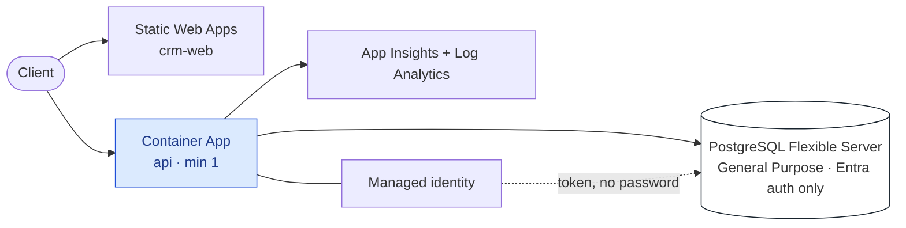

# Deploying FlowX to Azure — Phase 0

Phase 0 of [28 §7](../../docs/28-Azure-Hosting.md#7-delivery-with-exit-criteria): one region,
all three roles in one Container App, no HA, no broker, and **managed identity to the
database from the first deployment**.

Its exit criterion, from that table: *the application serves a seeded tenant end to end and
`/health/ready` reports the schema it writes against.*

| File | What it is |
|---|---|
| [`main.bicep`](main.bicep) | The template. Compiles — `bicep build deploy/azure/main.bicep` |
| [`../../.github/workflows/deploy-azure.yml`](../../.github/workflows/deploy-azure.yml) | Manual workflow: builds the image in ACR, previews, then deploys |

> [!WARNING]
> **This has never been deployed.** The template compiles and the workflow is valid YAML;
> neither has run against a subscription, because this repository has none. Run it with
> `whatIf: true` first — the workflow defaults to that — and read what it says it will create.

## 1. What it creates



**Password authentication is disabled on the server.** The application authenticates with a
user-assigned managed identity, so there is no database password in a vault, an environment
variable or a pipeline. Combined with OIDC from GitHub, the whole deployment holds no
long-lived secret.

## 2. Before the first run

Four repository secrets, none of which is a credential — three are identifiers and the
fourth is a registry name:

| Secret | What it is |
|---|---|
| `AZURE_CLIENT_ID` | The app registration GitHub federates to |
| `AZURE_TENANT_ID` | Your Entra tenant |
| `AZURE_SUBSCRIPTION_ID` | The subscription |
| `AZURE_REGISTRY` | An existing Azure Container Registry name |
| `AZURE_DB_ADMIN_OBJECT_ID` / `AZURE_DB_ADMIN_NAME` | The person or group that administers PostgreSQL |

Set up the federated credential on the app registration for
`repo:votrongdao/FlowX:environment:azure`, and create the resource group and the registry.

## 3. The one statement the template cannot run

The template registers your **administrator** on the server. It deliberately does **not**
register the application's identity as a server administrator: an administrator can read and
drop every database, and the host needs one schema in one of them.

So the application's database role is created once, by the administrator, connected to the
`flowx` database:

```sql
SELECT * FROM pgaadauth_create_principal('<applicationIdentityName>', false, false);

GRANT CONNECT ON DATABASE flowx TO "<applicationIdentityName>";
GRANT CREATE ON DATABASE flowx TO "<applicationIdentityName>";   -- for the migrator only
```

`applicationIdentityName` is a template output. Drop the `CREATE` grant once migrations are
run out of band; the running host does not need it.

## 4. Running it

From the Actions tab, *Deploy · Azure*, with `whatIf` left on. Read the preview. Then run it
again with `whatIf: false`.

Migrations are not run by the workflow. `PostgresMigrator` runs at start-up by default, which
is right for Phase 0 and wrong later — [29 §2.3](../../docs/29-From-Zero-To-Production.md#23-environments-and-promotion)
says why migrations become their own step before the new revision takes traffic.

## 5. What is deliberately absent

| Not here | Why, and when |
|---|---|
| **PgBouncer** | **FlowX cannot use it today.** The adapter selects its schema with a startup parameter a transaction pooler rejects or discards — [blocker B-6](../../CHECKLIST.md). Enabling it produces a deployment that starts and then answers `relation "flow_instance" does not exist` |
| Zone-redundant HA | Phase 2. One word in `main.bicep`, and it roughly doubles the compute bill |
| Read replica, second region | Phase 4, and read [28 §5.2](../../docs/28-Azure-Hosting.md#52-availability-and-why-cross-region-is-activepassive) first — the runbook order matters more than the resources |
| Service Bus | Phase 3, and only if something outside FlowX must consume events. The outbox and change feed already work without one |
| Private endpoints | They need a VNet. Until then the server takes the `allow-azure-services` rule, which is the widest thing in the template and the first thing to narrow |
| Split api / worker / scheduler roles | Phase 1. Phase 0 runs all three in one app, which is why it cannot scale to zero: a sleeping sweeper misses firings ([ADR-0076](../../docs/adr/ADR-0076-a-host-is-chosen-against-a-capability-contract.md)) |

## 6. Validating a change

```bash
bicep build deploy/azure/main.bicep --outfile /tmp/main.json
```

The `template` job runs exactly that before the deploy job starts, so a template that does
not compile costs seconds rather than a container build.
