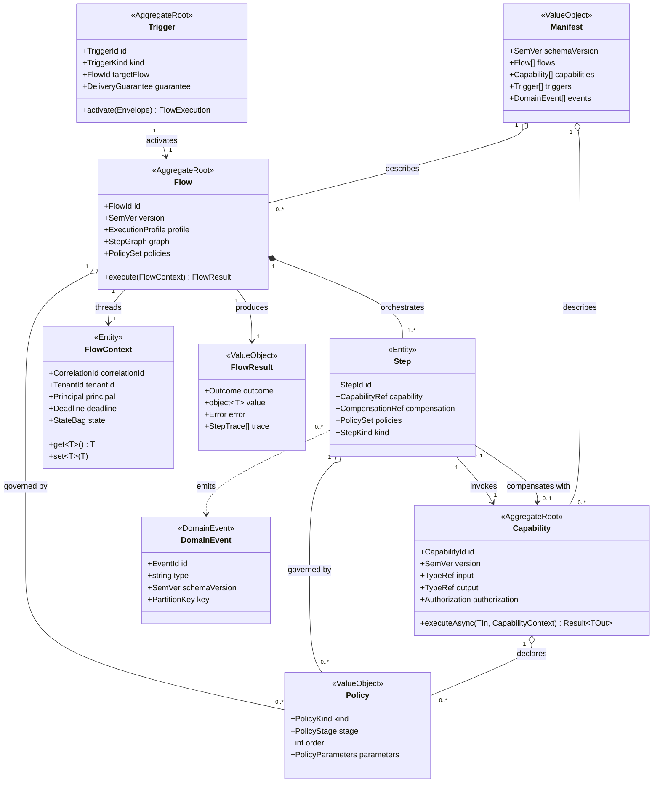
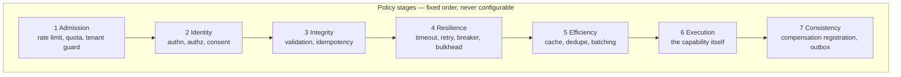
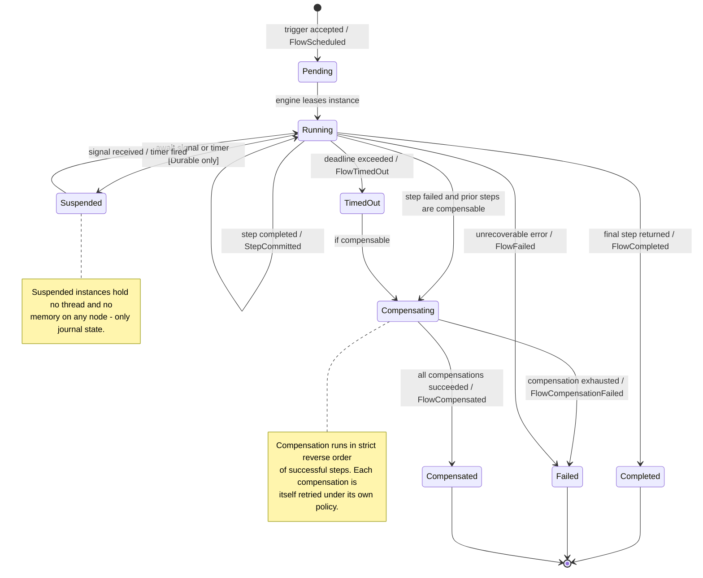

# 04 — Core Concepts

> **Status:** Accepted · **Audience:** all developers · This is the vocabulary.
> Every other document uses these terms with exactly these meanings.

---

## 1. The six primitives

```
Application = Trigger + Flow + Capability + Policy + Runtime
                                    ↑
                              (+ Context, which threads through all of them)
```

| Primitive | One-line definition | Owned by |
|---|---|---|
| **Trigger** | A cause of execution, normalised across transports | Platform |
| **Flow** | An ordered, compensable graph of steps expressing business intent | You |
| **Capability** | One unit of business work with a versioned contract | You |
| **Policy** | A declarative cross-cutting rule applied to a step or flow | Platform + you |
| **Context** | The ambient, propagated execution state of one flow instance | Platform |
| **Runtime** | The set of engines that execute the compiled graph | Platform |

Plus one artifact that binds them together:

| Artifact | Definition |
|---|---|
| **Manifest** | The complete, machine-readable graph of the application, emitted at build |

---

## 2. Domain model



**Reading rule:** a `Capability` never references a `Flow`, and a `Capability`
never invokes another `Capability` directly. Composition is the flow's job. This
single rule is what keeps the graph acyclic, analysable and testable, and it is
enforced by analyzer `FLOWX1004`.

---

## 3. Trigger

A trigger normalises *"something happened"* into a uniform envelope.

```csharp
public readonly record struct TriggerEnvelope(
    TriggerKind Kind,          // Http | Bus | Schedule | Stream | Change | Agent | Cli | Manual
    string Source,             // "POST /api/v1/orders" | "kafka:orders.requested"
    ReadOnlyMemory<byte> Body,
    TriggerHeaders Headers,    // correlation, tenant, principal, idempotency key, deadline
    DateTimeOffset OccurredAt);
```

| Kind | Examples | Default delivery guarantee |
|---|---|---|
| `Http` | REST, gRPC, GraphQL, webhook | at-most-once (caller retries) |
| `Bus` | Kafka, RabbitMQ, Service Bus, MQTT, SQS | at-least-once |
| `Schedule` | cron, interval, one-shot | at-least-once |
| `Stream` | Kafka streams, Event Hubs, change feeds | at-least-once + checkpoint |
| `Change` | CDC, outbox, file watcher | at-least-once |
| `Agent` | LLM tool call, MCP invocation | at-most-once |
| `Cli` / `Manual` | `flowx run`, operator replay | at-most-once |

The flow receives only its typed input. `TriggerEnvelope` is available through
`ctx.Trigger` for diagnostics — reading it to branch business logic is a
`FLOWX1003` warning. Details in [09-Trigger-Model](09-Trigger-Model.md).

---

## 4. Flow

A flow is a **declaration**, not a script. `Define` runs once, at startup, to
build the graph — or, when the source generator can fully resolve it, never at
all, because the graph is emitted as static data.

```csharp
[Flow("order.place", Profile = ExecutionProfile.Durable)]
public sealed partial class PlaceOrderFlow : Flow<PlaceOrder, OrderPlacedResult>
{
    protected override void Define(IFlowBuilder<PlaceOrder, OrderPlacedResult> flow) => flow
        .Step<ValidateOrder>()
        .Step<ReserveInventory>().CompensateWith<ReleaseInventory>()
        .Step<CapturePayment>().WithPolicy(Policies.PaymentGateway)
        .Emit<OrderPlaced>()
        .Return(ctx => new OrderPlacedResult(ctx.Get<OrderId>()));
}
```

### Execution profiles

| Profile | State | Crash behaviour | Overhead | Use for |
|---|---|---|---|---|
| `Ephemeral` | in-memory | lost | ~1 µs/step | request/response APIs, queries |
| `Durable` | journaled per step | resumes on another node | ~1 ms/step | sagas, payments, long-running |
| `Streaming` | checkpointed offsets | resumes from checkpoint | per-batch | continuous processing |

The profile is a per-flow decision made by the flow's author, and it is the
single most important cost/reliability trade-off in FlowX. See
[06-Execution-Engine](06-Execution-Engine.md).

---

## 5. Capability

```csharp
public interface ICapability<TIn, TOut>
{
    ValueTask<Result<TOut>> ExecuteAsync(TIn input, CapabilityContext ctx, CancellationToken ct);
}
```

Rules, all compiler-enforced:

1. Exactly one input type, one output type. No overloads, no `params`.
2. Returns `Result<TOut>` — expected failures are values, not exceptions.
3. Never calls another capability (`FLOWX1004`).
4. Never references a transport assembly (`FLOWX1003`).
5. Declares an authorisation stance (`FLOWX1010`).
6. Has a semantic version; breaking changes fail `flowx diff`.

Full contract in [07-Capability-Model](07-Capability-Model.md).

---

## 6. Policy

A policy is data describing a cross-cutting rule. It is *composed* at compile
time into the execution plan; only its parameters are runtime-configurable.



Stage order is fixed by the platform. This is deliberate: the most common
production incident in hand-composed pipelines is *authorisation placed after
caching*, or *retry placed outside idempotency*. FlowX makes those unexpressible.
Within a stage, `order` breaks ties. See
[10-Policy-Framework](10-Policy-Framework.md).

---

## 7. Context

```csharp
public sealed class FlowContext
{
    public CorrelationId CorrelationId { get; }
    public TenantId Tenant { get; }
    public ClaimsPrincipal Principal { get; }
    public Deadline Deadline { get; }          // absolute, propagated to every step
    public TriggerEnvelope Trigger { get; }    // diagnostics only
    public IStateBag State { get; }            // typed, per-flow-instance

    public T Get<T>();                          // throws if absent — a defect, not a business error
    public bool TryGet<T>(out T value);
    public void Set<T>(T value);
}
```

Context is **pooled and reset**, never allocated per step (P5). In `Durable`
flows, `State` is serialised into the journal at each checkpoint, so anything
placed in it must be serialisable — enforced by `FLOWX1006`.

---

## 8. Result and error

```csharp
public readonly struct Result<T>
{
    public bool IsSuccess { get; }
    public T Value { get; }
    public Error Error { get; }
}

public sealed record Error(
    string Code,            // "inventory.out_of_stock" — stable, greppable, translatable
    string Message,
    ErrorCategory Category, // Validation | NotFound | Conflict | Forbidden | Unavailable | Internal
    IReadOnlyDictionary<string, object?>? Data = null);
```

`ErrorCategory` is the single mapping point to every transport:

| Category | HTTP | gRPC | Bus behaviour |
|---|---|---|---|
| `Validation` | 400 | `INVALID_ARGUMENT` | dead-letter, no retry |
| `NotFound` | 404 | `NOT_FOUND` | dead-letter, no retry |
| `Conflict` | 409 | `ABORTED` | retry with backoff |
| `Forbidden` | 403 | `PERMISSION_DENIED` | dead-letter, audit |
| `Unavailable` | 503 | `UNAVAILABLE` | retry with backoff |
| `Internal` | 500 | `INTERNAL` | retry, then dead-letter |

All HTTP errors are emitted as RFC 7807 Problem Details with the `Code` as the
stable `type` suffix and the trace ID attached.

---

## 9. Flow instance lifecycle



This diagram is normative: the status enum, the journal's state column
constraint, and the `flowx.flow.state` metric dimension all derive from it.

---

## 10. Manifest

The manifest is the artifact that makes principle P6 real.

```jsonc
{
  "schemaVersion": "1.0.0",
  "application": { "name": "Ordering", "version": "2.4.0", "commit": "a1b2c3d" },
  "flows": [{
    "id": "order.place",
    "version": "1.2.0",
    "profile": "Durable",
    "input": "Ordering.Contracts.PlaceOrder",
    "output": "Ordering.Contracts.OrderPlacedResult",
    "triggers": [
      { "kind": "Http", "method": "POST", "route": "/api/v1/orders", "idempotent": true },
      { "kind": "Bus", "transport": "kafka", "topic": "orders.requested" }
    ],
    "steps": [
      { "id": "s1", "capability": "order.validate@1.0", "policies": [] },
      { "id": "s2", "capability": "inventory.reserve@1.0",
        "compensation": "inventory.release@1.0",
        "policies": [{ "kind": "Retry", "attempts": 3, "backoff": "exponential-jitter" }] },
      { "id": "s3", "capability": "payment.capture@2.1",
        "policies": [{ "kind": "Timeout", "value": "PT2S" },
                     { "kind": "CircuitBreaker", "failureRatio": 0.5 }] }
    ],
    "emits": [{ "type": "order.placed", "schemaVersion": "1.0.0", "key": "orderId" }]
  }],
  "capabilities": [{
    "id": "inventory.reserve", "version": "1.0.0",
    "input": "Ordering.Contracts.ReserveRequest",
    "output": "Ordering.Contracts.Reservation",
    "authorization": { "mode": "Permission", "value": "inventory:write" },
    "sideEffects": ["inventory-store"],
    "idempotent": true,
    "errors": ["inventory.out_of_stock", "inventory.sku_unknown"]
  }]
}
```

Consumers of the manifest:

| Consumer | Uses it for |
|---|---|
| `flowx graph` | Mermaid / DOT / JSON topology rendering |
| `flowx diff` | breaking-change detection, CI gate |
| FlowX Studio | live visualisation, impact analysis |
| FlowX AI | documentation, tests, review, optimisation hints |
| OpenAPI / AsyncAPI generators | API contracts, no annotations needed |
| Agent runtimes (MCP) | typed, policy-guarded tool surface |

See [13-AI-Native](13-AI-Native.md).

---

## 11. Naming rules

| Thing | Convention | Example |
|---|---|---|
| Flow id | `<domain>.<verb>` lowercase dotted | `order.place`, `invoice.issue` |
| Flow type | `<Verb><Noun>Flow` | `PlaceOrderFlow` |
| Capability id | `<domain>.<verb>` lowercase dotted | `inventory.reserve` |
| Capability type | `<Verb><Noun>` — no suffix | `ReserveInventory` |
| Compensation type | `<InverseVerb><Noun>` | `ReleaseInventory` |
| Event type | `<domain>.<past-tense-verb>` | `order.placed` |
| Error code | `<domain>.<snake_case_reason>` | `inventory.out_of_stock` |
| Policy constant | `Policies.<Purpose>` | `Policies.PaymentGateway` |

Banned in application assemblies: `Manager`, `Processor`, `Handler`, `Helper`,
`Util`, `Service` as type suffixes (`FLOWX1002`). If you cannot name it as a
business verb, it is not a capability.

---

## 12. Glossary

| Term | Meaning |
|---|---|
| **Compensation** | The business inverse of a step, run in reverse order on failure |
| **Deadline** | Absolute time by which the flow must finish; propagated, never reset |
| **Determinism boundary** | The line between replayable flow logic and non-deterministic capability effects |
| **Envelope** | Normalised trigger payload plus headers |
| **Journal** | Append-only record of step outcomes for a durable flow instance |
| **Lease** | Time-bounded exclusive ownership of a flow instance by a node |
| **Manifest** | Machine-readable description of the application graph |
| **Profile** | Execution mode of a flow: `Ephemeral`, `Durable`, `Streaming` |
| **Signal** | External input delivered to a suspended durable flow |
| **Step** | One node in a flow graph; usually a capability invocation |
| **Watermark** | Stream-processing progress marker used for windowing and lateness |

---

**Next:** [05 — Architecture](05-Architecture.md)
