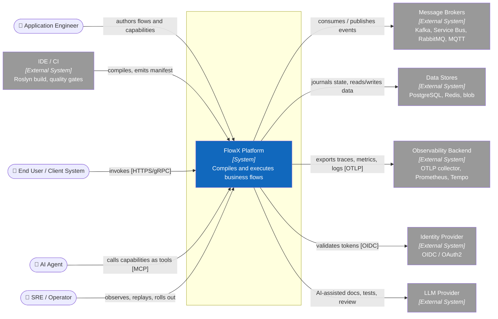
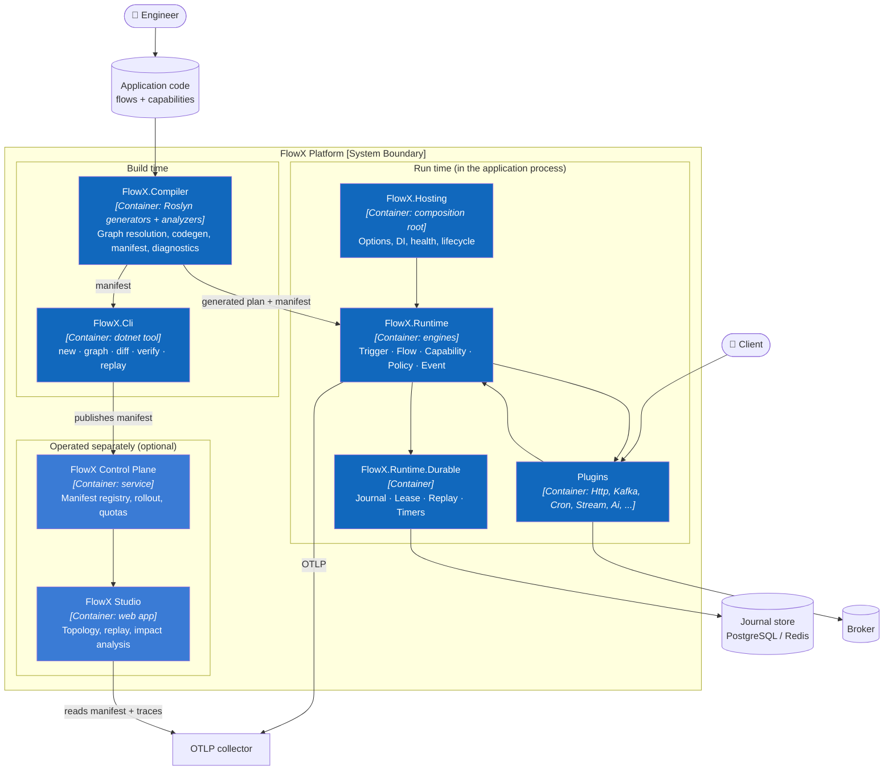
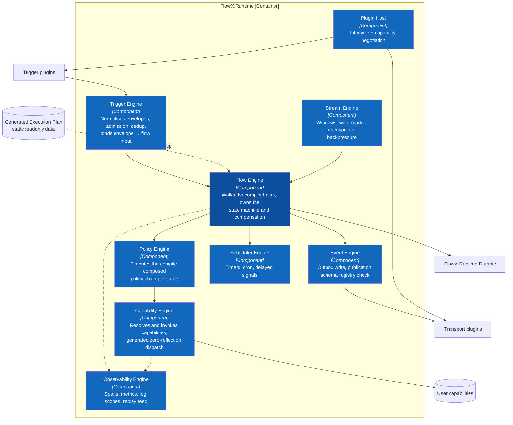
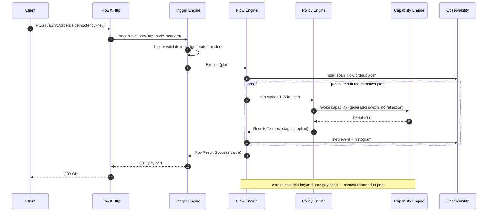
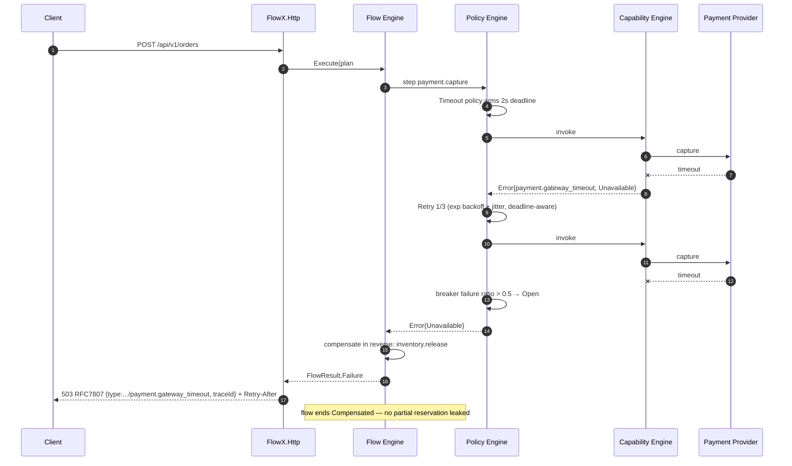
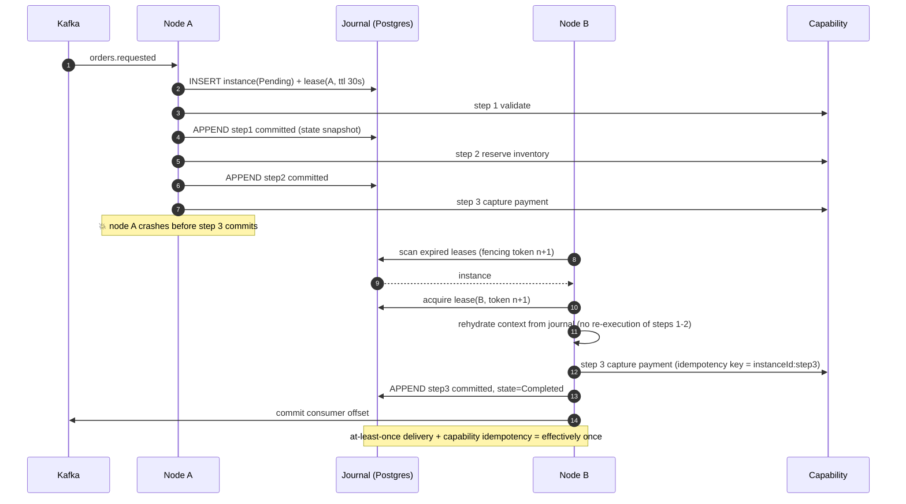
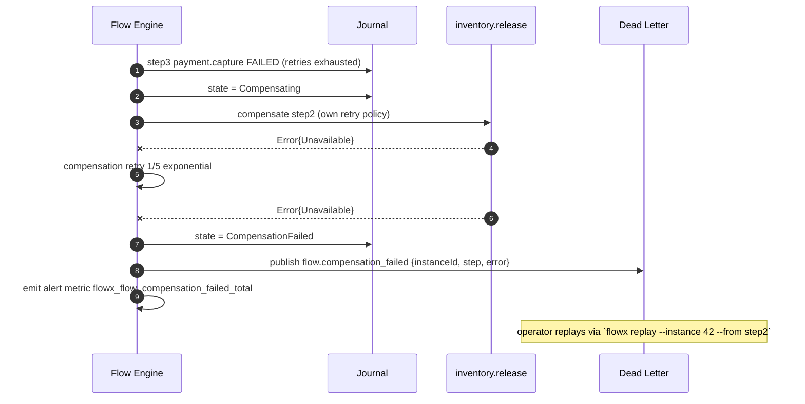
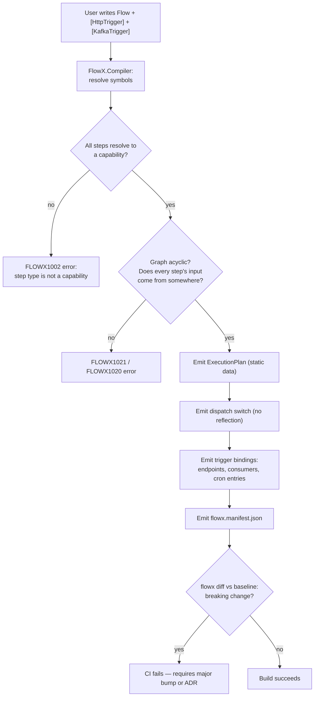
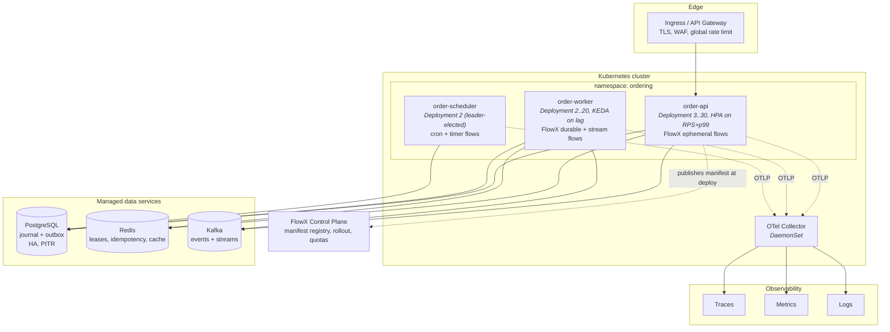

# 05 — Architecture (arc42 + C4)

> **Status:** Accepted · **Audience:** architects, contributors, reviewers
> **This is the primary design document.** Every other document in `docs/`
> elaborates one building block described here.

---

## 1. Introduction and Goals

FlowX is a .NET application platform that executes business flows. It provides a
single programming model for request/response APIs, event-driven integration,
stream processing, scheduled work and AI-agent actions, and it resolves the
orchestration graph at compile time.

### 1.1 Stakeholders

| Role | Concern |
|---|---|
| Application engineer | express a use case in minutes, test it without infrastructure |
| Principal architect | prevent drift between design and implementation |
| SRE | uniform operability across every service in the estate |
| Security engineer | provable authorisation at the business-operation boundary |
| Platform team | extend transports and stores without forking |
| AI/agent engineer | typed, policy-guarded action surface |

### 1.2 Quality goals (measurable — arc42 §1.2)

| # | Quality goal | Scenario | Measure | Priority |
|---|---|---|---|---|
| Q1 | **Predictable low latency** | 4-step ephemeral flow, warm process, single node | p99 platform overhead ≤ **5 µs**, ≤ **1 alloc/step** | 1 |
| Q2 | **Durable correctness** | node killed mid-flow at any step boundary | flow resumes on another node, **zero duplicate side effects** for idempotent capabilities, p99 checkpoint ≤ **15 ms** @ 5 000 flows/s/node | 1 |
| Q3 | **Static knowability** | any build | **100 %** of flows/capabilities/policies/events present in manifest; breaking contract change fails CI | 1 |
| Q4 | **Transport portability** | move a flow from HTTP to Kafka | **0** lines of business logic changed; only attributes | 2 |
| Q5 | **Operational uniformity** | any FlowX service | golden signals + trace + replay available with **no user instrumentation** | 2 |
| Q6 | **Extensibility** | add a new transport | implemented against public contracts, **0** changes to `FlowX.Runtime` | 2 |
| Q7 | **Startup & footprint** | container cold start, NativeAOT | ≤ **200 ms** to ready, ≤ **60 MB** RSS idle | 3 |
| Q8 | **Multi-tenant isolation** | one tenant saturates its quota | other tenants' p99 degrades ≤ **10 %** | 3 |

Q1–Q3 are the *architecture-defining* goals. Where a design choice trades one of
them away, an ADR must record it.

---

## 2. Constraints

| # | Constraint | Type | Implication |
|---|---|---|---|
| C1 | .NET 10+, C# 14 | Technical | Roslyn incremental generators; `ref struct` interfaces available |
| C2 | Must run under NativeAOT | Technical | No reflection, no dynamic codegen, no `System.Text.Json` reflection mode |
| C3 | Must host inside ASP.NET Core | Technical | Cannot own the process lifecycle or the DI container |
| C4 | No 2-phase commit | Technical | Consistency is saga-based; outbox for atomic publish |
| C5 | OpenTelemetry is the only telemetry API | Technical | No proprietary metrics interface |
| C6 | Apache-2.0, no copyleft dependencies | Legal | Vets every transitive dependency ([ADR-0012](adr/ADR-0012-apache-2-license.md)) |
| C7 | Public contracts follow SemVer with a 2-minor deprecation window | Organisational | Breaking changes are batched into majors |
| C8 | Documentation-first: no feature merges without its doc section and ADR | Organisational | This repository is the spec |

---

## 3. Context and Scope

### 3.1 Business context (C4 Level 1)



### 3.2 External interfaces

| Interface | Direction | Protocol | Contract owner | Failure mode |
|---|---|---|---|---|
| HTTP ingress | in | HTTP/1.1, HTTP/2, HTTP/3 | FlowX.Http plugin | RFC 7807 + `Retry-After` |
| gRPC ingress | in | HTTP/2 | FlowX.Grpc plugin | status codes per §4 mapping |
| Bus ingress/egress | both | Kafka, AMQP, MQTT | transport plugin | dead-letter + poison queue |
| Journal | both | ADO.NET / Redis / custom | FlowX.Runtime.Durable | lease loss → instance re-leased |
| Telemetry | out | OTLP gRPC | OpenTelemetry SDK | drop, never block the flow |
| Identity | in | OIDC discovery + JWKS | ASP.NET Core auth | fail closed |
| Agent surface | in | MCP over stdio/HTTP | FlowX.Ai plugin | policy denial → structured refusal |

---

## 4. Solution Strategy

| Quality goal | Strategy | Where |
|---|---|---|
| Q1 latency | Compile the flow graph into a static execution plan; pooled context; struct step frames; listener-gated telemetry | [ADR-0002](adr/ADR-0002-compile-time-orchestration.md), [06](06-Execution-Engine.md) |
| Q2 durability | Per-flow execution profile; append-only journal with step-boundary checkpoints; lease-based ownership; deterministic replay | [ADR-0003](adr/ADR-0003-execution-profiles.md), [ADR-0006](adr/ADR-0006-journal-and-leases.md), [11](11-Distributed-Runtime.md) |
| Q3 knowability | Source generator emits `flowx.manifest.json`; `flowx diff` gates CI; architecture fitness tests | [ADR-0005](adr/ADR-0005-manifest-as-build-artifact.md), [13](13-AI-Native.md) |
| Q4 portability | Trigger attributes are metadata only; flows are transport-free by analyzer rule | [ADR-0004](adr/ADR-0004-universal-trigger-model.md), [09](09-Trigger-Model.md) |
| Q5 uniformity | Runtime owns spans/metrics because it owns the graph; replay from journal | [12](12-Observability.md) |
| Q6 extensibility | Everything above `FlowX.Core` is a plugin against published contracts | [ADR-0009](adr/ADR-0009-plugin-contracts.md), [17](17-Plugin-System.md) |
| Q7 startup | Zero reflection; generated registration; AOT smoke test in CI | [ADR-0002](adr/ADR-0002-compile-time-orchestration.md) |
| Q8 isolation | Tenant is ambient in context; admission-stage quotas; partitioned durable state | [16](16-Multi-Tenant.md) |

**The one-sentence strategy:** *move orchestration from run time to build time, and
make the build's output — the manifest — the thing everything else is derived from.*

### 4.1 The strategy in one picture

![FlowX platform map. Ten numbered areas: core philosophy (flow first, capability
first, trigger agnostic, compile-time intelligence, policy everywhere, AI native,
observable everything, cloud native); the unified trigger layer spanning HTTP,
events, streaming, schedule, polling, webhook, file storage, IoT, AI agent, CLI
and SignalR; the runtime platform's eight engines; the six core abstractions of
the programming model — flow, capability, context, policy, event, compensation;
infrastructure connectors; platform capabilities including observability,
security, multi-tenancy, AI, marketplace, versioning, governance and monitoring;
the deployment and runtime environment; the AI and intelligence layer; an
end-to-end order flow example; and the ten quality attributes.](assets/flowx-platform-map.png)

This is the same strategy the table above states, drawn. Read it top-down: anything
can trigger a flow, one runtime executes it, six abstractions are all a developer
learns, and everything touching infrastructure is a plugin. The precise structure
follows in §5 — this picture is orientation, the diagrams below are the specification.

---

## 5. Building Block View


### 5.1 C4 Level 2 — containers



**Container responsibilities and reference direction**

```
FlowX.Abstractions  ←  FlowX.Core  ←  FlowX.Runtime  ←  FlowX.Runtime.Durable
        ↑                   ↑              ↑                     ↑
        └───────── FlowX.Compiler ─────────┘              FlowX.Hosting
        ↑                                                        ↑
     plugins ────────────────────────────────────────────────────┘
```

- `FlowX.Abstractions` — contracts only. **Zero package dependencies.** This is
  what user code references, and what plugin authors implement.
- `FlowX.Core` — graph model, `Result<T>`, `FlowContext`, policy model. No I/O.
- `FlowX.Runtime` — the engines. No transport knowledge.
- `FlowX.Runtime.Durable` — journal, leases, replay, timers. Optional package.
- `FlowX.Compiler` — analyzers + incremental source generators. Ships as an
  analyzer package; never a runtime dependency.
- `FlowX.Hosting` — the single composition root.
- Plugins — reference `Abstractions` only, never `Runtime` internals.

### 5.2 C4 Level 3 — inside FlowX.Runtime



Engine contracts are detailed in [06-Execution-Engine](06-Execution-Engine.md).
Each engine is independently testable and has exactly one reason to change.

### 5.3 Target code structure

```
src/
├── FlowX.Abstractions/           # ICapability, IFlow, attributes, Result<T>, contracts
│   └── (zero package references)
├── FlowX.Core/                   # StepGraph, FlowContext, PolicyModel, Error taxonomy
├── FlowX.Compiler/
│   ├── Analyzers/                # FLOWX1001..1099 diagnostics
│   ├── Generators/               # FlowPlanGenerator, DispatchGenerator, ManifestGenerator
│   └── Model/                    # compile-time graph, symbol resolution
├── FlowX.Runtime/
│   ├── Trigger/  Flow/  Policy/  Capability/  Event/  Scheduler/  Stream/  Observability/
├── FlowX.Runtime.Durable/
│   ├── Journal/                  # IFlowJournal + Postgres, Redis adapters
│   ├── Leasing/                  # ILeaseStore, renewal, fencing tokens
│   └── Replay/                   # deterministic re-execution
├── FlowX.Hosting/                # AddFlowX(), options, health checks, graceful drain
├── FlowX.Cli/                    # new · graph · diff · verify · replay · bench
└── plugins/
    ├── FlowX.Http/  FlowX.Grpc/  FlowX.Kafka/  FlowX.RabbitMq/  FlowX.AzureServiceBus/
    ├── FlowX.Cron/  FlowX.Stream/  FlowX.SignalR/  FlowX.GraphQL/  FlowX.Ai/
tests/
├── FlowX.Architecture.Tests/     # fitness functions — written FIRST (see §12)
├── FlowX.Compiler.Tests/         # generator snapshot + diagnostic tests
├── FlowX.Runtime.Tests/          # engine unit + integration (Testcontainers)
├── FlowX.Conformance.Tests/      # the suite every plugin must pass
└── FlowX.Benchmarks/             # CI-gated budgets from docs/14-Performance.md
```

Where do I add a use case? `src/<App>.Application/<FlowName>/` — one folder
containing the flow, its capabilities, its contracts and its tests. Nothing else.

---

## 6. Runtime View

### 6.1 Ephemeral flow over HTTP — happy path



### 6.2 Ephemeral flow over HTTP — failure twin



### 6.3 Durable flow, node failure mid-execution



### 6.4 Durable flow — compensation and dead-lettering



Compensation failure is the one case FlowX cannot resolve automatically. The
design makes it **loud** — dedicated metric, dead letter, and a CLI recovery
path — rather than silently retrying forever.

### 6.5 Trigger-to-flow binding (build time)



---

## 7. Deployment View



**Deployment rules**

| Rule | Reason |
|---|---|
| API and worker are separate deployments of the *same* image | Different scaling signals; identical code and manifest |
| Scheduler runs leader-elected, replica ≥ 2 | Avoid duplicate cron firing; survive node loss |
| `terminationGracePeriodSeconds` ≥ max flow step budget + 10 s | Graceful drain: stop accepting, finish in-flight, release leases |
| Journal DB is regional, not global | Cross-region durable flows need explicit design ([11](11-Distributed-Runtime.md)) |
| Manifest is published at deploy, not at build | The registry records what is *running*, not what was compiled |

Rollout strategy, KEDA scalers and drain semantics in
[18-Cloud-Native](18-Cloud-Native.md).

---

## 8. Crosscutting Concepts

| Concept | Rule | Detail |
|---|---|---|
| **Error handling** | Expected outcomes are `Result<T>`; exceptions mean defects or infrastructure faults. The runtime never converts an exception into a business error silently — it records `Internal` and logs the exception with its trace ID | [04 §8](04-Core-Concepts.md#8-result-and-error) |
| **Validation** | Input validation is stage 3 (Integrity), generated from contract annotations; business rules are the first flow step | [10](10-Policy-Framework.md) |
| **Logging** | Structured only. Data as fields, never interpolated. `flow.id`, `flow.instance_id`, `step.id`, `capability.id`, `tenant.id`, `trace_id` on every record | [12](12-Observability.md) |
| **Persistence** | FlowX owns only journal + outbox + idempotency store. Business persistence is inside capabilities and is none of FlowX's business | [11](11-Distributed-Runtime.md) |
| **Serialisation** | `System.Text.Json` source-generated contexts only (C2 AOT). Journal payloads carry a schema version | [ADR-0008](adr/ADR-0008-serialization-and-schema.md) |
| **Time** | Capabilities must obtain time from `ctx.UtcNow`, never `DateTime.UtcNow` — replay determinism. **Unenforced:** `FLOWX1007` does not exist; the property name is `UtcNow`, not `Clock` | [06 §5](06-Execution-Engine.md#5-the-determinism-boundary) |
| **Randomness / IDs** | `ctx.NewId()` and `ctx.Random` are *intended* to be journaled on first use so replay reproduces them. **Neither the journalling nor the rule exists:** there is no journal, and `FLOWX1008` does not exist | [06 §5](06-Execution-Engine.md#5-the-determinism-boundary) |
| **Configuration** | Selects adapters and tunes policy *parameters*. It can never change the graph | Manifesto §"What we refuse" |
| **Security** | Deny-by-default at the capability boundary; STRIDE per trust boundary | [15](15-Security.md) |
| **Tenancy** | `TenantId` is ambient in `FlowContext`, enforced at admission and at the journal partition key | [16](16-Multi-Tenant.md) |
| **Versioning** | Flows and capabilities carry SemVer; running instances pin the version they started with | [07](07-Capability-Model.md) |

---

## 9. Architecture Decisions (ADR index)

| ADR | Decision | Status |
|---|---|---|
| [0001](adr/ADR-0001-flow-and-capability-as-primitives.md) | Flow + Capability as the only two user primitives | Accepted |
| [0002](adr/ADR-0002-compile-time-orchestration.md) | Compile-time orchestration via Roslyn generators, no runtime reflection | Accepted |
| [0003](adr/ADR-0003-execution-profiles.md) | Per-flow execution profiles instead of always-durable | Accepted |
| [0004](adr/ADR-0004-universal-trigger-model.md) | One trigger abstraction for all transports | Accepted |
| [0005](adr/ADR-0005-manifest-as-build-artifact.md) | Manifest is a first-class build artifact | Accepted |
| [0006](adr/ADR-0006-journal-and-leases.md) | Journal + fenced leases for durable execution | Accepted |
| [0007](adr/ADR-0007-result-over-exceptions.md) | `Result<T>` for business outcomes, exceptions for defects | Accepted |
| [0008](adr/ADR-0008-serialization-and-schema.md) | Source-generated STJ + versioned schemas | Accepted |
| [0009](adr/ADR-0009-plugin-contracts.md) | Plugins depend only on `FlowX.Abstractions`, with a conformance suite | Accepted |
| [0010](adr/ADR-0010-csharp-dsl-over-yaml.md) | C# fluent DSL as the source of truth; YAML is export only | Accepted |
| [0011](adr/ADR-0011-fixed-policy-stage-order.md) | Fixed policy stage order, not user-composed pipelines | Accepted |
| [0012](adr/ADR-0012-apache-2-license.md) | Apache-2.0 licence | Accepted |
| [0013](adr/ADR-0013-dsl-vocabulary-over-ca1716.md) | DSL vocabulary takes precedence over CA1716 | Accepted |
| [0014](adr/ADR-0014-derived-error-catalogue-vs-build-budget.md) | Keep the derived error catalogue; re-express the build-overhead budget | **Proposed** |

*This index stopped at 0012 while two more ADRs were written. The authoritative
list, with each record's "Revisit when", is [adr/README.md](adr/README.md); this
table is a convenience copy and drifted because nothing checks that the two
agree.*

---

## 10. Quality Requirements (stimulus → response → measure)

| # | Source | Stimulus | Environment | Response | Measure |
|---|---|---|---|---|---|
| QR1 | Client | 10 000 req/s to a 4-step ephemeral flow | 4-core pod, warm | Flow executes | platform overhead p99 ≤ 5 µs; 0 alloc/step |
| QR2 | Chaos | `SIGKILL` a worker mid-flow | 3 nodes, durable profile | Flow resumes elsewhere | resume p99 ≤ 45 s (lease TTL 30 s); 0 duplicate non-idempotent effects |
| QR3 | Engineer | Adds a step with an incompatible contract | build | Build fails | `FLOWX1020` with symbol + fix, < 1 s added build time |
| QR4 | Engineer | Changes a capability's output shape | CI | `flowx diff` fails | breaking change detected 100 % for removed/retyped members |
| QR5 | Operator | Needs to know why instance 42 failed | production | Full causal replay available | every step's input/output/error retrievable for the retention window |
| QR6 | Tenant B | Tenant A floods its quota | shared cluster | Tenant A throttled at admission | tenant B p99 degradation ≤ 10 % |
| QR7 | Platform team | Adds an MQTT trigger | dev | Works without touching runtime | 0 files changed in `FlowX.Runtime`; conformance suite passes |
| QR8 | Ops | Cold-starts a pod | AOT image | Ready to serve | ≤ 200 ms; ≤ 60 MB RSS idle |
| QR9 | Security | Reviews who can run `payment.capture` | audit | Single answer from the manifest | 100 % of capabilities have an explicit authorisation stance |

---

## 11. Risks and Technical Debt

| # | Risk | Impact | Likelihood | Mitigation | Owner |
|---|---|---|---|---|---|
| R1 | **Source-generator complexity becomes the platform's own legacy** — generators are hard to debug and slow builds | High | High | Generators emit *readable* C# to `obj/generated`; snapshot tests on every emitted file; build-time budget gate (≤ 8 %); generator logic kept in a pure, unit-testable model layer separate from Roslyn plumbing | Compiler team |
| R2 | **Determinism leaks in durable flows** — a capability uses `DateTime.UtcNow`, `Guid.NewGuid()` or ambient statics, so replay diverges | High | High | **None of the three mitigations exists — see below.** Planned: analyzers `FLOWX1007/1008/1009` as **errors** in durable flows; replay conformance test asserting byte-identical outputs; journal records all non-deterministic values on first use | Runtime team |
| R3 | **Abstraction leak under real transports** — a universal trigger model cannot express Kafka rebalance, HTTP streaming, MQTT QoS | Medium | High | **Untested: there is one transport.** Planned escape hatch: `ITriggerSource` exposes transport-specific options *outside* the flow — *the interface is not declared anywhere in `src/`* — plus a conformance suite defining the minimum semantics, which does not exist. What holds today: documented non-goals per transport ([09 §12](09-Trigger-Model.md#12-known-limits-of-the-abstraction)). The risk cannot be evaluated until P3 adds a second transport | Plugin team |
| R4 | **Adoption cliff** — teams must rewrite to gain value | High | Medium | Incremental adoption path: FlowX hosts inside existing ASP.NET Core apps; a capability can wrap an existing service; `MediatR` bridge plugin for step-by-step migration | DevRel |
| R5 | **Journal becomes the bottleneck** at high durable throughput | High | Medium | Batched group-commit writes; per-partition journals; `Ephemeral` remains the default so durability is opt-in; benchmark gate QR2 | Runtime team |
| R6 | **Fixed policy stage order is too rigid** for a legitimate case | Medium | Medium | Documented escape: a capability may declare `PolicyStage.Custom` handlers within its own stage; revisit ADR-0011 after 3 real counterexamples | Architecture |
| R7 | **Manifest drift between build and deploy** (config changes behaviour) | Medium | Low | Configuration is structurally forbidden from changing the graph; control plane records the deployed manifest hash; `flowx verify --runtime` compares | Platform |
| R8 | **Ecosystem thinness** — a platform is only as good as its plugins | High | Medium | Ship 8 first-party plugins at v1; publish the conformance suite as a NuGet package so third parties can self-certify | DevRel |

> [!IMPORTANT]
> **R2's mitigation column was audited in P1 and none of it is built.** A risk
> whose mitigation is fictional is not a mitigated risk; it is an unmitigated
> risk that has stopped being reviewed, which is why this is recorded here rather
> than quietly softened.
>
> | Named mitigation | State | Evidence |
> |---|---|---|
> | Analyzers `FLOWX1007/1008/1009` as errors in durable flows | **does not exist** | none of the three is a descriptor `FlowXDiagnostics` declares. The catalogue is deliberately built to hold only ids something reports, so their absence is not an oversight in the compiler — it is the compiler declining to promise them, and [the diagnostics index](diagnostics/README.md) records what each reservation is blocked on |
> | Replay conformance test asserting byte-identical outputs | **does not exist** | no test in the solution named `ReplayDeterminismTest` or anything like it; no test replays anything |
> | Journal records non-deterministic values on first use | **does not exist** | there is no journal type in the solution. `ADR-0006` is the only place the word appears outside prose |
>
> The audit also found the risk is **currently unreachable rather than
> mitigated**, which is a different and less comforting statement.
> `FlowX.Runtime` never reads `ExecutionProfile`: a flow declared `Durable` runs
> on the identical ephemeral path, so nothing replays and a determinism leak has
> nowhere to diverge. R2 becomes live the moment the P2 journal lands, and the
> analyzers must land with it, not after it — which is why
> [20-Roadmap §3](20-Roadmap.md#3-increment-detail) lists them in P2's **Must**
> and [§6](20-Roadmap.md#6-standing-risk-review) makes any replay divergence a
> stop-the-phase trigger.
>
> One partial mitigation does exist and is not in the row above:
> [`FLOWX1011`](diagnostics/FLOWX1011.md) covers the *flow's* deterministic
> zone — conditions, selectors, projections and step input maps may read only
> the flow context, the flow input and prior step results. It ships as a Warning
> because `Ephemeral` is the only profile the runtime executes; it is specified
> to become an Error under `Durable`. It says nothing about capability bodies,
> which is where R2's example lives.

**Accepted technical debt for v1:** no dynamic/interpreted flows (P4 trade-off),
no cross-region durable flows, no human-task/BPM model, no visual editing
round-trip in Studio (read-only visualisation first).

---

## 12. Architecture fitness functions

Every rule above is an executable gate. Most are tests in
`tests/FlowX.Architecture.Tests`; two are CI jobs, because what they assert is a
build, not an assertion about one. **The "Lives in" column is the point of this
table** — it used to name fourteen tests of which seven existed nowhere, and a
reader who saw the name stopped looking for the rule.

| Test | Rule enforced | Fails when | Lives in |
|---|---|---|---|
| `AbstractionsHasNoDependencies` | §5.1 | `FlowX.Abstractions` gains any package reference | `DependencyRuleTests` |
| `LayersPointInward` | §5.1 | `Core` references `Runtime`; `Runtime` references a plugin | `DependencyRuleTests` |
| `NoCyclicDependencies` | P4 | any project or namespace cycle appears | `DependencyRuleTests` |
| `NoReflectionOnHotPath` | P4 | `System.Reflection`, `Activator` or the runtime binder is used in `FlowX.Abstractions`, `FlowX.Core` or `FlowX.Runtime` | `RuntimeIsolationTests` |
| `RuntimeHasNoMutableStatics` | P7 | a static field in `FlowX.Runtime` is neither `readonly` nor `const` | `RuntimeIsolationTests` |
| `FlowsAreTransportFree` | P3 | a flow's closure — including the generated half — reaches a transport or a plugin namespace | `TransportIsolationTests` |
| `CapabilitiesDoNotCallCapabilities` | §2 | an `ICapability` implementation reaches another one, from a dependency **or** a method body | `TransportIsolationTests` |
| `EveryCapabilityDeclaresAuthorization` | P11 | a capability lacks an authorisation stance | `SecurityFitnessTests` |
| `EveryPublicContractIsVersioned` | C7 | a flow, capability, event, manifest or shipped package carries a version that is not SemVer | `PublishedContractTests` |
| `ManifestIsComplete` | Q3 | a declared flow or capability is missing from the manifest, or a step names one the manifest never describes | `PublishedContractTests` |
| `PluginsPassConformance` | Q6 | a plugin fails the shared conformance suite | **not written — see below** |
| `SuppressionsAreAccountable` | §6.1 | a suppression cites no registered, unexpired `FLOWX-DEBT` id | `DebtAccountabilityTests` |
| `EveryDiagnosticIsHelpful` | P12 | a `FLOWX*` diagnostic lacks title, fix, or help URI | `FlowX.Compiler.Tests` |
| *(job, not a test)* | Q1, Q7 | > 5 % regression against `baseline.json` — B1, B3 and B12 in isolation | *Benchmark budgets* job, `performance.yml` |
| `AllocationBudgetTests`, `EngineAllocationTests` | Q7 | any allocation on the linear, conditional or switch path | *Allocation budgets* job, `performance.yml` |
| *(job, not a test)* | C2 | `PublishAot=true` fails, emits trim warnings, or the published binary does not serve a request | *NativeAOT smoke test* job, `ci.yml` |

CI runs these on every pull request. A red fitness function is a build failure,
not a discussion.

**`NoReflectionOnHotPath` and `RuntimeHasNoMutableStatics` read IL**, because
[P4](03-Design-Principles.md#p4--compile-time-everything) and
[P7](03-Design-Principles.md#p7--cloud-native) say so and because the failure they exist to
catch arrives through a generator or an extension method, not through a `using` directive.
The one exemption is `MemberInfo.Name`: `typeof(T).Name` compiles to a call on a
`System.Reflection` type, it is how the runtime says *which* contract a step failed to
produce, and it discovers nothing. Everything that looks a member up is still caught.

**`ManifestIsComplete` does not check policies or events, and the row above is written as
though it checked everything.** The reason has changed since this paragraph was written and
the paragraph did not: it used to say "no attribute applies a policy to a step, and the
generator emits no `policies` section", and **both halves of that are now false.**
`.WithPolicy(PolicySet)` attaches one, `FlowAnalyzer` reads the set well enough to raise
`FLOWX1014` and `FLOWX1018` off its contents, and `ManifestWriter.WritePolicies` emits a
`policies` array per step with each policy's fixed stage.

What is still true is narrower and worth stating exactly: **nothing in this repository
declares a policy**, so the emission path has never run against a shipped assembly, and no
policy *executes* — `FlowX.Runtime` contains no policy engine at all, so a declared `Retry`
is a manifest entry and nothing more. A completeness check for policies would therefore pass
vacuously today. It becomes meaningful with P4. The same is true of `events`: `.Emit<T>()`
reaches the plan and the manifest, and [`FLOWX1024`](diagnostics/FLOWX1024.md) is raised on
every one of them because nothing publishes it.

*The stale wording is duplicated verbatim in the `ManifestIsComplete` XML doc comment in
`tests/FlowX.Architecture.Tests/PublishedContractTests.cs`. The document is corrected here;
the code comment is a separate change.*

**`PluginsPassConformance` is blocked, not overlooked.** There is no conformance suite to
run — [R3](#11-risks-and-technical-debt) and
[R8](#11-risks-and-technical-debt) both name publishing one as the mitigation, and neither
has happened — and there is one plugin, `FlowX.Http`, so "every plugin agrees on the
minimum semantics" has nothing to compare. Writing it against the single transport that
exists would produce a test that restates `FlowX.Http.Tests` under a name claiming
ecosystem coverage. Recorded in
[21-Quality-Gates §2.4](21-Quality-Gates.md#24-gates-named-here-but-not-yet-enforced) with
what it is waiting for.

The enforced set, in full, is [CHECKLIST §4](../CHECKLIST.md).

---

**Next:** [06 — Execution Engine](06-Execution-Engine.md) ·
**Decisions:** [ADR index](adr/README.md)
