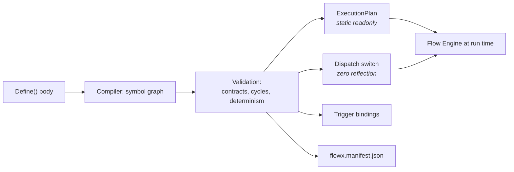
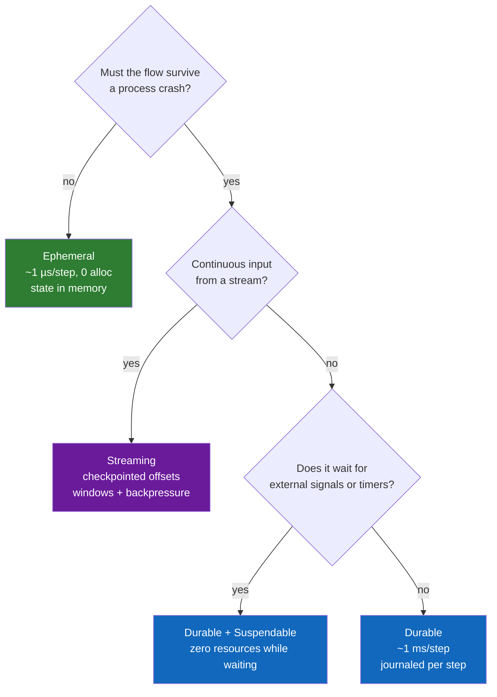
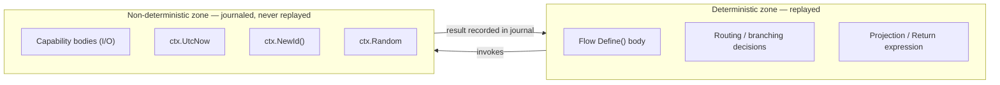
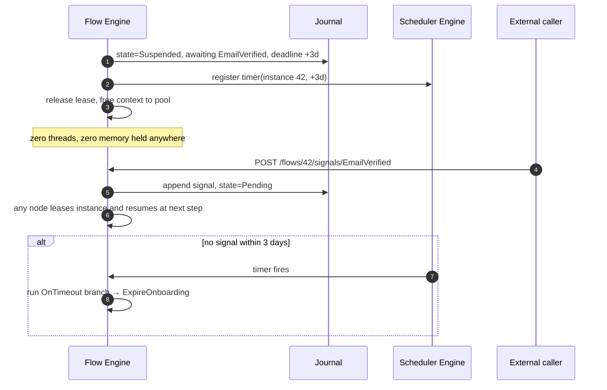
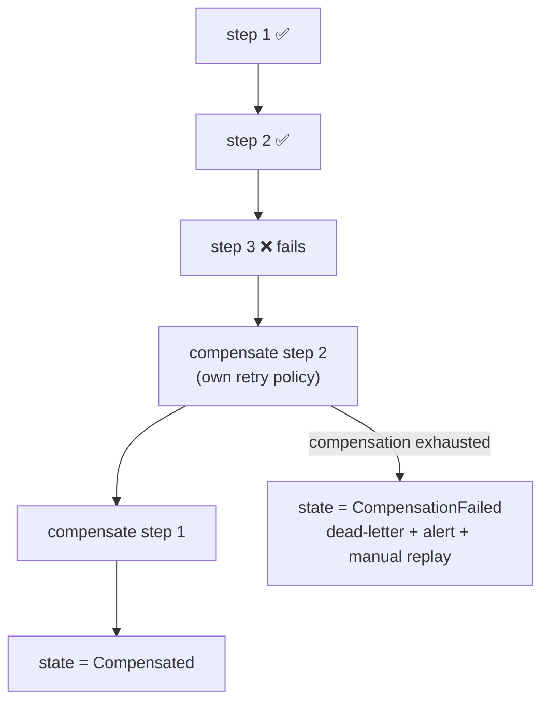
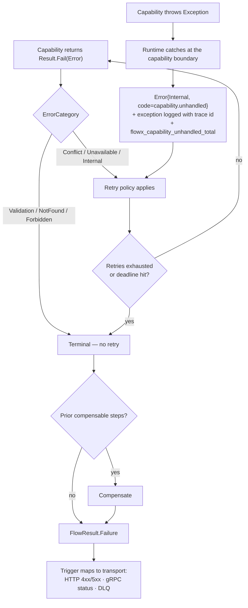
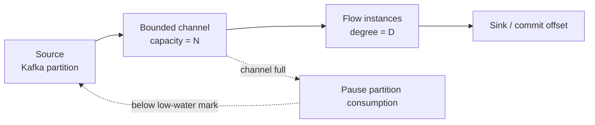

# 06 — Execution Engine

> **Status:** Accepted · **Audience:** runtime contributors, advanced users
> **Answers:** how does a flow actually run, and how is it still correct after a
> process dies?

---

## 1. The compiled execution plan

`FlowX.Compiler` turns a `Define(...)` body into static data. Nothing about the
shape of a flow is decided at run time.

```csharp
// GENERATED — obj/generated/FlowX/PlaceOrderFlow.Plan.g.cs
internal static class PlaceOrderFlowPlan
{
    public static readonly ExecutionPlan Instance = new(
        FlowId: "order.place",
        Version: new SemVer(1, 2, 0),
        Profile: ExecutionProfile.Durable,
        Steps: new StepPlan[]
        {
            new(Id: 0, Capability: CapabilitySlot.OrderValidate,
                Compensation: CapabilitySlot.None, Policies: PolicyChain.Empty),
            new(Id: 1, Capability: CapabilitySlot.InventoryReserve,
                Compensation: CapabilitySlot.InventoryRelease, Policies: PolicyChain.Retry3),
            new(Id: 2, Capability: CapabilitySlot.PaymentCapture,
                Compensation: CapabilitySlot.None,  Policies: PolicyChain.PaymentGateway),
            new(Id: 3, Kind: StepKind.Emit, EventType: EventSlot.OrderPlaced),
        },
        Deadline: TimeSpan.FromSeconds(30));
}
```

The Flow Engine's inner loop is therefore an index walk over a
`ReadOnlySpan<StepPlan>` — no dictionary lookups, no delegate allocation, no
virtual dispatch beyond the capability call itself.



---

## 2. The engines and their single responsibilities

| Engine | Owns | Does **not** own |
|---|---|---|
| **Trigger** | envelope normalisation, admission, dedup, input binding | business logic, retries |
| **Flow** | plan walking, state machine, compensation, deadline | policy semantics, I/O |
| **Policy** | stage chain execution, retry/breaker/cache/authz | which policies apply (compile-time) |
| **Capability** | resolution + invocation, scope management | orchestration |
| **Event** | outbox write, publication, schema check | transport specifics (plugin does that) |
| **Scheduler** | timers, cron, delayed signals, leader election | flow semantics |
| **Stream** | offsets, windows, watermarks, backpressure | per-record business logic |
| **Observability** | spans, metrics, log scopes, replay feed | exporting (OTel SDK does that) |
| **Plugin Host** | plugin lifecycle, capability negotiation, health | plugin behaviour |

Each engine is a separate namespace with an interface, a single production
implementation, and its own test class. "One reason to change" is verified by
the `NoCyclicDependencies` and layering fitness functions.

---

## 3. The execution loop

```csharp
// Simplified from FlowX.Runtime/Flow/FlowEngine.cs — the shape is normative.
public async ValueTask<FlowResult> ExecuteAsync(
    ExecutionPlan plan, FlowContext ctx, CancellationToken ct)
{
    using var flowSpan = _obs.StartFlow(plan, ctx);       // no-op when unobserved
    var completed = new StepCursor(plan.Steps.Length);    // stack-allocated bitmap

    for (var i = ctx.ResumeFromStep; i < plan.Steps.Length; i++)
    {
        ref readonly var step = ref plan.Steps[i];
        ctx.Deadline.ThrowIfExceeded();

        var result = await _policy.RunAsync(in step, ctx, _capabilities, ct);

        if (result.IsFailure)
            return await CompensateAsync(plan, ctx, completed, result.Error, ct);

        completed.Mark(i);
        if (plan.Profile is ExecutionProfile.Durable)
            await _journal.CommitStepAsync(ctx.InstanceId, i, result, ctx.State, ct);
    }

    return FlowResult.Success(plan.Project(ctx));
}
```

Three properties this shape guarantees:

1. **Resumability** — `ctx.ResumeFromStep` is the only difference between a fresh
   run and a recovery. There is no separate recovery code path to rot.
2. **Deadline propagation** — checked at every step boundary and passed into
   every policy; a flow cannot outlive its budget by more than one step.
3. **Compensation symmetry** — `completed` is the exact set to unwind, in
   reverse order.

A conditional does not change that shape; it changes only how `i` moves.
`When`/`Otherwise` compiles into the **same flat array** as everything else: a
`Branch` step carrying the index to continue at when its predicate is false, and
a `Jump` step closing the `then` block so a taken branch skips the alternative.
The loop therefore becomes a `while` whose index advances either by one or to a
target — the engine holds no branch stack, never recurses, and allocates nothing
to take a branch. Targets are validated forward and in range when the graph is
built, which is the only reason the loop is guaranteed to terminate: the DSL
cannot express a loop, so a backward target is always a layout bug rather than
something an author asked for.

`Switch` is the same shape with more destinations: one `Switch` step carrying a
target per case plus a default target, and a `Jump` closing each case block. The
loop still advances by one or to a target, still holds no branch stack, and still
allocates nothing — taking a case is one bounds check, one read out of the node's
`CaseTargets`, and one assignment to `i`. Every case target is validated forward
and in range alongside the default, because a termination proof that covered only
the arm nobody takes would be the wrong way round.

Predicates are evaluated through `IStepDispatcher.Evaluate`, which is
**synchronous and returns `bool`**; a switch's selector runs through
`IStepDispatcher.Select`, which is synchronous and returns the matching case's
position, or `-1` for none. An awaitable predicate would put a state machine on
the hot path and would invite exactly the IO `FLOWX1011` forbids; a signature
that cannot express IO is cheaper to enforce than a diagnostic that reports it.
`Select` returns an `int` rather than the value it selected for a related reason:
returning the value would mean returning it as `object`, which boxes an `enum` on
every switch a flow takes.

---

## 4. Execution profiles — the central trade-off



| | `Ephemeral` | `Durable` | `Streaming` |
|---|---|---|---|
| State | pooled in memory | journal, per step | checkpoint, per batch |
| Crash | lost; caller retries | resumes on another node | resumes from checkpoint |
| Overhead/step | ~1 µs | ~1 ms (group-committed) | amortised per batch |
| Suspend/resume | no | yes (timers, signals) | n/a |
| Determinism required | no | **yes** | yes within a batch |
| Typical use | queries, CRUD, validation APIs | payments, sagas, onboarding | ingestion, enrichment, aggregation |

> **Default is `Ephemeral`.** Durability is a cost you opt into, per flow. This
> is the main architectural difference from Temporal-style engines, which make
> everything durable and charge everything for it. See
> [ADR-0003](adr/ADR-0003-execution-profiles.md).

> [!WARNING]
> **Only the `Ephemeral` column describes something that runs.** `FlowX.Runtime`
> does not read `ExecutionProfile` anywhere: declaring `Durable` today gets you
> the ephemeral engine with a different word in the manifest — no journal, no
> checkpoint, no resume on another node, and a crash loses the instance exactly
> as the `Ephemeral` column says it would. `Streaming` has no engine at all.
>
> This is not a bug to file against the runtime; it is P2 and P7 not having
> happened. It is called out here because the table reads as a menu, and choosing
> the middle column currently buys nothing while implying a guarantee. See
> [§5](#5-the-determinism-boundary) for what that means for replay, and
> [20-Roadmap](20-Roadmap.md) for the phases.
>
> **The compiler says so too.** Declaring anything other than `Ephemeral` is
> reported as [`FLOWX1028`](diagnostics/FLOWX1028.md), so choosing the middle
> column and being told nothing is no longer possible. It is a *warning* rather
> than an error on purpose: the declaration is what P2 has to find and honour, and
> an error would push every author to delete it to buy back a build. The rule is
> scaffolding for this warning box and is deleted when the box is.

---

## 5. The determinism boundary

Durable flows are replayed. Replay is only correct if flow logic is
deterministic. FlowX draws the boundary explicitly:



| Rule | Diagnostic | Severity in `Durable` | Built? |
|---|---|---|---|
| No `DateTime.Now/UtcNow`, `DateTimeOffset.Now/UtcNow` in flows or capabilities | `FLOWX1007` | Error | **no** — P2 |
| No `Guid.NewGuid()`, `Random.Shared` | `FLOWX1008` | Error | **no** — P2 |
| No mutable static state reachable from a flow | `FLOWX1009` | Error | **no** — P2 |
| Flow branching, step input mappings and the `Return` projection may only read `ctx.State` and step results | `FLOWX1011` | Error | **yes** (Warning in `Ephemeral`) |
| Anything in `ctx.State` must be serialisable by a generated STJ context | `FLOWX1006` | Error | **no** — P2 |

In `Ephemeral` flows these drop to Info — there is no replay, so there is no
determinism obligation. The analyzer reads the flow's declared profile, so the
same rule set is strict exactly where it matters.

**`FLOWX1011` is the exception, and ships as a Warning in `Ephemeral` rather than
Info.** It is the only rule in this table that is implemented, and `Ephemeral` is the
only profile the runtime executes today, so Info would have made it invisible in every
build anyone can currently run — which is the state it was already in. See
[FLOWX1011](diagnostics/FLOWX1011.md#why-the-severity-depends-on-the-profile). The
remaining rules keep the Info stance for whoever implements them, at which point this
paragraph is worth revisiting as a set rather than one row at a time.

Its row covers the whole deterministic zone drawn above, and not only the "routing /
branching decisions" box: the `Return` projection named in the diagram, the `Switch` and
`ForEach` selectors, the `Emit` and `EmitOnFailure` payload maps, and the
`Step<TCapability, TStepIn>` and `SubFlow` input mappings the replay contract below
requires to be byte-identical. The full list, and what the rule provably cannot see, is on
[its page](diagnostics/FLOWX1011.md#which-delegates-it-covers).

**Replay contract:** replaying a completed durable instance must produce
byte-identical step inputs and identical control flow.

> **Nothing verifies it, and nothing can yet.** `ReplayDeterminismTest` does not
> exist. *This box said there is no journal type in the solution; WP-51 declared
> `IFlowJournal`, and the conclusion is unchanged* — nothing implements it beyond
> an in-memory reference in `tests/FlowX.Conformance.Tests`, and no code path
> writes to it, so there is no corpus to
> journal and nothing to replay from. The contract above is a *specification for
> P2*, not a property under test — and it is cited as an existing mitigation in
> [risk R2](05-Architecture.md#11-risks-and-technical-debt), which is corrected
> there for the same reason.
>
> One consequence is easy to miss and changes how this whole section reads:
> **`FlowX.Runtime` never reads `ExecutionProfile`.** A flow declared
> `Profile = ExecutionProfile.Durable` executes on the identical path as an
> `Ephemeral` one — same step loop, same pooled context, no checkpoint, no
> resume, no lease. The profile currently affects exactly two things: a
> build-time validation in `ExecutionPlan` (an `AwaitSignal` step requires
> `Durable`, [`FLOWX1017`](diagnostics/FLOWX1017.md)) and a field in the
> manifest. Everything §4 and §6 describe about durable behaviour is design, not
> runtime.

---

## 6. Suspension: waiting without holding resources

```csharp
protected override void Define(IFlowBuilder<OnboardCustomer, OnboardResult> flow) => flow
    .Step<CreateAccount>()
    .Step<SendVerificationEmail>()
    .AwaitSignal<EmailVerified>(timeout: TimeSpan.FromDays(3))
        .OnTimeout(f => f.Step<ExpireOnboarding>())
    .Step<ActivateAccount>()
    .Return(ctx => new OnboardResult(ctx.Get<AccountId>()));
```



A suspended instance costs one row. A million suspended onboardings cost a
million rows and zero compute — this is what makes long-running business
processes affordable.

---

## 7. Compensation semantics



Rules:

1. Compensation runs in **strict reverse order** of *successfully completed*
   steps only. A failed step is never compensated (it did not take effect — or if
   it did, that step is not idempotent and that is a capability bug).
2. Each compensation carries its **own** policy chain. Compensation retry is
   more aggressive than forward retry by default (5 attempts vs 3).
3. Compensation is **best-effort but loud**: exhaustion produces
   `flowx_flow_compensation_failed_total`, a dead-letter record, and a documented
   operator recovery path.
4. Compensation is itself journaled, so a crash during compensation resumes
   compensation — never re-runs forward steps.
5. `Ephemeral` flows may declare compensation, but the guarantee is weaker: a
   process crash during compensation loses it. *No analyzer warns:* `FLOWX1012`
   does not exist and never has, so a compensable `Ephemeral` flow compiles in
   silence. ([ADR-0003](adr/ADR-0003-execution-profiles.md) names it in the same
   breath as `FLOWX1017`, which does exist — the two were written together and
   only one was built.) Rules 1–3 above are implemented and covered by
   `CompensationStackTests` and `FlowEngineTests`; **rule 4 is not** — nothing is
   journaled, so a crash during compensation loses the whole flow rather than
   resuming the unwind.

---

## 8. Error propagation



An unhandled exception is never silently converted into a business error. It is
recorded as a **defect signal** with its own metric, because a capability
throwing is a bug in that capability.

---

## 9. Concurrency and parallel steps

```csharp
flow.Parallel(p => p
        .Branch<CheckCredit>()
        .Branch<CheckFraud>()
        .Branch<CheckSanctions>(),
     merge: MergeStrategy.AllMustSucceed)
    .Step<ApproveApplication>();
```

| Strategy | Semantics | Failure behaviour |
|---|---|---|
| `AllMustSucceed` | wait for all branches | first failure cancels siblings via linked token |
| `AllSettled` | wait for all, collect results | flow continues; branch errors available in context |
| `FirstSuccess` | race | remaining branches cancelled |
| `Quorum(n)` | first *n* successes | remainder cancelled |

`MergeStrategy` is a **struct**, not an enum, because `Quorum(n)` carries a number. The
three parameterless strategies are static properties, so `merge: MergeStrategy.AllMustSucceed`
reads exactly as it does above; `MergeStrategy.Quorum(2)` is a factory call.
`default(MergeStrategy)` is `AllMustSucceed` — the strictest of the four, because silence
should not buy leniency.

`AllSettled` is the only strategy that writes something for the next step to read: the
engine puts a `ParallelOutcome` into the context at the join, carrying each branch's error
or `null` **in declaration order**. Read it with `ctx.Get<ParallelOutcome>()`. A flow with
two `AllSettled` forks keeps the later one, because the state bag is keyed by type — the
`StepIndex` on the outcome is there so a reader can tell which fork it is holding.

`Quorum(n)` with *n* greater than the branch count fails the fork rather than waiting for a
branch that does not exist. `MergeStrategy` cannot check that itself; it does not know how
many branches there are.

### 9.1 How a fork fits the flat step array

A fork uses the **same flat layout** as a switch: one node carrying a target per block, and
the blocks laid out after it. The only structural difference is that a fork's blocks need
no closing jumps — a branch runs as a bounded range `[BranchTargets[k], BranchTargets[k+1])`,
so the next branch's target *is* the bound, and a jump would only restate it.

```
0 validate
1 parallel(→2,3,4  join 5)   ← one node, three branch targets, one join
2 check credit               ← branch 0 = [2,3)
3 check fraud                ← branch 1 = [3,4)
4 check sanctions            ← branch 2 = [4,5)
5 decide                     ← the join
```

Everything the flat model bought survives: no branch stack, no nested plan objects, and the
termination proof is unchanged — every target still points strictly forward, `StepGraph`
still rejects one that is out of range, and each branch is a forward-only walk over a
disjoint sub-range.

**What does not survive is the claim that "the loop index" describes execution.** Between a
fork and its join there are several indices, on several threads. The engine recurses exactly
once per fork, into the same range-walking method with different bounds. A flow that does
not fork never reaches that code.

**Branches are as concurrent as their steps are.** Each branch is started eagerly on the
calling thread and runs until its first incomplete `await`; the rest interleave on the
thread pool. So a branch whose every step completes synchronously finishes before its
sibling starts — which is correct, and is why a fork is for I/O rather than for CPU work.
Forcing branches onto `Task.Run` would buy a thread-pool dispatch per branch to make
CPU-bound work contend.

**Every branch is drained before the fork returns**, cancelled or not. The context is
pooled, so a branch still writing after the engine had moved on would eventually write into
the *next* flow's context — possibly another tenant's. It is also what makes compensation
sound: nothing is still running when the unwind starts.

**A fork allocates.** A linked token source, a `Task` per branch and their awaiters — about
240 B per branch on ~70 B fixed, measured. Budget B2 stays a hard zero for the linear,
conditional and switch paths, which never reach this code; see
[14 §1.1](14-Performance.md#11-platform-budgets-overhead-attributable-to-flowx-excluding-user-code-and-io).

### 9.2 Cancellation, and what a cancelled sibling leaves behind

`AllMustSucceed` cancels its siblings on the first failure, and a cancelled sibling may
already have completed compensable work. That work is **still compensated**: branch steps
record onto the flow's single compensation stack as they complete, and `CompensateAsync`
runs under `CancellationToken.None` precisely so that the token which stopped the work
cannot also stop the undoing of it.

The unwind order needs one caveat stated plainly. "Strict reverse order" is exact *within* a
branch, and between a branch and everything sequential around it — the fork and the join
establish that ordering. Two steps in **two different branches** have no such ordering
between them, so their compensations may unwind in either order. That is not a defect being
hidden: branches that write disjoint slots have nothing to order against each other, and a
saga that needed one undone before the other was not expressing concurrency in the first
place.

### 9.3 The shared context

Parallel branches share the flow's deadline and its context, and write to **disjoint**
context slots — enforced at compile time ([`FLOWX1013`](diagnostics/FLOWX1013.md)) so
parallel steps cannot race on shared state.

The runtime's half of that bargain is narrower than the compiler's, and the difference
matters. `FlowExecutionContext` holds a plain `Dictionary<Type, object>`; it is pooled, and
a `ConcurrentDictionary` would have cost every linear flow an allocation per write to solve
a problem only forks have. So the state bag and the compensation stack are **guarded by a
lock, and only when more than one thread can reach them** — `ExecutionPlan.HasParallel`, a
fact precomputed at type initialisation. A flow that never forks takes one always-false
branch and costs exactly what it did before.

A `ForEach` whose `MaxDegreeOfParallelism` is above one counts as forking, for the obvious
reason and by exactly the same mechanism: it reuses the fork's linked token source, its
`WhenAny` drain and this lock, rather than growing a second answer to the same problem. A
loop bounded at one does not, and keeps the unguarded path — so the question the flag
answers is not "does the flow branch" but "can two threads reach the context".

That makes concurrent writes *safe*: the dictionary cannot be corrupted and a torn read is
impossible. It does not make them *meaningful*. Two branches writing the same contract type
still race, and the winner is whichever finished last — which is a modelling mistake, and
`FLOWX1013`'s job. **Read that page's stated limits before treating a green build as a
proof:** it compares *declared output contracts*, so a capability calling `ctx.Set<T>()`
from inside its own body writes a slot the rule never sees.

One fidelity limit, stated rather than papered over: `ctx.CapabilityId` is a single field on
the shared context, so inside a parallel branch a capability may read whichever step most
recently started, including a sibling's. Error attribution does not depend on it — the
engine takes the identity from the step node it is executing — but a log line written by a
capability does. Per-branch identity needs a per-branch context, which is a larger change
than this shape.

In `Durable` flows, each branch commits its own journal entry; the merge point is a single
checkpoint.

---

## 10. Backpressure (Streaming profile)



The Stream Engine never grows an unbounded queue. When the channel is full it
**pauses consumption at the source** (Kafka `Pause`, AMQP prefetch, MQTT flow
control) rather than buffering in memory.

> **Design only.** There is no Stream Engine: the `Streaming` profile is an enum
> value the runtime never reads, no transport but HTTP exists, and no bounded
> channel is created anywhere in `src/`. `BackpressureConformanceTest` does not
> exist and has nothing to assert against. This section, and budget B13, are
> **P7**. Kept because backpressure has to be a design constraint from the first
> line of the Stream Engine rather than a retrofit — but nothing here is running.

Offset commit is **after** flow completion, giving at-least-once semantics;
combined with capability idempotency this yields effectively-once processing.

---

## 11. Cancellation and deadlines

| Source | Effect |
|---|---|
| Client disconnect (HTTP) | linked token cancelled; ephemeral flow aborts, durable flow continues (the business operation was accepted) |
| Flow deadline exceeded | `TimedOut`; compensation runs if compensable |
| Shutdown (SIGTERM) | stop admission → finish in-flight up to grace period → release leases → exit |
| Operator cancel | `flowx cancel --instance 42` → `Compensating` |

Deadlines are **absolute**, set at trigger time, and never reset by a retry. A
retry that would exceed the deadline is not attempted — the policy engine
subtracts elapsed time before arming the next attempt. This prevents the classic
"3 retries × 30 s timeout inside a 10 s SLA" failure.

---

## 12. What the engine deliberately does not do

| Not done | Why | Alternative |
|---|---|---|
| Distributed transactions (2PC) | availability cost, operational fragility | sagas + compensation |
| Automatic capability parallelisation | implicit concurrency is unreviewable | explicit `Parallel` |
| Dynamic flow modification at run time | breaks P4 and replay determinism | deploy a new flow version |
| Retrying non-idempotent capabilities by default | data corruption risk | `[Capability(Idempotent = true)]` opt-in gates retry |
| Cross-flow shared mutable state | coupling, unanalysable | events, or an explicit store inside a capability |

---

**Next:** [07 — Capability Model](07-Capability-Model.md)
