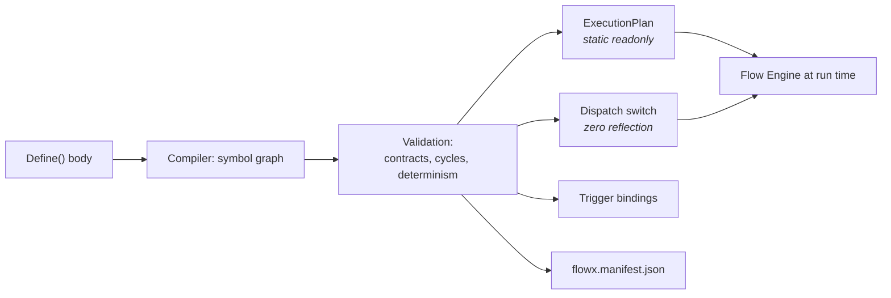
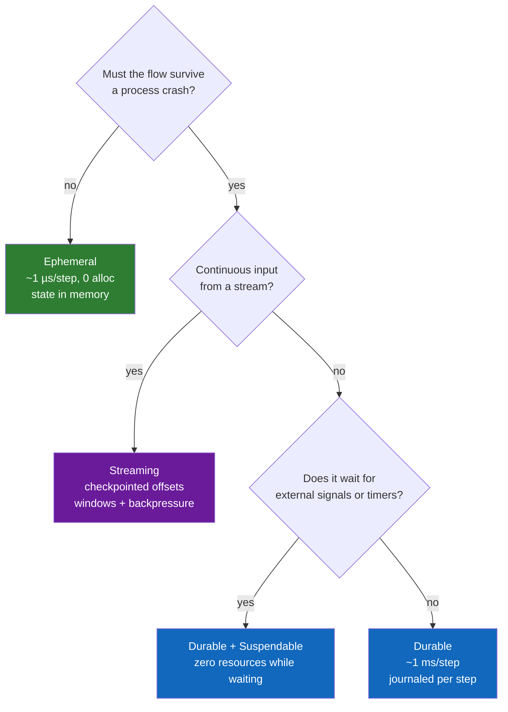
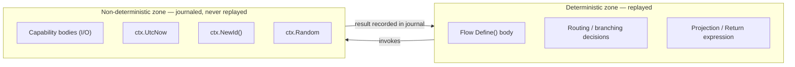
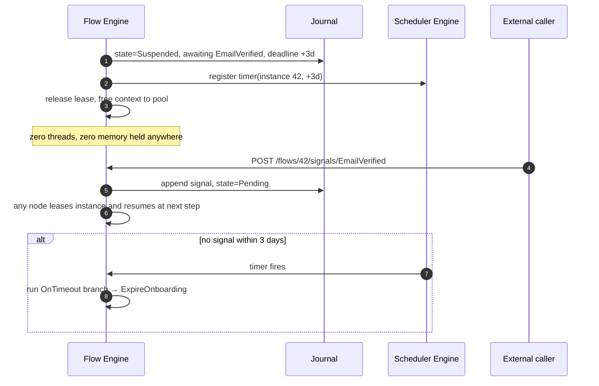
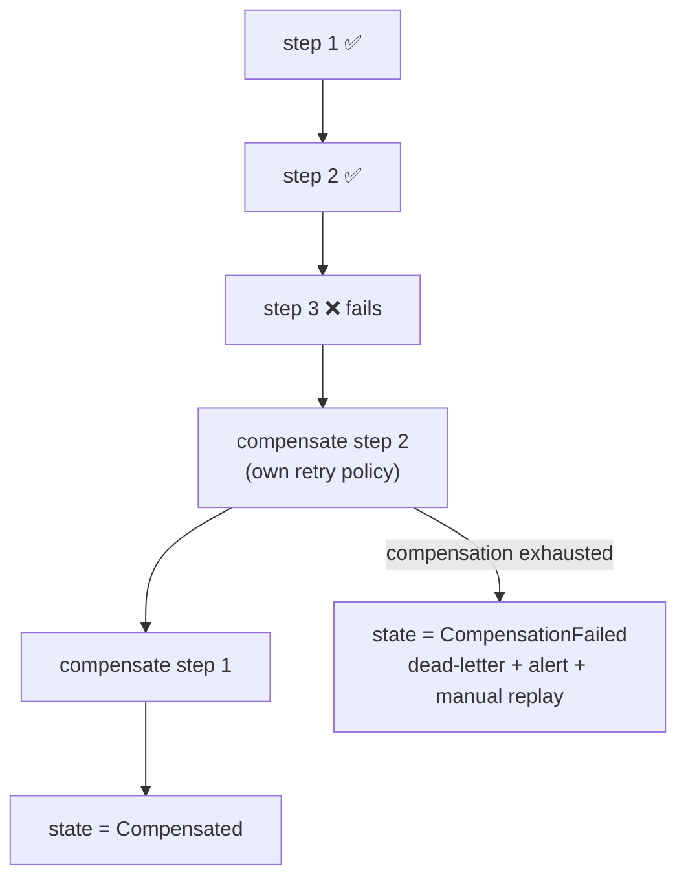
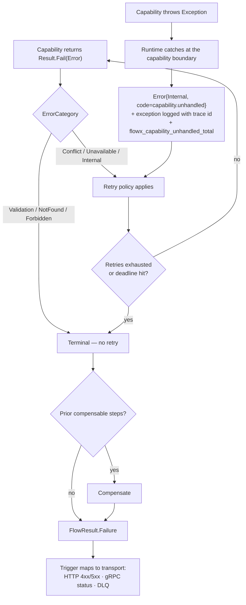
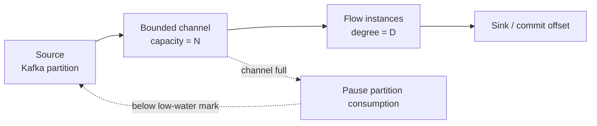

# 06 — Execution Engine

> **Status:** Accepted · **Audience:** runtime contributors, advanced users
> **Answers:** how does a flow actually run, and how is it still correct after a
> process dies?

---

## 1. The compiled execution plan

`FlowX.Compiler` turns a `Define(...)` body into static data. Nothing about the
shape of a flow is decided at run time.

```csharp
// GENERATED — obj/generated/FlowX/PlaceOrderFlow.Plan.g.cs
internal static class PlaceOrderFlowPlan
{
    public static readonly ExecutionPlan Instance = new(
        FlowId: "order.place",
        Version: new SemVer(1, 2, 0),
        Profile: ExecutionProfile.Durable,
        Steps: new StepPlan[]
        {
            new(Id: 0, Capability: CapabilitySlot.OrderValidate,
                Compensation: CapabilitySlot.None, Policies: PolicyChain.Empty),
            new(Id: 1, Capability: CapabilitySlot.InventoryReserve,
                Compensation: CapabilitySlot.InventoryRelease, Policies: PolicyChain.Retry3),
            new(Id: 2, Capability: CapabilitySlot.PaymentCapture,
                Compensation: CapabilitySlot.None,  Policies: PolicyChain.PaymentGateway),
            new(Id: 3, Kind: StepKind.Emit, EventType: EventSlot.OrderPlaced),
        },
        Deadline: TimeSpan.FromSeconds(30));
}
```

The Flow Engine's inner loop is therefore an index walk over a
`ReadOnlySpan<StepPlan>` — no dictionary lookups, no delegate allocation, no
virtual dispatch beyond the capability call itself.



---

## 2. The engines and their single responsibilities

| Engine | Owns | Does **not** own |
|---|---|---|
| **Trigger** | envelope normalisation, admission, dedup, input binding | business logic, retries |
| **Flow** | plan walking, state machine, compensation, deadline | policy semantics, I/O |
| **Policy** | stage chain execution, retry/breaker/cache/authz | which policies apply (compile-time) |
| **Capability** | resolution + invocation, scope management | orchestration |
| **Event** | outbox write, publication, schema check | transport specifics (plugin does that) |
| **Scheduler** | timers, cron, delayed signals, leader election | flow semantics |
| **Stream** | offsets, windows, watermarks, backpressure | per-record business logic |
| **Observability** | spans, metrics, log scopes, replay feed | exporting (OTel SDK does that) |
| **Plugin Host** | plugin lifecycle, capability negotiation, health | plugin behaviour |

Each engine is a separate namespace with an interface, a single production
implementation, and its own test class. "One reason to change" is verified by
the `NoCyclicDependencies` and layering fitness functions.

---

## 3. The execution loop

```csharp
// Simplified from FlowX.Runtime/Flow/FlowEngine.cs — the shape is normative.
public async ValueTask<FlowResult> ExecuteAsync(
    ExecutionPlan plan, FlowContext ctx, CancellationToken ct)
{
    using var flowSpan = _obs.StartFlow(plan, ctx);       // no-op when unobserved
    var completed = new StepCursor(plan.Steps.Length);    // stack-allocated bitmap

    for (var i = ctx.ResumeFromStep; i < plan.Steps.Length; i++)
    {
        ref readonly var step = ref plan.Steps[i];
        ctx.Deadline.ThrowIfExceeded();

        var result = await _policy.RunAsync(in step, ctx, _capabilities, ct);

        if (result.IsFailure)
            return await CompensateAsync(plan, ctx, completed, result.Error, ct);

        completed.Mark(i);
        if (plan.Profile is ExecutionProfile.Durable)
            await _journal.CommitStepAsync(ctx.InstanceId, i, result, ctx.State, ct);
    }

    return FlowResult.Success(plan.Project(ctx));
}
```

Three properties this shape guarantees:

1. **Resumability** — re-entering this loop is the only difference between a fresh
   run and a recovery. There is no separate recovery code path to rot. *The sketch
   shows a scalar `ctx.ResumeFromStep`; the shipped seam does not use one.*
   [ADR-0015 commitment 2](adr/ADR-0015-journal-schema-and-durable-execution.md)
   derives the position by asking the committed journal rows whether a
   `(scope, step)` is done, because a scalar cursor cannot describe a
   half-completed `Parallel` fork — a shape the DSL shipped in P1. The loop still
   enters at index 0 and skips what has committed.
2. **Deadline propagation** — checked at every step boundary and passed into
   every policy; a flow cannot outlive its budget by more than one step.
3. **Compensation symmetry** — `completed` is the exact set to unwind, in
   reverse order.

A conditional does not change that shape; it changes only how `i` moves.
`When`/`Otherwise` compiles into the **same flat array** as everything else: a
`Branch` step carrying the index to continue at when its predicate is false, and
a `Jump` step closing the `then` block so a taken branch skips the alternative.
The loop therefore becomes a `while` whose index advances either by one or to a
target — the engine holds no branch stack, never recurses, and allocates nothing
to take a branch. Targets are validated forward and in range when the graph is
built, which is the only reason the loop is guaranteed to terminate: the DSL
cannot express a loop, so a backward target is always a layout bug rather than
something an author asked for.

`Switch` is the same shape with more destinations: one `Switch` step carrying a
target per case plus a default target, and a `Jump` closing each case block. The
loop still advances by one or to a target, still holds no branch stack, and still
allocates nothing — taking a case is one bounds check, one read out of the node's
`CaseTargets`, and one assignment to `i`. Every case target is validated forward
and in range alongside the default, because a termination proof that covered only
the arm nobody takes would be the wrong way round.

Predicates are evaluated through `IStepDispatcher.Evaluate`, which is
**synchronous and returns `bool`**; a switch's selector runs through
`IStepDispatcher.Select`, which is synchronous and returns the matching case's
position, or `-1` for none. An awaitable predicate would put a state machine on
the hot path and would invite exactly the IO `FLOWX1011` forbids; a signature
that cannot express IO is cheaper to enforce than a diagnostic that reports it.
`Select` returns an `int` rather than the value it selected for a related reason:
returning the value would mean returning it as `object`, which boxes an `enum` on
every switch a flow takes.

---

## 4. Execution profiles — the central trade-off



| | `Ephemeral` | `Durable` | `Streaming` |
|---|---|---|---|
| State | pooled in memory | journal, per step | checkpoint, per batch |
| Crash | lost; caller retries | resumes on another node | resumes from checkpoint |
| Overhead/step | ~1 µs | ~1 ms (group-committed) | amortised per batch |
| Suspend/resume | no | yes (timers, signals) | n/a |
| Determinism required | no | **yes** | yes within a batch |
| Typical use | queries, CRUD, validation APIs | payments, sagas, onboarding | ingestion, enrichment, aggregation |

> **Default is `Ephemeral`.** Durability is a cost you opt into, per flow. This
> is the main architectural difference from Temporal-style engines, which make
> everything durable and charge everything for it. See
> [ADR-0003](adr/ADR-0003-execution-profiles.md).

> [!WARNING]
> **The `Durable` column now describes something that runs, one cell excepted; the
> `Streaming` column has no engine at all.** *Until WP-52 (2026-07-31) this box said
> only the `Ephemeral` column described something that runs: `FlowX.Runtime` read
> `ExecutionProfile` nowhere, so declaring `Durable` got you the ephemeral engine
> with a different word in the manifest. It then said the seam existed but that
> **nothing acquires a lease**, nothing scans for an abandoned instance, and the
> only `IFlowJournal` in the repository was an in-memory reference — "no store, no
> second node". Both of those states have expired.*
>
> What runs today: the runtime reads the profile; a `Durable` flow takes a lease
> before its instance is opened, commits one journal row per step boundary under
> that lease's fencing token, and gives the lease back (WP-55); a host that can scan
> sweeps for instances a dead node left running and finishes them through the *same*
> step loop; and `plugins/FlowX.Postgres` (WP-53) persists all of it in PostgreSQL.
> So **"resumes on another node" in the `Crash` row has a mechanism**, and it is
> covered by `DurableHostTests` — with two hosts in one process, against a shared
> store. No node has been killed and nothing crosses a process boundary; the chaos
> rig that would show this under a `SIGKILL` is WP-50 and has not started
> ([21 §8](21-Quality-Gates.md#8-reliability-gates)).
>
> **"Suspend/resume — yes (timers, signals)" is the cell that is still design**, and
> it is refused at build time by [`FLOWX1017`](diagnostics/FLOWX1017.md).
>
> **A `Durable` flow with no journal is refused**, not run ephemerally:
> `flow.durability_not_configured`, before its first step. Since WP-55 that is a
> statement about a host that registered no stores rather than about the platform —
> a host with a journal and a lease store runs durable flows; one with neither
> refuses them, which is the right answer for an unconfigured deployment. See
> [ADR-0015](adr/ADR-0015-journal-schema-and-durable-execution.md#what-wp-52-landed-and-what-it-did-not)
> for the in/out list, [ADR-0016](adr/ADR-0016-postgres-journal-adapter.md) for what
> the schema looked like against a real database,
> [§5](#5-the-determinism-boundary) for what it means for replay, and
> [20-Roadmap](20-Roadmap.md) for the phases.
>
> **The compiler still says so for `Streaming`.** Declaring `Streaming` is reported
> as [`FLOWX1028`](diagnostics/FLOWX1028.md), which was narrowed to that one
> profile at WP-52 rather than deleted — deleting it outright would have handed
> `Streaming` the silence `Durable` had. It is a *warning* rather than an error on
> purpose: the declaration is what P7 has to find and honour, and an error would
> push every author to delete it to buy back a build.

---

## 5. The determinism boundary

Durable flows are replayed. Replay is only correct if flow logic is
deterministic. FlowX draws the boundary explicitly:



| Rule | Diagnostic | Severity in `Durable` | Built? |
|---|---|---|---|
| No `DateTime.Now/UtcNow`, `DateTimeOffset.Now/UtcNow` in flows or capabilities | `FLOWX1007` | Error | **yes** — WP-58 |
| No `Guid.NewGuid()`, `Random.Shared` | `FLOWX1008` | Error | **yes** — WP-58 |
| No mutable static state reachable from a flow | `FLOWX1009` | Error | **yes** — WP-58 |
| Flow branching, step input mappings and the `Return` projection may only read `ctx.State` and step results | `FLOWX1011` | Error | **yes** (Warning in `Ephemeral`) |
| Anything in `ctx.State` must be serialisable by a generated STJ context | `FLOWX1006` | Error | **no** — WP-59 |

*Outside a durable flow they are **Warnings**, not Info.* This paragraph said they
"drop to Info — there is no replay, so there is no determinism obligation", which is
[ADR-0003](adr/ADR-0003-execution-profiles.md)'s clause repeated, and it is the clause
the set was re-decided against. The decision is **Warning by default, Error where the
compilation can prove the code is on a durable flow's replay path, never
informational** — for a flow that is its own `Profile`; for a capability, which has no
profile, it is a `Durable` flow *in this compilation* naming it as a step, directly or
through a sub-flow. The reasoning is written once, on
[the diagnostics index](diagnostics/README.md#the-severity-of-the-determinism-set), and
[ADR-0003's determinism bullet](adr/ADR-0003-execution-profiles.md) records that its own
wording is superseded. Repeating it here is what let the two disagree for two phases, so
it is not repeated again.

**Three of the four `no` rows are now `yes`, and the severity question they were blocked
on was the one answered.** They were blocked on *severity*, not on analysis: `Ephemeral`
was the only profile the runtime executed, ADR-0003 makes `FLOWX1007`–`FLOWX1009`
informational there, and an Info diagnostic never reaches a build log — so they would
have shipped doing nothing anywhere. WP-52 removed that premise and WP-58 wrote the
rules: `DeterminismAnalyzer` and `AmbientReads` in `src/FlowX.Compiler/Analysis/`, with
both directions pinned by `DeterminismAnalyzerTests`. **`FLOWX1006` is the row that
stays `no`**, and it was never blocked on severity: it checks membership in the generated
`System.Text.Json` context that
[ADR-0015 commitment 5](adr/ADR-0015-journal-schema-and-durable-execution.md) requires
payloads to be written through, and that writer is WP-59.
[`FLOWX1012`](diagnostics/FLOWX1012.md) was the last id in this family and **shipped at
WP-60**, once the fix it recommends — `Profile = Durable`, plus a journal and a lease store
registered on the host — stopped being a lie. Its severity is a `Warning` and is
deliberately *not* the set's rule restated: it reports precisely because the flow is **not**
durable, so the escalation above can never apply to it, and the one escalation that looks
plausible — a durable parent composing the flow — is the case rule 4 and WP-57 below say the
engine does not honour.
[Its own section on the diagnostics index](diagnostics/README.md#the-severity-of-flowx1012-which-is-not-the-determinism-sets-argument)
carries that argument, kept apart from this one.

**`FLOWX1011` stopped being an exception, and nothing about it changed to do so.** It
shipped as a Warning outside `Durable` rather than Info, deviating from ADR-0003, because
Info would have made it invisible in every build anyone could run. The stance for the
whole table was then re-decided **as a set** at WP-58 — the revisit this paragraph asked
for, rather than the one row at a time it was written to prevent — and the conclusion was
that the deviation had been right all along: `Warning` is the rule and `FLOWX1011` is an
instance of it. See
[FLOWX1011](diagnostics/FLOWX1011.md#why-the-severity-depends-on-the-profile).

**`FLOWX1011` also carries more weight than it did.** ADR-0015 originally said the
journal must record the branch a `Switch` took; it has no field for one, and
[the amendment](adr/ADR-0015-journal-schema-and-durable-execution.md#amendments-the-first-implementation-forced-wp-52)
resolved it by replaying the selector against the restored state bag instead. Replay
of control flow now *depends* on this rule's purity guarantee — and the rule is a
Warning, and says nothing about capability bodies.

Its row covers the whole deterministic zone drawn above, and not only the "routing /
branching decisions" box: the `Return` projection named in the diagram, the `Switch` and
`ForEach` selectors, the `Emit` and `EmitOnFailure` payload maps, and the
`Step<TCapability, TStepIn>` and `SubFlow` input mappings the replay contract below
requires to be byte-identical. The full list, and what the rule provably cannot see, is on
[its page](diagnostics/FLOWX1011.md#which-delegates-it-covers).

**Replay contract:** replaying a completed durable instance must produce
byte-identical step inputs and identical control flow.

> **Something verifies it now — WP-61, on 2026-07-31.** *This box said "Nothing
> verifies it. `ReplayDeterminismTest` does not exist"; it does, as
> `ReplayDeterminismTests` in `tests/FlowX.Runtime.Tests`, and the corpus it is named
> for exists with it.* Eight shapes — linear, `When`/`Otherwise`, `Switch`, `ForEach`,
> `Parallel`, `SubFlow` inline and `Detached`, a failure with its unwind, and a flow
> that reads all three ambient sources — are each run twice: once against the world,
> once against the journal the first run wrote. What is compared is every action the
> flow took and every row the journal holds, including the whole
> `NondeterminismCapture`. The replay's clock is deliberately a hundred days from the
> original's, so a value that was **not** replayed cannot be mistaken for one that
> was, and the corpus cannot pass by comparing nothing — which is the failure mode the
> exit criterion named.
>
> *Two earlier versions of this box are now wrong, and both are recorded rather
> than deleted.* It said there was no journal type in the solution; WP-51 declared
> `IFlowJournal`. It then said nothing wrote to one; **WP-52 (2026-07-31) made the
> runtime read `ExecutionProfile`**, and a `Durable` flow now journals a step
> boundary, captures `ctx.UtcNow`, `ctx.NewId()` and `Random`'s seed per step, and
> resumes by replaying its committed rows into this same loop.
>
> **The capture is now read as well as written**, which is what WP-61 had to buy
> before it could compare anything: `FlowExecutionContext.ReplayNondeterminism` hands
> a step the instant, the ids and the seed its row records, and `ctx.UtcNow`,
> `ctx.NewId()` and `ctx.Random` answer from them. *This paragraph said "the capture
> is written and never read, which is exactly the state in which a determinism leak
> leaves no trace". That state is over.* What still does **not** happen is the engine
> calling it: the step loop skips a committed step rather than re-running it, so no
> resumed execution reaches a step it holds a capture for, and a replay has to be
> driven from outside the loop. `flowx replay` (WP-64) is the driver that ships.
>
> **Three fidelity limits are now measured rather than predicted**, each pinned by a
> test that goes red the day it is fixed.
>
> 1. **A `Parallel` whose branches genuinely overlap does not replay.** One pooled
>    context is shared by every branch, so a capture can land on a sibling's row —
>    [ADR-0015](adr/ADR-0015-journal-schema-and-durable-execution.md#what-wp-52-landed-and-what-it-did-not)
>    called this best-effort attribution and said WP-61 needed a per-branch context
>    before it was safe. **WP-61 did not buy one.** It pinned the exact interleaving
>    with a rendezvous instead, so the misattribution is reproduced on every run rather
>    than one in twenty, and it measured the consequence: the branch whose id was taken
>    by its sibling mints a fresh one on replay. A fork whose branches do **not**
>    overlap replays exactly, and that is the whole of what "a `Parallel` replays"
>    currently means.
> 2. **A compensation's ambient reads are captured by nothing.** The forward path takes
>    an envelope at every step boundary; `CommitCompensationAsync` takes none, so an
>    undo that reads `ctx.UtcNow` leaves no record of what it read and no replay can
>    reproduce it. This was named in no document before WP-61 measured it.
> 3. **The engine's own deadline check is not replayed.** It reads the clock before any
>    hook outside the loop is reached, so it sees the replaying node's time. Everything
>    the *flow* reads is replayed; the engine's own read is not.
>
> `AwaitSignal` is refused at build time under **every** profile — by
> [`FLOWX1017`](diagnostics/FLOWX1017.md) below `Durable`, and by
> [`FLOWX1031`](diagnostics/FLOWX1031.md) at it — so a durable flow still runs to
> completion inside one invocation. Everything §6 describes about *suspension* is
> design, not runtime.

---

## 6. Suspension: waiting without holding resources

> [!WARNING]
> **Nothing in this section runs, and the flow below does not compile.** It is the
> design [WP-63](20-Roadmap.md#3-increment-detail) will build. Read it as a
> specification.
>
> All three constructs it uses are reported by
> [`FLOWX1031`](diagnostics/FLOWX1031.md):
>
> | Construct | What the compiler does with it today |
> |---|---|
> | `.AwaitSignal<T>(timeout)` | **Error.** It produced a step the engine completes immediately — `FlowEngine` has no `case StepKind.AwaitSignal` — and the emitted plan carried `TimeSpan.FromHours(1)` whatever the author declared. No plan is emitted for a flow that declares it |
> | `.OnTimeout(block)` | **Warning.** The block is discarded: its steps reach no plan, no dispatcher and no manifest |
> | `.Delay(duration)` | **Warning.** No step is produced at all, so the flow continues without waiting |
>
> Nothing writes a `Suspended` state, and there is no timer table, no signal table and
> no scheduler engine. `samples/workflow/README.md §2` measures all of it, and
> `TheAbsentHalfTests.AnAwaitSignalStepDoesNotWaitForAnything` runs the shape on the
> real engine against a real journal: three committed rows, the instance `Completed`,
> and the clock never moves. Until WP-63 lands, express the wait outside the flow —
> split the process at the pause and trigger the second half from the arriving signal.

```csharp
protected override void Define(IFlowBuilder<OnboardCustomer, OnboardResult> flow) => flow
    .Step<CreateAccount>()
    .Step<SendVerificationEmail>()
    .AwaitSignal<EmailVerified>(timeout: TimeSpan.FromDays(3))
        .OnTimeout(f => f.Step<ExpireOnboarding>())
    .Step<ActivateAccount>()
    .Return(ctx => new OnboardResult(ctx.Get<AccountId>()));
```



A suspended instance costs one row. A million suspended onboardings cost a
million rows and zero compute — this is what makes long-running business
processes affordable. **That is the argument for building it, not a description of
what it does**: today a durable flow declaring `AwaitSignal` gets no execution plan
at all, and one declaring `Delay` gets a plan the delay is missing from.

---

## 7. Compensation semantics



Rules:

1. Compensation runs in **strict reverse order** of *successfully completed*
   steps only. A failed step is never compensated (it did not take effect — or if
   it did, that step is not idempotent and that is a capability bug).
2. Each compensation carries its **own** policy chain — `StepNode.CompensationPolicies`,
   resolved against the *compensating* capability, so `FLOWX1014`'s idempotency
   rule is checked against the thing that would actually be run twice.
   Compensation retry is more aggressive than forward retry by default
   (5 attempts vs 3): `PolicySet.CompensationDefault`. **Since WP-57 the runtime
   executes it** — the only policy it executes anywhere, at the `Consistency`
   stage ([10 §2](10-Policy-Framework.md#2-fixed-stage-order--the-core-decision)).
   A policy applies because it was declared: an undo with no declared chain is
   still attempted exactly once.
3. Compensation is **best-effort but loud**: exhaustion produces
   `flowx_flow_compensation_failed_total`, a dead-letter record, and a documented
   operator recovery path. *Half of this is now true.* WP-57 ships
   `ICompensationAlertSink`, raised exactly once per exhausted compensation and
   carrying the flow, the instance, the step, the compensating capability, the
   attempt count and the last error — everything
   `flowx replay --instance <id> --from <step>` needs. The **metric and the
   dead-letter record are not built**: FlowX ships no metrics infrastructure yet,
   and the sink is the seam the observability package attaches to rather than a
   counter invented inside the engine.
4. Compensation is itself journaled, so a crash during compensation resumes
   compensation — never re-runs forward steps.
5. `Ephemeral` flows may declare compensation, but the guarantee is weaker: a
   process crash loses the pending unwind along with the instance, because the
   stack is a field of an in-memory context and nothing writes it down.
   **[`FLOWX1012`](diagnostics/FLOWX1012.md) says so at build time since WP-60**,
   as a warning — *this rule was specified alongside `FLOWX1017` in
   [ADR-0003](adr/ADR-0003-execution-profiles.md), only one of the pair was built,
   and for two phases a compensable `Ephemeral` flow compiled in silence.* It fires
   on the default profile as well as on a declared `Ephemeral` one, which is the
   whole reason it is not an error; its page carries that argument and the
   reference sample's answer to it. Rules 1–3 above are implemented and covered by
   `CompensationStackTests`, `FlowEngineTests` and `CompensationPolicyTests`.
   **Rule 4 is implemented for a flow's own steps and still open across a
   composition.** Since WP-57 `CompensateAsync` commits one row per undo attempt —
   `JournalOutcome.Compensated` when it worked, `Failure` when it did not, keyed
   past the forward row it reverses, carrying the *compensating* capability's id
   and moving the instance to `Compensating` — and a resumed instance does not
   repeat an undo whose row already committed. Two gaps remain, both named rather
   than papered over: an undo whose row never landed re-runs, which is the same
   honest limit [ADR-0006](adr/ADR-0006-journal-and-leases.md) states for a
   forward effect that landed before its commit; and a **composed child that
   already succeeded** records nothing, because its instance was sealed
   `Completed` and a journal correctly refuses a write to a finished instance.
6. **A compensation runs under its own identity.** `ctx.CapabilityId` is the
   *compensating* capability — `payment.refund`, not the `payment.capture` being
   reversed — and the step being undone is `ctx.CompensatingFor`, `null` on the forward
   path. *This rule is here because the engine got it wrong.* It entered a compensation
   with the forward step node, so an undo deriving an idempotency key from
   `ctx.CapabilityId` — which is what [19 §1](19-SDK.md) shows and what the reference
   sample did — produced the forward step's key byte for byte. Any store honouring that
   key deduplicated the contra write away, the capability returned success, and the
   engine recorded `CompensationOutcome.Succeeded` over an effect that never happened.
   The journal row was right throughout, which is exactly what made it invisible: the
   audit trail named the compensation while the code that ran named the step. Both facts
   are on `CapabilityContext` now, because both have readers and neither is derivable
   from the other at the point of use — a compensator needs its own identity to key a
   write, an operator reading a trace needs to know what is being reversed. The two ids
   come from `StepNode.Identity` and `StepNode.CompensationIdentity`, one expression
   each, so the row and the context cannot drift apart again.

---

## 8. Error propagation



An unhandled exception is never silently converted into a business error. It is
recorded as a **defect signal** with its own metric, because a capability
throwing is a bug in that capability.

---

## 9. Concurrency and parallel steps

```csharp
flow.Parallel(p => p
        .Branch<CheckCredit>()
        .Branch<CheckFraud>()
        .Branch<CheckSanctions>(),
     merge: MergeStrategy.AllMustSucceed)
    .Step<ApproveApplication>();
```

| Strategy | Semantics | Failure behaviour |
|---|---|---|
| `AllMustSucceed` | wait for all branches | first failure cancels siblings via linked token |
| `AllSettled` | wait for all, collect results | flow continues; branch errors available in context |
| `FirstSuccess` | race | remaining branches cancelled |
| `Quorum(n)` | first *n* successes | remainder cancelled |

`MergeStrategy` is a **struct**, not an enum, because `Quorum(n)` carries a number. The
three parameterless strategies are static properties, so `merge: MergeStrategy.AllMustSucceed`
reads exactly as it does above; `MergeStrategy.Quorum(2)` is a factory call.
`default(MergeStrategy)` is `AllMustSucceed` — the strictest of the four, because silence
should not buy leniency.

`AllSettled` is the only strategy that writes something for the next step to read: the
engine puts a `ParallelOutcome` into the context at the join, carrying each branch's error
or `null` **in declaration order**. Read it with `ctx.Get<ParallelOutcome>()`. A flow with
two `AllSettled` forks keeps the later one, because the state bag is keyed by type — the
`StepIndex` on the outcome is there so a reader can tell which fork it is holding.

`Quorum(n)` with *n* greater than the branch count fails the fork rather than waiting for a
branch that does not exist. `MergeStrategy` cannot check that itself; it does not know how
many branches there are.

### 9.1 How a fork fits the flat step array

A fork uses the **same flat layout** as a switch: one node carrying a target per block, and
the blocks laid out after it. The only structural difference is that a fork's blocks need
no closing jumps — a branch runs as a bounded range `[BranchTargets[k], BranchTargets[k+1])`,
so the next branch's target *is* the bound, and a jump would only restate it.

```
0 validate
1 parallel(→2,3,4  join 5)   ← one node, three branch targets, one join
2 check credit               ← branch 0 = [2,3)
3 check fraud                ← branch 1 = [3,4)
4 check sanctions            ← branch 2 = [4,5)
5 decide                     ← the join
```

Everything the flat model bought survives: no branch stack, no nested plan objects, and the
termination proof is unchanged — every target still points strictly forward, `StepGraph`
still rejects one that is out of range, and each branch is a forward-only walk over a
disjoint sub-range.

**What does not survive is the claim that "the loop index" describes execution.** Between a
fork and its join there are several indices, on several threads. The engine recurses exactly
once per fork, into the same range-walking method with different bounds. A flow that does
not fork never reaches that code.

**Branches are as concurrent as their steps are.** Each branch is started eagerly on the
calling thread and runs until its first incomplete `await`; the rest interleave on the
thread pool. So a branch whose every step completes synchronously finishes before its
sibling starts — which is correct, and is why a fork is for I/O rather than for CPU work.
Forcing branches onto `Task.Run` would buy a thread-pool dispatch per branch to make
CPU-bound work contend.

**Every branch is drained before the fork returns**, cancelled or not. The context is
pooled, so a branch still writing after the engine had moved on would eventually write into
the *next* flow's context — possibly another tenant's. It is also what makes compensation
sound: nothing is still running when the unwind starts.

**A fork allocates.** A linked token source, a `Task` per branch and their awaiters — about
240 B per branch on ~70 B fixed, measured. Budget B2 stays a hard zero for the linear,
conditional and switch paths, which never reach this code; see
[14 §1.1](14-Performance.md#11-platform-budgets-overhead-attributable-to-flowx-excluding-user-code-and-io).

### 9.2 Cancellation, and what a cancelled sibling leaves behind

`AllMustSucceed` cancels its siblings on the first failure, and a cancelled sibling may
already have completed compensable work. That work is **still compensated**: branch steps
record onto the flow's single compensation stack as they complete, and `CompensateAsync`
runs under `CancellationToken.None` precisely so that the token which stopped the work
cannot also stop the undoing of it.

The unwind order needs one caveat stated plainly. "Strict reverse order" is exact *within* a
branch, and between a branch and everything sequential around it — the fork and the join
establish that ordering. Two steps in **two different branches** have no such ordering
between them, so their compensations may unwind in either order. That is not a defect being
hidden: branches that write disjoint slots have nothing to order against each other, and a
saga that needed one undone before the other was not expressing concurrency in the first
place.

### 9.3 The shared context

Parallel branches share the flow's deadline and its context, and write to **disjoint**
context slots — enforced at compile time ([`FLOWX1013`](diagnostics/FLOWX1013.md)) so
parallel steps cannot race on shared state.

The runtime's half of that bargain is narrower than the compiler's, and the difference
matters. `FlowExecutionContext` holds a plain `Dictionary<Type, object>`; it is pooled, and
a `ConcurrentDictionary` would have cost every linear flow an allocation per write to solve
a problem only forks have. So the state bag and the compensation stack are **guarded by a
lock, and only when more than one thread can reach them** — `ExecutionPlan.HasParallel`, a
fact precomputed at type initialisation. A flow that never forks takes one always-false
branch and costs exactly what it did before.

A `ForEach` whose `MaxDegreeOfParallelism` is above one counts as forking, for the obvious
reason and by exactly the same mechanism: it reuses the fork's linked token source, its
`WhenAny` drain and this lock, rather than growing a second answer to the same problem. A
loop bounded at one does not, and keeps the unguarded path — so the question the flag
answers is not "does the flow branch" but "can two threads reach the context".

That makes concurrent writes *safe*: the dictionary cannot be corrupted and a torn read is
impossible. It does not make them *meaningful*. Two branches writing the same contract type
still race, and the winner is whichever finished last — which is a modelling mistake, and
`FLOWX1013`'s job. **Read that page's stated limits before treating a green build as a
proof:** it compares *declared output contracts*, so a capability calling `ctx.Set<T>()`
from inside its own body writes a slot the rule never sees.

One fidelity limit, stated rather than papered over: `ctx.CapabilityId` is a single field on
the shared context, so inside a parallel branch a capability may read whichever step most
recently started, including a sibling's. Error attribution does not depend on it — the
engine takes the identity from the step node it is executing — but a log line written by a
capability does. Per-branch identity needs a per-branch context, which is a larger change
than this shape.

In `Durable` flows, each branch's steps commit their own journal rows. *This sentence went
on to say "the merge point is a single checkpoint", and there is no such checkpoint:
neither the fork nor the join writes a row of its own — `FlowEngine` runs the branches and
jumps to the join index.* Nothing is lost by that, and it is the design rather than an
omission: the branches share the fork's cursor, their spans are disjoint, so
`(scope, step_id)` stays unique without a per-branch scope and the frontier reconstructs
"branch A done, branch B stopped at step 12" purely from which rows exist. A merge
checkpoint would be a second place the same fact is written, and the stored copy would be
the one nothing checks — the same argument
[ADR-0015 commitment 2](adr/ADR-0015-journal-schema-and-durable-execution.md) makes for
deriving the resume position instead of remembering it.

---

## 10. Backpressure (Streaming profile)



The Stream Engine never grows an unbounded queue. When the channel is full it
**pauses consumption at the source** (Kafka `Pause`, AMQP prefetch, MQTT flow
control) rather than buffering in memory.

> **Design only.** There is no Stream Engine: the `Streaming` profile is an enum
> value the runtime never reads, no transport but HTTP exists, and no bounded
> channel is created anywhere in `src/`. `BackpressureConformanceTest` does not
> exist and has nothing to assert against. This section, and budget B13, are
> **P7**. Kept because backpressure has to be a design constraint from the first
> line of the Stream Engine rather than a retrofit — but nothing here is running.

Offset commit is **after** flow completion, giving at-least-once semantics;
combined with capability idempotency this yields effectively-once processing.

---

## 11. Cancellation and deadlines

| Source | Effect |
|---|---|
| Client disconnect (HTTP) | linked token cancelled; ephemeral flow aborts, durable flow continues (the business operation was accepted) |
| Flow deadline exceeded | `TimedOut`; compensation runs if compensable |
| Shutdown (SIGTERM) | stop admission → finish in-flight up to grace period → release leases → exit |
| Operator cancel | `flowx cancel --instance 42` → `Compensating` |

Deadlines are **absolute**, set at trigger time, and never reset by a retry. A
retry that would exceed the deadline is not attempted — the policy engine
subtracts elapsed time before arming the next attempt. This prevents the classic
"3 retries × 30 s timeout inside a 10 s SLA" failure.

---

## 12. What the engine deliberately does not do

| Not done | Why | Alternative |
|---|---|---|
| Distributed transactions (2PC) | availability cost, operational fragility | sagas + compensation |
| Automatic capability parallelisation | implicit concurrency is unreviewable | explicit `Parallel` |
| Dynamic flow modification at run time | breaks P4 and replay determinism | deploy a new flow version |
| Retrying non-idempotent capabilities by default | data corruption risk | `[Capability(Idempotent = true)]` opt-in gates retry |
| Cross-flow shared mutable state | coupling, unanalysable | events, or an explicit store inside a capability |

---

**Next:** [07 — Capability Model](07-Capability-Model.md)
