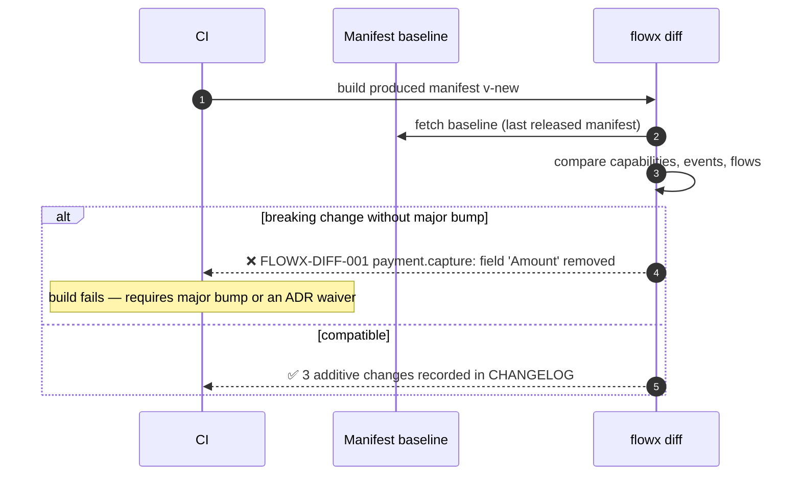

# 07 — Capability Model

> **Status:** Accepted · **Audience:** application engineers
> **Answers:** what is a capability, how is it contracted, versioned, secured and
> tested?

---

## 1. Definition

> A **capability** is one unit of business work with a stable identity, a
> versioned contract, an explicit authorisation stance and a declared side-effect
> profile.

```csharp
public interface ICapability<TIn, TOut>
{
    ValueTask<Result<TOut>> ExecuteAsync(TIn input, CapabilityContext ctx, CancellationToken ct);
}
```

That is the entire contract. Everything else — retries, telemetry, transaction
scope, authorisation, caching — is applied *around* it by the platform.

---

## 2. Anatomy

```csharp
[Capability("payment.capture", Version = "2.1.0",
    Authorization = Authorization.Permission, Permission = "payment:capture",
    Idempotent = true,
    SideEffects = ["payment-gateway", "payment-ledger"])]
public sealed class CapturePayment : ICapability<CaptureRequest, Capture>
{
    private readonly IPaymentGateway _gateway;
    private readonly ILedger _ledger;

    public CapturePayment(IPaymentGateway gateway, ILedger ledger)
        => (_gateway, _ledger) = (gateway, ledger);

    public async ValueTask<Result<Capture>> ExecuteAsync(
        CaptureRequest input, CapabilityContext ctx, CancellationToken ct)
    {
        // ctx.IdempotencyKey is stable across retries AND across replays.
        var outcome = await _gateway.CaptureAsync(
            input.OrderId, input.Amount, ctx.IdempotencyKey, ct);

        return outcome switch
        {
            { Declined: true } => Result.Fail<Capture>(PaymentErrors.Declined(outcome.Reason)),
            { Captured: true } => Result.Ok(new Capture(outcome.Reference, input.Amount)),
            _                  => Result.Fail<Capture>(PaymentErrors.GatewayUnavailable()),
        };
    }
}
```

### Returning a result

The `switch` above is explicit about both outcomes because it produces them in one
expression. In the common shape — an early return for the failure, the value at the
end — implicit conversions carry both:

```csharp
if (available < input.Quantity)
{
    return OrderErrors.OutOfStock(input.Sku, available);   // Error   → failed Result
}

await _store.ReserveAsync(input.Sku, input.Quantity, ctx.IdempotencyKey, ct);

return new Reservation(input.Sku, input.Quantity, ctx.IdempotencyKey);   // value → success
```

`Result.Ok(...)` and `Result.Fail<T>(...)` remain, and are the only option in one
case: a capability whose success type **is** `Error`. There both conversions apply and
an implicit one is a `CS0457` at the call site — diagnosed loudly, never silently
mis-resolved.

### The attribute is the contract

| Property | Meaning | Consumed by |
|---|---|---|
| `Id` | stable business identity, `<domain>.<verb>` | manifest, traces, policy targeting, agent tools |
| `Version` | SemVer of the **contract**, not the implementation | `flowx diff`, running-instance pinning |
| `Authorization` | `Public` \| `Authenticated` \| `Permission` \| `Policy` \| `Internal` | Policy Engine (stage 2), security audit |
| `Idempotent` | safe to invoke twice with the same idempotency key | Policy Engine — **gates whether retry is even allowed** |
| `SideEffects` | named external effects | impact analysis, blast-radius review, AI reasoning |
| `Deprecated` | replacement id + removal version | `flowx diff` |

*Two corrections to this table. `[Capability]` has **no `Timeout` member** — a
step's budget comes from `PolicySet.Timeout(...)` and there is no platform
default, so a step without that policy is genuinely unbounded within the flow's
deadline (`FLOWX1019` is written against exactly that fact). And `Deprecated`
reaches the manifest and `flowx diff`; there is no compiler warning at call
sites. `Id`, `Version` and `Authorization` are consumed as described;
`Idempotent` gates `FLOWX1014` at build time and nothing at run time, because no
retry executes.*

`Idempotent = false` plus a retry policy is a **compile error** (`FLOWX1014`).
FlowX will not let you retry something that is unsafe to retry.

---

## 3. Rules

**This table said "all compiler-enforced". Seven of the eight now are, one of them
partially.** The diagnostic column named four ids the compiler had never raised —
`FLOWX1006`, `FLOWX1007`, `FLOWX1008` and `FLOWX1009` were absent from
`FlowXDiagnostics`, which is deliberately built to contain only descriptors something
reports. A rule that names an id is the strongest claim this documentation set makes,
and four of these were the id of nothing. *Three of the four were built at WP-58;
`FLOWX1006` is the one that is still the id of nothing.* The **Enforced by** column
below is what is true today.

| # | Rule | Enforced by | Status |
|---|---|---|---|
| 1 | One input type, one output type; no overloads | `FLOWX1015` | **partial** — catches a type implementing `ICapability<,>` twice; nothing catches an overload |
| 2 | Returns `Result<TOut>`; expected failures are values | the interface signature + `FLOWX1016` | **enforced.** `ExecuteAsync` returns `ValueTask<Result<TOut>>`, so the shape is not optional; `FLOWX1016` (Warning, and an error here under `TreatWarningsAsErrors`) catches the way round it — throwing an outcome a caller could reasonably handle |
| 3 | Never invokes another capability | `FLOWX1004` + `CapabilitiesDoNotCallCapabilities` | **enforced** |
| 4 | Never references a transport or plugin assembly | `FLOWX1003` + `FlowsAreTransportFree` | **enforced** |
| 5 | Declares an authorisation stance | `FLOWX1010` + `EveryCapabilityDeclaresAuthorization` | **enforced** |
| 6 | Stateless: no mutable instance or static fields | [`FLOWX1009`](diagnostics/FLOWX1009.md) | **enforced since WP-58** — Warning, and Error where the compilation shows the type on a durable flow's replay path. *This cell read "**not enforced.** `FLOWX1009` does not exist".* `RuntimeHasNoMutableStatics` still covers only `FlowX.Runtime`; this rule is what covers application capabilities |
| 7 | Time/ID/randomness only via `ctx` | [`FLOWX1007`](diagnostics/FLOWX1007.md) + [`FLOWX1008`](diagnostics/FLOWX1008.md) | **enforced since WP-58**, at the same severities. *This cell read "**not enforced** … nothing stops a capability calling `DateTime.UtcNow` instead".* `CapabilityContext` offers `UtcNow`, `NewId()` and `Random`; reaching past them is now reported |
| 8 | Contract types are immutable records, serialisable by a generated STJ context | — | **not enforced.** `FLOWX1006` does not exist — the last of the four ids this table named for nothing. **WP-59** |

Rules 6, 7 and 8 are the determinism rules, and they are exactly the rules a
`Durable` flow needs — which is why this paragraph said they were "all blocked on the
same phase". *They were not blocked on the same thing, and the difference is why two
of them shipped and one did not.* Rules 6 and 7 were blocked on **severity**:
ADR-0003 made them informational under `Ephemeral`, `Ephemeral` was the only profile
the runtime executed, and an Info diagnostic never reaches a build log. WP-52 removed
that premise and WP-58 raised all three ids, with the severity of the whole
determinism set re-decided at once —
[the diagnostics index](diagnostics/README.md#the-severity-of-the-determinism-set) is
the record. Rule 8 was never a severity question: `FLOWX1006` checks membership in
the generated `System.Text.Json` context that
[ADR-0015 commitment 5](adr/ADR-0015-journal-schema-and-durable-execution.md) requires
journal payloads to be written through, and that writer is **WP-59**. The same table
appears in [06 §5](06-Execution-Engine.md#5-the-determinism-boundary) with the
diagnostics' own severities. Write contract types as if rule 8 held; nothing will
tell you when it does not.

Rule 3 is the load-bearing one. Because capabilities cannot call each other, the
capability graph is a **set**, not a graph — all composition lives in flows,
which is exactly what makes the architecture analysable, testable, and
replayable.

---

## 4. Contract design

```csharp
// Contracts live in a dedicated assembly with no dependencies. They are the
// published surface; the implementation is an internal detail.
public sealed record CaptureRequest(OrderId OrderId, Money Amount, PaymentMethod Method);
public sealed record Capture(PaymentReference Reference, Money Amount);

public static class PaymentErrors
{
    public static Error Declined(string reason) => new(
        "payment.declined", $"Payment declined: {reason}", ErrorCategory.Conflict);

    public static Error GatewayUnavailable() => new(
        "payment.gateway_unavailable", "Payment gateway unavailable", ErrorCategory.Unavailable);
}
```

| Rule | Reason |
|---|---|
| Contracts are `record` types, immutable | replay safety, thread safety, cheap equality |
| No primitive obsession: `OrderId`, `Money`, not `Guid`, `decimal` | the manifest becomes semantically meaningful, not just structurally |
| Errors are declared in a static class per domain | error codes are enumerable — they appear in the manifest and in generated OpenAPI |
| Contracts live in `<App>.Contracts`, referenced by nothing else | prevents implementation leaking into the published surface |

> [!WARNING]
> **These last two rules cancel each other out, and following both produces no
> error catalogue at all.**
>
> The catalogue is not declared, it is *derived*:
> [`ErrorCatalogueReader`](../src/FlowX.Compiler/Analysis/ErrorCatalogueReader.cs)
> follows every expression of type `Error` in a capability's body back to the
> `new Error(code, message, category)` that produced it, and reads the code and
> the category off that constructor. Following it means reading the factory's
> **syntax**. A symbol with no `DeclaringSyntaxReferences` — which is every
> symbol in a *referenced assembly* — ends the trail, and the reader then marks
> the catalogue incomplete. An incomplete catalogue is not published at all
> ([ADR-0014](adr/ADR-0014-derived-error-catalogue-vs-build-budget.md); absent is
> a state a consumer can see, short is not).
>
> So a team that puts `PaymentErrors` in `<App>.Contracts` and the capability in
> `<App>.Application`, exactly as the rows above prescribe, gets `errors`
> **omitted from the manifest for every capability in the application** — and
> gets it silently, because omission is the design's honest answer and there is
> no diagnostic saying why. The generated OpenAPI responses and the agent tool
> descriptors that the first row promises are then generated from nothing.
>
> `samples/ecommerce` does not hit this, and that is not evidence: it is a single
> project, so `Contracts.cs` and `Capabilities.cs` are in one compilation and the
> trail never leaves it.
> [B13](benchmarks/B13-error-catalogue-resolution.md) measured the same thing
> against a 38-capability corpus.
>
> **Until this is resolved, keep the error factory in the same compilation as the
> capabilities that use it.** That is the layout the derivation supports, and it
> is the one the reference sample uses. Resolving it properly means either
> teaching the reader to read metadata across an assembly boundary, or changing
> what this section prescribes — neither has happened, and the choice belongs
> with ADR-0014's owner rather than in a doc note.

---

## 5. Versioning

FlowX versions **contracts**, not code. Refactoring the body of a capability is
not a version change; changing what it accepts or returns is.

| Change | SemVer | `flowx diff` verdict |
|---|---|---|
| Add an optional input field with a default | minor | compatible |
| Add an output field | minor | compatible |
| Add a new error code | minor | compatible (documented) |
| Rename or remove an input field | **major** | **breaking — build fails** |
| Change a field's type | **major** | **breaking — build fails** |
| Make an optional input required | **major** | **breaking — build fails** |
| Remove an output field | **major** | **breaking — build fails** |
| Change an error's category | **major** | **breaking** (transport mapping changes) |
| Change behaviour without changing shape | patch/minor | compatible — but flagged for review |

### Side-by-side versions

```csharp
[Capability("payment.capture", Version = "1.4.0",
    Authorization = Authorization.Permission, Permission = "payment:capture",
    Deprecated = "2026-12-31, use 2.x")]
public sealed class CapturePaymentV1 : ICapability<CaptureRequestV1, CaptureV1> { }

[Capability("payment.capture", Version = "2.1.0",
    Authorization = Authorization.Permission, Permission = "payment:capture")]
public sealed class CapturePayment : ICapability<CaptureRequest, Capture> { }
```

*`Authorization` was missing from both declarations here. It is a `required`
member, so the block as printed did not compile — which is the cheapest kind of
error to leave in a specification and the most annoying to hit.*

Flows pin the major version they compiled against (`payment.capture@2`). A
running durable instance keeps executing the version it started with, even
across a deployment — the journal records the resolved version per step.



---

## 6. Authorisation

Authorisation is attached to the capability, so it survives transport changes
(P3 + P11).

```csharp
public enum Authorization
{
    Public,         // explicit, greppable, reviewable — never the default
    Authenticated,  // any valid principal
    Permission,     // named permission, e.g. "payment:capture"
    Policy,         // named ASP.NET Core authorization policy
    Internal        // callable only from another flow, never from an external trigger
}
```

- A capability with **no** stance fails the build (`FLOWX1010`).
- `Internal` capabilities are unreachable from any trigger — the Trigger Engine
  rejects them at admission and the compiler removes them from the agent tool
  surface.
- The manifest lists every capability's stance, so "who can capture a payment?"
  is a query, not an investigation (QR9).

---

## 7. Idempotency

```csharp
// ctx.IdempotencyKey is deterministic:
//   ephemeral : trigger's Idempotency-Key header, or a hash of the input
//   durable   : "{flowInstanceId}:{stepId}:{attempt-invariant}"
```

The key is **stable across retries and across replays**, which is what lets a
capability deduplicate against an external system.

| Capability declares | Retry policy allowed? | Runtime behaviour |
|---|---|---|
| `Idempotent = true` | yes | retried per policy; key passed to the capability |
| `Idempotent = false` | **no** (`FLOWX1014`) | single attempt; failure is terminal |
| `Idempotent = false` + `Compensable` | no retry, but compensation on later failure | saga semantics |

> **The "Runtime behaviour" column is not runtime behaviour yet.** `FLOWX1014` is
> real and fires at build time. Nothing retries: no policy executes
> ([10](10-Policy-Framework.md), **P4**), so `Idempotent = true` plus a `Retry`
> policy currently means one attempt, exactly like `Idempotent = false`.
>
> Two spellings in this section do not exist. There is no `Compensable` member on
> `[Capability]` — compensation is declared on the *step*, with
> `.CompensateWith<T>()`, and that does work. And there is no `Dedupe`,
> `DedupeMode` or `DedupeWindow`; the block below would not compile.
> `ctx.IdempotencyKey` is real and is stable across retries by construction, but
> there is no platform-level dedup store behind it — that is `IIdempotencyStore`,
> a **P4** extension point that is not declared
> ([17](17-Plugin-System.md)).

```csharp
[Capability("email.send", Idempotent = true, Dedupe = DedupeMode.Platform, DedupeWindow = "PT24H")]
```

---

## 8. Testing a capability

A capability is the easiest thing in the system to test: it is a function.

```csharp
[Fact] // RED first
public async Task CapturePayment_returns_declined_when_gateway_declines()
{
    var gateway = new FakePaymentGateway(declineWith: "insufficient_funds");
    var sut = new CapturePayment(gateway, new FakeLedger());

    var result = await sut.ExecuteAsync(
        new CaptureRequest(OrderId.New(), Money.Eur(19.98m), PaymentMethod.Card),
        new TestCapabilityContext(capabilityId: "payment.capture"), CancellationToken.None);

    result.IsSuccess.Should().BeFalse();
    result.Error.Code.Should().Be("payment.declined");
    result.Error.Category.Should().Be(ErrorCategory.Conflict);
}
```

No host, no DI container, no HTTP, no broker, no database. The testing kit
(`FlowX.Testing`) supplies the context, with a controllable clock, a seeded
random source and a fixed idempotency key so tests are deterministic by
construction.

> **The spelling above is not the one that ships.** There is no
> `CapabilityContext.ForTest()`. `FlowX.Testing` provides
> [`TestCapabilityContext`](../src/FlowX.Testing/TestCapabilityContext.cs), an
> ordinary class you construct — every value it returns is settable, and
> `IdsIssued` counts the ids the capability asked for. The real call is:
>
> ```csharp
> var ctx = new TestCapabilityContext(capabilityId: "payment.capture");
> ```
>
> A static factory on the abstract base would put a testing concern on the
> production contract, which is why it was not built that way. This paragraph
> named it for months anyway.

### The test pyramid FlowX expects

| Level | Subject | Infrastructure | Kit | Target share |
|---|---|---|---|---|
| Unit | one capability | none | `TestCapabilityContext` | ~70 % |
| Flow | one flow with substituted capabilities | none | `FlowTestHost` | ~20 % |
| Integration | capability against a real adapter | Testcontainers | — | ~8 % |
| Conformance | the whole trigger→flow→journal path | Testcontainers | — | ~2 % |

**[23-Testing-Strategy](23-Testing-Strategy.md) is the full account**, including which
levels the kit supports and which it does not. In short: the top two rows are supported;
the bottom two are not. *This sentence gave the reason as "there is no journal to conform
against", then as "there is no store implementation and no Testcontainers harness".
Neither survives intact: WP-51 defined the journal, WP-52 made the runtime write to it,
and WP-53 shipped `plugins/FlowX.Postgres` with `tests/FlowX.Postgres.Tests` running the
conformance suite against a real PostgreSQL. The conclusion is unchanged, and the reason
is narrower than it was — there is still **no Testcontainers anywhere in this
repository** (that suite takes a connection string from the environment and skips, loudly,
when there is none), the kit offers nothing for either row, and no test drives a whole
trigger→flow→journal path. That last one is now a gap rather than an impossibility: the
generated HTTP endpoint runs through `FlowHost`, so a durable flow **is** reachable over
HTTP on a host that registered the stores — nothing points a request at one and then reads
the rows back.*

> **This paragraph said `FlowTestHost` does not exist, and for two phases it was
> right.** It shipped in WP-49, and the shape changed on contact with what the
> compiler emits: the host is given the flow's generated `Plan` and `Dispatcher`
> rather than discovering them from a `TFlow` type parameter, because doing that
> would need reflection over generated members (which constraint C2 forbids) and a
> container to construct the dispatcher's capabilities (which is the mock framework
> it deliberately is not). The reason is written down in
> [23 §4.1](23-Testing-Strategy.md#41-why-the-plan-and-the-dispatcher-are-named).
> Virtual time and the durable-replay harness the old block also promised are still
> unbuilt, and [23 §5](23-Testing-Strategy.md#5-what-is-deliberately-not-here) says
> why for each.

---

## 9. Capability granularity — how big is one?

The most common design mistake is making capabilities too small (ceremony) or
too big (untestable). The test:

> **A capability is correctly sized when a business stakeholder recognises its
> name and can say whether it succeeded.**

| Too small | Right | Too big |
|---|---|---|
| `MapOrderDto` | `order.validate` | `order.process_everything` |
| `CalculateTax` (pure, used once) | `pricing.calculate` (reused, has policy) | `checkout.run` |
| `OpenDbConnection` | `inventory.reserve` | `sync_all_systems` |

Pure functions with no policy needs, no telemetry value and a single caller stay
**private methods inside a capability**. Principle P2 is about business logic,
not about arithmetic.

---

## 10. The Capability Marketplace (future)

Because capabilities are versioned, contracted, policy-annotated and
side-effect-declared, they are distributable.

```bash
dotnet add package FlowX.Capabilities.Stripe    # payment.capture, payment.refund
flowx graph                                     # they appear in the graph immediately
```

A marketplace capability must ship: contract assembly, `[Capability]` metadata,
declared side effects, an authorisation stance, a conformance test suite and an
SBOM. Anything less is not installable. Design in
[17-Plugin-System](17-Plugin-System.md); roadmap phase in
[20-Roadmap](20-Roadmap.md).

---

**Next:** [08 — Flow Definition](08-Flow-Definition.md)
