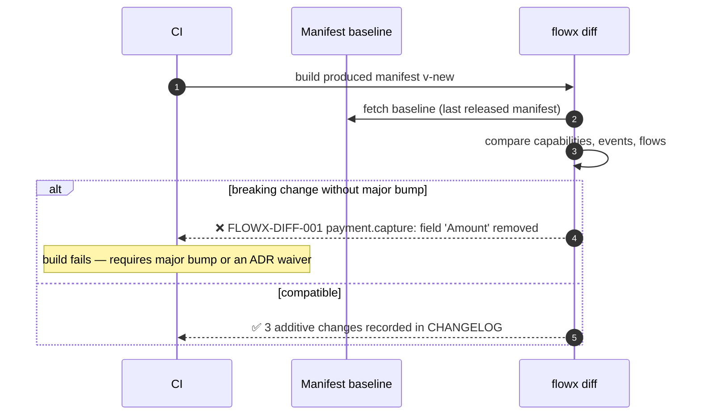

# 07 — Capability Model

> **Status:** Accepted · **Audience:** application engineers
> **Answers:** what is a capability, how is it contracted, versioned, secured and
> tested?

---

## 1. Definition

> A **capability** is one unit of business work with a stable identity, a
> versioned contract, an explicit authorisation stance and a declared side-effect
> profile.

```csharp
public interface ICapability<TIn, TOut>
{
    ValueTask<Result<TOut>> ExecuteAsync(TIn input, CapabilityContext ctx, CancellationToken ct);
}
```

That is the entire contract. Everything else — retries, telemetry, transaction
scope, authorisation, caching — is applied *around* it by the platform.

---

## 2. Anatomy

```csharp
[Capability("payment.capture", Version = "2.1.0",
    Authorization = Authorization.Permission, Permission = "payment:capture",
    Idempotent = true,
    SideEffects = ["payment-gateway", "payment-ledger"])]
public sealed class CapturePayment : ICapability<CaptureRequest, Capture>
{
    private readonly IPaymentGateway _gateway;
    private readonly ILedger _ledger;

    public CapturePayment(IPaymentGateway gateway, ILedger ledger)
        => (_gateway, _ledger) = (gateway, ledger);

    public async ValueTask<Result<Capture>> ExecuteAsync(
        CaptureRequest input, CapabilityContext ctx, CancellationToken ct)
    {
        // ctx.IdempotencyKey is stable across retries AND across replays.
        var outcome = await _gateway.CaptureAsync(
            input.OrderId, input.Amount, ctx.IdempotencyKey, ct);

        return outcome switch
        {
            { Declined: true } => Result.Fail<Capture>(PaymentErrors.Declined(outcome.Reason)),
            { Captured: true } => Result.Ok(new Capture(outcome.Reference, input.Amount)),
            _                  => Result.Fail<Capture>(PaymentErrors.GatewayUnavailable()),
        };
    }
}
```

### Returning a result

The `switch` above is explicit about both outcomes because it produces them in one
expression. In the common shape — an early return for the failure, the value at the
end — implicit conversions carry both:

```csharp
if (available < input.Quantity)
{
    return OrderErrors.OutOfStock(input.Sku, available);   // Error   → failed Result
}

await _store.ReserveAsync(input.Sku, input.Quantity, ctx.IdempotencyKey, ct);

return new Reservation(input.Sku, input.Quantity, ctx.IdempotencyKey);   // value → success
```

`Result.Ok(...)` and `Result.Fail<T>(...)` remain, and are the only option in one
case: a capability whose success type **is** `Error`. There both conversions apply and
an implicit one is a `CS0457` at the call site — diagnosed loudly, never silently
mis-resolved.

### The attribute is the contract

| Property | Meaning | Consumed by |
|---|---|---|
| `Id` | stable business identity, `<domain>.<verb>` | manifest, traces, policy targeting, agent tools |
| `Version` | SemVer of the **contract**, not the implementation | `flowx diff`, running-instance pinning |
| `Authorization` | `Public` \| `Authenticated` \| `Permission` \| `Policy` \| `Internal` | Policy Engine (stage 2), security audit |
| `Idempotent` | safe to invoke twice with the same idempotency key | Policy Engine — **gates whether retry is even allowed** |
| `SideEffects` | named external effects | impact analysis, blast-radius review, AI reasoning |
| `Timeout` | default step budget | Policy Engine (stage 4) |
| `Deprecated` | replacement id + removal version | `flowx diff`, compiler warning at call sites |

`Idempotent = false` plus a retry policy is a **compile error** (`FLOWX1014`).
FlowX will not let you retry something that is unsafe to retry.

---

## 3. Rules (all compiler-enforced)

| # | Rule | Diagnostic |
|---|---|---|
| 1 | One input type, one output type; no overloads | `FLOWX1015` |
| 2 | Returns `Result<TOut>`; expected failures are values | `FLOWX1016` |
| 3 | Never invokes another capability | `FLOWX1004` |
| 4 | Never references a transport or plugin assembly | `FLOWX1003` |
| 5 | Declares an authorisation stance | `FLOWX1010` |
| 6 | Stateless: no mutable instance or static fields | `FLOWX1009` |
| 7 | Time/ID/randomness only via `ctx` | `FLOWX1007/1008` |
| 8 | Contract types are immutable records, serialisable by a generated STJ context | `FLOWX1006` |

Rule 3 is the load-bearing one. Because capabilities cannot call each other, the
capability graph is a **set**, not a graph — all composition lives in flows,
which is exactly what makes the architecture analysable, testable, and
replayable.

---

## 4. Contract design

```csharp
// Contracts live in a dedicated assembly with no dependencies. They are the
// published surface; the implementation is an internal detail.
public sealed record CaptureRequest(OrderId OrderId, Money Amount, PaymentMethod Method);
public sealed record Capture(PaymentReference Reference, Money Amount);

public static class PaymentErrors
{
    public static Error Declined(string reason) => new(
        "payment.declined", $"Payment declined: {reason}", ErrorCategory.Conflict);

    public static Error GatewayUnavailable() => new(
        "payment.gateway_unavailable", "Payment gateway unavailable", ErrorCategory.Unavailable);
}
```

| Rule | Reason |
|---|---|
| Contracts are `record` types, immutable | replay safety, thread safety, cheap equality |
| No primitive obsession: `OrderId`, `Money`, not `Guid`, `decimal` | the manifest becomes semantically meaningful, not just structurally |
| Errors are declared in a static class per domain | error codes are enumerable — they appear in the manifest and in generated OpenAPI |
| Contracts live in `<App>.Contracts`, referenced by nothing else | prevents implementation leaking into the published surface |

---

## 5. Versioning

FlowX versions **contracts**, not code. Refactoring the body of a capability is
not a version change; changing what it accepts or returns is.

| Change | SemVer | `flowx diff` verdict |
|---|---|---|
| Add an optional input field with a default | minor | compatible |
| Add an output field | minor | compatible |
| Add a new error code | minor | compatible (documented) |
| Rename or remove an input field | **major** | **breaking — build fails** |
| Change a field's type | **major** | **breaking — build fails** |
| Make an optional input required | **major** | **breaking — build fails** |
| Remove an output field | **major** | **breaking — build fails** |
| Change an error's category | **major** | **breaking** (transport mapping changes) |
| Change behaviour without changing shape | patch/minor | compatible — but flagged for review |

### Side-by-side versions

```csharp
[Capability("payment.capture", Version = "1.4.0", Deprecated = "2026-12-31, use 2.x")]
public sealed class CapturePaymentV1 : ICapability<CaptureRequestV1, CaptureV1> { }

[Capability("payment.capture", Version = "2.1.0")]
public sealed class CapturePayment : ICapability<CaptureRequest, Capture> { }
```

Flows pin the major version they compiled against (`payment.capture@2`). A
running durable instance keeps executing the version it started with, even
across a deployment — the journal records the resolved version per step.



---

## 6. Authorisation

Authorisation is attached to the capability, so it survives transport changes
(P3 + P11).

```csharp
public enum Authorization
{
    Public,         // explicit, greppable, reviewable — never the default
    Authenticated,  // any valid principal
    Permission,     // named permission, e.g. "payment:capture"
    Policy,         // named ASP.NET Core authorization policy
    Internal        // callable only from another flow, never from an external trigger
}
```

- A capability with **no** stance fails the build (`FLOWX1010`).
- `Internal` capabilities are unreachable from any trigger — the Trigger Engine
  rejects them at admission and the compiler removes them from the agent tool
  surface.
- The manifest lists every capability's stance, so "who can capture a payment?"
  is a query, not an investigation (QR9).

---

## 7. Idempotency

```csharp
// ctx.IdempotencyKey is deterministic:
//   ephemeral : trigger's Idempotency-Key header, or a hash of the input
//   durable   : "{flowInstanceId}:{stepId}:{attempt-invariant}"
```

The key is **stable across retries and across replays**, which is what lets a
capability deduplicate against an external system.

| Capability declares | Retry policy allowed? | Runtime behaviour |
|---|---|---|
| `Idempotent = true` | yes | retried per policy; key passed to the capability |
| `Idempotent = false` | **no** (`FLOWX1014`) | single attempt; failure is terminal |
| `Idempotent = false` + `Compensable` | no retry, but compensation on later failure | saga semantics |

FlowX also provides an optional platform-level dedup store for capabilities that
cannot deduplicate downstream:

```csharp
[Capability("email.send", Idempotent = true, Dedupe = DedupeMode.Platform, DedupeWindow = "PT24H")]
```

---

## 8. Testing a capability

A capability is the easiest thing in the system to test: it is a function.

```csharp
[Fact] // RED first
public async Task CapturePayment_returns_declined_when_gateway_declines()
{
    var gateway = new FakePaymentGateway(declineWith: "insufficient_funds");
    var sut = new CapturePayment(gateway, new FakeLedger());

    var result = await sut.ExecuteAsync(
        new CaptureRequest(OrderId.New(), Money.Eur(19.98m), PaymentMethod.Card),
        CapabilityContext.ForTest(), CancellationToken.None);

    result.IsSuccess.Should().BeFalse();
    result.Error.Code.Should().Be("payment.declined");
    result.Error.Category.Should().Be(ErrorCategory.Conflict);
}
```

No host, no DI container, no HTTP, no broker, no database. The testing kit
(`FlowX.Testing`) provides `CapabilityContext.ForTest()` with a controllable
clock, a seeded random source and a fixed idempotency key so tests are
deterministic by construction.

### The test pyramid FlowX expects

| Level | Subject | Infrastructure | Target share |
|---|---|---|---|
| Unit | one capability | none | ~70 % |
| Flow | one flow with fake capabilities | none | ~20 % |
| Integration | capability against a real adapter | Testcontainers | ~8 % |
| Conformance | the whole trigger→flow→journal path | Testcontainers | ~2 % |

`FlowX.Testing` supplies `FlowTestHost` for the flow level:

```csharp
var host = FlowTestHost.For<PlaceOrderFlow>()
    .Substitute<ReserveInventory>(_ => Result.Fail<Reservation>(InventoryErrors.OutOfStock("SKU-1")))
    .Build();

var result = await host.RunAsync(new PlaceOrder(...));

result.Should().HaveFailedWith("inventory.out_of_stock");
result.Should().HaveCompensated();          // asserts the compensation actually ran
result.Trace.Should().NotHaveExecuted<CapturePayment>();
```

---

## 9. Capability granularity — how big is one?

The most common design mistake is making capabilities too small (ceremony) or
too big (untestable). The test:

> **A capability is correctly sized when a business stakeholder recognises its
> name and can say whether it succeeded.**

| Too small | Right | Too big |
|---|---|---|
| `MapOrderDto` | `order.validate` | `order.process_everything` |
| `CalculateTax` (pure, used once) | `pricing.calculate` (reused, has policy) | `checkout.run` |
| `OpenDbConnection` | `inventory.reserve` | `sync_all_systems` |

Pure functions with no policy needs, no telemetry value and a single caller stay
**private methods inside a capability**. Principle P2 is about business logic,
not about arithmetic.

---

## 10. The Capability Marketplace (future)

Because capabilities are versioned, contracted, policy-annotated and
side-effect-declared, they are distributable.

```bash
dotnet add package FlowX.Capabilities.Stripe    # payment.capture, payment.refund
flowx graph                                     # they appear in the graph immediately
```

A marketplace capability must ship: contract assembly, `[Capability]` metadata,
declared side effects, an authorisation stance, a conformance test suite and an
SBOM. Anything less is not installable. Design in
[17-Plugin-System](17-Plugin-System.md); roadmap phase in
[20-Roadmap](20-Roadmap.md).

---

**Next:** [08 — Flow Definition](08-Flow-Definition.md)
