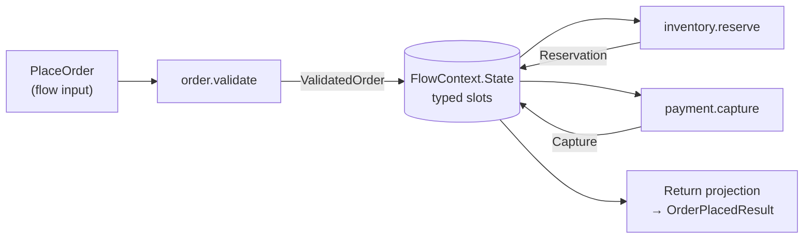
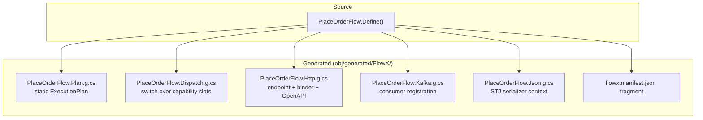
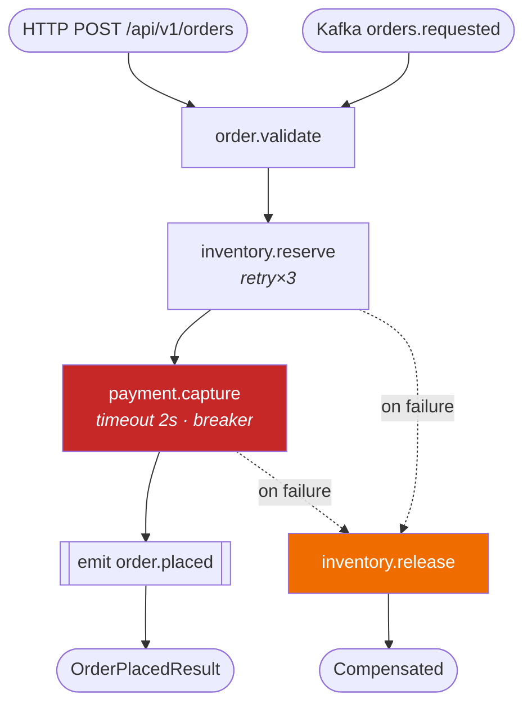

# 08 — Flow Definition

> **Status:** Accepted · **Audience:** application engineers
> **Answers:** what is the DSL, what control flow exists, and what does it compile into?

---

## 1. The shape of a flow

```csharp
[Flow("order.place", Version = "1.2.0", Profile = ExecutionProfile.Durable)]
[HttpTrigger("POST", "/api/v1/orders", Idempotent = true)]
[KafkaTrigger("orders.requested", Group = "order-placement")]
public sealed partial class PlaceOrderFlow : Flow<PlaceOrder, OrderPlacedResult>
{
    protected override void Define(IFlowBuilder<PlaceOrder, OrderPlacedResult> flow) => flow
        .Step<ValidateOrder>()
        .Step<ReserveInventory>().CompensateWith<ReleaseInventory>()
        .Step<CapturePayment>().WithPolicy(Policies.PaymentGateway)
        .Emit<OrderPlaced>()
        .Return(ctx => new OrderPlacedResult(ctx.Get<OrderId>(), ctx.Get<Capture>().Reference));
}
```

Three things are true of every flow:

1. **`Define` is a declaration, not a script.** It runs at most once (and often
   zero times — the compiler resolves it statically). It must be pure.
2. **The flow never names its transport.** `[HttpTrigger]` is metadata read by
   the compiler; the flow body cannot see it.
3. **The flow contains no business rules.** Rules live in capabilities.
   The flow expresses *order, condition, and recovery* — nothing else.

---

## 2. Data flow between steps

Steps do not pass values positionally. Each step's output is placed into the
typed context state bag, and the next step's input is bound from it.



Binding is resolved **at compile time**. If `CapturePayment` needs a
`CaptureRequest` and nothing in the context can produce one, the build fails
with a diagnostic that names the missing type and lists what *is* available:

```
error FLOWX1020: Step 3 'payment.capture' requires 'CaptureRequest' but the flow
                 context can only supply: PlaceOrder, ValidatedOrder, Reservation.
                 Add a mapping: .Step<CapturePayment, CaptureRequest>(ctx => ...)
                 See https://flowx.dev/diag/FLOWX1020
```

Explicit mapping when the shapes differ:

```csharp
.Step<CapturePayment, CaptureRequest>(ctx => new CaptureRequest(
    ctx.Get<ValidatedOrder>().Id,
    ctx.Get<ValidatedOrder>().Total,
    ctx.Input.PaymentMethod))
```

Both type arguments are written explicitly: C# cannot infer the mapping's result
type from a lambda body, and FlowX will not trade that away for a prettier call
site — an `object`-typed mapping would move a whole class of binding errors from
build time to run time, which is the opposite of what this platform is for.

---

## 3. Control flow

### 3.1 Conditional

```csharp
flow.Step<AssessRisk>()
    .When(ctx => ctx.Get<RiskScore>().Value > 80, high => high
        .Step<RequestManualReview>()
        .AwaitSignal<ReviewDecision>(timeout: TimeSpan.FromHours(24)))
    .Otherwise(low => low
        .Step<AutoApprove>())
    .Step<NotifyApplicant>();
```

Conditions may read **only** `ctx.State`, `ctx.Input` and prior step results
(`FLOWX1011`). A condition that reads a clock, a static, or an external service
is a determinism violation and fails the build in `Durable` flows. In `Ephemeral`
flows it is a warning — see [FLOWX1011](diagnostics/FLOWX1011.md) for what the rule
detects, what it provably cannot, and why `ctx.UtcNow` is permitted where
`DateTime.UtcNow` is not.

**The rule is not only about `When`.** It applies to every builder method that takes
the flow context — the `Switch` and `ForEach` selectors, the `Return` projection, the
`Emit` and `EmitOnFailure` payload maps, and the `Step<TCapability, TStepIn>` and
`SubFlow` input mappings — and the analyzer checks all of them, naming the construct
it found, so a message reads "the `Return` projection in flow 'X'…" rather than "the
condition". [The list is on the rule's page](diagnostics/FLOWX1011.md#which-delegates-it-covers).

### 3.2 Branch on a value

```csharp
flow.Switch(ctx => ctx.Get<ValidatedOrder>().Channel)
    .Case(Channel.Retail,    b => b.Step<ApplyRetailPricing>())
    .Case(Channel.Wholesale, b => b.Step<ApplyWholesalePricing>().Step<RequireCreditCheck>())
    .Default(b => b.Fail(OrderErrors.UnsupportedChannel));
```

The selector obeys the same determinism rule as a `When` predicate: context,
input and prior step results only — enforced by `FLOWX1011`, which reports it as
"the `Switch` selector". It is evaluated **exactly once**, and the
cases are then tested against the value it produced, in declaration order, with
`EqualityComparer<TValue>.Default` — so an `enum`, an `int` and a `string` all
mean what you expect and none of them is boxed. The first match wins; a second
case with the same value is unreachable rather than an error, exactly as a
duplicated `When` would be.

`TValue` is inferred from the selector, so a `.Case(...)` whose value is of the
wrong type is a C# compile error rather than an arm that silently never matches.

**A value that matches no case, in a switch with no `Default`, continues after
the switch.** It is not an error and there is no diagnostic. Requiring a
`Default` would force `.Default(b => { })` onto every switch that legitimately
special-cases two channels out of five, and it still would not make the switch
exhaustive — an `enum` can hold a value no member declares, so exhaustiveness is
not a property the compiler can check for the general case. The rule is therefore
the one `When` already uses: a branch nobody took does nothing. Where doing
nothing is wrong, say so:

```csharp
.Default(b => b.Fail(OrderErrors.UnsupportedChannel))
```

> **Not yet true of `.Fail(...)`.** The builder declares it and the table in §4
> lists it, but the compiler does not model it: a block whose only call is
> `.Fail(...)` compiles to an *empty* block, which for a `Default` means the
> fall-through above. Until `Fail` compiles to a step, spell an unsupported value
> out as a capability that returns `Result.Fail(...)`.

`Switch` compiles into the same flat step array as everything else — one `Switch`
node carrying a target per case plus a default target, and a `Jump` closing each
case block. See [06 §3](06-Execution-Engine.md#3-the-step-loop). The manifest
publishes the *shape* — that the flow branches, and what is in each arm — and
never the selector or the case values, because
[a manifest is structure, never values](adr/ADR-0005-manifest-as-build-artifact.md).

### 3.3 Parallel

```csharp
flow.Parallel(p => p
        .Branch<CheckCredit>()
        .Branch<CheckFraud>()
        .Branch<CheckSanctions>(),
     merge: MergeStrategy.AllMustSucceed)
    .Step<Decide>();
```

Branches write to disjoint context slots ([`FLOWX1013`](diagnostics/FLOWX1013.md)); they
share the flow's deadline; failure semantics per `MergeStrategy` — see
[06 §9](06-Execution-Engine.md#9-concurrency-and-parallel-steps).

A branch is either a single capability, `Branch<T>()`, or a whole chain,
`Branch(b => b.Step<A>().Step<B>())`; the two are the same concept with two spellings and
compile to the same shape. A `Parallel` with fewer than two branches is laid out **inline**,
with no fork node at all — running one thing concurrently is running it, and publishing a
decision the flow does not make would put a lie in the manifest.

```csharp
flow.Parallel(p => p
        .Branch<CheckCredit>()
        .Branch<CheckFraud>()
        .Branch(sanctions => sanctions
            .Step<LoadWatchlist>()
            .Step<CheckSanctions>()),
     merge: MergeStrategy.Quorum(2))
    .Step<Decide>();
```

`MergeStrategy` is a struct rather than an enum, so `Quorum(n)` can carry its number;
`default(MergeStrategy)` is `AllMustSucceed`. Under `AllSettled` the step after the join
reads each branch's outcome with `ctx.Get<ParallelOutcome>()`.

Two things are worth knowing before reaching for it. Branches are as concurrent as their
steps are — a branch whose steps all complete synchronously finishes before its sibling
starts, so a fork buys nothing for CPU-bound work. And a fork allocates, roughly 240 B per
branch; the zero-allocation budget covers the linear, conditional and switch paths and
deliberately does not cover this one.

### 3.4 Iteration

```csharp
flow.ForEach(ctx => ctx.Get<ValidatedOrder>().Lines,
        line => line.Step<ReserveLine>().CompensateWith<ReleaseLine>(),
        options: new ForEachOptions { MaxDegreeOfParallelism = 4, ContinueOnError = false })
    .Step<ConfirmReservation>();
```

Bounded by construction: `MaxDegreeOfParallelism` is required and capped by the
runtime — at 64, a constant rather than something derived from the build machine, so
identical source compiles to an identical graph everywhere. A bound of zero is a build
failure rather than a loop that never runs; a bound of a thousand is clamped rather than
refused, because asking for it is reasonable and refusing to run a correct flow is not.

`ForEach` compiles into the same flat step array as everything else — one `ForEach` node
carrying its join, and the body laid out immediately after it. **The body appears once,
however many elements the collection holds**, and the engine re-enters that span per
element. So the plan, the manifest and a rendered diagram are all independent of the size
of the data: a flow that reserves one line and one that reserves a thousand compile to the
same graph. What it costs is a pass over the body's step loop per element, which is the
price of not unrolling something the compiler cannot count.

The selector is typed `IReadOnlyList<TItem>` rather than `IEnumerable<TItem>` on purpose.
It is evaluated **exactly once**, before the first element, and the count it reports is
what bounds the loop — every other shape terminates because targets only ever point
forward, and this is the one that needs a second reason.

**The current element is scoped to its iteration.** It is not written into the flow's state
bag: that bag is keyed by type, so every element would take the same slot — a race above a
bound of one, and a leftover visible to every step after the loop even at one. Each pass
instead runs under a view of the context in which the element resolves by its own type, and
reads fall through to the flow for everything else. Writes do not: what a body step
*returns* is a value the flow produced, and goes in the shared bag. The consequence is worth
knowing before raising the bound above one — two elements writing the same output type
still race, and the winner is whichever finished last. That is the same modelling question
[`FLOWX1013`](diagnostics/FLOWX1013.md) asks of a `Parallel`'s branches; the runtime
guarantees only that the failure mode is a wrong value and never a corrupted dictionary.

Compensation is per element and unwinds in **strict reverse**. Each completed step is
recorded with the scope it completed in, so `ReleaseLine` undoes the line its own
`ReserveLine` reserved rather than whichever line the loop ended on. With
`ContinueOnError = false` — the default — the first failing element stops the iteration and
fails the flow with that element's own error; the elements that already succeeded are not
undone by the loop, they are undone by the flow's own unwind, in order, along with
everything before it. With `ContinueOnError = true` every element runs, the flow continues,
and the step after the loop reads `ctx.Get<ForEachOutcome>()` to decide what a partial
success means — the same bargain `MergeStrategy.AllSettled` offers a fork. A selector that
*throws* is not covered by `ContinueOnError`: a collection that was never read is not
something to continue past.

A loop allocates, roughly **32 bytes per element** — one scope object, and nothing per step
of the body. The zero-allocation budget covers the linear, conditional and switch paths and
deliberately does not cover this one, exactly as it does not cover a fork.

> **Not yet true: the journal entry.** "In `Durable` flows each iteration commits its own
> journal entry, so a crash resumes mid-collection rather than restarting it" describes P2.
> There is no journal yet, so today a crash restarts the flow. The shape is the one that
> makes it possible — each element is a bounded range with a scope of its own — but nothing
> persists it.

### 3.5 Waiting

```csharp
flow.AwaitSignal<PaymentConfirmed>(timeout: TimeSpan.FromMinutes(30))
        .OnTimeout(f => f.Step<CancelPendingOrder>())
    .Delay(TimeSpan.FromHours(1))            // durable timer, holds no resources
    .Step<SendFollowUp>();
```

`AwaitSignal` and `Delay` are only available in `Durable` flows — using them in
an `Ephemeral` flow is `FLOWX1017` (error), because an in-memory wait cannot
survive a deployment.

### 3.6 Emitting events

```csharp
flow.Emit<OrderPlaced>(ctx => new OrderPlaced(
        ctx.Get<OrderId>(), ctx.Get<Capture>().Reference, ctx.Clock.UtcNow))
    .EmitOnFailure<OrderRejected>(ctx => new OrderRejected(ctx.Input.OrderId, ctx.Error!.Code));
```

Emission is transactional-outbox based in `Durable` flows: the event row is
written in the same transaction as the step commit, then published by the Event
Engine. At-least-once, never lost, never published before the step is durable.

### 3.7 Sub-flows

```csharp
flow.Step<ValidateOrder>()
    .SubFlow<FulfilOrderFlow, FulfilOrder>(ctx => new FulfilOrder(ctx.Get<OrderId>()))
    .Step<NotifyCustomer>();
```

| Mode | Semantics | Ships |
|---|---|---|
| `SubFlow<T>` | synchronous; child shares parent's deadline and correlation; child failure fails the parent | yes |
| `SubFlow<T>(Detached)` | fire-and-forget; child gets its own deadline and lifecycle | yes |
| `SubFlow<T>(AwaitCompletion)` | parent suspends until child completes (durable only) | no — [`FLOWX1026`](diagnostics/FLOWX1026.md) |

`AwaitCompletion` is refused at build time under **every** profile. It needs a durable
suspension point and there is no journal to suspend into, and unlike `AwaitSignal` — which
degenerates honestly into a step that completes — a sub-flow has no truthful degenerate
form: running it inline instead would change the parent's deadline and failure semantics,
and skipping it would drop business logic. [`FLOWX1026`](diagnostics/FLOWX1026.md) says so
rather than the compiler guessing.

**A sub-flow is one node, and the child's steps are not in the parent's graph.** The parent
compiles to a single `StepKind.SubFlow` with no target; the child has its own
`ExecutionPlan`, its own dispatcher, its own pooled context and its own compensation stack.
So the flat step array survives intact — the graph validation and the termination proof for
the parent are unchanged — but one array stops describing one execution. The manifest is
the same shape: the parent's entry names the child by id and does not inline its steps, so
a flow that composes a hundred-step child is the size of the flow its author wrote, and one
edit to a shared flow is one diff.

**Deadline and correlation.** An inline child inherits the parent's correlation, tenant and
idempotency key — one operation, one trace, one deduplication identity — and its budget is
`min(parent's remaining, child's own declared deadline)`. Composition can therefore only
ever *shorten*: a child cannot buy time its parent does not have, and a parent cannot buy
the child more than its own author allowed. A detached child keeps the correlation, which
is identity rather than lifetime, and starts its own budget from now.

**Compensation crosses the boundary in one direction.** If an inline child succeeds and the
*parent* then fails, the child's completed steps are undone — anything else would mean that
extracting steps into a sub-flow silently weakened the saga, which is exactly what
[`FLOWX1005`](diagnostics/FLOWX1005.md) advises people to do. Strict reverse survives: the
parent records the composition as one entry in its own stack, so a parent that completed
`A`, then a child that completed `X` and `Y`, then `B`, unwinds `B, Y, X, A` — the same
order the steps would have had written inline. A detached child compensates only itself; it
has its own lifecycle, so the parent's failure says nothing about it.

**The child's result does not flow into the parent's context, and that is a stated
limit rather than an oversight.** A sub-flow is composed for its *effects*: the parent
sees that it succeeded or failed, and the steps after it bind to what the *parent's* own
steps produced. Two ways to pass the child's answer up were considered and both were
refused. Calling the child's `.Return(...)` projection would mean the parent's generator
depending on a member of the child's *generated* partial class — which does not exist yet
when the parent is analysed in the same compilation, so the rule would work across an
assembly boundary and not within one. Copying the child's declared output contract out of
its context instead would work everywhere and would silently deliver a *different* value
from the one the child says it returns, in exactly the case where an author computed
something in `Return`. Neither is worth two behaviours where the DSL documents one. Until
there is a way to do it that is the same in both directions, a value the parent needs is a
value the parent's own steps should produce.

**A detached child is drained.** It is started from inside a step, so `FlowHost` never
counted it — `DrainAsync` waits for the engine's detached count as well as its own, because
a drain that reported success while a fire-and-forget saga was mid-way through reserving
inventory would leave it reserved when the kill arrived.

Sub-flow **cycles are a compile error** ([`FLOWX1021`](diagnostics/FLOWX1021.md)). The flow
graph is a DAG, always — within a compilation, which is the honest scope: an edge into a
referenced assembly cannot be followed, so `FlowEngine.MaxSubFlowDepth` bounds at run time
what the analyzer cannot see at build time. The rule's page says exactly what it proves and
what it does not.

---

## 4. The full builder surface

| Method | Purpose | Profiles |
|---|---|---|
| `.Step<TCapability>()` | invoke a capability, binding its input from the context | all |
| `.Step<TCapability, TStepIn>(map)` | invoke with an explicit input mapping | all |
| `.CompensateWith<T>()` | register the inverse of the previous step | all (weak in Ephemeral) |
| `.WithPolicy(policy)` | attach a policy set to the previous step | all |
| `.When(pred, then).Otherwise(else)` | conditional | all |
| `.Switch(sel).Case(v, b).Default(b)` | value branch | all |
| `.Parallel(branches, merge)` | concurrent branches | all |
| `.ForEach(sel, body, options)` | bounded iteration | all |
| `.SubFlow<TFlow>(map, mode)` | compose flows | all |
| `.Emit<TEvent>(map)` | publish a domain event | all |
| `.EmitOnFailure<TEvent>(map)` | publish on failure path | all |
| `.AwaitSignal<T>(timeout).OnTimeout(b)` | external wait | Durable |
| `.Delay(duration)` | durable timer | Durable |
| `.Window(spec)` / `.Aggregate(...)` | stream windowing | Streaming |
| `.Fail(error)` | terminate with a business error | all |
| `.Return(projection)` | produce the flow output | all |

Deliberately **absent**: `.Do(lambda)`. Arbitrary inline code inside a flow would
be invisible to the manifest, untestable in isolation and undetectable by
determinism analysis. If it is worth executing, it is worth naming — make it a
capability.

---

## 5. What the flow compiles into



Generated code is written to disk in readable form (`EmitCompilerGeneratedFiles`
is on by default in FlowX projects). Debugging a FlowX application means reading
ordinary C#, not guessing at a black box — a direct mitigation for risk R1 in
[05 §11](05-Architecture.md#11-risks-and-technical-debt).

---

## 6. Visualising a flow

```bash
flowx graph --flow order.place --format mermaid
```



This diagram is **generated from the manifest**, so it cannot be out of date.
Every diagram in every FlowX application's documentation is produced this way.

---

## 7. Why C#, not YAML

The natural instinct for a flow engine is a YAML or JSON DSL. FlowX rejects it
as the *source of truth* — see [ADR-0010](adr/ADR-0010-csharp-dsl-over-yaml.md).

| Concern | C# DSL | YAML DSL |
|---|---|---|
| Type safety between steps | compile error | runtime error, in production |
| Refactoring (rename a contract) | IDE-wide, safe | find-and-replace and hope |
| Go-to-definition, find-references | native | none |
| Debugging | breakpoints in generated code | engine internals |
| Determinism analysis | Roslyn analyzers | none |
| Diffing in code review | ordinary diff | ordinary diff (tie) |
| Editable by non-developers | no | yes |
| Hot-reload without deploy | no | yes |

The last two rows are real advantages, and FlowX serves them differently:
`flowx graph --format yaml` exports the graph, and FlowX Studio renders and
scaffolds from it. But the compiled C# remains authoritative. **Configuration
selects adapters; it never redefines business meaning.**

---

## 8. Flow anti-patterns

| Anti-pattern | Why it is wrong | Do instead |
|---|---|---|
| Business rules inside `.When(...)` predicates | invisible to the manifest, untestable | a capability returning a decision type |
| A flow with 20 steps | unreadable, one failure domain | sub-flows by bounded context |
| Inheriting from another flow | hidden control flow (`FLOWX1005`) | extract shared steps into a sub-flow |
| A flow that only calls one capability | ceremony with no benefit | expose the capability directly with a trigger |
| Using `ctx.Trigger` to branch | breaks P3 transport agnosticism (`FLOWX1003`) | put the difference in the input contract |
| `Durable` for a read query | 1000× the cost for zero benefit | `Ephemeral` |
| `Ephemeral` for a payment saga | data loss on deploy | `Durable` |

---

**Next:** [09 — Trigger Model](09-Trigger-Model.md)
