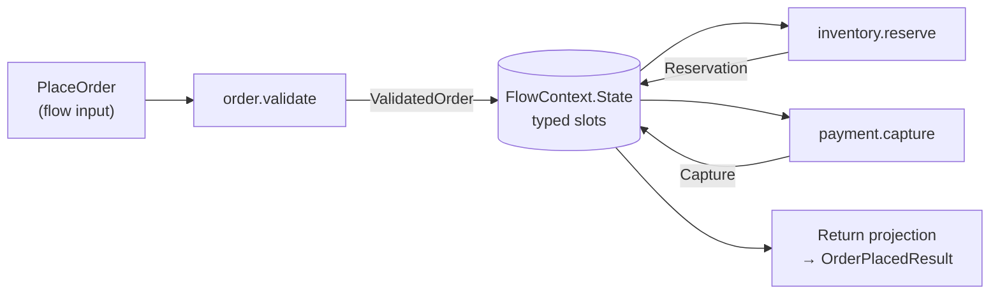
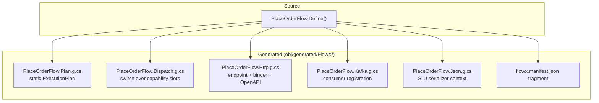

# 08 — Flow Definition

> **Status:** Accepted · **Audience:** application engineers
> **Answers:** what is the DSL, what control flow exists, and what does it compile into?

---

## 1. The shape of a flow

```csharp
[Flow("order.place", Version = "1.2.0", Profile = ExecutionProfile.Durable)]
[HttpTrigger("POST", "/api/v1/orders", Idempotent = true)]
[KafkaTrigger("orders.requested", Group = "order-placement")]
public sealed partial class PlaceOrderFlow : Flow<PlaceOrder, OrderPlacedResult>
{
    protected override void Define(IFlowBuilder<PlaceOrder, OrderPlacedResult> flow) => flow
        .Step<ValidateOrder>()
        .Step<ReserveInventory>().CompensateWith<ReleaseInventory>()
        .Step<CapturePayment>().WithPolicy(Policies.PaymentGateway)
        .Emit<OrderPlaced>()
        .Return(ctx => new OrderPlacedResult(ctx.Get<OrderId>(), ctx.Get<Capture>().Reference));
}
```

Three things are true of every flow:

1. **`Define` is a declaration, not a script.** It runs at most once (and often
   zero times — the compiler resolves it statically). It must be pure.
2. **The flow never names its transport.** `[HttpTrigger]` is metadata read by
   the compiler; the flow body cannot see it.
3. **The flow contains no business rules.** Rules live in capabilities.
   The flow expresses *order, condition, and recovery* — nothing else.

---

## 2. Data flow between steps

Steps do not pass values positionally. Each step's output is placed into the
typed context state bag, and the next step's input is bound from it.



Binding is resolved **at compile time**. If `CapturePayment` needs a
`CaptureRequest` and nothing in the context can produce one, the build fails
with a diagnostic that names the missing type and lists what *is* available:

```
error FLOWX1020: Step 3 'payment.capture' requires 'CaptureRequest' but the flow
                 context can only supply: PlaceOrder, ValidatedOrder, Reservation.
                 Add a mapping: .Step<CapturePayment, CaptureRequest>(ctx => ...)
                 See https://flowx.dev/diag/FLOWX1020
```

Explicit mapping when the shapes differ:

```csharp
.Step<CapturePayment, CaptureRequest>(ctx => new CaptureRequest(
    ctx.Get<ValidatedOrder>().Id,
    ctx.Get<ValidatedOrder>().Total,
    ctx.Input.PaymentMethod))
```

Both type arguments are written explicitly: C# cannot infer the mapping's result
type from a lambda body, and FlowX will not trade that away for a prettier call
site — an `object`-typed mapping would move a whole class of binding errors from
build time to run time, which is the opposite of what this platform is for.

---

## 3. Control flow

### 3.1 Conditional

```csharp
flow.Step<AssessRisk>()
    .When(ctx => ctx.Get<RiskScore>().Value > 80, high => high
        .Step<RequestManualReview>()
        .AwaitSignal<ReviewDecision>(timeout: TimeSpan.FromHours(24)))
    .Otherwise(low => low
        .Step<AutoApprove>())
    .Step<NotifyApplicant>();
```

Conditions may read **only** `ctx.State`, `ctx.Input` and prior step results
(`FLOWX1011`). A condition that reads a clock, a static, or an external service
is a determinism violation and fails the build in `Durable` flows.

### 3.2 Branch on a value

```csharp
flow.Switch(ctx => ctx.Get<ValidatedOrder>().Channel)
    .Case(Channel.Retail,    b => b.Step<ApplyRetailPricing>())
    .Case(Channel.Wholesale, b => b.Step<ApplyWholesalePricing>().Step<RequireCreditCheck>())
    .Default(b => b.Fail(OrderErrors.UnsupportedChannel));
```

The selector obeys the same determinism rule as a `When` predicate: context,
input and prior step results only. It is evaluated **exactly once**, and the
cases are then tested against the value it produced, in declaration order, with
`EqualityComparer<TValue>.Default` — so an `enum`, an `int` and a `string` all
mean what you expect and none of them is boxed. The first match wins; a second
case with the same value is unreachable rather than an error, exactly as a
duplicated `When` would be.

`TValue` is inferred from the selector, so a `.Case(...)` whose value is of the
wrong type is a C# compile error rather than an arm that silently never matches.

**A value that matches no case, in a switch with no `Default`, continues after
the switch.** It is not an error and there is no diagnostic. Requiring a
`Default` would force `.Default(b => { })` onto every switch that legitimately
special-cases two channels out of five, and it still would not make the switch
exhaustive — an `enum` can hold a value no member declares, so exhaustiveness is
not a property the compiler can check for the general case. The rule is therefore
the one `When` already uses: a branch nobody took does nothing. Where doing
nothing is wrong, say so:

```csharp
.Default(b => b.Fail(OrderErrors.UnsupportedChannel))
```

> **Not yet true of `.Fail(...)`.** The builder declares it and the table in §4
> lists it, but the compiler does not model it: a block whose only call is
> `.Fail(...)` compiles to an *empty* block, which for a `Default` means the
> fall-through above. Until `Fail` compiles to a step, spell an unsupported value
> out as a capability that returns `Result.Fail(...)`.

`Switch` compiles into the same flat step array as everything else — one `Switch`
node carrying a target per case plus a default target, and a `Jump` closing each
case block. See [06 §3](06-Execution-Engine.md#3-the-step-loop). The manifest
publishes the *shape* — that the flow branches, and what is in each arm — and
never the selector or the case values, because
[a manifest is structure, never values](adr/ADR-0005-manifest-as-build-artifact.md).

### 3.3 Parallel

```csharp
flow.Parallel(p => p
        .Branch<CheckCredit>()
        .Branch<CheckFraud>()
        .Branch<CheckSanctions>(),
     merge: MergeStrategy.AllMustSucceed)
    .Step<Decide>();
```

Branches write to disjoint context slots (`FLOWX1013`); they share the flow's
deadline; failure semantics per `MergeStrategy` — see
[06 §9](06-Execution-Engine.md#9-concurrency-and-parallel-steps).

### 3.4 Iteration

```csharp
flow.ForEach(ctx => ctx.Get<ValidatedOrder>().Lines,
        line => line.Step<ReserveLine>().CompensateWith<ReleaseLine>(),
        options: new ForEachOptions { MaxDegreeOfParallelism = 4, ContinueOnError = false })
    .Step<ConfirmReservation>();
```

Bounded by construction: `MaxDegreeOfParallelism` is required and capped by the
runtime. In `Durable` flows each iteration commits its own journal entry, so a
crash resumes mid-collection rather than restarting it.

### 3.5 Waiting

```csharp
flow.AwaitSignal<PaymentConfirmed>(timeout: TimeSpan.FromMinutes(30))
        .OnTimeout(f => f.Step<CancelPendingOrder>())
    .Delay(TimeSpan.FromHours(1))            // durable timer, holds no resources
    .Step<SendFollowUp>();
```

`AwaitSignal` and `Delay` are only available in `Durable` flows — using them in
an `Ephemeral` flow is `FLOWX1017` (error), because an in-memory wait cannot
survive a deployment.

### 3.6 Emitting events

```csharp
flow.Emit<OrderPlaced>(ctx => new OrderPlaced(
        ctx.Get<OrderId>(), ctx.Get<Capture>().Reference, ctx.Clock.UtcNow))
    .EmitOnFailure<OrderRejected>(ctx => new OrderRejected(ctx.Input.OrderId, ctx.Error!.Code));
```

Emission is transactional-outbox based in `Durable` flows: the event row is
written in the same transaction as the step commit, then published by the Event
Engine. At-least-once, never lost, never published before the step is durable.

### 3.7 Sub-flows

```csharp
flow.Step<ValidateOrder>()
    .SubFlow<FulfilOrderFlow>(ctx => new FulfilOrder(ctx.Get<OrderId>()))
    .Step<NotifyCustomer>();
```

| Mode | Semantics |
|---|---|
| `SubFlow<T>` | synchronous; child shares parent's deadline and correlation; child failure fails the parent |
| `SubFlow<T>(Detached)` | fire-and-forget; child gets its own deadline and lifecycle |
| `SubFlow<T>(AwaitCompletion)` | parent suspends until child completes (durable only) |

Sub-flow **cycles are a compile error** (`FLOWX1021`). The flow graph is a DAG,
always.

---

## 4. The full builder surface

| Method | Purpose | Profiles |
|---|---|---|
| `.Step<TCapability>()` | invoke a capability, binding its input from the context | all |
| `.Step<TCapability, TStepIn>(map)` | invoke with an explicit input mapping | all |
| `.CompensateWith<T>()` | register the inverse of the previous step | all (weak in Ephemeral) |
| `.WithPolicy(policy)` | attach a policy set to the previous step | all |
| `.When(pred, then).Otherwise(else)` | conditional | all |
| `.Switch(sel).Case(v, b).Default(b)` | value branch | all |
| `.Parallel(branches, merge)` | concurrent branches | all |
| `.ForEach(sel, body, options)` | bounded iteration | all |
| `.SubFlow<TFlow>(map, mode)` | compose flows | all |
| `.Emit<TEvent>(map)` | publish a domain event | all |
| `.EmitOnFailure<TEvent>(map)` | publish on failure path | all |
| `.AwaitSignal<T>(timeout).OnTimeout(b)` | external wait | Durable |
| `.Delay(duration)` | durable timer | Durable |
| `.Window(spec)` / `.Aggregate(...)` | stream windowing | Streaming |
| `.Fail(error)` | terminate with a business error | all |
| `.Return(projection)` | produce the flow output | all |

Deliberately **absent**: `.Do(lambda)`. Arbitrary inline code inside a flow would
be invisible to the manifest, untestable in isolation and undetectable by
determinism analysis. If it is worth executing, it is worth naming — make it a
capability.

---

## 5. What the flow compiles into



Generated code is written to disk in readable form (`EmitCompilerGeneratedFiles`
is on by default in FlowX projects). Debugging a FlowX application means reading
ordinary C#, not guessing at a black box — a direct mitigation for risk R1 in
[05 §11](05-Architecture.md#11-risks-and-technical-debt).

---

## 6. Visualising a flow

```bash
flowx graph --flow order.place --format mermaid
```


This diagram is **generated from the manifest**, so it cannot be out of date.
Every diagram in every FlowX application's documentation is produced this way.

---

## 7. Why C#, not YAML

The natural instinct for a flow engine is a YAML or JSON DSL. FlowX rejects it
as the *source of truth* — see [ADR-0010](adr/ADR-0010-csharp-dsl-over-yaml.md).

| Concern | C# DSL | YAML DSL |
|---|---|---|
| Type safety between steps | compile error | runtime error, in production |
| Refactoring (rename a contract) | IDE-wide, safe | find-and-replace and hope |
| Go-to-definition, find-references | native | none |
| Debugging | breakpoints in generated code | engine internals |
| Determinism analysis | Roslyn analyzers | none |
| Diffing in code review | ordinary diff | ordinary diff (tie) |
| Editable by non-developers | no | yes |
| Hot-reload without deploy | no | yes |

The last two rows are real advantages, and FlowX serves them differently:
`flowx graph --format yaml` exports the graph, and FlowX Studio renders and
scaffolds from it. But the compiled C# remains authoritative. **Configuration
selects adapters; it never redefines business meaning.**

---

## 8. Flow anti-patterns

| Anti-pattern | Why it is wrong | Do instead |
|---|---|---|
| Business rules inside `.When(...)` predicates | invisible to the manifest, untestable | a capability returning a decision type |
| A flow with 20 steps | unreadable, one failure domain | sub-flows by bounded context |
| Inheriting from another flow | hidden control flow (`FLOWX1005`) | extract shared steps into a sub-flow |
| A flow that only calls one capability | ceremony with no benefit | expose the capability directly with a trigger |
| Using `ctx.Trigger` to branch | breaks P3 transport agnosticism (`FLOWX1003`) | put the difference in the input contract |
| `Durable` for a read query | 1000× the cost for zero benefit | `Ephemeral` |
| `Ephemeral` for a payment saga | data loss on deploy | `Durable` |

---

**Next:** [09 — Trigger Model](09-Trigger-Model.md)
