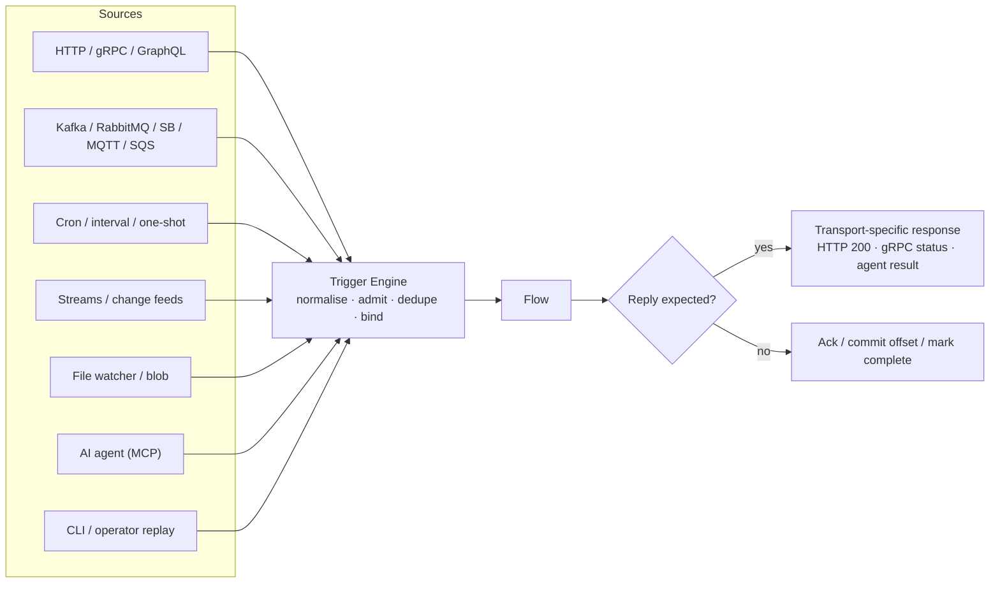
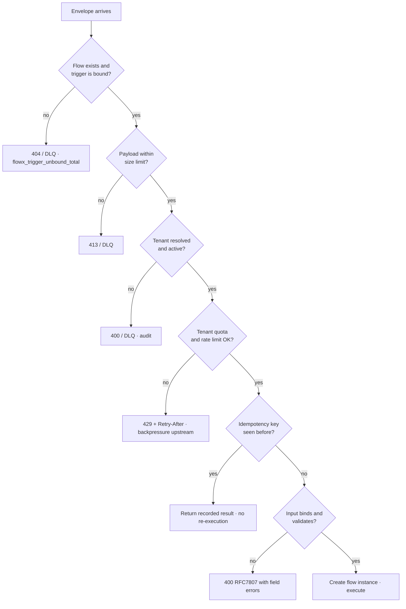
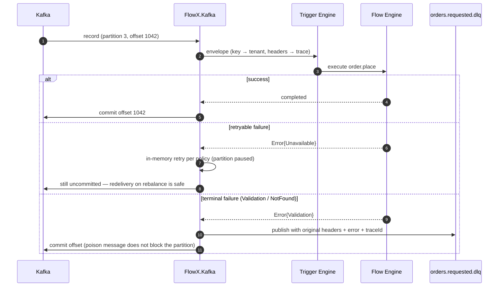
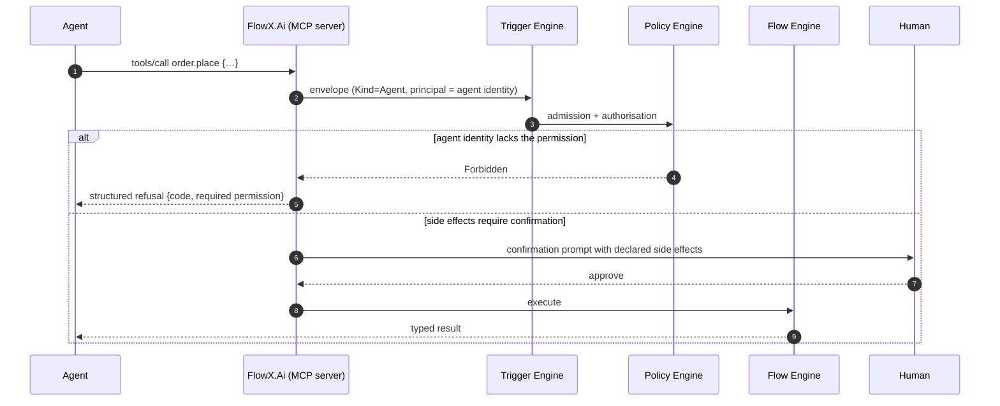

# 09 — Trigger Model

> **Status:** Accepted · **two transports are served; the rest are an attribute or nothing** ·
> **Audience:** application engineers, plugin authors
> **Answers:** how does one abstraction serve HTTP, brokers, cron, streams and agents?

> [!WARNING]
> **[ADR-0004](adr/ADR-0004-universal-trigger-model.md)'s "one trigger abstraction for
> every transport" is true of the *declaration* and, so far, of two transports.** Seven
> trigger attributes ship in `FlowX.Abstractions`, the compiler reads all seven into
> `flowx.manifest.json`, and **every one but `[StreamTrigger]` reaches a running transport.**
> *This box said "one of them" until 2026-08-01, when `[CronTrigger]` was bound, "two of them"
> for the few hours between that and `[BusTrigger]`, and "three of them" until
> `[ChangeTrigger]` shipped on 2026-08-02.* There is no
> Trigger Engine: no type under `src/` or `plugins/` normalises, admits, dedupes or binds,
> and §11's `ITriggerSource` / `ITriggerSink` are declared nowhere.
>
> | Transport | What exists |
> |---|---|
> | **HTTP** ([§6](#6-http-trigger)) | **served, and generated.** `[HttpTrigger]` → `TriggerReader` → `EndpointEmitter` → `FlowXEndpoints.g.cs` → `plugins/FlowX.Http`. Route, body binding, `Idempotency-Key` enforcement when `Idempotent = true`, and RFC 7807 with `[Sensitive]` redaction are all real; `samples/ecommerce` and `samples/workflow` call the generated `app.MapFlowX()`. **A flow that suspends is served too, since WP-64** — `202` with where to continue it, and one generated delivery route per signal it waits for ([ADR-0022](adr/ADR-0022-http-shape-of-a-suspending-flow.md)); *this row used to say the signal endpoint was a design, and §6's own box has the correction*. **The OpenAPI operation is still not generated** — nothing in this repository writes an OpenAPI document, and `Version` is dropped by the reader rather than published, despite §6's *"Generated: … the OpenAPI operation"* and the same claim on `HttpTriggerAttribute` itself |
> | **Bus** ([§7](#7-bus-trigger)) | **served, and generated.** `[BusTrigger]` and `[KafkaTrigger]` → `TriggerReader` → `BusEmitter` → `FlowXSubscriptions.g.cs` → `FlowBusScan` → an `IBusConsumer`, and `samples/ecommerce` calls the generated `services.AddFlowXSubscriptions()`. *This row said "attribute only" and that "nothing consumes a topic, commits an offset or dead-letters"; all of it expired on 2026-08-01 except the offset, which is Kafka's word for something Redis Streams does with `XACK`.* `plugins/FlowX.Redis` consumes, acknowledges and dead-letters; there is still no `FlowX.Kafka`, and a `[KafkaTrigger]` on a host wired for another broker is refused at startup rather than served by it. **`MaxInFlight` and `DeadLetter` still reach no artifact** — both are tuning `FlowXOptions` now owns ([ADR-0039](adr/ADR-0039-a-bus-subscription-publishes-no-new-manifest-field.md)), and the dead-letter destination is derived from the source stream rather than read. §7's sequence diagram remains specification in its details: there is no in-memory retry per policy and no partition pause, only a delivery limit |
> | **Schedule** ([§8](#8-schedule-trigger)) | **served, and generated.** `[CronTrigger]` → `TriggerReader` → `ScheduleEmitter` → `FlowXSchedules.g.cs` → `FlowScheduleScan`, and `samples/workflow` calls the generated `services.AddFlowXSchedules()`. `cron`, `timeZone` and `MissedFire` are all read; the first two publish, the third executes. **There is no leader and no election** — *this row said "leader-elected, never double-fires" was a design, and what replaced it is not an election*: every node computes the same occurrence, derives the same instance id from it, and the lease store and the journal's primary key refuse all but one ([ADR-0031](adr/ADR-0031-an-occurrence-names-the-instance-it-starts.md)). `PerTenant` fans one occurrence out over the tenant directory; `Overlap` and `Jitter` still reach nothing at all |
> | **Stream** ([§9](#9-stream-trigger)) | **attribute only, over an unbuilt profile.** `[StreamTrigger]` publishes its source; `Window`, `Lateness`, `Checkpoint` and `Parallelism` are dropped. `ExecutionProfile.Streaming` is an enum member no code branches on, and `.Window(…)` / `.Aggregate(…)` are not members of `IFlowBuilder<TIn, TOut>` — **§9's example does not compile.** Streaming is **P7** |
> | **Agent** ([§10](#10-agent-trigger)) | **attribute only.** `[AgentTrigger]` publishes `description` and `confirmation`. There is no MCP server, no tool descriptor and no JSON Schema generation; `MCP` occurs under `src/` only inside doc comments. §10's two properties are consequences of a surface nothing serves. **P8** — see [13-AI-Native](13-AI-Native.md), which states the same thing about `AgentTriggerAttribute` |
> | **Change** ([§4](#4-trigger-kinds-and-their-semantics)) | **served, and generated.** *This row said "a kind with no attribute" until 2026-08-02.* `[ChangeTrigger]` → `TriggerReader` → `ChangeEmitter` → `FlowXChangeSubscriptions.g.cs` → `FlowChangeScan` → an `IChangeFeed`, and `samples/ecommerce` calls the generated `services.AddFlowXChangeSubscriptions()`. What it observes is the **outbox** — the change feed this platform already produces — read forward from a durable cursor without writing `published_at`, so a change subscription and `PostgresOutboxPublisher` coexist over one table ([ADR-0047](adr/ADR-0050-a-change-trigger-observes-the-outbox.md)). **Nothing is acknowledged and there is no dead-letter path:** a feed is a log with a cursor, the cursor advances past the longest prefix that reached a recorded outcome, and a change whose flow failed *as a value* is progress ([ADR-0048](adr/ADR-0048-a-change-feed-advances-a-cursor.md)). One subscription is read by one node at a time, so it scales by adding subscriptions rather than nodes — weaker than [ADR-0037](adr/ADR-0037-the-consumer-offers-per-key-order.md)'s per-partition concurrency and the honest cost of a cursor. The one `IChangeFeed` that ships is PostgreSQL's; a file watcher and CDC remain the summary's words rather than code |
> | **Cli**, **Manual** | **kinds with no attribute.** Both are `TriggerKind` members and values of the manifest schema's closed `kind` enum, so a third-party `TriggerAttribute` carrying `[TriggerKind]` can declare one and reach the manifest with it. `FlowX.Abstractions` ships nothing that does, and `TriggerKind.Cli`'s summary names `flowx run`, which is not one of the CLI's five verbs ([22-CLI](22-CLI.md)) |
> | **gRPC** | **does not exist, at any level.** [§4](#4-trigger-kinds-and-their-semantics) gives `Grpc` its own row with its own delivery, reply and ordering semantics. There is no `Grpc` member of `TriggerKind`, no such value in the schema's `kind` enum and no attribute; `TriggerKind.Http` folds *"REST, gRPC, GraphQL, webhook"* into one kind. Read that row as a ninth kind that was never declared rather than a declared one that is unimplemented — it is the reason this box is here |
>
> **§2's envelope is a type, not a value.** `TriggerEnvelope` and `TriggerHeaders` are
> declared exactly as printed and `FlowContext.Trigger` exposes one, but nothing outside
> `FlowX.Testing` and the test projects ever constructs one.
> `FlowExecutionContext.Trigger` is never assigned, so every running flow reads `default`
> — `Kind = Manual`, no source, no body, no headers. What the HTTP plugin actually
> produces is a `FlowInvocation` (correlation id, idempotency key, tenant, deadline), and
> that is what the engine reads. So the uniform-header claim holds for those four fields
> and for nothing else; `TraceParent` is neither populated nor read, which §2's own note
> already says.
>
> **§5's admission sequence is a diagram and four of its nine decisions.** Enforced today,
> on HTTP only: a missing `Idempotency-Key` is rejected when the trigger declares
> `Idempotent = true`; the tenant is resolved from validated claims and never from a
> header or body; the body binds and validates to a 400 RFC 7807. Enforced by nothing:
> payload size limits, tenant quota and rate limit — `RateLimit` is a `PolicySet` entry at
> stage `Admission` and [10-Policy-Framework](10-Policy-Framework.md) records that no
> policy runs on the forward path — idempotency *replay* (the key is required and
> propagated; no store holds a recorded result to return), and the
> `flowx_trigger_unbound_total` counter, which is one of the metrics
> [12-Observability](12-Observability.md) does not emit.
>
> **§3's "four transports, zero changes to the flow body" holds for three of the four, and the
> fourth is the one below.** A schedule's flow must declare `Flow<ScheduledFire, TOut>`, because
> a firing has no body and `FLOWX1007` forbids the flow reading a clock to work out which
> occurrence it is ([ADR-0033](adr/ADR-0033-a-scheduled-flows-input-is-its-occurrence.md)) — while
> an HTTP endpoint binds a request body into whatever the flow declares. So **one flow cannot
> serve both an HTTP route and a cron expression**, and `FLOWX1038` says so. The business
> operation is still transport-free; what does not compose is two inbound *contracts* on one
> flow. §3's example, and ADR-0004's own first Positive, both print the arrangement that does not
> compile.
>
> **What is genuinely load-bearing** is the declaration path, and it is checked: `[TriggerKind]`
> is what the compiler can read out of a referenced assembly, `FLOWX1025` reports a trigger
> attribute that omits it, and `EveryTriggerKindHasAManifestNameTheSchemaAccepts` and
> `EveryTriggerAttributeTheAbstractionShipsHasAKnownShape` keep the enum, the reader and the
> schema from drifting apart. A third-party transport can therefore publish itself into the
> manifest today. It just has nothing to derive from at run time — see [§11](#11-writing-a-trigger-plugin).

---

## 1. The premise

Every activation mechanism reduces to the same three facts:

1. Something happened, at a point in time.
2. It carries a payload and some headers.
3. It expects a flow to run — with a delivery guarantee and possibly a reply.

FlowX normalises all of it into one envelope, then never lets the flow see it.



---

## 2. The envelope

```csharp
public readonly record struct TriggerEnvelope(
    TriggerKind Kind,
    string Source,                     // "POST /api/v1/orders" | "kafka:orders.requested[3]"
    ReadOnlyMemory<byte> Body,
    TriggerHeaders Headers,
    DateTimeOffset OccurredAt);

public readonly record struct TriggerHeaders(
    string CorrelationId,              // created if absent; always propagated
    string? TenantId = null,
    ClaimsPrincipal? Principal = null,
    string? IdempotencyKey = null,
    DateTimeOffset? Deadline = null,
    string? TraceParent = null);       // W3C traceparent, carried verbatim
```

Header propagation is uniform: an HTTP `traceparent`, a Kafka header, and an MQTT
user property all land in the same field, so a trace spans transports without
any user code.

*The block above previously printed a shape that never shipped:
`CorrelationId`/`TenantId` as wrapper types, an `ActivityContext TraceContext`,
and an `Extensions` dictionary. The real record takes strings, carries the
traceparent as an unparsed string, and has no extensions bag — a design choice
that keeps `FlowX.Abstractions` dependency-free, which
`AbstractionsHasNoDependencies` enforces. `TraceParent` is **carried, not
continued**: nothing reads it, because nothing starts an `Activity` (see
[12-Observability](12-Observability.md)).*

---

## 3. Declaring triggers

```csharp
[Flow("order.place", Profile = ExecutionProfile.Durable)]
[HttpTrigger("POST", "/api/v1/orders", Idempotent = true, Version = "v1")]
[KafkaTrigger("orders.requested", Group = "order-placement", StartFrom = Offset.Committed)]
[CronTrigger("0 2 * * *", TimeZone = "Europe/Berlin", Overlap = OverlapPolicy.Skip)]
[AgentTrigger(Description = "Place a customer order with payment and inventory reservation")]
public sealed partial class PlaceOrderFlow : Flow<PlaceOrder, OrderPlacedResult> { … }
```

Four transports, zero changes to the flow body. **This is quality goal Q4, and it
is the single most visible benefit of the model.**

> [!WARNING]
> **The block above does not compile, and the reason is a real limit rather than a typo.** A flow
> carrying `[CronTrigger]` must declare `Flow<ScheduledFire, TOut>` — a firing has no body, and
> `FLOWX1007` and `FLOWX1011` forbid the flow reading a clock to discover which occurrence it is,
> so the occurrence has to arrive as input
> ([ADR-0033](adr/ADR-0033-a-scheduled-flows-input-is-its-occurrence.md)). `PlaceOrderFlow` takes
> a `PlaceOrder`, which is what its `[HttpTrigger]` binds a request body into. **A flow cannot
> declare both**, and [FLOWX1038](diagnostics/FLOWX1038.md) reports the attempt.
>
> Q4 survives, narrowed to the claim it can actually make: **zero changes to the flow body**
> across every transport whose payload the *caller* supplies — HTTP, bus, stream, agent. The one
> whose payload the *platform* supplies fixes the contract, and the ordinary shape for "this
> operation runs on a request and on a schedule" has always been two flows over one capability.
>
> This was found by a test rather than by reading it:
> `TriggerDeclarationAnalyzerTests.AllFiveTogetherAreSilent` asserted an empty diagnostic list
> against exactly this declaration, and began reporting `FLOWX1038` the day the schedule trigger
> was bound.

---

## 4. Trigger kinds and their semantics

| Kind | Delivery | Reply | Ordering | Failure handling |
|---|---|---|---|---|
| `Http` | at-most-once | yes, synchronous | none | RFC 7807 + `Retry-After`; caller retries |
| `Grpc` | at-most-once | yes, sync or stream | per-stream | status code mapping |
| `Bus` | at-least-once | optional (reply-to) | per partition/key | retry → DLQ after N |
| `Stream` | at-least-once + checkpoint | no | per partition | pause → retry → poison topic |
| `Schedule` | at-least-once | no | none | missed-fire policy |
| `Change` | at-least-once | no | per key | cursor holds; no DLQ |
| `Agent` | at-most-once | yes | none | structured refusal or error |
| `Cli` / `Manual` | at-most-once | yes | none | surfaced to the operator |

---

## 5. Admission control

Before a flow is created, the Trigger Engine runs a fixed admission sequence.
This is the platform's outer defence, and it is the same for every transport.



Admission happens **before** the flow instance exists, so a rejected request
costs no journal write, no context allocation and no capability resolution.

---

## 6. HTTP trigger

```csharp
[HttpTrigger("POST", "/api/v1/orders", Idempotent = true)]
```

Generated: the endpoint, the model binder, the OpenAPI operation, the RFC 7807
error mapping and the idempotency filter.

### API contract (generated, shown for review)

| Method & Path | Purpose | Auth | Idempotency | Success | Errors |
|---|---|---|---|---|---|
| `POST /api/v1/orders` | run `order.place` | Bearer (from capability stance) | `Idempotency-Key` **required** | 200 + result | 400 validation, 401, 403, 409 conflict, 429 quota, 503 unavailable |
| `GET /api/v1/orders/{id}` | run `order.get` | Bearer | n/a (safe) | 200 | 404 |
| `GET /api/v1/flows/{instanceId}` | instance status | operator scope | n/a | 200 | 404 |
| `POST {flow route}/{instanceId}/signals/{identity}` | deliver a signal to a waiting instance | Bearer | natural (the frontier) | 202 | 400 malformed body, 404 unknown instance or identity |

> [!IMPORTANT]
> **This row was a design and is now generated. Two things it said were wrong, and the
> route it printed was one of them.** *This box read "the signal row is a design, and
> nothing generates that endpoint" until WP-64 (2026-08-01).*
> There is no signal table and there never will be: a delivered signal is journaled as
> the suspension point's own `flow_step` row, which is why a redelivery is inert without
> a check written for it.
>
> **It is not `/api/v1/flows/{instanceId}/…`.** There is no flow-instance resource
> namespace — `GET /api/v1/flows/{instanceId}` above is still built by nothing — so the
> delivery route hangs off **the flow's own route**:
> `POST /api/v1/offers/{instanceId:guid}/signals/offer.countersigned` for
> `samples/workflow`'s `offer.accept`. One route is generated per signal the flow waits
> for, with the identity as a **literal segment**, which is what makes an identity nothing
> waits for a `404` from the router before any code runs
> ([ADR-0022](adr/ADR-0022-http-shape-of-a-suspending-flow.md)).
>
> **`409 not suspended` never existed and will not.** `FlowHost.SignalAsync` treats a
> delivery to an instance that is not waiting for that signal as **inert, not an error** —
> refusing would mean the host deciding what a flow is waiting for, and the journal already
> answers that. So a redelivery is `202` and changes nothing, which is what makes
> at-least-once transports safe. There is no `Idempotency-Key` rule on this route for the
> same reason.
>
> The run route gains a third answer with it: a flow that suspends is `202` with the
> instance and where to continue it, not `200` with an output it does not have.

```jsonc
// POST /api/v1/orders  → 200
{ "orderId": "01HV8…", "paymentReference": "pay_9f2…" }

// Any error — RFC 7807, always, on every transport that has a body
{ "type":  "https://errors.acme.com/inventory.out_of_stock",
  "title": "Out of stock",
  "status": 409,
  "detail": "SKU-1 has 0 available, 2 requested",
  "instance": "/api/v1/orders",
  "traceId": "00-4bf92f…-01",
  "flowInstanceId": "fi_01HV8…" }
```

Long-running durable flows return `202 Accepted` rather than holding the connection open.

```jsonc
// POST /api/v1/offers  → 202, when the flow stops at a wait
{ "instanceId": "019fbd86-b1be-7398-a9bb-b90a96c6774c",
  "status": "suspended",
  "awaiting": [
    { "signal": "offer.countersigned",
      "deliverTo": "/api/v1/offers/019fbd86-b1be-7398-a9bb-b90a96c6774c/signals/offer.countersigned" }
  ] }

// POST /api/v1/offers/{instanceId}/signals/offer.countersigned  → 202
{ "instanceId": "019fbd86-b1be-7398-a9bb-b90a96c6774c", "status": "completed" }
```

*This sentence used to end "with a `Location` header pointing at the **instance resource**".
There is no instance resource — `GET /api/v1/flows/{instanceId}` is in the table above and is
built by nothing — so `Location` points at the signal endpoint, which exists, and only when
the flow declares exactly one wait. A header that can name one of three addresses misleads two
callers out of three; `awaiting` in the body carries the whole set.*

`awaiting` is read off the compiled plan, so it is the same set of identities
`flowx.manifest.json` publishes as each `AwaitSignal` step's `signal`
([ADR-0021](adr/ADR-0021-manifest-publishes-the-wait.md)) and the same set the endpoint
generator emitted routes for: one declaration, three consumers.

---

## 7. Bus trigger

```csharp
[KafkaTrigger("orders.requested",
    Group = "order-placement",
    StartFrom = Offset.Committed,
    MaxInFlight = 32,
    DeadLetter = "orders.requested.dlq")]
```



Offsets are committed **after** flow completion. Combined with capability
idempotency this yields effectively-once processing. A terminal error is
dead-lettered rather than retried forever — head-of-line blocking is a bug, not
a durability strategy.

> [!NOTE]
> **What was built, and where the diagram above is still specification.** `Bus` was bound on
> 2026-08-01 over Redis Streams rather than Kafka, and the four questions the diagram gestures at
> each have a record.
>
> - **Redelivery** ([ADR-0035](adr/ADR-0035-a-delivery-names-the-instance-it-starts.md)) — the
>   diagram says "redelivery on rebalance is safe" and leaves *why* to capability idempotency.
>   What was built is stronger: the delivery derives the instance id it starts, so a redelivered
>   message is refused by the journal's primary key and the flow does not run twice at all.
>   `FLOWX1039` refuses a subscriber that is not `Durable`, because that id is inert without a
>   journal.
> - **Acknowledgement** ([ADR-0036](adr/ADR-0036-a-message-is-acknowledged-when-its-flow-is-journalled.md))
>   — "after flow completion" is not quite the rule. A delivery is acknowledged once it reached a
>   *recorded outcome*, which includes a flow that **failed as a value**: ADR-0007 makes a
>   business failure a `Result`, and the diagram's "terminal failure → DLQ" branch is wrong for
>   it. A declined order is acknowledged and never dead-lettered.
> - **Ordering** ([ADR-0037](adr/ADR-0037-the-consumer-offers-per-key-order.md)) — per
>   `partition_key` and nothing across keys, the same pair of statements
>   [ADR-0018](adr/ADR-0018-outbox-publication-and-ordering.md) makes about publication. It holds
>   across a fleet because a partition is read under a lease, not because a deployment runs one
>   consumer.
> - **Poison** ([ADR-0038](adr/ADR-0038-a-poison-message-is-dead-lettered.md)) — an entry that is
>   not a message goes on its first delivery; one whose flow never reaches an outcome goes past
>   `FlowXOptions.BusMaxDeliveries`. There is no in-memory retry per policy and no partition
>   pause; the partition simply stops until the entry at its head reaches a disposition.
>
> **The declaration to reach for is `[BusTrigger]`**, which names a topic and a group and no
> broker. `[KafkaTrigger]` binds through the same path — the kind and the address, not the
> attribute's name — and additionally publishes `transport: "kafka"`, which the host checks
> against the consumer it wired. `StartFrom` in the example above **is not a property of
> `KafkaTriggerAttribute`** and never has been; the example does not compile.

---

## 8. Schedule trigger

```csharp
[Flow("offer.window.close", Profile = ExecutionProfile.Durable)]
[CronTrigger("0 2 * * *", TimeZone = "Europe/Berlin", MissedFire = MissedFirePolicy.RunOnce)]
public sealed partial class CloseOfferWindowFlow : Flow<ScheduledFire, OfferWindowClosed>
```

`services.AddFlowXSchedules()` — generated from that attribute, in the application's own
assembly, the way `app.MapFlowX()` is generated from `[HttpTrigger]`. There is no hosted service
to write, no timer to arm, and no line in `Program.cs` that mentions 02:00.

**Two things about the declaration are enforced**, both by
[FLOWX1038](diagnostics/FLOWX1038.md):

- **The input contract is `ScheduledFire`** — the occurrence, the expression and the zone. A
  firing carries no body, and `FLOWX1007` / `FLOWX1011` forbid the flow reading a clock to work
  out which occurrence it is, so the instant has to arrive as data and be journalled on
  `flow_instance.input` like any other trigger's payload
  ([ADR-0033](adr/ADR-0033-a-scheduled-flows-input-is-its-occurrence.md)). `OccurrenceAt` is the
  instant that was **due**, never the instant the sweep noticed it.
- **The profile is `Durable`.** Not because a schedule suspends, but because the thing that stops
  a fleet firing the same occurrence *n* times is `flow_instance`'s primary key. An ephemeral
  flow journals nothing, so the id is inert and every replica runs every occurrence, silently.

| Option | Values | Status |
|---|---|---|
| `Cron` | five fields | **read.** Published as `trigger.cron`, and one of the five values the instance id is derived from |
| `TimeZone` | IANA id | **read.** Published as `trigger.timeZone`. Wall clock, so DST-correct — see below |
| `MissedFire` | `Skip` \| `RunOnce` \| `RunAll` | **executes.** Not published, because it is this deployment's tolerance for late work rather than a promise to anyone outside ([ADR-0034](adr/ADR-0034-the-manifest-publishes-a-schedules-address.md)) |
| `Overlap` | `Skip` \| `Queue` \| `Concurrent` | **reaches nothing.** Its default reads as though it stopped a `RunAll` catch-up running its firings concurrently; it does not |
| `Jitter` | duration | **reaches nothing.** The sweep itself is jittered ±25 %, which is a different thing — it spreads the *sweeps*, not the firings |
| `PerTenant` | bool | **executes.** One occurrence becomes one firing per tenant, over the host's `ITenantDirectory`, each under an instance id carrying its tenant ([ADR-0054](adr/ADR-0054-a-platform-trigger-attests-its-tenant.md)) |

### 8.1 One occurrence, one instance, and no leader

> [!IMPORTANT]
> **This section said the Scheduler Engine is *leader-elected*, and what replaced it is not an
> election.** *"Two replicas never fire the same schedule; a dead leader is replaced within the
> lease TTL"* — the second clause describes how fast a successor appears, not what happens to the
> firing the dead leader was holding, and a leader that has lost its lease without noticing fires
> anyway.

A schedule is the one transport where nothing is delivered, so **every node computes the same
occurrence without talking to any other node.** The instance id is then derived from it:

```text
InstanceId = uuidv8( SHA-256( flowId ␀ flowVersion ␀ cron ␀ timeZone ␀ occurrence ) )
```

Ten nodes therefore race to start *one* instance, and the two stores the runtime already had
settle it: `ILeaseStore.AcquireAsync` refuses the losers while the winner runs, and
`IFlowJournal.StartAsync` refuses them with `journal.instance_exists` afterwards. The lease is
the fast answer and the primary key is the permanent one
([ADR-0031](adr/ADR-0031-an-occurrence-names-the-instance-it-starts.md)).

`FlowScheduleScan` is `FlowTimerScan`'s shape with the store query removed — a durable timer
reads an instant off a row, a schedule computes one — and it fires through the same
`FlowHost.RunAsync` an HTTP request reaches, with the minted instance id replaced by the derived
one. There is no schedule-shaped entry into a flow.

### 8.2 What happens to a firing nobody was there to take

**It happens late, inside `FlowXOptions.ScheduleCatchUp` — one day by default**
([ADR-0032](adr/ADR-0032-a-missed-schedule-fires-late.md)). That is what ADR-0004 §4's
*at-least-once* row commits a schedule to, and it is bounded rather than absolute: a fleet down
for longer than the horizon loses the firings outside it, with nothing to report them.

A node with no memory of a schedule walks backwards from the newest occurrence, asking the
journal for each derived id, and stops at the first one that exists — everything after it is
missed. A schedule the journal has **never** held is new rather than neglected, so its floor is
when that node started: a first deployment fires from its next occurrence rather than replaying a
day of work nobody missed.

`MissedFire` then narrows what is fired: `Skip` takes only an occurrence within two sweep
intervals of now, `RunOnce` takes the most recent, `RunAll` takes every one up to
`ScheduleFireBatchSize` per sweep.

### 8.3 The two days a year a wall-clock time is not an instant

`0 2 * * *` in `Europe/Berlin` names a *local* time, so on the last Sunday in March 02:30 does
not exist and on the last Sunday in October it happens twice. Both are answered rather than left
to chance, because a nightly job that silently does not run once a year is what a time-zone field
exists to prevent:

- **The spring gap:** the occurrence lands on the first local time that does exist — the
  transition instant. Late by up to the size of the gap, never skipped.
- **The autumn fold:** the occurrence fires **once, on the first pass**. Firing twice would run a
  nightly job twice a year with no declaration anywhere saying so.

### 8.4 What the parser does not read

Three-letter month and day names (`JAN`, `MON`), the `@daily` macros, a seconds field, and
Quartz's `L`, `W` and `#`. Each is refused rather than approximated: `CronSchedule.Parse` answers
`schedule.cron_unreadable`, `FlowSchedule.Create` throws, and the deployment finds out from a pod
that never becomes ready rather than from a job that never runs.

---

## 9. Stream trigger

```csharp
[Flow("telemetry.aggregate", Profile = ExecutionProfile.Streaming)]
[StreamTrigger("device.telemetry", Window = "tumbling:1m", Lateness = "10s",
    Checkpoint = "PT5S", Parallelism = 8)]
public sealed partial class AggregateTelemetryFlow : Flow<TelemetryBatch, Aggregate>
{
    protected override void Define(IFlowBuilder<TelemetryBatch, Aggregate> flow) => flow
        .Window(w => w.Tumbling(TimeSpan.FromMinutes(1)).AllowLateness(TimeSpan.FromSeconds(10)))
        .Aggregate<DeviceStats>((acc, r) => acc.Add(r))
        .Step<PersistAggregate>()
        .Emit<AggregateComputed>();
}
```

| Window | Semantics |
|---|---|
| `Tumbling(d)` | fixed, non-overlapping |
| `Sliding(size, advance)` | overlapping |
| `Session(gap)` | activity-bounded |
| `Global` | unbounded with explicit triggers |

Watermarks drive window closure; records later than `Lateness` are routed to a
side output rather than dropped silently. Backpressure per
[06 §10](06-Execution-Engine.md#10-backpressure-streaming-profile).

---

## 10. Agent trigger

```csharp
[AgentTrigger(Description = "Place a customer order with payment and inventory reservation",
              Confirmation = ConfirmationMode.RequiredForSideEffects)]
```

The compiler emits an MCP tool descriptor from the flow's input contract — the
same JSON Schema that drives OpenAPI. The agent surface is therefore **exactly**
the flow surface, with the same authorisation.



Two properties matter here and both fall out of the model for free:

- **An agent cannot reach anything a human could not reach.** Authorisation is on
  the capability, not the transport (P11).
- **The agent sees declared side effects** (`SideEffects` in the capability
  attribute), so confirmation prompts are accurate rather than blanket. See
  [13-AI-Native](13-AI-Native.md) and [15-Security §7](15-Security.md).

---

## 11. Writing a trigger plugin

```csharp
public interface ITriggerSource
{
    TriggerKind Kind { get; }
    ValueTask StartAsync(ITriggerSink sink, CancellationToken ct);
    ValueTask StopAsync(CancellationToken ct);          // must drain, not drop
}

public interface ITriggerSink
{
    ValueTask<FlowResult> DispatchAsync(in TriggerEnvelope envelope, CancellationToken ct);
}
```

Every trigger plugin must pass `FlowX.Conformance.Tests`:

| Conformance test | Asserts |
|---|---|
| `PropagatesTraceContext` | W3C trace continues across the transport |
| `PropagatesTenantAndPrincipal` | identity survives normalisation |
| `HonoursBackpressure` | a slow sink slows the source, memory stays bounded |
| `DrainsOnShutdown` | no message lost or double-processed on SIGTERM |
| `DeadLettersTerminalErrors` | `Validation`/`NotFound` are not retried forever |
| `RespectsDeadline` | envelope deadline is enforced |
| `IsIdempotencyAware` | duplicate keys return the recorded result |

> [!IMPORTANT]
> **This box said `FlowX.Conformance.Tests` does not exist. That is now wrong,
> and what replaces it is narrower than it sounds.** `tests/FlowX.Conformance.Tests`
> exists (WP-51) and holds three suites — `JournalConformance`,
> `LeaseStoreConformance` and `RecoveryIndexConformance` — **none** of which is a
> trigger suite. **None of the
> seven tests above has been written**, `TriggerSourceConformance` does not
> exist, and the interfaces they would test against — `ITriggerSource`,
> `ITriggerSink` — are still not declared anywhere in `src/`. The two signatures
> printed above remain a design sketch, not a contract a plugin can compile
> against.
>
> What is true is that the *shape* now exists: a suite is an abstract class with
> a factory, a store author derives from it and inherits every assertion, and
> that mechanism is proved to reject a wrong implementation by name
> (`TheSuiteRejectsAStoreThatIsWrongTests`). Nothing real has met it — the only
> implementation held to it is an in-memory reference in the same project, the
> project is **not packable**, and no suite has ever run against a real store.
> A trigger plugin has nothing to derive from at all.
>
> Publishing a *trigger* suite is named as the mitigation for **both** risk R3
> and risk R8 in [05 §11](05-Architecture.md#11-risks-and-technical-debt), and
> that has not happened. It is a **P3** deliverable. `PluginsPassConformance`
> remains blocked, with what it is waiting for, in
> [21 §2.4](21-Quality-Gates.md#24-gates-named-here-but-not-yet-enforced).
>
> There is also nothing yet to compare: `plugins/FlowX.Http` is the only plugin,
> so "every plugin agrees on the minimum semantics" has one data point. What
> `FlowX.Http.Tests` does assert today is narrower and real — that HTTP
> normalises into a `TriggerEnvelope` (`HttpTriggerReaderTests`) and that every
> `ErrorCategory` maps to its documented status (`ProblemDetailsMapperTests`).
> Four of the seven rows above are additionally blocked on subsystems that do
> not exist at all: trace context (**P5**), backpressure (**P7**), deadline
> enforcement and idempotency (**P4**).
>
> Treat this table as the specification a P3 plugin author will be held to. Do
> not treat a plugin as conformant because nothing failed.

---

## 12. Known limits of the abstraction

Honest non-goals — see risk R3 in [05 §11](05-Architecture.md#11-risks-and-technical-debt):

| Transport feature | Status | Escape hatch |
|---|---|---|
| Kafka rebalance callbacks | not in the universal model | plugin options, outside the flow |
| HTTP response streaming (SSE, chunked) | v1.1 via `Flow<TIn, IAsyncEnumerable<T>>` | raw ASP.NET Core endpoint alongside |
| MQTT QoS 2 exactly-once | mapped to at-least-once + idempotency | plugin option |
| gRPC bidirectional streaming | v1.2 | raw gRPC service alongside |
| Broker-native transactions | not modelled | outbox pattern |

FlowX aims to make 95 % of integrations uniform, not to make the last 5 %
impossible. When you need the raw transport, use it — next to a FlowX flow, not
inside one.

---

**Next:** [10 — Policy Framework](10-Policy-Framework.md)
