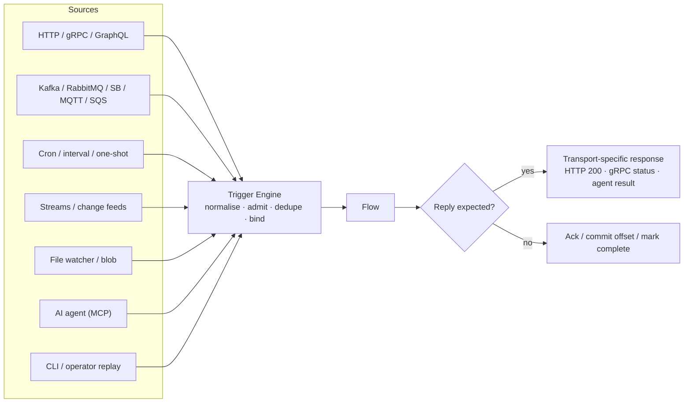
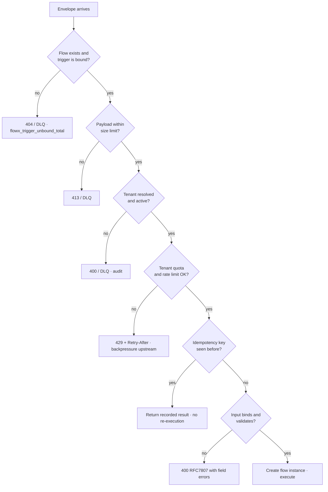
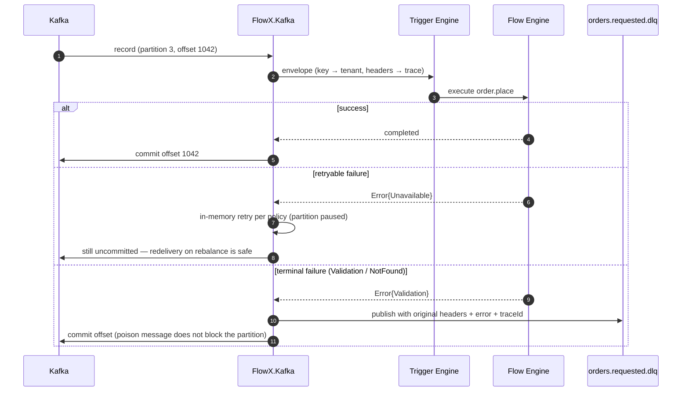
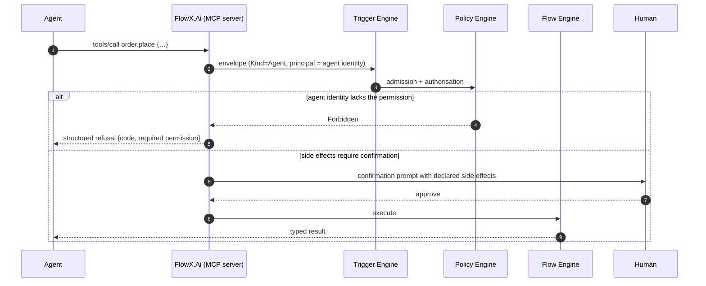

# 09 — Trigger Model

> **Status:** Accepted · **Audience:** application engineers, plugin authors
> **Answers:** how does one abstraction serve HTTP, brokers, cron, streams and agents?

---

## 1. The premise

Every activation mechanism reduces to the same three facts:

1. Something happened, at a point in time.
2. It carries a payload and some headers.
3. It expects a flow to run — with a delivery guarantee and possibly a reply.

FlowX normalises all of it into one envelope, then never lets the flow see it.



---

## 2. The envelope

```csharp
public readonly record struct TriggerEnvelope(
    TriggerKind Kind,
    string Source,                     // "POST /api/v1/orders" | "kafka:orders.requested[3]"
    ReadOnlyMemory<byte> Body,
    TriggerHeaders Headers,
    DateTimeOffset OccurredAt);

public readonly record struct TriggerHeaders(
    string CorrelationId,              // created if absent; always propagated
    string? TenantId = null,
    ClaimsPrincipal? Principal = null,
    string? IdempotencyKey = null,
    DateTimeOffset? Deadline = null,
    string? TraceParent = null);       // W3C traceparent, carried verbatim
```

Header propagation is uniform: an HTTP `traceparent`, a Kafka header, and an MQTT
user property all land in the same field, so a trace spans transports without
any user code.

*The block above previously printed a shape that never shipped:
`CorrelationId`/`TenantId` as wrapper types, an `ActivityContext TraceContext`,
and an `Extensions` dictionary. The real record takes strings, carries the
traceparent as an unparsed string, and has no extensions bag — a design choice
that keeps `FlowX.Abstractions` dependency-free, which
`AbstractionsHasNoDependencies` enforces. `TraceParent` is **carried, not
continued**: nothing reads it, because nothing starts an `Activity` (see
[12-Observability](12-Observability.md)).*

---

## 3. Declaring triggers

```csharp
[Flow("order.place", Profile = ExecutionProfile.Durable)]
[HttpTrigger("POST", "/api/v1/orders", Idempotent = true, Version = "v1")]
[KafkaTrigger("orders.requested", Group = "order-placement", StartFrom = Offset.Committed)]
[CronTrigger("0 2 * * *", TimeZone = "Europe/Berlin", Overlap = OverlapPolicy.Skip)]
[AgentTrigger(Description = "Place a customer order with payment and inventory reservation")]
public sealed partial class PlaceOrderFlow : Flow<PlaceOrder, OrderPlacedResult> { … }
```

Four transports, zero changes to the flow body. **This is quality goal Q4, and it
is the single most visible benefit of the model.**

---

## 4. Trigger kinds and their semantics

| Kind | Delivery | Reply | Ordering | Failure handling |
|---|---|---|---|---|
| `Http` | at-most-once | yes, synchronous | none | RFC 7807 + `Retry-After`; caller retries |
| `Grpc` | at-most-once | yes, sync or stream | per-stream | status code mapping |
| `Bus` | at-least-once | optional (reply-to) | per partition/key | retry → DLQ after N |
| `Stream` | at-least-once + checkpoint | no | per partition | pause → retry → poison topic |
| `Schedule` | at-least-once | no | none | missed-fire policy |
| `Change` | at-least-once | no | per key | retry → DLQ |
| `Agent` | at-most-once | yes | none | structured refusal or error |
| `Cli` / `Manual` | at-most-once | yes | none | surfaced to the operator |

---

## 5. Admission control

Before a flow is created, the Trigger Engine runs a fixed admission sequence.
This is the platform's outer defence, and it is the same for every transport.



Admission happens **before** the flow instance exists, so a rejected request
costs no journal write, no context allocation and no capability resolution.

---

## 6. HTTP trigger

```csharp
[HttpTrigger("POST", "/api/v1/orders", Idempotent = true)]
```

Generated: the endpoint, the model binder, the OpenAPI operation, the RFC 7807
error mapping and the idempotency filter.

### API contract (generated, shown for review)

| Method & Path | Purpose | Auth | Idempotency | Success | Errors |
|---|---|---|---|---|---|
| `POST /api/v1/orders` | run `order.place` | Bearer (from capability stance) | `Idempotency-Key` **required** | 200 + result | 400 validation, 401, 403, 409 conflict, 429 quota, 503 unavailable |
| `GET /api/v1/orders/{id}` | run `order.get` | Bearer | n/a (safe) | 200 | 404 |
| `GET /api/v1/flows/{instanceId}` | instance status | operator scope | n/a | 200 | 404 |
| `POST /api/v1/flows/{instanceId}/signals/{name}` | deliver a signal — **design only, see below** | Bearer | natural (state machine) | 202 | 404, 409 not suspended |

> [!WARNING]
> **The signal row is a design, and nothing generates that endpoint.** No instance is
> ever `Suspended`, because no flow can declare a suspension point:
> [`FLOWX1031`](diagnostics/FLOWX1031.md) is an error on `AwaitSignal` and a warning on
> `Delay` and `OnTimeout`, and
> [06 §6](06-Execution-Engine.md#6-suspension-waiting-without-holding-resources) says
> why. There is no signal table for a delivered signal to be appended to either.
> Durable suspension is [WP-63](20-Roadmap.md#3-increment-detail), and this row lands
> with it.
>
> The other three rows are real. Until WP-63, a process that has to wait for an external
> party is expressed as two flows — the second one triggered by that party's own request —
> which is what the trigger model already supports.

```jsonc
// POST /api/v1/orders  → 200
{ "orderId": "01HV8…", "paymentReference": "pay_9f2…" }

// Any error — RFC 7807, always, on every transport that has a body
{ "type":  "https://errors.acme.com/inventory.out_of_stock",
  "title": "Out of stock",
  "status": 409,
  "detail": "SKU-1 has 0 available, 2 requested",
  "instance": "/api/v1/orders",
  "traceId": "00-4bf92f…-01",
  "flowInstanceId": "fi_01HV8…" }
```

Long-running durable flows return `202 Accepted` with a `Location` header
pointing at the instance resource, rather than holding the connection open.

---

## 7. Bus trigger

```csharp
[KafkaTrigger("orders.requested",
    Group = "order-placement",
    StartFrom = Offset.Committed,
    MaxInFlight = 32,
    DeadLetter = "orders.requested.dlq")]
```



Offsets are committed **after** flow completion. Combined with capability
idempotency this yields effectively-once processing. A terminal error is
dead-lettered rather than retried forever — head-of-line blocking is a bug, not
a durability strategy.

---

## 8. Schedule trigger

```csharp
[CronTrigger("0 2 * * *", TimeZone = "Europe/Berlin",
    Overlap = OverlapPolicy.Skip, MissedFire = MissedFirePolicy.RunOnce)]
```

| Option | Values | Meaning |
|---|---|---|
| `Overlap` | `Skip` \| `Queue` \| `Concurrent` | what happens when the previous run is still going |
| `MissedFire` | `Skip` \| `RunOnce` \| `RunAll` | behaviour after downtime |
| `TimeZone` | IANA id | DST-correct; a schedule without a zone is UTC |
| `Jitter` | duration | spreads load across replicas and tenants |

The Scheduler Engine is **leader-elected** using the same lease store as durable
flows. Two replicas never fire the same schedule; a dead leader is replaced
within the lease TTL. Schedules are per-tenant when the flow is tenant-scoped.

---

## 9. Stream trigger

```csharp
[Flow("telemetry.aggregate", Profile = ExecutionProfile.Streaming)]
[StreamTrigger("device.telemetry", Window = "tumbling:1m", Lateness = "10s",
    Checkpoint = "PT5S", Parallelism = 8)]
public sealed partial class AggregateTelemetryFlow : Flow<TelemetryBatch, Aggregate>
{
    protected override void Define(IFlowBuilder<TelemetryBatch, Aggregate> flow) => flow
        .Window(w => w.Tumbling(TimeSpan.FromMinutes(1)).AllowLateness(TimeSpan.FromSeconds(10)))
        .Aggregate<DeviceStats>((acc, r) => acc.Add(r))
        .Step<PersistAggregate>()
        .Emit<AggregateComputed>();
}
```

| Window | Semantics |
|---|---|
| `Tumbling(d)` | fixed, non-overlapping |
| `Sliding(size, advance)` | overlapping |
| `Session(gap)` | activity-bounded |
| `Global` | unbounded with explicit triggers |

Watermarks drive window closure; records later than `Lateness` are routed to a
side output rather than dropped silently. Backpressure per
[06 §10](06-Execution-Engine.md#10-backpressure-streaming-profile).

---

## 10. Agent trigger

```csharp
[AgentTrigger(Description = "Place a customer order with payment and inventory reservation",
              Confirmation = ConfirmationMode.RequiredForSideEffects)]
```

The compiler emits an MCP tool descriptor from the flow's input contract — the
same JSON Schema that drives OpenAPI. The agent surface is therefore **exactly**
the flow surface, with the same authorisation.



Two properties matter here and both fall out of the model for free:

- **An agent cannot reach anything a human could not reach.** Authorisation is on
  the capability, not the transport (P11).
- **The agent sees declared side effects** (`SideEffects` in the capability
  attribute), so confirmation prompts are accurate rather than blanket. See
  [13-AI-Native](13-AI-Native.md) and [15-Security §7](15-Security.md).

---

## 11. Writing a trigger plugin

```csharp
public interface ITriggerSource
{
    TriggerKind Kind { get; }
    ValueTask StartAsync(ITriggerSink sink, CancellationToken ct);
    ValueTask StopAsync(CancellationToken ct);          // must drain, not drop
}

public interface ITriggerSink
{
    ValueTask<FlowResult> DispatchAsync(in TriggerEnvelope envelope, CancellationToken ct);
}
```

Every trigger plugin must pass `FlowX.Conformance.Tests`:

| Conformance test | Asserts |
|---|---|
| `PropagatesTraceContext` | W3C trace continues across the transport |
| `PropagatesTenantAndPrincipal` | identity survives normalisation |
| `HonoursBackpressure` | a slow sink slows the source, memory stays bounded |
| `DrainsOnShutdown` | no message lost or double-processed on SIGTERM |
| `DeadLettersTerminalErrors` | `Validation`/`NotFound` are not retried forever |
| `RespectsDeadline` | envelope deadline is enforced |
| `IsIdempotencyAware` | duplicate keys return the recorded result |

> [!IMPORTANT]
> **This box said `FlowX.Conformance.Tests` does not exist. That is now wrong,
> and what replaces it is narrower than it sounds.** `tests/FlowX.Conformance.Tests`
> exists (WP-51) and holds three suites — `JournalConformance`,
> `LeaseStoreConformance` and `RecoveryIndexConformance` — **none** of which is a
> trigger suite. **None of the
> seven tests above has been written**, `TriggerSourceConformance` does not
> exist, and the interfaces they would test against — `ITriggerSource`,
> `ITriggerSink` — are still not declared anywhere in `src/`. The two signatures
> printed above remain a design sketch, not a contract a plugin can compile
> against.
>
> What is true is that the *shape* now exists: a suite is an abstract class with
> a factory, a store author derives from it and inherits every assertion, and
> that mechanism is proved to reject a wrong implementation by name
> (`TheSuiteRejectsAStoreThatIsWrongTests`). Nothing real has met it — the only
> implementation held to it is an in-memory reference in the same project, the
> project is **not packable**, and no suite has ever run against a real store.
> A trigger plugin has nothing to derive from at all.
>
> Publishing a *trigger* suite is named as the mitigation for **both** risk R3
> and risk R8 in [05 §11](05-Architecture.md#11-risks-and-technical-debt), and
> that has not happened. It is a **P3** deliverable. `PluginsPassConformance`
> remains blocked, with what it is waiting for, in
> [21 §2.4](21-Quality-Gates.md#24-gates-named-here-but-not-yet-enforced).
>
> There is also nothing yet to compare: `plugins/FlowX.Http` is the only plugin,
> so "every plugin agrees on the minimum semantics" has one data point. What
> `FlowX.Http.Tests` does assert today is narrower and real — that HTTP
> normalises into a `TriggerEnvelope` (`HttpTriggerReaderTests`) and that every
> `ErrorCategory` maps to its documented status (`ProblemDetailsMapperTests`).
> Four of the seven rows above are additionally blocked on subsystems that do
> not exist at all: trace context (**P5**), backpressure (**P7**), deadline
> enforcement and idempotency (**P4**).
>
> Treat this table as the specification a P3 plugin author will be held to. Do
> not treat a plugin as conformant because nothing failed.

---

## 12. Known limits of the abstraction

Honest non-goals — see risk R3 in [05 §11](05-Architecture.md#11-risks-and-technical-debt):

| Transport feature | Status | Escape hatch |
|---|---|---|
| Kafka rebalance callbacks | not in the universal model | plugin options, outside the flow |
| HTTP response streaming (SSE, chunked) | v1.1 via `Flow<TIn, IAsyncEnumerable<T>>` | raw ASP.NET Core endpoint alongside |
| MQTT QoS 2 exactly-once | mapped to at-least-once + idempotency | plugin option |
| gRPC bidirectional streaming | v1.2 | raw gRPC service alongside |
| Broker-native transactions | not modelled | outbox pattern |

FlowX aims to make 95 % of integrations uniform, not to make the last 5 %
impossible. When you need the raw transport, use it — next to a FlowX flow, not
inside one.

---

**Next:** [10 — Policy Framework](10-Policy-Framework.md)
