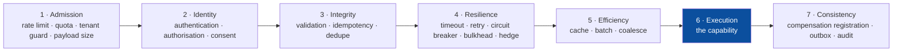
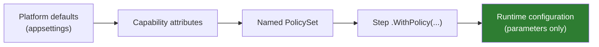
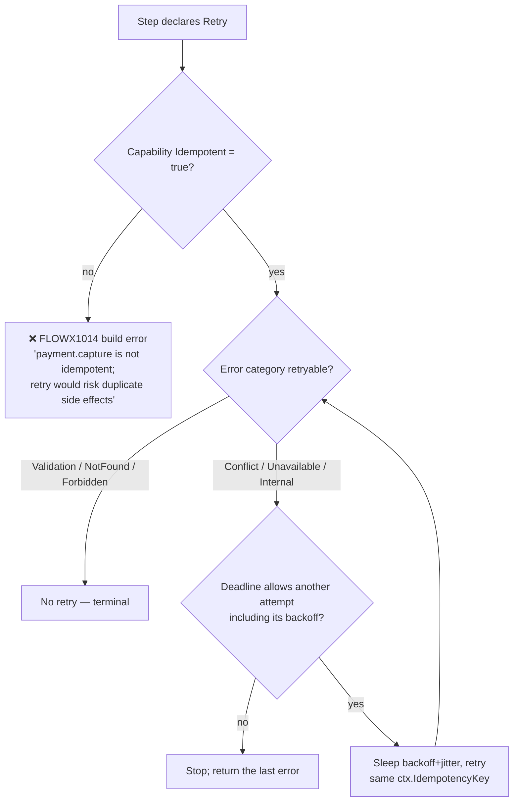
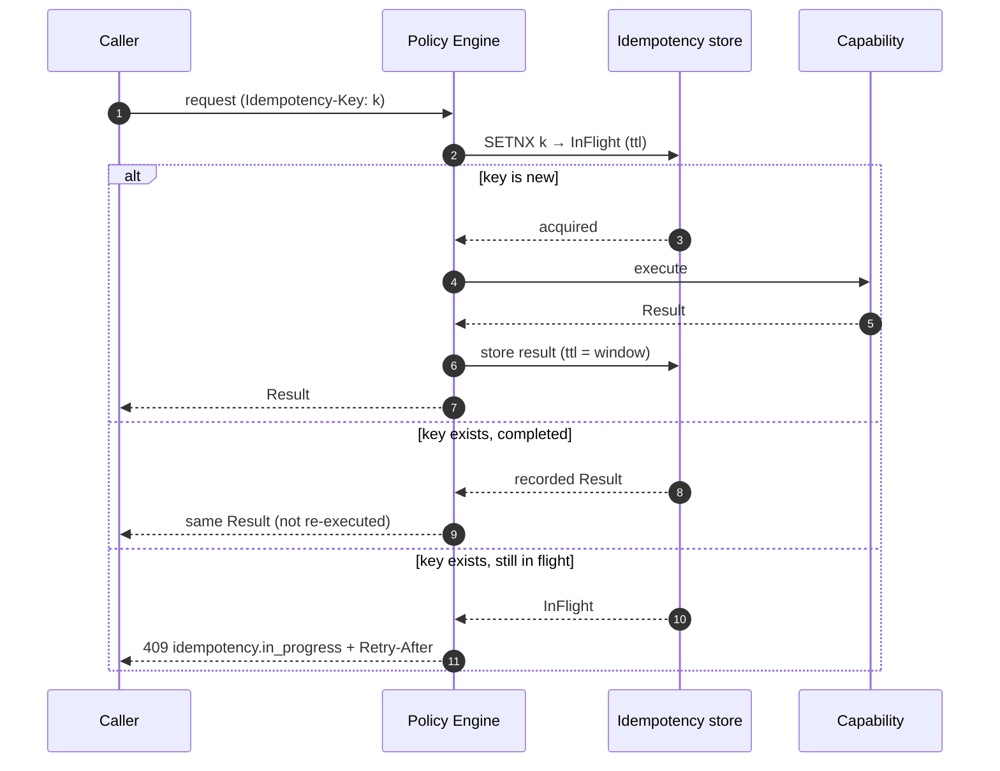

# 10 — Policy Framework

> **Status:** Accepted · **declared, not executed** · **Audience:** application engineers, SRE
> **Answers:** how are cross-cutting concerns declared, ordered and made safe?

> [!IMPORTANT]
> **A policy can be declared and published; none is applied at run time.** What
> ships: `PolicySet` and its builder methods, `.WithPolicy(...)` on a step, a
> compiler that reads the set's contents well enough to raise
> [`FLOWX1014`](diagnostics/FLOWX1014.md) (retry on a non-idempotent capability)
> and [`FLOWX1018`](diagnostics/FLOWX1018.md) (cache on a capability with side
> effects), and a manifest that records each step's policies with the fixed stage
> each one runs in. The safety *diagnostics* in this document are real and
> enforced at build time.
>
> What does not ship: the Policy Engine. There is no policy execution in
> `FlowX.Runtime` — no timeout is armed, no retry is attempted, no breaker opens,
> no cache is consulted, no authorisation stance is checked at a boundary, and no
> audit record is written. A step's policy chain is metadata the runtime never
> reads. Nothing in this repository declares a policy either, so the emission
> path has not run against a shipped assembly.
>
> That is **P4** in [20-Roadmap](20-Roadmap.md). Read §2's stage order as the
> contract the engine must be built to, and every claim below about behaviour at
> run time as specification.

---

## 1. What a policy is

> A **policy** is a declarative, reusable rule applied around a step or a flow,
> composed at compile time and parameterised at run time.

Policies are the answer to "where does the retry go?" — a question that, in
hand-written pipelines, is answered differently in every service, and wrongly in
most.

---

## 2. Fixed stage order — the core decision



The order is **not configurable** ([ADR-0011](adr/ADR-0011-fixed-policy-stage-order.md)).
Within a stage, an `order` value breaks ties.

### Why rigidity is the feature

Each of these is a real production incident, and each becomes unexpressible:

| Mistake | Consequence | Prevented because |
|---|---|---|
| Cache before authorisation | tenant A served tenant B's cached data | Identity (2) precedes Efficiency (5) |
| Retry outside idempotency | duplicate charges | Integrity (3) precedes Resilience (4) |
| Rate limit after authentication | unauthenticated flood exhausts the token validator | Admission (1) precedes Identity (2) |
| Timeout inside retry | 3 × 30 s inside a 10 s SLA | deadline is subtracted before each attempt |
| Compensation registered before the step succeeds | compensating something that never happened | Consistency (7) follows Execution (6) |
| Validation after the side effect | corrupt data written, then rejected | Integrity (3) precedes Execution (6) |

The escape hatch, when a legitimate counterexample appears: a capability may
declare a `PolicyStage.Custom` handler that runs *within* its own stage.
ADR-0011 is scheduled for review after three documented counterexamples.

---

## 3. The policy catalogue

| Policy | Stage | Key parameters | Notes |
|---|---|---|---|
| `RateLimit` | 1 | `permits`, `window`, `scope` (global/tenant/principal/key) | token bucket; returns 429 + `Retry-After` |
| `Quota` | 1 | `budget`, `period`, `scope` | long-window fairness across tenants |
| `Authorize` | 2 | derived from the capability's stance | deny-by-default; audited |
| `Consent` | 2 | `purpose` | GDPR purpose-limitation checks |
| `Validate` | 3 | generated from contract annotations | field errors → RFC 7807 |
| `Idempotency` | 3 | `key`, `window`, `store` | replays the recorded result |
| `Timeout` | 4 | `duration` | never exceeds the remaining flow deadline |
| `Retry` | 4 | `attempts`, `backoff`, `jitter`, `retryOn` | **requires `Idempotent = true`** |
| `CircuitBreaker` | 4 | `failureRatio`, `samplingWindow`, `minimumThroughput`, `breakDuration` | per capability + per downstream key |
| `Bulkhead` | 4 | `maxConcurrency`, `queueDepth` | isolates a slow dependency |
| `Hedge` | 4 | `afterDelay`, `maxAttempts` | tail-latency cutting; idempotent only |
| `Fallback` | 4 | capability or constant | explicit degraded mode |
| `Cache` | 5 | `ttl`, `key`, `scope`, `store` | tenant-scoped by default |
| `Batch` | 5 | `size`, `window` | coalesces N invocations into one |
| `Audit` | 7 | `category`, `redact` | immutable audit record |
| `Outbox` | 7 | — | implicit on `.Emit` in durable flows |

---

## 4. Declaring policies

### On a capability (its own defaults, travel with it)

```csharp
[Capability("payment.capture", Version = "2.1.0", Idempotent = true,
            Authorization = Authorization.Permission, Permission = "payment:capture")]
[Timeout("PT2S")]
[CircuitBreaker(FailureRatio = 0.5, SamplingWindow = "PT30S", BreakDuration = "PT15S")]
[Audit(Category = "financial", Redact = ["Method.Pan"])]
public sealed class CapturePayment : ICapability<CaptureRequest, Capture> { … }
```

### On a step (overrides and additions for this use)

```csharp
flow.Step<CapturePayment>()
    .WithPolicy(Policies.PaymentGateway);
```

### As a named, reusable set

```csharp
public static class Policies
{
    public static readonly PolicySet PaymentGateway = PolicySet.Named("payment-gateway")
        .Timeout("PT2S")
        .Retry(attempts: 3, backoff: Backoff.ExponentialJitter(baseDelay: "PT200MS"),
               retryOn: [ErrorCategory.Unavailable, ErrorCategory.Internal])
        .CircuitBreaker(failureRatio: 0.5, breakDuration: "PT15S")
        .Bulkhead(maxConcurrency: 64, queueDepth: 128);

    public static readonly PolicySet ExternalRead = PolicySet.Named("external-read")
        .Timeout("PT1S")
        .Retry(attempts: 2, backoff: Backoff.ExponentialJitter())
        .Cache(ttl: "PT60S", scope: CacheScope.Tenant)
        .Fallback(FallbackMode.LastKnownGood);
}
```

### On a flow (applies to every step unless overridden)

```csharp
[Flow("order.place", Profile = ExecutionProfile.Durable)]
[FlowDeadline("PT30S")]
[RateLimit(Permits = 100, Window = "PT1S", Scope = RateLimitScope.Tenant)]
public sealed partial class PlaceOrderFlow : … { }
```

### Resolution order



Later stages override earlier ones **for parameter values only**. Runtime
configuration can change a timeout from 2 s to 3 s; it can never add, remove or
reorder a policy. That would change the graph, which is forbidden (Manifesto,
"What we refuse").

---

## 5. Retry safety



Two guarantees worth stating explicitly:

- **A retry never uses a fresh idempotency key.** Attempt 2 presents the same key
  as attempt 1, which is what makes downstream deduplication work.
- **A retry never outlives the deadline.** The policy engine subtracts elapsed
  time plus the planned backoff before arming the next attempt.

Default backoff is exponential with **full jitter**
(`delay = random(0, base × 2^attempt)`, capped) — decorrelated retries prevent
the synchronised thundering herd that fixed backoff produces.

---

## 6. Circuit breaker scope

A breaker keyed only by capability is too coarse: one bad downstream tenant or
region trips the breaker for everyone.

```csharp
[CircuitBreaker(FailureRatio = 0.5, Key = BreakerKey.Capability | BreakerKey.Downstream)]
```

| Key component | Effect |
|---|---|
| `Capability` | per capability id (always included) |
| `Downstream` | per declared side-effect target |
| `Tenant` | per tenant — prevents one tenant tripping everyone |
| `Partition` | per stream partition |

State transitions are exported as `flowx_circuit_state{capability,key}` and
appear live in Studio's topology view.

---

## 7. Idempotency policy

```csharp
[Idempotency(Window = "PT24H", Scope = IdempotencyScope.Tenant, Store = "redis")]
```



The in-flight state matters: without it, two concurrent requests with the same
key both execute. This is the most common bug in hand-rolled idempotency.

---

## 8. Cache safety

Caching is the most dangerous policy in a multi-tenant system, so its defaults
are conservative:

| Default | Value | Rationale |
|---|---|---|
| Scope | `Tenant` | cross-tenant leakage is unacceptable by default |
| Key | capability id + input hash + tenant + **principal permission set** | prevents privilege-based leakage |
| Applies to | capabilities with **no** declared side effects | caching a write is a bug |
| Stampede protection | single-flight per key | prevents cache-miss herds |
| Negative caching | off | stale failures are worse than a retry |

Declaring `Cache` on a capability with side effects is `FLOWX1018` (error).

---

## 9. Observing policies

Every policy emits telemetry with a uniform schema — you never have to instrument
resilience by hand:

| Metric | Type | Labels |
|---|---|---|
| `flowx_policy_invocations_total` | counter | `policy`, `stage`, `capability`, `outcome` |
| `flowx_retry_attempts_total` | counter | `capability`, `attempt`, `error_code` |
| `flowx_circuit_state` | gauge (0/1/2) | `capability`, `key` |
| `flowx_ratelimit_rejected_total` | counter | `scope`, `tenant` |
| `flowx_cache_hits_total` / `_misses_total` | counter | `capability`, `scope` |
| `flowx_bulkhead_queue_depth` | gauge | `capability` |
| `flowx_idempotency_replays_total` | counter | `capability`, `scope` |

Policy decisions also appear as span events on the step span, so a trace shows
*why* a call took 3.2 s: two retries with 400 ms and 900 ms of backoff.

---

## 10. Testing policies

```csharp
[Fact]
public async Task PaymentGateway_policy_opens_breaker_after_sustained_failures()
{
    var host = FlowTestHost.For<PlaceOrderFlow>()
        .Substitute<CapturePayment>(_ => Result.Fail<Capture>(PaymentErrors.GatewayUnavailable()))
        .WithVirtualTime()                      // no real sleeping in tests
        .Build();

    for (var i = 0; i < 20; i++) await host.RunAsync(AnOrder());

    host.Policy<CircuitBreaker>("payment.capture").State.Should().Be(CircuitState.Open);
    host.Metrics.Counter("flowx_retry_attempts_total").Should().BeGreaterThan(0);
}
```

`WithVirtualTime()` makes backoff, timeout and breaker windows deterministic and
instant. Resilience tests that sleep in real time are why nobody writes
resilience tests; FlowX removes the excuse.

---

## 11. Anti-patterns

| Anti-pattern | Why | Instead |
|---|---|---|
| Retry on `Validation` errors | the input will never become valid | restrict `retryOn` |
| Timeout longer than the flow deadline | the step is killed by the deadline anyway; the timeout is a lie | keep step timeouts well under the flow budget |
| Retry without a breaker | retries amplify an outage into a self-DDoS | always pair them |
| Cache on a capability with side effects | silent data corruption | `FLOWX1018` blocks it |
| Rate limiting only globally | one tenant starves the rest | `Scope = Tenant` |
| Policies defined inline per step | drift across the codebase | named `PolicySet` constants |

---

**Next:** [11 — Distributed Runtime](11-Distributed-Runtime.md)
