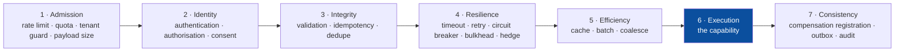
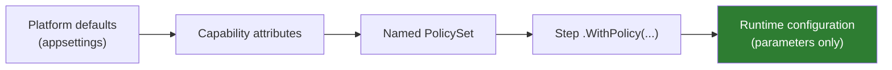
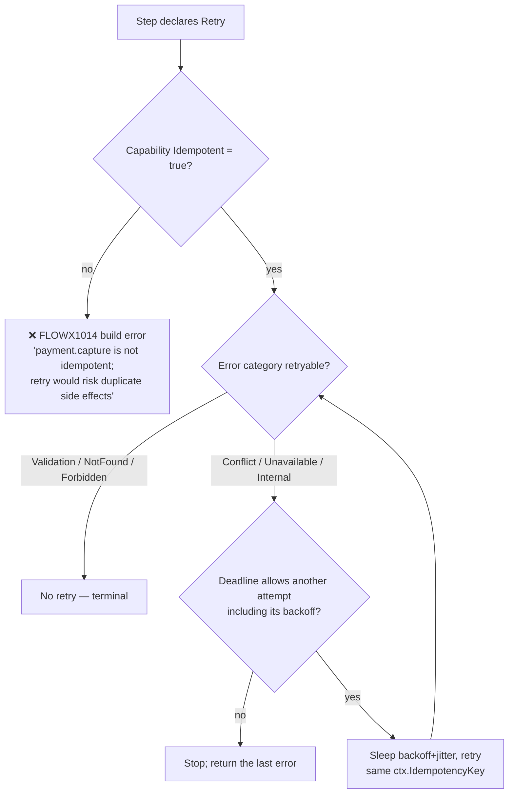
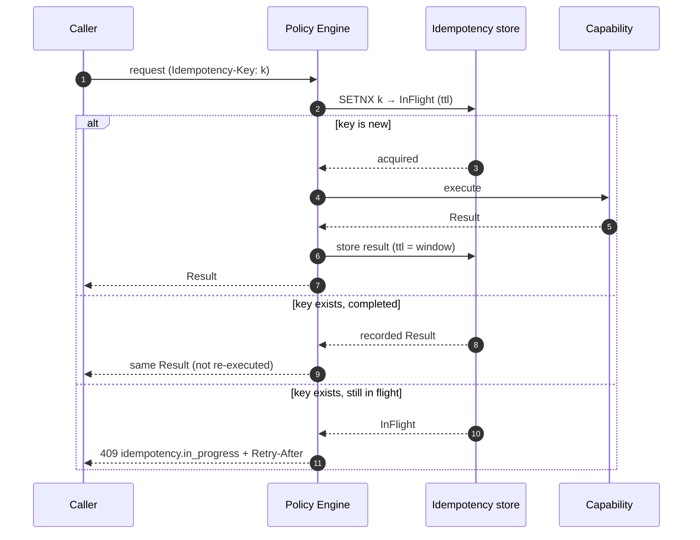

# 10 — Policy Framework

> **Status:** Accepted · **every declarable kind executes** · **Audience:** application engineers, SRE
> **Answers:** how are cross-cutting concerns declared, ordered and made safe?

> [!IMPORTANT]
> **Stage 4 — `Resilience` — is applied at run time, and so is `CompensationRetry`
> at stage 7.** A declared `Timeout` is armed and clamped to what is left of the
> flow's deadline; a declared `Retry` makes the attempts it asked for, on the
> categories it named, with full-jitter backoff, and refuses an attempt whose
> backoff alone would outlive the deadline; a declared `CircuitBreaker` counts
> outcomes per capability, opens on its failure ratio and half-opens after its
> break duration; a declared `Bulkhead` bounds concurrency and refuses past its
> queue depth; a declared `Hedge` issues a second call beside a first that has
> gone quiet and keeps whichever answers; a declared `Fallback` answers with its
> constant once every attempt has been made and refused. `FlowEngine` reads
> `ExecutionPlan.HasStepPolicies` and then
> `StepNode.StepPolicy`, resolved when the plan was built.
> `PolicyExecutionTests` asserts each of them against a real engine running a
> real plan, and `samples/banking` settles a transfer whose screening provider
> fails once.
>
> **Stage 1 — `Admission` — and stage 3 — `Integrity` — are applied too, and each runs two
> kinds.** A declared `RateLimit` takes a permit from a
> distributed token bucket before the step is dispatched, and refuses with
> `policy.rate_limited` when the budget is spent; a declared `Quota` spends one unit of a
> fixed-window counter after it and refuses with `policy.quota_exhausted` when the plan is
> spent for the period. A declared `Validate` checks the input against the rules its contract
> declares and refuses with `policy.validation_failed`; a declared `Idempotency` window
> claims the key, replays a recorded result for a repeat, and refuses a
> concurrent presentation. All four sit outside the retry loop. Neither store-backed kind has an
> in-memory fallback: a step declaring one with no store registered is refused
> rather than run, because a budget counted in a process admits n × the
> declared figure across n nodes
> ([ADR-0040](adr/ADR-0040-a-rate-limit-is-shared-or-it-is-not-a-rate-limit.md)).
> `IRateLimiterStore`, `IQuotaStore` and `IIdempotencyStore` are the seams; PostgreSQL backs all
> three and Redis backs two, held to `RateLimiterConformance`, `QuotaStoreConformance` and
> `IdempotencyStoreConformance`. `Validate` needs no store at all — its enforcement is generated
> source in the flow's own dispatcher — and its build-time misuse is
> [`FLOWX1055`](diagnostics/FLOWX1055.md), a `Validate` over a contract that declares no rule.
>
> **A flow that declares a `[Sensitive]` contract member may not declare an
> `Idempotency` window** — [`FLOWX1040`](diagnostics/FLOWX1040.md), an error.
> Stage 3 records the state bag through `JournalPayload`, whose only exit
> replaces every marked member with `[redacted]` at every depth, so replaying
> such a record would answer a later caller with the placeholder
> ([ADR-0042](adr/ADR-0042-a-recorded-result-is-replayed-only-when-recording-lost-nothing.md)).
>
> **Stage 5 — `Cache` — and stage 7's `Audit` execute too.** A declared cache is consulted
> before the dispatch and holds what the step produced, keyed on the capability, its version,
> the tenant, the principal's permission set under `CacheScope.Principal`, and the input
> document; a declared audit produces an immutable record naming the step, the principal that
> authorised it, the stance it was decided against, and a redacted request/result payload.
> `IResultCache` and `IAuditSink` are plugin contracts —
> [ADR-0044](adr/ADR-0044-a-cache-is-a-plugin-store-keyed-by-the-redacted-input.md) and
> [ADR-0043](adr/ADR-0043-an-audit-record-is-the-journals-payload-redacted-twice.md).
> `CachePolicyTests` and `AuditPolicyTests` assert each against a real engine, and
> `samples/banking` settles a transfer that leaves three financial audit records behind.
> A missing `IAuditSink` **fails** the audited step, for the reason a missing limiter refuses
> the caller; a missing `IResultCache` merely dispatches, because an unconsulted cache costs
> latency and never correctness.
>
> **No declarable kind is inert.** All fourteen `PolicySet` builders reach code that applies what
> they declared. [`FLOWX1032`](diagnostics/README.md#flowx1032-is-deleted-with-what-it-described)
> — the rule that reported a declared policy nothing executed — is **deleted**, having been
> narrowed from the eight kinds it was written over, to four when the policy engine landed,
> to two when stages 1 and 3 did. There was no third narrowing available.
> [ADR-0025](adr/ADR-0025-a-partial-policy-engine-executes-stage-four-alone.md)
> argued each of the four skips separately, including the one that looked like a
> violation of [ADR-0011](adr/ADR-0011-fixed-policy-stage-order.md): running a
> retry without the stage-3 policy is safe because `FLOWX1014` refuses a retry
> over a capability that is not idempotent, and because every attempt presents
> the same `ctx.IdempotencyKey` — which is still what holds for every flow `FLOWX1040`
> refuses a window to. All four of its subsections are now history and are marked as such
> rather than deleted.
>
> **Two catalogue rows in §3 cannot be declared at all**, and a third is enforced without being
> declarable. `PolicySet` offers fourteen builder methods, and there is no policy attribute
> anywhere in `FlowX.Abstractions` — the `[Timeout]`, `[CircuitBreaker]`, `[Audit]`,
> `[RateLimit]` and `[Idempotency]` attributes in §4 do not exist. So `Batch` and `Outbox` are
> specification with no surface: no author can write one, and there is
> nothing for an engine to execute. §3 marks each of them, and
> [ADR-0081](adr/ADR-0081-a-batch-has-no-unit-the-engine-can-name.md) is what `Batch` is blocked
> on.
>
> **It said four until WP-83, and two of those four left the list in opposite directions.**
> `Consent` is stage 2's first builder method: `PolicySet.Consent(purpose)` compares the purpose
> a step declares with the purpose the invocation carried on a validated claim, refuses an
> absent one as readily as a wrong one, and needs no store, because the comparison is two
> strings the process already holds. `Authorize` **was never a gap** — the row's own parameters
> column says *derived from the capability's stance*, and the stance has been decided in the
> step loop since WP-77
> ([ADR-0027](adr/ADR-0027-authorisation-runs-in-the-step-loop.md)); what expired is the row's
> claim that "no boundary checks it", which had been false for six work packages. It is
> reclassified as *derived* rather than given a builder, because a declarable `Authorize` would
> be a second reading of a question the descriptor already answers. **One clause of it is still
> unmet: a refusal is not audited**, and §3's row says so.
>
> **It said six until WP-81 and WP-82.** `Validate` and `Quota` are builder methods now, and
> the two stages that already executed each grew a second kind rather than a new stage:
> `PolicySet.Quota(budget, period, scope)` spends a fixed-window counter in an `IQuotaStore`
> before the step is dispatched and refuses with `policy.quota_exhausted` carrying the remainder
> of the period, and `PolicySet.Validate()` runs checks the compiler generated from the input
> contract's `[Required]`, `[Range]` and length annotations and refuses with
> `policy.validation_failed` carrying RFC 7807 field errors. Neither reflects at run time: the
> quota's key is built by the engine and the validation's comparisons are emitted into the
> generated dispatcher, which is what constraint **C2** requires of both.
> **It said eight until WP-78 and WP-79**, which is what `Hedge` and `Fallback` leaving this
> list means: stage 4 is now a nesting of six kinds rather than four
> ([ADR-0078](adr/ADR-0078-stage-four-nests-six-kinds.md)), a hedge races calls it cancels the
> losers of, and a fallback answers with a declared constant once the retry has stopped asking.
> The `Fallback` row was the one place a catalogue row was half built; **WP-80 built the other
> half**, so a fallback now answers with a constant or with a second capability, as §3 has
> always catalogued it
> ([ADR-0079](adr/ADR-0079-a-fallback-capability-is-a-dispatch-of-its-own.md)).
>
> **The cut is a list of kinds, not a range of stages, and this document has now got that
> wrong in both available directions.** It once implied the line was "stages 1–6", which
> `Audit` falsified by being a stage-7 policy that did not run beside a stage-7 policy that
> did. The opposite reading is available now: `Cache` at stage 5 and `Audit` at stage 7 both
> execute while `Idempotency` at stage 3 does not. No line drawn by stage number has ever
> separated what executes from what does not.
>
> Four rules report the ways a declared set reaches even less than the plan:
> [`FLOWX1033`](diagnostics/FLOWX1033.md) a `CompensationRetry` on a step with no
> compensation for it to wrap; [`FLOWX1034`](diagnostics/FLOWX1034.md) a second
> `.WithPolicy(...)` on one step, which *replaces* the first rather than adding
> to it; [`FLOWX1035`](diagnostics/FLOWX1035.md) a compensation retry of one
> attempt, which the manifest publishes as a retry and the engine dispatches
> once; and [`FLOWX1036`](diagnostics/FLOWX1036.md) a set the compiler cannot
> read at all — one in a referenced assembly or built at run time — which reaches
> no plan, no manifest and none of the rules above it.
>
> Read §2's stage order as the contract the engine is built to. Read §5, §6, §7, §8 and §11
> as behaviour, with two exceptions: §6's composite `BreakerKey` — the breaker is keyed by
> capability id and there is no syntax for the other three components — and §8's stampede
> protection, which is not built.

---

## 1. What a policy is

> A **policy** is a declarative, reusable rule applied around a step or a flow,
> composed at compile time and parameterised at run time.

Policies are the answer to "where does the retry go?" — a question that, in
hand-written pipelines, is answered differently in every service, and wrongly in
most.

---

## 2. Fixed stage order — the core decision



The order is **not configurable** ([ADR-0011](adr/ADR-0011-fixed-policy-stage-order.md)).

**Within a stage there is no `order` value, and this document claimed one for three
releases.** `PolicyDescriptor` carries `Kind`, `Stage` and `Parameters`, and no builder
method accepts a precedence. `PolicyChain` sorts by stage with a *stable* sort, so two
policies in one stage keep their declared order — which decides what the manifest publishes
and nothing else. What decides which of them wraps which is fixed by kind:
`Fallback { Retry { Hedge { CircuitBreaker { Bulkhead { Timeout { capability } } } } } }`,
settled for four kinds by [ADR-0024](adr/ADR-0024-stage-four-is-a-fixed-nesting.md) — which also
says why an `order` value is not merely missing but unwanted, three of the four possible nestings
being the incidents this section exists to make unexpressible — and extended to six by
[ADR-0078](adr/ADR-0078-stage-four-nests-six-kinds.md), which places each new kind by the same
test: what its unit is.

### Why rigidity is the feature

Each of these is a real production incident, and each becomes unexpressible:

| Mistake | Consequence | Prevented because |
|---|---|---|
| Cache before authorisation | tenant A served tenant B's cached data | Identity (2) precedes Efficiency (5) |
| Retry outside idempotency | duplicate charges | Integrity (3) precedes Resilience (4) |
| Rate limit after authentication | unauthenticated flood exhausts the token validator | Admission (1) precedes Identity (2) |
| Timeout inside retry | 3 × 30 s inside a 10 s SLA | deadline is subtracted before each attempt |
| Compensation registered before the step succeeds | compensating something that never happened | Consistency (7) follows Execution (6) |
| Validation after the side effect | corrupt data written, then rejected | Integrity (3) precedes Execution (6) |

The escape hatch, when a legitimate counterexample appears: a capability may
declare a `PolicyStage.Custom` handler that runs *within* its own stage.
ADR-0011 is scheduled for review after three documented counterexamples.

---

## 3. The policy catalogue

Seventeen rows. **Fourteen can be written down**: `PolicySet` has fourteen builder methods and
there is no policy attribute in `FlowX.Abstractions`. All fourteen execute. Of the three that
remain, **one is enforced without being declarable and two are not built** — which is why the
**Status** column now has three values rather than two: *executes*, ***derived*** (no builder
method, and none wanted — the engine enforces it from the capability's own declaration), and
*undeclarable* (no builder method, no attribute, no descriptor kind: specification with no
surface). There is no longer a *declared only* row, which is why `FLOWX1032` is deleted.

> **"Thirteen of them can be written down" expired at WP-83**, which had said "eleven" until
> WP-81 and WP-82, "nine" until WP-78 and WP-79, and "eight" before that. `Consent` is a builder
> method now and executes, and **stage 2 is the first stage a widening has opened rather than
> joined** — every kind added since the policy engine landed had gone into a stage that already
> ran. It needed no new plan flag either: a policy arrives on a `PolicyChain` that
> `StepPolicy.From` already walks, so this is one field, one term in `IsActive` and one guard
> beside the stance's, which is [ADR-0023](adr/ADR-0023-policy-stages-hook-through-the-plan.md)'s
> "widening is mechanical" taken up a fourth time.
>
> **And "four rows are undeclarable" expired in two different directions at once.** `Authorize`
> was never a gap: its own key-parameters column says *derived from the capability's stance*, and
> that stance has been enforced in the step loop since WP-77 — the row went on saying "no
> boundary checks it" for six work packages after the boundary started checking it. It is
> reclassified rather than built, because building a declarable `Authorize` would put a second
> reading beside the descriptor's. What is genuinely unbuilt is **two** rows: `Batch`, refused
> and recorded at
> [ADR-0081](adr/ADR-0081-a-batch-has-no-unit-the-engine-can-name.md) with five named blockers,
> and `Outbox`, which that row has always said is the emit step's own commit rather than a
> policy anybody declares. **One clause of the `Authorize` row is still unmet and is not
> stale** — *audited*. A refused step writes no audit record, because `Audit` runs at stage 7
> after the commit and a step refused at stage 2 breaks out of the loop long before it. So
> [15 §4](15-Security.md#4-authorisation-model)'s `403 + audit event` is half built, and the
> reason that document gives for it — that `Audit` does not execute — stopped being the reason
> when `Audit` shipped.
> **The two stages that already executed each grew a second kind, and neither needed a new
> hook.** Stage 1's `AdmitAsync` asks both admission kinds and returns the first refusal; stage
> 3 runs the generated checks before the window is claimed, so a refused input never spends the
> caller's idempotency key. That is
> [ADR-0023](adr/ADR-0023-policy-stages-hook-through-the-plan.md)'s "widening is mechanical"
> taken up a third time: two fields on `StepPolicy`, two terms in `IsActive`, no new plan flag.
> **"Half of the `Fallback` row is still specification" expired at WP-80.** Both halves are
> builder methods now — `Fallback(value)` and `Fallback<TCapability>()` — and both execute,
> ephemeral and durable. ADR-0078 §3 named four things the capability half was blocked on;
> [ADR-0079](adr/ADR-0079-a-fallback-capability-is-a-dispatch-of-its-own.md) resolves three and
> refutes the fourth.

| Policy | Stage | Status | Key parameters | Notes |
|---|---|---|---|---|
| `RateLimit` | 1 | **executes** | `permits`, `window`, `scope` (global/tenant/principal) | token bucket in a shared store, refilling continuously; refuses with `policy.rate_limited` carrying a `Retry-After`. Keyed by capability id and the declared scope, so two flows calling one dependency share the bound. A `key` scope is not expressible. Needs an `IRateLimiterStore`; a step declaring one without it is **refused**, never admitted ([ADR-0040](adr/ADR-0040-a-rate-limit-is-shared-or-it-is-not-a-rate-limit.md)) |
| `Quota` | 1 | **executes** | `budget`, `period`, `scope` (global/tenant/principal) | long-window fairness across tenants: a **fixed window** with a stored counter, so the whole budget is granted again at the period's boundary and nothing before it — which is what a plan limit means and what a token bucket cannot express (`TenantFairness.QuotaPerWindow` says so in as many words). Refuses with `policy.quota_exhausted`, category `Forbidden`, carrying the remainder of the period as a `Retry-After`. Keyed by capability id and the declared scope, so one tenant exhausting its plan refuses only itself. Needs an `IQuotaStore`; a step declaring one without it is **refused** at run time, and a node whose registered plans declare one refuses to become ready ([ADR-0040](adr/ADR-0040-a-rate-limit-is-shared-or-it-is-not-a-rate-limit.md)'s stance, which that record's revisit condition asked for by name) |
| `Authorize` | 2 | ***derived* — enforced by the stance machinery** | derived from the capability's stance | deny-by-default, and enforced: `StepAuthorization.From` reads the stance off the step's `CapabilityDescriptor` when the plan is built and `FlowEngine`'s step loop decides it before the dispatch and outside the retry ([ADR-0027](adr/ADR-0027-authorisation-runs-in-the-step-loop.md)), against the `ClaimsPrincipal` the invocation carries ([ADR-0028](adr/ADR-0028-identity-arrives-on-the-invocation.md)), as a `Result` failure carrying `Forbidden` ([ADR-0029](adr/ADR-0029-a-refusal-is-a-result-failure.md)). **There is no builder method and there must not be one**: this row's own key-parameters column says *derived*, and a declarable `Authorize` would be a second reading of a question the descriptor already answers — the two-copies defect ADR-0027 §3 names avoiding by having no second reading to disagree with. ~~*undeclarable*~~ and ~~"the stance reaches the manifest and no boundary checks it"~~ **both expired at WP-77**, which is the release that made the second sentence false; the row went on saying it for six work packages. **One clause is still unmet: *audited*.** A refused step writes no audit record — `Audit` runs at stage 7, after the commit, and a step refused at stage 2 never reaches it — so [15 §4](15-Security.md#4-authorisation-model)'s `403 + audit event` is half met. That is a live gap and not a stale row |
| `Consent` | 2 | **executes** | `purpose` | GDPR Article 5(1)(b) purpose limitation, and the only *declarable* kind at stage 2. The step names the purpose it may be invoked for; the invocation carries the purpose its caller asserted, read from a `purpose` claim by `InvocationPurpose.FromClaims` and from nothing else — a limitation whose input the limited party supplies is not one, which is `TenantClaimTypes`' stance and `PermissionClaimTypes`'. Compared ordinally and in whole: not a prefix, not a hierarchy, not a case fold, because whether one purpose subsumes another is a legal judgement rather than a fact about strings. **Deny by default** — an invocation asserting no purpose is refused with `policy.consent_purpose_absent`, and one asserting another with `policy.consent_purpose_not_covered`; both `Forbidden`, two codes for [ADR-0029](adr/ADR-0029-a-refusal-is-a-result-failure.md) §2.1's reason, and the refusal names the declared purpose and never the caller's. Needs no store — the comparison is two strings the process holds, which is what keeps an Identity-stage decision synchronous and [ADR-0030](adr/ADR-0030-policy-stance-is-refused-at-build-time.md) shut. Suppressed on a continuation, exactly as the stance is: a journal row keeps no claims, so a sweep carries no purpose ([ADR-0028](adr/ADR-0028-identity-arrives-on-the-invocation.md) §2.2). A blank purpose is **refused at build time by** [`FLOWX1057`](diagnostics/FLOWX1057.md) — the run-time floor reads one as *undeclared*, so it ships a gate the manifest publishes and the engine skips. **It does not verify a consent**, which is granted by a person with an expiry and a withdrawal: that stays a capability against a register, as `samples/healthcare` does |
| `Validate` | 3 | **executes** | none — generated from contract annotations | the compiler reads `[Required]`, `[Range]`, `[StringLength]`, `[MinLength]` and `[MaxLength]` off the step's input contract in the pass that builds the manifest and emits the comparisons into the generated dispatcher, so nothing reflects at run time (**C2**). The vocabulary is `System.ComponentModel.DataAnnotations`', which ships in the shared framework, so a contract pays no package reference (**C6**); `Validator.TryValidateObject` is deliberately not used. Refuses with `policy.validation_failed`, category `Validation`, carrying an `errors` detail that `ProblemDetailsMapper` renders as a validation problem's field errors. **No message carries a value** — each is built from the rule's declared bounds — so a `[Sensitive]` member cannot leak through a refusal. Runs before the idempotency window, so a refused input spends no key. A contract with no rule to check is **refused at build time by** [`FLOWX1055`](diagnostics/FLOWX1055.md) |
| `Idempotency` | 3 | **executes** | `window`, `scope` | records the flow's state bag as of the end of the step and replays it for a repeated key; refuses a concurrent presentation. Keyed by `ctx.IdempotencyKey` + capability id + scope ([ADR-0041](adr/ADR-0041-an-idempotency-record-is-keyed-by-the-invocations-key.md)). **Only a success is recorded** — a failed step frees its key. Needs an `IIdempotencyStore`, and is **refused at build time by [`FLOWX1040`](diagnostics/FLOWX1040.md)** on a flow declaring a `[Sensitive]` contract member |
| `Timeout` | 4 | **executes** | `duration` | armed per attempt, and clamped to what is left of the flow deadline — so §11's "a timeout longer than the deadline is a lie" is prevented rather than discouraged |
| `Retry` | 4 | **executes** | `attempts`, `backoff`, `jitter`, `retryOn` | **requires `Idempotent = true`** (`FLOWX1014`). `attempts` includes the first. Outermost of the kinds that wrap a call ([ADR-0024](adr/ADR-0024-stage-four-is-a-fixed-nesting.md); only `Fallback` is further out, and it answers for the step rather than wrapping one — [ADR-0078](adr/ADR-0078-stage-four-nests-six-kinds.md)), which is what makes `FLOWX1019`'s `timeout × attempts` arithmetic true — for a step with no `Hedge`, whose `afterDelay` that product does not carry |
| `CircuitBreaker` | 4 | **executes** | `failureRatio`, `samplingWindow`, `breakDuration` | keyed by capability id, per process. `minimumThroughput` is **not a parameter** — `PolicySet.CircuitBreaker` has none — and is the constant `StepPolicy.DefaultMinimumThroughput`. §6's composite `BreakerKey` is undeclarable |
| `Bulkhead` | 4 | **executes** | `maxConcurrency`, `queueDepth` | isolates a slow dependency. One pool per capability, so two steps calling it share the bound. Past the queue depth a caller is refused rather than queued |
| `Hedge` | 4 | **executes** | `afterDelay`, `maxAttempts` | tail-latency cutting. Issues the next call when the outstanding ones have said nothing for `afterDelay`, and at once when one of them has failed; the first success wins and the losers are cancelled, which is not an error. **Requires `Idempotent = true`** ([`FLOWX1051`](diagnostics/FLOWX1051.md)) — the answer the flow keeps may be the losing call's, so the two have to be one request. Inside the retry and outside the breaker, bulkhead and timeout, so each hedged call takes its own permit and is counted on its own ([ADR-0078](adr/ADR-0078-stage-four-nests-six-kinds.md)) |
| `Fallback` | 4 | **executes** | a constant of the step's output type, **or a capability that produces it** | explicit degraded mode. Outermost of the six, so it is consulted once, after the retry has stopped asking; a fallback capability is asked once and is not itself retried or hedged. **Requires no side effects** ([`FLOWX1053`](diagnostics/FLOWX1053.md)) — of the step, for `FLOWX1018`'s reason, and of the fallback capability, because a degraded step registers no compensation and an effect made on the failure path would have nothing pointing at it. An answer that is not the step's output contract is [`FLOWX1052`](diagnostics/FLOWX1052.md), whichever half declared it. Under `Durable` the degraded answer is a journal row of its own, carrying the *answering* capability's id — which is what lets a resumed instance resume the fallback rather than re-ask the primary ([ADR-0079](adr/ADR-0079-a-fallback-capability-is-a-dispatch-of-its-own.md)). The fallback capability is published in the manifest's capability inventory and named on the step |
| `Cache` | 5 | **executes** | `ttl`, `scope` | tenant-scoped by default. Keyed on capability id + version + tenant + (under `Principal`) the caller's permission set + the input document, hashed. `FLOWX1018` refuses one on a capability with side effects, and the engine relies on that rather than re-checking. It meets [ADR-0042](adr/ADR-0042-a-recorded-result-is-replayed-only-when-recording-lost-nothing.md)'s question — a cache records a result too — and answers it the same way: a document the redaction pass touched is neither keyed on nor held. **Single-flight is not built** ([ADR-0044](adr/ADR-0044-a-cache-is-a-plugin-store-keyed-by-the-redacted-input.md)) |
| `Batch` | 5 | *undeclarable — blocked on [ADR-0081](adr/ADR-0081-a-batch-has-no-unit-the-engine-can-name.md)'s pieces* | `size`, `window` | coalesces N invocations into one — and `window` is what says whose: a duration spent waiting for *more work to arrive* means arrivals from other flow instances, because one instance's iteration count is known before the step runs. [ADR-0081](adr/ADR-0081-a-batch-has-no-unit-the-engine-can-name.md) names the five missing pieces. There is no batched capability contract and no dispatch seam for one — `ExecuteAsync(stepIndex, ctx, ct)` invokes one capability against one context. A policy cannot suspend an instance: every wait here is a plan node with an identity the journal keys a row by, and a stage-5 policy has no index, no `wake_at` and no frontier entry, so a parked instance is one a lease sweep fences and restarts. Stage 4 nests over *one call*, so a `Timeout` clamped to the flow's deadline has N budgets and no honest choice between them, and a breaker counting calls starts measuring batches. Coalescing across instances is coalescing across tenants, which is §2's first row without the key that makes a cache safe. **B2 survives it easily**, and that is the one piece which is not a blocker |
| `Audit` | 7 | **executes** | `category`, `redact` | immutable audit record, written to `IAuditSink` after the step's commit. Carries the journal's own payload — a composed `request`/`result` document — so `redact` is a longer list of member names handed to the one redaction pass, and can only remove ([ADR-0043](adr/ADR-0043-an-audit-record-is-the-journals-payload-redacted-twice.md)). A **missing sink fails the step**, unlike every other seam on this path. It is resolved onto `StepNode.StepAudit` rather than `StepPolicy`, because it runs outside the wrapping the other stages share |
| `Outbox` | 7 | *undeclarable* | — | implicit on `.Emit` in durable flows, and real — but it is the emit step's own commit rather than a policy anybody declares |
| `CompensationRetry` | 7 | **executes** | `attempts`, `backoff`, `retryOn` | wraps the step's *compensation*, so it requires the **compensating** capability to declare `Idempotent = true`. Defaults: 5 attempts (more aggressive than forward retry, [06 §7](06-Execution-Engine.md#7-compensation-semantics) rule 2), full jitter, `Conflict`/`Unavailable`/`Internal` |

---

## 4. Declaring policies

> [!WARNING]
> **Only one of the four ways below exists.** A policy reaches a step through
> `.WithPolicy(PolicySet)` and through nothing else. There is no `[Timeout]`,
> `[CircuitBreaker]`, `[Audit]`, `[RateLimit]` or `[Idempotency]` attribute in
> `FlowX.Abstractions`, no flow-level policy surface, and no runtime configuration that
> reaches a policy parameter — so the capability block, the flow block and the last box of
> the resolution diagram below are all specification. `samples/banking` declares its rate
> limit on the first *step* for exactly this reason, and says so in `Policies.cs`.

### On a capability (its own defaults, travel with it) — *specification*

```csharp
[Capability("payment.capture", Version = "2.1.0", Idempotent = true,
            Authorization = Authorization.Permission, Permission = "payment:capture")]
[Timeout("PT2S")]
[CircuitBreaker(FailureRatio = 0.5, SamplingWindow = "PT30S", BreakDuration = "PT15S")]
[Audit(Category = "financial", Redact = ["Method.Pan"])]
public sealed class CapturePayment : ICapability<CaptureRequest, Capture> { … }
```

### On a step (overrides and additions for this use)

```csharp
flow.Step<CapturePayment>()
    .WithPolicy(Policies.PaymentGateway);
```

### As a named, reusable set

```csharp
public static class Policies
{
    public static readonly PolicySet PaymentGateway = PolicySet.Named("payment-gateway")
        .Timeout("PT2S")
        .Retry(attempts: 3, backoff: Backoff.ExponentialJitter(baseDelay: "PT200MS"),
               retryOn: [ErrorCategory.Unavailable, ErrorCategory.Internal])
        .CircuitBreaker(failureRatio: 0.5, breakDuration: "PT15S")
        .Bulkhead(maxConcurrency: 64, queueDepth: 128);

    public static readonly PolicySet ExternalRead = PolicySet.Named("external-read")
        .Timeout("PT1S")
        .Retry(attempts: 2, backoff: Backoff.ExponentialJitter())
        .Cache(ttl: "PT60S", scope: CacheScope.Tenant)
        .Hedge(afterDelay: "PT300MS")
        .Fallback(Rating.Unknown);
}
```

### On a flow (applies to every step unless overridden) — *specification*

```csharp
[Flow("order.place", Profile = ExecutionProfile.Durable)]
[FlowDeadline("PT30S")]
[RateLimit(Permits = 100, Window = "PT1S", Scope = RateLimitScope.Tenant)]
public sealed partial class PlaceOrderFlow : … { }
```

### Resolution order — *one of the five levels exists*



Later stages override earlier ones **for parameter values only**. Runtime
configuration can change a timeout from 2 s to 3 s; it can never add, remove or
reorder a policy. That would change the graph, which is forbidden (Manifesto,
"What we refuse").

**Today the fourth box is the whole chain.** Platform defaults, capability attributes and
runtime configuration have no surface at all, and a named `PolicySet` is not a resolution
level so much as the value the fourth box carries — a set is applied by
`.WithPolicy(...)` or it is applied nowhere. There is therefore nothing to override and no
precedence to get wrong, which is why no diagnostic reports one:
[`FLOWX1034`](diagnostics/FLOWX1034.md) reports the only composition that *is* expressible,
a second `.WithPolicy(...)` on one step, and it reports it because the second **replaces**
the first rather than merging with it.

---

## 5. Retry safety



Both branches of that tree are `StepPolicy.AllowsAnotherAttempt` and the deadline check
beside it in `FlowEngine`'s step loop, and both are asserted by `PolicyExecutionTests`.

Two guarantees worth stating explicitly:

- **A retry never uses a fresh idempotency key.** Attempt 2 presents the same key
  as attempt 1, which is what makes downstream deduplication work.
- **A retry never outlives the deadline.** The policy engine subtracts elapsed
  time plus the planned backoff before arming the next attempt. For a
  compensation this bounds the *retries* and not the undo itself: a flow that
  failed because it ran out of budget is exactly the flow whose effects most need
  reversing, so the first attempt always runs and only the waits are refused.

Default backoff is exponential with **full jitter**
(`delay = random(0, base × 2^attempt)`, capped) — decorrelated retries prevent
the synchronised thundering herd that fixed backoff produces.

---

## 6. Circuit breaker scope

A breaker keyed only by capability is too coarse: one bad downstream tenant or
region trips the breaker for everyone.

```csharp
[CircuitBreaker(FailureRatio = 0.5, Key = BreakerKey.Capability | BreakerKey.Downstream)]
```

> [!IMPORTANT]
> **The composite key is specification; the breaker is keyed by capability id alone.**
> There is no `CircuitBreakerAttribute` and `PolicySet.CircuitBreaker` takes no key, so
> `Downstream`, `Tenant` and `Partition` have nothing to read — the table below describes
> the key this section argues *for*, and `Capability` is the row it marks "always included"
> and the only one built. The breaker is also per process rather than per deployment:
> sharing one would need a store, which is a plugin contract and a separate decision
> ([ADR-0009](adr/ADR-0009-plugin-contracts.md)). The conservative direction — every node
> discovers an outage for itself.

| Key component | Effect |
|---|---|
| `Capability` | per capability id (always included) |
| `Downstream` | per declared side-effect target |
| `Tenant` | per tenant — prevents one tenant tripping everyone |
| `Partition` | per stream partition |

State transitions are specified to export as `flowx_circuit_state{capability,key}` and to
appear live in Studio's topology view. **Neither exists**: FlowX ships no metrics
infrastructure, which is why `ICompensationAlertSink` is a seam rather than a counter, and
§9's whole table is in the same position.

---

## 7. Idempotency policy

> [!IMPORTANT]
> **The sequence below runs, and two things about the code block under it do not.**
> There is no `[Idempotency]` attribute — the window is declared through
> `PolicySet.Idempotency(window, scope)` and `.WithPolicy(...)`, like every other policy —
> and there is no `Store = "…"` parameter: which store is a registration
> (`AddFlowXRedisPolicyStores`, `AddFlowXPostgresPolicyStores`), not a declaration, because
> a flow that named its own store would be a flow whose graph changed with its deployment.
>
> **The key is `ctx.IdempotencyKey`, narrowed by the capability id and the declared scope**
> ([ADR-0041](adr/ADR-0041-an-idempotency-record-is-keyed-by-the-invocations-key.md)). Not a
> second identity: the one that already existed, is stable across a flow and across every
> attempt of a retried step, and reaches the capability. The capability id is what keeps two
> policed steps of one flow from replaying each other's result.
>
> **Only a success is recorded.** A step that failed frees its key, so the next caller runs
> it — §8's "negative caching: off" one stage earlier and sharper, because a recorded failure
> would be replayed for the whole declared window and the caller's only remedy is to present
> the key again.
>
> **A flow declaring a `[Sensitive]` contract member may not declare a window at all**, and
> that is [`FLOWX1040`](diagnostics/FLOWX1040.md). See the note after the diagram.

```csharp
// Specification: there is no attribute, and no policy names its own store.
[Idempotency(Window = "PT24H", Scope = IdempotencyScope.Tenant, Store = "redis")]

// Real:
public static readonly PolicySet Admission = PolicySet.Named("admission")
    .Idempotency(window: TimeSpan.FromHours(24), scope: IdempotencyScope.Tenant);
```



The in-flight state matters: without it, two concurrent requests with the same
key both execute. This is the most common bug in hand-rolled idempotency, and it is the
assertion `IdempotencyStoreConformance.ConcurrentCallersOfOneKeyProduceExactlyOneClaim` exists
to make — a store whose `BeginAsync` is a read followed by a write passes every sequential test
in that file and fails that one, under exactly the concurrency the policy is declared for.

### What a replay may not do

> [!WARNING]
> **A replayed result must be the result, or there must be no replay.** Everything a flow records
> goes through `JournalPayload`, whose only exit replaces every member named in the flow's
> `SensitiveMembers` with `[redacted]` — matched case-insensitively, at every depth. On a flow
> that marks any member of its input or output contract the recorded state bag is therefore not
> what the step produced, and replaying it hands a later step the placeholder as if somebody had
> computed it. Two mechanisms refuse that: [`FLOWX1040`](diagnostics/FLOWX1040.md) refuses the
> declaration at build time, and `JournalPayload.TryToReplayableJson` refuses the recording at
> run time — a strictly narrower exit than `ToJson` that yields nothing when the pass had to
> replace something. The rule is silent on a set the compiler cannot read
> ([`FLOWX1036`](diagnostics/FLOWX1036.md)), which is why both exist.
> [ADR-0042](adr/ADR-0042-a-recorded-result-is-replayed-only-when-recording-lost-nothing.md)
> decides it, including why the durable resume path — which does restore a redacted bag — is not
> a precedent.

## 8. Cache safety — *four of five defaults are behaviour*

> [!IMPORTANT]
> **A cache is consulted.** Stage 5 executes
> ([ADR-0044](adr/ADR-0044-a-cache-is-a-plugin-store-keyed-by-the-redacted-input.md)), through
> the `IResultCache` plugin contract, which `plugins/FlowX.Redis` and `plugins/FlowX.Postgres`
> both implement and `ResultCacheConformance` holds both to. **The one row below that is still
> specification is stampede protection**, and it is marked.
>
> **A cache runs outside the dispatch and inside stage 4**, which is the insertion point
> [ADR-0025 §2.5](adr/ADR-0025-a-partial-policy-engine-executes-stage-four-alone.md) named
> before there was anything to insert. The full nesting is
> `Retry { CircuitBreaker { Bulkhead { Timeout { Cache { capability } } } } }` — so a store
> round trip is inside the budget the author wrote for the step, a hit counts as a call the
> breaker saw succeed, and a caller the bulkhead refused never reaches the store.
>
> **Every failure degrades to a dispatch.** A store that is down, a key that cannot be built and
> an entry that cannot be read back all mean the capability is called, which is what the step
> did before anything cached it. A cache outage costs latency and never correctness.

Caching is the most dangerous policy in a multi-tenant system, so its defaults
are conservative:

| Default | Value | Built? | Rationale |
|---|---|---|---|
| Scope | `Tenant` | **yes** | cross-tenant leakage is unacceptable by default |
| Key | capability id + **version** + input document + tenant + **principal permission set** | **yes** — SHA-256 over the components, U+001F-separated; the permission set only under `CacheScope.Principal` | prevents privilege-based leakage. The version is included because a capability that changed its answer for one input is a different capability to a cache |
| Applies to | capabilities with **no** declared side effects | **yes** — `FLOWX1018`, at build time, and relied on rather than re-checked at run time | caching a write is a bug |
| Stampede protection | single-flight per key | **no** — *n* concurrent misses are *n* dispatches | prevents cache-miss herds |
| Negative caching | off | **yes** — only a success is held | stale failures are worse than a retry |

Declaring `Cache` on a capability with side effects is `FLOWX1018` (error).

### A `[Sensitive]` member cannot reach a cache, and cannot come back out of one

What the engine hands a store is what `JournalPayload.ToJson` produced — the same document the
journal would have written, through the same single exit, with every `[Sensitive]` member
replaced by `[redacted]`. That is correct for a journal row and unusable for a cache, twice
over, so the engine refuses both halves:

- **A key document carrying the placeholder is not hashed**, because two callers whose inputs
  differ only in a marked member would key identically — and the second would be served the
  first one's result. The step is dispatched instead.
- **An entry document carrying it is not stored**, because a hit would restore `[redacted]`
  where a capability's answer should be, and every step after it would bind to a value nothing
  produced.

The consequence is worth stating plainly: **a step whose input or output contract carries a
member the flow marks `[Sensitive]` is never cached**, silently. ADR-0044 records why the
obvious build-time rule is not sound as stated, and a warning that *is* sound is outstanding.

---

<!-- The heading's count has changed twice as stages landed; these keep the old anchors
     resolving, because accepted records link to them and an accepted record is not edited. -->
<a id="9-observing-policies--four-of-seven-metrics-emit"></a>
<a id="9-observing-policies--six-of-seven-metrics-emit"></a>

## 9. Observing policies — *seven of seven metrics emit*

> [!NOTE]
> **Every row is emitted, and the list of unnamed instruments is empty.** A breaker opening, a
> retry attempting, a bulkhead refusing, a timeout firing, a caller refused by a rate limit, a
> step answered from an idempotency record and a cache answering each produce a measurement.
> The last three arrived with stages 1, 3 and 5, which is
> [ADR-0026](adr/ADR-0026-policy-metrics-name-only-what-executes.md)'s own revisit condition
> firing in full: that record left them unnamed because a counter for an inert stage
> "describes a decision no code makes", and code now makes all of them. `Audit` gains no row
> of its own — this table never gave it one — and reaches `flowx_policy_invocations_total`
> like every other policy that applies, which is also what stopped that counter's `stage`
> label being constant. **The span-event half of this section is still unbuilt.**

Every policy is specified to emit telemetry with a uniform schema, so that resilience never
has to be instrumented by hand:

| Metric | Type | Labels | Emitted |
|---|---|---|---|
| `flowx_policy_invocations_total` | counter | `policy`, `stage`, `capability`, `outcome` | **yes** — on refusal *and* on clean application, so a refusal rate has a denominator. `Quota` and `Validate` report through it and gain no instrument of their own, which is why this table is still seven rows: an exhausted plan and a refused payload are already a series with a denominator, and a second counter would publish one event twice. `stage` is no longer constant: `Cache` reports `Efficiency` and `Audit` reports `Consistency`. `Hedge` and `Fallback` report through this counter and gain no instrument of their own: a hedged race is `ok` or `exhausted`, and a fallback is `ok` when it was not needed, `degraded` when it answered and `exhausted` when it was asked and could not — which is what makes the share of a step answered by its degraded mode computable from one series, and the health of a second dependency visible beside the first |
| `flowx_retry_attempts_total` | counter | `capability`, `attempt`, `error_code` | **yes** — attempts beyond the first only; the first dispatch is not a retry |
| `flowx_circuit_state` | gauge (0/1/2) | `capability`, `key` | **yes** — recorded on transition, not per scrape. `key` equals `capability` until §6's composite key is expressible |
| `flowx_ratelimit_rejected_total` | counter | `scope`, `tenant` | **yes** — refusals only, because `flowx_policy_invocations_total` already carries the admissions as their denominator. `scope` is the declared `RateLimitScope` by name, which is the decision that had not been made when this row was written |
| `flowx_cache_hits_total` / `_misses_total` | counter | `capability`, `scope` | **yes** — both, so a hit *rate* has a denominator. `scope` is the declared `CacheScope` by name, never the resolved tenant or principal |
| `flowx_bulkhead_queue_depth` | gauge | `capability` | **yes** — on the queueing path only, so an uncontended pool publishes nothing rather than a flat zero |
| `flowx_idempotency_replays_total` | counter | `capability`, `scope` | **yes** — on the replay only. A first presentation of a key is not a replay, and an in-flight refusal is not one either: nothing was returned, so it is counted by `flowx_policy_invocations_total`'s `rejected` outcome |

Policy decisions are *specified* to appear as span events on the step span too, so that a
trace shows *why* a call took 3.2 s: two retries with 400 ms and 900 ms of backoff. **No span
event is emitted.** The metrics above are the alert; the span events would be the diagnosis,
and only the first half is built — see
[ADR-0026 §1.3](adr/ADR-0026-policy-metrics-name-only-what-executes.md).

---

## 10. Testing policies

```csharp
[Fact]
public async Task PaymentGateway_policy_opens_breaker_after_sustained_failures()
{
    var host = FlowTestHost.For<PlaceOrderFlow>()
        .Substitute<CapturePayment>(_ => Result.Fail<Capture>(PaymentErrors.GatewayUnavailable()))
        .WithVirtualTime()                      // no real sleeping in tests
        .Build();

    for (var i = 0; i < 20; i++) await host.RunAsync(AnOrder());

    host.Policy<CircuitBreaker>("payment.capture").State.Should().Be(CircuitState.Open);
    host.Metrics.Counter("flowx_retry_attempts_total").Should().BeGreaterThan(0);
}
```

`WithVirtualTime()` makes backoff, timeout and breaker windows deterministic and
instant. Resilience tests that sleep in real time are why nobody writes
resilience tests; FlowX removes the excuse.

> **`FlowTestHost` now exists and the block above is still not runnable.** It runs a
> flow with capabilities substituted — see [23 §4](23-Testing-Strategy.md#4-flowtesthost-in-detail)
> for the shape, which is `For(plan, dispatcher)` and substitution by capability id, not
> `For<TFlow>()`. What it does not have is `WithVirtualTime()`, `host.Policy<T>(…)` or
> `host.Metrics`. **One of the three arguments for that has now expired and two have not.**
> There *is* a breaker to open, so `host.Policy<CircuitBreaker>(…)` is buildable and simply
> is not built; there is still no retry counter to read, because §9 emits nothing; and
> `WithVirtualTime()` is the one that was always available — `IClock` is injected, and
> `PolicyExecutionTests` proves a breaker's thirty-second break duration on a fake clock
> without sleeping. What a test can do today is assert what the engine *did*: how many times
> a capability was dispatched, and which error a refusal produced.
> `samples/banking`'s `ExecuteTransferFlowTests` and `PolicyExecutionTests` are both written
> that way.

---

## 11. Anti-patterns

| Anti-pattern | Why | Instead |
|---|---|---|
| Retry on `Validation` errors | the input will never become valid | restrict `retryOn` |
| Timeout longer than the flow deadline | the step is killed by the deadline anyway; the timeout is a lie | keep step timeouts well under the flow budget |
| Retry without a breaker | retries amplify an outage into a self-DDoS | always pair them |
| Cache on a capability with side effects | silent data corruption | `FLOWX1018` blocks it |
| Rate limiting only globally | one tenant starves the rest | `RateLimitScope.Tenant`, which is the default, or `Principal` |
| Policies defined inline per step | drift across the codebase | named `PolicySet` constants |

---

**Next:** [11 — Distributed Runtime](11-Distributed-Runtime.md)
