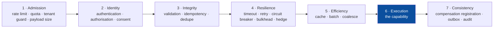
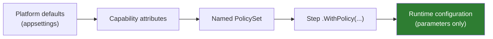
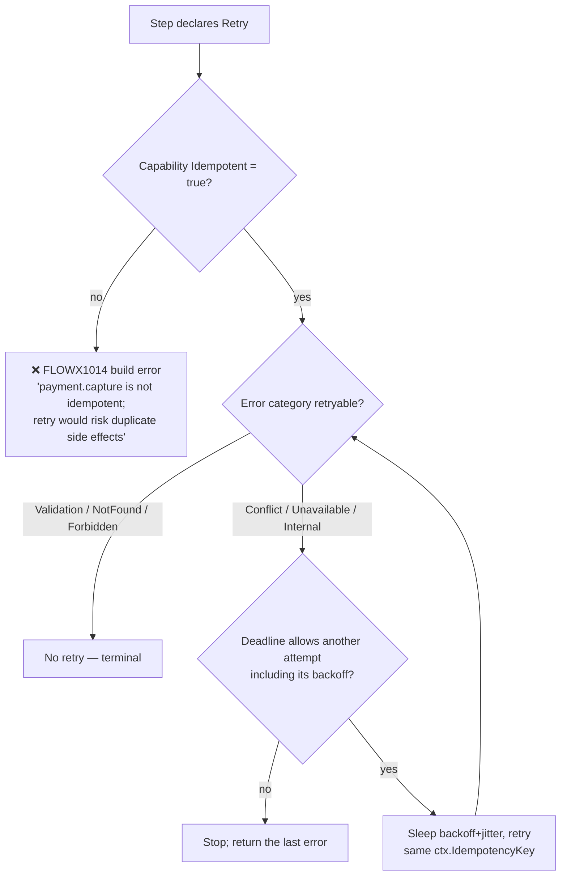
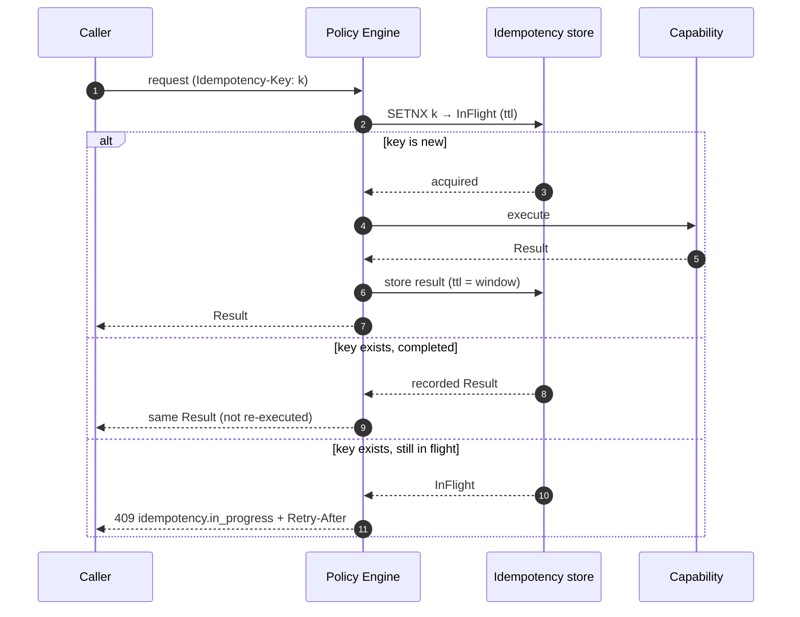

# 10 — Policy Framework

> **Status:** Accepted · **stages 1, 3 and 4 executed; two declarable kinds still inert** · **Audience:** application engineers, SRE
> **Answers:** how are cross-cutting concerns declared, ordered and made safe?

> [!IMPORTANT]
> **Stage 4 — `Resilience` — is applied at run time, and so is `CompensationRetry`
> at stage 7.** A declared `Timeout` is armed and clamped to what is left of the
> flow's deadline; a declared `Retry` makes the attempts it asked for, on the
> categories it named, with full-jitter backoff, and refuses an attempt whose
> backoff alone would outlive the deadline; a declared `CircuitBreaker` counts
> outcomes per capability, opens on its failure ratio and half-opens after its
> break duration; a declared `Bulkhead` bounds concurrency and refuses past its
> queue depth. `FlowEngine` reads `ExecutionPlan.HasStepPolicies` and then
> `StepNode.StepPolicy`, resolved when the plan was built.
> `PolicyExecutionTests` asserts each of them against a real engine running a
> real plan, and `samples/banking` settles a transfer whose screening provider
> fails once.
>
> **Stage 1 — `Admission` — and stage 3 — `Integrity` — are applied too, against
> a store the deployment shares.** A declared `RateLimit` takes a permit from a
> distributed token bucket before the step is dispatched, and refuses with
> `policy.rate_limited` when the budget is spent. A declared `Idempotency` window
> claims the key, replays a recorded result for a repeat, and refuses a
> concurrent presentation. Both sit outside the retry loop. Neither has an
> in-memory fallback: a step declaring one with no store registered is refused
> rather than run, because a limiter counting in a process admits n × the
> declared rate across n nodes
> ([ADR-0040](adr/ADR-0040-a-rate-limit-is-shared-or-it-is-not-a-rate-limit.md)).
> `IRateLimiterStore` and `IIdempotencyStore` are the seams; Redis and PostgreSQL
> back them, held to `RateLimiterConformance` and `IdempotencyStoreConformance`.
>
> **A flow that declares a `[Sensitive]` contract member may not declare an
> `Idempotency` window** — [`FLOWX1040`](diagnostics/FLOWX1040.md), an error.
> Stage 3 records the state bag through `JournalPayload`, whose only exit
> replaces every marked member with `[redacted]` at every depth, so replaying
> such a record would answer a later caller with the placeholder
> ([ADR-0042](adr/ADR-0042-a-recorded-result-is-replayed-only-when-recording-lost-nothing.md)).
>
> **Two declarable kinds are still executed by nothing:** `Cache` (stage 5) and
> `Audit` (stage 7). No cache is consulted and no audit record is written.
> [`FLOWX1032`](diagnostics/FLOWX1032.md) reports exactly those two.
> [ADR-0025](adr/ADR-0025-a-partial-policy-engine-executes-stage-four-alone.md)
> argues the remaining skips, and its §2.2 — a retry outside the stage-3 policy
> is safe because `FLOWX1014` refuses a retry over a capability that is not
> idempotent, and because every attempt presents the same `ctx.IdempotencyKey` —
> is what holds for every flow `FLOWX1040` refuses a window to.
>
> **Eight catalogue rows in §3 cannot be declared at all.** `PolicySet` offers
> nine builder methods, and there is no policy attribute anywhere in
> `FlowX.Abstractions` — the `[Timeout]`, `[CircuitBreaker]`, `[Audit]`,
> `[RateLimit]` and `[Idempotency]` attributes in §4 do not exist. So `Quota`,
> `Authorize`, `Consent`, `Validate`, `Hedge`, `Fallback`, `Batch` and `Outbox`
> are specification with no surface: no author can write one, and there is
> nothing for an engine to execute. §3 marks each of them.
>
> **The cut is a list of kinds, not a range of stages, and this document used to
> get that wrong in both directions.** `Audit` is a stage-7 `Consistency` policy —
> the same stage as `CompensationRetry`, which runs — so no line drawn by stage
> number separates what executes from what does not.
>
> Four rules report the ways a declared set reaches even less than the plan:
> [`FLOWX1033`](diagnostics/FLOWX1033.md) a `CompensationRetry` on a step with no
> compensation for it to wrap; [`FLOWX1034`](diagnostics/FLOWX1034.md) a second
> `.WithPolicy(...)` on one step, which *replaces* the first rather than adding
> to it; [`FLOWX1035`](diagnostics/FLOWX1035.md) a compensation retry of one
> attempt, which the manifest publishes as a retry and the engine dispatches
> once; and [`FLOWX1036`](diagnostics/FLOWX1036.md) a set the compiler cannot
> read at all — one in a referenced assembly or built at run time — which reaches
> no plan, no manifest and none of the rules above it.
>
> Read §2's stage order as the contract the engine is built to. Read §5, §6, §7
> and §11 as behaviour, with §6's composite `BreakerKey` excepted — the breaker is
> keyed by capability id and there is no syntax for the other three components.
> Read §8 as specification: it describes the one stage that does not run.

---

## 1. What a policy is

> A **policy** is a declarative, reusable rule applied around a step or a flow,
> composed at compile time and parameterised at run time.

Policies are the answer to "where does the retry go?" — a question that, in
hand-written pipelines, is answered differently in every service, and wrongly in
most.

---

## 2. Fixed stage order — the core decision



The order is **not configurable** ([ADR-0011](adr/ADR-0011-fixed-policy-stage-order.md)).

**Within a stage there is no `order` value, and this document claimed one for three
releases.** `PolicyDescriptor` carries `Kind`, `Stage` and `Parameters`, and no builder
method accepts a precedence. `PolicyChain` sorts by stage with a *stable* sort, so two
policies in one stage keep their declared order — which decides what the manifest publishes
and nothing else. What decides which of them wraps which is fixed by kind:
`Retry { CircuitBreaker { Bulkhead { Timeout { capability } } } }`, settled by
[ADR-0024](adr/ADR-0024-stage-four-is-a-fixed-nesting.md), which also says why an `order`
value is not merely missing but unwanted — three of the four possible nestings are the
incidents this section exists to make unexpressible.

### Why rigidity is the feature

Each of these is a real production incident, and each becomes unexpressible:

| Mistake | Consequence | Prevented because |
|---|---|---|
| Cache before authorisation | tenant A served tenant B's cached data | Identity (2) precedes Efficiency (5) |
| Retry outside idempotency | duplicate charges | Integrity (3) precedes Resilience (4) |
| Rate limit after authentication | unauthenticated flood exhausts the token validator | Admission (1) precedes Identity (2) |
| Timeout inside retry | 3 × 30 s inside a 10 s SLA | deadline is subtracted before each attempt |
| Compensation registered before the step succeeds | compensating something that never happened | Consistency (7) follows Execution (6) |
| Validation after the side effect | corrupt data written, then rejected | Integrity (3) precedes Execution (6) |

The escape hatch, when a legitimate counterexample appears: a capability may
declare a `PolicyStage.Custom` handler that runs *within* its own stage.
ADR-0011 is scheduled for review after three documented counterexamples.

---

## 3. The policy catalogue

Seventeen rows, and **only nine of them can be written down**: `PolicySet` has nine builder
methods and there is no policy attribute in `FlowX.Abstractions`. Seven of the nine execute.
The **Status** column says which is which — *executes*, *declared only* (an author can write it
and nothing applies it, which is [`FLOWX1032`](diagnostics/FLOWX1032.md)), or *undeclarable* (no
builder method, no attribute, no descriptor kind: specification with no surface).

| Policy | Stage | Status | Key parameters | Notes |
|---|---|---|---|---|
| `RateLimit` | 1 | **executes** | `permits`, `window`, `scope` (global/tenant/principal) | token bucket in a shared store, refilling continuously; refuses with `policy.rate_limited` carrying a `Retry-After`. Keyed by capability id and the declared scope, so two flows calling one dependency share the bound. A `key` scope is not expressible. Needs an `IRateLimiterStore`; a step declaring one without it is **refused**, never admitted ([ADR-0040](adr/ADR-0040-a-rate-limit-is-shared-or-it-is-not-a-rate-limit.md)) |
| `Quota` | 1 | *undeclarable* | `budget`, `period`, `scope` | long-window fairness across tenants |
| `Authorize` | 2 | *undeclarable* | derived from the capability's stance | deny-by-default; audited. The stance reaches the manifest and no boundary checks it |
| `Consent` | 2 | *undeclarable* | `purpose` | GDPR purpose-limitation checks |
| `Validate` | 3 | *undeclarable* | generated from contract annotations | field errors → RFC 7807 |
| `Idempotency` | 3 | **executes** | `window`, `scope` | records the flow's state bag as of the end of the step and replays it for a repeated key; refuses a concurrent presentation. Keyed by `ctx.IdempotencyKey` + capability id + scope ([ADR-0041](adr/ADR-0041-an-idempotency-record-is-keyed-by-the-invocations-key.md)). **Only a success is recorded** — a failed step frees its key. Needs an `IIdempotencyStore`, and is **refused at build time by [`FLOWX1040`](diagnostics/FLOWX1040.md)** on a flow declaring a `[Sensitive]` contract member |
| `Timeout` | 4 | **executes** | `duration` | armed per attempt, and clamped to what is left of the flow deadline — so §11's "a timeout longer than the deadline is a lie" is prevented rather than discouraged |
| `Retry` | 4 | **executes** | `attempts`, `backoff`, `jitter`, `retryOn` | **requires `Idempotent = true`** (`FLOWX1014`). `attempts` includes the first. Outermost of the four ([ADR-0024](adr/ADR-0024-stage-four-is-a-fixed-nesting.md)), which is what makes `FLOWX1019`'s `timeout × attempts` arithmetic true |
| `CircuitBreaker` | 4 | **executes** | `failureRatio`, `samplingWindow`, `breakDuration` | keyed by capability id, per process. `minimumThroughput` is **not a parameter** — `PolicySet.CircuitBreaker` has none — and is the constant `StepPolicy.DefaultMinimumThroughput`. §6's composite `BreakerKey` is undeclarable |
| `Bulkhead` | 4 | **executes** | `maxConcurrency`, `queueDepth` | isolates a slow dependency. One pool per capability, so two steps calling it share the bound. Past the queue depth a caller is refused rather than queued |
| `Hedge` | 4 | *undeclarable* | `afterDelay`, `maxAttempts` | tail-latency cutting; idempotent only |
| `Fallback` | 4 | *undeclarable* | capability or constant | explicit degraded mode |
| `Cache` | 5 | **declared only** | `ttl`, `scope` | tenant-scoped by default. Nothing is cached or consulted. `FLOWX1018` still refuses one on a capability with side effects. When it lands it meets [ADR-0042](adr/ADR-0042-a-recorded-result-is-replayed-only-when-recording-lost-nothing.md)'s question — a cache records a result too — and must not answer it differently |
| `Batch` | 5 | *undeclarable* | `size`, `window` | coalesces N invocations into one |
| `Audit` | 7 | **declared only** | `category`, `redact` | immutable audit record. **Stage 7 and still inert:** it wraps the *step*, so it stays on `StepNode.Policies`, which `StepPolicy.From` reads past. `FLOWX1032` reports it, and it is the reason the cut cannot be written as a range of stages — stage 1 and stage 3 run, stage 5 does not, and stage 7 does both |
| `Outbox` | 7 | *undeclarable* | — | implicit on `.Emit` in durable flows, and real — but it is the emit step's own commit rather than a policy anybody declares |
| `CompensationRetry` | 7 | **executes** | `attempts`, `backoff`, `retryOn` | wraps the step's *compensation*, so it requires the **compensating** capability to declare `Idempotent = true`. Defaults: 5 attempts (more aggressive than forward retry, [06 §7](06-Execution-Engine.md#7-compensation-semantics) rule 2), full jitter, `Conflict`/`Unavailable`/`Internal` |

---

## 4. Declaring policies

> [!WARNING]
> **Only one of the four ways below exists.** A policy reaches a step through
> `.WithPolicy(PolicySet)` and through nothing else. There is no `[Timeout]`,
> `[CircuitBreaker]`, `[Audit]`, `[RateLimit]` or `[Idempotency]` attribute in
> `FlowX.Abstractions`, no flow-level policy surface, and no runtime configuration that
> reaches a policy parameter — so the capability block, the flow block and the last box of
> the resolution diagram below are all specification. `samples/banking` declares its rate
> limit on the first *step* for exactly this reason, and says so in `Policies.cs`.

### On a capability (its own defaults, travel with it) — *specification*

```csharp
[Capability("payment.capture", Version = "2.1.0", Idempotent = true,
            Authorization = Authorization.Permission, Permission = "payment:capture")]
[Timeout("PT2S")]
[CircuitBreaker(FailureRatio = 0.5, SamplingWindow = "PT30S", BreakDuration = "PT15S")]
[Audit(Category = "financial", Redact = ["Method.Pan"])]
public sealed class CapturePayment : ICapability<CaptureRequest, Capture> { … }
```

### On a step (overrides and additions for this use)

```csharp
flow.Step<CapturePayment>()
    .WithPolicy(Policies.PaymentGateway);
```

### As a named, reusable set

```csharp
public static class Policies
{
    public static readonly PolicySet PaymentGateway = PolicySet.Named("payment-gateway")
        .Timeout("PT2S")
        .Retry(attempts: 3, backoff: Backoff.ExponentialJitter(baseDelay: "PT200MS"),
               retryOn: [ErrorCategory.Unavailable, ErrorCategory.Internal])
        .CircuitBreaker(failureRatio: 0.5, breakDuration: "PT15S")
        .Bulkhead(maxConcurrency: 64, queueDepth: 128);

    public static readonly PolicySet ExternalRead = PolicySet.Named("external-read")
        .Timeout("PT1S")
        .Retry(attempts: 2, backoff: Backoff.ExponentialJitter())
        .Cache(ttl: "PT60S", scope: CacheScope.Tenant)
        .Fallback(FallbackMode.LastKnownGood);
}
```

### On a flow (applies to every step unless overridden) — *specification*

```csharp
[Flow("order.place", Profile = ExecutionProfile.Durable)]
[FlowDeadline("PT30S")]
[RateLimit(Permits = 100, Window = "PT1S", Scope = RateLimitScope.Tenant)]
public sealed partial class PlaceOrderFlow : … { }
```

### Resolution order — *one of the five levels exists*



Later stages override earlier ones **for parameter values only**. Runtime
configuration can change a timeout from 2 s to 3 s; it can never add, remove or
reorder a policy. That would change the graph, which is forbidden (Manifesto,
"What we refuse").

**Today the fourth box is the whole chain.** Platform defaults, capability attributes and
runtime configuration have no surface at all, and a named `PolicySet` is not a resolution
level so much as the value the fourth box carries — a set is applied by
`.WithPolicy(...)` or it is applied nowhere. There is therefore nothing to override and no
precedence to get wrong, which is why no diagnostic reports one:
[`FLOWX1034`](diagnostics/FLOWX1034.md) reports the only composition that *is* expressible,
a second `.WithPolicy(...)` on one step, and it reports it because the second **replaces**
the first rather than merging with it.

---

## 5. Retry safety



Both branches of that tree are `StepPolicy.AllowsAnotherAttempt` and the deadline check
beside it in `FlowEngine`'s step loop, and both are asserted by `PolicyExecutionTests`.

Two guarantees worth stating explicitly:

- **A retry never uses a fresh idempotency key.** Attempt 2 presents the same key
  as attempt 1, which is what makes downstream deduplication work.
- **A retry never outlives the deadline.** The policy engine subtracts elapsed
  time plus the planned backoff before arming the next attempt. For a
  compensation this bounds the *retries* and not the undo itself: a flow that
  failed because it ran out of budget is exactly the flow whose effects most need
  reversing, so the first attempt always runs and only the waits are refused.

Default backoff is exponential with **full jitter**
(`delay = random(0, base × 2^attempt)`, capped) — decorrelated retries prevent
the synchronised thundering herd that fixed backoff produces.

---

## 6. Circuit breaker scope

A breaker keyed only by capability is too coarse: one bad downstream tenant or
region trips the breaker for everyone.

```csharp
[CircuitBreaker(FailureRatio = 0.5, Key = BreakerKey.Capability | BreakerKey.Downstream)]
```

> [!IMPORTANT]
> **The composite key is specification; the breaker is keyed by capability id alone.**
> There is no `CircuitBreakerAttribute` and `PolicySet.CircuitBreaker` takes no key, so
> `Downstream`, `Tenant` and `Partition` have nothing to read — the table below describes
> the key this section argues *for*, and `Capability` is the row it marks "always included"
> and the only one built. The breaker is also per process rather than per deployment:
> sharing one would need a store, which is a plugin contract and a separate decision
> ([ADR-0009](adr/ADR-0009-plugin-contracts.md)). The conservative direction — every node
> discovers an outage for itself.

| Key component | Effect |
|---|---|
| `Capability` | per capability id (always included) |
| `Downstream` | per declared side-effect target |
| `Tenant` | per tenant — prevents one tenant tripping everyone |
| `Partition` | per stream partition |

State transitions are specified to export as `flowx_circuit_state{capability,key}` and to
appear live in Studio's topology view. **Neither exists**: FlowX ships no metrics
infrastructure, which is why `ICompensationAlertSink` is a seam rather than a counter, and
§9's whole table is in the same position.

---

## 7. Idempotency policy

> [!IMPORTANT]
> **The sequence below runs, and two things about the code block under it do not.**
> There is no `[Idempotency]` attribute — the window is declared through
> `PolicySet.Idempotency(window, scope)` and `.WithPolicy(...)`, like every other policy —
> and there is no `Store = "…"` parameter: which store is a registration
> (`AddFlowXRedisPolicyStores`, `AddFlowXPostgresPolicyStores`), not a declaration, because
> a flow that named its own store would be a flow whose graph changed with its deployment.
>
> **The key is `ctx.IdempotencyKey`, narrowed by the capability id and the declared scope**
> ([ADR-0041](adr/ADR-0041-an-idempotency-record-is-keyed-by-the-invocations-key.md)). Not a
> second identity: the one that already existed, is stable across a flow and across every
> attempt of a retried step, and reaches the capability. The capability id is what keeps two
> policed steps of one flow from replaying each other's result.
>
> **Only a success is recorded.** A step that failed frees its key, so the next caller runs
> it — §8's "negative caching: off" one stage earlier and sharper, because a recorded failure
> would be replayed for the whole declared window and the caller's only remedy is to present
> the key again.
>
> **A flow declaring a `[Sensitive]` contract member may not declare a window at all**, and
> that is [`FLOWX1040`](diagnostics/FLOWX1040.md). See the note after the diagram.

```csharp
// Specification: there is no attribute, and no policy names its own store.
[Idempotency(Window = "PT24H", Scope = IdempotencyScope.Tenant, Store = "redis")]

// Real:
public static readonly PolicySet Admission = PolicySet.Named("admission")
    .Idempotency(window: TimeSpan.FromHours(24), scope: IdempotencyScope.Tenant);
```



The in-flight state matters: without it, two concurrent requests with the same
key both execute. This is the most common bug in hand-rolled idempotency, and it is the
assertion `IdempotencyStoreConformance.ConcurrentCallersOfOneKeyProduceExactlyOneClaim` exists
to make — a store whose `BeginAsync` is a read followed by a write passes every sequential test
in that file and fails that one, under exactly the concurrency the policy is declared for.

### What a replay may not do

> [!WARNING]
> **A replayed result must be the result, or there must be no replay.** Everything a flow records
> goes through `JournalPayload`, whose only exit replaces every member named in the flow's
> `SensitiveMembers` with `[redacted]` — matched case-insensitively, at every depth. On a flow
> that marks any member of its input or output contract the recorded state bag is therefore not
> what the step produced, and replaying it hands a later step the placeholder as if somebody had
> computed it. Two mechanisms refuse that: [`FLOWX1040`](diagnostics/FLOWX1040.md) refuses the
> declaration at build time, and `JournalPayload.TryToReplayableJson` refuses the recording at
> run time — a strictly narrower exit than `ToJson` that yields nothing when the pass had to
> replace something. The rule is silent on a set the compiler cannot read
> ([`FLOWX1036`](diagnostics/FLOWX1036.md)), which is why both exist.
> [ADR-0042](adr/ADR-0042-a-recorded-result-is-replayed-only-when-recording-lost-nothing.md)
> decides it, including why the durable resume path — which does restore a redacted bag — is not
> a precedent.

## 8. Cache safety — *specification*

> [!NOTE]
> **No cache is consulted.** Stage 5 is not implemented, so every defaulting decision below
> is a decision about a cache that does not exist. The one half that is enforced is the last
> line: `FLOWX1018` refuses a `Cache` on a capability with side effects, at build time,
> whether or not anything would have cached it.

Caching is the most dangerous policy in a multi-tenant system, so its defaults
are conservative:

| Default | Value | Rationale |
|---|---|---|
| Scope | `Tenant` | cross-tenant leakage is unacceptable by default |
| Key | capability id + input hash + tenant + **principal permission set** | prevents privilege-based leakage |
| Applies to | capabilities with **no** declared side effects | caching a write is a bug |
| Stampede protection | single-flight per key | prevents cache-miss herds |
| Negative caching | off | stale failures are worse than a retry |

Declaring `Cache` on a capability with side effects is `FLOWX1018` (error).

---

## 9. Observing policies — *six of seven metrics emit*

> [!NOTE]
> **The six rows whose policy executes are emitted; the one whose policy does not is not named
> at all.** A breaker opening, a retry attempting, a bulkhead refusing, a timeout firing, a
> caller refused by a rate limit and a step answered from an idempotency record each produce a
> measurement. The last two arrived with stage 1 and stage 3, which is
> [ADR-0026](adr/ADR-0026-policy-metrics-name-only-what-executes.md)'s own revisit condition
> firing: that record left them unnamed because "a rate-limit rejection counter describes a
> decision no code makes", and code now makes it. The cache pair still describes a stage
> [ADR-0025](adr/ADR-0025-a-partial-policy-engine-executes-stage-four-alone.md) skips, and an
> instrument that exists and is never written to publishes an empty series that reads as a
> healthy one. **The span-event half of this section is still unbuilt.**

Every policy is specified to emit telemetry with a uniform schema, so that resilience never
has to be instrumented by hand:

| Metric | Type | Labels | Emitted |
|---|---|---|---|
| `flowx_policy_invocations_total` | counter | `policy`, `stage`, `capability`, `outcome` | **yes** — on refusal *and* on clean application, so a refusal rate has a denominator |
| `flowx_retry_attempts_total` | counter | `capability`, `attempt`, `error_code` | **yes** — attempts beyond the first only; the first dispatch is not a retry |
| `flowx_circuit_state` | gauge (0/1/2) | `capability`, `key` | **yes** — recorded on transition, not per scrape. `key` equals `capability` until §6's composite key is expressible |
| `flowx_ratelimit_rejected_total` | counter | `scope`, `tenant` | **yes** — refusals only, because `flowx_policy_invocations_total` already carries the admissions as their denominator. `scope` is the declared `RateLimitScope` by name, which is the decision that had not been made when this row was written |
| `flowx_cache_hits_total` / `_misses_total` | counter | `capability`, `scope` | no — stage 5 is not executed |
| `flowx_bulkhead_queue_depth` | gauge | `capability` | **yes** — on the queueing path only, so an uncontended pool publishes nothing rather than a flat zero |
| `flowx_idempotency_replays_total` | counter | `capability`, `scope` | **yes** — on the replay only. A first presentation of a key is not a replay, and an in-flight refusal is not one either: nothing was returned, so it is counted by `flowx_policy_invocations_total`'s `rejected` outcome |

Policy decisions are *specified* to appear as span events on the step span too, so that a
trace shows *why* a call took 3.2 s: two retries with 400 ms and 900 ms of backoff. **No span
event is emitted.** The metrics above are the alert; the span events would be the diagnosis,
and only the first half is built — see
[ADR-0026 §1.3](adr/ADR-0026-policy-metrics-name-only-what-executes.md).

---

## 10. Testing policies

```csharp
[Fact]
public async Task PaymentGateway_policy_opens_breaker_after_sustained_failures()
{
    var host = FlowTestHost.For<PlaceOrderFlow>()
        .Substitute<CapturePayment>(_ => Result.Fail<Capture>(PaymentErrors.GatewayUnavailable()))
        .WithVirtualTime()                      // no real sleeping in tests
        .Build();

    for (var i = 0; i < 20; i++) await host.RunAsync(AnOrder());

    host.Policy<CircuitBreaker>("payment.capture").State.Should().Be(CircuitState.Open);
    host.Metrics.Counter("flowx_retry_attempts_total").Should().BeGreaterThan(0);
}
```

`WithVirtualTime()` makes backoff, timeout and breaker windows deterministic and
instant. Resilience tests that sleep in real time are why nobody writes
resilience tests; FlowX removes the excuse.

> **`FlowTestHost` now exists and the block above is still not runnable.** It runs a
> flow with capabilities substituted — see [23 §4](23-Testing-Strategy.md#4-flowtesthost-in-detail)
> for the shape, which is `For(plan, dispatcher)` and substitution by capability id, not
> `For<TFlow>()`. What it does not have is `WithVirtualTime()`, `host.Policy<T>(…)` or
> `host.Metrics`. **One of the three arguments for that has now expired and two have not.**
> There *is* a breaker to open, so `host.Policy<CircuitBreaker>(…)` is buildable and simply
> is not built; there is still no retry counter to read, because §9 emits nothing; and
> `WithVirtualTime()` is the one that was always available — `IClock` is injected, and
> `PolicyExecutionTests` proves a breaker's thirty-second break duration on a fake clock
> without sleeping. What a test can do today is assert what the engine *did*: how many times
> a capability was dispatched, and which error a refusal produced.
> `samples/banking`'s `ExecuteTransferFlowTests` and `PolicyExecutionTests` are both written
> that way.

---

## 11. Anti-patterns

| Anti-pattern | Why | Instead |
|---|---|---|
| Retry on `Validation` errors | the input will never become valid | restrict `retryOn` |
| Timeout longer than the flow deadline | the step is killed by the deadline anyway; the timeout is a lie | keep step timeouts well under the flow budget |
| Retry without a breaker | retries amplify an outage into a self-DDoS | always pair them |
| Cache on a capability with side effects | silent data corruption | `FLOWX1018` blocks it |
| Rate limiting only globally | one tenant starves the rest | `RateLimitScope.Tenant`, which is the default, or `Principal` |
| Policies defined inline per step | drift across the codebase | named `PolicySet` constants |

---

**Next:** [11 — Distributed Runtime](11-Distributed-Runtime.md)
