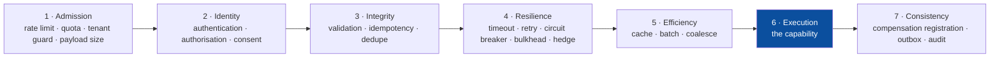
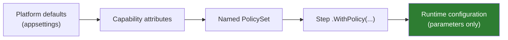
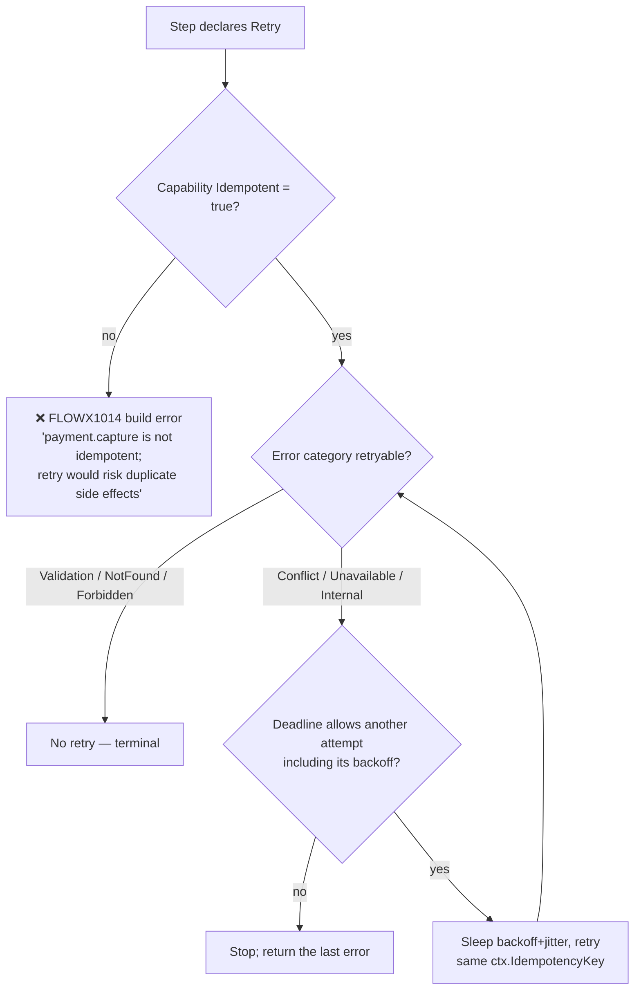
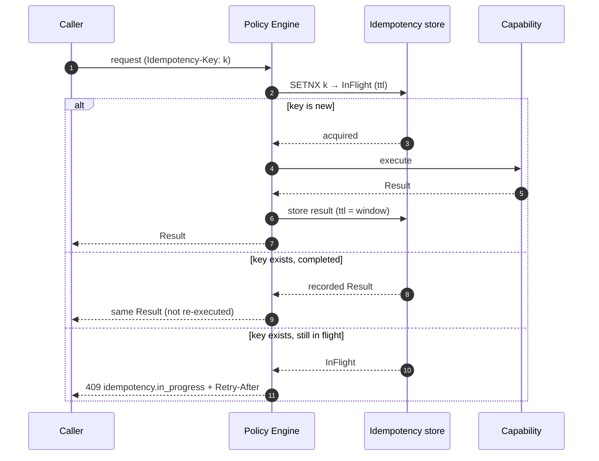

# 10 — Policy Framework

> **Status:** Accepted · **stages 4, 5 and 7 executed; two declarable kinds still inert** · **Audience:** application engineers, SRE
> **Answers:** how are cross-cutting concerns declared, ordered and made safe?

> [!IMPORTANT]
> **Stage 4 — `Resilience` — is applied at run time, and so is `CompensationRetry`
> at stage 7.** A declared `Timeout` is armed and clamped to what is left of the
> flow's deadline; a declared `Retry` makes the attempts it asked for, on the
> categories it named, with full-jitter backoff, and refuses an attempt whose
> backoff alone would outlive the deadline; a declared `CircuitBreaker` counts
> outcomes per capability, opens on its failure ratio and half-opens after its
> break duration; a declared `Bulkhead` bounds concurrency and refuses past its
> queue depth. `FlowEngine` reads `ExecutionPlan.HasStepPolicies` and then
> `StepNode.StepPolicy`, resolved when the plan was built.
> `PolicyExecutionTests` asserts each of them against a real engine running a
> real plan, and `samples/banking` settles a transfer whose screening provider
> fails once.
>
> **Stage 5 — `Cache` — and stage 7's `Audit` now execute too.** A declared cache is consulted
> before the dispatch and holds what the step produced, keyed on the capability, its version,
> the tenant, the principal's permission set under `CacheScope.Principal`, and the input
> document; a declared audit produces an immutable record naming the step, the principal that
> authorised it, the stance it was decided against, and a redacted request/result payload.
> `IResultCache` and `IAuditSink` are plugin contracts —
> [ADR-0036](adr/ADR-0036-a-cache-is-a-plugin-store-keyed-by-the-redacted-input.md) and
> [ADR-0035](adr/ADR-0035-an-audit-record-is-the-journals-payload-redacted-twice.md).
> `CachePolicyTests` and `AuditPolicyTests` assert each against a real engine, and
> `samples/banking` settles a transfer that leaves three financial audit records behind.
>
> **Two declarable kinds are still executed by nothing:** `RateLimit` (stage 1) and
> `Idempotency` (stage 3). No rate is counted and no recorded result is replayed for a
> repeated key.
> [`FLOWX1032`](diagnostics/FLOWX1032.md) reports exactly those two, narrowed
> from the eight it reported when it was written and the four it reported after the policy
> engine landed.
> [ADR-0025](adr/ADR-0025-a-partial-policy-engine-executes-stage-four-alone.md)
> argued each of the four skips separately, including the one that looks like a
> violation of [ADR-0011](adr/ADR-0011-fixed-policy-stage-order.md): running a
> retry without the stage-3 policy is safe because `FLOWX1014` refuses a retry
> over a capability that is not idempotent, and because every attempt presents
> the same `ctx.IdempotencyKey`. Two of its four subsections are now history and are marked as
> such rather than deleted.
>
> **Eight catalogue rows in §3 cannot be declared at all.** `PolicySet` offers
> nine builder methods, and there is no policy attribute anywhere in
> `FlowX.Abstractions` — the `[Timeout]`, `[CircuitBreaker]`, `[Audit]`,
> `[RateLimit]` and `[Idempotency]` attributes in §4 do not exist. So `Quota`,
> `Authorize`, `Consent`, `Validate`, `Hedge`, `Fallback`, `Batch` and `Outbox`
> are specification with no surface: no author can write one, and there is
> nothing for an engine to execute. §3 marks each of them.
>
> **The cut is a list of kinds, not a range of stages, and this document has now got that
> wrong in both available directions.** It once implied the line was "stages 1–6", which
> `Audit` falsified by being a stage-7 policy that did not run beside a stage-7 policy that
> did. The opposite reading is available now: `Cache` at stage 5 and `Audit` at stage 7 both
> execute while `Idempotency` at stage 3 does not. No line drawn by stage number has ever
> separated what executes from what does not.
>
> Four rules report the ways a declared set reaches even less than the plan:
> [`FLOWX1033`](diagnostics/FLOWX1033.md) a `CompensationRetry` on a step with no
> compensation for it to wrap; [`FLOWX1034`](diagnostics/FLOWX1034.md) a second
> `.WithPolicy(...)` on one step, which *replaces* the first rather than adding
> to it; [`FLOWX1035`](diagnostics/FLOWX1035.md) a compensation retry of one
> attempt, which the manifest publishes as a retry and the engine dispatches
> once; and [`FLOWX1036`](diagnostics/FLOWX1036.md) a set the compiler cannot
> read at all — one in a referenced assembly or built at run time — which reaches
> no plan, no manifest and none of the rules above it.
>
> Read §2's stage order as the contract the engine is built to. Read §5, §6, §8 and §11 as
> behaviour, with two exceptions: §6's composite `BreakerKey` — the breaker is keyed by
> capability id and there is no syntax for the other three components — and §8's stampede
> protection, which is not built. Read §7 as specification: it describes the one stage that
> does not run.

---

## 1. What a policy is

> A **policy** is a declarative, reusable rule applied around a step or a flow,
> composed at compile time and parameterised at run time.

Policies are the answer to "where does the retry go?" — a question that, in
hand-written pipelines, is answered differently in every service, and wrongly in
most.

---

## 2. Fixed stage order — the core decision



The order is **not configurable** ([ADR-0011](adr/ADR-0011-fixed-policy-stage-order.md)).

**Within a stage there is no `order` value, and this document claimed one for three
releases.** `PolicyDescriptor` carries `Kind`, `Stage` and `Parameters`, and no builder
method accepts a precedence. `PolicyChain` sorts by stage with a *stable* sort, so two
policies in one stage keep their declared order — which decides what the manifest publishes
and nothing else. What decides which of them wraps which is fixed by kind:
`Retry { CircuitBreaker { Bulkhead { Timeout { capability } } } }`, settled by
[ADR-0024](adr/ADR-0024-stage-four-is-a-fixed-nesting.md), which also says why an `order`
value is not merely missing but unwanted — three of the four possible nestings are the
incidents this section exists to make unexpressible.

### Why rigidity is the feature

Each of these is a real production incident, and each becomes unexpressible:

| Mistake | Consequence | Prevented because |
|---|---|---|
| Cache before authorisation | tenant A served tenant B's cached data | Identity (2) precedes Efficiency (5) |
| Retry outside idempotency | duplicate charges | Integrity (3) precedes Resilience (4) |
| Rate limit after authentication | unauthenticated flood exhausts the token validator | Admission (1) precedes Identity (2) |
| Timeout inside retry | 3 × 30 s inside a 10 s SLA | deadline is subtracted before each attempt |
| Compensation registered before the step succeeds | compensating something that never happened | Consistency (7) follows Execution (6) |
| Validation after the side effect | corrupt data written, then rejected | Integrity (3) precedes Execution (6) |

The escape hatch, when a legitimate counterexample appears: a capability may
declare a `PolicyStage.Custom` handler that runs *within* its own stage.
ADR-0011 is scheduled for review after three documented counterexamples.

---

## 3. The policy catalogue

Seventeen rows, and **only nine of them can be written down**: `PolicySet` has nine builder
methods and there is no policy attribute in `FlowX.Abstractions`. The **Status** column says
which is which — *executes*, *declared only* (an author can write it and nothing applies it,
which is [`FLOWX1032`](diagnostics/FLOWX1032.md)), or *undeclarable* (no builder method, no
attribute, no descriptor kind: specification with no surface).

| Policy | Stage | Status | Key parameters | Notes |
|---|---|---|---|---|
| `RateLimit` | 1 | **declared only** | `permits`, `window`, `scope` (global/tenant/principal/key) | token bucket; returns 429 + `Retry-After`. Nothing counts. Stage 1 is not implemented |
| `Quota` | 1 | *undeclarable* | `budget`, `period`, `scope` | long-window fairness across tenants |
| `Authorize` | 2 | *undeclarable* | derived from the capability's stance | deny-by-default; audited. The stance reaches the manifest and no boundary checks it |
| `Consent` | 2 | *undeclarable* | `purpose` | GDPR purpose-limitation checks |
| `Validate` | 3 | *undeclarable* | generated from contract annotations | field errors → RFC 7807 |
| `Idempotency` | 3 | **declared only** | `window`, `scope` | replays the recorded result. Nothing is recorded or replayed. `ctx.IdempotencyKey` is stable and reaches the capability, but that is the engine's identity plumbing rather than this policy |
| `Timeout` | 4 | **executes** | `duration` | armed per attempt, and clamped to what is left of the flow deadline — so §11's "a timeout longer than the deadline is a lie" is prevented rather than discouraged |
| `Retry` | 4 | **executes** | `attempts`, `backoff`, `jitter`, `retryOn` | **requires `Idempotent = true`** (`FLOWX1014`). `attempts` includes the first. Outermost of the four ([ADR-0024](adr/ADR-0024-stage-four-is-a-fixed-nesting.md)), which is what makes `FLOWX1019`'s `timeout × attempts` arithmetic true |
| `CircuitBreaker` | 4 | **executes** | `failureRatio`, `samplingWindow`, `breakDuration` | keyed by capability id, per process. `minimumThroughput` is **not a parameter** — `PolicySet.CircuitBreaker` has none — and is the constant `StepPolicy.DefaultMinimumThroughput`. §6's composite `BreakerKey` is undeclarable |
| `Bulkhead` | 4 | **executes** | `maxConcurrency`, `queueDepth` | isolates a slow dependency. One pool per capability, so two steps calling it share the bound. Past the queue depth a caller is refused rather than queued |
| `Hedge` | 4 | *undeclarable* | `afterDelay`, `maxAttempts` | tail-latency cutting; idempotent only |
| `Fallback` | 4 | *undeclarable* | capability or constant | explicit degraded mode |
| `Cache` | 5 | **executes** | `ttl`, `scope` | tenant-scoped by default. Keyed on capability id + version + tenant + (under `Principal`) the caller's permission set + the input document, hashed. `FLOWX1018` refuses one on a capability with side effects, and the engine relies on that rather than re-checking. **Single-flight is not built** ([ADR-0036](adr/ADR-0036-a-cache-is-a-plugin-store-keyed-by-the-redacted-input.md)) |
| `Batch` | 5 | *undeclarable* | `size`, `window` | coalesces N invocations into one |
| `Audit` | 7 | **executes** | `category`, `redact` | immutable audit record, written to `IAuditSink` after the step's commit. Carries the journal's own payload — a composed `request`/`result` document — so `redact` is a longer list of member names handed to the one redaction pass, and can only remove ([ADR-0035](adr/ADR-0035-an-audit-record-is-the-journals-payload-redacted-twice.md)). A **missing sink fails the step**, unlike every other seam on this path |
| `Outbox` | 7 | *undeclarable* | — | implicit on `.Emit` in durable flows, and real — but it is the emit step's own commit rather than a policy anybody declares |
| `CompensationRetry` | 7 | **executes** | `attempts`, `backoff`, `retryOn` | wraps the step's *compensation*, so it requires the **compensating** capability to declare `Idempotent = true`. Defaults: 5 attempts (more aggressive than forward retry, [06 §7](06-Execution-Engine.md#7-compensation-semantics) rule 2), full jitter, `Conflict`/`Unavailable`/`Internal` |

---

## 4. Declaring policies

> [!WARNING]
> **Only one of the four ways below exists.** A policy reaches a step through
> `.WithPolicy(PolicySet)` and through nothing else. There is no `[Timeout]`,
> `[CircuitBreaker]`, `[Audit]`, `[RateLimit]` or `[Idempotency]` attribute in
> `FlowX.Abstractions`, no flow-level policy surface, and no runtime configuration that
> reaches a policy parameter — so the capability block, the flow block and the last box of
> the resolution diagram below are all specification. `samples/banking` declares its rate
> limit on the first *step* for exactly this reason, and says so in `Policies.cs`.

### On a capability (its own defaults, travel with it) — *specification*

```csharp
[Capability("payment.capture", Version = "2.1.0", Idempotent = true,
            Authorization = Authorization.Permission, Permission = "payment:capture")]
[Timeout("PT2S")]
[CircuitBreaker(FailureRatio = 0.5, SamplingWindow = "PT30S", BreakDuration = "PT15S")]
[Audit(Category = "financial", Redact = ["Method.Pan"])]
public sealed class CapturePayment : ICapability<CaptureRequest, Capture> { … }
```

### On a step (overrides and additions for this use)

```csharp
flow.Step<CapturePayment>()
    .WithPolicy(Policies.PaymentGateway);
```

### As a named, reusable set

```csharp
public static class Policies
{
    public static readonly PolicySet PaymentGateway = PolicySet.Named("payment-gateway")
        .Timeout("PT2S")
        .Retry(attempts: 3, backoff: Backoff.ExponentialJitter(baseDelay: "PT200MS"),
               retryOn: [ErrorCategory.Unavailable, ErrorCategory.Internal])
        .CircuitBreaker(failureRatio: 0.5, breakDuration: "PT15S")
        .Bulkhead(maxConcurrency: 64, queueDepth: 128);

    public static readonly PolicySet ExternalRead = PolicySet.Named("external-read")
        .Timeout("PT1S")
        .Retry(attempts: 2, backoff: Backoff.ExponentialJitter())
        .Cache(ttl: "PT60S", scope: CacheScope.Tenant)
        .Fallback(FallbackMode.LastKnownGood);
}
```

### On a flow (applies to every step unless overridden) — *specification*

```csharp
[Flow("order.place", Profile = ExecutionProfile.Durable)]
[FlowDeadline("PT30S")]
[RateLimit(Permits = 100, Window = "PT1S", Scope = RateLimitScope.Tenant)]
public sealed partial class PlaceOrderFlow : … { }
```

### Resolution order — *one of the five levels exists*



Later stages override earlier ones **for parameter values only**. Runtime
configuration can change a timeout from 2 s to 3 s; it can never add, remove or
reorder a policy. That would change the graph, which is forbidden (Manifesto,
"What we refuse").

**Today the fourth box is the whole chain.** Platform defaults, capability attributes and
runtime configuration have no surface at all, and a named `PolicySet` is not a resolution
level so much as the value the fourth box carries — a set is applied by
`.WithPolicy(...)` or it is applied nowhere. There is therefore nothing to override and no
precedence to get wrong, which is why no diagnostic reports one:
[`FLOWX1034`](diagnostics/FLOWX1034.md) reports the only composition that *is* expressible,
a second `.WithPolicy(...)` on one step, and it reports it because the second **replaces**
the first rather than merging with it.

---

## 5. Retry safety



Both branches of that tree are `StepPolicy.AllowsAnotherAttempt` and the deadline check
beside it in `FlowEngine`'s step loop, and both are asserted by `PolicyExecutionTests`.

Two guarantees worth stating explicitly:

- **A retry never uses a fresh idempotency key.** Attempt 2 presents the same key
  as attempt 1, which is what makes downstream deduplication work.
- **A retry never outlives the deadline.** The policy engine subtracts elapsed
  time plus the planned backoff before arming the next attempt. For a
  compensation this bounds the *retries* and not the undo itself: a flow that
  failed because it ran out of budget is exactly the flow whose effects most need
  reversing, so the first attempt always runs and only the waits are refused.

Default backoff is exponential with **full jitter**
(`delay = random(0, base × 2^attempt)`, capped) — decorrelated retries prevent
the synchronised thundering herd that fixed backoff produces.

---

## 6. Circuit breaker scope

A breaker keyed only by capability is too coarse: one bad downstream tenant or
region trips the breaker for everyone.

```csharp
[CircuitBreaker(FailureRatio = 0.5, Key = BreakerKey.Capability | BreakerKey.Downstream)]
```

> [!IMPORTANT]
> **The composite key is specification; the breaker is keyed by capability id alone.**
> There is no `CircuitBreakerAttribute` and `PolicySet.CircuitBreaker` takes no key, so
> `Downstream`, `Tenant` and `Partition` have nothing to read — the table below describes
> the key this section argues *for*, and `Capability` is the row it marks "always included"
> and the only one built. The breaker is also per process rather than per deployment:
> sharing one would need a store, which is a plugin contract and a separate decision
> ([ADR-0009](adr/ADR-0009-plugin-contracts.md)). The conservative direction — every node
> discovers an outage for itself.

| Key component | Effect |
|---|---|
| `Capability` | per capability id (always included) |
| `Downstream` | per declared side-effect target |
| `Tenant` | per tenant — prevents one tenant tripping everyone |
| `Partition` | per stream partition |

State transitions are specified to export as `flowx_circuit_state{capability,key}` and to
appear live in Studio's topology view. **Neither exists**: FlowX ships no metrics
infrastructure, which is why `ICompensationAlertSink` is a seam rather than a counter, and
§9's whole table is in the same position.

---

## 7. Idempotency policy — *specification*

> [!NOTE]
> **Nothing below runs.** The `[Idempotency]` attribute does not exist, no store is
> consulted, and no recorded result is replayed. The sequence diagram is what stage 3 will
> do; [`FLOWX1032`](diagnostics/FLOWX1032.md) reports every `.Idempotency(...)` an author
> declares. What *is* real is the key itself: `ctx.IdempotencyKey` is stable across a flow
> and across every attempt of a retried step, which is the engine's identity plumbing and
> the mechanism [ADR-0025](adr/ADR-0025-a-partial-policy-engine-executes-stage-four-alone.md)
> §2.2 leans on.

```csharp
[Idempotency(Window = "PT24H", Scope = IdempotencyScope.Tenant, Store = "redis")]
```



The in-flight state matters: without it, two concurrent requests with the same
key both execute. This is the most common bug in hand-rolled idempotency.

---

## 8. Cache safety — *four of five defaults are behaviour*

> [!IMPORTANT]
> **A cache is consulted.** Stage 5 executes
> ([ADR-0036](adr/ADR-0036-a-cache-is-a-plugin-store-keyed-by-the-redacted-input.md)), through
> the `IResultCache` plugin contract, which `plugins/FlowX.Redis` and `plugins/FlowX.Postgres`
> both implement and `ResultCacheConformance` holds both to. **The one row below that is still
> specification is stampede protection**, and it is marked.
>
> **A cache runs outside the dispatch and inside stage 4**, which is the insertion point
> [ADR-0025 §2.5](adr/ADR-0025-a-partial-policy-engine-executes-stage-four-alone.md) named
> before there was anything to insert. The full nesting is
> `Retry { CircuitBreaker { Bulkhead { Timeout { Cache { capability } } } } }` — so a store
> round trip is inside the budget the author wrote for the step, a hit counts as a call the
> breaker saw succeed, and a caller the bulkhead refused never reaches the store.
>
> **Every failure degrades to a dispatch.** A store that is down, a key that cannot be built and
> an entry that cannot be read back all mean the capability is called, which is what the step
> did before anything cached it. A cache outage costs latency and never correctness.

Caching is the most dangerous policy in a multi-tenant system, so its defaults
are conservative:

| Default | Value | Built? | Rationale |
|---|---|---|---|
| Scope | `Tenant` | **yes** | cross-tenant leakage is unacceptable by default |
| Key | capability id + **version** + input document + tenant + **principal permission set** | **yes** — SHA-256 over the components, U+001F-separated; the permission set only under `CacheScope.Principal` | prevents privilege-based leakage. The version is included because a capability that changed its answer for one input is a different capability to a cache |
| Applies to | capabilities with **no** declared side effects | **yes** — `FLOWX1018`, at build time, and relied on rather than re-checked at run time | caching a write is a bug |
| Stampede protection | single-flight per key | **no** — *n* concurrent misses are *n* dispatches | prevents cache-miss herds |
| Negative caching | off | **yes** — only a success is held | stale failures are worse than a retry |

Declaring `Cache` on a capability with side effects is `FLOWX1018` (error).

### A `[Sensitive]` member cannot reach a cache, and cannot come back out of one

What the engine hands a store is what `JournalPayload.ToJson` produced — the same document the
journal would have written, through the same single exit, with every `[Sensitive]` member
replaced by `[redacted]`. That is correct for a journal row and unusable for a cache, twice
over, so the engine refuses both halves:

- **A key document carrying the placeholder is not hashed**, because two callers whose inputs
  differ only in a marked member would key identically — and the second would be served the
  first one's result. The step is dispatched instead.
- **An entry document carrying it is not stored**, because a hit would restore `[redacted]`
  where a capability's answer should be, and every step after it would bind to a value nothing
  produced.

The consequence is worth stating plainly: **a step whose input or output contract carries a
member the flow marks `[Sensitive]` is never cached**, silently. ADR-0036 records why the
obvious build-time rule is not sound as stated, and a warning that *is* sound is outstanding.

---

<!-- The heading's count changed when stage 5 landed; this keeps the old anchor resolving,
     because accepted records link to it and an accepted record is not edited. -->
<a id="9-observing-policies--four-of-seven-metrics-emit"></a>

## 9. Observing policies — *six of seven metrics emit*

> [!NOTE]
> **The rows whose policy executes are emitted; the two whose policy does not are not named at
> all.** A breaker opening, a retry attempting, a bulkhead refusing, a timeout firing and a
> cache answering each produce a measurement — the cache pair joined them when stage 5 landed,
> which is exactly the condition
> [ADR-0026](adr/ADR-0026-policy-metrics-name-only-what-executes.md) set for it. The two that
> remain describe stages
> [ADR-0025](adr/ADR-0025-a-partial-policy-engine-executes-stage-four-alone.md) still skips, and
> an instrument that exists and is never written to publishes an empty series that reads as a
> healthy one. `Audit` gains no row of its own — this table never gave it one — and reaches
> `flowx_policy_invocations_total` like every other policy that applies, which is also what
> stopped that counter's `stage` label being constant. **The span-event half of this section is
> still unbuilt.**

Every policy is specified to emit telemetry with a uniform schema, so that resilience never
has to be instrumented by hand:

| Metric | Type | Labels | Emitted |
|---|---|---|---|
| `flowx_policy_invocations_total` | counter | `policy`, `stage`, `capability`, `outcome` | **yes** — on refusal *and* on clean application, so a refusal rate has a denominator. `stage` is no longer constant: `Cache` reports `Efficiency` and `Audit` reports `Consistency` |
| `flowx_retry_attempts_total` | counter | `capability`, `attempt`, `error_code` | **yes** — attempts beyond the first only; the first dispatch is not a retry |
| `flowx_circuit_state` | gauge (0/1/2) | `capability`, `key` | **yes** — recorded on transition, not per scrape. `key` equals `capability` until §6's composite key is expressible |
| `flowx_ratelimit_rejected_total` | counter | `scope`, `tenant` | no — stage 1 is not executed, and `scope` presupposes a decision nobody has made |
| `flowx_cache_hits_total` / `_misses_total` | counter | `capability`, `scope` | **yes** — both, so a hit *rate* has a denominator. `scope` is the declared `CacheScope` by name, never the resolved tenant or principal |
| `flowx_bulkhead_queue_depth` | gauge | `capability` | **yes** — on the queueing path only, so an uncontended pool publishes nothing rather than a flat zero |
| `flowx_idempotency_replays_total` | counter | `capability`, `scope` | no — stage 3 is not executed |

Policy decisions are *specified* to appear as span events on the step span too, so that a
trace shows *why* a call took 3.2 s: two retries with 400 ms and 900 ms of backoff. **No span
event is emitted.** The metrics above are the alert; the span events would be the diagnosis,
and only the first half is built — see
[ADR-0026 §1.3](adr/ADR-0026-policy-metrics-name-only-what-executes.md).

---

## 10. Testing policies

```csharp
[Fact]
public async Task PaymentGateway_policy_opens_breaker_after_sustained_failures()
{
    var host = FlowTestHost.For<PlaceOrderFlow>()
        .Substitute<CapturePayment>(_ => Result.Fail<Capture>(PaymentErrors.GatewayUnavailable()))
        .WithVirtualTime()                      // no real sleeping in tests
        .Build();

    for (var i = 0; i < 20; i++) await host.RunAsync(AnOrder());

    host.Policy<CircuitBreaker>("payment.capture").State.Should().Be(CircuitState.Open);
    host.Metrics.Counter("flowx_retry_attempts_total").Should().BeGreaterThan(0);
}
```

`WithVirtualTime()` makes backoff, timeout and breaker windows deterministic and
instant. Resilience tests that sleep in real time are why nobody writes
resilience tests; FlowX removes the excuse.

> **`FlowTestHost` now exists and the block above is still not runnable.** It runs a
> flow with capabilities substituted — see [23 §4](23-Testing-Strategy.md#4-flowtesthost-in-detail)
> for the shape, which is `For(plan, dispatcher)` and substitution by capability id, not
> `For<TFlow>()`. What it does not have is `WithVirtualTime()`, `host.Policy<T>(…)` or
> `host.Metrics`. **One of the three arguments for that has now expired and two have not.**
> There *is* a breaker to open, so `host.Policy<CircuitBreaker>(…)` is buildable and simply
> is not built; there is still no retry counter to read, because §9 emits nothing; and
> `WithVirtualTime()` is the one that was always available — `IClock` is injected, and
> `PolicyExecutionTests` proves a breaker's thirty-second break duration on a fake clock
> without sleeping. What a test can do today is assert what the engine *did*: how many times
> a capability was dispatched, and which error a refusal produced.
> `samples/banking`'s `ExecuteTransferFlowTests` and `PolicyExecutionTests` are both written
> that way.

---

## 11. Anti-patterns

| Anti-pattern | Why | Instead |
|---|---|---|
| Retry on `Validation` errors | the input will never become valid | restrict `retryOn` |
| Timeout longer than the flow deadline | the step is killed by the deadline anyway; the timeout is a lie | keep step timeouts well under the flow budget |
| Retry without a breaker | retries amplify an outage into a self-DDoS | always pair them |
| Cache on a capability with side effects | silent data corruption | `FLOWX1018` blocks it |
| Rate limiting only globally | one tenant starves the rest | `Scope = Tenant` |
| Policies defined inline per step | drift across the codebase | named `PolicySet` constants |

---

**Next:** [11 — Distributed Runtime](11-Distributed-Runtime.md)
