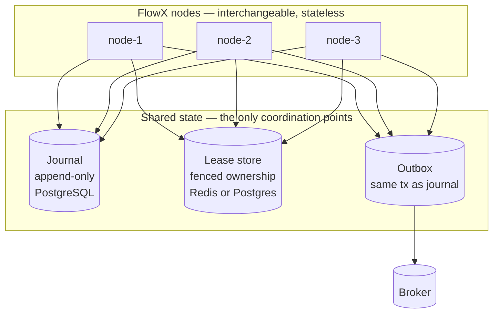
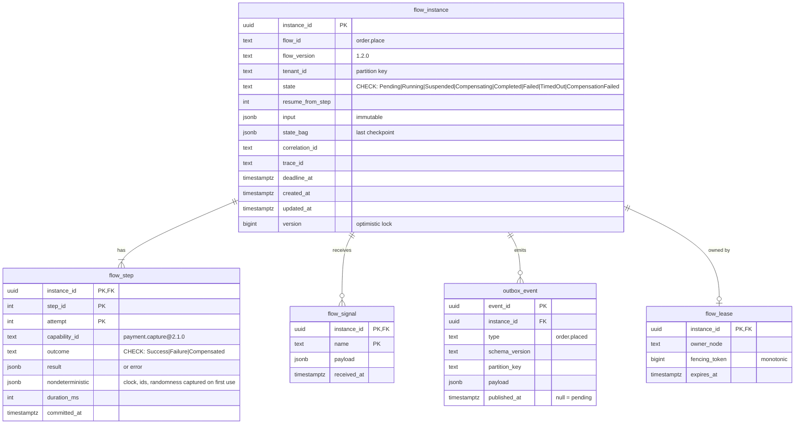
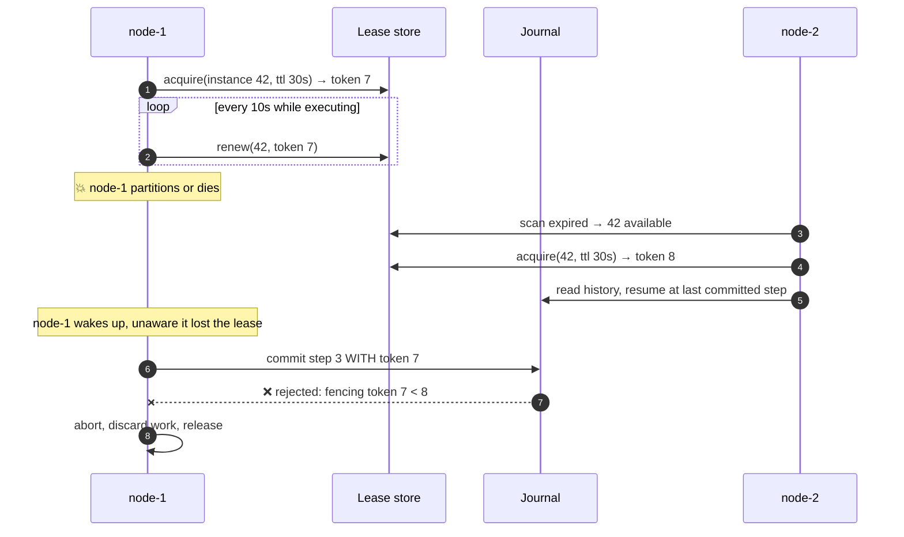
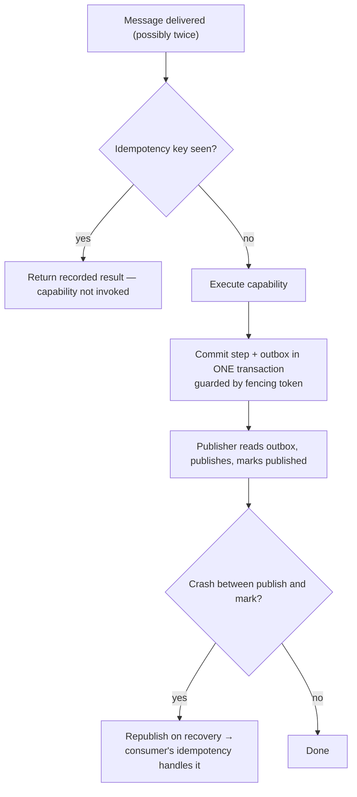
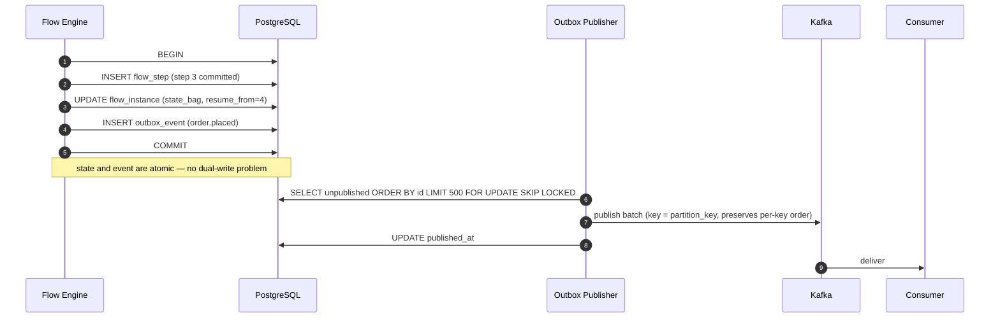
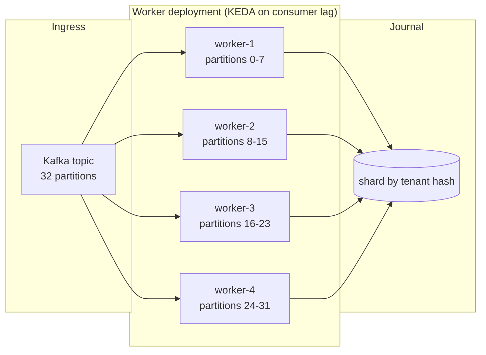
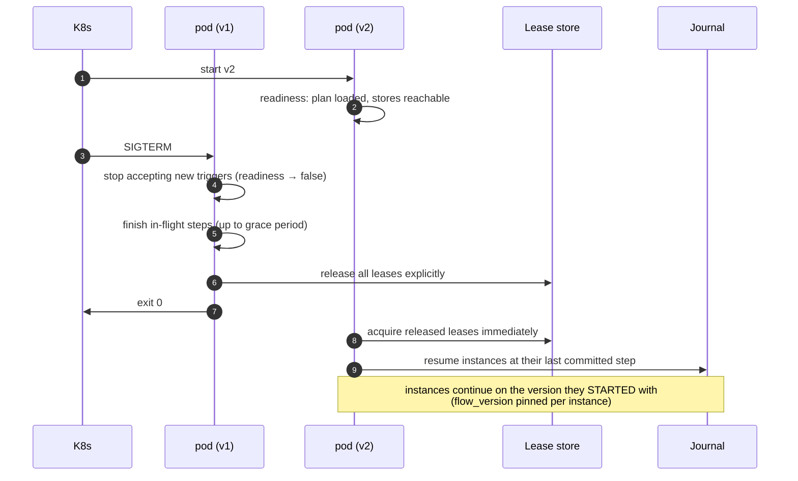

# 11 — Distributed Runtime

> **Status:** Accepted as a specification · **§2 partly built, the rest not** · **Audience:** runtime contributors, SRE
> **Answers:** how does durable execution stay correct across nodes, crashes and deployments?

> [!WARNING]
> **One section of this document has an implementation. The rest do not, and there
> is still no store.** This box is retired section by section as each lands, not
> wholesale — it said "nothing in this document is implemented", which was true
> until WP-52 (2026-07-31) and is no longer.
>
> | § | State |
> |---|---|
> | [1 · distribution model](#1-the-distribution-model) | **not built.** One node, no coordination |
> | [2 · the journal](#2-the-journal) | **partly built.** WP-51 declared `IFlowJournal`, `ILeaseStore` and `FencingToken` in `src/FlowX.Abstractions/Durability/`; WP-52 made `FlowX.Runtime` read `ExecutionProfile` and commit one row per step boundary, and resume by replaying committed rows into the same step loop. **The schema below is the drawn version and is superseded** by [ADR-0015](adr/ADR-0015-journal-schema-and-durable-execution.md): the key is `(instance_id, scope, step_id, attempt)`, `resume_from_step` is a hint the engine never reads, and a `SubFlow` child is its own instance row. **No store implements it** — the only `IFlowJournal` anywhere is an in-memory reference in `tests/FlowX.Conformance.Tests`, and none has run against a real database (WP-53, WP-54) |
> | [3 · leases and fencing](#3-leases-and-fencing) | **not built.** Every journal write is guarded by a fencing token and a stale token is rejected — but nothing *acquires* or renews a lease, and nothing scans for an abandoned instance. The token is passed into the engine by whoever starts the flow (WP-55) |
> | [4 · exactly-once](#4-exactly-once-honestly) | **not built**, and unchanged by WP-52: a process that dies after an effect and before its commit still re-executes the step |
> | [5 · the outbox](#5-the-transactional-outbox) | **not built.** `.Emit<T>()` publishes nothing ([`FLOWX1024`](diagnostics/FLOWX1024.md)) — WP-56 |
> | [6 · partitioning](#6-partitioning-and-scale) · [7 · deployment safety](#7-deployment-safety) · [8 · failure catalogue](#8-failure-catalogue) | **not built.** No second node, no migration, no scheduler |
>
> So: a `Durable` flow journals its step boundaries and can be resumed, and a
> process kill still loses the instance, because nothing on the other side finds it.
> A `Durable` flow started with no journal is now **refused** rather than run
> ephemerally (`flow.durability_not_configured`).
>
> This is the **P2** increment, and it is the second-riskiest thing in the plan
> for a reason: the guarantees below — exactly one writer, no duplicate
> non-idempotent effects, resume p99 ≤ 45 s — are the hard ones, and designing
> them before writing them is what this document is for. Its exit criterion is
> QR2 in
> [05 §10](05-Architecture.md#10-quality-requirements-stimulus--response--measure),
> and nothing measures it yet: B7, B8 and the chaos rig are WP-50, unstarted.
>
> Read the rest as the design a P2 implementer is held to. Outside §2, do not read
> any sentence here as describing behaviour you can observe today.

---

## 1. The distribution model

FlowX nodes are **identical and stateless**. Any node can execute any flow
instance. Coordination happens through two shared stores and nothing else.



There is no gossip protocol, no consensus ring, no cluster membership, no
placement service. Correctness rests on two well-understood primitives:
**an append-only log** and **fenced leases**. This is a deliberate rejection of
complexity that other runtimes take on — see
[ADR-0006](adr/ADR-0006-journal-and-leases.md).

---

## 2. The journal



| Property | Guarantee |
|---|---|
| Append-only | `flow_step` rows are never updated, only inserted — the history is the truth |
| Atomic commit | step result + state bag + outbox row are written in **one transaction** |
| Non-determinism capture | clock, ids and randomness are recorded on first use, replayed thereafter |
| Version pinning | the resolved capability version is recorded per step, so a mid-flight deployment cannot change semantics |
| Tenant partitioning | `tenant_id` is the partition key; per-tenant retention and residency become possible |

### Retention

| Data | Default retention | Configurable |
|---|---|---|
| Completed instance + steps | 30 days | yes, per flow |
| Failed / CompensationFailed | 180 days | yes |
| Suspended | until completion or deadline | no |
| Outbox (published) | 7 days | yes |

Archival to cold storage is a plugin (`IJournalArchiver`), because the retention
requirement is regulatory and differs per organisation.

---

## 3. Leases and fencing

A lease grants time-bounded exclusive ownership of one instance.



**Fencing tokens are what make this safe.** A monotonically increasing token is
issued at each acquisition and checked on every journal write. A zombie node that
wakes up after a network partition cannot corrupt the instance, no matter how
long it was gone. Lease expiry alone (without fencing) is a well-known
split-brain bug; FlowX does not rely on it.

| Parameter | Default | Trade-off |
|---|---|---|
| Lease TTL | 30 s | shorter = faster recovery, more renewal load |
| Renewal interval | TTL / 3 | safety margin for GC pauses and clock skew |
| Recovery scan | every 10 s | shorter = faster failover, more store load |
| Max lease extensions | unbounded while progressing | a stuck step is caught by the flow deadline, not by lease expiry |

---

## 4. Exactly-once, honestly

FlowX does not claim exactly-once delivery, because it does not exist. It
provides the composition that produces **effectively-once processing**:

```
at-least-once delivery  +  idempotent capabilities  +  fenced journal writes
                        =  effectively-once processing
```



The honest statement, which appears in the platform's own documentation and in
every incident review template:

> Effects that FlowX cannot make idempotent — an email already sent, a webhook
> already delivered, a payment captured by a gateway with no idempotency key —
> can occur twice. Declare `Idempotent = false` and FlowX will not retry them;
> that is the strongest guarantee that is truthful.

---

## 5. The transactional outbox



| Design point | Choice | Reason |
|---|---|---|
| Polling vs CDC | polling by default, CDC (Debezium) as a plugin | polling has no extra infrastructure; CDC scales further |
| Batch size | 500, tunable | balances latency and throughput |
| Locking | `FOR UPDATE SKIP LOCKED` | multiple publishers without contention |
| Ordering | per `partition_key` only | global ordering is not offered — it does not scale and is rarely needed |
| Publisher failure | at-least-once republish | consumers must be idempotent; this is stated in every event contract |

---

## 6. Partitioning and scale



| Dimension | Mechanism | Limit |
|---|---|---|
| Ingress throughput | broker partitions; workers scale to partition count | partition count |
| Flow concurrency | worker replicas × per-worker degree | journal write throughput |
| Journal throughput | group commit, batched writes, per-tenant sharding | ~20–50k step-commits/s per Postgres primary (measured, not assumed) |
| Ordering | per partition key | no global order |
| Suspended instances | rows only | storage, not compute |

When journal write throughput becomes the ceiling (risk R5), the levers in order
of preference are: (1) move flows that do not need durability to `Ephemeral`,
(2) increase group-commit batching, (3) shard the journal by tenant,
(4) partition the journal table by time.

---

## 7. Deployment safety



Rules that make rolling updates non-events:

1. `terminationGracePeriodSeconds` ≥ longest step budget + 10 s.
2. Leases are released explicitly on shutdown — recovery does not wait for TTL.
3. A durable instance keeps its pinned `flow_version` until it completes.
4. Schema changes to journal tables use expand/contract: add nullable, backfill,
   switch reads, drop later — never a breaking migration in one release.

---

## 8. Failure catalogue

| Failure | Detection | Response | Data loss |
|---|---|---|---|
| Node crash mid-step | lease expiry (≤ 30 s) | another node resumes from last commit | none for durable; the in-flight step re-executes (idempotency required) |
| Network partition (zombie node) | fencing token mismatch | zombie's writes rejected | none |
| Journal unavailable | write failure | new durable flows rejected (503); ephemeral flows unaffected | none |
| Lease store unavailable | acquisition failure | no new durable work; in-flight continues to lease expiry, then pauses | none |
| Broker unavailable | publish failure | outbox accumulates; flows continue | none (events delayed) |
| Poison message | terminal error category | dead-letter, offset committed | none |
| Clock skew between nodes | lease renewal margin (TTL/3) | tolerated up to TTL/3 | none |
| Deadline exceeded | flow engine check | `TimedOut` → compensation | none |
| Compensation exhausted | retry exhaustion | `CompensationFailed` + alert + manual replay | **business inconsistency — operator action required** |

The last row is the only case with no automatic resolution. FlowX makes it
visible rather than pretending otherwise; the operator runbook is
`flowx replay --instance <id> --from <step>` after the downstream fault is fixed.

---

## 9. Explicit non-goals

| Non-goal | Why | If you need it |
|---|---|---|
| Cross-region durable flows | journal latency destroys the model; consistency questions multiply | region-local flows + async event replication between regions |
| Global ordering of events | does not scale, rarely the real requirement | per-key ordering + a sequence number in the payload |
| Automatic conflict resolution | business-specific by nature | compensations, or an explicit merge capability |
| Distributed transactions (2PC) | availability and operability cost | sagas with compensation |
| Actor-style state affinity | different problem (state locality, not intent) | Orleans/Akka alongside FlowX; a grain call is a capability |

---

**Next:** [12 — Observability](12-Observability.md)
