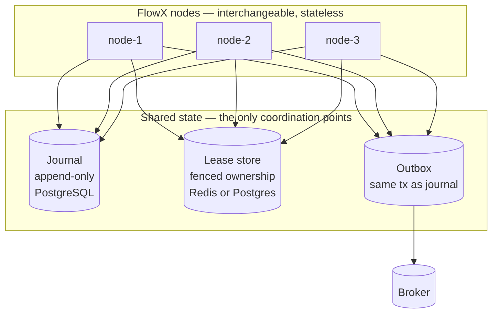
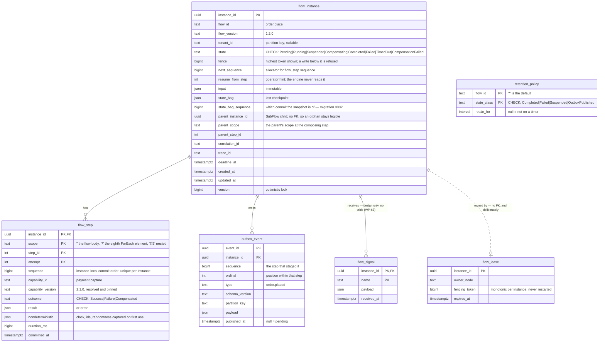
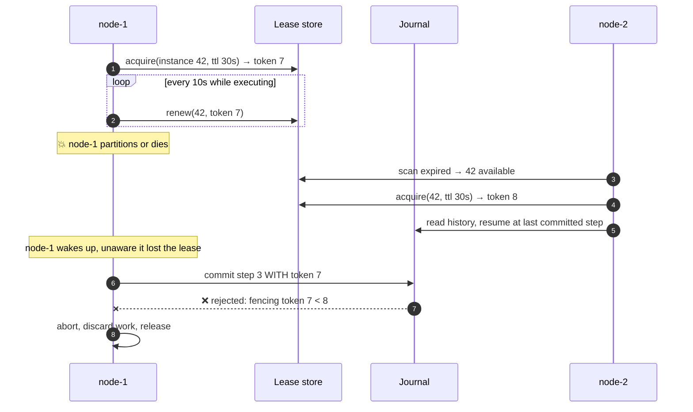
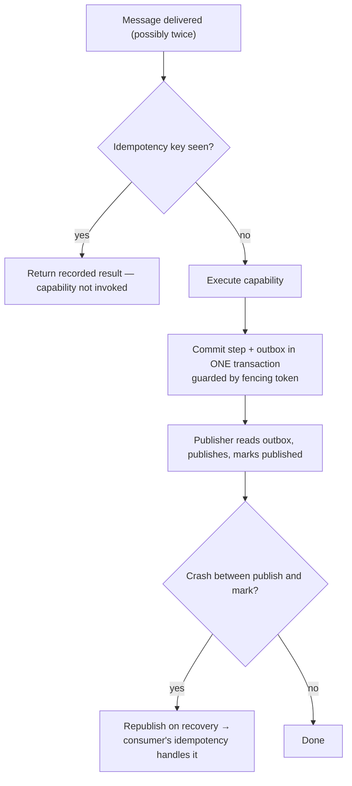
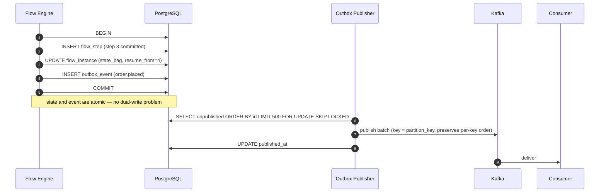
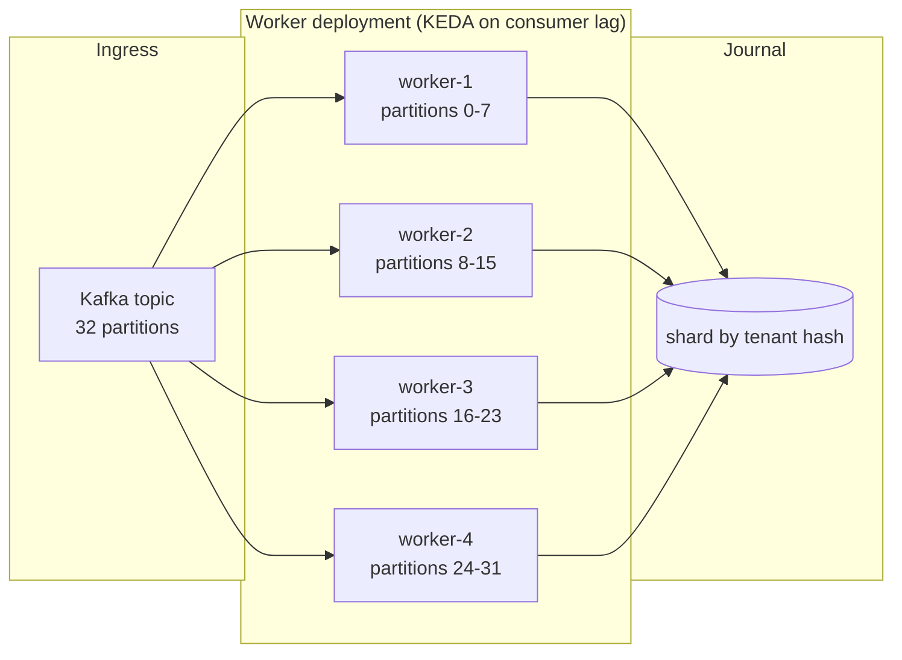
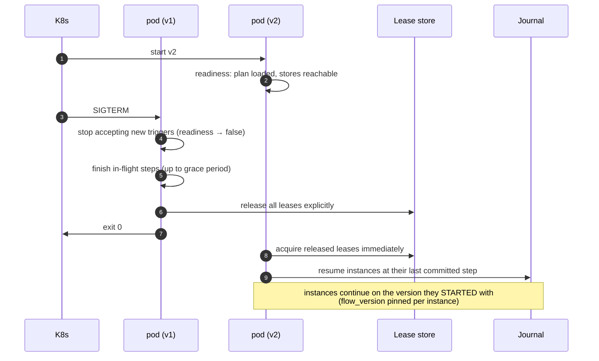

# 11 — Distributed Runtime

> **Status:** Accepted as a specification · **§2 and §3 built, §7 partly, the rest not** · **Audience:** runtime contributors, SRE
> **Answers:** how does durable execution stay correct across nodes, crashes and deployments?

> [!WARNING]
> **Two sections of this document have an implementation, and one real store stands
> behind them. The rest do not.** This box is retired section by section as each lands, not
> wholesale — it said "nothing in this document is implemented", which was true
> until WP-52 (2026-07-31) and is no longer.
>
> | § | State |
> |---|---|
> | [1 · distribution model](#1-the-distribution-model) | **not built.** Both coordination points now exist — a Postgres journal and a Postgres lease store — but nothing has run as two *processes*. The multi-node behaviour §3 describes is exercised by two hosts inside one test process, Redis is still WP-54, and the outbox is a table nothing publishes from |
> | [2 · the journal](#2-the-journal) | **built, against a real database.** WP-51 declared `IFlowJournal`, `ILeaseStore` and `FencingToken` in `src/FlowX.Abstractions/Durability/`; WP-52 made `FlowX.Runtime` read `ExecutionProfile` and commit one row per step boundary, and resume by replaying committed rows into the same step loop; WP-53 implemented both in `plugins/FlowX.Postgres/`, where 45 conformance assertions and 41 adapter tests run green against PostgreSQL 16.13. **The ERD below is no longer the drawn version** — it is migrations `0001`, `0002` and `0003`, after [ADR-0015](adr/ADR-0015-journal-schema-and-durable-execution.md) superseded three of the drawn clauses and [ADR-0016](adr/ADR-0016-postgres-journal-adapter.md) found six more wrong against a real database |
> | [3 · leases and fencing](#3-leases-and-fencing) | **built.** *This row said that nothing acquires or renews a lease and nothing scans for an abandoned instance; WP-55 built all three.* `DurableLease` acquires, renews and releases; `FlowHost` takes the lease before the first step; `FlowRecoveryScan` and `FlowRecoveryService` are node-2's half of the diagram below. *A later row said one half had no PostgreSQL behind it — that the adapter implemented no `IRecoveryIndex`, so a Postgres-backed node fenced correctly and scanned for nothing. `PostgresRecoveryIndex` closed it, in a class of its own rather than on the journal, because a scan is not part of executing an instance* |
> | [4 · exactly-once](#4-exactly-once-honestly) | **not built**, and unchanged by WP-52, WP-53 or WP-55: a process that dies after an effect and before its commit still re-executes the step |
> | [5 · the outbox](#5-the-transactional-outbox) | **not built.** The table is in the schema and a commit stages rows into the step's transaction, but `.Emit<T>()` hands it nothing and nothing publishes ([`FLOWX1024`](diagnostics/FLOWX1024.md)) — WP-56 |
> | [6 · partitioning](#6-partitioning-and-scale) · [8 · failure catalogue](#8-failure-catalogue) | **not built.** No second node, no sharding, no scheduler. §8's first two rows — node crash and zombie writes — are what §3 now implements; the rest of the catalogue is design |
> | [7 · deployment safety](#7-deployment-safety) | **partly built.** *This row said "no migration"; there are three.* Rules 2, 3 and 4 have implementations — an explicit release on drain, a version-pinned candidate the scan leaves alone, and migrations `0002` and `0003` as the expand/contract worked examples. Rule 1 is still a number an operator has to set |
>
> So: a `Durable` flow journals its step boundaries to PostgreSQL under a lease that
> makes one node the instance's only writer, and a node that dies has its instances
> found and finished by another node's recovery scan. *This box said "a process kill
> still loses the instance, because nothing on the other side finds it"; the other
> side exists.* *It then said the remaining hole was that the scan needed a journal
> implementing `IRecoveryIndex` and the PostgreSQL one did not, so a killed node's
> instance kept its prefix, kept its fence, and waited. That is closed:
> `PostgresRecoveryIndex` serves the query, `AddFlowXPostgres` registers it, and
> `PostgresRecoveryHostTests` plays out a real death — lease dropped without renewal —
> and a real scan finishing the instance over real stores.* What is left is not a
> missing part but a missing **demonstration at scale**: nothing has killed a process,
> nothing has crossed a process boundary, and nothing has run ten thousand of anything.
> That is WP-62, and the rig it needs is WP-50.
> A `Durable` flow started with no journal is still **refused** rather than run
> ephemerally (`flow.durability_not_configured`) — on a host that registers a journal
> and a lease store, that refusal has stopped being the normal path.
>
> This is the **P2** increment, and it is the second-riskiest thing in the plan
> for a reason: the guarantees below — exactly one writer, no duplicate
> non-idempotent effects, resume p99 ≤ 45 s — are the hard ones, and designing
> them before writing them is what this document is for. Its exit criterion is
> QR2 in
> [05 §10](05-Architecture.md#10-quality-requirements-stimulus--response--measure),
> and nothing measures it yet: B7, B8 and the chaos rig are WP-50, unstarted.
>
> Read the rest as the design a P2 implementer is held to. Outside §2, §3 and §7's
> rules, do not read any sentence here as describing behaviour you can observe today.

---

## 1. The distribution model

FlowX nodes are **identical and stateless**. Any node can execute any flow
instance. Coordination happens through two shared stores and nothing else.



There is no gossip protocol, no consensus ring, no cluster membership, no
placement service. Correctness rests on two well-understood primitives:
**an append-only log** and **fenced leases**. This is a deliberate rejection of
complexity that other runtimes take on — see
[ADR-0006](adr/ADR-0006-journal-and-leases.md).

Both of those stores are real: the journal and the lease store are
`plugins/FlowX.Postgres` (WP-53). The outbox drawn beside them is a table in the same
schema with no publisher behind it (WP-56), and the Redis lease store the diagram
offers as the alternative is WP-54 and does not exist. What has never happened is the
top half of the diagram — the three nodes are three hosts in one test process, and the
deployment shape is still design.

---

## 2. The journal



**This is the shipped schema, not a sketch of one.** It is
`plugins/FlowX.Postgres/Migrations/0001_initial_schema.sql` and
`0002_expand_state_bag_sequence.sql`. Three clauses of the version drawn here were
already superseded by [ADR-0015](adr/ADR-0015-journal-schema-and-durable-execution.md)
— the key gains `scope`, `resume_from_step` stops being the resume position, a `SubFlow`
child is its own instance row. Six more did not survive contact with PostgreSQL 16.13,
and they are corrected above rather than quietly redrawn
([ADR-0016](adr/ADR-0016-postgres-journal-adapter.md)):

- ***Payload columns were `jsonb`.*** They are `json`. `jsonb` is a parsed
  representation: it sorts object keys, re-renders separators and keeps only the last
  of a repeated key, which makes ADR-0015's commitment 5 — a payload is what the
  generated `System.Text.Json` context wrote — false, and fails
  `SchemaContractTests.APayloadIsStoredByteForByteAsItWasWritten`. The cost is
  accepted: no GIN index and a re-parse per JSON operator, on columns written once,
  read whole and never queried by key (decision 1).
- ***`flow_lease.instance_id` was `PK,FK` to `flow_instance`.*** It carries no foreign
  key. The lease is acquired **before** the instance row exists —
  `FlowInstanceStart.Token` is the token of the lease held while starting — so the
  constraint is inverted in time and would refuse the first acquisition of every flow.
  It would also make a Postgres lease store unusable for a journal kept elsewhere,
  which is the arrangement WP-54 exists to demonstrate. Pinned by
  `SchemaContractTests.ALeaseIsTakenBeforeTheInstanceExists` (decision 2).
- ***The state-bag snapshot had no position.*** ADR-0015 names it as budget B8's
  mitigation — it "bounds the scan to rows committed after it" — and neither the ADR
  nor this ERD gave it a column saying which commit it came from, so it bounded
  nothing. It is `flow_instance.state_bag_sequence`, added in migration `0002`
  (decision 3). It is written on every commit that moves the bag; the frontier read
  still orders every committed row, so B8's mitigation is a column and not yet a
  shorter scan.
- ***`JournalStep.Sequence` had nowhere to live.*** Commit order cannot be derived:
  `committed_at` is two clocks on two nodes, and `step_id` stops being commit order the
  moment a flow forks. It is a column on the step row, unique per instance, handed out
  from `flow_instance.next_sequence` under the row lock the commit already takes.
- ***`duration_ms` was `int`.*** One attempt overflows it at 24.8 days. `bigint`.
- ***The lease row was implicitly deletable.*** It is never `DELETE`d; release and
  expiry are an `UPDATE` to `expires_at`. See §3.

`flow_signal` is the one entity above with no table behind it. Durable suspension and
`AwaitSignal` are WP-63 ([`FLOWX1017`](diagnostics/FLOWX1017.md)), and a durable flow
still runs to completion inside one invocation.

| Property | Guarantee |
|---|---|
| Append-only | `flow_step` rows are never updated, only inserted — the history is the truth. A duplicate is a primary-key violation, translated to `DuplicateStep` rather than swallowed |
| Atomic commit | step result + state bag + outbox row are written in **one transaction**; a refused commit returns before `COMMIT`, so its rollback discards the outbox rows too |
| Fenced writes | every write carries the token of the lease it was made under, checked against `flow_instance.fence` — which rises on **acquisition**, not on the first write |
| Non-determinism capture | clock, ids and randomness are recorded on first use, replayed thereafter |
| Version pinning | the resolved capability version is recorded per step, so a mid-flight deployment cannot change semantics |
| Tenant partitioning | `tenant_id` is the partition key — today a column and an index on `(tenant_id, state)`. *Nothing shards or partitions on it*: §6 is unbuilt, and `retention_policy` is keyed per flow rather than per tenant |

### Retention

| Data | Default retention | Configurable |
|---|---|---|
| Completed instance + steps | 30 days | yes, per flow |
| Failed / TimedOut / CompensationFailed | 180 days | yes, per flow |
| Suspended | until completion or deadline | no — the row is seeded null and nothing sweeps `Suspended` |
| Outbox (published) | 7 days | yes, as one window rather than per flow |

**These numbers are data.** They are seeded into `retention_policy` by migration
`0001` and applied by `PostgresRetention`, per flow with a `'*'` default, so an
operator changes one without a deployment — `RetentionTests.TheDocumentedWindowsAreSeeded`
is what keeps the table above and the seeded rows from drifting apart. *This table
used to be the entire policy, and [ADR-0016](adr/ADR-0016-postgres-journal-adapter.md)
is blunt about what that was worth: "a table in a document deletes nothing."* A null
window means "not on a timer" rather than "immediately", and the arithmetic gives that
for free: `now() - NULL` is null and every comparison against it is false, so a
`Suspended` instance is kept without a second code path saying so. `TimedOut` is swept
with the failures, which this table did not previously say — a flow that ran out of
deadline failed, and keeping it for the completed window would discard the evidence
before the incident is investigated.

**One accepted risk, named where an operator will meet it:** a purge cascades to the
instance's outbox rows, including any never published. Nothing publishes them today,
so nothing is lost; the guard belongs to WP-56, and it is a note for that package
rather than a defect in it.

Archival to cold storage is a plugin (`IJournalArchiver`), because the retention
requirement is regulatory and differs per organisation. *That interface does not
exist* ([17](17-Plugin-System.md) says so at the top), so retention today deletes and
nothing archives.

---

## 3. Leases and fencing

A lease grants time-bounded exclusive ownership of one instance.



**Every arrow above is code as of WP-55.** `DurableLease`
(`src/FlowX.Runtime/DurableLease.cs`) is node-1's half: it acquires, renews on a
`PeriodicTimer` at a third of the TTL, and releases — and its `Token` is reachable only
from a live lease, so no write can carry a token nothing issued. `FlowHost` takes the
lease before the first step and gives it back in a `finally`. `FlowRecoveryScan` and
`FlowRecoveryService` (`src/FlowX.Hosting/`) are node-2's: a jittered sweep for
instances nothing has written to for a lease TTL, bounded per page and per node, walked
from a random offset, where losing the race to another node is a skip rather than an
error. `PostgresLeaseStore` is the store. The sequence above is asserted step by step
in `tests/FlowX.Runtime.Tests/LeaseTests.cs` — down to
`AFencedOutNodeStopsWithoutRunningItsCompensations`, which is the last arrow: a node
that has lost the lease aborts rather than compensating an instance another node has
already carried forwards — and the sweep in
`tests/FlowX.Hosting.Tests/DurableHostTests.cs`.

**Every arrow now has PostgreSQL behind it.** Step 5 — *scan expired → 42 available* —
goes through `IRecoveryIndex`, which is a separate interface precisely because a scan
is not part of executing an instance. *This paragraph said `PostgresFlowJournal` did
not implement it and that nothing asked migration `0002`'s index — so a host whose
journal could not be scanned ran durable flows, fenced correctly, and picked up nobody
else's instance.* `PostgresRecoveryIndex` serves the query, and it is a class of its
own rather than a second interface on the journal, for the same reason the interface
was split: the type every durable write passes through does not need a member no write
uses. `0002`'s index turned out to be the wrong shape for it — see
[§7](#7-deployment-safety) — and migration `0003` adds the one the query can actually
be planned against.

**Fencing tokens are what make this safe.** A monotonically increasing token is
issued at each acquisition and checked on every journal write. A zombie node that
wakes up after a network partition cannot corrupt the instance, no matter how
long it was gone. Lease expiry alone (without fencing) is a well-known
split-brain bug; FlowX does not rely on it.

**Which is why the lease row is never deleted.** Release and expiry are an `UPDATE` to
`expires_at`, because the fencing token is a per-instance counter that has to survive
*both* endings. A store that deleted the row on release would restart the counter, and
the next acquisition would hand a returning zombie a token equal to its successor's —
after which every check in the paragraph above passes
([ADR-0016](adr/ADR-0016-postgres-journal-adapter.md)).

| Parameter | Default | Trade-off |
|---|---|---|
| Lease TTL | 30 s | shorter = faster recovery, more renewal load |
| Renewal interval | TTL / 3 | safety margin for GC pauses and clock skew |
| Recovery scan | every 10 s, jittered ±25 % | shorter = faster failover, more store load; the jitter is what stops a fleet started by one rollout from sweeping in lockstep for ever |
| Max lease extensions | unbounded while progressing | a stuck step is caught by the flow deadline, not by lease expiry |

The first three are `FlowXOptions.LeaseTtl`, `LeaseRenewalInterval` and
`RecoveryScanInterval`, validated at startup rather than on the first request, with the
first two also carried by `LeasePolicy.Default`. Two settings this table never named
bound the sweep itself: `RecoveryScanBatchSize` (how many candidates one scan asks for)
and `MaxConcurrentRecoveries` (how many a node takes at once, and it asks for no second
page until they are finished). None of them is a safety setting — what stops a paused
node from corrupting an instance is the token, which no value here weakens.

---

## 4. Exactly-once, honestly

FlowX does not claim exactly-once delivery, because it does not exist. It
provides the composition that produces **effectively-once processing**:

```
at-least-once delivery  +  idempotent capabilities  +  fenced journal writes
                        =  effectively-once processing
```



The honest statement, which appears in the platform's own documentation and in
every incident review template:

> Effects that FlowX cannot make idempotent — an email already sent, a webhook
> already delivered, a payment captured by a gateway with no idempotency key —
> can occur twice. Declare `Idempotent = false` and FlowX will not retry them;
> that is the strongest guarantee that is truthful.

---

## 5. The transactional outbox



| Design point | Choice | Reason |
|---|---|---|
| Polling vs CDC | polling by default, CDC (Debezium) as a plugin | polling has no extra infrastructure; CDC scales further |
| Batch size | 500, tunable | balances latency and throughput |
| Locking | `FOR UPDATE SKIP LOCKED` | multiple publishers without contention |
| Ordering | per `partition_key` only | global ordering is not offered — it does not scale and is rarely needed |
| Publisher failure | at-least-once republish | consumers must be idempotent; this is stated in every event contract |

---

## 6. Partitioning and scale



| Dimension | Mechanism | Limit |
|---|---|---|
| Ingress throughput | broker partitions; workers scale to partition count | partition count |
| Flow concurrency | worker replicas × per-worker degree | journal write throughput |
| Journal throughput | group commit, batched writes, per-tenant sharding | ~20–50k step-commits/s per Postgres primary. *This cell said "measured, not assumed", and it was neither: the figure is from the literature and it stays one.* A Postgres journal exists and has never been benchmarked — B7 and B8 have no harness (WP-50), which [ADR-0016](adr/ADR-0016-postgres-journal-adapter.md) records as the half of WP-53's exit criterion that is still unmet |
| Ordering | per partition key | no global order |
| Suspended instances | rows only | storage, not compute |

When journal write throughput becomes the ceiling (risk R5), the levers in order
of preference are: (1) move flows that do not need durability to `Ephemeral`,
(2) increase group-commit batching, (3) shard the journal by tenant,
(4) partition the journal table by time.

---

## 7. Deployment safety



Rules that make rolling updates non-events:

1. `terminationGracePeriodSeconds` ≥ longest step budget + 10 s. This is the one rule
   still entirely on the operator: `FlowXOptions.ShutdownDrainTimeout` is the inner
   bound and must stay below it, because a drain budget longer than the grace period
   is a drain the orchestrator kills half-finished.
2. Leases are released explicitly on shutdown — recovery does not wait for TTL.
   `FlowHost.DrainAsync` waits for the in-flight flows and their detached children,
   then releases whatever the budget ran out on; `DurableLease.ReleaseAsync` is
   idempotent, so the ordinary path — release at the end of the flow, dispose in a
   `finally` — does not have to know which got there first.
3. A durable instance keeps its pinned `flow_version` until it completes, and the
   recovery scan enforces that from the other side: a candidate pinned to a version
   this node does not carry is left alone and counted as `NotRunnable`, because taking
   a lease it could not use would deny the instance to a node that can — for a whole
   TTL, every sweep.
4. Schema changes to journal tables use expand/contract: add nullable, backfill,
   switch reads, drop later — never a breaking migration in one release.
   **Migrations `0002` and `0003` are this schema's worked examples, and they exist
   outside `0001` for that reason**
   ([ADR-0016](adr/ADR-0016-postgres-journal-adapter.md)): in `0002`,
   `state_bag_sequence` is added nullable with no default and backfilled from
   `max(sequence)` only for instances that already carry a snapshot; `0003` adds the
   index the recovery scan is actually planned against. Every statement in both is
   additive, so a pod on the previous release keeps inserting and updating rows without
   knowing either exists — an index changes no row and no column, so there is nothing
   for an older reader to fail on.

   **`0003` is also this schema's first worked example of the rule's *other* half —
   superseding without dropping.** `0002` created `flow_instance_recovery_idx` on
   `(state, updated_at)` for this scan, and it cannot serve it: with `state` leading, an
   index scan yields rows grouped by state, so `ORDER BY updated_at` inherits no
   ordering and PostgreSQL falls back to reading every candidate and top-N sorting it.
   `0003` adds `(updated_at)` partial on the same three states and **leaves `0002`'s
   index in place**, because superseded is not unused and a release must ship with
   nothing planning against an index before the release that drops it.
   `MigrationTests.TheExpandMigrationDoesNotBreakTheReleaseBeforeIt` asserts that
   coexistence, and `NoMigrationAfterTheFirstIsDestructive` rejects `DROP`, `RENAME`
   and `SET NOT NULL` anywhere after the first migration — so this rule is now enforced
   rather than intended.

---

## 8. Failure catalogue

| Failure | Detection | Response | Data loss |
|---|---|---|---|
| Node crash mid-step | a recovery scan finds a row nothing has written to for a lease TTL; acquisition settles whether it is really abandoned | another node resumes from last commit | none for durable; the in-flight step re-executes (idempotency required) |
| Network partition (zombie node) | fencing token mismatch | zombie's writes rejected | none |
| Journal unavailable | write failure | new durable flows rejected (503); ephemeral flows unaffected | none |
| Lease store unavailable | renewal refused or unanswered | no new durable work; an in-flight instance keeps executing and its next commit is refused by the fence. *This cell said it "pauses"; it does not* — cancelling a lost lease would take the flow down the failure path, and that path compensates, against an instance another node may already have carried forwards | none |
| Broker unavailable | publish failure | outbox accumulates; flows continue | none (events delayed) |
| Poison message | terminal error category | dead-letter, offset committed | none |
| Clock skew between nodes | lease renewal margin (TTL/3) | tolerated up to TTL/3 | none |
| Deadline exceeded | flow engine check | `TimedOut` → compensation | none |
| Compensation exhausted | retry exhaustion | `CompensationFailed` + alert + manual replay | **business inconsistency — operator action required** |

The first two rows are what §3 implements; the rest of this catalogue is still the
design a P2 implementer is held to. *The first row used to carry a caveat that it was
only as good as a scan no adapter implemented; it is now backed by a store rather than
by a test double.* What it has never been is exercised across a process boundary — the
kill is simulated by dropping a lease, not by killing anything (WP-62).

The last row is the only case with no automatic resolution. FlowX makes it
visible rather than pretending otherwise; the operator runbook is
`flowx replay --instance <id> --from <step>` after the downstream fault is fixed —
a command the CLI does not have yet.

*It is also the one row below the first two that is now reachable rather than
designed.* Since **WP-57** a compensation is retried under its own declared
policy set, every attempt gets a journal row, exhaustion moves the instance to
`CompensationFailed`, and `ICompensationAlertSink` is raised once with the flow,
the instance, the step, the compensating capability, the attempt count and the
last error — which is exactly what the runbook needs. What the row still promises
and nothing delivers is the metric and the dead-letter record
([12 §3](12-Observability.md)) and the `flowx replay` command itself.

---

## 9. Explicit non-goals

| Non-goal | Why | If you need it |
|---|---|---|
| Cross-region durable flows | journal latency destroys the model; consistency questions multiply | region-local flows + async event replication between regions |
| Global ordering of events | does not scale, rarely the real requirement | per-key ordering + a sequence number in the payload |
| Automatic conflict resolution | business-specific by nature | compensations, or an explicit merge capability |
| Distributed transactions (2PC) | availability and operability cost | sagas with compensation |
| Actor-style state affinity | different problem (state locality, not intent) | Orleans/Akka alongside FlowX; a grain call is a capability |

---

**Next:** [12 — Observability](12-Observability.md)
