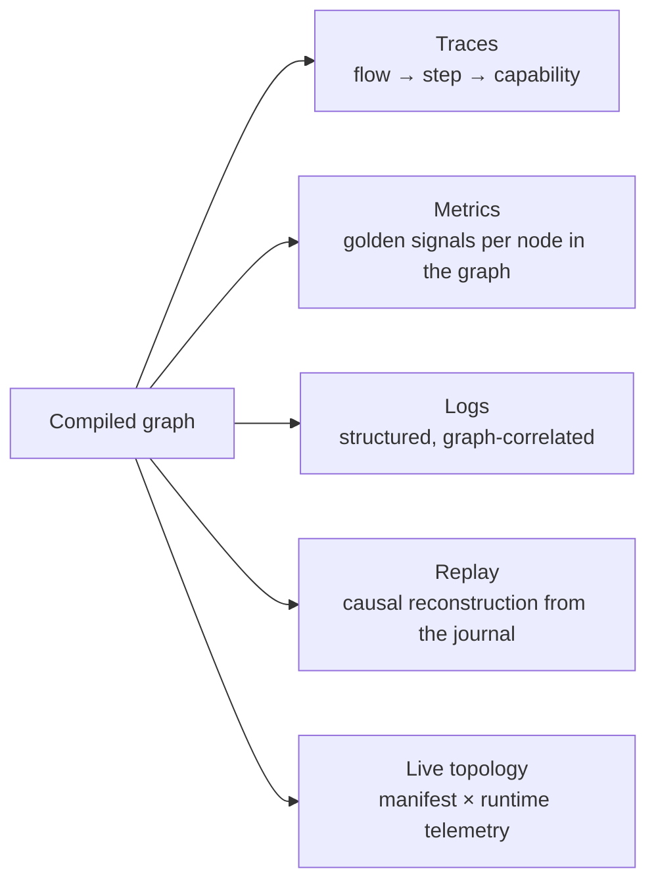

# 12 — Observability

> **Status:** Accepted as a specification · **not built** · **Audience:** SRE, application engineers
> **Answers:** what does FlowX emit, and how do you answer "why did instance 42 fail?"

> [!WARNING]
> **FlowX emits nothing today.** There is no `ActivitySource`, no `Meter`, no
> `ILogger` and no exporter anywhere under `src/` — not one span, metric or log
> record in this document is produced by any code path. `flowx replay` is not a
> CLI verb ([22-CLI](22-CLI.md) has four: `graph`, `manifest`, `diff` and
> `verify`). *This box also said "the journal every replay mode reads from does
> not exist"; since WP-53 it does — `plugins/FlowX.Postgres` stores one row per
> step boundary with its non-determinism capture, which is precisely what a
> replay reads. The missing thing is the verb, not the data.*
>
> This document is therefore a **frozen schema, not a description**. That is
> deliberate and it is why it is written in the present tense elsewhere: the
> attribute and metric names below are a contract that generated dashboards,
> alerts and an estate's worth of queries will depend on, and they are cheaper to
> agree before emission than after. Read every table as *"what will be emitted"*.
>
> Delivery is **P5** in [20-Roadmap](20-Roadmap.md), whose Must list is exactly
> "frozen span/metric schema · `TelemetryConformanceTest` · `flowx replay` all
> four modes · generated alerts and dashboards", gated behind the **P2** journal.
> `TelemetryConformanceTest` is named in four documents as an existing gate and
> exists in none of them.

---

## 1. The premise

The runtime executes a **known graph**. It therefore knows, without any user
instrumentation, what is running, what it depends on, what it emitted and how
long each part took. Observability in FlowX is not a library you add; it is a
consequence of the architecture.



---

## 2. Traces

One span per flow, one per step, one per policy decision that costs time.

```
span: flow order.place                                    [durable]  1.84s
├── span: step 0 order.validate                                       2ms
├── span: step 1 inventory.reserve                                   41ms
│   └── event: retry.attempt {attempt=1, delay_ms=213, error=inventory.locked}
├── span: step 2 payment.capture                                   1.61s
│   ├── event: policy.timeout.armed {duration_ms=2000}
│   ├── span: HTTP POST api.stripe.com/charges                     1.58s
│   └── event: policy.breaker.state {from=Closed, to=Closed, ratio=0.12}
├── span: step 3 emit order.placed                                    9ms
└── event: flow.completed {steps=4, compensations=0}
```

### Span attribute schema (normative)

| Attribute | Example | On |
|---|---|---|
| `flowx.flow.id` | `order.place` | flow, step |
| `flowx.flow.version` | `1.2.0` | flow |
| `flowx.flow.instance_id` | `fi_01HV8…` | flow, step |
| `flowx.flow.profile` | `Durable` | flow |
| `flowx.step.id` | `2` | step |
| `flowx.capability.id` | `payment.capture` | step |
| `flowx.capability.version` | `2.1.0` | step |
| `flowx.trigger.kind` | `Http` | flow |
| `flowx.trigger.source` | `POST /api/v1/orders` | flow |
| `flowx.tenant.id` | `acme` | flow, step |
| `flowx.error.code` | `payment.declined` | step (on failure) |
| `flowx.error.category` | `Conflict` | step (on failure) |
| `flowx.attempt` | `2` | step |

These names are frozen because dashboards and alerts across an entire estate
depend on them being identical in every service. `TelemetryConformanceTest` is
the gate that will assert them exactly — it is a **P5** deliverable and has not
been written, and until it exists "frozen" means agreed, not enforced.

**Trace context is continued, never restarted** — across HTTP, Kafka headers,
MQTT user properties, cron-originated flows (linked to the schedule's span) and
agent calls. A single trace shows the whole causal chain from the user's click
to the third downstream event.

---

## 3. Metrics

### Golden signals, automatically, per graph node

| Metric | Type | Labels |
|---|---|---|
| `flowx_flow_duration_seconds` | histogram | `flow`, `profile`, `outcome`, `tenant` |
| `flowx_flow_active` | gauge | `flow`, `state` |
| `flowx_flow_total` | counter | `flow`, `outcome` |
| `flowx_step_duration_seconds` | histogram | `flow`, `step`, `capability`, `outcome` |
| `flowx_capability_duration_seconds` | histogram | `capability`, `outcome` |
| `flowx_capability_unhandled_total` | counter | `capability` — **a defect signal** |
| `flowx_trigger_admitted_total` / `_rejected_total` | counter | `kind`, `reason`, `tenant` |
| `flowx_journal_commit_seconds` | histogram | `operation` |
| `flowx_lease_lost_total` | counter | `reason` |
| `flowx_outbox_pending` | gauge | `type` |
| `flowx_outbox_lag_seconds` | gauge | `type` |
| `flowx_stream_lag_records` | gauge | `topic`, `partition` |
| `flowx_flow_compensation_failed_total` | counter | `flow`, `step` — **always alert** |

Plus every policy metric from [10 §9](10-Policy-Framework.md#9-observing-policies).

### Cardinality discipline

`tenant` is a label only where tenant-level SLOs exist, and is capped by a
configurable allow-list with an `other` bucket. `flow.instance_id` is **never** a
metric label — it belongs in traces and logs. Cardinality is a production
incident waiting to happen, so the platform enforces the discipline rather than
documenting it.

---

## 4. Logs

Structured only. Data as fields, never interpolated into the message.

```jsonc
{
  "timestamp": "2026-07-30T09:14:02.113Z",
  "level": "Warning",
  "message": "Step failed and will be retried",
  "flowx.flow.id": "order.place",
  "flowx.flow.instance_id": "fi_01HV8…",
  "flowx.step.id": 2,
  "flowx.capability.id": "payment.capture",
  "flowx.error.code": "payment.gateway_timeout",
  "flowx.attempt": 1,
  "flowx.tenant.id": "acme",
  "trace_id": "4bf92f3577b34da6a3ce929d0e0e4736",
  "span_id": "00f067aa0ba902b7"
}
```

Every log written inside a capability inherits this scope automatically — the
Capability Engine opens the logging scope before invoking. A capability that logs
`_logger.LogWarning("Payment failed for {OrderId}", id)` produces a record already
correlated to its flow, step, tenant and trace.

### Redaction

Fields marked `[Sensitive]` on a contract are redacted in logs, traces, the
journal **and** the replay view:

```csharp
public sealed record PaymentMethod([property: Sensitive] string Pan, string Brand);
```

Redaction is applied by the generated serialiser, so there is no code path that
can forget it. `SecretsNeverLeaveTheProcess` — *a CI test that does not exist,
and would need emitted telemetry fixtures there are none of* — is intended to
scan them for known secret patterns. What does run today is
`ManifestContainsNoSecrets`, which scans the emitted **manifests** for the shape
of a secret; that is a different artifact and a narrower claim.

> **Status: one path, not every path.** The compiler reads `[Sensitive]`, records the
> member in `flowx.manifest.json`, and emits the names as `Flow.SensitiveMembers`. The
> HTTP endpoint uses that list to replace matching structured error detail with
> `[redacted]` before the body is written — so a capability that attaches a secret to an
> `Error` does not send it to the caller.
>
> That is the **only** path this release serialises a capability-supplied value on.
> Logs, traces, the journal and the replay view do not exist yet, so the "no code path
> can forget it" claim above is still ahead of us. The value also still travels wherever
> your own code puts it. Tracked as **WP-12a** in [PLAN.md](../PLAN.md).

---

## 5. Flow replay — the differentiator

Because a durable flow's every step is journaled, execution is reconstructable.

```bash
flowx replay --instance fi_01HV8… --mode inspect
```

```
Flow order.place@1.2.0   instance fi_01HV8…   tenant acme
State: CompensationFailed        Duration: 4.2s        Trigger: kafka:orders.requested[3]@1042

  ✅ step 0  order.validate        2ms    → ValidatedOrder{id=…, total=EUR 19.98}
  ✅ step 1  inventory.reserve    41ms    → Reservation{sku=SKU-1, qty=2}   (attempt 2)
  ❌ step 2  payment.capture     1.61s    → Error{payment.gateway_timeout, Unavailable}
       attempts: 3 · backoff 213ms, 587ms · breaker Closed→Open
  🔄 step 1c inventory.release     —      → Error{inventory.unavailable}    (5 attempts)

  Non-deterministic values captured:
      clock@step0 = 2026-07-30T09:14:00.001Z
      id@step1    = res_01HV8…

  → Next action: flowx replay --instance fi_01HV8… --from 1c   (after inventory recovers)
```

| Mode | Behaviour | Use |
|---|---|---|
| `--mode inspect` | render history, no execution | incident analysis |
| `--mode simulate` | re-execute with capabilities stubbed from the journal | verify a fix against real data |
| `--mode resume --from <step>` | continue the real instance | operator recovery |
| `--mode fork` | new instance seeded from this history | test a fix without touching production state |

`simulate` is what makes post-incident work fast: you reproduce a production
failure locally, with the exact inputs, without touching any production system.

---

## 6. Live topology

```bash
flowx graph --live --format mermaid
```

The manifest supplies the structure; runtime metrics supply the colour.


Studio renders the same data interactively, adds impact analysis ("what breaks if
`payment.capture` is down?" — answerable from the graph, not from tribal
knowledge) and links every node to its traces.

---

## 7. SLOs and alerting

Each quality goal in [05 §1.2](05-Architecture.md#12-quality-goals-measurable--arc42-12) maps to an SLO and an alert.

| SLO | Target | Alert on |
|---|---|---|
| Flow availability | 99.9 % non-`Internal` outcomes per flow | burn rate > 2 % of budget/hour |
| Flow latency | p99 within the flow's declared deadline | p99 > 80 % of deadline for 10 min |
| Journal health | p99 commit < 15 ms | p99 > 50 ms for 5 min |
| Outbox freshness | lag < 5 s | lag > 30 s for 2 min |
| Stream lag | < 10 s | lag > 60 s |
| **Compensation failure** | **0** | **any occurrence — page immediately** |
| Capability defects | 0 unhandled exceptions | any occurrence — ticket |
| Breaker state | closed | open > 5 min |

Alert rules are **generated from the manifest**, so a new flow arrives with its
dashboards and alerts already defined:

```bash
flowx generate alerts --format prometheus > alerts.yaml
flowx generate dashboard --format grafana > dashboard.json
```

Nobody has ever kept hand-written dashboards in sync with a growing service
estate. Generating them from the same artifact that defines the code is the only
approach that stays true.

---

## 8. Cost of observability

Principle P5 says performance is a design property, so telemetry must be free
when unobserved:

| Mechanism | Effect |
|---|---|
| `ActivitySource.HasListeners()` checked before span creation | zero cost with no exporter attached |
| Metrics use pre-resolved tag arrays from the plan | no per-call tag allocation |
| Log scopes are structs, pooled with the context | no per-step allocation |
| Sampling: head-based 1 %, plus tail-based 100 % on error | full fidelity where it matters |
| Journal is the replay source, not the trace backend | replay does not depend on trace retention |

Measured in `FlowX.Benchmarks`: telemetry adds **< 200 ns** per step with an
exporter attached, **0 ns and 0 allocations** without one.

---

## 9. What to look at first, by symptom

| Symptom | First signal | Then |
|---|---|---|
| Latency spike | `flowx_step_duration_seconds` by capability | trace exemplar for the slow step |
| Error spike | `flowx_flow_total{outcome=Failure}` by `error_code` | `flowx replay --mode inspect` on a failing instance |
| Stuck flows | `flowx_flow_active{state=Suspended\|Running}` growing | lease metrics; a step exceeding its budget |
| Events not arriving | `flowx_outbox_pending`, `flowx_outbox_lag_seconds` | publisher logs, broker health |
| Duplicated effects | `flowx_idempotency_replays_total` = 0 with retries > 0 | a capability declaring `Idempotent = true` but not honouring the key |
| One tenant slow | tenant-labelled histograms | quota and rate-limit rejections |
| Memory growth | `flowx_bulkhead_queue_depth`, stream channel depth | backpressure not reaching the source |

---

**Next:** [13 — AI-Native](13-AI-Native.md)
