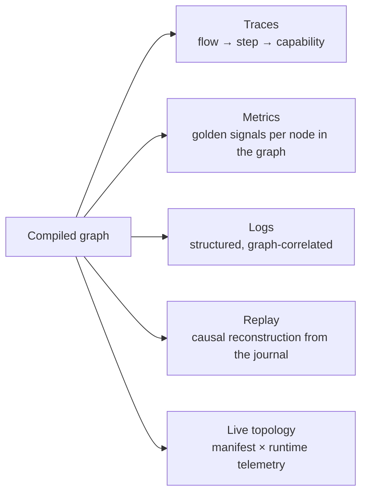

# 12 — Observability

> **Status:** Accepted · **traces and metrics built, logs not** · **Audience:** SRE, application engineers
> **Answers:** what does FlowX emit, and how do you answer "why did instance 42 fail?"

> [!NOTE]
> **FlowX emits.** This box said "FlowX emits nothing today — there is no `ActivitySource`,
> no `Meter`, no `ILogger` and no exporter anywhere under `src/` — not one span, metric or log
> record in this document is produced by any code path". Three quarters of that expired at
> **WP-90**. `FlowX.Abstractions` now carries one `ActivitySource` and one `Meter`, both named
> `FlowX`; the flow boundary, the step boundary, the journal, the lease, the outbox and both
> sweeps emit through them; and [§3](#3-metrics) says per row which of the thirteen metrics has
> a producer and which two do not, and why.
>
> ***What has not changed is the logs.*** There is still no `ILogger` anywhere under `src/` or
> `plugins/`, so [§4](#4-logs) is the one section of this document that is still entirely
> specification — see the box there.
>
> `TelemetryConformanceTest` was named in four documents as an existing gate and existed in
> none of them. It exists: `tests/FlowX.Hosting.Tests/TelemetryConformanceTests.cs`, which
> asserts the frozen names as literals, asserts emission rather than existence, asserts that
> the attributes and metrics with no producer still have none, and gates the cardinality rule
> in [§3](#3-metrics).
>
> This document was written as a **frozen schema rather than a description**, deliberately and
> in the present tense, because the attribute and metric names below are a contract that
> generated dashboards, alerts and an estate's worth of queries depend on, and they are cheaper
> to agree before emission than after. **That bet paid: not one name changed when the emitter
> was built.** The tables can now be read as what *is* emitted — except where a row says
> otherwise, and three attribute rows and two metric rows do.
>
> The work package is **WP-90**, the first of the WP-90…WP-99 range
> [PLAN §6a](../PLAN.md) reserves for P5.
>
> Delivery is **P5** in [20-Roadmap](20-Roadmap.md), whose Must list is exactly
> "frozen span/metric schema · `TelemetryConformanceTest` · `flowx replay` all
> four modes · generated alerts and dashboards", gated behind the **P2** journal.
> Two of those four have landed. `flowx replay` still has one of its four modes
> ([§5](#5-flow-replay--the-differentiator)), and nothing generates alerts or
> dashboards ([§7](#7-slos-and-alerting)).

---

## 1. The premise

The runtime executes a **known graph**. It therefore knows, without any user
instrumentation, what is running, what it depends on, what it emitted and how
long each part took. Observability in FlowX is not a library you add; it is a
consequence of the architecture.



---

## 2. Traces

One span per flow, one per step, one per policy decision that costs time.

```
span: flow order.place                                    [durable]  1.84s
├── span: step 0 order.validate                                       2ms
├── span: step 1 inventory.reserve                                   41ms
│   └── event: retry.attempt {attempt=1, delay_ms=213, error=inventory.locked}
├── span: step 2 payment.capture                                   1.61s
│   ├── event: policy.timeout.armed {duration_ms=2000}
│   ├── span: HTTP POST api.stripe.com/charges                     1.58s
│   └── event: policy.breaker.state {from=Closed, to=Closed, ratio=0.12}
├── span: step 3 emit order.placed                                    9ms
└── event: flow.completed {steps=4, compensations=0}
```

### Span attribute schema (normative)

| Attribute | Example | On | Today |
|---|---|---|---|
| `flowx.flow.id` | `order.place` | flow, step | **emitted** |
| `flowx.flow.version` | `1.2.0` | flow | **emitted** |
| `flowx.flow.instance_id` | `fi_01HV8…` | flow, step | **emitted** on a journaled execution; absent on an ephemeral one, which has no instance |
| `flowx.flow.profile` | `Durable` | flow | **emitted** |
| `flowx.step.id` | `2` | step | **emitted** |
| `flowx.capability.id` | `payment.capture` | step | **emitted**. On a step with no capability behind it — an emit, a satisfied wait — it carries that step's identity, which is the event or signal type |
| `flowx.capability.version` | `2.1.0` | step | **emitted** on a capability step; absent where there is no capability to version |
| `flowx.trigger.kind` | `Http` | flow | **not emitted, and nothing holds the fact.** `FlowInvocation` carries correlation, an idempotency key, a tenant and a deadline, and nothing that says what started the flow. There is no Trigger Engine to learn it from — the same gap that leaves `flowx_trigger_*` without a producer ([§3](#3-metrics)), and it closes the same way: **P3**'s shared admission point, which would put the kind and the source on the invocation |
| `flowx.trigger.source` | `POST /api/v1/orders` | flow | **not emitted**, for the reason above. The generated HTTP endpoint knows its own route, so this one is reachable slightly sooner than its sibling — but a `source` emitted only by the one transport that has a route would make the attribute mean "HTTP route, or missing", which is worse than absent |
| `flowx.tenant.id` | `acme` | flow, step | **emitted** when the invocation resolves one. `FlowInvocation.TenantId` is documented as coming from validated claims only, so an unauthenticated deployment emits nothing here rather than a literal `default` — `samples/ecommerce` is one, and `Ecommerce.Tests` pins the absence |
| `flowx.error.code` | `payment.declined` | step (on failure) | **emitted**, on the step span and on the flow span |
| `flowx.error.category` | `Conflict` | step (on failure) | **emitted**, alongside `ActivityStatusCode.Error` |
| `flowx.attempt` | `2` | step | **not emitted, and it would be a constant.** The attempt number is derived from committed journal history inside `FlowEngine.CommitStepAsync`, which is not visible at the dispatch seam the step span is opened on — and it is 1 by construction anyway, because no policy runs on the forward path ([10](10-Policy-Framework.md)), so a step is dispatched once. The only retries in the runtime are a compensation's. Emitting a literal `1` would put a number on a dashboard that can never move and would read as a retry count somebody had measured. It arrives with **P4**'s forward-path retry, which is also what would make it interesting |

These names are frozen because dashboards and alerts across an entire estate
depend on them being identical in every service. `TelemetryConformanceTest` is
the gate that asserts them exactly, and it is written:
`tests/FlowX.Hosting.Tests/TelemetryConformanceTests.cs`. It compares literals on both sides —
a test that checks a constant against itself passes whatever the constant is changed to — and
it asserts the three rows above that are **not** emitted, so "no producer" stops being true
only in a commit that also corrects this table.

**Trace context is continued, never restarted** — across HTTP, Kafka headers,
MQTT user properties, cron-originated flows (linked to the schedule's span) and
agent calls. A single trace shows the whole causal chain from the user's click
to the third downstream event.

> **Continued within a process; not yet propagated between them.** A step span is a child of
> its flow's span — `AStepSpanIsAChildOfItsFlowSpan` — so the chain holds wherever
> `Activity.Current` reaches, and each sweep opens a span of its own so that a recovered or
> woken instance is not a trace root with no caller. What does not exist
> is extraction from and injection into a transport: there is one transport, its endpoint does
> not read `traceparent`, and `IEventPublisher`'s batch carries no headers to inject into. So a
> trace today starts at the flow rather than at the caller's click, and the sentence above
> describes **P3** and **P7** rather than this release. `flow_instance.trace_id` is a column
> the journal has carried since migration `0001` and nothing writes.

---

## 3. Metrics

### Golden signals, automatically, per graph node

| Metric | Type | Labels | Today |
|---|---|---|---|
| `flowx_flow_duration_seconds` | histogram | `flow`, `profile`, `outcome`, `tenant` | **emitted** by `FlowHost`. `outcome` is `Success`, `Failure` or `Suspended` — a flow parked at a signal has neither failed nor finished, and folding it into either would invent an error rate or claim a completion whose `.Return(...)` never ran |
| `flowx_flow_active` | gauge | `flow`, `state` | **emitted** by `plugins/FlowX.Postgres`, from `flow_instance` grouped by `(flow_id, state)` over the four non-terminal states. Read from the store rather than counted in the host because a suspended instance is a row, parked precisely so that no process holds it. *This row said `state=Suspended` "would be permanently zero — `FlowInstanceState.Suspended` is a value nothing sets (**WP-63**)". That expired when WP-63 landed:* `FlowEngine.InstanceStateFor` answers `Suspended` and `CompleteAsync` writes it, and `ASuspendedInstanceIsReportedAsActive` pins that it reaches this gauge. **A host with no journal emits nothing here**, which is the honest answer — an ephemeral flow has no lifetime beyond its invocation |
| `flowx_flow_total` | counter | `flow`, `outcome` | **emitted** by `FlowHost`. A flow the host refused while draining is not counted: nothing executed, so it is not a flow that failed |
| `flowx_step_duration_seconds` | histogram | `flow`, `step`, `capability`, `outcome` | **emitted** at the dispatch seam, for every step boundary — capability, emit, satisfied wait — and separately for a compensation |
| `flowx_capability_duration_seconds` | histogram | `capability`, `outcome` | **emitted**, and deliberately not the step histogram with a label dropped: §9 diagnoses a spike "by capability", and a capability used by six flows is one dependency with one p99. Recorded only for a real capability, so an emit does not contribute time no capability spent |
| `flowx_capability_unhandled_total` | counter | `capability` — **a defect signal** | **emitted**. Counted at the dispatch seam and re-thrown, so the engine still converts it into `FlowErrors.Unhandled` and still compensates — this observes the defect, it does not change what happens to it |
| `flowx_trigger_admitted_total` / `_rejected_total` | counter | `kind`, `reason`, `tenant` | **not emitted, and nowhere to emit from.** There is no Trigger Engine; §5 of [09-Trigger-Model](09-Trigger-Model.md) is a diagram with four of its nine decisions enforced, all inside the HTTP endpoint. A `kind` label needs one admission point serving every transport, and there is one transport. **No instrument is created for it** — see the note below |
| `flowx_journal_commit_seconds` | histogram | `operation` | **emitted** as a decorator over `IFlowJournal`, so both shipped adapters and any third-party store are timed by one piece of code. `operation` is the interface member, so a commit and a frontier read are separable — §7's SLO is about the commit |
| `flowx_lease_lost_total` | counter | `reason` | **emitted** by `DurableLease`, once on the `Held`→`Lost` edge. `reason` is `refused` (the store answered and said no) or `unreachable` (the store could not be reached, and by the time that was certain the lease had lapsed). They point at different faults, and one unlabelled counter would make a network blip and a split brain the same line |
| `flowx_outbox_pending` | gauge | `type` | **emitted** by `plugins/FlowX.Postgres`, and it is exactly the `SELECT count(*) … WHERE published_at IS NULL GROUP BY type` this row always said it was |
| `flowx_outbox_lag_seconds` | gauge | `type` | **emitted** by `plugins/FlowX.Postgres`, **with no migration.** This row said the gauge "needs a column before it needs a meter". It was wrong about which table holds the fact — see below |
| `flowx_stream_lag_records` | gauge | `topic`, `partition` | **not emitted and no subject.** `ExecutionProfile.Streaming` is an enum member no code branches on, and no stream trigger reaches a transport (**P7**). **No instrument is created for it** — see the note below |
| `flowx_flow_compensation_failed_total` | counter | `flow`, `step` — **always alert** | **emitted**, through the seam this row named. `ICompensationAlertSink.CompensationExhausted` fires exactly once per exhausted compensation and its doc comment named this metric as the thing that was not built; `CompensationFailureCounter` is registered by default, so a deployment does not have to remember to wire the one counter §7 pages on |

Plus every policy metric from [10 §9](10-Policy-Framework.md#9-observing-policies) —
none of which is emitted either, and for a further reason: [10](10-Policy-Framework.md)
records that no policy runs on the forward path, so a rate-limit rejection or a cache hit
is not merely uncounted, it does not occur.

> [!NOTE]
> **The fourth column read "no emitter" thirteen times. It now reads "emitted" eleven times,
> and the two that do not are the two that never needed an emitter.**
>
> The old version of this box said the thirteen rows sat at three different distances from
> being true: ten needed only an emitter, one needed **P7**, one needed **P3**, and one needed
> a schema change. Three of those four are unchanged and correct. **The fourth was wrong**, and
> it is worth being exact about how.
>
> **`flowx_outbox_lag_seconds` needed neither a column nor a meter it did not have.** This box
> said "nothing in the store could compute it": `outbox_event` carries exactly one timestamp,
> `published_at`, `NULL` for precisely the rows the gauge is about; migration `0004`'s
> `staged_seq` is an ordering sequence and deliberately not a clock; and
> [ADR-0018](adr/ADR-0018-outbox-publication-and-ordering.md)) considered a staging timestamp
> and rejected it. **Every one of those statements is true and the conclusion does not
> follow**, because the staging instant is not stored on `outbox_event` — it is stored on the
> step row that staged it.
>
> `PostgresFlowJournal.CommitAsync` inserts the `flow_step` row and stages the event under
> **one `sequence` value in one transaction** — `InsertStepAsync` and `StageOutboxAsync` are
> handed the same local — and `flow_step_sequence_idx` is `UNIQUE` on `(instance_id, sequence)`.
> `flow_step.committed_at` is `timestamptz NOT NULL DEFAULT now()`, evaluated inside that
> transaction. So the age of a pending event is the age of the step commit that staged it, one
> indexed join away, recorded since migration **`0001`**.
>
> **ADR-0018 does not need reopening either, and this is the part the old box conflated.** What
> the ADR rejected is *"order by `now()` at staging time"*, on the grounds that *"a timestamp is
> not monotonic across nodes and ties are ordinary at commit granularity, so the order would be
> approximately right, which for an ordering guarantee is the same as wrong"*. Every clause of
> that is about **ordering**. This gauge orders nothing; ties are irrelevant to it; and clock
> skew between nodes enters as a bounded error on a quantity whose SLO in [§7](#7-slos-and-alerting)
> is five seconds with an alert at thirty. A duration that is approximately right is what a lag
> gauge *is*. A sequence that is approximately ordered is not an order. `staged_seq` remains
> the ordering key and this query does not read it.
>
> `StoreMetricsTests.APendingEventsAgeIsTheAgeOfTheStepThatStagedIt` is the evidence rather
> than the argument: it stages an event, waits a known interval, and requires the gauge to have
> moved by about that much — bounded on both sides, so neither a zero nor the age of the process
> would pass.
>
> **The two rows with no producer have no instrument, and that is deliberate.** An instrument
> that is created and never written to publishes an empty series, and an empty series is
> indistinguishable from a healthy one — which is exactly what [§9](#9-what-to-look-at-first-by-symptom)'s
> warning box says about following a row that does not exist.
> `TheTwoMetricsWithNoSubjectHaveNoInstrument` keeps it that way, so `flowx_trigger_*` and
> `flowx_stream_lag_records` are absent rather than flat.
>
> **One caveat that applies to all three store-backed gauges.** They are global counts read from
> one database, so every node running them publishes the same numbers and an exporter that sums
> across nodes multiplies them. Aggregate with `max`, not `sum`. This is inherent to the shape
> rather than to the implementation — it is equally true of the `SELECT count(*) … GROUP BY type`
> this section writes out for `flowx_outbox_pending` — and it is the price of a gauge whose
> subject outlives any one process.
>
> **What `flowx_outbox_lag_seconds` still will not tell you**, unchanged from the old box and
> still the reason not to read it alone: `IEventPublisher`'s implementations are a recording
> test double and `RedisStreamEventPublisher`. On a deployment with no broker wired, *pending*
> is not a backlog and *lag* is not a delay — both are the publisher being absent, which
> `flowx_outbox_pending` already says by growing without bound.

### Cardinality discipline

`tenant` is a label only where tenant-level SLOs exist, and is capped by a
configurable allow-list with an `other` bucket. `flow.instance_id` is **never** a
metric label — it belongs in traces and logs. Cardinality is a production
incident waiting to happen, so the platform enforces the discipline rather than
documenting it.

**It now does.** `FlowXTelemetry.ConfigureTenantLabels` is the allow-list, and **the default is
that nothing is allow-listed**: an application that never calls it emits `tenant=other` and one
bounded series per flow. A default that passed the tenant through would have made the incident
this paragraph describes the out-of-the-box behaviour, and would have made it arrive in
production rather than in a review. The bucket rather than a dropped label is what keeps the
sum over tenants equal to the total.

Two tests hold the rest of it. `NoMetricIsLabelledWithAnythingUnbounded` runs a journaled flow
and walks every recorded measurement, failing if any tag key or value is the instance id, the
correlation id or the idempotency key. `NoCallerSuppliedStringReachesAMetricLabel` does the same
from the other end, against `samples/ecommerce`'s rendered `/metrics` output — the endpoint
requires an `Idempotency-Key` header, so that is the one place in the repository where a
caller-supplied unbounded string is guaranteed to be in scope while metrics are being written.

`flowx_flow_compensation_failed_total` is the case worth naming. Its alert carries an instance
id, a correlation id and a tenant, and the metric carries `flow` and `step` and nothing else:
those facts belong on the record of the occurrence, and [§7](#7-slos-and-alerting) pages on the
occurrence rather than on a rate.

---

## 4. Logs

> [!WARNING]
> **This section is still entirely specification.** WP-90 built the traces and the metrics and
> did not build the logs: there is no `ILogger` anywhere under `src/` or `plugins/`, no logging
> scope is opened around a capability, and no record below is produced by any code path. The
> box at the top of this document used to say that about all three pillars; it is now true of
> this one.
>
> **It is a smaller gap than it looks, and a different kind of gap.** The correlating fields —
> `flowx.flow.id`, `flowx.flow.instance_id`, `flowx.step.id`, `flowx.capability.id`,
> `flowx.error.code`, `flowx.attempt`, `flowx.tenant.id` — are the span attributes in
> [§2](#2-traces), and `trace_id` and `span_id` come free from `Activity.Current` once a span
> exists, which it now does at both boundaries. What is missing is the scope and the sink, not
> the vocabulary.
>
> **What it is blocked on is a decision, not effort.** `FlowX.Abstractions` has zero package
> references by [ADR-0009](adr/ADR-0009-plugin-contracts.md)), enforced by
> `AbstractionsHasNoDependencies` — and `Microsoft.Extensions.Logging.Abstractions` is a package.
> `ActivitySource` and `Meter` were free because `System.Diagnostics.DiagnosticSource` is in the
> `net10.0` shared framework; `ILogger` is not, so the pillar that looks cheapest is the one that
> costs a dependency inherited by every plugin and all user code. Either that dependency is
> accepted, or logging lives above `FlowX.Abstractions` and a capability's logger comes from its
> own container rather than from the platform. Neither has been chosen, and choosing is the work.

Structured only. Data as fields, never interpolated into the message.

```jsonc
{
  "timestamp": "2026-07-30T09:14:02.113Z",
  "level": "Warning",
  "message": "Step failed and will be retried",
  "flowx.flow.id": "order.place",
  "flowx.flow.instance_id": "fi_01HV8…",
  "flowx.step.id": 2,
  "flowx.capability.id": "payment.capture",
  "flowx.error.code": "payment.gateway_timeout",
  "flowx.attempt": 1,
  "flowx.tenant.id": "acme",
  "trace_id": "4bf92f3577b34da6a3ce929d0e0e4736",
  "span_id": "00f067aa0ba902b7"
}
```

Every log written inside a capability inherits this scope automatically — the
Capability Engine opens the logging scope before invoking. A capability that logs
`_logger.LogWarning("Payment failed for {OrderId}", id)` produces a record already
correlated to its flow, step, tenant and trace. *No scope is opened today; see the box above.*

### Redaction

Fields marked `[Sensitive]` on a contract are redacted in logs, traces, the
journal **and** the replay view:

```csharp
public sealed record PaymentMethod([property: Sensitive] string Pan, string Brand);
```

Redaction is applied by the generated serialiser, so there is no code path that
can forget it. `SecretsNeverLeaveTheProcess` — *a CI test that does not exist,
and would need emitted telemetry fixtures there are none of* — is intended to
scan them for known secret patterns. What does run today is
`ManifestContainsNoSecrets`, which scans the emitted **manifests** for the shape
of a secret; that is a different artifact and a narrower claim.

> **Status: one path, not every path.** The compiler reads `[Sensitive]`, records the
> member in `flowx.manifest.json`, and emits the names as `Flow.SensitiveMembers`. The
> HTTP endpoint uses that list to replace matching structured error detail with
> `[redacted]` before the body is written — so a capability that attaches a secret to an
> `Error` does not send it to the caller.
>
> That is the **only** path this release serialises a capability-supplied value on.
> Logs, traces, the journal and the replay view do not exist yet, so the "no code path
> can forget it" claim above is still ahead of us. The value also still travels wherever
> your own code puts it. Tracked as **WP-12a** in [PLAN.md](../PLAN.md).

---

## 5. Flow replay — the differentiator

Because a durable flow's every step is journaled, execution is reconstructable.

```bash
flowx replay --instance fi_01HV8… --mode inspect
```

```
Flow order.place@1.2.0   instance fi_01HV8…   tenant acme
State: CompensationFailed        Duration: 4.2s        Trigger: kafka:orders.requested[3]@1042

  ✅ step 0  order.validate        2ms    → ValidatedOrder{id=…, total=EUR 19.98}
  ✅ step 1  inventory.reserve    41ms    → Reservation{sku=SKU-1, qty=2}   (attempt 2)
  ❌ step 2  payment.capture     1.61s    → Error{payment.gateway_timeout, Unavailable}
       attempts: 3 · backoff 213ms, 587ms · breaker Closed→Open
  🔄 step 1c inventory.release     —      → Error{inventory.unavailable}    (5 attempts)

  Non-deterministic values captured:
      clock@step0 = 2026-07-30T09:14:00.001Z
      id@step1    = res_01HV8…

  → Next action: flowx replay --instance fi_01HV8… --from 1c   (after inventory recovers)
```

| Mode | Behaviour | Use | Status |
|---|---|---|---|
| `--mode inspect` | render history, no execution | incident analysis | **built** — WP-64, [22 §9](22-CLI.md#9-flowx-replay---mode-inspect--reading-an-instance) |
| `--mode simulate` | re-execute with capabilities stubbed from the journal | verify a fix against real data | needs the engine |
| `--mode resume --from <step>` | continue the real instance | operator recovery | needs the engine, a lease and a fence |
| `--mode fork` | new instance seeded from this history | test a fix without touching production state | needs the engine and a journal *write* |

`simulate` is what makes post-incident work fast: you reproduce a production
failure locally, with the exact inputs, without touching any production system.

> **`inspect` is built and the other three are not, and the split is not about effort.**
> `inspect` renders and runs nothing, which is the only reason the CLI is allowed to read a
> journal at all: [ADR-0020](adr/ADR-0020-cli-reads-the-journal-as-rows.md)) permits the verb
> *because* reading rows needs no engine, and it says in as many words that its argument
> does **not** reach the three modes that execute. Those are blocked on a decision — an
> out-of-process engine the CLI shells to, or the conclusion that they are not CLI verbs at
> all — and not merely on a phase.

### 5.1 Where the worked output above is aspirational

The rendering above is this page's specification and the built verb follows its shape. Four
things in it are **not** what the tool prints, and each is a place where this document
assumed the journal holds more than it does. They are recorded here, at the spec, rather
than only as departures noted at the implementation.

- **`Trigger: kafka:orders.requested[3]@1042`.** Nothing journals a trigger. `flow_instance`
  carries `correlation_id` and `trace_id`, and neither is a broker, topic, partition or
  offset. The built verb prints the correlation id and does not invent the rest.
- **`→ ValidatedOrder{id=…, total=EUR 19.98}`.** The journal stores a payload as JSON, not
  as a typed literal, and a tool that links no FlowX assembly has no contract types to
  render it through. It prints the stored document.
- **`attempts: 3 · backoff 213ms, 587ms · breaker Closed→Open`.** No column records a
  backoff or a breaker transition. What the journal has is one row per attempt, so the built
  verb shows the attempts themselves and says nothing about the policy that spaced them.
- **`→ Next action: flowx replay … --from 1c`.** That is a `resume`, which does not exist
  and is not reachable under ADR-0020. The built verb suggests no next action, because the
  only ones it could honestly suggest are the ones it cannot perform.
- **The captures under a forked step.** The capture is real; its *attribution* is not
  reliable, because a `Parallel`'s branches share one execution context and a capture taken
  at one branch's commit carries everything minted since the previous commit — including a
  sibling's, which
  `ReplayDeterminismTests.AForkAttributesOneBranchsCapturedIdToItsSiblingsRow` pins. The
  built verb joins the manifest's plan to learn which steps are branches and marks their
  captures; with no manifest it reports that the check could not run.

**And `flow_instance.input` is NULL on every row ever written** — `FlowHost` passes
`input: null` — so no replay mode currently has the "exact inputs" `simulate` is described
above as using. `inspect` renders that as `unknown` rather than as an empty payload, because
NULL does not distinguish a flow started with no input from one whose input was never
captured. The emoji markers are ASCII in the built verb too, for the reasons
[22 §9.2](22-CLI.md#92-two-departures-from-12-5) gives.

The `fi_01HV8…` instance id is illustrative in the same way: the journal keys on a UUID, so
that is what `--instance` takes. The verb says so by name when it is handed something else,
rather than reporting an unknown instance.

---

## 6. Live topology

```bash
flowx graph --live --format mermaid
```

The manifest supplies the structure; runtime metrics supply the colour.


Studio renders the same data interactively, adds impact analysis ("what breaks if
`payment.capture` is down?" — answerable from the graph, not from tribal
knowledge) and links every node to its traces.

> **`--live` is not a flag `flowx graph` has.** The verb renders the manifest's structure and
> nothing else; the colour in the diagram above is what the metrics would supply once something
> joins them to it, and Studio is sixteen one-line mentions and no design
> ([PLAN §6a](../PLAN.md), P8). What changed at WP-90 is only that the right-hand side of the
> join now exists: `flowx_step_duration_seconds` is labelled by `flow`, `step` and `capability`,
> which are the manifest's own identifiers, so a renderer would not have to invent a mapping.

---

## 7. SLOs and alerting

Each quality goal in [05 §1.2](05-Architecture.md#12-quality-goals-measurable--arc42-12) maps to an SLO and an alert.

| SLO | Target | Alert on | Measurable today |
|---|---|---|---|
| Flow availability | 99.9 % non-`Internal` outcomes per flow | burn rate > 2 % of budget/hour | **partly.** `flowx_flow_total{outcome}` exists; the error *category* is a span attribute and not a metric label, so "non-`Internal`" is not expressible as a ratio over this counter. An `error_category` label would be bounded — the enum is closed — and is the change this row needs |
| Flow latency | p99 within the flow's declared deadline | p99 > 80 % of deadline for 10 min | **yes**, from `flowx_flow_duration_seconds`. The deadline itself is in the manifest rather than in a metric, so the threshold is generated rather than queried |
| Journal health | p99 commit < 15 ms | p99 > 50 ms for 5 min | **yes**, from `flowx_journal_commit_seconds{operation="CommitAsync"}` |
| Outbox freshness | lag < 5 s | lag > 30 s for 2 min | **yes**, from `flowx_outbox_lag_seconds`. Sampled every 15 s by default, which is under half the alert window on purpose |
| Stream lag | < 10 s | lag > 60 s | **no.** Nothing streams (**P7**) |
| **Compensation failure** | **0** | **any occurrence — page immediately** | **yes**, from `flowx_flow_compensation_failed_total` |
| Capability defects | 0 unhandled exceptions | any occurrence — ticket | **yes**, from `flowx_capability_unhandled_total` |
| Breaker state | closed | open > 5 min | **no.** No policy runs on the forward path, so no breaker has a state to be in (**P4**) |

Alert rules are **generated from the manifest**, so a new flow arrives with its
dashboards and alerts already defined:

```bash
flowx generate alerts --format prometheus > alerts.yaml
flowx generate dashboard --format grafana > dashboard.json
```

Nobody has ever kept hand-written dashboards in sync with a growing service
estate. Generating them from the same artifact that defines the code is the only
approach that stays true.

> **`flowx generate` is not a verb.** [22-CLI](22-CLI.md) has five, and this is not one of
> them: nothing generates alerts or dashboards, and the two commands above are the shape the
> feature would take rather than a transcript. It is the remaining half of **P5**'s Must list in
> [20-Roadmap](20-Roadmap.md) — and, unlike the emitter, it is now unblocked: the metric names
> are frozen *and* produced, the flow's deadline and its steps are in the manifest, and
> `flowx graph` already proves the CLI can render a manifest without linking a FlowX assembly
> ([ADR-0020](adr/ADR-0020-cli-reads-the-journal-as-rows.md))).

---

## 8. Cost of observability

Principle P5 says performance is a design property, so telemetry must be free
when unobserved:

| Mechanism | Effect | Today |
|---|---|---|
| `ActivitySource.HasListeners()` checked before span creation | zero cost with no exporter attached | **done, and it is checked before the span's *name* as well as before the span.** `StartActivity` returns `null` with no listener, but its argument is evaluated first — so `StartActivity($"step {i} {id}")` builds the name on every step and throws it away. That cost 68 B per step in the first draft of this work and was caught by the assertion below, not by review |
| Metrics use pre-resolved tag arrays from the plan | no per-call tag allocation | **done in effect, by a different route.** Every emit site is guarded by `Instrument.Enabled`, so with no listener no tag list is built at all; with one, the only label that is not already a `string` is the step index, and those are pre-resolved. A metric label boxes on its way into a `KeyValuePair<string, object?>`, which is the whole reason this row exists |
| Log scopes are structs, pooled with the context | no per-step allocation | **not built.** There are no logs ([§4](#4-logs)) |
| Sampling: head-based 1 %, plus tail-based 100 % on error | full fidelity where it matters | **not built, and it is not FlowX's to build.** Sampling is a property of the `ActivityListener` an exporter installs, so this row describes an OpenTelemetry configuration rather than anything under `src/`. What FlowX owes it is that a dropped span costs nothing, which the row above is |
| Journal is the replay source, not the trace backend | replay does not depend on trace retention | **true, and unchanged.** `flowx replay --mode inspect` reads `flow_step`, not a trace |

**Budget B6 — 0 ns and 0 B per step with no listener — is asserted as a unit test**, in
`tests/FlowX.Runtime.Tests/TelemetryCostTests.cs`, the way `EngineAllocationTests` asserts B2.
Allocation counts are deterministic while nanoseconds on a shared runner are not, so the
byte half is gated exactly, on every pull request, and the nanosecond half is not measured at
all rather than measured badly.

It is asserted twice, because one assertion would have been a zero that depends on a decision
made elsewhere. With nothing listening the host installs no decorator, and the engine dispatches
to exactly the object it was handed — reference equality, which is the only evidence of "no
telemetry on this path" that costs nothing to produce. Then a decorator is *forced* into
existence with a listener attached, the listener is disposed, and a four-step ephemeral flow is
run through it: **0 B**, which also pins that the decorator completes synchronously when its
step does, since an `async ValueTask` that suspends boxes its state machine.

> **The old version of this section said: "Measured in `FlowX.Benchmarks`: telemetry adds
> < 200 ns per step with an exporter attached, 0 ns and 0 allocations without one."** No such
> benchmark existed — [14 §8](14-Performance.md#8-benchmark-suite-and-ci-gating) records that
> `TelemetryBenchmarks` was never written — and none exists now. **The cost with an exporter
> attached is unmeasured**, and the 200 ns figure is withdrawn rather than restated: it was a
> number nobody had produced, about code nobody had written.
> [21 §7](21-Quality-Gates.md#7-performance-gates) still lists B5 and B6 under "no harness",
> and that row is now half wrong in the other direction — B6's zero is gated, B5 is not.

---

## 9. What to look at first, by symptom

> [!NOTE]
> **This box said "every first signal in this table is a metric nothing emits", and that this
> was "a runbook for the platform once P5 lands, not a procedure that works today". Most of it
> works today.** Eleven of the thirteen metrics have a producer, so a reader who follows a row
> now finds a series. Three rows still do not work and are marked in the table; two of them are
> the two metrics with no producer, and the third needs a policy engine.
>
> The old box also warned that two rows "would be misleading even with an emitter attached,
> because the subsystem they diagnose is not the one this repository has". Both are still
> marked, and one of them has become *less* misleading: `flowx_flow_active{state=Suspended}` is
> real now, because WP-63 made `Suspended` a state something sets.

| Symptom | First signal | Then |
|---|---|---|
| Latency spike | `flowx_step_duration_seconds` by capability — **or `flowx_capability_duration_seconds`, which is the one that aggregates a shared dependency correctly** | trace exemplar for the slow step. Exemplars need an exporter that links them; the span exists |
| Error spike | `flowx_flow_total{outcome=Failure}` by `error_code` — **but `error_code` is a span attribute, not a label on this counter** ([§7](#7-slos-and-alerting)), so this is a count by flow and a drill-down through traces rather than a breakdown | `flowx replay --mode inspect` on a failing instance |
| Stuck flows | `flowx_flow_active{state=Suspended\|Running}` growing — **both halves move now**, and the gauge is read from the journal, so it needs a host with one | lease metrics — `flowx_lease_lost_total{reason}` — and a step exceeding its budget |
| Events not arriving | `flowx_outbox_pending`, **and now also `flowx_outbox_lag_seconds`**, which turned out to need no schema change ([§3](#3-metrics)) | publisher logs, broker health — **but on a deployment with no `IEventPublisher` wired, both of these say "no publisher" rather than "broker in trouble"** |
| Duplicated effects | `flowx_idempotency_replays_total` = 0 with retries > 0 | a capability declaring `Idempotent = true` but not honouring the key — **this row still does not work: the counter is one of [10 §9](10-Policy-Framework.md#9-observing-policies)'s policy metrics, none of which is emitted, and it is zero by construction anyway because no policy runs on the forward path (P4)** |
| One tenant slow | tenant-labelled histograms — **`flowx_flow_duration_seconds` carries `tenant`, and only for allow-listed tenants; everything else is in the `other` bucket** ([§3](#3-metrics)) | quota and rate-limit rejections — **which do not exist (P4)** |
| Memory growth | `flowx_bulkhead_queue_depth`, stream channel depth | backpressure not reaching the source — **this row still does not work: the first is a policy metric (P4) and the second has no subject (P7)** |

---

**Next:** [13 — AI-Native](13-AI-Native.md)
