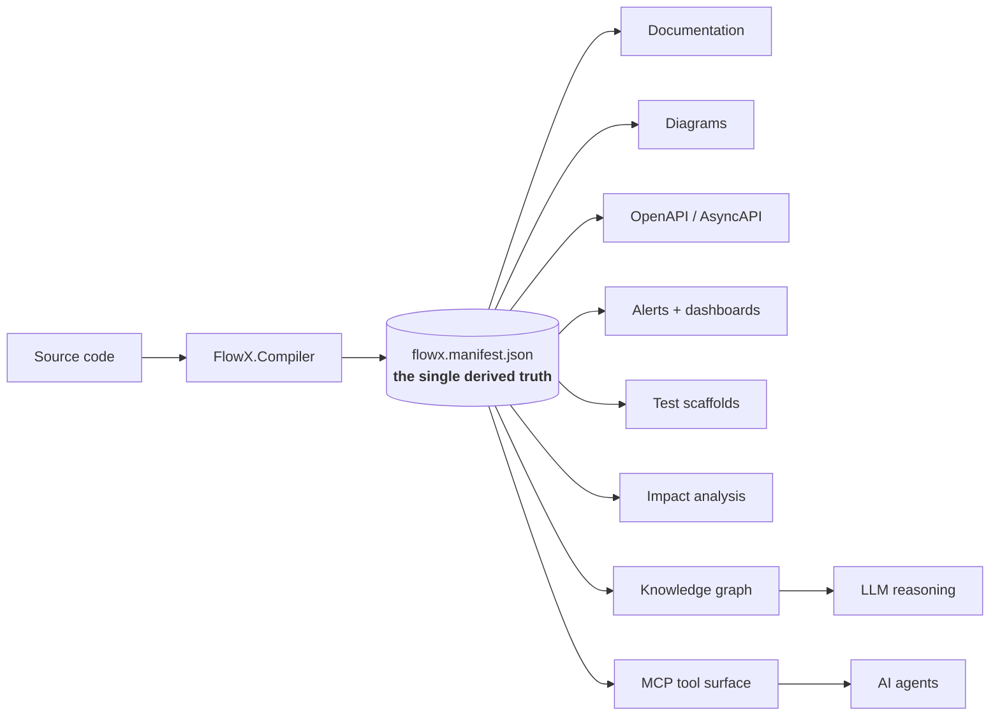
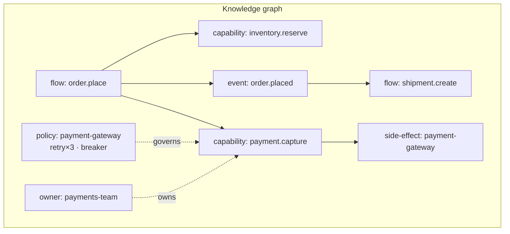
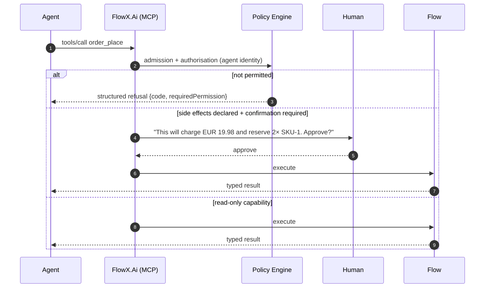

# 13 — AI-Native Architecture

> **Status:** Accepted · **the manifest ships; everything built on it does not** ·
> **Audience:** architects, AI engineers
> **Answers:** what does "AI-native" mean concretely, beyond a marketing word?

> [!IMPORTANT]
> **The foundation of this document is real and the storey above it is not.**
>
> `flowx.manifest.json` is emitted on every build, validated against a committed
> schema (`ManifestSchemaTests`), checked for completeness
> (`ManifestIsComplete`), scanned for secrets (`ManifestContainsNoSecrets`), and
> diffed for compatibility in CI (`flowx diff`). It carries flows, steps,
> capabilities, contracts, triggers, events, errors, side effects, authorisation
> stances and `[Sensitive]` members. `flowx graph` renders it. That is the
> concrete claim in §1, and it holds.
>
> Of the eleven consumers in the diagram below, **one exists** — diagrams, via
> `flowx graph`. There is no OpenAPI or AsyncAPI generation, no alert or
> dashboard generation, no test scaffolding, no impact analysis, no knowledge
> graph and no MCP tool surface. `flowx query` and `flowx ai …` are not CLI
> verbs; the CLI has four ([22-CLI](22-CLI.md)). `AgentTriggerAttribute` is
> declared in `FlowX.Abstractions` and is read by the compiler into the manifest,
> and nothing serves it — no agent can invoke anything.
>
> Everything past §2 is **P8**, gated behind the manifest v1.0 freeze. The point
> of writing it now is that each consumer is a constraint on what the manifest
> must contain, and adding a field after the freeze is expensive.
>
> *This paragraph used the freeze as a date and never said when it falls, and so did every
> other document that named it.*
> [**ADR-0017**](adr/ADR-0017-manifest-v1-freeze-criteria.md)) *now states the eight
> conditions, none of which holds today. Two bear directly on §3 below: thirteen fields
> the committed schema declares are written by nothing — including the top-level `schemas`
> map that every contract-shaped consumer in §4 would be generated from — and
> `event.schemaVersion` is emitted as the literal* `"1.0.0"` *for every event. The Guarantees
> list under §3 also claims "every node carries `source` and `owner`": no capability entry
> carries either.*

---

## 1. The concrete claim

"AI-native" is meaningless unless it names an artifact. In FlowX it does:

> **AI does not read your code. It reads your graph.**

The compiler emits `flowx.manifest.json` — a complete, versioned, machine-readable
description of every flow, capability, policy, trigger, event, error and side
effect in the application. That file is the interface between the application and
every tool, human and model that needs to reason about it.



Why this matters: an LLM given a typical .NET repository must reconstruct intent
from controllers, DI registrations, handler conventions and message contracts —
expensive, lossy, and confidently wrong at the edges. An LLM given a manifest
receives the architecture as *data*: complete, unambiguous, and current as of the
last build.

---

## 2. Everything is a graph

| Graph | Nodes | Edges | Answers |
|---|---|---|---|
| **Flow graph** | steps | order, branch, compensation | what happens, in what order |
| **Capability graph** | capabilities | co-occurrence in flows | what the business can do |
| **Dependency graph** | capabilities, side-effect targets | uses | what breaks if X is down |
| **Event graph** | flows, event types | emits / triggered-by | how the system reacts to itself |
| **Policy graph** | capabilities, policies | governs | where resilience and authorisation live |
| **Topology graph** | services, transports | communicates-with | deployment reality |
| **Knowledge graph** | all of the above + telemetry + git history | — | the queryable model of the system |



Query examples an engineer can run today, and could not before:

```bash
flowx query "capabilities that touch payment-gateway"
flowx query "flows affected if inventory.reserve fails"
flowx query "capabilities with Authorization=Public and side effects"   # security review
flowx query "flows with Durable profile and no compensation"            # correctness review
flowx query "event order.placed → downstream flows, transitively"
```

---

## 3. The manifest schema

```jsonc
{
  "schemaVersion": "1.0.0",
  "application": { "name": "Ordering", "version": "2.4.0", "commit": "a1b2c3d",
                   "builtAt": "2026-07-30T09:00:00Z" },

  "flows": [{
    "id": "order.place", "version": "1.2.0", "profile": "Durable",
    "deadline": "PT30S",
    "input":  { "type": "Ordering.Contracts.PlaceOrder",       "schema": { "$ref": "#/schemas/PlaceOrder" } },
    "output": { "type": "Ordering.Contracts.OrderPlacedResult","schema": { "$ref": "#/schemas/OrderPlacedResult" } },
    "triggers": [
      { "kind": "Http", "method": "POST", "route": "/api/v1/orders", "idempotent": true },
      { "kind": "Bus",  "transport": "kafka", "topic": "orders.requested", "group": "order-placement" },
      { "kind": "Agent","description": "Place a customer order…", "confirmation": "RequiredForSideEffects" }
    ],
    "steps": [
      { "id": 0, "capability": "order.validate@1.0.0" },
      { "id": 1, "capability": "inventory.reserve@1.0.0", "compensation": "inventory.release@1.0.0",
        "policies": [{ "kind": "Retry", "attempts": 3, "backoff": "exponential-jitter" }] },
      { "id": 2, "capability": "payment.capture@2.1.0",
        "policies": [{ "kind": "Timeout", "value": "PT2S" },
                     { "kind": "CircuitBreaker", "failureRatio": 0.5, "breakDuration": "PT15S" }] },
      { "id": 3, "kind": "Emit", "event": "order.placed@1.0.0" }
    ],
    "errors": ["order.invalid", "inventory.out_of_stock", "payment.declined", "payment.gateway_timeout"],
    "owner": "orders-team", "source": "src/Ordering.Application/PlaceOrder/PlaceOrderFlow.cs:14"
  }],

  "capabilities": [{
    "id": "payment.capture", "version": "2.1.0",
    "input": "Ordering.Contracts.CaptureRequest", "output": "Ordering.Contracts.Capture",
    "authorization": { "mode": "Permission", "value": "payment:capture" },
    "idempotent": true,
    "sideEffects": ["payment-gateway", "payment-ledger"],
    "errors": [
      { "code": "payment.declined",          "category": "Conflict" },
      { "code": "payment.gateway_unavailable","category": "Unavailable" }
    ],
    "owner": "payments-team", "source": "src/…/CapturePayment.cs:21"
  }],

  "events": [{
    "type": "order.placed", "schemaVersion": "1.0.0", "partitionKey": "orderId",
    "producedBy": ["order.place"], "consumedBy": ["shipment.create", "analytics.ingest"]
  }],

  "policies": [{ "name": "payment-gateway", "stages": { "4": ["Timeout","Retry","CircuitBreaker","Bulkhead"] } }],
  "schemas": { "PlaceOrder": { "type": "object", "…": "JSON Schema, generated" } }
}
```

Guarantees:

- **Complete** — `flowx verify --complete` fails the build if anything in code is
  absent from the manifest (quality goal Q3).
- **Versioned** — the schema itself has a SemVer; consumers pin a major.
- **Structure only** — no secrets, no business data. CI scans emitted manifests
  for secret patterns (`ManifestContainsNoSecrets`).
- **Traceable** — every node carries `source` (file:line) and `owner`.

---

## 4. What is generated from it

| Output | Command | Replaces |
|---|---|---|
| Architecture docs | `flowx docs` | hand-written, stale |
| Mermaid / DOT / PlantUML | `flowx graph --format …` | Visio, drawio |
| OpenAPI 3.1 | `flowx generate openapi` | Swashbuckle annotations |
| AsyncAPI 3.0 | `flowx generate asyncapi` | nothing (usually undocumented) |
| Prometheus alerts | `flowx generate alerts` | hand-maintained rules |
| Grafana dashboards | `flowx generate dashboard` | hand-maintained JSON |
| Test scaffolds | `flowx generate tests --flow order.place` | boilerplate |
| MCP tool descriptors | `flowx generate mcp` | bespoke agent wiring |
| C4 model (Structurizr DSL) | `flowx generate c4` | manual modelling |
| SBOM of capabilities | `flowx generate sbom` | nothing |

None of these are maintained by hand. That is the point: **there is exactly one
place where the architecture is stated, and it is the code.**

---

## 5. AI-assisted engineering

`flowx ai` is an optional, pluggable layer (`IAiProvider` — Anthropic, OpenAI,
Azure OpenAI, local). It receives the manifest, not the repository.

| Command | Input | Output | Human role |
|---|---|---|---|
| `flowx ai review --flow order.place` | flow subgraph + policies | risk findings: missing compensation, unsafe retry, missing authorisation | accepts or rejects |
| `flowx ai document --flow order.place` | flow + capability contracts | prose runbook and business description | edits |
| `flowx ai test --capability payment.capture` | contract + error catalogue | property-based test cases including edge/error paths | reviews before merge |
| `flowx ai explain --instance fi_…` | replay history | plain-language incident narrative | validates |
| `flowx ai optimize --flow order.place` | graph + telemetry | "steps 1 and 2 are independent → `Parallel` saves ~40 ms p99" | decides |
| `flowx ai impact --change "payment.capture output +field"` | dependency graph | affected flows, consumers, teams | plans |

### Non-negotiable boundaries

| Rule | Why |
|---|---|
| AI **never** writes to production | it is an advisor, not an operator |
| AI output is a **pull request or a report**, never an auto-applied change | human review is the control |
| AI runs on the **manifest**, not on data | the manifest has no secrets or PII by construction |
| AI suggestions are **labelled** in the diff | reviewers know what to scrutinise |
| The AI layer is **removable** | uninstall `FlowX.Ai` and everything else works identically |

Principle P6 (AI-native) and P11 (secure by default) resolve in exactly one
direction: AI gets structure, never data.

---

## 6. Capabilities as agent tools

A capability already has everything an agent tool needs — a typed input schema, a
typed output schema, an authorisation stance, an idempotency flag, declared side
effects and an error catalogue. The MCP surface is therefore a projection, not an
integration.

```jsonc
// Generated MCP tool descriptor
{
  "name": "order_place",
  "description": "Place a customer order with payment and inventory reservation",
  "inputSchema": { "$ref": "#/schemas/PlaceOrder" },
  "annotations": {
    "idempotent": true,
    "sideEffects": ["inventory-store", "payment-gateway"],
    "requiresPermission": "order:create",
    "confirmationRequired": true
  }
}
```



Three safety properties, all inherited rather than added:

1. **An agent cannot exceed a human's permissions** — authorisation lives on the
   capability (P11), not on the transport.
2. **Confirmation prompts are accurate**, because side effects are declared in
   the capability contract rather than guessed from a function name.
3. **Every agent action is traced, journaled and replayable** exactly like any
   other trigger — including who or what invoked it.

---

## 7. What FlowX does not claim

| Not claimed | Reality |
|---|---|
| AI writes your business logic | it drafts; you own correctness |
| AI designs your architecture | it critiques a design you made |
| AI operates production | it explains; humans act |
| The manifest makes the system self-healing | it makes the system *knowable*; healing is still engineering |
| An LLM can replace the compiler | the compiler is the source of truth; the LLM is a reader |

The honest summary: FlowX does not make AI smarter. It makes the **application
legible**, which is the actual bottleneck in every AI-assisted engineering
workflow today.

---

**Next:** [14 — Performance](14-Performance.md)
