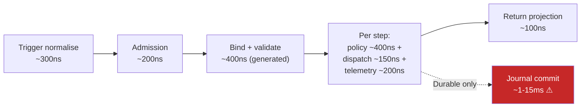
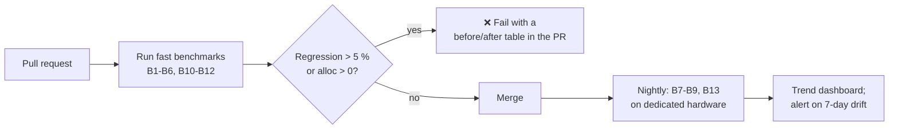

# 14 — Performance

> **Status:** Accepted · **Audience:** runtime contributors, performance engineers
> **Answers:** what are the budgets, how are they measured, and what is done to hold them?

---

## 1. Rule zero — budget, measure, optimise

FlowX publishes budgets *before* implementation, measures them in CI on every
pull request, and fails the build on regression. Nothing here is aspirational.

### 1.1 Platform budgets (overhead attributable to FlowX, excluding user code and I/O)

| # | Scenario | Metric | Budget | Gate |
|---|---|---|---|---|
| B1 | 4-step ephemeral flow, in-proc | p50 / p99 overhead | **1.5 µs / 5 µs** | CI, ±5 % |
| B2 | 4-step ephemeral flow | allocations per step | **0 B** (payload excluded) | CI, hard 0 |
| B2p | ephemeral flow containing a `Parallel` | allocations per **fork** | **≈ 240 B/branch + 70 B**, ceiling 2 048 B | CI, recorded |
| B3 | Capability dispatch | p99 | **150 ns** | CI |
| B4 | Policy chain (timeout+retry+breaker, no failure) | p99 overhead | **400 ns** | CI |
| B5 | Telemetry with exporter attached | per step | **200 ns** | CI |
| B6 | Telemetry with no listener | per step | **0 ns / 0 B** | CI, hard 0 |
| B7 | Durable step commit (Postgres, group commit) | p99 | **15 ms @ 5 000 commits/s/node** | nightly load test |
| B8 | Flow instance rehydration from journal | p99 | **8 ms** | nightly |
| B9 | HTTP trigger end-to-end (trivial flow, localhost) | p99 | **1.2 ms** | nightly |
| B10 | Cold start, NativeAOT, ready-to-serve | — | **200 ms** | CI |
| B11 | Idle RSS, 100 flows registered | — | **60 MB** | CI |
| B12 | Build overhead vs identical non-FlowX code | **+46.6 %** at 50 flows · **+77 %** at 200 — [B12-scale.md](benchmarks/B12-scale.md) | **+8 %** | **FAILING** — relative gate in [generator-cost-gate.md](benchmarks/generator-cost-gate.md) |
| B13 | Streaming throughput, 1 KB records, 8 partitions | sustained | **250 000 rec/s/node** | nightly |

> [!IMPORTANT]
> **The B12 row read `+0.4 %`, linked only [B12.md](benchmarks/B12.md), and read
> as a comfortably-met budget. It was neither current nor representative.**
>
> `+0.4 %` is real, and it is the figure for the **one-flow reference sample**,
> measured before the capability error catalogue existed. B12.md itself names why
> that number does not travel: the generator's cost scales with the number of
> *flows*, a compilation's cost scales with the number of *files*, and a one-file
> project maximises the generator's share in a known direction.
> [B12-scale.md](benchmarks/B12-scale.md) is the document that measures the
> budget at realistic sizes, and this table never linked it.
>
> At scale the budget is **missed, not met**: **+46.6 %** [+42.8, +51.3] at 50
> flows, **+77 %** at the 200-flow figure that is P1's stated exit criterion —
> against **+8 %**. About 85 % of the per-flow cost is `FlowPlanGenerator`, and
> the bulk of that is `SemanticModel.GetTypeInfo` calls made by
> `ErrorCatalogueReader`: deriving the `errors` field means binding the code it
> is derived from. [ADR-0014](adr/ADR-0014-derived-error-catalogue-vs-build-budget.md)
> is the open decision about which of the two — the field or the budget — gives
> way.
>
> **The Gate column also over-claimed.** The absolute `+8 %` check compared the
> build against a budget the project was already failing by ten points, so it
> read identically before and after a 4.9× regression and never fired. It has
> been replaced by a **relative** gate against a committed baseline, blocking on
> every pull request, which gates *bytes allocated by the generator* rather than
> wall clock — over twelve identical runs wall clock moved by 139 % and
> allocation by 0.069 %. See
> [generator-cost-gate.md](benchmarks/generator-cost-gate.md). A green relative
> gate does **not** mean B12 is met; it means the build did not get worse than
> the last recorded baseline, which is still failing.
>
> Quote `+0.4 %` and a scale figure together or neither. The same generator
> produces both, and which one applies depends entirely on how many flows the
> project has.

**B2p is a recorded figure, not a budget that was aimed at.** B2 stays a hard zero and
still means what it always meant — the linear, conditional and switch paths allocate
nothing per step, and `EngineAllocationTests` fails the build if any of them ever does.
A `Parallel` is the first shape that cannot honour it: running several branches at once
needs a linked `CancellationTokenSource`, a `Task` per branch and the awaiters behind them,
and there is no arrangement of those that costs nothing. Measured in Release on .NET 10
x64: **792 B** for a three-branch fork and **552 B** for a two-branch one, so about 240 B
per branch on roughly 70 B of fixed cost. Nothing scales with the number of *steps* a
branch runs, and that is the property the test defends — an absolute ceiling alone would
still pass if a branch started allocating per step.

### 1.2 Measurement discipline

| Tool | Used for |
|---|---|
| BenchmarkDotNet | B1–B6, B10–B12 — allocation and nanosecond-scale budgets |
| NBomber + HDR histograms | B7–B9, B13 — throughput and tail latency |
| `dotnet-counters` / `dotnet-trace` | GC pauses, thread-pool starvation, lock contention |
| `dotnet-gcdump` | leak hunting in long-running durable workloads |
| `perf` + flame graphs | Linux-native hot path verification |

Load tests use **open-loop** generators and report percentiles from HDR
histograms. Closed-loop generators hide coordinated omission, which is precisely
how "our p99 is 8 ms" becomes a 4-second production tail.

**Only the first row is in use.** BenchmarkDotNet runs today, driven by
`scripts/run-benchmarks.sh` and gated by `scripts/check-benchmark-budgets.py`.
NBomber, `dotnet-counters`, `dotnet-gcdump` and `perf` are not wired into
anything in this repository — they are the intended tooling for B7–B9 and B13,
which have no harness because the subsystems they measure are not built. The
paragraph above is a commitment about how load tests will be run, not a
description of a run that has happened.

---

## 2. Where the time goes



The dominant term in a durable flow is the journal write — four orders of
magnitude above everything else. This is why execution profiles exist
([ADR-0003](adr/ADR-0003-execution-profiles.md)): making every flow durable makes
every flow pay a millisecond-scale tax it usually does not need.

### The optimisation ladder, applied

Per the standard ordering — fewer round trips, less work, less waiting, less
allocation — FlowX's design choices map as follows:

| Rank | Lever | FlowX mechanism |
|---|---|---|
| 1 | Fewer round trips | Group-committed journal writes; batched outbox publishing; `Batch` policy coalescing capability calls; per-tenant cache |
| 2 | Less work per request | Compiled execution plan (no graph building, no DI resolution per step); generated binders and serialisers; pre-resolved telemetry tag arrays |
| 3 | Less waiting | Async end-to-end, no sync-over-async anywhere; bounded concurrency via bulkheads; connection pooling in adapters; `Parallel` steps |
| 4 | Less allocation | Pooled `FlowContext`; `readonly record struct` envelopes and results; `ReadOnlySpan<StepPlan>` iteration; struct log scopes; `ArrayPool` for payload buffers |

Rank 4 is deliberately last. It matters here only because FlowX is a *platform*:
its overhead is multiplied by every flow in every service in the estate, so a
100 ns saving in the step loop is real money at scale. Application code should not
imitate this discipline without measuring first.

---

## 3. Hot-path rules for `FlowX.Runtime`

These are enforced by review, analyzers and the allocation benchmarks:

| Rule | Rationale |
|---|---|
| No LINQ on the step loop | allocates enumerators and closures |
| No `async` state machine where `ValueTask` completes synchronously | avoid a task allocation per step for cached/fast paths |
| No `string.Format`/interpolation in logging | allocation on a path that is usually not exported |
| No dictionary lookup per step | plan indices are integers resolved at compile time |
| No delegate allocation per invocation | generated static dispatch, cached delegates |
| No boxing of `Result<T>` | generic all the way through the policy chain |
| No `lock` on the step loop | single-writer per instance, guaranteed by the lease |
| `ConfigureAwait(false)` everywhere in library code | avoids context capture cost |
| Pool and reset, never allocate-and-collect, for per-flow objects | keeps Gen0 pressure flat under load |

### The context pool

```csharp
// FlowContext is rented, reset and returned. Under sustained load the steady
// state is zero Gen0 allocations attributable to the platform.
var ctx = _contextPool.Rent();
try { return await ExecuteAsync(plan, ctx, ct); }
finally { _contextPool.Return(ctx); }   // Reset() clears state bag and scopes
```

The pool is bounded. Exhaustion under overload sheds load (429) rather than
growing unbounded — backpressure over buffering.

---

## 4. Tail latency

p99 is not "p50, but bigger". It is governed by different causes, and each has a
countermeasure in the design:

| Tail cause | FlowX countermeasure |
|---|---|
| GC pauses | zero steady-state allocation on the hot path; Server GC + concurrent by default; pooled contexts keep Gen0 flat |
| Lock convoys | single-writer per instance (lease); lock-free bounded channels for handoff |
| Cold caches / cold JIT | NativeAOT eliminates JIT warm-up; plan is static data; connections pre-warmed at readiness |
| Retry storms | full-jitter backoff + retry budget + circuit breakers |
| Head-of-line blocking | per-partition processing; terminal errors dead-lettered, never retried in place |
| Slow dependency saturating threads | bulkhead per capability, bounded concurrency |
| Journal contention | group commit, `SKIP LOCKED` outbox reads, tenant sharding |
| Coordinated omission in our own tests | open-loop load generation, HDR histograms |

Optional `Hedge` policy for read-heavy, idempotent, high-tail dependencies:
issue a second attempt after p95, take the first response, cancel the loser.
Cheap tail reduction — but only for idempotent capabilities, which the compiler
enforces.

---

## 5. Scaling characteristics

| Dimension | Scales with | Ceiling | Mitigation at the ceiling |
|---|---|---|---|
| Ephemeral throughput | CPU cores | CPU | horizontal replicas (linear) |
| Durable throughput | journal write capacity | ~20–50k commits/s per Postgres primary | tenant sharding, time partitioning, move flows to Ephemeral |
| Stream throughput | broker partitions | partition count | repartition |
| Suspended instances | storage rows | storage | archival plugin |
| Concurrent flows/node | memory | bounded by pool size | replicas + load shedding |
| Trigger fan-out | broker | broker | broker scaling |

Horizontal scaling is linear for ephemeral flows because nodes share nothing.
Durable flows scale linearly until the journal saturates — which is a documented,
measured, monitored boundary (risk R5), not a surprise.

---

## 6. Performance vs. maintainability ledger

Every optimisation carries a price. These are the ones FlowX accepted and
rejected:

| Optimisation | Gain | Complexity cost | Verdict |
|---|---|---|---|
| Compile-time plan instead of runtime graph | −80 % dispatch overhead, AOT support | High (source generators — risk R1) | ✅ core to the value proposition |
| Pooled context | −1 alloc/flow, flat Gen0 | Medium (reset discipline, leak risk) | ✅ platform-level, multiplied everywhere |
| `readonly record struct` for envelope/result | −2 allocs/flow | Low | ✅ |
| Group-commit journal | 5–10× durable throughput | Medium (batching, partial failure handling) | ✅ |
| Binary journal payloads (MessagePack) instead of JSON | −20 % commit time | Medium (debuggability lost — journals stop being human-readable) | ⚠️ opt-in, JSON default |
| Custom thread scheduler for step execution | −10 % p99 under contention | Very high (interacts with the whole .NET ecosystem) | ❌ not justified |
| Unsafe/pointer-based state bag | −50 ns/step | Very high (memory safety) | ❌ |
| Skipping the journal for "probably safe" steps | −1 ms/step | Correctness loss | ❌ never — correctness is not a tuning knob |

---

## 7. Application-level guidance

The platform's budgets are not your application's budgets. What actually
determines your latency:

| Priority | Guidance |
|---|---|
| 1 | **Choose the right profile.** `Durable` on a read query costs ~1 000× the platform overhead for zero benefit. |
| 2 | **Watch the I/O in your capabilities.** A single un-indexed query dwarfs the entire platform overhead by four orders of magnitude. |
| 3 | **Use `Parallel` for independent steps.** Sequential steps that do not depend on each other are the most common avoidable latency in flows. |
| 4 | **Set realistic deadlines.** Three retries of a 30 s step timeout inside a 10 s flow deadline is arithmetically incoherent — the analyzer warns (`FLOWX1019`). *This example used to read "a 30 s flow deadline with 2 s step timeouts and 3 retries", which is **coherent**: 3 × 2 s = 6 s fits inside 30 s with room to spare, so the row illustrated the rule with a case the rule does not fire on. The figures above are `FlowDeadlineAttribute`'s own — "the classic 3 retries × 30 s timeout inside a 10 s SLA" — and [FLOWX1019](diagnostics/FLOWX1019.md)'s worked example uses them too.* It counts only the step timeouts the compiler can read and ignores retry backoff, so its number is a floor, not an estimate. *The flow deadline itself is enforced at run time — the engine checks it at every step boundary. The step timeouts it is compared against are not: no policy executes ([10](10-Policy-Framework.md), **P4**), so a step can overrun its declared timeout and only the flow deadline stops it.* |
| 5 | **Cache at the capability boundary**, with `Scope = Tenant`, only on side-effect-free capabilities. |
| 6 | **Do not micro-optimise your capabilities** until a profile says so. The platform is fast so that your business code can be readable. |

---

## 8. Benchmark suite and CI gating

```
tests/FlowX.Benchmarks/
├── Budgets.cs                         # the budgets above, as constants
├── EngineBenchmarks.cs                # B1  (B2 is asserted by EngineAllocationTests)
├── DispatchBenchmarks.cs              # B3
├── StepLoopBenchmarks.cs              # B1 (shape-by-shape)
└── CompilerBenchmarks.cs              # B12
```

**Five of the eight files this listing used to show do not exist**, and neither
do the budgets they were supposed to measure: there is no
`PolicyChainBenchmarks` (B4) because no policy executes at run time, no
`TelemetryBenchmarks` (B5, B6) because nothing emits telemetry, no
`JournalBenchmarks` (B7, B8) because there is no journal, no
`EndToEndHttpBenchmarks` (B9), no `StartupBenchmarks` (B10, B11) and no
`StreamingBenchmarks` (B13). `EphemeralDispatchBenchmarks` was never the name;
the file that measures B1/B2 is `EngineBenchmarks.cs`, and `Budgets.cs` carries
the same distinction in code — only the budgets measurable today appear as
constants, and the rest are listed as unmeasurable with the work package that
makes them real.

**So B4–B11 and B13 have no gate.** They are budgets stated in advance, which is
[rule zero](#1-rule-zero--budget-measure-optimise) working as intended, and they
become measurable with P2 (B7, B8), P3 (B9), P4 (B4), P5 (B5, B6), P7 (B13) and
the AOT publish job (B10, B11). The five rows in
[21 §7](21-Quality-Gates.md#7-performance-gates) that name them as gated are
naming a schedule, not a running check.



Benchmark results are committed as a baseline file, so a regression shows up as a
diff a reviewer can read — not as a number in a log nobody opens. Any deliberate
budget change requires an ADR.

---

**Next:** [15 — Security](15-Security.md)
