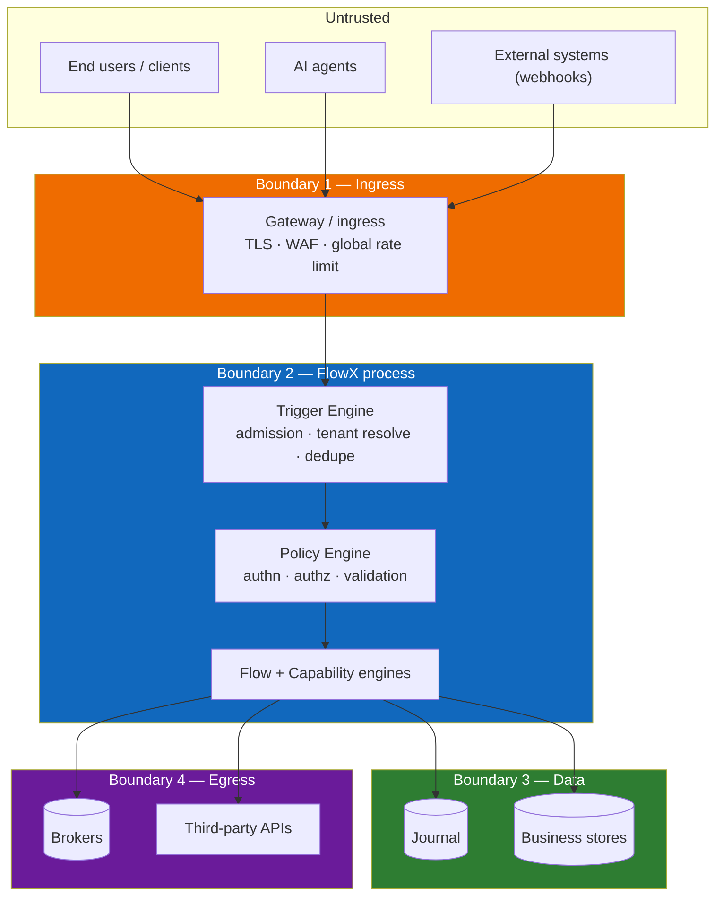
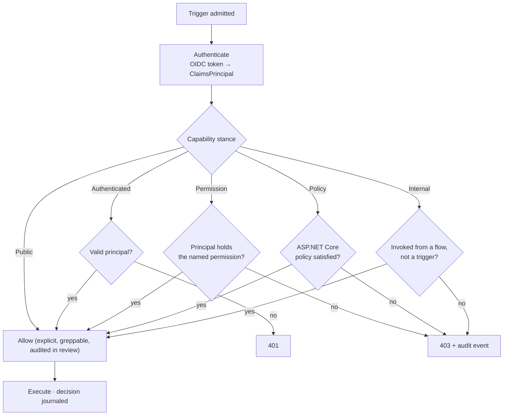

# 15 — Security

> **Status:** Accepted · **Audience:** security engineers, architects
> **Answers:** what is the trust model, where are the boundaries, and what does the platform guarantee?

---

## 1. Security posture

| Principle | FlowX implementation |
|---|---|
| **Deny by default** | a capability without an authorisation stance fails the build (`FLOWX1010`); the stance it declares is decided before the step is dispatched ([§4.1](#41-what-of-that-diagram-executes)) |
| **Authorise the operation, not the URL** | the stance lives on the capability, so it survives transport changes |
| **Zero trust between components** | every hop authenticates; no "internal network is safe" assumption |
| **Least privilege** | capabilities declare the permission they need; nothing is implicitly granted |
| **Defence in depth** | admission → identity → integrity, before any business code runs |
| **Auditable by construction** | every capability invocation is journaled with principal, tenant and decision |
| **No secrets in derived artifacts** | manifest and telemetry carry structure only, verified in CI |

---

## 2. Trust boundaries

---

## 3. STRIDE per boundary

### Boundary 1 — Ingress

| Threat | Vector | Mitigation |
|---|---|---|
| **S**poofing | forged tokens, replayed webhooks | OIDC validation with JWKS rotation; webhook signature verification (HMAC + timestamp window) in the trigger plugin |
| **T**ampering | modified payload in transit | TLS 1.3 mandatory; signature check before admission |
| **R**epudiation | "I never sent that" | correlation id + principal + envelope hash journaled at admission |
| **I**nformation disclosure | verbose errors leaking internals | RFC 7807 bodies expose `type`, `title`, `detail`, `traceId` only; stack traces never cross the boundary |
| **D**enial of service | flood, oversized payloads, zip bombs | payload size cap, decompression ratio cap, global + per-tenant rate limits, connection limits, load shedding at pool exhaustion |
| **E**levation of privilege | claim injection via headers | headers are **never** trusted for identity; only validated token claims populate `Principal` |

### Boundary 2 — FlowX process

| Threat | Vector | Mitigation |
|---|---|---|
| **S** | one tenant acting as another | `TenantId` derived from the validated token, never from the payload; cross-tenant access is a `Forbidden` + audit event |
| **T** | mutating another flow's state | `FlowContext` is per-instance and pooled-with-reset; cross-flow state sharing is architecturally absent |
| **R** | disputed business action | journal records principal, tenant, input hash, decision and timestamp per step |
| **I** | cache leakage across tenants/principals | cache key includes tenant **and** permission set; `Scope = Tenant` default; `FLOWX1018` blocks caching side-effecting capabilities |
| **D** | one tenant starving others | per-tenant quotas and bulkheads at admission (stage 1, before any work) |
| **E** | reaching an internal capability from outside | `Authorization.Internal` capabilities are unreachable from any trigger and excluded from the agent surface |

### Boundary 3 — Data

| Threat | Vector | Mitigation |
|---|---|---|
| **T** | journal tampering | append-only tables; `UPDATE`/`DELETE` revoked for the application role; fencing tokens reject stale writers |
| **I** | PII in journal or replay | `[Sensitive]` fields redacted by the generated serialiser before persistence; encryption at rest; field-level encryption plugin for regulated data |
| **R** | untraceable data change | every write is attributable to an instance, step, principal and tenant |
| **D** | journal exhaustion | per-tenant storage quota, retention policy, archival |
| **E** | SQL injection in a capability | capability's responsibility; FlowX's own SQL is fully parameterised, and this is a mandatory review item in the capability checklist |

### Boundary 4 — Egress

| Threat | Vector | Mitigation |
|---|---|---|
| **S** | outbound call to a spoofed host | mTLS or pinned certificates; allow-listed egress hosts declared as `SideEffects` |
| **I** | secrets in outbound logs/traces | redaction applied to span attributes and log fields; CI scan for secret patterns in emitted telemetry |
| **T** | published event tampering | broker TLS + ACLs; optional event signing |
| **R** | disputed emission | outbox row is the record: payload, key, time, instance |
| **D** | outbound retry storm amplifying a partner outage | retry budgets + circuit breakers are mandatory on external capabilities (`FLOWX1023` warns when absent) |

---

## 4. Authorisation model

Because the stance is on the capability, the answer to *"who can capture a
payment?"* is a single manifest query — over HTTP, Kafka, cron and agent
invocations simultaneously. That is quality requirement QR9, and it is the
security property that transport-attached authorisation can never provide.

### 4.1 What of that diagram executes

**Until P4 the answer was "none of it".** The stance was declared, published to
`flowx.manifest.json`, compared by `flowx diff`'s `FLOWX-DIFF-015` and made mandatory by
`FLOWX1010` and `FLOWX1030` — and a grep of `src/FlowX.Runtime` and `src/FlowX.Hosting` for
`Authorization`, `Permission` or `Authorize` returned nothing at all. `samples/ecommerce`
declared `Permission = "payment.write"` on `payment.capture` and captured payments for
anonymous callers.

| Stance | What the runtime does |
|---|---|
| `Public` | **Decided.** Permits, as an explicit branch rather than an absence |
| `Authenticated` | **Decided.** Refuses an invocation whose principal is absent or unauthenticated |
| `Permission` | **Decided.** Refuses a principal not holding the named grant, read from a `permission`, `permissions`, `scope` or `scp` claim |
| `Internal` | **Decided, and it permits.** See below |
| `Policy` | **Not enforceable.** [`FLOWX1037`](diagnostics/FLOWX1037.md) refuses it at build time |

The check runs in `FlowEngine`'s step loop, before the dispatch and outside the retry loop,
gated by `ExecutionPlan.HasAuthorizedSteps` — [ADR-0027](adr/ADR-0027-authorisation-runs-in-the-step-loop.md).
Identity arrives on `FlowInvocation` as the `ClaimsPrincipal` the transport resolved from
validated claims — [ADR-0028](adr/ADR-0028-identity-arrives-on-the-invocation.md).

**Three corrections to the diagram above**, each of which is a decision rather than a gap:

- **The `401` is a `403`.** `ErrorCategory` is a closed set with no authentication member, and
  opening it would change the transport mapping for every existing consumer. The *codes* stay
  distinct — `authorization.not_authenticated` and `authorization.permission_denied` — and a
  `401` would in any case be malformed, because the engine is transport-agnostic and has no
  `WWW-Authenticate` challenge to name. [ADR-0029](adr/ADR-0029-a-refusal-is-a-result-failure.md).
- **`Internal`'s "no" branch is unreachable.** It asks *"invoked from a flow, not a trigger?"*,
  and in FlowX a trigger addresses a **flow** and never a capability — `[HttpTrigger]` is
  declared on a `Flow<,>` ([ADR-0004](adr/ADR-0004-universal-trigger-model.md)). Every
  capability invocation that exists is reached from a flow's step loop, so the stance is
  satisfied by construction of the trigger model rather than by a check. `samples/workflow`
  settles it beyond argument: `OnboardEmployeeFlow` is HTTP-triggered and calls
  `hardware.order`, `equipment.assign` and `welcome.send` — all three `Internal` — as ordinary
  forward steps. The stance's other half, exclusion from the agent tool surface, is a
  compile-time concern and that surface does not exist yet.
- **There is no audit event.** `Audit` is a stage-7 policy that
  [ADR-0025](adr/ADR-0025-a-partial-policy-engine-executes-stage-four-alone.md) leaves
  unexecuted, and no store persists one. A refusal is a returned `Error` and appears in
  whatever the host logs.

**A compensation is not authorised**, and a resumed instance is authorised by whoever resumes
it rather than by whoever started it — the journal row carries no claims, deliberately, so a
week-old grant cannot authorise today's payment. Both are argued in
[ADR-0027 §2.4](adr/ADR-0027-authorisation-runs-in-the-step-loop.md) and
[ADR-0028 §2.2](adr/ADR-0028-identity-arrives-on-the-invocation.md).

---

## 5. Multi-tenant isolation

Summarised here, detailed in [16-Multi-Tenant](16-Multi-Tenant.md):

| Layer | Control |
|---|---|
| Identity | `TenantId` from validated claims only |
| Admission | per-tenant rate limit and quota, before any work |
| Execution | tenant is ambient in `FlowContext`, propagated to every step |
| Data | tenant is the journal partition key; row-level security in Postgres |
| Cache | tenant in every cache key, by default |
| Telemetry | tenant label, cardinality-capped |
| Residency | tenant → region binding for regulated deployments |

`CrossTenantAccessTest` — *in a conformance suite that does not exist, under a
name the fitness functions spell `CrossTenantAccessIsDenied`* — is to attempt a
cross-tenant read through every trigger kind and assert a `Forbidden` plus an
audit event.

**Status: designed, not built.** Of the seven layers above, one and a half exist —
`TenantId` is resolved from validated claims at the HTTP boundary and carried on the
invocation, and *Identity* is now whole rather than half, because the principal the tenant was
derived from is carried too and is decided against ([§4.1](#41-what-of-that-diagram-executes)).
Nothing consumes the tenant in the way this table needs: **authorisation executes and tenant
isolation does not**, and they are separate claims. No admission quota, no cache, and no
row-level security. *This sentence also said there is no journal; since WP-52 a
`Durable` flow's instance row carries `tenant_id` — an execution record, not the audit
event this test asserts, and no store persists it.* The table describes P4 and P6; see
[21 §2.4](21-Quality-Gates.md) for what the gate is blocked on.

---

## 6. Secrets and configuration

| Rule | Mechanism |
|---|---|
| No secrets in source, config files or the manifest | CI secret scanning; `ManifestContainsNoSecrets` test — **both run** |
| Secrets come from a provider | `ISecretProvider` — Key Vault, Secrets Manager, Vault, Kubernetes Secrets. **Not declared:** the interface does not exist in `src/`; a capability resolves its own secrets today |
| Rotation without restart | providers support change notification; capabilities receive current values per invocation — **not built**, same reason |
| No secrets in telemetry | redaction in the generated serialiser + CI fixture scan — **not built.** No telemetry is emitted and redaction is not generated; see [12 §4](12-Observability.md) |
| Least-privilege runtime identity | workload identity / managed identity; no long-lived credentials in the pod — **deployment guidance**, and there are no deployment assets in this repository ([18](18-Cloud-Native.md)) |

---

## 7. AI and agent security

The highest-risk new surface, and the reason the model is conservative:

| Risk | Control |
|---|---|
| Prompt injection causes an unintended action | the agent can only call capabilities it is *authorised* for; injection cannot create permissions |
| Agent escalates beyond its user | agent identity is a first-class principal with its own permission set — typically a subset of the user's |
| Agent takes an irreversible action | `SideEffects` are declared, so `ConfirmationMode.RequiredForSideEffects` prompts with **accurate** consequences |
| Agent exfiltrates data | capabilities returning sensitive data require an explicit permission; `[Sensitive]` fields are redacted in the agent-visible result |
| Untraceable agent actions | every agent invocation is journaled with the agent identity, prompt id and full replay |
| AI tooling reads production data | `flowx ai` operates on the **manifest** (structure), never on payloads |

The load-bearing sentence: **an agent is just another trigger, subject to the
same authorisation as a human.** No parallel permission system exists to get out
of sync.

---

## 8. Supply chain

| Control | Implementation |
|---|---|
| SBOM | CycloneDX generated per build, published with the release |
| Dependency policy | Apache-2.0-compatible only; no copyleft (C6); automated licence scan |
| Pinned dependencies | lock files committed; Dependabot with review required |
| Signed artifacts | NuGet package signing + Sigstore attestation |
| Reproducible builds | deterministic compilation enabled; SourceLink |
| Plugin trust | plugins declare required permissions; the host can restrict a plugin's capability surface |
| CVE response | documented SLA — critical 48 h, high 7 days |

---

## 9. Compliance support

FlowX does not make an organisation compliant. It provides the evidence
mechanisms that compliance work needs:

| Requirement | Mechanism |
|---|---|
| Audit trail (SOX, PCI-DSS 10) | journal + `Audit` policy: who, what, when, outcome, immutable |
| Data minimisation (GDPR 5) | `[Sensitive]` redaction; per-flow journal retention |
| Right to erasure (GDPR 17) | tenant/subject-partitioned journal + `flowx purge --subject <id>` |
| Purpose limitation (GDPR 6) | `Consent` policy at stage 2 |
| Data residency | tenant → region binding; region-local journals |
| Access review | manifest query: every capability with its permission and owner |
| Change control | `flowx diff` + ADR requirement on breaking changes |

---

## 10. Security testing in CI

| Test | Asserts |
|---|---|
| `EveryCapabilityDeclaresAuthorization` | no capability ships without a stance |
| `PublicCapabilitiesAreReviewed` | `Authorization.Public` requires an `[ApprovedBy]` annotation naming the reviewer, and no approval outlives the stance it approved |
| `NoPermissiveDefaults` | nothing on the contract surface reaches a permissive stance by omission |
| `SuppressionsAreAccountable` | every suppression names a registered, unexpired debt id (§6.1 of [21](21-Quality-Gates.md)) |
| `ManifestContainsNoSecrets` | pattern scan over emitted manifests, matching the shape of a secret rather than a list of forbidden words |
| `CrossTenantAccessIsDenied` | isolation across every trigger kind — **not yet enforced.** *Its authorisation half is no longer blocked: a stance is decided at run time since P4 ([§4.1](#41-what-of-that-diagram-executes)). What remains is that nothing compares the invocation's tenant against the data a capability reads, which is the isolation this gate is actually about, and no audit event exists to assert.* Blocked on tenant isolation and, for "every trigger kind", on P3's second transport. *It was also blocked on the P2 journal; that half expired at WP-52, and the gate did not move* — see [21 §2.4](21-Quality-Gates.md) |
| `SensitiveFieldsAreRedacted` / `RedactionCannotBeBypassed` | `[Sensitive]` never appears in logs, traces, journal or replay output — **not yet enforced.** *This cell said none of the four sinks exists; the **journal** does, since WP-52.* Redaction there is structural — `JournalPayload.ToJson()` is the only exit and it redacts — but the gate asserts the negative across all four, and logs, traces and replay output are still absent; see [21 §2.4](21-Quality-Gates.md) |
| `ErrorsDoNotLeakInternals` | no stack traces, connection strings or type names in RFC 7807 bodies — **not written.** The property holds by construction today (`ProblemDetailsMapper` builds the body from `Error.Code`, `Category` and redacted detail, and never sees an exception), and `ProblemDetailsMapperTests` covers that mapping. Nothing asserts the *negative* |
| `ExternalCapabilitiesHaveResilience` | outbound calls carry timeout + breaker — **not written**, and the id cited was wrong: `FLOWX1023` is "flow declares no steps". No diagnostic requires a policy on a capability with side effects, and no policy executes at run time. **P4** |
| `DependencyLicencesAreCompatible` | no non-Apache-2.0-compatible dependency, declared or transitive — **runs**, `DependencyLicenceTests`. Every `PackageReference` in every tree, and every package in the resolved graph NuGet writes to `obj/project.assets.json`, must have a row in the [dependency licence register](DEPENDENCIES.md) carrying a licence that document classifies as permissive against [ADR-0012](adr/ADR-0012-apache-2-license.md)'s definition. Rows are re-read against each package's own `.nuspec` on every run, so a licence that changes on a version bump is caught even though the register records no versions. The single exception is machine-checked rather than asserted: a non-permissive licence is tolerated only where the resolved graph shows the package contributing no assembly at all — which is how `SonarAnalyzer.CSharp` (SONAR Source-Available Licence) and `Microsoft.NETCore.Platforms` 1.1.0 (a proprietary Microsoft EULA, not MIT) are here at all. **What it cannot see is [written down](DEPENDENCIES.md#3-what-this-gate-cannot-see)**: a `.nuspec` that misstates its own licence, code vendored inside a package, the closure of the three projects outside `FlowX.slnx`, and everything that is not a NuGet package reference — the shared framework, and the npm, pip and `dotnet tool` packages CI installs. `AbstractionsHasNoDependencies` is still not this gate: it proves the core has nothing to scan, which is a different claim about a different project |
| SAST (CodeQL) + secret scanning | on every pull request — **runs**, `security.yml` |
| DAST against the sample apps | nightly — **conditional.** `security.yml` runs ZAP against `samples/ecommerce` only, and skips with a message when it is not runnable. `samples/banking`, named in [21 §4.1](21-Quality-Gates.md#41-why-dast-runs-against-samples) as the *primary* target, is a `README.md` and nothing else |

---

## 11. Known limitations

Stated plainly, because unstated limitations are how breaches happen:

| Limitation | Consequence | Compensating control |
|---|---|---|
| FlowX cannot enforce security *inside* a capability | a capability can still write a SQL injection | mandatory capability review checklist + SAST |
| The journal contains business inputs by design | replay can expose data to operators | field redaction, encryption at rest, RBAC on replay, audited access |
| Compensation is best-effort | a failed compensation leaves inconsistent state | alert + operator runbook + explicit `CompensationFailed` state |
| Plugins execute in-process | a malicious plugin has process-level access | plugin signing, review, permission declaration; process isolation is a v2 item |
| A durable flow's authorisation is discontinuous across a wait | the steps before a suspension point are decided against the caller who started it, the steps after against whoever delivered the signal — so "who authorised this transfer" has two answers | deliberate: the journal keeps no claims, so a grant proved a week ago cannot authorise today's payment ([ADR-0028 §2.2](adr/ADR-0028-identity-arrives-on-the-invocation.md)). A timer sweep and a recovery scan carry no caller at all and are not re-decided, which is what keeps `.Delay` usable before a stanced step |
| A compensation runs unauthorised | an undo with side effects heavier than the step it reverses is not separately authorised | deliberate: refusing an undo leaves standing the inconsistent state it exists to remove, and the caller was authorised for the step that made the mess ([ADR-0027 §2.4](adr/ADR-0027-authorisation-runs-in-the-step-loop.md)) |
| Agent confirmation depends on accurate `SideEffects` | a mis-declared capability produces a misleading prompt | side effects are a review item; the analyzer warns when a capability with I/O declares none |

---

**Next:** [16 — Multi-Tenancy](16-Multi-Tenant.md)
