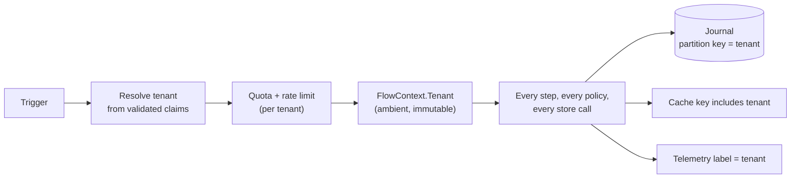
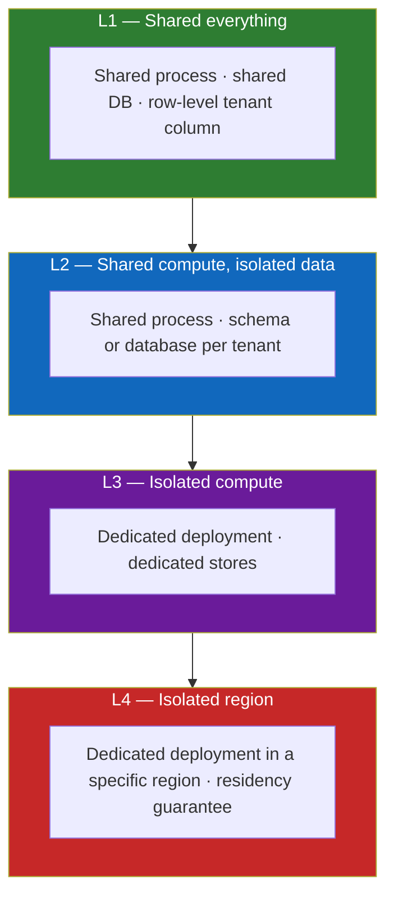
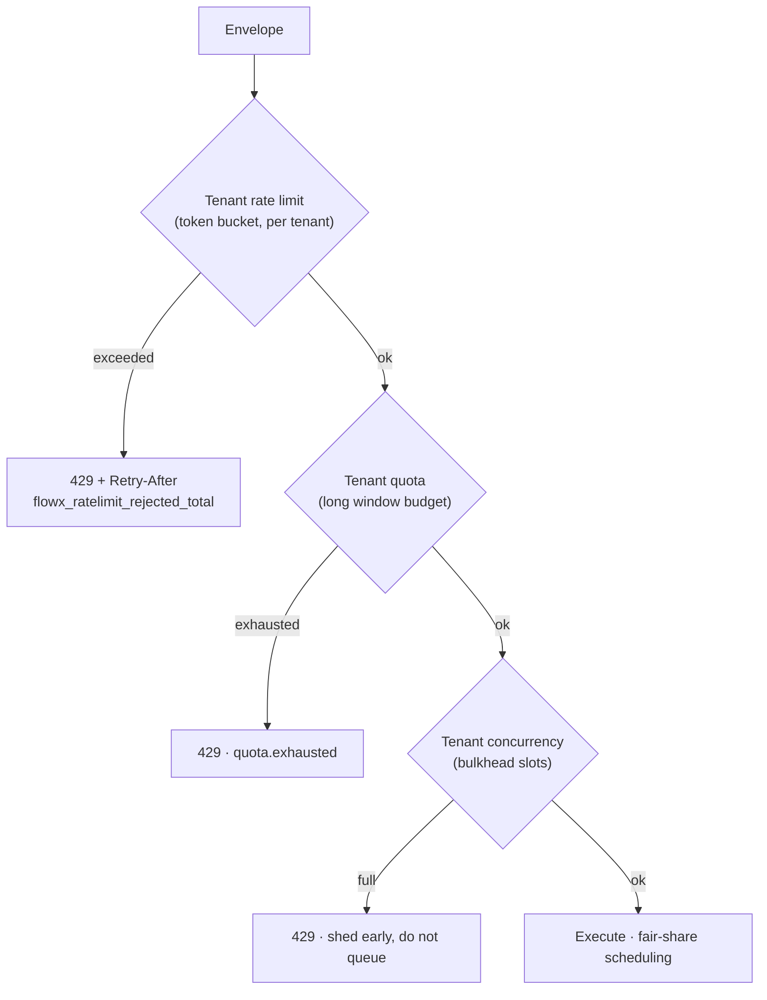
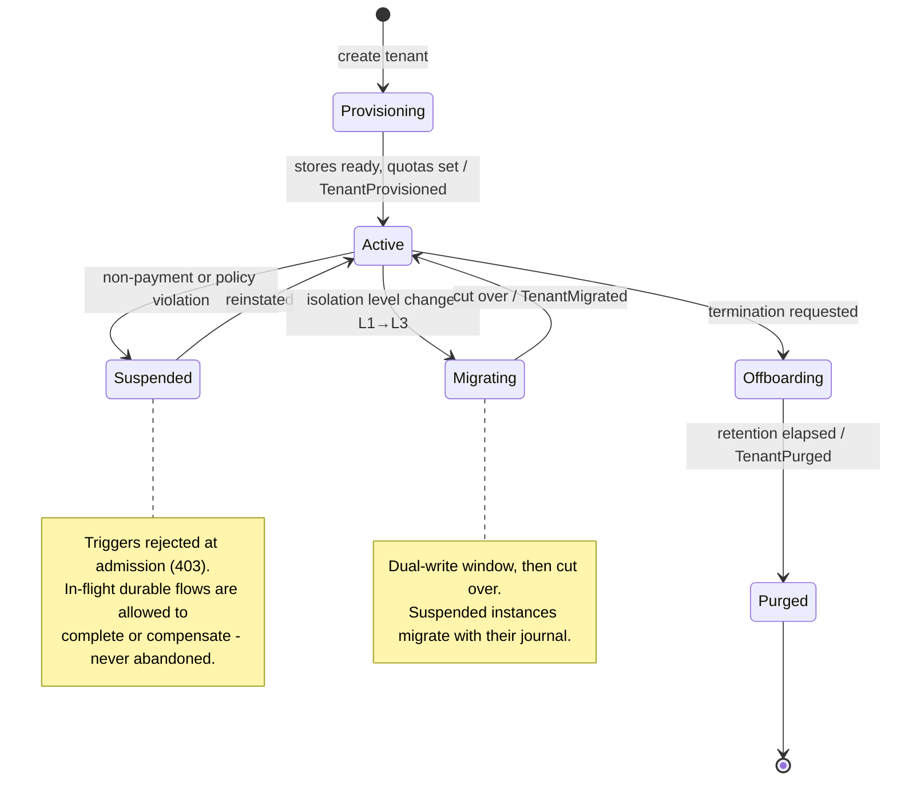

# 16 — Multi-Tenancy

> **Status:** Accepted as a specification · **one of seven layers exists** ·
> **Audience:** platform engineers, SaaS architects
> **Answers:** what isolation levels exist, and what does the platform guarantee at each?

> [!WARNING]
> **The platform currently guarantees nothing about tenant isolation.** What
> exists: `TenantId` is read from validated claims at the HTTP boundary
> (`HttpTriggerReader`) and carried on `TriggerHeaders` and the flow context.
> **Nothing consumes it.** There is no admission control, no quota, no rate
> limit, no journal to partition, no cache to key, no telemetry to label and no
> residency binding — so every isolation level in §2 is currently the same level,
> and it is "none enforced by the platform".
>
> `ITenantResolver` and `ITenantStoreResolver` are not declared anywhere;
> `CrossTenantAccessIsDenied` is not written and is recorded as blocked in
> [21 §2.4](21-Quality-Gates.md#24-gates-named-here-but-not-yet-enforced). The
> layers land with **P4** (admission, quotas, cache) and **P6** (journal
> partitioning, RLS, residency, the fairness test).
>
> An application built on FlowX today must enforce its own tenant scoping inside
> its capabilities. That is exactly the `WHERE TenantId = @t` this document opens
> by warning about, and saying so is better than letting the opening paragraph
> imply otherwise.

---

## 1. Tenancy is a platform concern, not an application concern

In most .NET codebases, tenancy is a `WHERE TenantId = @t` that someone forgets
once, in one query, and that omission is the incident. FlowX makes the tenant
**ambient and mandatory**: it is resolved at admission, carried in
`FlowContext`, used as the journal partition key, included in every cache key,
and attached to every telemetry record — without application code participating.



---

## 2. Isolation levels

One size does not fit all — a free tier and a regulated bank cannot share a
model. FlowX supports four levels, selectable per tenant.



| Level | Isolation | Cost/tenant | Noisy neighbour | Residency | Typical tenant |
|---|---|---|---|---|---|
| **L1** Shared everything | logical (RLS + partition key) | lowest | mitigated by quotas | shared region | free / SMB |
| **L2** Shared compute, isolated data | schema or DB per tenant | low-medium | mitigated by quotas | per-DB placement possible | mid-market |
| **L3** Isolated compute | dedicated deployment | high | none | per-deployment | enterprise |
| **L4** Isolated region | dedicated + region-pinned | highest | none | guaranteed | regulated / public sector |

**The same application code runs at every level.** Only configuration and
deployment topology change — because tenancy never appears in flow or capability
logic. A tenant can be promoted from L1 to L3 without a code change; that is the
design's main payoff.

---

## 3. Tenant resolution

```csharp
public interface ITenantResolver
{
    ValueTask<TenantId?> ResolveAsync(in TriggerEnvelope envelope, CancellationToken ct);
}
```

| Trigger kind | Default source | Never |
|---|---|---|
| HTTP / gRPC | `tenant_id` claim in the validated token | a header, a query string, or the body |
| Bus | message header set by a FlowX producer, or the message key | untrusted payload fields |
| Schedule | the schedule's declared tenant (fan-out for all-tenant jobs) | — |
| Stream | partition key mapping | — |
| Agent | agent identity's tenant binding | the model's assertion |

**Rule:** the tenant is never read from anything the caller can freely set. A
resolver returning a tenant not present in validated claims fails
`CrossTenantAccessTest`. Unresolvable tenant → rejected at admission with an
audit event, before a flow instance exists.

---

## 4. Fairness — the noisy-neighbour problem

Quality goal Q8: one tenant saturating its quota degrades others by ≤ 10 % p99.



| Mechanism | Scope | Purpose |
|---|---|---|
| Token-bucket rate limit | per tenant | smooth bursts |
| Quota | per tenant, long window | commercial fairness (plan limits) |
| Bulkhead | per tenant | bounded concurrency; one tenant cannot consume all slots |
| Weighted fair queueing | across tenants | a large tenant cannot starve small ones |
| Per-tenant circuit breaker | tenant × capability | one tenant's bad downstream does not trip everyone |
| Journal write budget | per tenant | protects the shared durable store |

All limits are enforced at **stage 1 (Admission)** — before authentication,
before any allocation, before any journal write. Rejecting expensively is how
rate limiting becomes the DoS.

---

## 5. Data isolation

### L1 — row level

```sql
-- Journal tables carry tenant_id as the partition key.
ALTER TABLE flow_instance ENABLE ROW LEVEL SECURITY;
CREATE POLICY tenant_isolation ON flow_instance
  USING (tenant_id = current_setting('flowx.tenant_id'));
```

The runtime sets `flowx.tenant_id` on the connection for the duration of the
flow. Defence in depth: even a capability with a bug cannot read another tenant's
rows, because the database refuses.

### L2 — schema/database per tenant

`ITenantStoreResolver` maps `TenantId` → connection. Connection pools are
per-tenant and bounded, so a tenant with 10 000 idle connections is impossible.

### L3/L4 — deployment per tenant

The manifest is identical; only Helm values, store endpoints and region differ.
The control plane tracks which manifest version runs for which tenant.

---

## 6. Tenant-aware platform behaviour

| Subsystem | Tenant behaviour |
|---|---|
| **Journal** | `tenant_id` is the partition key; retention configurable per tenant |
| **Cache** | tenant in every key by default; `CacheScope.Global` requires an explicit, reviewed opt-in |
| **Idempotency store** | keys namespaced by tenant — two tenants may legitimately use the same key |
| **Scheduler** | a cron flow may run per-tenant (fan-out) or once globally; jitter spreads tenant fan-out |
| **Outbox** | events carry `tenant_id`; topic-per-tenant or header-based routing |
| **Streams** | partition assignment may be tenant-affine for locality |
| **Telemetry** | tenant label, cardinality-capped with an `other` bucket |
| **Config** | per-tenant policy *parameter* overrides (limits, TTLs) — never graph changes |
| **Feature flags** | per-tenant flag evaluation at admission, surfaced in the trace |

---

## 7. Tenant lifecycle



`flowx tenant` commands drive this: `provision`, `suspend`, `migrate`,
`offboard`, `purge`. Purge satisfies GDPR erasure by removing journal rows,
outbox rows, cache entries and idempotency records for the tenant, and emits a
signed completion certificate.

---

## 8. Per-tenant observability

| Question | Answer source |
|---|---|
| Which tenant is causing the latency spike? | `flowx_flow_duration_seconds{tenant}` |
| Is a tenant being throttled? | `flowx_ratelimit_rejected_total{tenant}` |
| What is a tenant's usage this month? | quota counters → billing export |
| Is a tenant's data isolated? | `CrossTenantAccessTest` in CI + RLS policy audit |
| What is a tenant's error budget burn? | per-tenant SLO dashboards, generated from the manifest |

Cardinality is bounded: the tenant label is enabled only for tenants with a
contractual SLO; everything else aggregates into `other`. Unbounded tenant labels
are how a metrics backend dies.

---

## 9. Anti-patterns

| Anti-pattern | Consequence | Instead |
|---|---|---|
| Reading tenant from a request header | trivial cross-tenant access | validated claims only |
| Passing `TenantId` as a capability input parameter | someone will pass the wrong one | ambient in `FlowContext` |
| Global cache without tenant in the key | cross-tenant data leak | `CacheScope.Tenant` default |
| Global-only rate limiting | one tenant starves all | per-tenant limits |
| Tenant-specific branches in flow logic | unmaintainable; multiplies test surface | per-tenant policy parameters or feature flags |
| Connection pool shared across L2 tenants | pool exhaustion by one tenant | bounded per-tenant pools |
| Unbounded tenant cardinality in metrics | metrics backend outage | allow-list + `other` bucket |

---

**Next:** [17 — Plugin System](17-Plugin-System.md)
