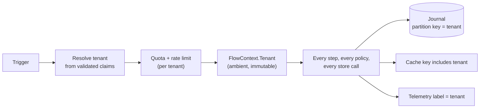
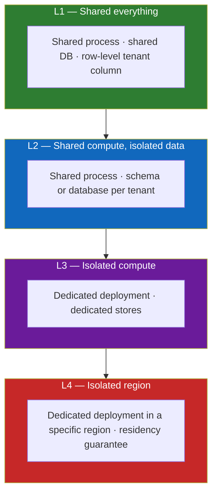
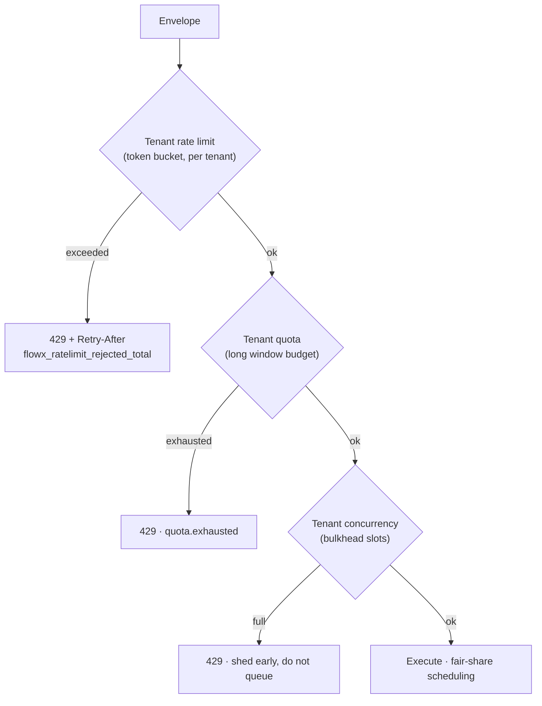
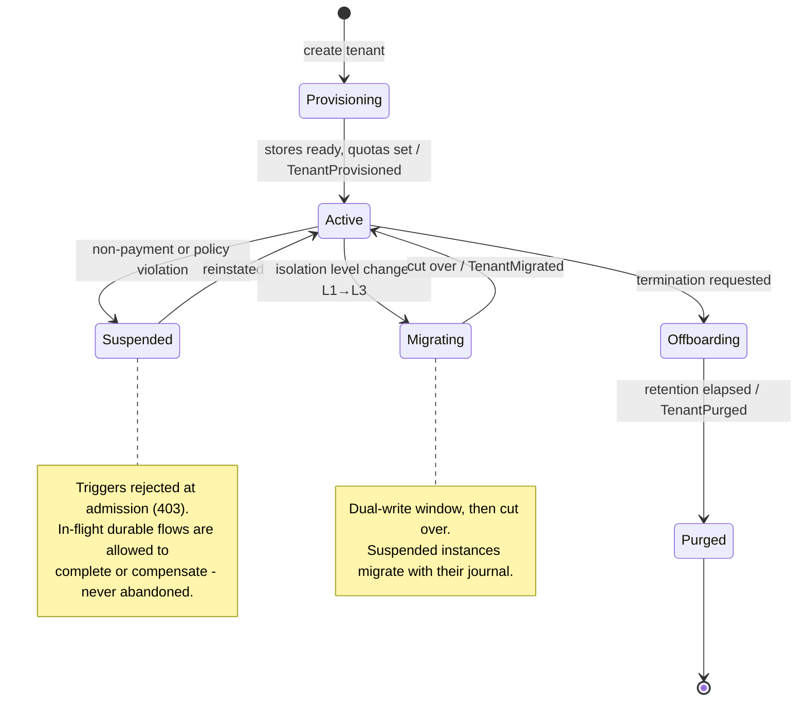

# 16 — Multi-Tenancy

> **Status:** Accepted as a specification · **row isolation, schema isolation and fairness are enforced;
> the residency layer is not** ·
> **Audience:** platform engineers, SaaS architects
> **Answers:** what isolation levels exist, and what does the platform guarantee at each?

> [!IMPORTANT]
> **Row-level isolation and §4's fairness are enforced; most of the rest of this document
> is not.** `FlowXOptions.Fairness` is where a deployment turns the second on, and it is
> off by default, because a single-tenant deployment must not pay for it.
>
> A deployment setting `FlowXOptions.TenantIsolation = TenantIsolation.Row` gets:
> `ITenantResolver` deriving the tenant from validated claims at admission and **refusing**
> a call that names none or names one the claims do not support (§3); every journal
> connection bound to the resolved tenant; and PostgreSQL row-level security refusing what
> the runtime somehow did not (§5, migration `0006`). Tenant *A* cannot read, resume or
> recover tenant *B*'s instance — asserted in both directions against a real database, and
> through the recovery scan and the timer sweep as well as the ordinary path.
> [ADR-0046](adr/ADR-0046-a-tenant-is-resolved-at-admission.md) records the decisions,
> **including three places where §5's DDL does not isolate as written**.
>
> *This box previously said the platform "guarantees nothing about tenant isolation", that
> `TenantId` was carried and "nothing consumes it", and that `ITenantResolver` was "not
> declared anywhere". Those expired on 2026-08-02. Two earlier corrections it carried remain
> accurate: `plugins/FlowX.Postgres` has persisted `tenant_id` on the instance row since
> WP-53, and `PostgresRecoveryIndex` could always filter on it — the runtime now passes that
> filter.*
>
> **Still not built**, and every one of them is a real gap rather than a detail:
> no cache or idempotency
> store to key (§6); no residency binding, so L4 is a deployment convention; and
> `TenantIsolation.Database` is **declarable and refused at startup** — it names a deployment
> per tenant, whose pod declares `None`
> ([ADR-0051](adr/ADR-0051-database-isolation-is-a-topology-not-a-runtime-level.md)).
> `TenantIsolation.Schema` **is enforced** as of 2026-08-02, and at that level the outbox
> publisher and the change feed both fan out across tenant schemas
> ([ADR-0054](adr/ADR-0054-a-platform-trigger-attests-its-tenant.md)).
> Nothing partitions or shards the
> journal — [11 §6](11-Distributed-Runtime.md) names sharding and stops, so building it would
> be invention.
>
> §3's non-claim tenant sources are built: a change carries the tenant whose schema and
> emitting instance it was read from, a bus message carries a field its publisher wrote, and
> `[CronTrigger(PerTenant = true)]` fans out over an `ITenantDirectory`. A trigger that cannot
> name a tenant **holds its work** rather than losing it — the change cursor does not advance
> and the message is not acknowledged.

---

## 1. Tenancy is a platform concern, not an application concern

In most .NET codebases, tenancy is a `WHERE TenantId = @t` that someone forgets
once, in one query, and that omission is the incident. FlowX makes the tenant
**ambient and mandatory**: it is resolved at admission, carried in
`FlowContext`, used as the journal partition key, included in every cache key,
and attached to every telemetry record — without application code participating.



---

## 2. Isolation levels

One size does not fit all — a free tier and a regulated bank cannot share a
model. FlowX supports four levels, selectable per tenant.



| Level | Isolation | Cost/tenant | Noisy neighbour | Residency | Typical tenant |
|---|---|---|---|---|---|
| **L1** Shared everything | logical (RLS + partition key) | lowest | mitigated by quotas | shared region | free / SMB |
| **L2** Shared compute, isolated data | schema or DB per tenant | low-medium | mitigated by quotas | per-DB placement possible | mid-market |
| **L3** Isolated compute | dedicated deployment | high | none | per-deployment | enterprise |
| **L4** Isolated region | dedicated + region-pinned | highest | none | guaranteed | regulated / public sector |

**The same application code runs at every level.** Only configuration and
deployment topology change — because tenancy never appears in flow or capability
logic. A tenant can be promoted from L1 to L3 without a code change; that is the
design's main payoff.

---

## 3. Tenant resolution

```csharp
public interface ITenantResolver
{
    TenantResolution Resolve(in FlowInvocation invocation);
}
```

*This signature was `ValueTask<TenantId?> ResolveAsync(in TriggerEnvelope, CancellationToken)`
until it was built. Three changes, argued in
[ADR-0043 §2.1–2.2](adr/ADR-0046-a-tenant-is-resolved-at-admission.md): it takes the
`FlowInvocation` because `FlowHost` — the one point every activation passes through — never
sees a `TriggerEnvelope`; it returns a **`TenantResolution`** rather than a nullable, because
"refused" and "this deployment does not isolate" must not be the same value; and it is
synchronous, because I/O at admission is what §4 warns against.*

| Trigger kind | Default source | Never |
|---|---|---|
| HTTP / gRPC | `tenant_id` claim in the validated token | a header, a query string, or the body |
| Bus | message header set by a FlowX producer, or the message key | untrusted payload fields |
| Schedule | the schedule's declared tenant (fan-out for all-tenant jobs) | — |
| Stream | partition key mapping | — |
| Agent | agent identity's tenant binding | the model's assertion |

**Rule:** the tenant is never read from anything the caller can freely set. A
resolver returning a tenant not present in validated claims fails
`CrossTenantAccessTest`. Unresolvable tenant → rejected at admission with an
audit event, before a flow instance exists.

---

## 4. Fairness — the noisy-neighbour problem

Quality goal Q8: one tenant saturating its quota degrades others by ≤ 10 % p99.



| Mechanism | Scope | Purpose |
|---|---|---|
| Token-bucket rate limit | per tenant | smooth bursts |
| Quota | per tenant, long window | commercial fairness (plan limits) |
| Bulkhead | per tenant | bounded concurrency; one tenant cannot consume all slots |
| Weighted fair queueing | across tenants | a large tenant cannot starve small ones |
| Per-tenant circuit breaker | tenant × capability | one tenant's bad downstream does not trip everyone |
| Journal write budget | per tenant | protects the shared durable store |

The first five are enforced at **stage 1 (Admission)** — before authentication,
before any allocation, before any journal write. Rejecting expensively is how
rate limiting becomes the DoS.

The journal write budget is the exception, and it has to be: a flow's row count
is not a property of its plan — a `ForEach`, a retry and a backward jump each
write rows the graph does not count — so admission has no figure to charge. It
is spent where the rows are, a block of credit at a time so that the shared
bucket is not consulted per commit, and an exhausted tenant is **paced rather
than refused**, because a refused commit halfway through a durable flow strands
a saga instead of applying backpressure
([ADR-0055](adr/ADR-0055-a-write-budget-is-drawn-in-blocks-and-paces-rather-than-refuses.md)).

---

## 5. Data isolation

### L1 — row level

```sql
ALTER TABLE flow_instance ENABLE ROW LEVEL SECURITY;
ALTER TABLE flow_instance FORCE  ROW LEVEL SECURITY;
CREATE POLICY flow_instance_tenant_isolation ON flow_instance
    USING      (tenant_id IS NOT DISTINCT FROM nullif(current_setting('flowx.tenant_id', true), ''))
    WITH CHECK (tenant_id IS NOT DISTINCT FROM nullif(current_setting('flowx.tenant_id', true), ''));
```

The runtime sets `flowx.tenant_id` on the connection **and narrows itself to the
unprivileged `flowx_tenant` role** for the duration of the flow. Defence in depth: even a
capability with a bug cannot read another tenant's rows, because the database refuses.

> [!WARNING]
> **The three-line version this section used to give isolates nothing.** It read
> `ENABLE ROW LEVEL SECURITY` plus
> `USING (tenant_id = current_setting('flowx.tenant_id'))`, and applied verbatim it returns
> every tenant's rows to the account that runs the migrations. Each correction above is
> load-bearing:
>
> 1. **A superuser bypasses RLS unconditionally, and a table's owner bypasses it without
>    `FORCE`.** That is the ordinary connection for a journal. Hence `FORCE`, and hence the
>    `flowx_tenant` role — without the role narrowing, `FORCE` protects nothing either.
> 2. **`current_setting(name)` raises `42704` when the setting is absent**, so every
>    statement on an unscoped connection would error. The two-argument form returns `NULL`.
> 3. **`=` is wrong for a nullable partition key.** Single-tenant rows carry
>    `tenant_id IS NULL`, and `NULL = NULL` is `NULL`, which a policy reads as *no*.
>    `IS NOT DISTINCT FROM` means what the `=` was written to mean; `nullif(…, '')` folds the
>    two spellings of "no tenant" together, because `RESET` restores a custom setting to the
>    empty string rather than to `NULL`.
>
> `flow_step` and `outbox_event` carry no `tenant_id` and inherit the instance's through the
> foreign key. `flow_lease` is deliberately **not** isolated: a lease is acquired before the
> instance row exists, so a policy joining the two would refuse the first acquisition of every
> instance. See [ADR-0043 §2.6](adr/ADR-0046-a-tenant-is-resolved-at-admission.md).

### L2 — schema/database per tenant

Connection pools are per-tenant and bounded, so a tenant with 10 000 idle
connections is impossible — and, more to the point, so a pooled connection has no
other tenant to carry a `search_path` to. The schema is in each tenant's
**connection string**, never in a `SET` issued per borrow.

*This paragraph named an `ITenantStoreResolver` until 2026-08-02. None was declared:
`ITenantScopedJournal.ForTenant` is already the per-tenant seam, so the map is
`PostgresTenantStores` inside the adapter and the abstraction gained one property —
`ITenantScopedJournal.Isolation` — which is how a host refuses a level its store
cannot serve.
[ADR-0051](adr/ADR-0051-database-isolation-is-a-topology-not-a-runtime-level.md).*

### L3/L4 — deployment per tenant

The manifest is identical; only Helm values, store endpoints and region differ.
The control plane tracks which manifest version runs for which tenant.

---

## 6. Tenant-aware platform behaviour

| Subsystem | Tenant behaviour |
|---|---|
| **Journal** | `tenant_id` is the partition key; retention configurable per tenant |
| **Cache** | tenant in every key by default; `CacheScope.Global` requires an explicit, reviewed opt-in |
| **Idempotency store** | keys namespaced by tenant — two tenants may legitimately use the same key |
| **Scheduler** | a cron flow may run per-tenant (fan-out) or once globally; jitter spreads tenant fan-out |
| **Outbox** | events carry `tenant_id`; topic-per-tenant or header-based routing |
| **Streams** | partition assignment may be tenant-affine for locality |
| **Telemetry** | tenant label, cardinality-capped with an `other` bucket |
| **Config** | per-tenant policy *parameter* overrides (limits, TTLs) — never graph changes |
| **Feature flags** | per-tenant flag evaluation at admission, surfaced in the trace |

---

## 7. Tenant lifecycle



`flowx tenant` commands drive this: `provision`, `suspend`, `migrate`,
`offboard`, `purge`. Purge satisfies GDPR erasure by removing journal rows,
outbox rows, cache entries and idempotency records for the tenant, and emits a
signed completion certificate.

---

## 8. Per-tenant observability

| Question | Answer source |
|---|---|
| Which tenant is causing the latency spike? | `flowx_flow_duration_seconds{tenant}` |
| Is a tenant being throttled? | `flowx_ratelimit_rejected_total{tenant}` |
| What is a tenant's usage this month? | quota counters → billing export |
| Is a tenant's data isolated? | `CrossTenantAccessTest` in CI + RLS policy audit |
| What is a tenant's error budget burn? | per-tenant SLO dashboards, generated from the manifest |

Cardinality is bounded: the tenant label is enabled only for tenants with a
contractual SLO; everything else aggregates into `other`. Unbounded tenant labels
are how a metrics backend dies.

---

## 9. Anti-patterns

| Anti-pattern | Consequence | Instead |
|---|---|---|
| Reading tenant from a request header | trivial cross-tenant access | validated claims only |
| Passing `TenantId` as a capability input parameter | someone will pass the wrong one | ambient in `FlowContext` |
| Global cache without tenant in the key | cross-tenant data leak | `CacheScope.Tenant` default |
| Global-only rate limiting | one tenant starves all | per-tenant limits |
| Tenant-specific branches in flow logic | unmaintainable; multiplies test surface | per-tenant policy parameters or feature flags |
| Connection pool shared across L2 tenants | pool exhaustion by one tenant | bounded per-tenant pools |
| Unbounded tenant cardinality in metrics | metrics backend outage | allow-list + `other` bucket |

---

**Next:** [17 — Plugin System](17-Plugin-System.md)
