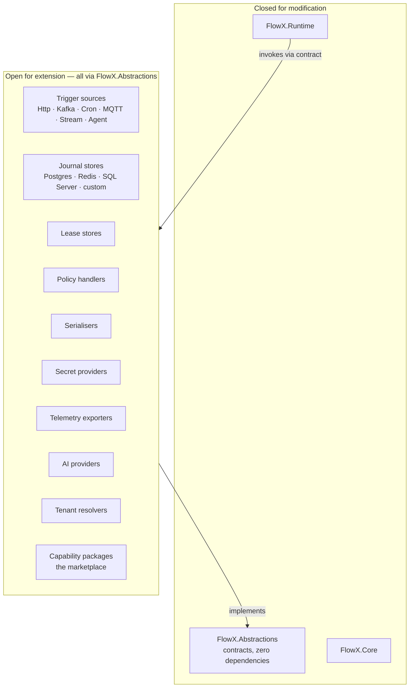
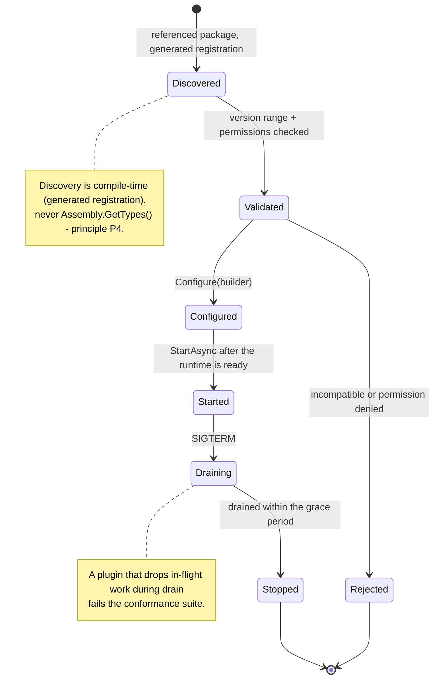

# 17 — Plugin System

> **Status:** Accepted as a specification · **one extension point, two of six conformance suites** ·
> **Audience:** plugin authors, platform engineers
> **Answers:** what can be extended, against what contract, and how is compatibility guaranteed?

> [!WARNING]
> **Almost none of the extension surface below is declared yet.**
> `ITriggerSource`, `ITriggerSink`, `IEventPublisher`, `IIdempotencyStore`,
> `IPayloadSerializer`, `IPolicyHandler`, `ISecretProvider`, `ITenantResolver`,
> `IJournalArchiver`, `IAiProvider` and `ICapabilityPackage` do not exist in
> `src/FlowX.Abstractions` or anywhere else. A plugin author cannot compile
> against them today.
>
> **Two do.** `IFlowJournal` and `ILeaseStore` were declared at WP-51, in
> `src/FlowX.Abstractions/Durability/`, with the conformance suites described
> below. Nothing implements them outside a test, and `FlowX.Runtime` does not
> call them: the seam that makes a `Durable` flow use them is WP-52.
>
> There is **one plugin**, `plugins/FlowX.Http`, and it extends FlowX by
> referencing `FlowX.Abstractions` and mapping ASP.NET Core onto
> `TriggerEnvelope` — the pattern this document describes, without the interface
> that would formalise it.
>
> **`FlowX.Conformance.Tests` is two of [§4](#4-compatibility-policy)'s six rows
> and nothing else.**
> `tests/FlowX.Conformance.Tests` holds `JournalConformance` and
> `LeaseStoreConformance`; a store claims conformance by deriving from them and
> supplying itself. `TriggerSourceConformance`, `PublisherConformance`,
> `SerializerConformance` and `PolicyHandlerConformance` are not written, so the
> release-blocking gate in
> [09 §11](09-Trigger-Model.md#11-writing-a-trigger-plugin) is still a statement
> about tests nobody can run.
>
> **It is not published, and it has never met a database.** The project is not
> packable, so "a third party runs `dotnet test` against the suite" describes
> P3's WP-70 rather than anything anyone can do today; the two suites that exist
> have been run against one in-memory reference implementation and against
> deliberately broken stores that they reject by name. Publishing is the named
> mitigation for risks R3 and R8 in
> [05 §11](05-Architecture.md#11-risks-and-technical-debt);
> `PluginsPassConformance` stays blocked in
> [21 §2.4](21-Quality-Gates.md#24-gates-named-here-but-not-yet-enforced),
> because one transport is still one data point.
>
> One rule in this document is enforced today, and it is the load-bearing one:
> `AbstractionsHasNoDependencies` fails the build if `FlowX.Abstractions` gains
> any package or project reference. The contract plugins will depend on stays
> dependency-free by gate, not by intention.

---

## 1. The rule

> If a reasonable person must fork FlowX to do something reasonable, that is a
> bug in FlowX.

Everything above `FlowX.Core` is a plugin, including every first-party
transport. First-party plugins use exactly the same contracts as third-party
ones — no privileged internal APIs, no `InternalsVisibleTo` shortcuts. This is
the only way an extension point stays honest.



---

## 2. Extension contracts

| Contract | Extends | First-party implementations |
|---|---|---|
| `ITriggerSource` | how flows are activated | Http, Grpc, GraphQL, Kafka, RabbitMq, AzureServiceBus, Mqtt, Sqs, Cron, FileWatcher, SignalR, Agent |
| `IEventPublisher` | where events go | Kafka, RabbitMq, ServiceBus, EventHubs, Sns |
| `IFlowJournal` | durable state | PostgreSql, SqlServer, Redis, Cosmos |
| `ILeaseStore` | ownership | Redis, PostgreSql, etcd |
| `IIdempotencyStore` | dedup | Redis, PostgreSql, in-memory |
| `IPolicyHandler` | new cross-cutting rules | all built-ins |
| `IPayloadSerializer` | wire and journal format | SystemTextJson (default), MessagePack, Protobuf |
| `ISecretProvider` | secret retrieval | KeyVault, SecretsManager, Vault, K8sSecrets |
| `ITenantResolver` | tenancy | ClaimsTenantResolver (default) |
| `IAiProvider` | AI features | Anthropic, OpenAI, AzureOpenAI, Local |
| `IJournalArchiver` | cold storage | Blob, S3 |
| `ICapabilityPackage` | shippable capabilities | marketplace packages |

Every contract lives in `FlowX.Abstractions`, which has **zero package
dependencies** (fitness function `AbstractionsHasNoDependencies`). A plugin
therefore never drags the runtime's dependency tree into a consumer.

---

## 3. Anatomy of a plugin

```csharp
public sealed class MqttPlugin : IFlowXPlugin
{
    public PluginDescriptor Descriptor => new(
        Id: "flowx.mqtt",
        Version: new SemVer(1, 0, 0),
        RequiresAbstractions: SemVerRange.Parse("^1.0"),   // compatibility contract
        Provides: [ExtensionPoint.TriggerSource, ExtensionPoint.EventPublisher],
        RequiresPermissions: [Permission.NetworkEgress("mqtt://*")]);

    public void Configure(IPluginBuilder builder)
    {
        builder.AddTriggerSource<MqttTriggerSource>()
               .AddEventPublisher<MqttEventPublisher>()
               .AddOptions<MqttOptions>().ValidateOnStart()
               .AddHealthCheck<MqttHealthCheck>();
    }
}
```



---

## 4. Compatibility policy

| Change to a contract | Allowed in | Mechanism |
|---|---|---|
| Add a new interface | minor | additive |
| Add a member with a default implementation | minor | DIM, so existing plugins still compile |
| Add an optional parameter | minor | overload, not a signature change |
| Rename or remove a member | **major only** | with a 2-minor deprecation window (C7) |
| Change semantics without changing the signature | **major** | the conformance suite is the semantic contract |

The **conformance suite is the real contract.** A signature can stay identical
while behaviour drifts; the suite is what catches that, for first-party and
third-party plugins alike.

```
FlowX.Conformance.Tests            # to be shipped as a NuGet package at WP-70
├── TriggerSourceConformance       # NOT WRITTEN — 7 mandatory tests, see docs/09 §11
├── JournalConformance             # WP-51 · the key incl. scope, fencing, atomicity,
│                                  #   commit order, replay capture, derived resume,
│                                  #   child instances, redacted payloads
├── LeaseStoreConformance          # WP-51 · exclusivity, expiry, monotonic fencing tokens
├── PublisherConformance           # NOT WRITTEN — at-least-once, per-key ordering, DLQ
├── SerializerConformance          # NOT WRITTEN — round-trip, versioning, redaction
└── PolicyHandlerConformance       # NOT WRITTEN — stage placement, deadline, telemetry
```

The two that exist are abstract classes: a store derives, overrides one factory
method and inherits every assertion. Editing the suite to make a store pass is a
disagreement about the contract, not a local fix, which is the property that makes
"the suite is the real contract" mean something.

A third party runs `dotnet test` against the suite and publishes the result — the
same badge first-party plugins carry. No certification committee, no gatekeeping;
a machine-checkable standard. **Not yet available:** the project is a test project
and is deliberately not packable until a second store exists to be held to it, so
there is currently nothing for an outside store to reference or derive from. See
the box at the top of this document.

---

## 5. Plugin permissions

Plugins run in-process, so they are trusted with process-level access. FlowX
narrows that with declaration and enforcement at the host boundary:

```csharp
RequiresPermissions: [
    Permission.NetworkEgress("mqtt://*"),
    Permission.SecretRead("mqtt-credentials"),
    Permission.JournalWrite]          // denied by default
```

```jsonc
// appsettings.json — the host decides
"FlowX": {
  "Plugins": {
    "flowx.mqtt": { "enabled": true, "grant": ["NetworkEgress", "SecretRead"] }
  }
}
```

An ungranted permission fails at **startup**, not on first use. A plugin
requesting `JournalWrite` when it only needs to publish is visible in review
before it ever runs. Process-level plugin isolation (separate AppDomain-style
sandboxing, or out-of-process plugins) is a v2 item — the current honest position
is stated in [15 §11](15-Security.md#11-known-limitations).

---

## 6. Writing a trigger plugin — worked example

```csharp
internal sealed class MqttTriggerSource : ITriggerSource
{
    private readonly IMqttClient _client;
    private readonly MqttOptions _options;

    public TriggerKind Kind => TriggerKind.Bus;

    public async ValueTask StartAsync(ITriggerSink sink, CancellationToken ct)
    {
        // Bounded channel: backpressure, never unbounded buffering (conformance).
        var channel = Channel.CreateBounded<MqttMessage>(
            new BoundedChannelOptions(_options.MaxInFlight) {
                FullMode = BoundedChannelFullMode.Wait });

        _client.OnMessage += async m => await channel.Writer.WriteAsync(m, ct);
        await _client.SubscribeAsync(_options.Topic, ct);

        await foreach (var msg in channel.Reader.ReadAllAsync(ct))
        {
            var envelope = new TriggerEnvelope(
                Kind: TriggerKind.Bus,
                Source: $"mqtt:{msg.Topic}",
                Body: msg.Payload,
                Headers: MqttHeaderMapper.Map(msg),   // trace, tenant, idempotency key
                OccurredAt: msg.Timestamp);

            var result = await sink.DispatchAsync(envelope, ct);

            // Terminal errors are dead-lettered, never retried in place —
            // head-of-line blocking is a bug, not a durability strategy.
            if (result.IsFailure && result.Error.Category.IsTerminal())
                await _deadLetter.PublishAsync(msg, result.Error, ct);
            else if (result.IsSuccess && _options.QoS > 0)
                await _client.AcknowledgeAsync(msg, ct);
        }
    }

    public ValueTask StopAsync(CancellationToken ct) => _client.DrainAndDisconnectAsync(ct);
}
```

The three things every trigger plugin must get right, all conformance-tested:
**bounded buffering**, **header mapping** (trace, tenant, idempotency), and
**drain-not-drop on shutdown**.

---

## 7. Capability packages — the marketplace

A capability package ships business functionality, not infrastructure.

```bash
dotnet add package FlowX.Capabilities.Stripe
flowx graph                     # payment.capture, payment.refund appear immediately
```

Requirements for a publishable capability package:

| Requirement | Why |
|---|---|
| Contract assembly with no dependencies | consumers must not inherit the vendor SDK |
| `[Capability]` metadata: id, version, authorisation, idempotency, side effects | the manifest must be complete (Q3) |
| Declared error catalogue | callers can handle failures without reading the source |
| Conformance tests + a sample flow | proves it works, documents its use |
| SBOM + licence | supply-chain policy (C6) |
| Semantic versioning + a changelog | `flowx diff` depends on it |

Namespacing prevents collisions: first-party `flowx.*`, verified vendors
`stripe.*`, community `community.<owner>.*`. A package cannot claim a capability
id inside another owner's namespace.

---

## 8. What is deliberately not extensible

| Not extensible | Why | If you need it |
|---|---|---|
| Policy **stage order** | the ordering guarantees are the safety property ([ADR-0011](adr/ADR-0011-fixed-policy-stage-order.md)) | `PolicyStage.Custom` within a stage |
| The flow state machine | replay and observability depend on a fixed, known lifecycle | model your states as flow steps |
| `Result<T>` / `ErrorCategory` | the transport mapping table depends on a closed set | add error **codes**, not categories |
| The manifest schema | consumers pin a major version | `extensions` field for custom metadata |
| Telemetry attribute names | estate-wide dashboards depend on stability | add attributes, never rename |
| The trigger→flow contract | universality is the value proposition | plugin-specific options outside the flow |

Extensibility is a design decision, not a default. Every extension point is a
compatibility obligation held forever — so they are chosen, not sprinkled.

---

## 9. Plugin quality checklist

Before publishing:

- [ ] Depends on `FlowX.Abstractions` only — no `FlowX.Runtime` reference
- [ ] Full conformance suite passes for every implemented extension point
- [ ] Bounded resources: no unbounded queue, no unbounded concurrency
- [ ] Drains on shutdown; no message loss or duplication in the SIGTERM test
- [ ] Propagates trace context, tenant, principal and idempotency key
- [ ] Emits telemetry using the standard attribute schema
- [ ] Declares the minimum permissions it needs
- [ ] Options validated at startup (`ValidateOnStart`)
- [ ] Health check implemented and meaningful
- [ ] NativeAOT-compatible (no reflection)
- [ ] SBOM, licence, changelog, sample published
- [ ] Compatibility range declared (`RequiresAbstractions`)

---

**Next:** [18 — Cloud-Native](18-Cloud-Native.md)
