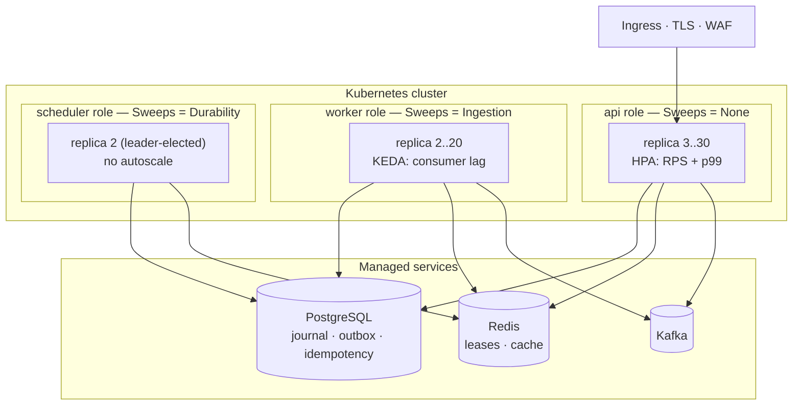
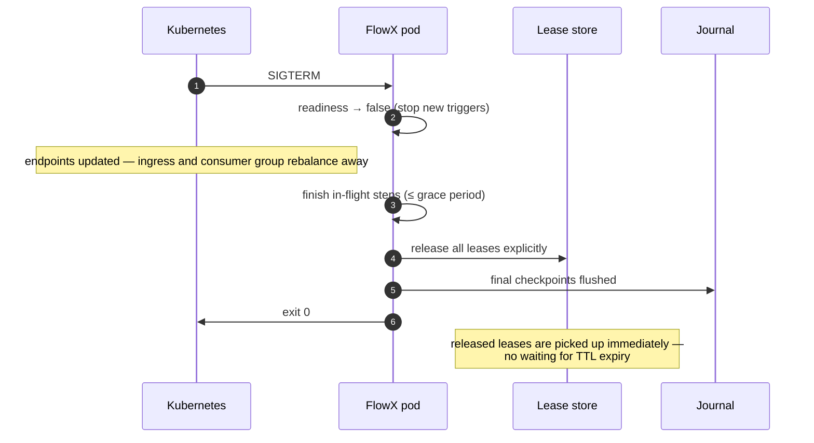
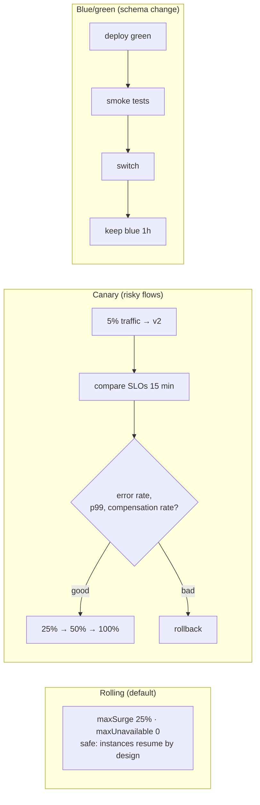

# 18 — Cloud-Native Operations

> **Status:** Accepted as a specification · **no deployment assets exist** ·
> **Audience:** SRE, platform engineers
> **Answers:** how does FlowX deploy, scale, roll out and degrade?

> [!WARNING]
> **This repository contains no Helm chart, no Kubernetes manifest and no KEDA
> scaler.** The three roles in §1 are one image in the sense that they would be;
> nothing builds a role-tagged image. The Checkov IaC scan named in
> [21 §4](21-Quality-Gates.md#4-security-testing-toolchain) has no charts to
> scan. `ConfigurationCannotChangeGraph` is named here as a fitness function and
> is not written — the *property* is real (the graph is emitted as static data at
> build time and no configuration path reaches it) and nothing asserts it.
>
> *This block also said there was no Dockerfile, no journal and no telemetry, and
> that the only readiness signal was `FlowXHealthCheck`. All four stopped being
> true as the runtime was built: `samples/crm` and `samples/crm-web` each carry a
> Dockerfile, the PostgreSQL journal and lease store ship, leases are released
> explicitly on drain as §2 describes, and OpenTelemetry emits the scaling signals
> §3 scales on. The sentences are corrected rather than deleted, because a reader
> who knew the old text needs to see which part changed.*
>
> Read this as the operating model P2, P5 and P9 are built towards.

> [!TIP]
> **Deploying to Azure?** This document is orchestrator-neutral on purpose.
> [28 — Azure Hosting](28-Azure-Hosting.md) scores Functions, App Service,
> Container Apps and AKS against what the runtime actually needs, and maps the
> three roles below onto each of them.

---

## 1. Deployment topology

One image, three roles. The code and the manifest are identical; only the enabled
trigger sources and the scaling signal differ.



| Role | Scaling signal | Why not merged |
|---|---|---|
| `api` | request rate + p99 latency | user-facing latency must not be affected by batch work |
| `worker` | consumer lag / queue depth | scales on a completely different signal |
| `scheduler` | none (leader-elected pair) | scaling a scheduler duplicates firings |

Splitting roles is configuration, not code. A small system may run all three in
one deployment; the manifest is unaffected.

> [!NOTE]
> **These three labels named `FLOWX_TRIGGERS`, and no such variable ever existed.** The
> topology was drawn before anything could express it: each sweep decided whether it
> *could* run — a recovery scan needs a journal — and none could be told whether it
> *should*, so a host with a journal ran every sweep it was capable of.
> `FlowXOptions.Sweeps` is the switch that makes the split real, and
> `HostSweepGateTests` fails the build if a new sweep is added without consulting it. It
> defaults to every sweep, so nothing already deployed changes.

---

## 2. Health and lifecycle

| Probe | Checks | Failure behaviour |
|---|---|---|
| `/health/startup` | plan loaded, generated registrations valid, stores reachable | pod restarts |
| `/health/ready` | accepting triggers, journal writable, broker connected | removed from endpoints; **stops receiving traffic without dying** |
| `/health/live` | process responsive, no deadlock, thread pool not starved | pod restarts |



```yaml
terminationGracePeriodSeconds: 60      # ≥ longest step budget + 10s
lifecycle:
  preStop:
    exec: { command: ["/bin/sh","-c","sleep 5"] }   # let endpoint removal propagate
```

The 5-second `preStop` sleep exists because endpoint propagation is asynchronous;
without it, a pod that already stopped accepting still receives requests for a
moment. This is the single most common cause of "we get 502s during every
deploy".

---

## 3. Autoscaling

```yaml
# api — latency-aware, not just CPU
- type: Pods
  pods: { metric: { name: flowx_flow_duration_seconds_p99 }, target: { averageValue: "300m" } }
# Request rate comes from the ingress, not from FlowX — see the note below.
- type: Object
  object:
    describedObject: { kind: Ingress, name: flowx-api }
    metric: { name: requests_per_second }
    target: { type: Value, value: "200" }

# worker — KEDA on real backlog
triggers:
  - type: kafka
    metadata: { topic: orders.requested, consumerGroup: order-placement, lagThreshold: "100" }
  - type: postgresql
    metadata: { query: "SELECT count(*) FROM flow_instance WHERE state='Pending'", targetQueryValue: "50" }
```

| Signal | Good for | Trap |
|---|---|---|
| CPU | compute-bound flows | I/O-bound flows never trip it |
| Consumer lag | bus workers | lag spikes during rebalance — use stabilisation windows |
| Pending instances | durable backlog | needs an index on `(state, created_at)` |
| p99 latency | user-facing APIs | noisy at low traffic — require a minimum request rate |

> [!CAUTION]
> **The second `api` rule used to read `flowx_trigger_admitted_rate`, and that rule could
> never have fired.** `flowx_trigger_admitted_total` is declared in `TelemetryNames` and
> **nothing produces it** — [12 §3](12-Observability.md#3-metrics) says so at the row, and
> the reason is that a `kind` label needs one admission point serving every transport while
> there is one transport. Copying the old snippet gave you an autoscaler that silently never
> scaled. It is replaced above by request rate from the ingress, which the ingress controller
> does emit.
>
> The other seven instruments all have producers, verified against their call sites:
> `flowx_flow_duration_seconds`, `flowx_flow_total`, `flowx_step_duration_seconds`,
> `flowx_capability_duration_seconds`, `flowx_capability_unhandled_total`,
> `flowx_journal_commit_seconds` and `flowx_lease_lost_total`. Scale on those, on the
> ingress, or on the `flow_instance` query above.

Scale **down** slowly (300 s stabilisation) and **up** quickly (30 s). Aggressive
scale-down on a durable worker causes lease churn: instances are repeatedly
reacquired by different nodes, which costs more than the pod saved.

---

## 4. Rollout strategies



**Rolling is safe by default** for FlowX because durable instances resume on the
survivor and pin their flow version. The rules that keep it that way:

| Rule | Reason |
|---|---|
| A durable instance completes on the version it started with | mid-flight semantic changes are the classic workflow-engine footgun |
| Journal schema changes use expand/contract | old and new pods coexist during a rollout |
| Event schema changes are additive within a major | consumers lag behind producers |
| `flowx diff` gates the build | a breaking change cannot reach a rollout unnoticed |
| Canary compares **compensation rate**, not just error rate | a flow can "succeed" while quietly compensating everything |

That last row is a FlowX-specific canary signal that generic tooling does not
have — and it is often the first indicator of a bad release.

---

## 5. Configuration

| Layer | Contains | Can it change the graph? |
|---|---|---|
| Compiled manifest | flows, capabilities, policy composition, triggers | **it is the graph** |
| Environment variables | role, enabled trigger sources, endpoints | no |
| ConfigMap | policy *parameters*, limits, TTLs, feature flags | no |
| Secrets | credentials, keys | no |
| Per-tenant overrides | quotas, limits, TTLs | no |

```yaml
FlowX:
  Runtime:   { Role: worker, Triggers: [kafka, stream] }
  Journal:   { Provider: postgresql, GroupCommitWindow: PT5MS }
  Leases:    { Provider: redis, Ttl: PT30S }
  Policies:
    payment-gateway: { Timeout: PT3S, Retry: { Attempts: 4 } }   # tuning, not restructuring
  Tenancy:   { Isolation: L1, DefaultQuota: { Permits: 1000, Window: PT1M } }
```

The invariant, enforced by `ConfigurationCannotChangeGraph`: no configuration key
can add, remove or reorder a step or a policy. Operators tune magnitudes;
engineers change structure. When production behaviour differs from the code, the
answer is always "different parameters", never "different flow".

---

## 6. Disaster recovery

| Scenario | RPO | RTO | Mechanism |
|---|---|---|---|
| Pod loss | 0 | ≤ 45 s | lease expiry + resume |
| Node loss | 0 | ≤ 45 s | rescheduling + resume |
| AZ loss | 0 | ≤ 2 min | multi-AZ deployment, zone-redundant stores |
| Journal DB failover | ≤ replication lag | ≤ 60 s | managed HA + automatic failover |
| Region loss | ≤ replication lag | manual | region-local journals; documented failover runbook |
| Data corruption | to last backup | hours | PITR + journal replay from a point in time |
| Bad deployment | 0 | ≤ 5 min | rollback; instances resume on the previous version |

**Region loss is deliberately manual.** Automatic cross-region failover for
stateful durable execution introduces split-brain risk that exceeds the
availability it buys. The runbook is tested quarterly in a game day; the honest
position is stated rather than papered over ([11 §9](11-Distributed-Runtime.md#9-explicit-non-goals)).

---

## 7. Cost model

| Cost driver | Scales with | Lever |
|---|---|---|
| Compute | flow rate × flow duration | right profile; `Parallel` for independent steps |
| Journal storage | durable steps × retention | retention per flow; archival |
| Journal IOPS | durable step commits/s | group commit; move flows to `Ephemeral` |
| Broker | events × partitions | event granularity |
| Telemetry | spans × sampling rate | head 1 % + tail 100 % on error |
| Cache | working set | tenant-scoped TTLs |

The largest single cost lever is **profile choice**. A read-heavy API mistakenly
marked `Durable` can cost 100× its `Ephemeral` equivalent in storage and IOPS for
zero benefit. `flowx verify --cost` flags durable flows with no compensation, no
signals and no timers — the signature of a profile chosen by accident.

---

## 8. Runbooks

| Symptom | First check | Action |
|---|---|---|
| Flows piling up in `Pending` | worker replicas, KEDA scaler, journal latency | scale workers; check the journal |
| Consumer lag growing | worker CPU, capability p99, breaker state | scale; fix the slow dependency |
| `CompensationFailed` alert | replay the instance, find the failing compensation | fix downstream, then `flowx replay --from` |
| Outbox lag growing | publisher health, broker connectivity | restart publisher; check broker ACLs |
| Breaker stuck open | downstream health, `flowx_circuit_state` | fix downstream; manual reset is a last resort |
| Latency spike after deploy | canary metrics, benchmark diff in the PR | roll back; bisect |
| One tenant degrading others | per-tenant metrics | tighten that tenant's quota |
| Lease churn | scale-down aggressiveness, lease TTL | lengthen stabilisation window |

Every runbook entry maps to a metric from [12-Observability](12-Observability.md)
and a CLI command from [19-SDK](19-SDK.md). A runbook step that begins with "SSH
into the pod and…" is a design failure and is treated as a bug.

---

## 9. Environment parity

| Environment | Journal | Broker | Purpose |
|---|---|---|---|
| Local dev | in-memory or SQLite | in-memory | fast inner loop, no infrastructure |
| Local integration | Testcontainers Postgres + Redpanda | real | realistic, still one command |
| CI | Testcontainers | real | conformance and integration tests |
| Staging | managed, small | managed | canary rehearsal, game days |
| Production | managed, HA | managed | — |

```bash
flowx dev up      # starts Postgres + Redpanda + OTel collector + Studio via docker compose
flowx dev graph   # opens the live topology in a browser
```

Parity matters most for the failure paths: the in-memory journal implements the
**same conformance suite** as Postgres, including fencing-token rejection, so
"works locally, breaks in production" is not a class of bug the platform allows.

---

**Next:** [19 — SDK](19-SDK.md)
