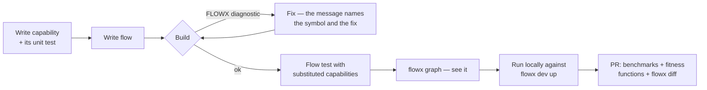
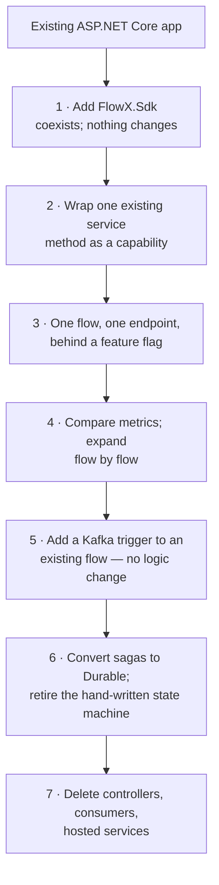

# 19 — SDK and Developer Experience

> **Status:** Accepted as a specification · **the shape is aspirational** ·
> **Audience:** application engineers
> **Answers:** what does using FlowX actually feel like, minute to minute?

> [!WARNING]
> **This document describes the intended experience, not the current one.**
> `dotnet new flowx` now exists and §1 is verified end to end, but the template is
> installed from this repository rather than from NuGet, and it scaffolds no
> tests. `flowx dev` is not a CLI verb — the CLI has four: `graph`, `manifest`,
> `diff` and `verify --cost` ([22-CLI](22-CLI.md)). Studio does not exist in any
> form (**P8**), and neither does the startup banner, which would need telemetry
> that is not emitted (**P5**).
>
> Two rows of §2's package table name projects that are not in the solution:
> **`FlowX.Sdk`** (the metapackage a new user is told to reference) and
> **`FlowX.Runtime.Durable`** (**P2**). `src/` contains `FlowX.Abstractions`,
> `FlowX.Core`, `FlowX.Compiler`, `FlowX.Compiler.CodeFixes`, `FlowX.Runtime`,
> `FlowX.Hosting`, `FlowX.Testing` and `FlowX.Cli`, plus `plugins/FlowX.Http` and
> `templates/FlowX.Templates`. **Nothing has been published to NuGet**, which is
> the one thing standing between §1 and the two-command version of itself.
>
> `AddFlowX(...)` in §3 is real and validates its options at start-up. The
> `.UseHttp()` / `.UseKafka(...)` chain on it is not: `AddFlowX` takes an
> `Action<FlowXOptions>` and there are no transport registration methods.
> **`app.MapFlowX()` is real** — `samples/ecommerce` and the generated project both
> use it, and neither restates its own route. `AddApplication<T>()` is not, and §3
> now records why it is not coming.

---

## 1. First five minutes

```bash
templates/local-feed.sh                       # pre-release only — see below
dotnet new install templates/FlowX.Templates

dotnet new flowx -o Ordering
cd Ordering
dotnet run
```

```bash
curl -X POST http://localhost:5000/api/v1/tickets \
  -H 'Content-Type: application/json' \
  -H 'Idempotency-Key: ticket-1' \
  -d '{"subject":"Printer on fire","reporter":"ops","contactPhone":"+44 7700 900000"}'
```

```json
{ "ticketId": "ticket-1", "subject": "Printer on fire" }
```

The scaffold is one working vertical slice — a flow, two capabilities, their
contracts, the composition root and one HTTP endpoint — not an empty folder tree.
New engineers learn the model by modifying something that runs. It carries no
tests, which is the one place this section still promises more than it delivers:
a scaffolded test project has to pick a test framework on the reader's behalf,
and [23-Testing-Strategy](23-Testing-Strategy.md) teaches the same thing without
that cost.

The generated `.csproj` is the shape that will ship: four `PackageReference`s and
the compiler as an analyzer asset. **The first line above is the entire
pre-release gap** — nothing is on NuGet, so `templates/local-feed.sh` packs the
platform into `.artifacts/local-feed` and registers it as a source. The day the
packages publish, that line and that script are deleted and the template itself
does not change. `templates/verify.sh` is the acceptance test for all of it, and
[templates/README.md](../templates/README.md) is the reference.

There are no template options. `--profile durable` would generate a project that
builds and then refuses its own first request: since **WP-52** the runtime honours
the profile, and since **WP-55** a `Durable` flow on a host that registers no
journal and no lease store is refused with `flow.durability_not_configured` rather
than run ephemerally. The only journal that ships is PostgreSQL, so the option
would have to scaffold a database into the one command whose value is that
`dotnet run` works. `--transport` would have one value.

New here? [24 Getting Started](24-Getting-Started.md) is the path from this
scaffold to compensation, durability, an event and a test, with every snippet
compiled by a test.

---

## 2. The package surface

| Package | Contains | Referenced by |
|---|---|---|
| `FlowX.Abstractions` | `ICapability`, `Flow<,>`, attributes, `Result<T>` | your application, plugins |
| `FlowX.Sdk` | metapackage: Abstractions + Compiler + Hosting | your application |
| `FlowX.Compiler` | analyzers + generators (analyzer asset, not a runtime dependency) | via Sdk |
| `FlowX.Runtime` | engines | via Sdk |
| `FlowX.Runtime.Durable` | journal, leases, replay | apps with durable flows |
| `FlowX.Testing` | context doubles + `FlowTestHost` (substitution); virtual time and durable replay in P2–P4 | test projects |
| `FlowX.Http` / `.Kafka` / `.Cron` / … | trigger + publisher plugins | as needed |
| `FlowX.Cli` | dotnet tool | developer machines, CI |
| `FlowX.Templates` | `dotnet new flowx` | developer machines |

Deliberately small. A new user references `FlowX.Sdk` plus the transports they
use, and nothing else.

Until `FlowX.Sdk` exists, the template references its three parts by hand —
`FlowX.Abstractions`, `FlowX.Hosting` and `FlowX.Compiler` — plus `FlowX.Http`
and `FlowX.Compiler.CodeFixes`. Five lines where the table promises two. That is
the metapackage's whole justification, visible in the one file a new user reads
first.

---

## 3. Composition root

```csharp
var builder = WebApplication.CreateBuilder(args);

builder.Services.AddFlowX(flowx =>
{
    flowx.UseHttp()                                        // generated endpoints
         .UseKafka(builder.Configuration.GetSection("Kafka"))
         .UseCron()
         .UseDurableJournal(j => j.UsePostgreSql(builder.Configuration.GetConnectionString("Journal")))
         .UseLeases(l => l.UseRedis(builder.Configuration.GetConnectionString("Redis")))
         .UseTelemetry(t => t.UseOtlp());

    flowx.AddApplication<OrderingAssembly>();              // generated registration, no scanning
});

var app = builder.Build();
app.MapFlowX();                                            // generated endpoint mapping
app.Run();
```

There is no `AddMediatR(typeof(X).Assembly)`-style reflection scan. This is what makes
cold start 148 ms and NativeAOT possible.

### What `app.MapFlowX()` actually is

That line is real, and it is the whole of a composition root's transport wiring. The
generator emits one `FlowX.Generated.FlowXEndpoints` method per `[HttpTrigger]`, from
the same reading of the attribute that produced the `triggers` block of
`flowx.manifest.json`:

```csharp
app.MapFlowX();                 // every declared endpoint
app.MapPlaceOrderFlow();        // or one at a time, named for the flow
```

The method, the route, the `Idempotency-Key` rule, the plan, the dispatcher, the
`.Return(...)` projection and the `[Sensitive]` redaction list all come from the flow.
`Program.cs` names none of them, so the address an application publishes and the address
it serves cannot disagree — which was the point: the ten-line `MapFlow` call this
replaced was the one place a generated project could silently drift from its own flow.

The file is emitted **only** when the compilation references `FlowX.Http`. A Kafka-only
application gets no file, no type and no IL; the compiler knows the transport by name and
links against no plugin, which is why adding one still costs `FlowX.Runtime` nothing.

Two things remain hand-written, and the second on purpose:

* **Which `JsonSerializerContext` to use** is inferred when exactly one context in the
  compilation declares `[JsonSerializable]` for both of a flow's contracts — the common
  case, and both the sample and the template. With none or several there is nothing to
  infer, so only `MapPlaceOrderFlow(MyContext.Default)` is generated and the caller names
  it. Everything else is still generated.
* **`AddApplication<T>()` is not coming, and this row is the correction to the block
  above.** Registering the capabilities a dispatcher takes would be mechanical — the
  generator wrote that constructor — but a service *lifetime* is declared nowhere in a
  flow, and emitting `AddSingleton` for each would be the generator inventing a fact
  rather than publishing one. The first capability needing a scoped dependency would find
  out as a captive-dependency failure inside generated source. A missing registration
  already fails at start-up and names the type, so the ceremony that remains is loud,
  short, and cannot drift. §6's rule — *ceremony every user pays is a platform defect* —
  is about ceremony that restates something already declared. These lines do not.

---

## 4. The inner loop



### Diagnostics that teach

```
error FLOWX1014: Retry policy on step 2 requires capability 'payment.capture'
                 to be idempotent, but it declares Idempotent = false.
                 Retrying a non-idempotent capability risks duplicate side effects.

                 Fix one of:
                   1. If capture is safe to repeat with the same idempotency key,
                      set [Capability(..., Idempotent = true)] on CapturePayment.cs:12
                   2. Remove .WithPolicy(Policies.PaymentGateway) from PlaceOrderFlow.cs:19
                   3. Add .CompensateWith<RefundPayment>() and drop the retry.

                 See https://flowx.dev/diag/FLOWX1014
```

Every `FLOWX*` diagnostic carries: what is wrong, why it matters, the exact
location, concrete alternatives, and a link. `EveryDiagnosticIsHelpful` is a CI
test — a diagnostic that fails to explain itself fails the build (P12).

---

## 5. The CLI

> **Two of the fourteen rows below exist, and both in a smaller form than shown.**
> `flowx graph` renders Mermaid only — there is no `dot`, `json`, `yaml` or
> `--live` — and `flowx diff` takes `--old`/`--new` paths rather than a
> `--baseline` ref. The third shipped verb, `flowx manifest`, is not in this
> table at all. [22-CLI](22-CLI.md) is the tool's actual reference, and its
> §1.1 lists every verb named here with the phase it is waiting on.

| Command | Purpose |
|---|---|
| `flowx new flow <name>` / `capability <name>` | scaffold with tests |
| `flowx graph [--flow x] [--format mermaid\|dot\|json\|yaml] [--live]` | visualise |
| `flowx diff [--baseline <ref>]` | breaking-change detection — **the CI gate** |
| `flowx verify [--complete] [--cost] [--runtime]` | manifest completeness, profile sanity, deployed-vs-built |
| `flowx query "<expression>"` | query the knowledge graph |
| `flowx replay --instance <id> [--mode inspect\|simulate\|resume\|fork]` | incident analysis and recovery |
| `flowx run <flow> --input <json>` | invoke a flow from the CLI (a trigger like any other) |
| `flowx signal <instance> <name> --payload <json>` | deliver a signal to a suspended flow |
| `flowx cancel <instance>` | cancel with compensation |
| `flowx generate openapi\|asyncapi\|alerts\|dashboard\|mcp\|c4\|tests` | derived artifacts |
| `flowx tenant provision\|suspend\|migrate\|purge` | tenant lifecycle |
| `flowx bench [--compare <baseline>]` | run the benchmark suite |
| `flowx dev up\|down\|graph` | local infrastructure |
| `flowx ai review\|document\|test\|explain\|optimize\|impact` | optional AI layer |

---

## 6. Testing kit

> **[23-Testing-Strategy](23-Testing-Strategy.md) is the full account of testing.** This
> section is the SDK's view of it: what the package contains and what a call site looks
> like. Items 1 and 2 below ship; items 3 and 4 need the durable journal and an
> integration harness and do not exist.

### 1 — a capability, as a plain class

```csharp
// A capability is a class with a method. Test it as one.
var ctx = new TestCapabilityContext(idempotencyKey: "key-1");

var result = await new ReserveInventory(fakeStore)
    .ExecuteAsync(new ValidatedOrder("SKU-1", 2, 40m), ctx, ct);

result.Value.ReservationId.ShouldBe("key-1");
```

Every value is fixed: the clock is `DateTimeOffset.UnixEpoch`, `Random` is seeded, and
`NewId()` returns a distinct-but-reproducible sequence. That is not tidiness — the
clock, the identifiers and the randomness are the three things a capability is allowed
to reach for, so pinning them is exactly what makes the test deterministic. It is the
same property durable replay depends on.

For code that takes a `FlowContext` — a generated step dispatcher, or a `.Return(...)`
projection — `TestFlowContext` adds the typed bag:

```csharp
var ctx = new TestFlowContext()
    .With(new ValidatedOrder("SKU-1", 2, 40m))
    .With(new Reservation("SKU-1", 2, "key-1"));

PlaceOrderFlow.Projection(ctx).ReceiptId.ShouldBe(…);
```

`Fail(error)` puts it into the state a compensation actually meets, since a
compensation runs after a failure and may read `ctx.Error`.

**Why this is in the platform and not in your test project.** `CapabilityContext` is
abstract with nine members, so the first thing every consumer wrote was the same
thirty-line stub — the reference sample's own tests carried one. Ceremony that every
user pays is a platform defect, not a user problem.

### 2 — a flow, with capabilities substituted

`FlowTestHost` runs the compiled flow in the test process: the real engine, the real
generated plan, the real pooled context and compensation stack, with the capabilities the
test names replaced by delegates.

```csharp
var host = FlowTestHost
    .For(PlaceOrderFlow.Plan, new PlaceOrderFlow.Dispatcher(capture, release, reserve, validate))
    .Substitute("payment.capture", OrderErrors.PaymentDeclined("insufficient funds"))
    .Build();

var run = await host.RunAsync(new PlaceOrder("SKU-1", 4, "tok"), ct);

run.Error!.Code.ShouldBe("payment.declined");
run.Compensation.ShouldBe(CompensationOutcome.Succeeded);
run.Trace.Executed.ShouldBe(["order.validate", "inventory.reserve", "payment.capture"]);
run.Trace.Compensated.ShouldBe(["inventory.release"]);
```

> **This block used to read `FlowTestHost.For<PlaceOrderFlow>()`, with
> `.Substitute<CapturePayment>(…)`, `.WithVirtualTime()` and `HaveCompensated<T>()`
> assertions.** None of that was written, and two of the three could not be: the
> generated `Dispatcher` takes its capabilities as concrete sealed types, so
> `For<TFlow>()` needs reflection over generated members and a container to construct
> them — the first breaks constraint C2 and the second is a mock framework. Substitution
> is keyed by capability id, which is what the plan and the manifest are keyed by. See
> [23 §4](23-Testing-Strategy.md#4-flowtesthost-in-detail).

### 3 and 4 — durable semantics and triggers, neither of which exists

```csharp
// 3 — crash and resume, deterministically. NOT SHIPPED: needs the journal (P2).
var durable = FlowTestHost.For(…).WithJournal(InMemoryJournal.Create()).Build();
await durable.RunUntilStep(2);
await durable.SimulateNodeCrash();

// 4 — end to end through the real transport. NOT SHIPPED: no integration harness.
await using var it = await IntegrationTestHost.CreateAsync(c => c.UseKafka().UsePostgresJournal());
await it.Kafka.PublishAsync("orders.requested", AnOrder());
```

`WithJournal`, `RunUntilStep`, `SimulateNodeCrash`, `ResumeOnNewNode` and
`IntegrationTestHost` are all unwritten. So is `WithVirtualTime()`, and it is worth being
exact about why: it accelerates retries, timeouts and breaker windows, and **none of those
executes** — a step's policy chain reaches the plan and the runtime never reads it
([10, header](10-Policy-Framework.md)). `FlowTestClock` ships instead: a clock a test
advances by hand, which covers the deadline, the one time-dependent behaviour that does
run. Tests that sleep are still the reason resilience is usually untested; the excuse is
removed for the part that exists.

---

## 7. IDE experience

| Feature | Delivered by |
|---|---|
| Diagnostics with code fixes | Roslyn analyzers + fix providers |
| Flow graph in a tool window | FlowX extension (VS, Rider, VS Code) reading the manifest |
| Navigate step → capability | generated code with `SourceLink` |
| CodeLens: "used by 3 flows" | manifest-backed |
| Debug generated code | `EmitCompilerGeneratedFiles`, set by the template |
| Snippets: `flowcap`, `flowflow`, `flowtest` | template package — **not written** |
| Live topology in the editor | Studio embedded view |

Debuggability of generated code is a deliberate mitigation for risk R1
([05 §11](05-Architecture.md#11-risks-and-technical-debt)): the generated plan is
ordinary, readable, breakpoint-able C# on disk — not an opaque build artifact.

Two corrections to the table. **`EmitCompilerGeneratedFiles` is not on by
default** — it is off in the SDK, on in this repository's `Directory.Build.props`,
and set explicitly by the generated project, so a consumer who writes their own
`.csproj` loses the mitigation silently. It belongs in
`src/FlowX.Compiler/build/FlowX.Compiler.props`, which every package consumer
imports, and the same file's `CompilerVisibleProperty Include="ProjectDir"` is now
redundant: the .NET 10 SDK declares it. And the template pack ships **no
snippets** — the row describes work nobody has done.

---

## 8. Migration from existing code

Incremental adoption, in the order that keeps a system shippable throughout
(mitigation for risk R4):



| Coming from | Bridge |
|---|---|
| MediatR | `FlowX.Bridge.MediatR` — an `IRequestHandler` is exposed as a capability; migrate call sites gradually |
| MassTransit | keep the consumer, have it dispatch to a flow; swap to `[KafkaTrigger]` later |
| Hangfire / Quartz | `[CronTrigger]` on the flow; the job body becomes a capability |
| Temporal | activities → capabilities, workflows → durable flows; the mental model transfers directly |
| Plain services | wrap as capabilities; compose in flows; delete the orchestrating service |

You never rewrite the system to try FlowX. You wrap one method, ship it, and
measure.

---

## 9. What a use case costs

```
src/Ordering.Application/PlaceOrder/
├── PlaceOrderFlow.cs           28 lines   ← orchestration + triggers + policies
├── ValidateOrder.cs            24 lines   ← capability
├── ReserveInventory.cs         21 lines   ← capability
├── ReleaseInventory.cs         18 lines   ← compensation
├── CapturePayment.cs           26 lines   ← capability
└── PlaceOrderTests.cs          61 lines   ← unit + flow tests
                               ───────────
                                178 lines, 6 files
```

Against the ~17-file baseline in [01-Vision §1](01-Vision.md#1-the-observation),
and with the HTTP endpoint, Kafka consumer, OpenAPI document, retry policy, saga
compensation, distributed tracing, metrics, alerts and architecture diagram all
generated. That is quality criterion V1, and it is the promise the whole platform
is built to keep.

---

**Next:** [20 — Roadmap](20-Roadmap.md)
