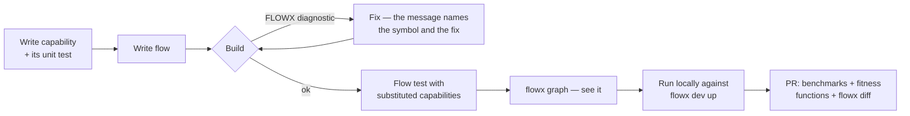
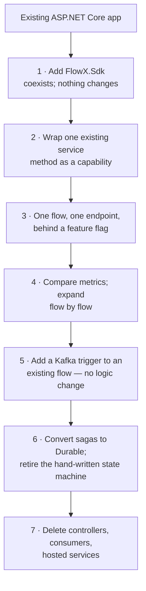

# 19 — SDK and Developer Experience

> **Status:** Accepted · **Audience:** application engineers
> **Answers:** what does using FlowX actually feel like, minute to minute?

---

## 1. First five minutes

```bash
dotnet new install FlowX.Templates
dotnet new flowx --name Ordering
cd Ordering
flowx dev up          # Postgres + Redpanda + OTel + Studio, one command
dotnet run
```

```
FlowX 1.0.0 · Ordering v1.0.0 · role=all
  Flows        3   (2 ephemeral, 1 durable)
  Capabilities 7
  Triggers     5   (3 http, 1 kafka, 1 cron)
  Manifest     .artifacts/flowx.manifest.json
  Studio       http://localhost:5055/flowx
  Ready in 148 ms
```

The scaffold is one working vertical slice — a flow, its capabilities, its
contracts and its tests — not an empty folder tree. New engineers learn the model
by modifying something that runs.

---

## 2. The package surface

| Package | Contains | Referenced by |
|---|---|---|
| `FlowX.Abstractions` | `ICapability`, `Flow<,>`, attributes, `Result<T>` | your application, plugins |
| `FlowX.Sdk` | metapackage: Abstractions + Compiler + Hosting | your application |
| `FlowX.Compiler` | analyzers + generators (analyzer asset, not a runtime dependency) | via Sdk |
| `FlowX.Runtime` | engines | via Sdk |
| `FlowX.Runtime.Durable` | journal, leases, replay | apps with durable flows |
| `FlowX.Testing` | context doubles today; `FlowTestHost`, virtual time and assertions in P1–P4 | test projects |
| `FlowX.Http` / `.Kafka` / `.Cron` / … | trigger + publisher plugins | as needed |
| `FlowX.Cli` | dotnet tool | developer machines, CI |

Deliberately small. A new user references `FlowX.Sdk` plus the transports they
use, and nothing else.

---

## 3. Composition root

```csharp
var builder = WebApplication.CreateBuilder(args);

builder.Services.AddFlowX(flowx =>
{
    flowx.UseHttp()                                        // generated endpoints
         .UseKafka(builder.Configuration.GetSection("Kafka"))
         .UseCron()
         .UseDurableJournal(j => j.UsePostgreSql(builder.Configuration.GetConnectionString("Journal")))
         .UseLeases(l => l.UseRedis(builder.Configuration.GetConnectionString("Redis")))
         .UseTelemetry(t => t.UseOtlp());

    flowx.AddApplication<OrderingAssembly>();              // generated registration, no scanning
});

var app = builder.Build();
app.MapFlowX();                                            // generated endpoint mapping
app.Run();
```

There is no `AddMediatR(typeof(X).Assembly)`-style reflection scan. `AddApplication<T>`
resolves to generated static registration code. This is what makes cold start
148 ms and NativeAOT possible.

---

## 4. The inner loop



### Diagnostics that teach

```
error FLOWX1014: Retry policy on step 2 requires capability 'payment.capture'
                 to be idempotent, but it declares Idempotent = false.
                 Retrying a non-idempotent capability risks duplicate side effects.

                 Fix one of:
                   1. If capture is safe to repeat with the same idempotency key,
                      set [Capability(..., Idempotent = true)] on CapturePayment.cs:12
                   2. Remove .WithPolicy(Policies.PaymentGateway) from PlaceOrderFlow.cs:19
                   3. Add .CompensateWith<RefundPayment>() and drop the retry.

                 See https://flowx.dev/diag/FLOWX1014
```

Every `FLOWX*` diagnostic carries: what is wrong, why it matters, the exact
location, concrete alternatives, and a link. `EveryDiagnosticIsHelpful` is a CI
test — a diagnostic that fails to explain itself fails the build (P12).

---

## 5. The CLI

| Command | Purpose |
|---|---|
| `flowx new flow <name>` / `capability <name>` | scaffold with tests |
| `flowx graph [--flow x] [--format mermaid\|dot\|json\|yaml] [--live]` | visualise |
| `flowx diff [--baseline <ref>]` | breaking-change detection — **the CI gate** |
| `flowx verify [--complete] [--cost] [--runtime]` | manifest completeness, profile sanity, deployed-vs-built |
| `flowx query "<expression>"` | query the knowledge graph |
| `flowx replay --instance <id> [--mode inspect\|simulate\|resume\|fork]` | incident analysis and recovery |
| `flowx run <flow> --input <json>` | invoke a flow from the CLI (a trigger like any other) |
| `flowx signal <instance> <name> --payload <json>` | deliver a signal to a suspended flow |
| `flowx cancel <instance>` | cancel with compensation |
| `flowx generate openapi\|asyncapi\|alerts\|dashboard\|mcp\|c4\|tests` | derived artifacts |
| `flowx tenant provision\|suspend\|migrate\|purge` | tenant lifecycle |
| `flowx bench [--compare <baseline>]` | run the benchmark suite |
| `flowx dev up\|down\|graph` | local infrastructure |
| `flowx ai review\|document\|test\|explain\|optimize\|impact` | optional AI layer |

---

## 6. Testing kit

> **What exists today is item 1.** `FlowX.Testing` ships two context doubles —
> `TestCapabilityContext` and `TestFlowContext` — and nothing else. Items 2–4 need the
> flow test host, virtual time and the durable journal, which arrive with P1–P4. The
> rest of this section describes the intended kit; it is not a description of the
> current package.

### What ships now

```csharp
// A capability is a class with a method. Test it as one.
var ctx = new TestCapabilityContext(idempotencyKey: "key-1");

var result = await new ReserveInventory(fakeStore)
    .ExecuteAsync(new ValidatedOrder("SKU-1", 2, 40m), ctx, ct);

result.Value.ReservationId.ShouldBe("key-1");
```

Every value is fixed: the clock is `DateTimeOffset.UnixEpoch`, `Random` is seeded, and
`NewId()` returns a distinct-but-reproducible sequence. That is not tidiness — the
clock, the identifiers and the randomness are the three things a capability is allowed
to reach for, so pinning them is exactly what makes the test deterministic. It is the
same property durable replay depends on.

For code that takes a `FlowContext` — a generated step dispatcher, or a `.Return(...)`
projection — `TestFlowContext` adds the typed bag:

```csharp
var ctx = new TestFlowContext()
    .With(new ValidatedOrder("SKU-1", 2, 40m))
    .With(new Reservation("SKU-1", 2, "key-1"));

PlaceOrderFlow.Projection(ctx).ReceiptId.ShouldBe(…);
```

`Fail(error)` puts it into the state a compensation actually meets, since a
compensation runs after a failure and may read `ctx.Error`.

**Why this is in the platform and not in your test project.** `CapabilityContext` is
abstract with nine members, so the first thing every consumer wrote was the same
thirty-line stub — the reference sample's own tests carried one. Ceremony that every
user pays is a platform defect, not a user problem.

### Intended kit

```csharp
// 1 — capability: a pure function. No host, no DI, no infrastructure.
var result = await new ReserveInventory(fakeStore)
    .ExecuteAsync(new ReserveRequest("SKU-1", 2), new TestCapabilityContext(), default);

// 2 — flow: real orchestration, substituted capabilities.
var host = FlowTestHost.For<PlaceOrderFlow>()
    .Substitute<CapturePayment>(_ => Result.Fail<Capture>(PaymentErrors.Declined("insufficient_funds")))
    .WithVirtualTime()
    .Build();

var outcome = await host.RunAsync(AnOrder());

outcome.Should().HaveFailedWith("payment.declined");
outcome.Should().HaveCompensated<ReleaseInventory>();
outcome.Trace.Should().HaveExecutedInOrder(
    "order.validate", "inventory.reserve", "payment.capture", "inventory.release");

// 3 — durable semantics: crash and resume, deterministically.
var durable = FlowTestHost.For<PlaceOrderFlow>().WithJournal(InMemoryJournal.Create()).Build();
await durable.RunUntilStep(2);
await durable.SimulateNodeCrash();
var resumed = await durable.ResumeOnNewNode();
resumed.Should().HaveCompleted();
resumed.Should().NotHaveReexecuted("inventory.reserve");   // the property that matters

// 4 — trigger: end to end through the real transport.
await using var it = await IntegrationTestHost.CreateAsync(c => c.UseKafka().UsePostgresJournal());
await it.Kafka.PublishAsync("orders.requested", AnOrder());
await it.WaitForFlow("order.place").ToComplete(TimeSpan.FromSeconds(10));
```

`WithVirtualTime()` is what makes resilience testing practical: retries,
timeouts, breaker windows and multi-day durable timers all execute instantly and
deterministically. Tests that sleep are the reason resilience is usually
untested; FlowX removes the excuse.

---

## 7. IDE experience

| Feature | Delivered by |
|---|---|
| Diagnostics with code fixes | Roslyn analyzers + fix providers |
| Flow graph in a tool window | FlowX extension (VS, Rider, VS Code) reading the manifest |
| Navigate step → capability | generated code with `SourceLink` |
| CodeLens: "used by 3 flows" | manifest-backed |
| Debug generated code | `EmitCompilerGeneratedFiles` on by default |
| Snippets: `flowcap`, `flowflow`, `flowtest` | template package |
| Live topology in the editor | Studio embedded view |

Debuggability of generated code is a deliberate mitigation for risk R1
([05 §11](05-Architecture.md#11-risks-and-technical-debt)): the generated plan is
ordinary, readable, breakpoint-able C# on disk — not an opaque build artifact.

---

## 8. Migration from existing code

Incremental adoption, in the order that keeps a system shippable throughout
(mitigation for risk R4):



| Coming from | Bridge |
|---|---|
| MediatR | `FlowX.Bridge.MediatR` — an `IRequestHandler` is exposed as a capability; migrate call sites gradually |
| MassTransit | keep the consumer, have it dispatch to a flow; swap to `[KafkaTrigger]` later |
| Hangfire / Quartz | `[CronTrigger]` on the flow; the job body becomes a capability |
| Temporal | activities → capabilities, workflows → durable flows; the mental model transfers directly |
| Plain services | wrap as capabilities; compose in flows; delete the orchestrating service |

You never rewrite the system to try FlowX. You wrap one method, ship it, and
measure.

---

## 9. What a use case costs

```
src/Ordering.Application/PlaceOrder/
├── PlaceOrderFlow.cs           28 lines   ← orchestration + triggers + policies
├── ValidateOrder.cs            24 lines   ← capability
├── ReserveInventory.cs         21 lines   ← capability
├── ReleaseInventory.cs         18 lines   ← compensation
├── CapturePayment.cs           26 lines   ← capability
└── PlaceOrderTests.cs          61 lines   ← unit + flow tests
                               ───────────
                                178 lines, 6 files
```

Against the ~17-file baseline in [01-Vision §1](01-Vision.md#1-the-observation),
and with the HTTP endpoint, Kafka consumer, OpenAPI document, retry policy, saga
compensation, distributed tracing, metrics, alerts and architecture diagram all
generated. That is quality criterion V1, and it is the promise the whole platform
is built to keep.

---

**Next:** [20 — Roadmap](20-Roadmap.md)
