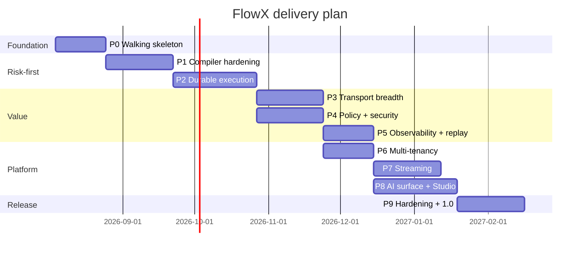

# 20 — Roadmap and Delivery Plan

> **Status:** Accepted · **Audience:** everyone
> **Answers:** in what order is this built, and what proves each step worked?

---

## 1. Delivery principles

1. **Risk first, then value.** The scariest assumption is proven while change is
   still cheap. For FlowX the scariest assumption is *"a source generator can
   produce a correct, debuggable, fast execution plan"* — so that is P0.
2. **Every increment is a vertical slice.** Trigger + flow + capability + policy
   + test + telemetry, end to end. No "the runtime layer" milestone.
3. **Every increment is releasable.** Even at P0 the sample runs and CI is green.
4. **Fitness functions before features.** The architecture tests exist before the
   architecture they govern.
5. **Documentation is part of the increment.** A feature without its doc section
   and its ADR is not done (constraint C8).

---

## 2. Phases

---

## 3. Increment detail

### P0 — Walking skeleton *(the riskiest thing first)*

| | |
|---|---|
| **Proves** | a Roslyn generator can emit a correct, readable, fast execution plan; the whole toolchain works end to end |
| **Scope (Must)** | `FlowX.Abstractions` contracts · minimal `FlowPlanGenerator` (linear steps only) · `FlowEngine` with the step loop · generated dispatch (*shipped as the `IStepDispatcher` the generator emits, not as a type called `CapabilityEngine` — that name is used nowhere in the code*) · `FlowX.Http` with one endpoint · `flowx.manifest.json` v0 · `flowx graph` · **architecture fitness tests** · benchmark B1–B3 wired into CI |
| **Scope (Should)** | `FlowTestHost` (substitution only) — **shipped, two phases late**, in WP-49 at P1's close: it runs a compiled flow in-process against the real engine with capabilities substituted by capability id, and reports the trace ([23-Testing-Strategy](23-Testing-Strategy.md)). The documented `For<TFlow>()` shape did not survive contact with the emitted dispatcher and was corrected rather than faked · ~~`dotnet new flowx` template~~ — **still not shipped**, carried forward for a third time |
| **Out** | durability, policies, other transports, branching |
| **Done when** | `samples/ecommerce` runs a 3-step ephemeral flow over HTTP; B1 ≤ 5 µs and B2 = 0 alloc are green in CI; `flowx graph` renders it — **met** ([P0.md](benchmarks/P0.md): B1 172.3 ns, B2 exactly 0 B) |
| **Kill criterion** | if generated dispatch cannot hit 5 µs / 0 alloc, [ADR-0002](adr/ADR-0002-compile-time-orchestration.md) is wrong and the platform's thesis must be revisited **before** anything else is built |

### P1 — Compiler hardening *(mitigates risk R1)*

| | |
|---|---|
| **Proves** | the generator is maintainable, debuggable and fast at realistic scale |
| **Must** | full DSL: `When`/`Otherwise`, `Switch`, `Parallel`, `ForEach`, `SubFlow` · contract-compatibility checking · diagnostics with fixes and help URIs · generator snapshot tests · readable emitted code · build-overhead budget B12 |
| **Should** | IDE code fixes · `flowx diff` v1 |
| **Done when** | a 200-flow synthetic solution builds with ≤ 8 % overhead; every diagnostic passes `EveryDiagnosticIsHelpful`; emitted code is breakpoint-able |

> **P1 status, stated rather than implied.** The DSL Must is met — all five
> shapes ship. The diagnostics Must is met for every id that exists, and the
> range in this row used to read "FLOWX1001–1023", which is not what shipped: the
> catalogue is **1001–1005, 1010, 1011, 1013–1021 and 1023–1026**, and
> **`FLOWX1006`–`1009`, `FLOWX1012` and `FLOWX1022` are reserved and unraised** —
> four of them the determinism rules, which are P2. A contiguous range in a plan
> reads as a promise about ids nobody has allocated; each reservation is now
> listed with what blocks it in
> [the diagnostics index](diagnostics/README.md).
> *All five have since been raised in P2, where they always belonged:
> `FLOWX1007`–`FLOWX1009` at WP-58, [`FLOWX1012`](diagnostics/FLOWX1012.md) at WP-60
> once a host could register the journal its fix recommends, and
> [`FLOWX1006`](diagnostics/FLOWX1006.md) at WP-59 once a generated payload writer
> made membership of a serialiser context a requirement something actually had.
> `FLOWX1022` waits on a second manifest, so the reservation table is down to one
> row.*
>
> **The "Done when" is not met, and it is the one criterion that is failing on a
> measurement rather than on an absence.** The 200-flow solution builds at
> **+77 %** against the ≤ 8 % bar, and 50 flows at **+46.6 %** — see
> [B12-scale.md](benchmarks/B12-scale.md). About 85 % of the per-flow cost is
> `FlowPlanGenerator`, and most of that is the semantic binding
> `ErrorCatalogueReader` performs to derive the manifest's `errors` field.
> [ADR-0014](adr/ADR-0014-derived-error-catalogue-vs-build-budget.md) is the open
> decision about which gives way, the field or the budget. P1 does not exit until
> one of them does.

### P2 — Durable execution *(the second-riskiest thing)*

| | |
|---|---|
| **Proves** | crash-safe execution with no duplicate effects and no split brain |
| **Must** | journal schema + Postgres adapter · fenced leases (Redis + Postgres) · resume · compensation with its own policies · determinism analyzers FLOWX1007–1009 · replay determinism test · transactional outbox · chaos test (SIGKILL mid-flow) · budgets B7, B8 |
| **Should** | `AwaitSignal`, `Delay`, timers · `flowx replay --mode inspect` |
| **Done when** | QR2 holds: kill any node at any step boundary, 10 000 flows, zero duplicate non-idempotent effects, zero lost instances, resume p99 ≤ 45 s |

### P3 — Transport breadth *(delivers Q4, the visible promise)*

| | |
|---|---|
| **Must** | Kafka · RabbitMQ · Azure Service Bus · ~~Cron with leader election~~ **done, and without an election** ([ADR-0026](adr/ADR-0026-an-occurrence-names-the-instance-it-starts.md)): `[CronTrigger]` generates a registration, `FlowScheduleScan` fires it, and exclusivity comes from the occurrence naming the instance rather than from a leader · the conformance suite as a published package |
| **Should** | gRPC · MQTT · webhooks with signature verification |
| **Done when** | `samples/event-driven` moves a flow HTTP → Kafka → cron with **zero** business-logic changes, proven by an unchanged-file assertion in CI. *The cron leg of that is now known to need two flows rather than one: a scheduled flow's input contract is fixed by the platform, so it cannot also bind an HTTP request body ([ADR-0028 §4](adr/ADR-0028-a-scheduled-flows-input-is-its-occurrence.md#4-the-consequence-that-contradicts-a-documented-claim)). The **capability** is the unchanged file, which is what the assertion should read* |

### P4 — Policy and security

| | |
|---|---|
| **Must** | full policy catalogue with fixed stage order · retry-requires-idempotency enforcement · deny-by-default authorisation · idempotency store · RFC 7807 mapping · audit policy · security fitness tests |
| **Should** | hedging · bulkheads · per-tenant breaker keys |
| **Done when** | `CrossTenantAccessIsDenied`, `EveryCapabilityDeclaresAuthorization` and the policy-ordering tests are green; `samples/banking` passes a threat-model review |

### P5 — Observability and replay

| | |
|---|---|
| **Must** | frozen span/metric schema · `TelemetryConformanceTest` · `flowx replay` all four modes · generated alerts and dashboards · zero-cost-when-unobserved budget B6 |
| **Should** | live topology JSON feed for Studio |
| **Done when** | an injected production-like failure is diagnosed end to end using only generated dashboards and `flowx replay --mode simulate` — measured in a game day |

### P6 — Multi-tenancy

| **Must** | tenant resolution from claims · admission quotas and per-tenant limits · journal partitioning · RLS · tenant-scoped cache · tenant lifecycle CLI · Q8 fairness test |
|---|---|
| **Should** | L2 store-per-tenant · residency binding |
| **Done when** | one tenant at 10× its quota degrades another tenant's p99 by ≤ 10 % under load |

### P7 — Streaming

| **Must** | `Streaming` profile · tumbling/sliding/session windows · watermarks and lateness · checkpointing · backpressure conformance · budget B13 |
|---|---|
| **Done when** | `samples/realtime-stream` sustains 250 000 rec/s/node with bounded memory under a deliberately slow capability |

### P8 — AI surface and Studio

| **Must** | manifest v1.0 frozen · `flowx query` · MCP tool generation · `AgentTrigger` with confirmation · Studio read-only (topology, replay, impact analysis) |
|---|---|
| **Should** | `flowx ai review\|document\|test\|explain` |
| **Done when** | `samples/ai-agent` runs an agent that can invoke only what its identity permits, with accurate side-effect confirmation, fully traced and replayable |

### P9 — Hardening and 1.0

| **Must** | all quality goals Q1–Q8 verified · NativeAOT across every package · security review + pen test · API surface freeze · migration guides · nine samples complete · docs complete |
|---|---|
| **Done when** | criteria V1–V8 in [01-Vision §7](01-Vision.md#7-measurable-success-criteria) are all met and gated in CI |

---

## 4. Version policy

| Version | Contains | Compatibility |
|---|---|---|
| `0.x` | P0–P8 previews | breaking changes allowed, documented per release |
| `1.0` | P9 | **public API frozen**; SemVer from here |
| `1.x` | additive features, plugins, marketplace | no breaking changes |
| `2.0` | only if a manifesto-level decision is revisited by ADR | 2-minor deprecation window first |

Post-1.0 candidates, explicitly deferred and not designed yet: cross-region
durable flows, out-of-process plugin isolation, an interpreted/dynamic flow
profile, visual round-trip editing in Studio, human-task/BPM modelling.

---

## 5. Success metrics per phase

| Phase | Leading indicator | Lagging indicator |
|---|---|---|
| P0 | benchmark budgets green | the thesis survives |
| P1 | diagnostics resolved without reading docs | build overhead ≤ 8 % |
| P2 | chaos test passes 100 runs | zero duplicate effects |
| P3 | plugin authored by someone outside the core team | conformance pass rate |
| P4 | zero capabilities without an authorisation stance | clean pen test |
| P5 | MTTD/MTTR in game days | incidents diagnosed without a debugger |
| P6 | fairness test green | no cross-tenant incidents |
| P7 | sustained throughput | bounded memory under load |
| P8 | agent actions all traced | zero unauthorised agent actions |
| P9 | V1–V8 met | onboarding ≤ 2 hours (n ≥ 10) |

---

## 6. Standing risk review

The risks in [05 §11](05-Architecture.md#11-risks-and-technical-debt) are
re-scored at every phase gate. Two have hard triggers:

| Risk | Trigger | Action |
|---|---|---|
| R1 generator complexity | build overhead > 8 %, or > 3 generator bugs per phase | freeze features; invest in the generator's test harness and model layer — **⚠ this trigger has fired.** Build overhead is +46.6 % at 50 flows and +77 % at 200 ([B12-scale.md](benchmarks/B12-scale.md)). The named action has not been taken; what was done instead is a blocking *relative* gate ([generator-cost-gate.md](benchmarks/generator-cost-gate.md)) that stops it worsening, and [ADR-0014](adr/ADR-0014-derived-error-catalogue-vs-build-budget.md), which puts the choice between the derived catalogue and the budget in front of a decider |
| R2 determinism leaks | any replay divergence in the conformance corpus | stop P2; strengthen analyzers before proceeding |
| R5 journal bottleneck | B7 misses budget on target hardware | implement tenant sharding before P6 |
| R4 adoption | fewer than 3 external pilots by P5 | reprioritise the MediatR bridge and migration tooling |

---

## 7. How to contribute to a phase

Each phase has a milestone in the issue tracker; each issue names the section of
this documentation set it implements. A pull request must include: the code, the
tests (written first), the doc update, and an ADR when it makes a decision.
See [CONTRIBUTING](../CONTRIBUTING.md).

---

**Back to:** [README](../README.md) · [Architecture](05-Architecture.md) · [ADR index](adr/README.md)
