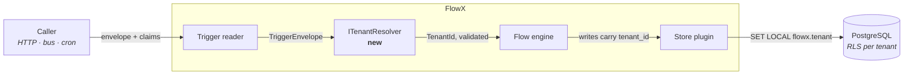
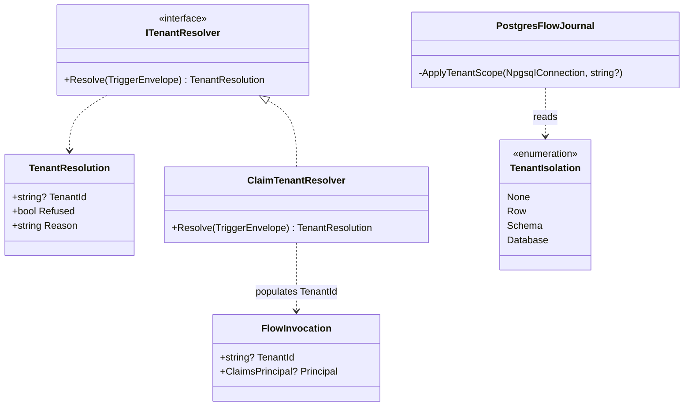
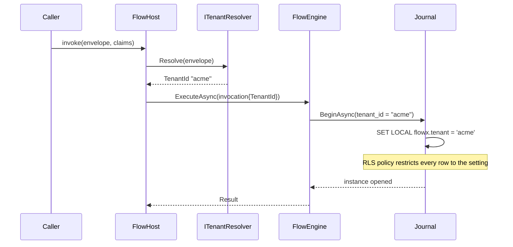
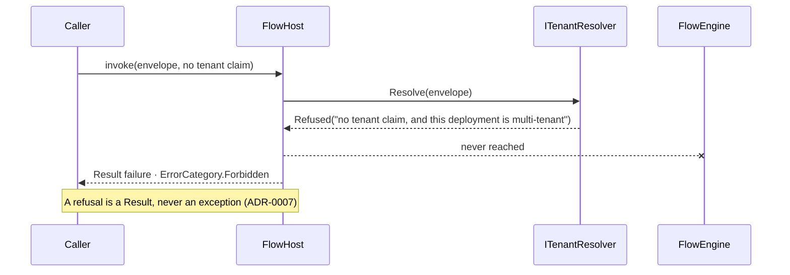
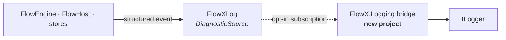
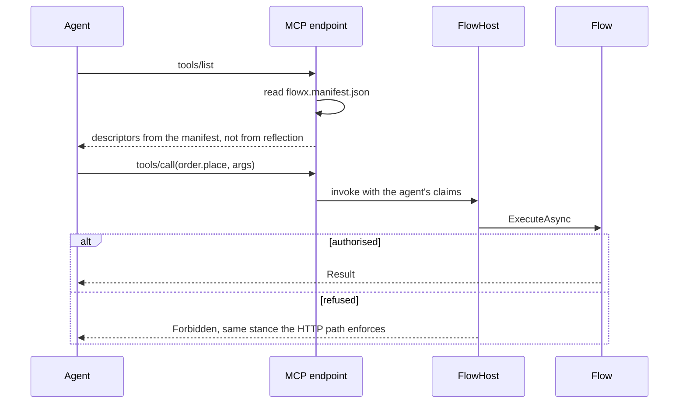

# 25 — The remaining platform: priority, design, and what each one costs

What is left to build, in the order the gaps argue for. Every item here is
**declared and inert** or **absent** in
[CHECKLIST §5e2](../CHECKLIST.md#5e2-platform-subsystems--what-runs-what-is-declared-what-is-absent).

The recurring shape is worth naming once, because three of the six have it: a
contract is declared, published and diffed, and **the wire is cut at the last
inch**. Authorisation was found that way (`FlowExecutionContext.Principal`
returned `null` unconditionally behind a complete abstraction). Tenancy is the
same today. That is what these designs are checked against — not "is there a
type", but "does anything read it at run time".

## Priority

| # | Feature | State | Why here |
|---|---|---|---|
| 1 | **Four policy kinds** — `RateLimit`, `Idempotency`, `Cache`, `Audit` | declared, inert | The only item that **deletes a diagnostic**. `FLOWX1032` exists to tell a user their declaration does nothing; every release shipping it ships an admission |
| 2 | **Multi-tenancy** | plumbed, unenforced | The only *correctness* gap left: nothing stops one tenant's flow reading another's rows. A data-isolation bug is not a missing feature |
| 3 | **Logs** | absent | Third leg of observability; traces and metrics run. Blocked on one decision, not effort |
| 4 | ~~**AI surface (MCP)**~~ | **built** — `plugins/FlowX.Mcp`, 2026-08-02 | *This row said `AgentTrigger` existed and nothing served it.* `tools/list` is a projection of the manifest and `tools/call` enters the one `FlowEngine.ExecuteAsync` with the agent's principal. See §3 |
| 5 | **`Stream` and `Change` triggers** | declared, unbound | Two of eight kinds. `Change` is CDC over the outbox, which already exists |
| 6 | **Stream engine** | absent | **Not next.** Nothing defines the checkpoint format, watermark generation or how window state is journaled — implementing it means inventing it |
| 7 | **Studio** | absent | **Not next.** Sixteen one-line mentions and no design |

## 1. Multi-tenancy — the design

### Context (C4 L1)

**The seam that does not exist is `ITenantResolver`.** Everything else in that
diagram is built: `TriggerEnvelope.TenantId`, `FlowContext.TenantId`,
`JournalWrites.TenantId`, `flow_instance.tenant_id` and its index have been
there since migration `0001`, and `FlowTelemetry` already tags spans with it.

### Class view

`TenantResolution` carries a **refusal**, not a null. A null tenant on a
multi-tenant deployment is the bug this feature exists to prevent, so the
resolver has to be able to say *no* and be distinguishable from *not
configured*.

### Runtime — happy path

### Runtime — refusal, which is the case that matters

**Deliberately not designed here:** journal partitioning.
[11 §6](11-Distributed-Runtime.md) names sharding as a lever and stops, so
building it would be invention. `Row` isolation via RLS is what the
documentation actually specifies.

### Acceptance

- A flow started with tenant *A*'s claims cannot read, resume or recover an
  instance of tenant *B* — asserted against real PostgreSQL, both directions.
- A deployment declaring multi-tenancy refuses an untenanted call rather than
  defaulting it.
- `Ephemeral` and single-tenant deployments pay nothing: budget **B2** stays a
  hard zero, gated by the existing allocation tests.

## 2. Logs — the design

The whole feature is **one decision**:
`AbstractionsHasNoDependencies` forbids a package reference, and
`Microsoft.Extensions.Logging.Abstractions` is a package while
`System.Diagnostics.DiagnosticSource` is in the shared framework — which is why
traces and metrics were buildable and logs were not.

So the abstraction emits through `DiagnosticSource`, and a **separate**
`FlowX.Logging` project bridges it to `ILogger`. A host that wants neither
references neither, and the zero-listener cost stays the property **B6**
already asserts.

`[Sensitive]` redaction is structural and must stay so: a log event carries a
`JournalPayload`, never a value, so there is no accessor to leak through.

## 3. AI surface (MCP) — the design

The manifest is already a complete, byte-pinned description of every flow, its
input contract and its authorisation stance — so `tools/list` is a projection
of an existing artifact rather than a second source of truth. **The stance is
the same one HTTP enforces**: an agent gets no separate authorisation path.

### What was built, and where the design was short

The design above holds. Three things it did not say, discovered in building it:

- **`McpToolCatalog.From(string)` takes the manifest and takes nothing else.**
  That signature is the whole guarantee: no `Assembly`, no `ExecutionPlan`, no
  service provider, so there is no second input a descriptor could be computed
  from. It is checked as well as documented — one test mutates each manifest
  field and requires the descriptor field it feeds to move, and reads the field
  list off the implementation so a new field cannot be added without a case.
- **The generated binding copies nothing but the flow id.** `EndpointEmitter`,
  `ScheduleEmitter` and `BusEmitter` each copy the trigger's *address* into the
  user's assembly, because a router, a scheduler and a consumer need it before
  any manifest is read. An agent tool has no address, so `AgentToolEmitter`
  copies no part of the tool's surface — emitting the description and the
  annotations would have been cheaper at run time and would have created exactly
  the second copy this section rules out.
- **"The stance is the same one HTTP enforces" is stronger than it reads.** It is
  not that the two transports agree about identity: `MapFlowXMcp` builds its
  `FlowInvocation` with `HttpTriggerReader`, the same three lines an
  `[HttpTrigger]` route uses, so the principal and the tenant are resolved once
  for both. Two copies would have been two `TenantClaimTypes` lists to keep
  equal, which on a multi-tenant deployment is a data-isolation bug rather than a
  documentation defect.

And one limit the diagram cannot show: the descriptor's `inputSchema` names the
input contract instead of `$ref`-ing a JSON Schema, because the manifest's
top-level `schemas` map is still unwritten. [13 §6](13-AI-Native.md) carries the
detail.

## 4. `Stream` and `Change` triggers

`Change` is the cheaper of the two and is nearly free: the outbox already
stages every event in the step's transaction and `PostgresOutboxPublisher`
already drains it, so a CDC trigger is a second consumer of a table that
exists. `Stream` needs the engine in item 6 and is blocked behind it.

## What this document is not

It is not a work-package breakdown, and it does not reserve numbers. Package
detail is deferred to each phase gate, per [PLAN §6](../PLAN.md) — this exists
so the next three features are designed before they are written, and so the
two that are **not** next say why in one place.
