# 27 — CRM Reference Architecture · review, guidelines and implementation

> **What this is.** A whiteboard picture of a complete CRM — *"CRM Sample · Complex Business
> Flows"* — read against what FlowX actually compiles, and turned into buildable guidance.
> It answers three questions in order: **what does the picture get wrong**, **what is the
> corrected architecture**, and **how do I add the next stage of it**.

**Related:** [26 — CRM Sample · Design](26-CRM-Sample.md) is the design of what ships in
`samples/crm`. This document is wider than that sample and deliberately so: the picture describes
a CRM about a third of which is built. Section [§3](#3-coverage--what-the-picture-asks-for-and-what-exists)
says which third.

**Audience:** an architect scoping a CRM on FlowX, and the engineer who implements the next
work package.

---

## Contents

1. [The verdict, in one table](#1-the-verdict-in-one-table)
2. [The seven corrections](#2-the-seven-corrections)
3. [Coverage — what the picture asks for and what exists](#3-coverage--what-the-picture-asks-for-and-what-exists)
4. [The corrected architecture](#4-the-corrected-architecture)
5. [Guidelines](#5-guidelines)
6. [Implementation guide — adding the Delivery stage](#6-implementation-guide--adding-the-delivery-stage)
7. [Anti-patterns](#7-anti-patterns)
8. [Definition of done](#8-definition-of-done)

---

## 1. The verdict, in one table

The picture is a good **domain** document and a misleading **architecture** document. Its five
panels name the right concerns; four of the five draw the wrong relationship between them.

| Panel | Verdict | Correction |
|---|---|---|
| Philosophy strip | **Wrong shape** | Policy is not a stage after Capability; it wraps a step. Runtime is not a stage at all. → [§2.1](#21-the-philosophy-strip-is-not-a-pipeline) |
| Triggers | **Category error** | Five of the nine are *channels*, not trigger kinds. The kind set is closed at eight. → [§2.2](#22-a-channel-is-not-a-trigger-kind) |
| Flow: customer journey | **Wrong granularity** | One diagram, not one flow. A journey outlives every deadline a flow may carry. → [§2.3](#23-the-journey-is-not-a-flow) |
| Capabilities | **Wrong granularity** | Fifteen "services" are not fifteen capabilities. A capability is a verb. → [§2.4](#24-a-service-is-not-a-capability) |
| Policies | **Half right** | Three of the eight are policies. Two are compile-time, two are flows, one is a deployment. → [§2.5](#25-half-the-policy-panel-is-not-policy) |
| Runtime | **One wrong box** | There is no rule engine, on purpose. → [§2.6](#26-there-is-no-rule-engine) |
| Outcomes | **Right** | Egress integrations, reached as capabilities with declared `SideEffects`. |
| Infrastructure | **Right** | Matches the plugin set: PostgreSQL, Redis, Kafka/RabbitMQ, Kubernetes. |

And the omissions, which cost more than the errors: **tenant, idempotency, compensation,
deadline, dead-letter and the agent trust boundary appear nowhere on the picture**
([§2.7](#27-what-the-picture-does-not-draw-at-all)).

---

## 2. The seven corrections

### 2.1 The philosophy strip is not a pipeline

The picture draws `Trigger → Flow → Capability → Policy → Runtime` as a chain, which reads as
*"policy runs after the capability, and the runtime after that"*. Neither is true, and a team
that builds to it puts authorisation and rate limiting in a middleware behind the business logic.

A **policy wraps a step**. `PolicySet` composes in seven ordered stages, and the order is the
type's, not the author's — so a retry cannot be placed inside a timeout by accident:

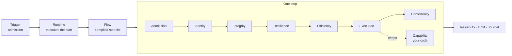

| Stage | What sits there | Example |
|---|---|---|
| Admission | is this call allowed in at all | `RateLimit` |
| Identity | who is calling | the capability's `Authorization` stance |
| Integrity | has this been done already | `Idempotency` |
| Resilience | what happens when it fails | `Retry`, `CircuitBreaker` |
| Efficiency | can the work be avoided | `Cache`, `Bulkhead` |
| Execution | the work itself | `Timeout` + your `ExecuteAsync` |
| Consistency | what must be recorded | `Audit`, compensation registration |

The reading that survives: **the runtime executes a flow; a flow is a list of steps; a step is a
capability inside a policy stack; a trigger is how the flow was reached.**

### 2.2 A channel is not a trigger kind

The picture lists nine triggers. FlowX has eight *kinds*, and they are a closed set — `Email`,
`Phone Call`, `Social Media`, `Live Chat` and `Campaign` are not among them, because they are not
delivery semantics. They are business channels that arrive over one of two kinds.

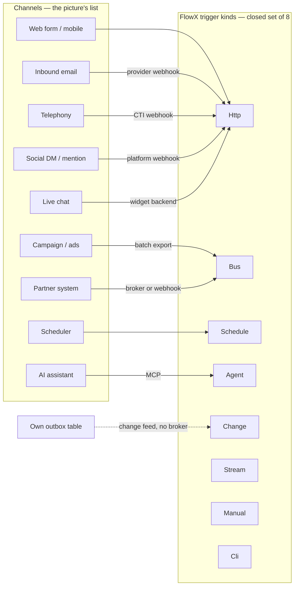

Why it matters beyond taxonomy: a channel modelled as its own trigger grows its own adapter, and
each adapter grows its own authorisation check. Then the same business rule is enforced five
times and differs in at least one of them. In FlowX the rule is on the **capability**, so the
email path and the web path meet the identical refusal — which is the property
`ApproveDiscountFlow` exists to demonstrate.

Delivery semantics differ by kind, and the flow must be written for them:

| Kind | Delivery | Consequence for the author |
|---|---|---|
| `Http`, `Agent`, `Manual`, `Cli` | at-most-once; the caller retries | declare `Idempotent = true` and take an `Idempotency-Key` |
| `Bus`, `Schedule`, `Stream`, `Change` | at-least-once | the flow **will** run twice; make the write idempotent or key it |

### 2.3 The journey is not a flow

The picture's centre panel is captioned `FLOW: CUSTOMER JOURNEY` and spans lead to loyalty. A
FlowX flow is a compiled step list with a deadline — `[FlowDeadline("PT15S")]` on every flow in
the sample. A customer journey runs for months.

Three different mechanisms are needed, and telling them apart is the single most consequential
decision in this architecture:

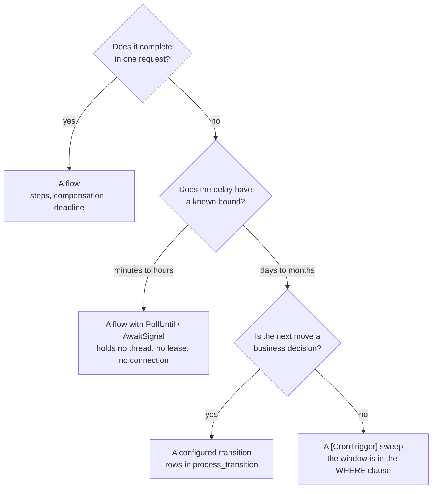

So the journey becomes a state machine held in **data**, advanced by short flows:

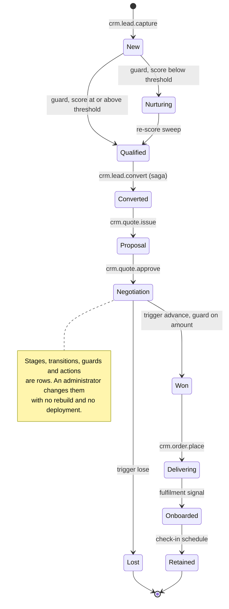

The picture's diamonds map cleanly once this split is made:

| Diamond | Mechanism | Why |
|---|---|---|
| `Qualified?` | configured guard | the threshold is a business decision that changes weekly |
| `Interested?` | signal or sweep | it is a fact that arrives later, not a branch on data in hand |
| `Won?` | configured transition | the stage set is the customer's, not the code's |
| `In Stock?` | `.When()` inside a flow | the answer is in the flow's own state, now |
| `Issue?` | `.When()` inside a flow | same |

### 2.4 A service is not a capability

The picture names fifteen capabilities and every one is a noun with `Service` after it. A FlowX
capability is `<domain>.<verb>`: one unit of work, one contract version, one authorisation
stance, one entry in the manifest, one agent tool. `Lead Service` cannot carry any of those,
because "the lead service" is not a thing a caller may or may not be allowed to do.

| Picture | Real capability ids | Note |
|---|---|---|
| Lead Service | `crm.lead.capture`, `crm.lead.score`, `crm.lead.assign`, `crm.lead.enrich`, `crm.lead.convert` | five stances, not one |
| Opportunity Service | `crm.opportunity.create`, `crm.opportunity.advance`, `crm.opportunity.sweep_stale` | the sweep is `Internal`; the others are not |
| Pricing Service | `crm.quote.issue` + a **pure** `Pricing` class | arithmetic is not a capability — see below |
| Order Service | `crm.order.place` | the discount threshold is asked again here |
| Payment Service | `crm.payment.capture` | `Idempotent = false`; a retry is a duplicate charge (FLOWX1014) |
| Analytics Service | not a capability | a read model fed from the outbox |

**Pure logic is not a capability.** `Pricing.Price` takes lines and a discount and returns a
total; it touches no store, no clock and no principal, so it is a static function that a unit
test can exhaust. A capability is the thing that *has an effect*. Making arithmetic a capability
buys a policy stack nothing can use and a manifest entry nobody may call.

### 2.5 Half the policy panel is not policy

| Picture box | Where it actually lives | Enforced by |
|---|---|---|
| Authorization | `[Capability(Authorization = …, Permission = …)]` | compiler — FLOWX1010, FLOWX1030 |
| Validation | the contract type, plus `Result.Fail` with `ErrorCategory.Validation` | tests |
| Security (auth, 2FA) | the host's authentication; FlowX reads the resulting `ClaimsPrincipal` | outside FlowX |
| **Rate Limit** | `PolicySet.RateLimit(permits, window, scope)` | runtime |
| Data Privacy | `[Sensitive]` members, redacted at the journal and outbox exit | compiler + runtime |
| **Audit** | `PolicySet.Audit(category, redact)` | runtime |
| Retention | migrations and a deployment's data lifecycle | outside FlowX |
| Approval | a **flow** plus a permission, or a configured `RequestApproval` action | neither — it is domain logic |

Only the two in bold, plus `Idempotency`, are policies in the picture's list. And the panel omits
the four that cause most incidents: `Timeout`, `Retry`, `CircuitBreaker`, `Bulkhead`.

Two of these are compile-time refusals worth knowing before you write the flow:

- `Retry` on a capability that did not declare `Idempotent = true` → **FLOWX1014**.
- `Cache` on a capability that declared `SideEffects` → **FLOWX1018**.

**Approval is the one to get right.** It is drawn as a policy, which suggests a rule that
silently blocks. It is not: it is a state (`Draft`), a permission (`crm.discount.approve`) and a
second flow that a different principal invokes. The representative is *not refused* — asking is
theirs to do; signing is not.

### 2.6 There is no rule engine

The runtime panel lists `Rule Engine (Business Rules)`. FlowX has none, and the absence is a
decision rather than a gap. What is configurable is a **closed** language:

- **five guard operators** — `Equals`, `NotEquals`, `GreaterThan`, `LessThan`, `IsSet`
- over a **whitelisted field set** on the entity the transition moves
- and **five action kinds** — `CreateTask`, `SendNotification`, `SetField`, `RequestApproval`,
  `EmitEvent`

A guard naming a field outside the whitelist is refused **when the definition is published**,
with the permitted list in the message — not at three in the morning when an opportunity happens
to reach that stage. The price is stated in the open: a sixth action kind is a code change, a
build and a deployment. An expression evaluator would buy the sixth kind and sell the ability to
know what a definition can do.

### 2.7 What the picture does not draw at all

Each of these is an outage that a CRM diagram without it will produce.

| Missing | Why a CRM cannot skip it | Where it goes |
|---|---|---|
| **Tenant** | a CRM is multi-tenant by default; a "default tenant" is the exact shape of a cross-tenant read | `TenantIsolation.Row` + PostgreSQL RLS; tenant from the `tid` claim only |
| **Idempotency** | a browser retrying a slow `POST /quotes` doubles a forecast | `Idempotent = true` + `Idempotency-Key` on the trigger |
| **Compensation** | conversion writes an account, a contact and an opportunity; the third can fail | `.CompensateWith<T>()`, and the undo takes the step's **input** |
| **Deadline** | "Negotiation" with no budget is a lease held for ever | `[FlowDeadline("PT15S")]` |
| **Dead-letter** | one poison `lead.created` behind a partition stops every lead | `BusMaxDeliveries` then divert |
| **Journal / replay** | "what did this deal do in March" is an audit question, not a log query | `ExecutionProfile.Durable` |
| **Agent boundary** | the AI panel implies a model reaches the CRM; the picture draws no stance | `[AgentTrigger]` publishes only flows that carry it, and they meet the same capability stance |

---

## 3. Coverage — what the picture asks for and what exists

`samples/crm` ships fifteen flows and fourteen tables. Against the picture's five stages:

| Stage | Built | Not built |
|---|---|---|
| 1 · Lead management | capture, enrich (poll + webhook), score, qualify via guard | nurture campaign, re-score sweep |
| 2 · Engagement | assign to owner, activity and task records | interaction tracking, interest signal, nurture |
| 3 · Opportunity | create (saga), quote, approval, advance, won/lost stages | needs analysis, proposal document |
| 4 · Delivery | order placement | inventory check, procurement, fulfilment, onboarding |
| 5 · Loyalty | — | check-in, feedback, support ticket, upsell, renewal |

Roughly a third, and the third that carries every mechanism the remaining two thirds need: a
saga, a fan-out, a wait with two endings, a schedule, a configured transition and an agent tool.
[§6](#6-implementation-guide--adding-the-delivery-stage) builds one of the missing stages end to
end as the pattern for the rest.

---

## 4. The corrected architecture

### 4.1 Layers, and the direction dependencies may point

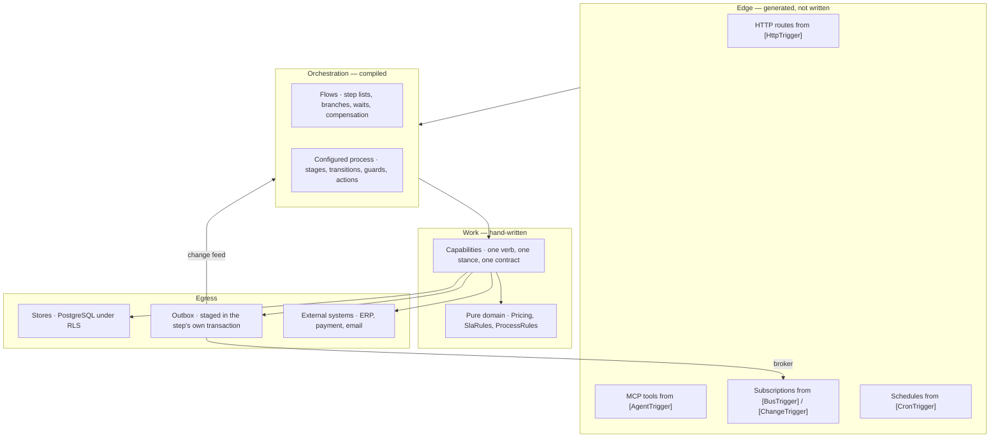

Two rules hold this together, and both are checkable:

1. **Nothing in `WORK` names anything in `EDGE`.** A capability that knows it was reached over
   HTTP has an authorisation rule that a broker path will not enforce.
2. **`PURE` has no dependencies at all** — no store, no clock read, no principal. It is where the
   business rules that need exhaustive tests live.

### 4.2 Where a trigger's identity comes from

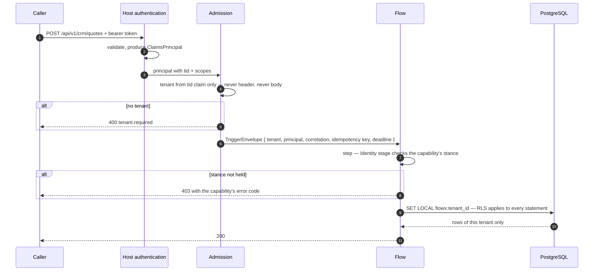

**Failure twin.** The database is unreachable: the step fails with `ErrorCategory.Unavailable`,
the `Retry` policy attempts it again under backoff, the deadline is what stops it, and the
compensation stack unwinds the steps already committed. The caller is told `crm.*_unavailable`
and never a connection string.

### 4.3 One publish, three subscriptions

The picture draws automation as a dotted bar under the journey. This is what it is:

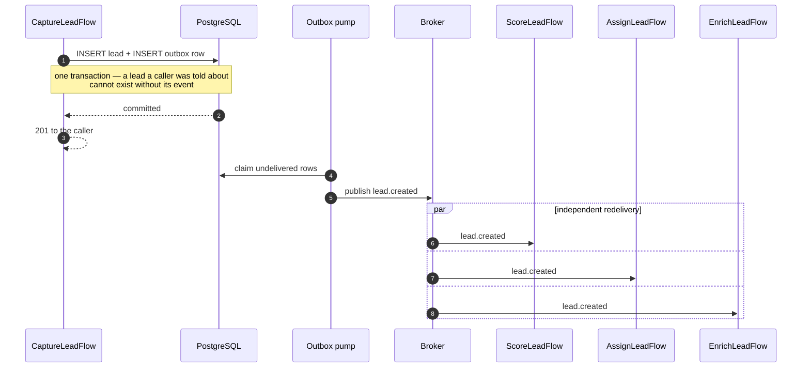

**Failure twin.** The broker is down. The outbox rows stay unclaimed and are published when it
returns — nothing is lost, and the lead was still written. The configured process does **not**
stall, because it is driven by the change feed reading the same outbox table with no broker in
the path.

A different and worse failure is a `[BusTrigger]` the host never subscribed: the flow compiles,
is reachable, is never started, and looks exactly like a broker that is not delivering. The
compiler catches the two shapes it can see — a bus-triggered flow whose input is not
`BusMessage`, or which is not `Durable`, is **FLOWX1039** — but the missing
`AddFlowXSubscriptions()` call is not one of them. It is a line in `Program.cs` and a test that
asserts the subscription exists.

### 4.4 The conversion saga

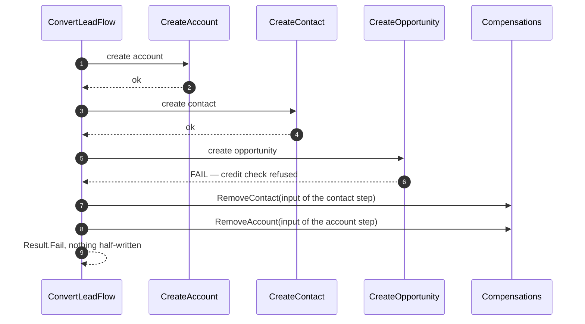

The compensation takes the **step's input**, not its output. An undo that needed the output could
not run when the step failed after its effect but before its answer — which is the exact window
a network timeout opens.

### 4.5 A wait that holds nothing

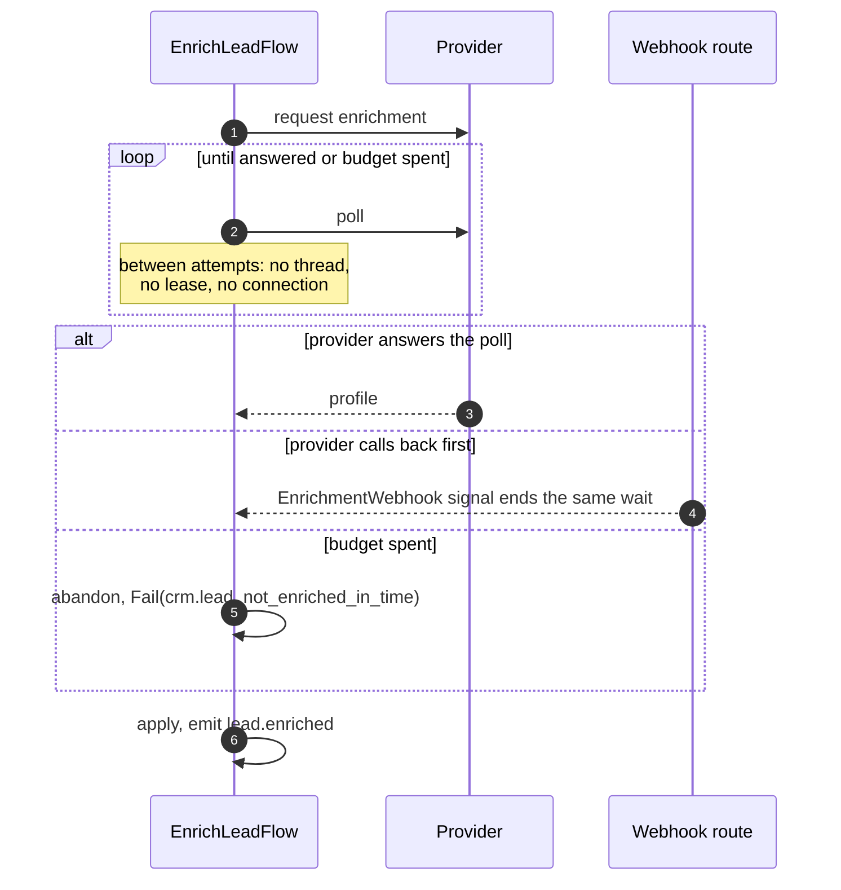

One wait, two endings and a bounded budget. This is the shape every "Nurture Campaign" and
"Waiting for customer" box in the picture should take.

### 4.6 The data model

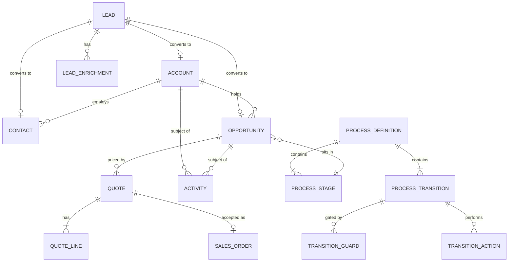

Every table carries `tenant_id`, and every one has a `FORCE`d row-level security policy so the
isolation holds even for the table's owner. `ACTIVITY` references its subject polymorphically —
a task can relate to a lead, an account or an opportunity — and integrity is held by a trigger
rather than a foreign key, because a foreign key cannot be polymorphic.

### 4.7 Runtime topology

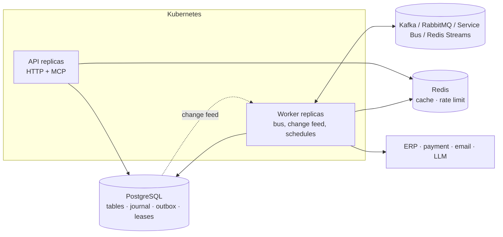

Three facts the picture leaves implicit:

- **Schedules are leader-elected.** `[CronTrigger("0 * * * *")]` fires once across the fleet, not
  once per replica.
- **Migrations are a deployment step, not a start-up side effect.** Every replica of a rolling
  update would otherwise race to migrate.
- **The broker is replaceable and no flow mentions it.** `[BusTrigger]` binds on kind and shape;
  the transport is a host registration. Swapping RabbitMQ for Kafka changes `Program.cs` and
  nothing else.

---

## 5. Guidelines

### 5.1 Naming

| Thing | Form | Example | Renaming it is |
|---|---|---|---|
| Capability id | `<domain>.<verb>` | `crm.quote.issue` | a breaking change |
| Flow id | `<domain>.<noun>.<verb>` | `crm.opportunity.advance` | a breaking change |
| Event type | `<noun>.<past participle>` | `lead.created`, `opportunity.stage.changed` | a breaking change |
| Error code | `<domain>.<what_was_wrong>` | `crm.discount_not_approved` | a breaking change for clients that branch on it |
| Permission | `<domain>.<resource>.<verb>` | `crm.discount.approve` | a breaking change — holders are now denied |
| Route | `/api/v{n}/<domain>/<plural noun>` | `/api/v1/crm/quotes` | a breaking change |

Events name what **happened**, never what should happen next. `lead.created` is an event;
`score_the_lead` is a command wearing an event's clothes, and it couples the publisher to the
one consumer it was written for.

### 5.2 Choosing an authorisation stance

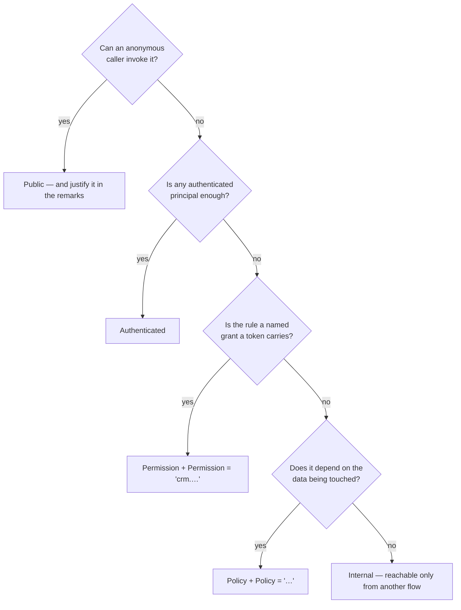

Omitting the stance is **FLOWX1010**. Naming `Permission` or `Policy` without the value is
**FLOWX1030**. Both are build errors, so an unauthorised capability cannot ship by omission.

### 5.3 Choosing policies

| Symptom you are protecting against | Policy | Precondition |
|---|---|---|
| a slow dependency holding a lease | `Timeout(…)` | — |
| a transient failure | `Retry(attempts, Backoff.ExponentialJitter())` | `Idempotent = true`, else **FLOWX1014** |
| a dependency that is down, not slow | `CircuitBreaker(ratio, breakDuration)` | — |
| one tenant's burst starving the rest | `Bulkhead(maxConcurrency)` | — |
| a read repeated within a request | `Cache(ttl, CacheScope.Tenant)` | no `SideEffects`, else **FLOWX1018** |
| a caller retrying a write | `Idempotency(window, IdempotencyScope.Tenant)` | — |
| an auditor asking who approved it | `Audit(category, redact: …)` | — |
| an abusive client | `RateLimit(permits, window, RateLimitScope.Principal)` | — |

Default to none. A policy that never fires is a line of configuration that must still be
understood, and `Retry` on the wrong capability is a duplicate order.

### 5.4 Flow, or configured transition?

Put it in **code** when it is a step somebody would call a bug if it changed without a review:
pricing arithmetic, the saga's order, what a compensation undoes.

Put it in **configuration** when a customer would call it a setting: stage names, which stage
follows which, the discount amount that needs a signature, whether an approval task is created.

The seam between them is one event. `AdvanceOpportunityFlow` says the opportunity is the
caller's and emits `opportunity.stage.changed`; what the stage becomes and what tasks go with it
is read out of the definition by a different flow that the first knows nothing about.

### 5.5 Idempotency

| The flow is reached by | Then |
|---|---|
| `Http` | take `Idempotency-Key`, declare `Idempotent = true`, and let the Integrity stage replay the recorded result |
| `Bus`, `Change`, `Schedule` | assume it will run twice. Derive the id from the input, or make the write a conditional `UPDATE` |

Two identical tasks are a legitimate thing to want — "call them back" twice in a week is two
tasks. What stops a *retried request* from writing two is the caller's key, which is a stronger
claim than "the fields match". Do not derive ids from field hashes to fake idempotency.

### 5.6 Multi-tenancy

- The tenant comes from the validated `tid` claim, and from nothing else. Not a header, not the
  payload, not a query string.
- `TenantIsolation.Row` plus PostgreSQL RLS with `FORCE`, so a missing `WHERE tenant_id = …` is
  a returned-nothing rather than a leak.
- A trigger naming no tenant is refused at admission with `tenant.required`. There is no default
  tenant, because a default tenant is a cross-tenant read with a friendly name.
- Cross-tenant reads for reporting are a **separate** read model with its own authorisation, not
  a flag on the CRM path.

### 5.7 The agent surface

The picture's `AI / ML Services` box is where a CRM most often grows a security hole. The rule:

- A model sees exactly the flows carrying `[AgentTrigger]`, generated from the same manifest the
  HTTP routes come from. There is no second list to keep in step.
- The agent path meets the **same** capability stance as the human path. `rep-contoso-token`
  reading a Northwind account gets `crm.account_not_found` over HTTP and over MCP alike, with the
  identical code.
- `ConfirmationMode.Never` is only defensible when the capability declares no `SideEffects`.
  Everything that writes takes `RequiredForSideEffects` at least.
- Start with reads. `SummariseAccountFlow` publishes one, and what a model may do is therefore
  exactly one thing.

---

## 6. Implementation guide — adding the Delivery stage

The picture's stage 4 — `Create Order → Check Inventory → in stock? → Procurement / Fulfilment →
Onboard Customer`. Order placement exists; the rest does not. This is the worked pattern for
every remaining stage.

> The code below is the shape to write, not code that ships today. Everything it uses —
> `.When()`, `.CompensateWith<T>()`, `PollUntil`, `.Emit<T>()` — is in the sample already.

### 6.1 Decide the decomposition first

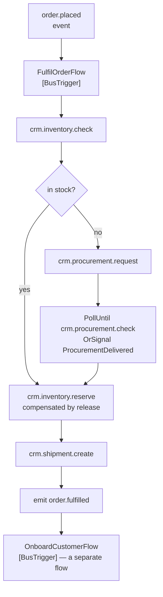

Why this split and not one long flow: the procurement wait is unbounded in business terms but
bounded by a budget; onboarding happens days later and belongs to a different owner. **One flow
per bounded unit of work; an event between them.**

### 6.2 Contracts

```csharp
/// <summary>What the fulfilment flow is given, once the delivery's body is deserialised.</summary>
public sealed record FulfilOrder(Guid OrderId, string Sku, int Quantity);

/// <summary>What the first step answers: the parsed order, and whether the stock is there.</summary>
public sealed record InventoryChecked(FulfilOrder Order, bool InStock);

/// <summary>What a reservation returns; the id is what the release undoes.</summary>
public sealed record StockReserved(Guid ReservationId, Guid OrderId, int Quantity);

/// <summary>Announced when the goods are on their way. Ids only — never a contact's address.</summary>
public sealed record OrderFulfilled(Guid OrderId, Guid ShipmentId);
```

Events name ids. A consumer that wants the address reads it from its own tables under its own
tenant and its own authorisation — putting it on the event puts it in the outbox, where
`[Sensitive]` exists to keep it from going.

### 6.3 Capabilities

```csharp
[Capability("crm.inventory.reserve", Version = "1.0.0",
    Authorization = Authorization.Internal,   // reachable only from a flow, never a route
    Idempotent = true,                        // so Retry is permitted — FLOWX1014
    SideEffects = ["crm.stock.reserved"])]    // so Cache is refused — FLOWX1018
public sealed class ReserveStock : ICapability<FulfilOrder, StockReserved>
{
    private readonly InventoryStore _store;

    public ReserveStock(InventoryStore store)
    {
        ArgumentNullException.ThrowIfNull(store);

        _store = store;
    }

    public async ValueTask<Result<StockReserved>> ExecuteAsync(
        FulfilOrder input, CapabilityContext ctx, CancellationToken ct)
    {
        ArgumentNullException.ThrowIfNull(input);
        ArgumentNullException.ThrowIfNull(ctx);

        var reservation = ctx.NewId();

        // A conditional UPDATE, not a read-then-write: at-least-once delivery means this
        // capability will be asked twice, and two reservations for one order is oversell.
        var taken = await _store
            .TryReserveAsync(ctx.TenantId, reservation, input, ct)
            .ConfigureAwait(false);

        return taken
            ? Result.Ok(new StockReserved(reservation, input.OrderId, input.Quantity))
            : Result.Fail<StockReserved>(InventoryErrors.OutOfStock(input.Sku));
    }
}
```

And its undo, which takes the **step's input**:

```csharp
[Capability("crm.inventory.release", Version = "1.0.0",
    Authorization = Authorization.Internal, Idempotent = true,
    SideEffects = ["crm.stock.released"])]
public sealed class ReleaseStock : ICapability<FulfilOrder, Released> { /* … */ }
```

### 6.4 The flow

```csharp
[Flow("crm.order.fulfil", Version = "1.0.0", Profile = ExecutionProfile.Durable, Owner = "crm-delivery")]
[FlowDeadline("PT30S")]
[BusTrigger("order.placed", Group = "crm-delivery")]
public sealed partial class FulfilOrderFlow : Flow<BusMessage, OrderFulfilled>
{
    protected override void Define(IFlowBuilder<BusMessage, OrderFulfilled> flow)
    {
        ArgumentNullException.ThrowIfNull(flow);

        flow
            .Step<CheckInventory>()

            .When(ctx => !ctx.Get<InventoryChecked>().InStock, f => f
                .Step<RequestProcurement>()
                .PollUntil<CheckProcurement>(
                    until: ctx => ctx.Get<ProcurementAttempt>().IsDelivered,
                    interval: TimeSpan.FromMinutes(15),
                    timeout: TimeSpan.FromDays(3))
                    .OrSignal<ProcurementDelivered>()
                    .OnTimeout(g => g.Fail(InventoryErrors.NotProcuredInTime())))

            .Step<ReserveStock, FulfilOrder>(ctx => ctx.Get<InventoryChecked>().Order)
                .CompensateWith<ReleaseStock>()

            .Step<CreateShipment>()

            .Emit<OrderFulfilled>(ctx => new OrderFulfilled(
                ctx.Get<InventoryChecked>().Order.OrderId,
                ctx.Get<ShipmentCreated>().ShipmentId))

            .Return(ctx => ctx.Get<OrderFulfilled>());
    }
}
```

Two details in the first two lines. The flow's input is `BusMessage` and its profile is
`Durable`, because a bus-triggered flow that is neither is **FLOWX1039**; the body arrives
**undeserialised**, so `CheckInventory` is where it becomes a `FulfilOrder` — in a capability,
where a generated serialiser is in scope and a malformed body is a `Result` failure rather than
an exception in the host. And the reservation step maps its input explicitly, because the flow's
input shape and the step's are not the same.

Read the deadline and the poll timeout together: `PT30S` bounds the **executing** part; the
three-day poll is a wait, and between attempts the instance holds no thread, no lease and no
connection. A deadline that had to cover the wait would be a lease held for three days.

### 6.5 Migration

```sql
CREATE TABLE stock_reservation (
    reservation_id  uuid PRIMARY KEY,
    tenant_id       text NOT NULL,
    order_id        uuid NOT NULL,
    sku             text NOT NULL,
    quantity        integer NOT NULL CHECK (quantity > 0),
    created_at      timestamptz NOT NULL DEFAULT now(),
    CONSTRAINT stock_reservation_order_unique UNIQUE (order_id, tenant_id)
);

ALTER TABLE stock_reservation ENABLE ROW LEVEL SECURITY;
ALTER TABLE stock_reservation FORCE ROW LEVEL SECURITY;

CREATE POLICY stock_reservation_tenant ON stock_reservation
    USING      (tenant_id IS NOT DISTINCT FROM nullif(current_setting('flowx.tenant_id', true), ''))
    WITH CHECK (tenant_id IS NOT DISTINCT FROM nullif(current_setting('flowx.tenant_id', true), ''));

GRANT SELECT, INSERT, UPDATE, DELETE ON stock_reservation TO flowx_tenant;
```

`FORCE`, or the policy does not apply to the table's owner and the isolation is decorative. The
unique constraint on `(order_id, tenant_id)` is what makes the reservation idempotent under
redelivery — the rule lives in the schema, not in a comment.

### 6.6 Registration

```csharp
builder.Services.AddSingleton<InventoryStore>();
builder.Services.AddSingleton<CheckInventory>();
builder.Services.AddSingleton<ReserveStock>();
builder.Services.AddSingleton<ReleaseStock>();
builder.Services.AddSingleton<RequestProcurement>();
builder.Services.AddSingleton<CheckProcurement>();
builder.Services.AddSingleton<CreateShipment>();
builder.Services.AddSingleton<FulfilOrderFlow.Dispatcher>();
```

A missing line here is a **start-up** failure naming the type, not a null reference on the first
order. And `app.Services.AddFlowXSubscriptions()` must already be called, or the `[BusTrigger]`
compiles, is never started, and looks exactly like a broker that is not delivering.

### 6.7 Tests, in the order they earn their place

| Level | Asserts | Needs |
|---|---|---|
| Pure unit | the reservation arithmetic and the out-of-stock boundary | nothing |
| Capability | `TryReserveAsync` twice with one order id reserves once | PostgreSQL |
| Flow | out of stock → procurement → reserve; and the failure twin, shipment fails → stock released | PostgreSQL |
| Contract | `order.placed` shape unchanged, or a version bump | manifest |
| Conformance | the publisher's per-key order over whichever broker is configured | broker |

The two that are load-bearing are the **compensation** test and the **redelivery** test. Prove
each by mutation: delete the `.CompensateWith<ReleaseStock>()` and the first must fail; remove
the unique constraint and the second must fail. A test that still passes with its subject removed
is a gate whose subject is absent.

---

## 7. Anti-patterns

| Anti-pattern | What it looks like | What to do |
|---|---|---|
| The journey as one flow | a flow with a `P30D` deadline | short flows, events, configured transitions |
| Channel adapters | `EmailTrigger`, `ChatTrigger`, each with its own auth | webhooks into `[HttpTrigger]`; the stance is on the capability |
| Noun capabilities | `crm.lead.service` | `<domain>.<verb>`, one stance each |
| Authorisation on the route | `.RequireAuthorization("…")` on the endpoint | on the capability, so the bus and agent paths meet it too |
| Rules as configuration | a JSON expression language for guards | a closed operator set over a whitelisted field set |
| Tenant from the payload | `{"tenantId": "…"}` | the `tid` claim, and nothing else |
| Retry on a write that is not idempotent | a duplicate charge | `Idempotent = true` first, or no retry — FLOWX1014 |
| Events carrying entities | `LeadCreated { Email, Address }` | ids; the consumer reads under its own authorisation |
| Commands named as events | `score_the_lead` | `lead.created`; the consumer decides what that means to it |
| A compensation that takes the output | undo cannot run when the step failed | take the step's **input** |

---

## 8. Definition of done

A CRM stage is finished when all of these hold:

- [ ] Every capability declares a stance, and the build passes (FLOWX1010, FLOWX1030).
- [ ] Every capability reachable by an at-least-once trigger is idempotent **in its write**, not
      only in its attribute.
- [ ] Every multi-write flow has compensation, and a test proves it by removing a step.
- [ ] Every table has `tenant_id`, RLS, `FORCE`, and a grant to `flowx_tenant`.
- [ ] Every `[BusTrigger]` has a registered consumer; the host refuses to start otherwise.
- [ ] Every flow carries a deadline, and every unbounded wait is a poll with a budget.
- [ ] Every sensitive member carries `[Sensitive]` and is absent from the journal and the outbox.
- [ ] Anything published to an agent has a stance a person meets identically.
- [ ] Every error a caller can branch on has a stable code and appears in the sample's README.

---

**See also:** [26 — CRM Sample · Design](26-CRM-Sample.md) ·
[07 Capability Model](07-Capability-Model.md) · [08 Flow Definition](08-Flow-Definition.md) ·
[09 Trigger Model](09-Trigger-Model.md) · [10 Policy Framework](10-Policy-Framework.md) ·
[16 Multi-Tenancy](16-Multi-Tenant.md) · [samples/crm](../samples/crm/README.md)
