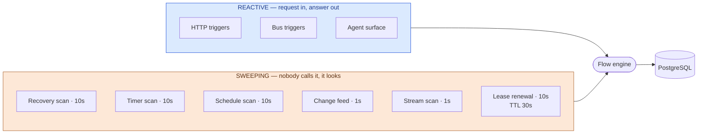
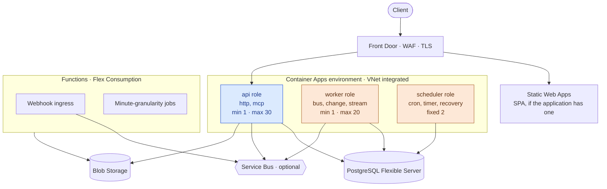
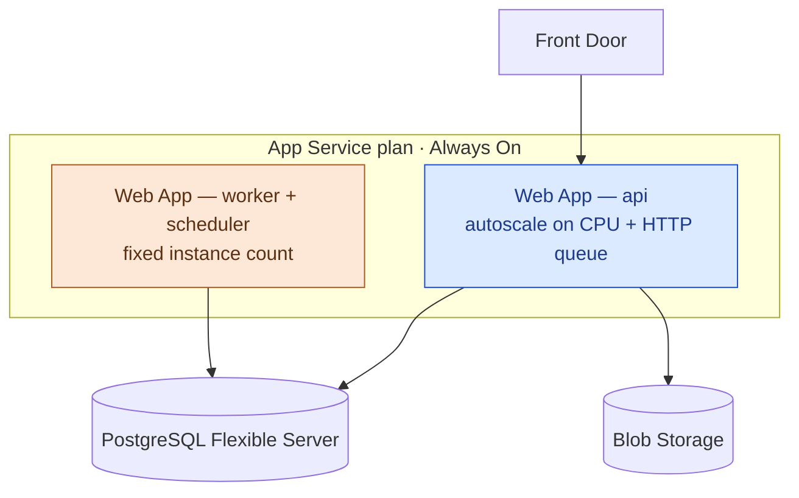
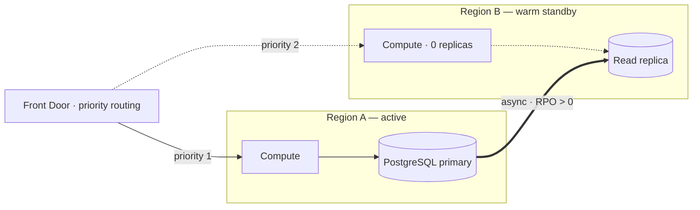
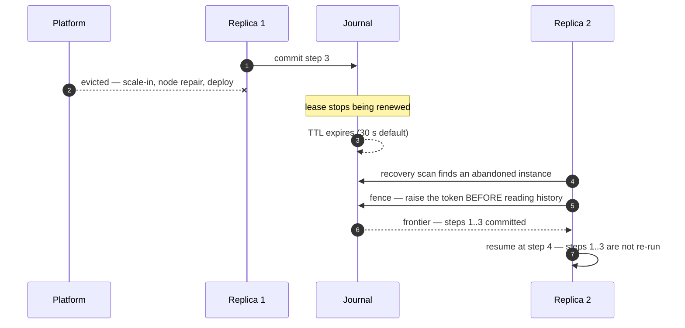
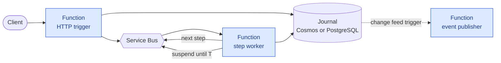
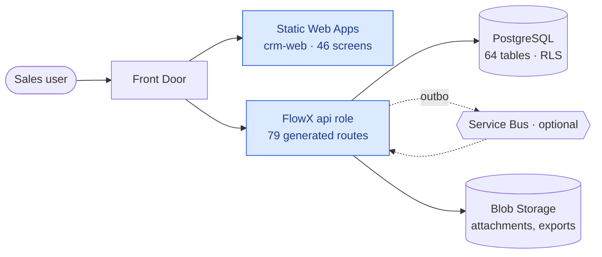

# 28 — Azure Hosting

> **Status:** Proposed · **no deployment assets exist** ·
> **Audience:** SRE, platform engineers, anyone costing a deployment
> **Answers:** which Azure compute can host FlowX, what each one costs you, and what the
> CRM adds on top?

> [!WARNING]
> **This repository contains no Bicep, no Terraform, no Dockerfile and no pipeline.**
> Everything here is a design. [18 — Cloud-Native](18-Cloud-Native.md) carries the same
> warning for Kubernetes and is the sibling of this document: 18 says how FlowX behaves in
> any orchestrator, this says which Azure service to put it in.

**Order of this document.** [§1](#1-the-host-capability-contract) to [§5](#5-scale-reliability-resilience)
are about **FlowX itself** and apply to every application built on it.
[§6](#6-the-crm-on-top) is the **CRM**, which adds a web client and a few of its own
constraints but changes nothing below it.

---

## 0. Two dispatch modes — read this first

Everything else depends on one choice, and it is a **deployment** choice rather than a
property of your flows. The same source compiles for both.

| | **`Hosted`** — ships today | **`Dispatched`** — designed, not built |
|---|---|---|
| How a flow runs | One in-process loop, holding a lease | One invocation per step |
| Waking a suspended flow | A timer scan every 10 s | A message scheduled for the wake instant |
| Noticing a dead node | A recovery scan every 10 s | The broker's message lock lapses |
| Mutual exclusion | Lease, TTL 30 s, renewed every 10 s | Fencing token on the commit, plus the message lock |
| Works with `Ephemeral` | **Yes** — this is the only mode that can | No, and it never will |
| Works with `Durable` | Yes | Yes |
| Cost per step | 1.5 µs ephemeral · ~7.6 ms durable | + ~20–50 ms |
| Can everything scale to zero? | No — two roles stay resident | **Yes** |

**Why not one mode.** A durable step already pays milliseconds to write the journal, so a
broker hop makes it ~4–5× slower and a lead conversion does not notice. An ephemeral step
pays **1.5 µs**, so the same hop makes it ~10⁴× slower — which does not make it slow, it makes
it pointless. The asymmetry is the reason both modes exist.
[ADR-0077](adr/ADR-0077-a-flow-is-dispatched-in-one-of-two-modes.md) records the decision.

> [!WARNING]
> **`Dispatched` is a design. No part of it is built.** It needs three things that do not
> exist: a `FlowX.Functions` binding generator, dispatched execution in the engine, and
> ideally a Cosmos `IFlowJournal`. Everything in this document marked `Dispatched` is
> therefore a plan. Everything marked `Hosted` describes code that runs today.

§1 to §5 below are written for **`Hosted`**, because that is what you can deploy this
afternoon. [§5.4](#54-the-dispatched-topology) is the `Dispatched` topology.

---

## 1. The host capability contract

In `Hosted` mode FlowX requires eight things from whatever runs it. Score a platform against
these and the answer falls out; argue about platforms first and you will discover the mismatch
in production.

**Every requirement below is read out of the source, not assumed.**

| # | The host must | Why — and where it comes from |
|---|---|---|
| **H1** | Keep a process alive between requests | Six hosted services sweep continuously: `FlowBusService`, `FlowChangeService`, `FlowRecoveryService`, `FlowScheduleService`, `FlowStreamService`, `FlowTimerService` |
| **H2** | Resolve sub-minute timers | `BusScanInterval`, `ChangeScanInterval` and `StreamScanInterval` default to **1 s**; recovery, timer and schedule scans to **10 s** (`FlowXOptions`) |
| **H3** | Let a process hold a lease | `LeaseTtl` **30 s**, renewed every **10 s**. A host that suspends the process for longer than the TTL hands the instance to somebody else |
| **H4** | Host ASP.NET Core endpoint routing | The generated HTTP surface is `MapFlow<TRequest,TResponse>(this IEndpointRouteBuilder …)` in `FlowX.Http` |
| **H5** | Hold outbound pooled connections | Npgsql pools per process; a broker consumer holds a link |
| **H6** | Run work concurrently in one process | `Parallel` and `ForEach` fan out inside a single flow instance |
| **H7** | Drain on shutdown | Stop accepting, finish in-flight steps, **release leases explicitly** rather than waiting for the TTL |
| **H8** | Scale on a signal that is not HTTP | Durable backlog is rows in `flow_instance`, not requests in flight |



**The reactive half is what people picture when they say serverless. The sweeping half is
what makes a durable flow durable, and it is the half that decides the hosting question.**

---

## 2. Scoring the four options

| | H1 alive | H2 sub-minute | H3 lease | H4 routing | H5 pools | H6 concurrency | H7 drain | H8 signal | Verdict |
|---|---|---|---|---|---|---|---|---|---|
| **Functions** · Consumption | ✗ | ✗ | ✗ | ✗ | ✗ | partial | partial | ✗ | **Edges only** |
| **Functions** · Flex / Premium | partial | ✗ | partial | ✗ | ✓ | ✓ | partial | partial | **Edges only** |
| **App Service** · Always On | ✓ | ✓ | ✓ | ✓ | ✓ | ✓ | ✓ | partial | **Full host** |
| **Container Apps** | ✓ | ✓ | ✓ | ✓ | ✓ | ✓ | ✓ | ✓ | **Full host** |
| **AKS** | ✓ | ✓ | ✓ | ✓ | ✓ | ✓ | ✓ | ✓ | **Full host** |

### What each verdict means in practice

**Azure Functions — hosts the edges, not the core.** Two of the failures are structural
rather than a matter of tier. A timer-triggered Function is practical at one minute, so H2
fails by an order of magnitude however much you pay. And H4 fails because `MapFlow` extends
`IEndpointRouteBuilder`: on Functions every generated route becomes a hand-written
`[Function]` with an `HttpTrigger`. For the CRM that is **79 routes** of glue replacing code
the compiler writes today, and glue that can drift from the manifest. Premium's always-ready
instances relax H1 and H3; they do not touch H2 or H4.

*What Functions is genuinely good at here:* webhook ingress, blob-triggered imports, business
jobs at minute granularity, notification fan-out. Nothing in that list holds a lease or needs
a generated route.

**App Service with Always On — the smallest step from `dotnet run`.** FlowX is an ASP.NET
Core application; App Service runs ASP.NET Core applications. Always On keeps the process up,
so H1 to H3 hold. Deployment slots give blue/green. The gap is H8: autoscale rules are CPU,
memory and HTTP queue, so a durable backlog is not a first-class scaling signal — you either
scale on a proxy metric or size for the peak.

**Container Apps — serverless economics with a real process.** Scale to zero, per-second
billing, KEDA built in, revisions for blue/green, no cluster to operate. It satisfies the
whole contract including H8, because KEDA can scale on a PostgreSQL query. This is the
recommended default.

**AKS — the most control and the most operations.** Everything in
[18 — Cloud-Native](18-Cloud-Native.md) applies directly: the three-role topology, the KEDA
scalers, the probe table, the drain sequence. Choose it when you already run AKS, need node
control, or need something Container Apps does not expose. Do not choose it to run three
containers.

> [!IMPORTANT]
> **The recommended shape is a hybrid, and it is not a compromise.**
> Put the FlowX host on Container Apps (or App Service, or AKS — pick by the paragraph above)
> and put the true edges on Functions. That is not "serverless where possible and legacy
> elsewhere". It is each half of the runtime on the platform that matches its shape.

---

## 3. Reference topologies

All four share [§4](#4-managed-services-every-topology-shares). Only the compute differs.

### 3.1 Container Apps — the recommended default



**Three roles, one image.** The code and the manifest are identical; only
`FLOWX_TRIGGERS` and the scale rule differ. This mirrors
[18 §1](18-Cloud-Native.md#1-deployment-topology) exactly, because it is the same topology
on a different orchestrator. A small deployment may run all three in one app.

### 3.2 App Service — the simplest lift



Two Web Apps on one plan, not one: the sweeping roles must not scale with request rate, and
on a single app they would. **Always On is mandatory**, not a preference — without it the
process is unloaded when idle and H1, H2 and H3 all fail at once.

### 3.3 AKS

Use [18 — Cloud-Native](18-Cloud-Native.md) unchanged. Add, for Azure specifically: Workload
Identity instead of secrets, AGIC or Front Door for ingress, KEDA installed as an add-on
rather than by hand, and the same PostgreSQL Flexible Server as everything else.

### 3.4 Functions, on their own

Only for an application whose flows are **all ephemeral**: no durable profile, no schedules,
no timers, no change feed. Then H1, H2, H3 and H8 stop applying and Functions is a fine host
— but so is anything, and you no longer need most of the runtime. This row exists to be
honest that the case exists, not to recommend it.

---

## 4. Managed services every topology shares

| Need | Service | Note |
|---|---|---|
| Journal, leases, timers, recovery index, idempotency, cache, rate limits, change feed, tenant directory, stream checkpoints | **PostgreSQL Flexible Server**, General Purpose, zone-redundant HA | The Postgres plugin implements every one of those store contracts. **Redis is optional**, not required |
| Front door, WAF, TLS | **Front Door Standard** | One origin group for the SPA, one for the API, so the browser sees same-origin |
| Files | **Blob Storage** + lifecycle rules | Private endpoint; user-delegation SAS for download. Never proxy large files through a flow |
| Commands and events out of the system | **Service Bus** | A plugin ships. See the warning below |
| High-volume streaming | **Event Hubs** | **No Event Hubs plugin exists.** The path is the Kafka plugin against the Event Hubs Kafka endpoint |
| Secrets and identity | **Key Vault** + managed identity | With Entra authentication on PostgreSQL there is no database password to store |
| Telemetry | **Application Insights** | FlowX already emits OpenTelemetry. Point the exporter at it; do not add a second path |

> [!WARNING]
> **The two broker plugins are largely unexecuted.** The Azure Service Bus suite runs
> **7 tests and skips 22** without a live broker; the Kafka suite runs **1 and skips 21**.
> They compile and they are written against the conformance contract, but CI has never run
> most of them. Standing the broker up in a test subscription and running the conformance
> suite to zero skips is a **gate** before either goes on a production path.

> [!TIP]
> **You may not need a broker at all.** Events are staged in the outbox inside the same
> transaction as the step that produced them, and the change feed reads them with a cursor
> over `pg_current_xact_id()`. Add Service Bus when something outside FlowX must consume
> events, or when you want dead-letter tooling. Not because the diagram looks empty.

### 4.1 The connection ceiling — the one that bites

> [!CAUTION]
> **FlowX does not work behind PgBouncer today, and this section used to make PgBouncer
> mandatory.** Two incompatibilities, both reproduced on 2026-08-14 against PgBouncer 1.22 and
> PostgreSQL 16:
>
> 1. The adapter selects its schema with Npgsql's `SearchPath`, which travels as a PostgreSQL
>    **startup parameter**. PgBouncer refuses the connection outright:
>    `08P01: unsupported startup parameter: search_path`.
> 2. The documented remedy, `ignore_startup_parameters = search_path`, makes PgBouncer accept
>    the connection and then **discard the schema**. Every statement runs against the wrong
>    one: `42P01: relation "flow_instance" does not exist`.
>
> Neither is safe, and the second is the dangerous one because the application starts. A
> pooled endpoint would have to carry the schema another way — on PgBouncer's own database
> line, or as a role default — and neither survives `TenantIsolation.Schema`, where the schema
> is chosen per tenant when the connection is opened.
>
> **So the ceiling below is real and PgBouncer is not currently the way past it.** The honest
> options today are a larger `max_connections`, a bigger tier, or session pooling.
> [PLAN open item 21](../PLAN.md#9-open-items-blocking-the-plan) carries it.
>
> *The separate cross-tenant read this section warned about **is fixed**: the tenant binding
> became transaction-local the same day — blocker B-5 in [CHECKLIST](../CHECKLIST.md).*


Serverless scales instances; PostgreSQL counts connections. Thirty replicas at Npgsql's
default pool of 100 asks for **3 000 connections** against a server that offers a few
hundred. Under `TenantIsolation.Schema` the adapter keeps a pool **per tenant schema**, which
multiplies it again.

| # | Control | Setting |
|---|---|---|
| 1 | Built-in PgBouncer | Enable on Flexible Server, transaction pooling |
| 2 | Cap the client pool | `Maximum Pool Size` 10–20 per replica, not the default 100 |
| 3 | Cap the replicas | Choose `maxReplicas` from the connection budget |
| 4 | Prefer row isolation | `TenantIsolation.Row` with RLS keeps one pool for all tenants |
| 5 | Alert early | Alarm at 70 % of `max_connections` |

> [!CAUTION]
> **Row-level security does NOT hold through PgBouncer transaction pooling today. Verified,
> not suspected.** This block used to say "a test to run, not an assumption". The test was
> run on 2026-08-14 against PgBouncer 1.22 in front of PostgreSQL 16, and it failed.
>
> `TenantScope` binds the tenant with `set_config('flowx.tenant_id', @tenant, false)` — the
> `false` makes it **session-scoped** — issued once when the connection is opened. Its safety
> argument, written at the declaration, is that "a scoped journal writes both values on every
> connection it opens, so a pooled connection cannot carry one execution's tenant into the
> next". That holds for Npgsql's pool, where one client connection is one server session. It
> does not hold for PgBouncer in transaction mode, where consecutive statements from one
> client may land on different server connections and one server connection is shared between
> clients.
>
> Reproduced deterministically at `default_pool_size = 1`, three round trips:
>
> ```text
> client A: SELECT set_config('flowx.tenant_id','tenant-A',false)   -> tenant-A
> client B: SELECT set_config('flowx.tenant_id','tenant-B',false)   -> tenant-B
> client A: SELECT current_setting('flowx.tenant_id')               -> tenant-B   ← A reads as B
> ```
>
> The same three steps against PostgreSQL directly return an empty setting on the third,
> which is the correct answer: no leak.
>
> **Until this is fixed, do not combine `TenantIsolation.Row` with a transaction-pooling
> proxy.** The two safe combinations are session pooling, which preserves the assumption at
> the cost of the connection saving, or a direct connection with the replica count bounded by
> `max_connections`. [PLAN open item 21](../PLAN.md#9-open-items-blocking-the-plan) carries
> the fix, which is to make the binding transaction-local and issue it in the same transaction
> as the statement — a change to the adapter's execution path, not a setting.

---

## 5. Scale, reliability, resilience

### 5.1 Scale on the signal that saturates

FlowX flows are I/O-bound. A CPU rule sits at 20 % while p99 climbs.

| Role | Signal | Threshold | Trap |
|---|---|---|---|
| api | Concurrent requests, p99 | ~50 per replica | Noisy at low traffic; use a stabilisation window |
| worker | Queue depth, or `SELECT count(*) FROM flow_instance WHERE state='Pending'` | 100 / 50 | The query needs an index on `(state, created_at)` or the scaler becomes load |
| scheduler | none — fixed pair | — | Autoscaling a sweeper duplicates work |

Scale out in about 30 s, scale in over about 300 s. Aggressive scale-in on a durable worker
causes lease churn, and reacquiring instances costs more than the replica saved.

**The real ceiling, in order:** database connections, then durable commit throughput
(measured at roughly **4 100 commits/s on four cores**), then downstream rate limits. Not
replicas.

### 5.2 Availability, and why cross-region is active/passive

Inside one region: availability zones for compute, zone-redundant HA on PostgreSQL, ZRS
storage, at least two replicas per role in production.

Across regions, FlowX fences writes with a monotonic token per instance held in **one**
journal. Two regions writing one journal is not a setting; it is a different consistency
model. So one active region, one warm standby.



> [!CAUTION]
> **Stop region A before promoting region B.** Two regions running schedulers against two
> journals fire every cron twice and process every instance twice — the fencing token
> protects one journal, not two. The runbook order is: scale A to zero, then promote. Rehearse
> it in that order or the number you publish for RTO is fiction.

### 5.3 Resilience — a replica dying mid-flow is a designed-for case



This path is exercised by the chaos rig, which SIGKILLs a node at a step boundary across
10 000 flows and checks that nothing is lost and nothing is duplicated. Rehydration is
measured at **p99 3.634 ms** — [B7-B8-durability.md](benchmarks/B7-B8-durability.md).

| Failure | Configure |
|---|---|
| Graceful scale-in | Grace period ≥ longest step budget + 10 s, so the drain in [18 §2](18-Cloud-Native.md#2-health-and-lifecycle) can release leases explicitly |
| Database failover | Npgsql transient retry. A refused commit writes nothing, so nothing half-writes |
| Downstream failure | Declare a policy — timeout, retry, breaker. Compensation unwinds in reverse order |
| Poison message | Broker max delivery count → dead-letter, and alert on DLQ depth > 0 |
| Duplicate delivery | Idempotency store is already in PostgreSQL; give mutating routes an `Idempotency-Key` |

### 5.4 The Dispatched topology

Once the three missing pieces exist, the same application deploys with nothing resident.



Note what disappears: no scan of any kind, no lease, no resident replica, and — with a Cosmos
journal — no outbox poller and no connection pool. Note what appears: a message per step, a
trace that is only whole if context rides the message, and a bill that scales with steps
rather than with hours.

### 5.5 The four alerts worth having

| Alert | Condition | Why |
|---|---|---|
| Instances stuck pending | `Pending` older than 5 minutes > 0 | The best single indicator that recovery or the scheduler stopped |
| Database connections | > 70 % of `max_connections` | The ceiling in §4.1, before the 500s |
| Dead-letter depth | > 0 for 5 minutes | A DLQ nobody watches is a data-loss queue |
| Outbox lag | Unpublished rows older than 1 minute | Events staged but not flowing |

### 5.6 Telemetry — you are already OpenTelemetry-ready

**FlowX takes no dependency on any OpenTelemetry package.** It instruments with
`System.Diagnostics.ActivitySource` and `System.Diagnostics.Metrics.Meter` from the base class
library, under the source name **`FlowX`**. Every OTel exporter bridges those two APIs
natively, so choosing a backend is a decision your *host* makes and FlowX never sees.

That is what makes Azure Monitor a package reference rather than a re-instrumentation:

```csharp
// The whole wiring. FlowX itself is untouched.
builder.Services.AddOpenTelemetry()
    .UseAzureMonitor()                       // Azure.Monitor.OpenTelemetry.AspNetCore
    .WithTracing(t => t.AddSource("FlowX"))
    .WithMetrics(m => m.AddMeter("FlowX"));
```

Swap `UseAzureMonitor()` for an OTLP exporter and the same spans reach Grafana, Honeycomb or a
collector. Nothing in the flow, the capability or the manifest changes.

**What is emitted today** — all seven have a producer in the runtime:

| Instrument | Kind | Use it for |
|---|---|---|
| `flowx_flow_duration_seconds` | histogram | Flow p99. The latency signal worth scaling on |
| `flowx_flow_total` | counter | Throughput and outcome mix |
| `flowx_step_duration_seconds` | histogram | Which step in a flow is slow |
| `flowx_capability_duration_seconds` | histogram | Which dependency is slow, across all flows |
| `flowx_capability_unhandled_total` | counter | **Alert on any value above zero** — a capability that threw instead of returning an error is a defect |
| `flowx_journal_commit_seconds` | histogram | The store's own latency, i.e. B7 in production |
| `flowx_lease_lost_total` | counter | Leases lost while still executing. Rising means scale-in is too aggressive |

Span attributes carry `flowx.flow.id`, `flowx.flow.instance_id`, `flowx.flow.profile`,
`flowx.capability.id`, `flowx.step.id`, `flowx.attempt`, `flowx.tenant.id`,
`flowx.error.code` and `flowx.error.category` — so "show me every failed step of this instance
across every node" is one query.

> [!CAUTION]
> **`flowx_trigger_admitted_total` is declared and has no producer.** So are the
> `flowx.trigger.kind` and `flowx.trigger.source` attributes.
> [18 §3](18-Cloud-Native.md#3-autoscaling) shows an autoscale rule using an admitted-rate
> metric; that rule cannot fire today. Scale on `flowx_flow_duration_seconds`, on concurrent
> requests, or on the `flow_instance` query in §5.1 instead.

**In `Dispatched` mode this section still holds**, with one addition: a flow becomes *n*
invocations, so the trace is only whole if the W3C trace context is carried on the message.
That is a requirement on the dispatched implementation, and it is called out in ADR-0077's
trade-offs rather than assumed.

---

## 6. The CRM on top

Everything above applies unchanged. The CRM adds four things and no new platform
requirements.



| What the CRM adds | Hosting consequence |
|---|---|
| A React SPA, 46 screens | **Static Web Apps**. Put it behind the same Front Door as the API so the browser sees same-origin and the CORS policy is not load-bearing |
| 79 generated HTTP routes | The strongest single argument for H4, and therefore against hosting the CRM API on Functions |
| 64 tables under row-level security | §4.1's PgBouncer caution applies with full force — the tenant context is what RLS reads |
| A seeded demo tenant | `CRM_SEED_FILE` refuses to run in a Production environment unless `CRM_SEED_ALLOW_PRODUCTION` is set. Leave that guard on |

**The broker stays optional for the CRM.** The configured process is driven by the change
feed over the outbox. Without a broker the three `lead.created` subscriptions go quiet and
everything else runs.

---

## 7. Delivery, with exit criteria

| Phase | Build | Exit criterion |
|---|---|---|
| **0** | One region, all roles in one app, no HA, no broker. Managed identity to the database from day one | The application serves a seeded tenant end to end and `/health/ready` reports the schema it writes against |
| **1** | Split into api / worker / scheduler. KEDA rules from §5.1. PgBouncer on, pools capped | A load test holds p99 while the api role scales, and connections stay under 70 % |
| **2** | Zone-redundant HA. Run the chaos rig against the deployed environment. Force a database failover under load | Zero lost instances and zero duplicated effects, from the rig's own verdict |
| **3** | Functions for the edges. A broker only if fan-out is genuinely needed | The broker's conformance suite passes with **zero skips** |
| **4** | Region B, geo-replicated registry, Front Door priority routing, runbook in §5.2's order | A timed failover rehearsal produces real RPO and RTO numbers |
| **5** | The four alerts, journal retention, reserved capacity | Every alert has fired at least once in a drill |

---

## 8. What must be measured before any of this is promised

**Run `tests/FlowX.Durability.Bench` against a real Azure Database for PostgreSQL Flexible
Server.** It answers the two questions every number above rests on: how many durable commits
per second does the tier you can afford sustain, and what is the p99 at that rate? Today
those are known only for a four-core container — roughly 4 100 commits/s with a store-side
p99 of 14.1 ms, which is [not yet a verdict](benchmarks/B7-B8-durability.md) against B7's
`15 ms @ 5 000/s`.

Every replica count, every scaling threshold and every latency promise in this document is
downstream of those two numbers.

**Related:** [ADR-0076](adr/ADR-0076-a-host-is-chosen-against-a-capability-contract.md) records
why hosting is decided by the contract in §1 rather than by platform preference.
[18 — Cloud-Native](18-Cloud-Native.md) is the orchestrator-neutral operations specification.
[16 — Multi-Tenancy](16-Multi-Tenant.md) is where the isolation level in §4.1 is decided.
