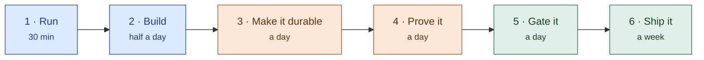
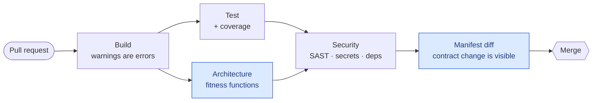

# 29 — From Zero to Production

> **Status:** Proposed · **Audience:** anyone adopting FlowX, from first flow to first release
> **Answers:** what do I learn in what order, how do I gate my own repository, and how do I
> ship it?

This document is a **path**, not a tutorial. It says what to read, in what order, and what you
should be able to do at the end of each stage. The teaching happens in the documents it points
at — above all [24 — Getting Started](24-Getting-Started.md), which is a keyboard-in-hand
walkthrough and the only thing you need for stages 1 and 2.

---

## 1. The ladder

Six stages. Each ends with something you can demonstrate, not something you have read.



### Stage 1 — Run something (30 minutes)

```bash
dotnet run --project samples/ecommerce
```

No database, no broker, no configuration. It serves an order over HTTP and answers `POST /mcp`
for an agent. Read [samples/ecommerce](../samples/ecommerce/README.md) while it runs.

**You can now:** point at a running FlowX application and say what each part of it is.

### Stage 2 — Build your own (half a day)

[24 — Getting Started](24-Getting-Started.md) §1 to §7. Write a capability, compose a flow,
add a step, add compensation.

Two ideas to hold on to, because everything later rests on them:

- **A capability knows nothing about transport.** It takes an input, returns
  `Result<T>`, and you can test it with `new`.
- **A failure is a value, not an exception.** `Result.Fail(...)` is an ordinary outcome the
  engine understands; a thrown exception is a defect, and there is a metric that counts them.

**You can now:** build an HTTP API whose retry, compensation and OpenAPI document you did not
write.

### Stage 3 — Make it durable (a day)

[24 §8](24-Getting-Started.md#8-going-durable), then [06 — Execution Engine](06-Execution-Engine.md)
and [11 — Distributed Runtime](11-Distributed-Runtime.md).

This is the step where FlowX starts earning its cost. A durable flow survives the process that
started it: every step boundary is committed, and another node resumes from the frontier.
Needs PostgreSQL.

**You can now:** kill the process mid-flow and watch it finish anyway.

### Stage 4 — Prove it (a day)

[23 — Testing Strategy](23-Testing-Strategy.md) and [24 §10](24-Getting-Started.md#10-testing-with-flowtesthost).

FlowX gives you `FlowTestHost`, which runs a real flow against real generated dispatch with no
HTTP and no database. Test capabilities alone, flows end to end, and the failure paths that
matter — a declined payment, a compensation that must run in reverse.

**You can now:** assert a saga unwinds correctly, in a unit test, in milliseconds.

### Stage 5 — Gate it (a day)

[§2 of this document](#2-devsecops-on-github), plus [21 — Quality Gates](21-Quality-Gates.md)
for the thresholds and the reasoning.

**You can now:** merge with confidence, because a pull request that breaks something goes red
for a reason a reviewer can read.

### Stage 6 — Ship it (a week)

[28 — Azure Hosting](28-Azure-Hosting.md) for the target,
[18 — Cloud-Native](18-Cloud-Native.md) for the operating model,
[15 — Security](15-Security.md) and [16 — Multi-Tenancy](16-Multi-Tenant.md) before you take
real data.

**You can now:** deploy, observe, and recover.

### Where to go after the ladder

| You want | Read |
|---|---|
| Every DSL construct | [08 — Flow Definition](08-Flow-Definition.md) |
| Triggers beyond HTTP | [09 — Trigger Model](09-Trigger-Model.md) |
| Retry, breaker, cache, idempotency | [10 — Policy Framework](10-Policy-Framework.md) |
| Multi-tenancy done properly | [16 — Multi-Tenant](16-Multi-Tenant.md) |
| Agents and the manifest | [13 — AI-Native](13-AI-Native.md) |
| To write your own plugin | [17 — Plugin System](17-Plugin-System.md) |
| A large worked example | [26 — CRM Sample](26-CRM-Sample.md) and `samples/crm` |

---

## 2. DevSecOps on GitHub

This section is about gating **your** repository. [21 — Quality Gates](21-Quality-Gates.md) is
about this one — read it for the reasoning and the thresholds; copy the shape below.

> [!TIP]
> **Working examples are in this repository.** `.github/workflows/` holds five files —
> `ci.yml`, `quality.yml`, `security.yml`, `performance.yml`, `chaos.yml` — and every job
> named below exists there and runs. Steal from them rather than starting blank.

### 2.1 What runs on a pull request



| Gate | What it catches | Where to look |
|---|---|---|
| **Build with warnings as errors** | Everything the analysers know, before review | `TreatWarningsAsErrors` in `Directory.Build.props` |
| **Tests + coverage floor** | The obvious | `quality.yml` → `coverage` |
| **Architecture fitness functions** | Layering violations, forgotten forwards, a budget table that lies | `tests/FlowX.Architecture.Tests` — 99 of them |
| **Manifest diff** | A contract change nobody meant to make | `ci.yml` → `manifest`, using `flowx diff` |
| **SAST — CodeQL and Semgrep** | Injection, unsafe deserialisation, the OWASP list | `security.yml` → `codeql`, `semgrep` |
| **Secret scanning** | A key in a commit | `security.yml` → `secrets` |
| **Dependency scanning** | Known CVEs, and licences you cannot ship | `security.yml` → `dependencies` |
| **IaC scanning** | A storage account left public | `security.yml` → `iac` |

**The two that are specific to FlowX**, and the reason a FlowX repository can gate more than a
typical one:

- **The manifest is a build artifact.** `flowx.manifest.json` is generated at compile time and
  describes every flow, capability, route and event. Commit a baseline and diff against it in
  CI: a changed route or a changed contract then arrives as a **reviewable diff** rather than
  as a surprise in production. This repository does exactly that in `ci.yml`.
- **Architecture rules are executable.** A rule written only in a document decays. Written as
  a test, it fails the build on the pull request that breaks it. If you take one habit from
  this repository, take that one.

### 2.2 Deploying from GitHub, without secrets

Use **OIDC federated credentials**, not a stored service principal password.

```yaml
permissions:
  id-token: write        # required for OIDC
  contents: read

steps:
  - uses: azure/login@v2
    with:
      client-id:       ${{ secrets.AZURE_CLIENT_ID }}      # an id, not a secret
      tenant-id:       ${{ secrets.AZURE_TENANT_ID }}
      subscription-id: ${{ secrets.AZURE_SUBSCRIPTION_ID }}
```

There is no password anywhere in that. GitHub proves the workflow's identity to Entra ID, and
Entra hands back a short-lived token. Combined with **managed identity in Azure** and **Entra
authentication on PostgreSQL** ([28 §4](28-Azure-Hosting.md#4-managed-services-every-topology-shares)),
a correctly built FlowX deployment has **no database password in existence** — not in a vault,
not in an environment variable, not in a pipeline.

### 2.3 Environments and promotion

| Environment | Gate | Data |
|---|---|---|
| **Preview** — one per pull request | Automatic | Throwaway schema, seeded |
| **Staging** | Automatic on merge to the default branch | Anonymised |
| **Production** | **Manual approval** — a GitHub Environment protection rule | Real |

Run database migrations as their own step **before** the new revision takes traffic, and keep
them backward-compatible for one release, so a rollback does not need a database restore.

### 2.4 Supply chain

Pin GitHub Actions by commit SHA rather than by tag — a tag can be moved, a SHA cannot. This
repository does it everywhere; `actions/checkout@11d5960a…` rather than `@v4`. Add an SBOM,
scan the image in the registry, and pin base images by digest.

---

## 3. Deploying to Azure

[28 — Azure Hosting](28-Azure-Hosting.md) is the design: which compute can host FlowX, why,
and what each option costs you. The short version:

| You want | Use |
|---|---|
| The smallest step from `dotnet run` | **App Service** with Always On |
| Serverless economics, still a real process | **Container Apps** — the recommended default |
| You already run Kubernetes | **AKS**, following [18](18-Cloud-Native.md) unchanged |
| Webhooks, blob imports, minute-granularity jobs | **Functions**, alongside any of the above |
| Everything scaled to zero, durable flows only | **Functions** in `Dispatched` mode — [not built yet](adr/ADR-0077-a-flow-is-dispatched-in-one-of-two-modes.md) |

Three things to get right on the first day, because retrofitting them is painful:

1. **Managed identity to the database.** No password to rotate or leak.
2. **PgBouncer on, client pool capped.** [28 §4.1](28-Azure-Hosting.md#41-the-connection-ceiling--the-one-that-bites)
   — serverless scales instances and PostgreSQL counts connections, and this is the ceiling
   you will hit first.
3. **Telemetry wired before you need it.** One package and three lines
   ([28 §5.6](28-Azure-Hosting.md#56-telemetry--you-are-already-opentelemetry-ready)); FlowX
   emits OpenTelemetry already and takes no dependency on any exporter.

Then the phases in [28 §7](28-Azure-Hosting.md#7-delivery-with-exit-criteria), each with an
exit criterion you can check rather than a date.

---

## 4. Before you go to production

> [!IMPORTANT]
> **Talk to the author first** — [votrongdao@gmail.com](mailto:votrongdao@gmail.com).
> Which execution profile a flow should carry, how tenants are isolated, where the journal
> lives and how it is sized, which performance budgets actually apply to your workload and
> which are still unmeasured, what a schedule does when a node dies — every one of those has a
> right answer for your system, and the wrong answer usually surfaces in production rather
> than in a test.

And read the honest part of the specification, not only the promises:
[14 §1.1](14-Performance.md#11-platform-budgets-overhead-attributable-to-flowx-excluding-user-code-and-io)
says which performance budgets are measured and which are not, and
[CHECKLIST.md](../CHECKLIST.md) carries the current state of the project including what is
blocked.
