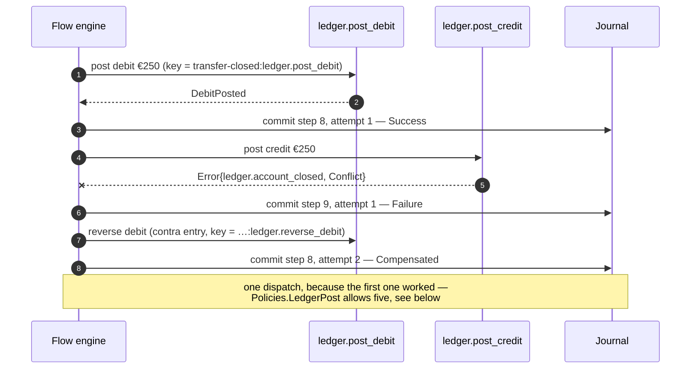
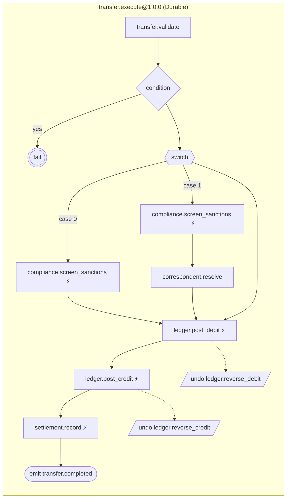

# Sample — Banking funds transfer

A six-step durable saga behind one HTTP endpoint: validate, screen, debit, credit,
record, announce. It is the repository's second reference application and the only
one that journals, branches, switches, rejects and emits.

> **This file described deny-by-default authorisation, immutable audit and rate
> limiting before the sample existed.** It now describes the sample that does. Three
> of those claims did not survive contact with the runtime, and
> [what is declared and not enforced](#what-is-declared-and-not-enforced) is the
> section where each one is retracted rather than quietly dropped. A sample README
> that documents features the sample does not have is worse than no sample — and in a
> banking sample it is worse than that.

```bash
export FLOWX_POSTGRES_CONNECTION="Host=localhost;Port=5432;Database=postgres;Username=postgres"

dotnet run --project samples/banking

curl -X POST http://localhost:5000/api/v1/transfers \
  -H 'Content-Type: application/json' \
  -H 'Idempotency-Key: transfer-7f3a' \
  -d '{"debtorIban":"GB33BUKB20201555555555",
       "creditorIban":"DE89370400440532013000",
       "amount":120.50,"currency":"EUR","channel":1}'
```

```json
{
  "transferId": "transfer-7f3a",
  "debitEntryId": "transfer-7f3a:ledger.post_debit",
  "creditEntryId": "transfer-7f3a:ledger.post_credit",
  "amount": 120.50,
  "currency": "EUR"
}
```

**This sample does not start without PostgreSQL, and that is the point.** The flow
declares `Durable`, so every step boundary is committed before the next one runs. A
host that registers no journal refuses every transfer with
`flow.durability_not_configured`; `Program.cs` refuses to start instead, because
discovering that a payments service has no journal one request at a time is not a
thing anyone should have to do. The ecommerce sample made the opposite trade for the
opposite reason, and [FLOWX1012](../../docs/diagnostics/FLOWX1012.md) argues both.

---

## What is here

| File | What it holds |
|---|---|
| `Contracts.cs` | The records on the wire and between steps. No behaviour. |
| `Capabilities.cs` | Eight capabilities, four ports, and every business rule. |
| `Policies.cs` | The declared policy sets — and what they do at run time, which is nothing. |
| `ExecuteTransferFlow.cs` | The control flow: order, condition, rejection, recovery, the event. |
| `Program.cs` | Composition. Registrations, the migration, and `MapFlowX()`. |
| `Infrastructure.cs` | In-memory ledger, screening, directory, register, and the JSON context. |

## The flow

```csharp
[Flow("transfer.execute", Version = "1.0.0", Profile = ExecutionProfile.Durable, Owner = "payments")]
[FlowDeadline("PT60S")]
[HttpTrigger("POST", "/api/v1/transfers", Idempotent = true)]
public sealed partial class ExecuteTransferFlow : Flow<ExecuteTransfer, TransferResult>
{
    protected override void Define(IFlowBuilder<ExecuteTransfer, TransferResult> flow)
    {
        ArgumentNullException.ThrowIfNull(flow);

        flow
            .Step<ValidateTransfer>().WithPolicy(Policies.Admission)

            .When(
                ctx => ctx.Get<ValidatedTransfer>().Amount > ctx.Get<ValidatedTransfer>().AvailableBalance,
                shortOfFunds => shortOfFunds.Fail(TransferErrors.InsufficientFunds))

            .Switch(ctx => ctx.Get<ValidatedTransfer>().Channel)
                .Case(TransferChannel.Sepa,  b => b.Step<ScreenSanctions>().WithPolicy(Policies.ExternalRead))
                .Case(TransferChannel.Swift, b => b
                    .Step<ScreenSanctions>().WithPolicy(Policies.ExternalRead)
                    .Step<ResolveCorrespondent>().WithPolicy(Policies.ExternalRead))

            .Step<PostDebit, DebitInstruction>(ctx => /* … */)
                .CompensateWith<ReverseDebit>().WithPolicy(Policies.LedgerPost)

            .Step<PostCredit, CreditInstruction>(ctx => /* … */)
                .CompensateWith<ReverseCredit>().WithPolicy(Policies.LedgerPost)

            .Step<RecordSettlement, SettlementInstruction>(ctx => /* … */)
                .WithPolicy(Policies.SettlementRegister)

            .Emit<TransferCompleted>(ctx => /* … */)
            .Return(ctx => /* … */);
    }
}
```

There is no business rule in that method and no mention of HTTP. Four things in it
are worth reading twice.

**The rejection is a node, not an `if`.** A short balance ends the flow through
`.Fail(TransferErrors.InsufficientFunds)`, which the engine treats exactly as it
treats a capability returning `Result.Fail` — the failure path, and the completed
compensable steps unwind. `ValidateTransfer` *reports* the balance and never judges
it, so "we refuse transfers we cannot fund" is in the compiled plan, in
`flowx.manifest.json` and in the rendered diagram rather than buried in a class.
That is ADR-0007's point: an outcome a caller can handle is a value.

**The switch has no `Default`, and that is the modelling.** A `Book` transfer — both
accounts here, money never leaves the bank — matches no case and continues after the
switch, screened by nobody. `ISwitchBuilder` documents that as the rule; writing
`.Default(b => { })` would be noise, and the manifest publishes the empty third
branch so a reviewer can see it.

**Both ledger legs are compensable and their undo is a contra entry.** A ledger is
append-only: `ReverseDebit` posts the opposite amount under its own key rather than
deleting anything, so the reversal is as auditable as the write.

**The `Emit` is staged in the step's own transaction.** `PostgresFlowJournal` writes
the step row and the outbox row in one `CommitAsync`, so the event and the state it
announces commit together or not at all — and the two account numbers are
`[redacted]` in the body before it ever reaches the table.

---

## The failure path — the one that matters

Every other failure in this flow happens before the first ledger write. This one
does not: the beneficiary account is one the ledger holds and has closed, so the
credit is refused *after* the debit is already posted.

```bash
curl -X POST http://localhost:5000/api/v1/transfers \
  -H 'Content-Type: application/json' \
  -H 'Idempotency-Key: transfer-closed' \
  -d '{"debtorIban":"GB94BARC10201530093459",
       "creditorIban":"FR7630006000011234567890189",
       "amount":250,"currency":"EUR","channel":0}'
```

```json
{
  "type": "https://flowx.dev/errors/ledger.account_closed",
  "title": "The request conflicts with the current state",
  "status": 409,
  "detail": "The beneficiary account has been closed and cannot be credited.",
  "code": "ledger.account_closed",
  "correlationId": "0HNNFECS35QVR:00000001"
}
```

And this is what PostgreSQL holds afterwards — the two transfers above, side by side:

```
     correlation_id     |   state   | step_id | attempt |         capability          |   outcome
------------------------+-----------+---------+---------+-----------------------------+-------------
 0HNNFECS35QVQ:00000001 | Completed |       0 |       1 | transfer.validate           | Success
 0HNNFECS35QVQ:00000001 | Completed |       4 |       1 | compliance.screen_sanctions | Success
 0HNNFECS35QVQ:00000001 | Completed |       8 |       1 | ledger.post_debit           | Success
 0HNNFECS35QVQ:00000001 | Completed |       9 |       1 | ledger.post_credit          | Success
 0HNNFECS35QVQ:00000001 | Completed |      10 |       1 | settlement.record           | Success
 0HNNFECS35QVQ:00000001 | Completed |      11 |       1 | transfer.completed          | Success
 0HNNFECS35QVR:00000001 | Failed    |       0 |       1 | transfer.validate           | Success
 0HNNFECS35QVR:00000001 | Failed    |       8 |       1 | ledger.post_debit           | Success
 0HNNFECS35QVR:00000001 | Failed    |       9 |       1 | ledger.post_credit          | Failure
 0HNNFECS35QVR:00000001 | Failed    |       8 |       2 | ledger.reverse_debit        | Compensated
```

The last row is the whole claim: the debit is in the journal, the credit failed, and
the reversal committed against the *same step id* as the write it undoes. Money is
never left in one account only, and every step and every reversal is a row.



---

## What is declared and not enforced

This is the section the sample exists for. Everything below is in
`flowx.manifest.json` and is visible to a reviewer; what has changed is that some of it
now changes how the program runs and some of it still does not, and the point of the
section is to say which is which. Each claim has a test that goes red if it stops being
true — in either direction.

### Three of this bank's eight declarations are inert; five of them run

*This section used to read "the policy engine is P4, so every policy but one is
inert".* The engine now executes `PolicyStage.Resilience`, so what is left is
narrower and this is the exact split:

| Declared in `Policies.cs` | Set | Runs? |
|---|---|---|
| `Timeout(PT3S)` · `Retry(3)` · `CircuitBreaker(0.5, PT30S)` | `ExternalRead` | **yes** — the screening call is bounded, retried and breakered |
| `Timeout(PT5S)` | `LedgerPost`, `SettlementRegister` | **yes** — each ledger write and the settlement write is bounded |
| `CompensationRetry(5)` | `LedgerPost` | **yes** — since WP-57 |
| `Audit("financial", …)` | `LedgerPost`, `SettlementRegister` | no — **this bank writes no policy-driven audit record** |
| `RateLimit(20, PT1S)` · `Idempotency(PT24H)` | `Admission` | no — nothing is counted, nothing is replayed |

**The cut is a list of kinds, not a range of stages, and this section used to get
that wrong in two different ways.** It once said "no *forward* policy runs", which
was wrong because `Audit` is a stage-7 `Consistency` policy — the same stage as the
`CompensationRetry` that does run. Now the reverse trap is available too: `RateLimit`
is stage 1 and inert while `Timeout` is stage 4 and armed. No line drawn by stage
number separates the two halves.

**The compiler says all of this, and it is an error in this repository.**
[FLOWX1032](../../docs/diagnostics/FLOWX1032.md) reports every declared policy the
runtime does not apply. It reported all seven of this flow's `.WithPolicy(...)` calls
when it was written; it reports four now, and the three that went quiet are the
`ExternalRead` ones. `ExecuteTransferFlow.cs` carries two narrow argued pragmas rather
than one over the whole method — one for the rate limit and the idempotency window,
one for the audits — and the `Switch` in between carries none at all, which is the
visible half of the change. Keeping the four declarations is the first of the three
answers [the diagnostic's page](../../docs/diagnostics/FLOWX1032.md#how-to-fix-it)
asks for: the limit belongs in front of the process, the endpoint is already
`Idempotent = true` at the transport, and deleting the audits would delete the record
the stage that implements them will need.

### And a transfer that used to fail now settles

`ExecuteTransferFlowTests.ATransientScreeningFailureIsRetriedAndTheTransferSettles`
runs a SEPA transfer whose sanctions provider fails once with `Unavailable` and
recovers. Before the policy engine, `compliance.screen_sanctions` was dispatched once
and the transfer was refused. It is now dispatched twice and the money moves — and the
test beside it asserts that a provider which never recovers is asked exactly three
times, which is the number `Policies.ExternalRead` declares, first attempt included.

Two things about that are worth stating because they are the safety argument rather
than a feature: `compliance.screen_sanctions` declares `Idempotent = true`, without
which [FLOWX1014](../../docs/diagnostics/FLOWX1014.md) would refuse the retry at build
time; and a sanctions *hit* is `Forbidden`, which is not in the retryable set, so the
one screening answer that must never be asked twice is not.

### And somebody can now tell that it happened

A settled transfer is not evidence that the bank is healthy. A screening provider that
fails every other call settles every transfer this sample runs, and the only sign that
compliance has become unreliable is what the retries are costing — which, until
[ADR-0026](../../docs/adr/ADR-0026-policy-metrics-name-only-what-executes.md), was
recorded nowhere at all.

`ExecuteTransferFlowTests.TheScreeningRetryIsVisibleToAnOperator` runs the same
transfer with a meter attached and requires `flowx_retry_attempts_total` to carry one
measurement, labelled `capability=compliance.screen_sanctions`, `attempt=2` and
`error_code=compliance.screening_unavailable`. The breaker in front of the same
provider publishes `flowx_circuit_state` when it opens, and the timeouts on the two
ledger legs and the settlement write are counted by
`flowx_policy_invocations_total` whether they fire or not — the second is the
denominator without which the first is a number with no scale.

**Three of the seven metrics [10 §9](../../docs/10-Policy-Framework.md#9-observing-policies--four-of-seven-metrics-emit)
specifies are still not emitted, and they are the three belonging to the stages this
sample suppresses below.** A rate-limit rejection counter would read zero for ever,
which says "nothing has ever been refused" rather than "nothing refuses", so no
instrument is created for it.

### The rule this sample deliberately does not trigger

[FLOWX1033](../../docs/diagnostics/FLOWX1033.md) is FLOWX1032's other half and an
**error**: a `CompensationRetry` on a step with no compensation is dropped by the
emitter and published by the manifest, so the contract promises a retried undo the plan
has no undo for.

`RecordSettlement` is not compensable, and `Policies.SettlementRegister` therefore
declares no `CompensationRetry` — which is why it exists as its own set rather than as
a second application of `Policies.LedgerPost`, from which it differs by exactly one
line. Reusing `LedgerPost` there is the tempting edit and is the defect; before this
rule, making it would have compiled silently and published a five-attempt retry over
nothing.

### `CompensationRetry` was implemented before the rest, and is reachable

`FlowEngine` really does retry a failing compensation — WP-57 — and reads
`ExecutionPlan.HasCompensationPolicies` to decide. **It used to be unreachable from
the DSL.** `FlowEmitter` wrote every node as
`StepNode.ForCapability(index, capability, compensation)` and passed no policies, so
a compiled plan always reported `HasCompensationPolicies == false` and every undo was
dispatched exactly once; the retry was reachable only from a hand-built
`ExecutionPlan`, and `.WithPolicy(Policies.LedgerPost)` published a five-attempt
retry on both ledger legs that did not exist.

The emitter now splits a declared set by **what each policy wraps**, because a step
and its compensation are different calls with different idempotency declarations:

```csharp
StepNode.ForCapability(8, Descriptors.Step8, Descriptors.Step8Compensation,
    policies:              PolicyChain.ForStep(Policies.LedgerPost, Descriptors.Step8),
    compensationPolicies:  PolicyChain.ForCompensation(Policies.LedgerPost, Descriptors.Step8Compensation)),
```

`Timeout` and `Audit` wrap `ledger.post_debit` — the timeout armed, the audit not —
and `CompensationRetry` wraps
`ledger.reverse_debit`, and is checked against *its* `Idempotent = true` — which is
exactly why the reversals declare it. A reversal that fails with `Conflict`,
`Unavailable` or `Internal` is now dispatched up to five times with full-jitter
backoff before the run reports `PartiallyFailed`.
`ManifestTests.ThePlanCarriesTheDeclaredPolicyChain` asserts both halves at once, and
fails on the day either changes.

### Three ways this file could have lost that retry, and what stops each now

The one policy that runs is the easiest one in this application to declare and not get,
and the sample's shape is not an accident. Each of these compiled silently until the
rule beside it was written, and `ReferenceSamplePolicyTests` proves each one against a
one-line edit of *this* file rather than against a fixture.

| The edit | What happens | Since |
|---|---|---|
| `.WithPolicy(Policies.LedgerPost).WithPolicy(PolicySet.CompensationDefault)` on a ledger leg | The second call **replaces** the first — `StepModel.WithPolicy` assigns rather than accumulates — so the leg loses its five-second timeout and its financial audit from the plan *and* from the manifest, in exchange for a retry it already had | [FLOWX1034](../../docs/diagnostics/FLOWX1034.md), an error. *This is the edit [FLOWX1033's page](../../docs/diagnostics/FLOWX1033.md) used to recommend* |
| `.CompensationRetry(attempts: 1)` in `Policies.LedgerPost` | `IsRetrying` is `Attempts > 1`, so `HasCompensationPolicies` stays false, the engine takes `CompensationPolicy.None`, and both reversals are dispatched once — while the manifest still publishes `{"kind":"CompensationRetry"}` with no parameters and reads exactly as it does today | [FLOWX1035](../../docs/diagnostics/FLOWX1035.md), a warning |
| `Policies.cs` moved into a shared library and referenced as an assembly | Its symbols carry no syntax, so all seven declarations reach no plan node and no manifest entry — the timeouts, the retry, the breaker, the audits, the rate limit *and* the compensation retry — and FLOWX1032 goes quiet with them, because the compiler cannot name a kind it could not read. This edit now costs the sample real behaviour rather than only its published contract | [FLOWX1036](../../docs/diagnostics/FLOWX1036.md), a warning |

`PolicySet.CompensationDefault` — the five-attempt default
[06 §7](../../docs/06-Execution-Engine.md) rule 2 names — is now usable as a step's whole
policy set: it lives in `FlowX.Abstractions`, and until `PolicySetReader` learned to
resolve a set arriving as metadata it reached no plan either. This bank does not use it,
because its ledger legs need a timeout and an audit in the same set and a step carries
one set; five attempts is `CompensationDefault`'s count written out in `LedgerPost`.

### There is no `[RateLimit]`, `[Audit]` or `[Timeout]` attribute

The version of this file that preceded the sample showed
`[RateLimit(Permits = 20, Window = "PT1S", Scope = RateLimitScope.Principal)]` on the
flow. No such attribute exists, and there is no flow-level policy surface at all:
policies attach to steps through `.WithPolicy(...)`. The nearest expressible thing is
`Policies.Admission` on the first step, and it counts nothing.

### Authorisation is declared, not checked

Every capability names a stance and `FLOWX1010` fails the build without one, so
`ledger.post_debit` cannot ship without `Permission = "ledger:post"`. Nothing reads
it at run time. `curl` reaches this endpoint with no credentials at all, which is
what the transcripts above show.

### The audit trail is thinner than it looks — one row thinner than it was

The old table claimed the journal records "principal, tenant, input hash, outcome,
timestamp — immutable". Read back off a real instance row:

| Claimed | Actually |
|---|---|
| principal | **absent** — `FlowInstanceRecord` has no member for one and `FlowInvocation` carries none |
| tenant | present, from validated claims only |
| input hash | present as the input itself, since WP-59, with both IBANs `[redacted]`. *This row read "**absent — and so is the input**": `FlowHost.OpenAsync` passed the literal `input: null`, so `flow_instance.input` was NULL on every row ever written* |
| outcome | present, per step and per attempt |
| timestamp | present, plus the duration of each attempt |

`TransferJournalTests` asserted both absences and was written to go red on the day a
trigger started journaling its input. It went red at WP-59, and now asserts the
opposite: `TheInstanceRowHoldsTheRequestAndStillNoPrincipal` reads the stored request
back and checks that the two account numbers are withheld from it.

**Why the input could not simply have been passed.** Recording it needs a
`JsonTypeInfo<ExecuteTransfer>`, and only generated code can name one — the host holds
the dispatcher through an interface that knows no contract types. So the host asks:
`IStepDispatcher.DescribeInput` returns a `JournalPayload` carrying this flow's
`SensitiveMembers`, and the stored row is redacted by the same single exit as the event
body and every step result.

The rows *are* immutable in the sense that matters: `flow_step` is append-only and a
retry writes a new row rather than replacing the old one, which is why
`ledger.post_debit` and `ledger.reverse_debit` both appear against step 8 above.

### A retried transfer stages the event twice

`[HttpTrigger(Idempotent = true)]` requires an `Idempotency-Key` header and passes it
into the flow. It does **not** replay a recorded response, and nothing deduplicates a
durable instance by it. So a caller who retries on a timeout gets:

- **one** movement of money, because every capability presents the ledger a key
  derived from `ctx.IdempotencyKey` — this is the part that works;
- **two** flow instances in the journal, which is truthful: two requests arrived;
- **two** `transfer.completed` events in the outbox.

A consumer of that event must deduplicate on `transferId`, which is in the body for
exactly this reason. `TransferJournalTests.ARetriedTransferUnderOneKeyMovesMoneyOnce`
asserts all three facts together.

### `flowx query` and `flowx replay` do not exist

The preceding version of this file offered
`flowx query "capabilities with permission ledger:post"` for access review and
`flowx replay --mode inspect` for reconciliation. The CLI ships three verbs:
`manifest`, `graph` and `diff`. The access-review question is answerable today by
reading `capabilities[].authorization` out of the manifest — which is a real answer,
just not a one-line one.

### Nothing drains the outbox

The event is staged, correctly, in the step's transaction. No broker plugin ships
(`docs/17-Plugin-System.md §2`), so `PostgresOutboxPublisher` has nothing to publish
to and `Program.cs` does not start one. The rows sit in `flowx.outbox_event` with
`published_at` null, where you can see them:

```
        type        |                                    payload
--------------------+------------------------------------------------------------------------------
 transfer.completed | {"transferId":"transfer-7f3a","debtorIban":"[redacted]",
                    |  "creditorIban":"[redacted]","amount":120.50,"currency":"EUR"}
```

---

## What is real

### Redaction is structural, and the whole chain is testable

`ExecuteTransfer` marks both account numbers `[Sensitive]`. The compiler collects
them onto `ExecuteTransferFlow.SensitiveMembers`; the generated `DescribeStep` builds
the event body as a `JournalPayload` carrying that array; a `JournalPayload` has no
accessor for its value and its only exit is `ToJson`, which replaces every matching
member at every depth. A store is handed the payload, never a blob, so there is no
route around it.

`TransferJournalTests.NoAccountNumberAppearsInAnyJournalRow` takes the strong form:
it reads every text column of every row back and searches for the value. It passes
for two different reasons and the difference matters — the event body is *redacted*,
and the step and instance rows are clean because nothing writes a payload into them
at all.

**The coupling is by name, and it is fragile.** `SensitiveMembers` comes from the
flow's input and output contracts; `TransferCompleted`'s own `[Sensitive]` markers
reach nothing. The event's members are stripped because they are *spelled* the same.
Renaming one side only would silently stop redacting, which is why
`TheFlowPublishesTheMembersRedactionMatchesOn` pins the array.

### The idempotency key is the flow's, and a capability has to qualify it

`ctx.IdempotencyKey` is one value for the whole instance. A debit and a credit that
used it unqualified would present the ledger the same key, and the credit would be
deduplicated away as a repeat of the debit — money out, none in. So every write is
keyed `{ctx.IdempotencyKey}:{ctx.CapabilityId}`.

> The earlier version of this file described the key as `instanceId:stepId`. There is
> no step id on `CapabilityContext`, and `FlowInstanceId` is null outside a durable
> flow. `CapabilityId` is what changes per step and is fixed by the compiled plan.

**A compensation uses the same expression, and this is the defect the sample found.**
Inside `ReverseDebit` the context reports `ledger.reverse_debit`, so the contra entry
is keyed differently from the debit and the ledger writes it. That was not true when
this sample was written. The engine called `EnterStep(entry.Step)` during an unwind,
which read `step.Capability.Id` — the *forward* capability — so `ReverseDebit` saw
`ledger.post_debit`, the key it built was byte-for-byte the debit's, the ledger
returned the debit's own entry and moved nothing, the compensation reported success,
and the engine reported `CompensationOutcome.Succeeded` over money that never came
back. Two of this sample's tests failed exactly that way: `Compensated` was right and
the balance was wrong.

The journal, meanwhile, had always recorded the row as `ledger.reverse_debit` — so the
audit trail and the running code disagreed about what ran, which is what made the loss
invisible. The sample shipped a `LedgerKeys.ForUndo(ctx, "ledger.reverse_debit")` that
spelled the compensating id out by hand, because it was the only value in scope that
identified the capability doing the writing.

The runtime names the running capability now: `ctx.CapabilityId` is the compensating
capability during an unwind, and the step being undone is `ctx.CompensatingFor` — a
member of its own, because an operator reading a trace wants that fact and a
compensator keying a write must not get it by mistake. `ForUndo` is gone and there is
one key function again. `AReversalIsKeyedDifferentlyFromTheWriteItUndoes` pins the key
and `TheJournalAndTheLedgerAgreeOnWhichCapabilitiesUnwoundTheTransfer` pins the
agreement.

### A mapped step's compensation consumes the step's *input*

`.Step<PostDebit, DebitInstruction>(map).CompensateWith<ReverseDebit>()` generates a
`CompensateAsync` that re-evaluates `map` and hands the result to `ReverseDebit`. So
`ReverseDebit` is `ICapability<DebitInstruction, DebitReversed>`, not
`ICapability<DebitPosted, …>`. The second shape compiles in `Capabilities.cs` and
fails with a `CS1503` inside generated code, which is how this was found. It is sound
— the mapping is pure by FLOWX1011 — and it is not written down anywhere else.

### Errors are values, and they map themselves

No capability and no part of the flow names a status code. `ErrorCategory` is the
contract and the mapping lives in one place: `Validation → 400`, `NotFound → 404`,
`Conflict → 409`, `Forbidden → 403`. `transfer.insufficient_funds` is `Conflict`
because the request is well formed and the account exists — it conflicts with the
balance as it stands, and the same request may succeed later.

No error message in this application interpolates an account number, and
`ledger.account_unknown` carries no structured detail at all: which account was not
found is exactly what an unauthenticated prober would use this endpoint to enumerate.

### The address is declared once

`[HttpTrigger("POST", "/api/v1/transfers", Idempotent = true)]` is read once, and
that reading produces both the `triggers` block of the manifest and the route
`app.MapFlowX()` registers. `Program.cs` names no route, no method and no contract.

---

## The tests

`tests/Banking.Tests`, and two things about them are worth knowing.

**`FlowTestHost` cannot run a `Durable` flow.** The shipped test host builds a
`FlowEngine` and calls it with no `DurableExecution`, and the engine refuses a
durable plan without one — every test in this project first came back
`flow.durability_not_configured` and `(nothing ran)`.
`docs/23-Testing-Strategy.md §5` says the kit ships no journal deliberately; the
consequence it does not state is that an entire execution profile — the one ADR-0003
names for "payments, sagas and long-running processes" — cannot be exercised with it.

`TransferHarness` stands in, and it is *closer* to production than the test host:
`FlowHost` over a `FlowDurability`, which is exactly what `MapFlow` resolves and
calls. Lease acquired, instance opened, every boundary committed, outbox staged. The
only substitutions are the reference stores in place of PostgreSQL and, per test, one
capability made to fail.

**`ATransferWalksFromTheRequestToTheJournal` walks the conformance row.**
`docs/23-Testing-Strategy.md §3` says of `trigger → flow → journal` that "the path is
no longer blocked — nothing walks it". That test posts JSON at a real server and
reads the rows back off the store the endpoint wrote to.

| File | What it is a statement about |
|---|---|
| `CapabilityTests` | the business rules, as classes with methods — no host, no journal |
| `ExecuteTransferFlowTests` | order, arms, rejection and unwind order, over a real journal |
| `TransferJournalTests` | what the journal holds, and what it does not |
| `TransferEndpointTests` | status codes, media types and wire shape, over a real server |
| `ManifestTests` | the published document, and where it disagrees with the plan |
| `InfrastructureTests` | the in-memory adapters that make the idempotency claims true |

---

## Things to try

1. **Remove `Authorization` from `PostDebit`.** Two errors: `CS9035`, because the
   attribute member is `required`, and **`FLOWX1010`** from the analyzer. There is no
   way to ship an unauthorised money movement.

2. **Set `Idempotent = false` on `PostDebit`.** *The build succeeds.* The previous
   version of this file claimed `FLOWX1014` here; the rule fires only when a `Retry`
   policy is attached, and `Policies.LedgerPost` declares `CompensationRetry`, which
   the rule does not match. Add `.Retry(attempts: 3)` to that set as well and the
   build fails with **`FLOWX1014`** — a retried debit is a double debit. The gap in
   between is real: a non-idempotent capability carrying only a `CompensationRetry`
   is refused by `PolicyChain.Create` at run time and by nothing at build time, and
   since no chain is ever built, by nothing at all.

3. **Delete the `.CompensateWith<ReverseDebit>()`.** The build still succeeds and a
   closed beneficiary now leaves the debtor short. `FLOWX1012` cannot help — it fires
   on compensation declared *without* durability, not on durability without
   compensation.

4. **Change `Profile` to `Ephemeral`.** Two errors. **`FLOWX1012`** — "declares
   compensation (`CompensateWith<ReverseDebit>` and 1 more) but its profile is
   Ephemeral", because the unwind stack would live in the memory of the process that
   took the request. And **`FLOWX1024`** — the `Emit` step would stage nothing,
   because an ephemeral flow keeps no transaction to stage it in.

5. **Reorder the two ledger steps.** The generated dispatcher's `ctx.Get<T>()` types
   move with them, because steps bind by contract rather than by position.

---

## Rendering the graph

```bash
dotnet run --project src/FlowX.Cli -- manifest \
  --assembly samples/banking/bin/Debug/net10.0/Banking.dll \
  --output flowx.manifest.json

dotnet run --project src/FlowX.Cli -- graph \
  --manifest flowx.manifest.json --output transfer-execute.mmd
```



`⚡` marks a declared side effect. Nobody drew that: the rejection arm, the three
switch branches — including the unlabelled edge a `Book` transfer takes straight to
the debit — and both undos come from the `[Capability]` attributes and the `Define`
body, through the manifest. The one thing the diagram cannot show is that none of the
declared policies run.

---

**See also:** [Capability model](../../docs/07-Capability-Model.md) ·
[Flow definition](../../docs/08-Flow-Definition.md) ·
[Policy framework](../../docs/10-Policy-Framework.md) ·
[Testing strategy](../../docs/23-Testing-Strategy.md) ·
[Diagnostics](../../docs/diagnostics/README.md)
