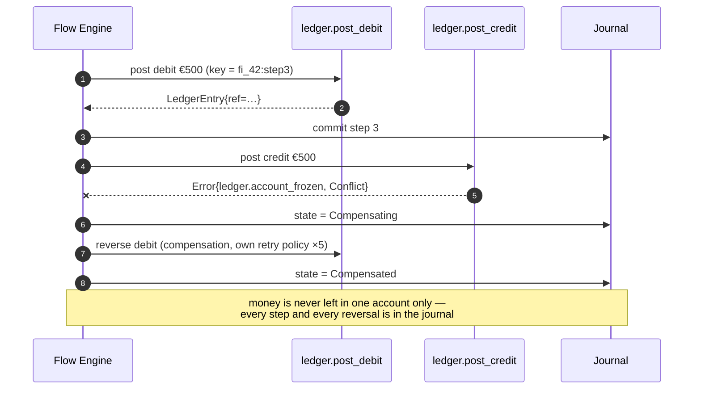

# Sample — Banking funds transfer

**Claim proved:** deny-by-default authorisation, immutable audit, and money
movement that is safe under retry, replay and crash — with the security posture
verifiable from the manifest rather than from a code review.

## The flow

```csharp
[Flow("transfer.execute", Profile = ExecutionProfile.Durable)]
[FlowDeadline("PT60S")]
[HttpTrigger("POST", "/api/v1/transfers", Idempotent = true)]
[RateLimit(Permits = 20, Window = "PT1S", Scope = RateLimitScope.Principal)]
public sealed partial class ExecuteTransferFlow : Flow<ExecuteTransfer, TransferResult>
{
    protected override void Define(IFlowBuilder<ExecuteTransfer, TransferResult> flow) => flow
        .Step<ValidateTransfer>()
        .Step<CheckSanctions>().WithPolicy(Policies.ExternalRead)
        .Step<ReserveFunds>().CompensateWith<ReleaseFunds>()
        .Step<PostDebit>().CompensateWith<ReverseDebit>()
        .Step<PostCredit>().CompensateWith<ReverseCredit>()
        .Emit<TransferExecuted>()
        .Return(ctx => new TransferResult(ctx.Get<TransferId>(), TransferStatus.Settled));
}
```

## Security declarations

```csharp
[Capability("ledger.post_debit", Version = "1.0.0",
    Authorization = Authorization.Permission, Permission = "ledger:post",
    Idempotent = true,                       // keyed by instanceId:stepId
    SideEffects = ["core-ledger"])]
[Timeout("PT5S")]
[Audit(Category = "financial", Redact = ["Account.Iban"])]
public sealed class PostDebit : ICapability<DebitRequest, LedgerEntry> { … }
```

The permission travels with the operation, so it applies identically over HTTP,
over the internal bus, and to an AI agent. `flowx query "capabilities with
permission ledger:post"` answers the access-review question in one command
(quality requirement QR9).

## Failure path — the one that matters



## Compliance evidence

| Requirement | Where it comes from |
|---|---|
| Audit trail (SOX, PCI-DSS 10) | journal + `Audit` policy: principal, tenant, input hash, outcome, timestamp — immutable |
| Segregation of duties | `Permission` on each capability; `flowx query` for access review |
| Idempotent money movement | `ctx.IdempotencyKey` stable across retries **and** replays |
| Reconciliation | `flowx replay --mode inspect` reconstructs any transfer exactly |
| PII protection | `[Sensitive]` on IBAN — redacted in logs, traces, journal and replay |

## Things to try

1. Remove `Authorization` from `PostDebit` — the build fails with `FLOWX1010`.
   There is no way to ship an unauthorised money movement.
2. Set `Idempotent = false` on `PostDebit` — the retry policy becomes a build
   error (`FLOWX1014`), because retrying a non-idempotent debit is a duplicate
   charge.
3. Run `dotnet test --filter Category=Security` — includes
   `CrossTenantAccessIsDenied` and `SensitiveFieldsAreRedacted`.
