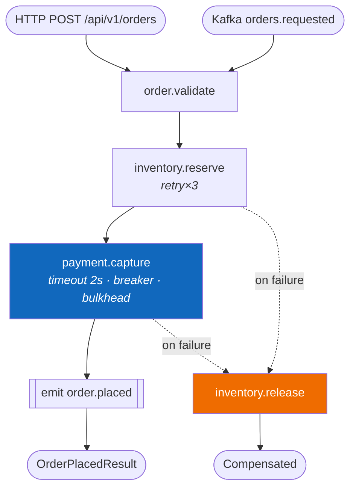

# Sample — E-commerce order placement

**Claim proved:** a four-step saga with compensation, two transports, retries, a
circuit breaker, tracing and an event — in **6 files and 178 lines**
(success criterion V1).

## The flow

```csharp
[Flow("order.place", Version = "1.2.0", Profile = ExecutionProfile.Durable)]
[FlowDeadline("PT30S")]
[HttpTrigger("POST", "/api/v1/orders", Idempotent = true)]
[KafkaTrigger("orders.requested", Group = "order-placement")]
public sealed partial class PlaceOrderFlow : Flow<PlaceOrder, OrderPlacedResult>
{
    protected override void Define(IFlowBuilder<PlaceOrder, OrderPlacedResult> flow) => flow
        .Step<ValidateOrder>()
        .Step<ReserveInventory>().CompensateWith<ReleaseInventory>()
        .Step<CapturePayment>().WithPolicy(Policies.PaymentGateway)
        .Emit<OrderPlaced>(ctx => new OrderPlaced(
            ctx.Get<OrderId>(), ctx.Get<Capture>().Reference, ctx.Clock.UtcNow))
        .Return(ctx => new OrderPlacedResult(
            ctx.Get<OrderId>(), ctx.Get<Capture>().Reference));
}
```

## Structure

```
src/Ordering.Application/PlaceOrder/
├── PlaceOrderFlow.cs        28 lines
├── ValidateOrder.cs         24 lines
├── ReserveInventory.cs      21 lines
├── ReleaseInventory.cs      18 lines   ← compensation
├── CapturePayment.cs        26 lines
└── PlaceOrderTests.cs       61 lines
src/Ordering.Contracts/                 ← immutable records, zero dependencies
```

Not present, because it is generated: the HTTP endpoint, the model binder, the
OpenAPI document, the Kafka consumer, the retry/breaker wiring, the compensation
ordering, the trace spans, the metrics, and the diagram below.

## Generated topology



## The tests that matter

```csharp
[Fact]
public async Task Releases_inventory_when_payment_is_declined()
{
    var host = FlowTestHost.For<PlaceOrderFlow>()
        .Substitute<CapturePayment>(_ => Result.Fail<Capture>(PaymentErrors.Declined("insufficient_funds")))
        .Build();

    var outcome = await host.RunAsync(AnOrder());

    outcome.Should().HaveFailedWith("payment.declined");
    outcome.Should().HaveCompensated<ReleaseInventory>();
}

[Fact]
public async Task Resumes_on_another_node_without_re_reserving_inventory()
{
    var host = FlowTestHost.For<PlaceOrderFlow>().WithJournal(InMemoryJournal.Create()).Build();
    await host.RunUntilStep(2);
    await host.SimulateNodeCrash();

    var resumed = await host.ResumeOnNewNode();

    resumed.Should().HaveCompleted();
    resumed.Should().NotHaveReexecuted<ReserveInventory>();
}
```

The second test is the one worth staring at: it is the durable-execution
guarantee (Q2), expressed in six lines, with no infrastructure.

## Things to try

1. Change `Profile` to `Ephemeral` — the crash test fails, and `FLOWX1012` warns
   that a compensable flow should be durable.
2. Delete `[HttpTrigger]` — the endpoint and OpenAPI operation disappear; the
   Kafka path is untouched and the flow body never changed.
3. Add `.WithPolicy(Policies.PaymentGateway)` to a capability declared
   `Idempotent = false` — build fails with `FLOWX1014`.
4. Run `flowx query "flows affected if inventory.reserve fails"`.
