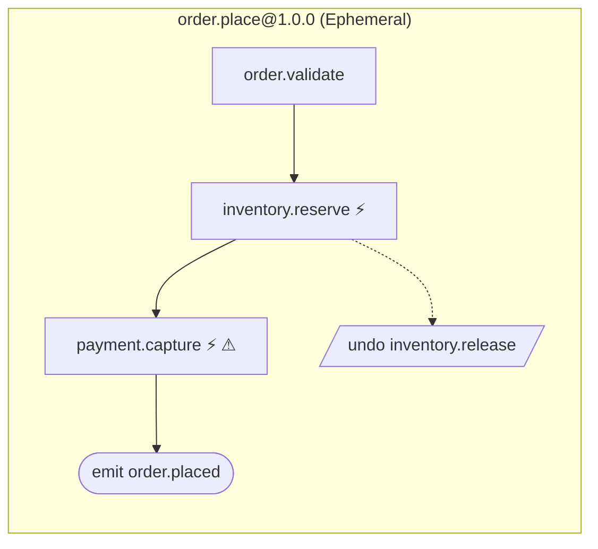

# Sample — E-commerce order placement

A three-step ephemeral flow behind one HTTP endpoint: validate an order, hold the
stock, take the money. Small on purpose, and every part of it is load-bearing
somewhere in this repository's claims.

> **This file described a durable, two-transport, policy-driven flow before the
> sample existed.** It now describes the sample that does. The larger version is not
> deleted so much as deferred: durable execution, Kafka, and the policy pipeline
> arrive in P1–P4, and this file will grow with them. A sample README that documents
> features the sample does not have is worse than no sample.

```bash
dotnet run --project samples/ecommerce

curl -X POST http://localhost:5000/api/v1/orders \
  -H 'Content-Type: application/json' \
  -H 'Idempotency-Key: order-1' \
  -d '{"sku":"SKU-1","quantity":2,"paymentToken":"tok_test"}'
```

```json
{ "orderId": "order-1", "receiptId": "receipt-order-1" }
```

---

## What is here

| File | What it holds |
|---|---|
| `Contracts.cs` | The records on the wire and between steps. No behaviour. |
| `Capabilities.cs` | Four capabilities and the two ports they depend on. All the business rules. |
| `PlaceOrderFlow.cs` | The control flow: order, compensation, the event, the answer. |
| `Program.cs` | Composition. Registrations, and `MapFlowX()` for every declared endpoint. |
| `Infrastructure.cs` | In-memory adapters and the JSON context. |

The flow:

```csharp
[Flow("order.place", Version = "1.0.0", Profile = ExecutionProfile.Ephemeral, Owner = "orders")]
[FlowDeadline("PT30S")]
public sealed partial class PlaceOrderFlow : Flow<PlaceOrder, OrderPlacedResult>
{
    protected override void Define(IFlowBuilder<PlaceOrder, OrderPlacedResult> flow)
    {
        ArgumentNullException.ThrowIfNull(flow);

        flow
            .Step<ValidateOrder>()
            .Step<ReserveInventory>().CompensateWith<ReleaseInventory>()
            .Step<CapturePayment>()
            .Emit<OrderPlaced>(ctx => new OrderPlaced(/* … */))
            .Return(ctx => new OrderPlacedResult(/* … */));
    }
}
```

There is no business rule in that method and no mention of HTTP. It expresses
**order, condition and recovery** and nothing else, which is why moving this flow
behind another transport would change the attribute above it and nothing below it.

---

## What the sample is actually for

### It is the test of the generator

`Ecommerce.csproj` references `FlowX.Compiler` as an **analyzer**, not as a library:

```xml
<ProjectReference Include="../../src/FlowX.Compiler/FlowX.Compiler.csproj"
                  OutputItemType="Analyzer"
                  ReferenceOutputAssembly="false" />
```

So the generator runs inside this project's build, against this project's source,
exactly as it would for anyone else. Its output is on disk under
`obj/generated/FlowX.Compiler/`:

- `Ecommerce.PlaceOrderFlow.Flow.g.cs` — the compiled `ExecutionPlan`, the step
  dispatcher, and the output projection
- `FlowXEndpoints.g.cs` — the route registration `app.MapFlowX()` calls, from the
  `[HttpTrigger]` on the flow. Emitted only because this project references
  `FlowX.Http`; a project that does not gets no such file.
- `FlowXManifest.g.cs` — the manifest for the whole application

Open the first one. Every step carries a `#line` directive back to the line of
`PlaceOrderFlow.cs` that declared it, so a breakpoint on generated code lands in your
own file. If it is hard to read, that is a bug in the generator.

### It is the proof of NativeAOT

```bash
dotnet publish samples/ecommerce -c Release -r linux-x64
```

A self-contained ~11 MB binary, no trim or AOT warnings. Constraint C2 says nothing
that ships may reflect; a reference application that could not publish this way would
make that a claim rather than a property. CI publishes it **and then runs it** —
linking successfully and serving a request are different facts.

### It is where quality goal Q2 is checked

`tests/Ecommerce.Tests/CapabilityTests.cs` has no host in it. No
`WebApplicationFactory`, no service provider, no in-memory server — a capability is a
class with a method, and the tests construct one and call it.

`tests/Ecommerce.Tests/PlaceOrderEndpointTests.cs` covers what that structurally
cannot: status codes, media types and JSON bodies over a real server, including the
compensation path.

---

## The things worth reading the code for

**The idempotency key comes from the context.** `ReserveInventory` reads
`ctx.IdempotencyKey` and passes it downstream, so replaying a request reserves once:

```bash
curl … -H 'Idempotency-Key: order-1' …   # 200, stock 10 → 8
curl … -H 'Idempotency-Key: order-1' …   # 200, stock still 8
```

A capability that generated its own key would reserve twice on the second attempt and
nothing else in the system would notice.

**`CapturePayment` declares `Idempotent = false`.** That single declaration is what
makes attaching a retry policy a build error (FLOWX1014). Retrying a capture is a
duplicate charge, and the compiler refusing is cheaper than the refund process.

**Compensation runs in reverse.** If the capture fails, `ReleaseInventory` gives the
hold back. Covered by `AFailedPaymentReleasesTheReservation`, which is the only way to
reach that path — no happy-path run does.

**Errors are values, and they map themselves.** `OrderErrors.OutOfStock` carries
`ErrorCategory.Conflict`, and that is the whole reason the endpoint answers `409`:

```json
{
  "type": "https://flowx.dev/errors/inventory.out_of_stock",
  "title": "The request conflicts with the current state",
  "status": 409,
  "detail": "'SKU-1' has 8 in stock.",
  "code": "inventory.out_of_stock",
  "correlationId": "0HNNE5LSTBR72:00000001",
  "sku": "SKU-1",
  "available": 8
}
```

No capability names a status code. The category is the contract, and the mapping
lives in one place.

**`PaymentToken` is marked `[Sensitive]`, and that does two things.** It reaches the
manifest — the contract's `input` carries `"sensitive": ["PaymentToken"]`, so a reviewer
or an agent can see which field holds the secret — and it reaches the endpoint as
`PlaceOrderFlow.SensitiveMembers`, which strips matching structured detail out of an
error response. A capability that attached the token to an `Error` would not send it to
the caller. That is the only sink this release serialises such a value on; see
[PLAN.md WP-12a](../../PLAN.md).

**The wire contract is the flow's own types.** There is no request DTO and no
response DTO — `PlaceOrder` and `OrderPlacedResult` go on the wire directly, and the
endpoint returns what the `.Return(...)` clause projected. There is nothing to keep in
step.

**The address is declared once.** `[HttpTrigger("POST", "/api/v1/orders", Idempotent =
true)]` is read once, and that one reading produces both the `triggers` block of the
manifest and the route `app.MapFlowX()` registers — `FlowXEndpoints.g.cs`, next to the
plan under `obj/generated`. `Program.cs` names no method, no route and no contract, so
the address the sample publishes and the address it serves cannot disagree.

---

## Rendering the graph

```bash
dotnet run --project src/FlowX.Cli -- manifest \
  --assembly samples/ecommerce/bin/Debug/net10.0/Ecommerce.dll \
  --output flowx.manifest.json

dotnet run --project src/FlowX.Cli -- graph \
  --manifest flowx.manifest.json --output order-place.mmd
```



`⚡` marks a declared side effect, `⚠` a capability that is not idempotent. Both come
from the `[Capability]` attributes, through the manifest, without anyone drawing a
diagram.

---

## Things to try

1. Add `.WithPolicy(Policies.Retry)` to `CapturePayment` — the build fails with
   **FLOWX1014**, because the capability declares `Idempotent = false`.
2. Remove the `partial` keyword from `PlaceOrderFlow` — **FLOWX1001**, because the
   generated plan has nowhere to live.
3. Delete the `.Return(...)` clause — the generated `Projection` field disappears and
   `Program.cs` stops compiling, rather than quietly returning a default.
4. Reorder the two `.Step<>` calls — the generated dispatcher's `ctx.Get<T>()` types
   change with them, because steps bind by contract, not by position.

---

## What the sample does not do yet

**`.Emit<OrderPlaced>()` publishes nothing, and the reason is now entirely this sample's
profile.** The step is compiled into the plan and recorded in the manifest, so a consumer
reading the manifest will expect the event — and nothing delivers it. *This paragraph said
at WP-56 that "the engine still stages nothing into `StepCommit.Outbox` for an `Emit` step".
That expired immediately afterwards, and the rest of the chain expired at WP-56b.* Every
other link is built and exercised: the generated `DescribeStep` builds the event body, the
engine stages it in the step's own transaction, `PostgresOutboxPublisher` drains it
at-least-once in per-`partition_key` order, and `RedisStreamEventPublisher` puts it on a
broker. What is missing here is the **first** link — an `Ephemeral` flow keeps no
transaction to stage into. The compiler says so as **FLOWX1024**, and the sample suppresses
it with an explicit `FLOWX-DEBT` marker rather than hiding it. See
[docs/diagnostics/FLOWX1024.md](../../docs/diagnostics/FLOWX1024.md).

**This sample cannot demonstrate the broker plugin, and the obstacle is measured rather
than assumed.** [DEBT-0001](../../docs/DEBT.md) names one resolution — declare
`Profile = Durable` here — and that resolution is blocked by this sample's *other* job.
`FlowHost` runs a `Durable` flow on the ephemeral path only when no journal is registered,
and the engine then refuses it with `flow.durability_not_configured`
(`src/FlowX.Runtime/FlowInvocation.cs`). CI's NativeAOT step publishes this project and
**POSTs a real order to the native binary with no database attached**
(`.github/workflows/ci.yml`, *"The native binary serves a request"*), so a `Durable`
`PlaceOrderFlow` would turn that step red on the first request. Wiring a journal into this
project instead would put Npgsql inside the repository's only AOT-published assembly, which
is the one thing this sample exists to keep clean. The durable, journal-backed reference
application is [`samples/banking`](../banking); this one stays the ephemeral, dependency-free,
AOT one. DEBT-0001's second resolution — *"deciding **not** to make the sample durable is
also a resolution"* — is the one this paragraph takes.

**Service registration is written by hand, and stays that way.** The endpoint is
generated — `app.MapFlowX()` is the whole of it, from the `[HttpTrigger]` on the flow —
but the five `AddSingleton` lines above it are not. The generator knows exactly which
types the dispatcher needs, because it wrote that constructor; it does not know what
lifetime any of them should have, and nothing in a flow declares one. A missing
registration already fails at start-up and names the type. A generated lifetime would be
a guess, and a captive dependency is the kind of failure that is worst in a file nobody
wrote.

**Redaction covers one sink.** `[Sensitive]` strips values from Problem Details bodies
and nothing else — there is no logging scope, journal or replay view yet for it to strip
from. The attribute used to document itself as enforced everywhere by the generated
serialiser, while nothing read it at all; it no longer does.

**Authorisation is declared, not enforced.** The capabilities carry
`Authorization.Authenticated` and `Authorization.Permission`, and those reach the
manifest, but the policy pipeline that acts on them arrives with P4.

**The flow is ephemeral, and that is now a choice rather than a wait.** This paragraph used
to say durable execution was P2 and would arrive. It has: the runtime journals a `Durable`
flow's step boundaries, `plugins/FlowX.Postgres` is a store that passes the conformance
suite unmodified, and a recovered instance puts each completed compensable step back on its
unwind stack as it replays. The compiler says so too — **FLOWX1012** fires on this flow,
because a compensable saga on `Ephemeral` loses its pending unwind when the node dies, and
the hold `ReserveInventory` took is then owned by nobody.

The sample keeps `Ephemeral` and suppresses the rule with a stated reason rather than a
`FLOWX-DEBT` marker: [docs/DEBT.md](../../docs/DEBT.md) is explicit that a trade recorded in
an ADR is a *decision* rather than debt, and this one is
[ADR-0003](../../docs/adr/ADR-0003-execution-profiles.md)). The reason is this sample's whole
value — `dotnet run` serves an order with nothing behind it, and the only journal FlowX
ships is PostgreSQL, so `Durable` here would mean a reference application that cannot place
an order without a database, buying a crash-safe unwind for an inventory store that is a
dictionary and a payment gateway that always approves.

So, plainly: **a node that dies between the reservation and the end of this flow leaves the
hold standing, and nothing anywhere records that it should have been released.** That is
what the profile costs. The full argument, including what would change the answer, is on
[docs/diagnostics/FLOWX1012.md](../../docs/diagnostics/FLOWX1012.md#the-reference-sample-fires-this-rule).

---

**See also:** [Capability model](../../docs/07-Capability-Model.md) ·
[Flow definition](../../docs/08-Flow-Definition.md) ·
[Diagnostics](../../docs/diagnostics/README.md) ·
[Quality gates](../../docs/21-Quality-Gates.md)
