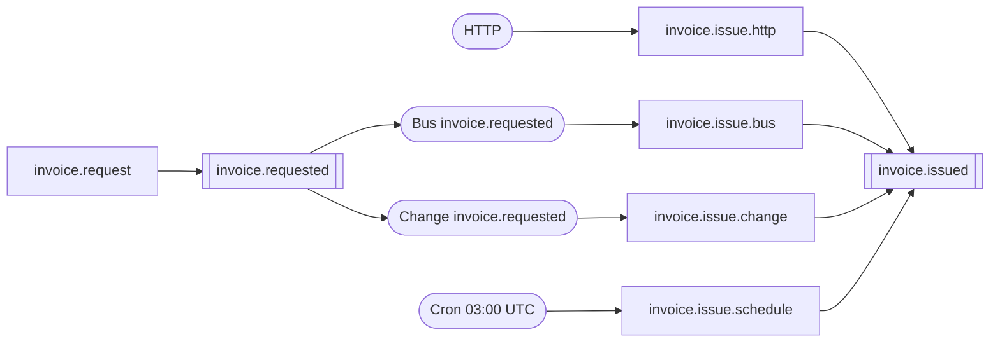

# Sample — Transport portability

**Claim it proves:** quality goal **Q4** and criterion
[**V2**](../../docs/01-Vision.md#7-measurable-success-criteria) — moving a flow between
transports changes **zero lines of business logic**, asserted mechanically rather than
described.

**Infrastructure:** PostgreSQL and Redis. Every flow here declares `Durable`, and three of
the four transports are refused without a journal.

```bash
export FLOWX_POSTGRES_CONNECTION="Host=localhost;Port=5432;Database=postgres;Username=postgres"
export FLOWX_REDIS_CONNECTION="localhost:6379"

dotnet run --project samples/event-driven
```

## The four transports, and the one chain under them

```
                      ┌─ invoice.validate ─ invoice.tax ─ invoice.persist ─┐
POST /api/v1/invoices ┤                          (compensated by invoice.void)
                      └──────────────────────────────────────── .Emit<InvoiceIssued>()
```

Four flows carry that chain. Each declares the input contract its trigger fixes, spends its
first step turning that into the chain's own input, and is identical from there on:

| Flow | Trigger | Input contract | Adapter step |
|---|---|---|---|
| `invoice.issue.http` | `[HttpTrigger("POST", "/api/v1/invoices")]` | `IssueInvoice` | none — the request *is* the input |
| `invoice.issue.bus` | `[BusTrigger("invoice.requested", Group = "billing")]` | `BusMessage` | `invoice.read_request` |
| `invoice.issue.change` | `[ChangeTrigger("invoice.requested", Group = "billing-projection")]` | `BusMessage` | `invoice.read_request` |
| `invoice.issue.schedule` | `[CronTrigger("0 3 * * *", TimeZone = "UTC")]` | `ScheduledFire` | `invoice.due` |

`invoice.request` is the fifth flow: `POST /api/v1/invoice-requests` validates and stages
`invoice.requested`. The outbox drains it to Redis for the bus flow and offers the same rows
directly to the change flow. Nothing between them names anything: the emitter names a
contract, the consumers name a topic, and the topic is the contract's identity.

### Why four flows and not one class with four attributes

The vision illustrates Q4 with three trigger attributes stacked on one flow. **That does not
compile, and the reason is not a gap.** A trigger that carries a body fixes what the body
*is* — a schedule can give only its occurrence, a delivery and a change only the message, a
closed window only its records — so three of the five kinds fix the flow's input contract to
three different types, and a class has one base type.

Writing it anyway used to raise `FLOWX1038` telling you to declare `Flow<ScheduledFire, …>`
and `FLOWX1039` the moment you did. [`FLOWX1048`](../../docs/diagnostics/FLOWX1048.md) now
reports the real fact instead of either.
[ADR-0062](../../docs/adr/ADR-0062-transport-portability-is-a-property-of-the-capability-chain.md)
is the decision: **portability is a property of the capability chain, one adapter step in.**

## The assertion

`tests/EventDriven.Tests` holds both halves, and neither is sufficient alone.

**Structural** — `TransportPortabilityTests` compares the four compiled `ExecutionPlan`s
against the chain written out in the test, not against each other. Four plans compared only
with each other agree perfectly when all four are wrong.

**Behavioural** — `TransportEquivalenceTests` runs one billing reference through a real HTTP
server, a real Redis broker, a real outbox change feed and a real cron sweep, and reads the
journal back:

```csharp
run.Chain.ShouldBe(["invoice.validate Success", "invoice.tax Success",
                    "invoice.persist Success", "invoice.issued Success"]);

run.Invoice.ShouldBe(new Invoice("INV-" + arm.Reference, "acme", 100m, 20m, 120m, "GBP"));
```

The structural half cannot see a stance a broker delivery cannot satisfy or an adapter that
decoded the wrong field; the behavioural half cannot see four chains that happen to agree on
one input. Both were confirmed to fail on a deliberate mutation before this shipped.

Which is why the shared capabilities declare `Authorization.Internal`. Two of the four
transports start a flow with **no principal at all**, so `Authenticated` or `Permission` on a
shared step is a chain that passes over HTTP and refuses every message — portability lost at
run time rather than at build time.

## Kafka

Not built, and the position is worth stating precisely because `[KafkaTrigger]` is real.

`KafkaTriggerAttribute` ships. A flow applying it compiles and publishes `"kind": "Bus"` with
`transport: kafka` into `flowx.manifest.json`. What has changed since this page first said so
is the failure mode: `FlowBusSubscriptionRegistration.Add` compares the declared transport
against the registered `IBusConsumer`, so a `[KafkaTrigger]` on this Redis-wired host is a
**startup failure** rather than a subscription silently served by the wrong broker.

This sample therefore declares `[BusTrigger]` — a flow says what it consumes, not on what,
and which bus serves it is the host's registration. That is the honest form of the claim, and
it is what makes a Kafka plugin an `IBusConsumer` implementation rather than a change to any
flow here.

## Event chaining



Drawn by hand. `flowx graph` renders one manifest as a flowchart and has no `--events`
switch; the CLI has five verbs — `graph`, `manifest`, `diff`, `verify` and `replay`
([22-CLI](../../docs/22-CLI.md)). The estate-wide topology is what those manifests make
*possible*, not something any command assembles today, so this diagram can drift.

## Outbox guarantee

`.Emit<InvoiceIssued>()` is staged in the emitting step's own transaction and drained by
`PostgresOutboxPublisher` — at-least-once, in per-`partition_key` order. FlowX republishes,
the consumer deduplicates, and the *effect* happens once
([11 §4](../../docs/11-Distributed-Runtime.md#4-exactly-once-honestly)): a delivery derives
the instance id it starts ([ADR-0035](../../docs/adr/ADR-0035-a-delivery-names-the-instance-it-starts.md)),
so the journal's primary key refuses the second one.

The redelivery half is asserted in `tests/Ecommerce.Tests/EmitStartsAFlowTests`, which
republishes a staged event under its own `event_id` and requires one instance. It is not
repeated here — this sample's subject is the transport, not the outbox.

## Things to try

1. **Stop the broker** and post to `/api/v1/invoice-requests`. `invoice.issue.bus` stops;
   `invoice.issue.change` keeps issuing, because it reads the outbox rather than a broker.
   That is the same chain over two transports with a broker in only one of them.
2. **Watch the cron transport.** `FLOWX_SAMPLE_SCHEDULE_CRON="* * * * *"` with
   `FLOWX_SAMPLE_SCHEDULE_SCAN=00:00:01` registers a denser schedule *beside* the declared
   one, so the expression the manifest publishes stays the expression a reader sees.
3. **Run three replicas** with different `FLOWX_SAMPLE_NODE` values. The schedule fires once:
   every node computes the same occurrence and derives the same instance id, and the lease
   store and the journal's primary key refuse the other two.
4. **Add `.Step<PostToLedger>()` to one flow and not the others.** The build stays green and
   `TransportPortabilityTests` goes red, naming the flow that diverged.
5. **Break the `InvoiceIssued` contract and run `flowx diff`** — it names the downstream
   consumers that would break.
