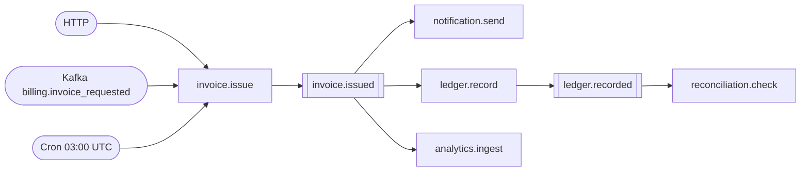

# Sample — Transport portability

**Claim proved:** quality goal **Q4** — moving a flow from HTTP to Kafka to cron
changes **zero lines of business logic**. This sample's CI asserts it
mechanically.

## The experiment

Three git commits, three transports, one unchanged flow body.

```csharp
// commit 1 — HTTP
[Flow("invoice.issue", Profile = ExecutionProfile.Durable)]
[HttpTrigger("POST", "/api/v1/invoices")]
public sealed partial class IssueInvoiceFlow : Flow<IssueInvoice, Invoice>
{
    protected override void Define(IFlowBuilder<IssueInvoice, Invoice> flow) => flow
        .Step<ValidateInvoice>()
        .Step<CalculateTax>()
        .Step<PersistInvoice>().CompensateWith<VoidInvoice>()
        .Emit<InvoiceIssued>()
        .Return(ctx => ctx.Get<Invoice>());
}

// commit 2 — Kafka. One attribute line differs.
[KafkaTrigger("billing.invoice_requested", Group = "invoicing")]

// commit 3 — all three at once.
[HttpTrigger("POST", "/api/v1/invoices")]
[KafkaTrigger("billing.invoice_requested", Group = "invoicing")]
[CronTrigger("0 3 * * *", TimeZone = "UTC")]
```

## The CI assertion

```csharp
[Fact]
public void Business_logic_is_byte_identical_across_transport_commits()
{
    var http  = GitFixture.FileAt("commit-1-http",  "IssueInvoiceFlow.cs");
    var kafka = GitFixture.FileAt("commit-2-kafka", "IssueInvoiceFlow.cs");

    StripAttributes(http).Should().Be(StripAttributes(kafka));

    GitFixture.ChangedFiles("commit-1-http", "commit-2-kafka")
        .Should().BeEquivalentTo("IssueInvoiceFlow.cs");   // no capability touched
}
```

Q4 is not a claim in a README here; it is a failing test if it stops being true.

## Event chaining



Generated by `flowx graph --events`. The estate-wide event topology assembles
itself from published manifests — nobody drew this, and it cannot drift.

## Outbox guarantee

```csharp
[Fact]
public async Task Event_is_published_exactly_once_even_if_the_process_dies_mid_publish()
{
    await using var host = await IntegrationTestHost.CreateAsync(c => c.UseKafka().UsePostgresJournal());

    await host.RunFlow<IssueInvoiceFlow>(AnInvoice());
    await host.KillDuringOutboxPublish();          // crash between publish and mark-published
    await host.RestartAndDrainOutbox();

    var events = await host.Kafka.ConsumeAll("invoice.issued");
    events.Should().HaveCount(2);                            // at-least-once: republished
    events.Select(e => e.Key).Distinct().Should().HaveCount(1);
    host.Consumer.ProcessedDistinct.Should().Be(1);          // idempotency deduplicated it
}
```

This test states the honest guarantee: FlowX republishes, the consumer
deduplicates, and the *effect* happens once
([11 §4](../../docs/11-Distributed-Runtime.md#4-exactly-once-honestly)).

## Things to try

1. Add `[MqttTrigger("devices/+/invoice")]` — a fourth transport, still zero
   logic changes.
2. Break the `InvoiceIssued` contract and run `flowx diff` — CI fails, naming the
   downstream consumers that would break.
3. Stop the broker and run the flow — the outbox accumulates, flows keep
   completing, and events drain when the broker returns.
