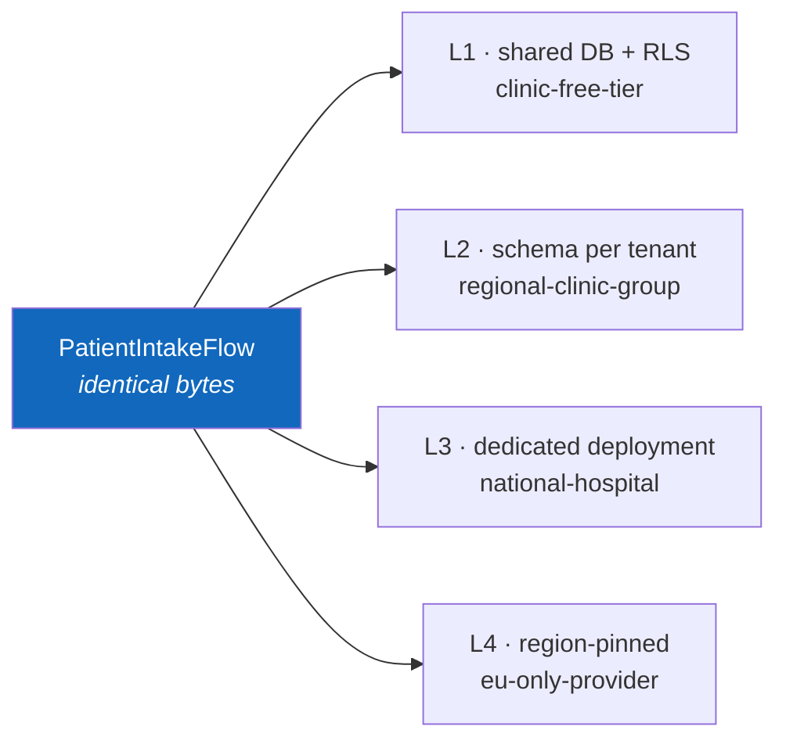

# Sample — Healthcare records intake

**Claim it is meant to prove:** the same application code runs at isolation level
L1 (shared) and L4 (region-pinned, dedicated) with **no code change** — plus
consent enforcement, PII redaction and subject erasure.

> [!NOTE]
> **Two of the four isolation levels have since been built, and the warning box
> after this one is kept as written rather than edited.** *"Every isolation level
> in §2 is currently the same level, and it is 'none enforced by the platform'"* is
> false. A tenant is resolved at admission from validated claims and refused when
> absent (`tenant.required`); **L1** is PostgreSQL row-level security under an
> unprivileged role that cannot bypass it; **L2** is a schema and a connection pool
> per tenant, provisioned on first use. Five fairness mechanisms bound what one
> tenant may cost the others, which is the separate guarantee this page's §4 is
> about.
>
> **The "no code change" half is demonstrated**, one level apart, in
> `samples/banking`: `FLOWX_SAMPLE_TENANCY=schema` moves the deployment from L1 to
> L2 by changing two lines of `Program.cs` and no flow, capability or contract.
> `tests/Banking.Tests/TransferTenancyTests` and
> `tests/FlowX.Postgres.Tests/TenantSchema*Tests` are what hold it.
>
> **L3 and L4 are what is left**, with residency, consent and subject erasure —
> everything below that is about *where* a tenant's data physically lives rather
> than about who may read it.

> [!WARNING]
> **This sample has no code.** `samples/healthcare/` is this file and nothing
> else. **The platform guarantees nothing about tenant isolation**, which
> [16-Multi-Tenant](../../docs/16-Multi-Tenant.md) states in those words in its
> own warning box: *"every isolation level in §2 is currently the same level, and
> it is 'none enforced by the platform'."* So the claim above is true in the
> uninteresting direction — the same code does run at L1 and L4, because L1 and L4
> are the same thing.
>
> **What `TenantId` actually does today**, end to end, because it is easy to
> mistake presence for enforcement. `HttpTriggerReader` reads it from *validated
> claims only*, never from the payload or a header. It is carried on
> `TriggerHeaders` → `FlowInvocation` → `FlowExecutionContext.TenantId`, is
> cleared when a pooled context is returned (`ContextPoolingTests` asserts it, and
> a leak here is a cross-tenant disclosure), is stamped on the journal's instance
> row as `tenant_id` by `plugins/FlowX.Postgres`, and can be passed as an optional
> filter to `PostgresRecoveryIndex`'s abandoned-instance sweep — which the runtime
> never passes. **That is the whole list.** No admission control, no quota, no
> rate limit, no per-tenant cache key, no telemetry label, no residency binding,
> no row-level security, no store selection. `ITenantResolver` and
> `ITenantStoreResolver` are declared nowhere, and `CrossTenantAccessIsDenied` is
> deliberately absent from `SecurityFitnessTests` rather than skipped.
>
> **`[Sensitive]` is real, and reaches exactly one sink.** The compiler reads it,
> the manifest carries a `sensitive` array per contract, and the flow's partial
> class carries `SensitiveMembers`; the HTTP endpoint replaces matching structured
> error detail with `[redacted]` before writing the body. It does **not** reach
> logs, traces, the journal or replay output — those sinks arrive with **P5**, and
> `RedactionCannotBeBypassed` is blocked on all of them at once
> ([WP-12a](../../PLAN.md#wp-12a--sensitive-is-declared-and-unread)).
>
> | What has to exist first | Where it comes from |
> |---|---|
> | Tenant resolution, admission, quotas, fairness, per-tenant cache keys | **P4**, with **P6** for the isolation machinery — **WP-100…WP-109** *reserved and unallocated* |
> | Journal partitioning, RLS, residency, the fairness test | **P6.** [PLAN §6a](../../PLAN.md#6a-p4p9--what-this-plan-does-not-yet-contain) rates resolution, fairness and RLS as *recordable* and journal partitioning as **invented** — [11 §6](../../docs/11-Distributed-Runtime.md#6-partitioning-and-scale) names sharding as a lever and stops |
> | `[Sensitive]` reaching the journal, logs and traces | **P5.** The journal is a sink that arrives three phases before the package that redacts it, which WP-52 was explicitly told not to leave in the clear |
> | A policy engine to enforce `VerifyConsent` as anything but an ordinary step | **P4.** The forward path runs zero policies today |
> | `flowx purge` and `flowx tenant migrate` | **Neither is a verb.** The CLI has four: `graph`, `manifest`, `diff`, `verify` ([22-CLI](../../docs/22-CLI.md)) |
>
> **An application built on FlowX today must enforce its own tenant scoping inside
> its capabilities** — the `WHERE TenantId = @t` that §1 of the multi-tenancy
> document opens by warning about. Read the rest as the design P4 and P6 are held
> to.

## The flow

> **Compiles, and proves nothing about tenancy.** Every attribute and member below
> is real; `[Sensitive]` on the contract further down is read. What the box above
> describes as missing is missing underneath it.

```csharp
[Flow("patient.intake", Profile = ExecutionProfile.Durable)]
[HttpTrigger("POST", "/api/v1/patients/intake", Idempotent = true)]
public sealed partial class PatientIntakeFlow : Flow<PatientIntake, IntakeResult>
{
    protected override void Define(IFlowBuilder<PatientIntake, IntakeResult> flow) => flow
        .Step<ValidateIntake>()
        .Step<VerifyConsent>()                       // purpose limitation, GDPR Art. 6
        .Step<DeduplicatePatient>()
        .Step<StoreRecord>().CompensateWith<PurgeRecord>()
        .Emit<PatientAdmitted>()
        .Return(ctx => new IntakeResult(ctx.Get<PatientId>()));
}
```

Notice what is **not** in the flow: no `tenantId` parameter, no residency check,
no isolation-level branch. Tenancy is ambient
([16-Multi-Tenant](../../docs/16-Multi-Tenant.md)). *Ambient and inert: the tenant
is carried and cleared correctly, and nothing downstream reads it. A flow written
this way today has no tenant scoping at all, rather than platform-supplied
scoping.*

## Same code, four isolation levels



> **No such configuration section is bound.** `FlowXOptions` in
> `src/FlowX.Hosting` has no `Tenancy` key, and nothing would act on one.

```yaml
# The only thing that differs — configuration, never code
FlowX:
  Tenancy:
    Tenants:
      clinic-free-tier:     { Isolation: L1, Region: eu-west-1 }
      national-hospital:    { Isolation: L3, Region: eu-central-1, Journal: "…" }
      eu-only-provider:     { Isolation: L4, Region: eu-central-1, Residency: Strict }
```

Promoting a tenant from L1 to L3 is `flowx tenant migrate` plus a deployment. No
pull request against business logic. *`tenant` is not a `flowx` verb, and there is
no per-tenant store to migrate between.*

## PII handling

```csharp
public sealed record PatientIntake(
    [property: Sensitive] string NationalId,
    [property: Sensitive] string FullName,
    DateOnly DateOfBirth,
    ConsentToken Consent);
```

`[Sensitive]` is applied by the **generated serialiser**, so redaction reaches
logs, traces, the journal and replay output with no code path able to bypass it.
`SensitiveFieldsAreRedacted` asserts this in CI.

> *Three of those four sinks do not exist and the test does not either.* The
> attribute is read, the manifest records it, and the generated redaction reaches
> **one** sink — the RFC 7807 error body written by the HTTP endpoint, proved end
> to end by a dispatcher that deliberately attaches a secret. There is no logging
> scope and no replay view to redact from; the journal *is* a sink and arrives at
> P2, three phases before the package that covers it, which is recorded as a
> standing obligation rather than a plan. `SensitiveFieldsAreRedacted` appears
> nowhere; the fitness function that would say this is
> `RedactionCannotBeBypassed`, and it is **deliberately absent** from
> `SecurityFitnessTests` — *"blocked, not overlooked"* — because a test written
> against one sink would encode the coverage gap as the specification.

## Right to erasure

> **`purge` is not a `flowx` verb**, there is no signing key, and no journal is
> subject-partitioned — `tenant_id` is a column on the instance row, and there is
> no subject column at all. The design argument below is the reason to build it
> early rather than a description of anything shipped.

```bash
flowx purge --subject patient:01HV8… --dry-run     # shows exactly what will be removed
flowx purge --subject patient:01HV8… --confirm     # journal, outbox, cache, idempotency
```

Emits a signed completion certificate for the compliance file. Erasure is
possible only because the journal is subject-partitioned by design — retrofitting
this into a system that journals opaquely is close to impossible.

## Things to try

*None of these can be tried yet. Kept as the acceptance list P4 and P6 are written
to — item 2 is `CrossTenantAccessIsDenied`, which is Q8's only evidence and is
blocked on both phases.*

1. Remove `VerifyConsent` — `flowx ai review` flags a purpose-limitation gap
   before a human does. *`ai` is not a verb; see [ai-agent](../ai-agent/).*
2. Attempt a cross-tenant read in a test — `CrossTenantAccessIsDenied` fails the
   build, and Postgres RLS refuses independently as defence in depth. *Neither
   half exists: the test is deliberately unwritten, and no migration enables RLS.*
3. Inspect a journal row directly: sensitive fields are already `"[REDACTED]"` at
   rest. *The row is real and the redaction is not.*
