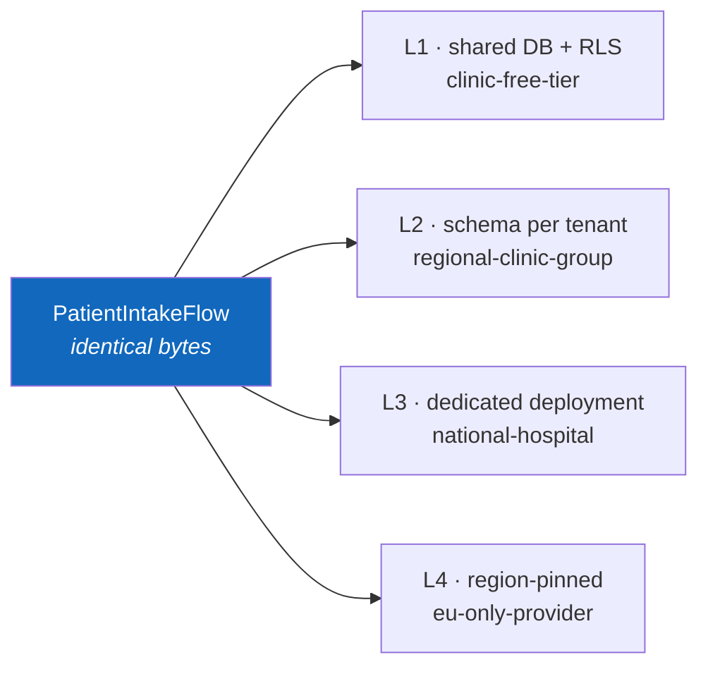

# Sample — Healthcare records intake

**Claim proved:** the same application code runs at isolation level L1 (shared)
and L4 (region-pinned, dedicated) with **no code change** — plus consent
enforcement, PII redaction and subject erasure.

## The flow

```csharp
[Flow("patient.intake", Profile = ExecutionProfile.Durable)]
[HttpTrigger("POST", "/api/v1/patients/intake", Idempotent = true)]
public sealed partial class PatientIntakeFlow : Flow<PatientIntake, IntakeResult>
{
    protected override void Define(IFlowBuilder<PatientIntake, IntakeResult> flow) => flow
        .Step<ValidateIntake>()
        .Step<VerifyConsent>()                       // purpose limitation, GDPR Art. 6
        .Step<DeduplicatePatient>()
        .Step<StoreRecord>().CompensateWith<PurgeRecord>()
        .Emit<PatientAdmitted>()
        .Return(ctx => new IntakeResult(ctx.Get<PatientId>()));
}
```

Notice what is **not** in the flow: no `tenantId` parameter, no residency check,
no isolation-level branch. Tenancy is ambient
([16-Multi-Tenant](../../docs/16-Multi-Tenant.md)).

## Same code, four isolation levels



```yaml
# The only thing that differs — configuration, never code
FlowX:
  Tenancy:
    Tenants:
      clinic-free-tier:     { Isolation: L1, Region: eu-west-1 }
      national-hospital:    { Isolation: L3, Region: eu-central-1, Journal: "…" }
      eu-only-provider:     { Isolation: L4, Region: eu-central-1, Residency: Strict }
```

Promoting a tenant from L1 to L3 is `flowx tenant migrate` plus a deployment. No
pull request against business logic.

## PII handling

```csharp
public sealed record PatientIntake(
    [property: Sensitive] string NationalId,
    [property: Sensitive] string FullName,
    DateOnly DateOfBirth,
    ConsentToken Consent);
```

`[Sensitive]` is applied by the **generated serialiser**, so redaction reaches
logs, traces, the journal and replay output with no code path able to bypass it.
`SensitiveFieldsAreRedacted` asserts this in CI.

## Right to erasure

```bash
flowx purge --subject patient:01HV8… --dry-run     # shows exactly what will be removed
flowx purge --subject patient:01HV8… --confirm     # journal, outbox, cache, idempotency
```

Emits a signed completion certificate for the compliance file. Erasure is
possible only because the journal is subject-partitioned by design — retrofitting
this into a system that journals opaquely is close to impossible.

## Things to try

1. Remove `VerifyConsent` — `flowx ai review` flags a purpose-limitation gap
   before a human does.
2. Attempt a cross-tenant read in a test — `CrossTenantAccessIsDenied` fails the
   build, and Postgres RLS refuses independently as defence in depth.
3. Inspect a journal row directly: sensitive fields are already `"[REDACTED]"` at
   rest.
