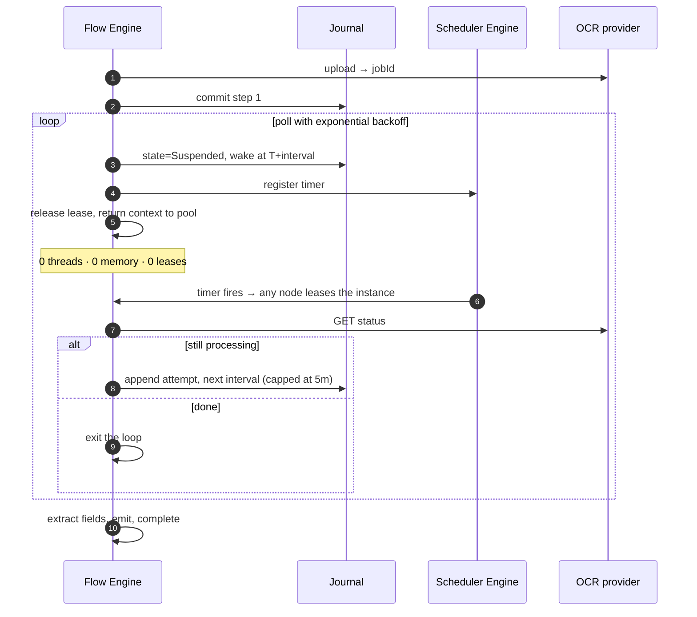

# Sample — Polling a slow external system

**Claim it is meant to prove:** waiting costs **one database row**, not a thread,
a timer or a container. 100 000 documents in flight consume zero compute while
waiting.

> [!WARNING]
> **This sample has no code, and it is the one whose DSL does not exist either.**
> `samples/polling/` is this file and nothing else. `PollUntil`, `RaceUntil` and
> `Backoff.Exponential(from:, to:)` appear **nowhere in this repository except on
> this page** — not on `IFlowBuilder`, not in
> [08 §4](../../docs/08-Flow-Definition.md#4-the-full-builder-surface)'s builder
> table, not in any plan, roadmap or ADR entry.
> [realtime-stream](../realtime-stream/) also writes DSL that does not compile, and
> the difference matters: `.Window` and `.Aggregate` are at least in that table,
> waiting on P7. These two are in no document at all, so this page is not a sample
> ahead of its phase — it is a **proposal**, and reading it as anything else is
> the mistake it invites.
>
> **Durable suspension exists; `PollUntil` does not.** *This box read "there is no durable
> suspension" until WP-63.* `AwaitSignal<TSignal>(TimeSpan)` and `Delay(TimeSpan)` both
> suspend a `Durable` flow now — one row, no thread, no lease, with the instant it is due on
> the row — and `FlowHost.SignalAsync` or `FlowTimerScan` brings it back.
> `samples/workflow`'s `offer.accept` is the running example. What this sample's flow above
> uses is `PollUntil`, which is a **different member and does not exist**: it would be a
> `Delay` inside a loop with a predicate, and neither the loop nor the predicate is
> expressible against a suspension point today.
>
> The other refusals around the gap were already real:
> [`FLOWX1017`](../../docs/diagnostics/FLOWX1017.md) is an **error** on
> `AwaitSignal` outside the `Durable` profile, `ExecutionPlan` refuses the same
> shape again at run time, and
> [`FLOWX1026`](../../docs/diagnostics/FLOWX1026.md) refuses
> `SubFlowMode.AwaitCompletion` under *every* profile *"because there is no
> suspension point to suspend into"* — a diagnostic that names the missing
> feature is more use than a member that quietly did the wrong thing.
>
> | What has to exist first | Where it comes from |
> |---|---|
> | Suspension and resumption through the journal, timers, the signal endpoint | [**WP-63**](../../PLAN.md#wp-63--should-awaitsignal-delay-timers), a **P2** *Should*, not started. Its exit is *one row and zero compute across 10 000 suspended flows* — the claim at the top of this page |
> | A scheduler to fire the timers | **WP-63** for the timer half; the cron half is **WP-75** ([scheduler](../scheduler/)) |
> | `PollUntil` / `RaceUntil` as DSL at all | **Nothing.** No work package, no document, no reserved number, no ADR. Calling it anything more definite than a proposal would be inventing a plan |
> | A poll interval type | `Backoff` exists in `FlowX.Abstractions/Policies/`, takes `TimeSpan?` rather than ISO-8601 strings, and is a *retry* backoff for a policy — not a wait schedule for a loop |
>
> The journal underneath all of this is built and runs against PostgreSQL
> ([11 §2](../../docs/11-Distributed-Runtime.md#2-the-journal)), which is why this
> sample is nearer than the streaming one. Read the rest as design.

## The problem

A third-party OCR service accepts a document and returns a job id. Results take
between 30 seconds and 4 hours. The usual implementations are all bad:

| Common approach | What goes wrong |
|---|---|
| `while (!done) await Task.Delay(5s)` | a thread and a container per document; lost on deploy |
| Hangfire recurring job scanning a table | polls everything, hot-loops, scales badly |
| Webhook only | breaks when the provider's webhook fails, with no fallback |

## The FlowX shape

> **Does not compile.** `.PollUntil(...)` is not a member of `IFlowBuilder<,>`,
> `Backoff.Exponential` does not take strings or those parameter names, and
> `.OnTimeout(...)` hangs off `IAwaitBuilder` — the result of `AwaitSignal`, which
> is not what `PollUntil` would return. A reader who pastes this gets a page of
> `CS1061`s, and finding that out from the compiler instead of from this line is
> exactly the experience this repository exists to prevent.

```csharp
[Flow("document.process", Profile = ExecutionProfile.Durable)]
[FlowDeadline("PT6H")]
[HttpTrigger("POST", "/api/v1/documents")]
public sealed partial class ProcessDocumentFlow : Flow<ProcessDocument, DocumentResult>
{
    protected override void Define(IFlowBuilder<ProcessDocument, DocumentResult> flow) => flow
        .Step<UploadToOcr>().CompensateWith<CancelOcrJob>()
        .PollUntil<CheckOcrStatus>(
            until:    ctx => ctx.Get<OcrStatus>().IsTerminal,
            interval: Backoff.Exponential(from: "PT5S", to: "PT5M"),
            timeout:  TimeSpan.FromHours(4))
                .OnTimeout(f => f.Step<EscalateToManualReview>())
        .Step<ExtractFields>()
        .Emit<DocumentProcessed>()
        .Return(ctx => new DocumentResult(ctx.Get<ExtractedFields>()));
}
```

`PollUntil` is a durable timer loop: between attempts the instance is
**suspended** — no lease held, no memory, no thread anywhere in the cluster.
*Would be. A durable flow today runs to completion inside a single invocation and
holds its lease for the whole of it.*

## What "waiting costs nothing" means



| In flight | Compute cost | Storage cost |
|---|---|---|
| 1 document | 0 while waiting | 1 row |
| 100 000 documents | 0 while waiting | 100 000 rows (~40 MB) |

## Webhook fast path, polling as the safety net

> **Does not compile, and there is no signal endpoint either.** `RaceUntil` is not
> a member; `AwaitSignal` is, and nothing delivers a signal to a waiting instance
> because nothing waits.

```csharp
.RaceUntil(
    signal: r => r.AwaitSignal<OcrCompleted>(),              // provider webhook, when it works
    poll:   p => p.PollUntil<CheckOcrStatus>(interval: Backoff.Exponential("PT30S","PT5M")),
    timeout: TimeSpan.FromHours(4))
```

Whichever arrives first wins; the loser is cancelled. Webhook latency with
polling reliability, expressed once.

## Tests

> **Does not compile.** `FlowTestHost` is real and shipped, and this is not its
> shape: the builder offers `WithClock(IClock)` rather than `WithVirtualTime()`,
> substitution is by **capability id** rather than by type, and there is no
> `Sequence.Of`, no `VirtualClock`, no `PeakLeasesHeld` and no
> `Trace.PollAttempts`. `host.PeakLeasesHeld.Should().Be(0)` is the assertion the
> page calls *the point of the sample*, and it is the one WP-63's exit criterion
> has to make writable.

```csharp
[Fact]
public async Task Waits_four_hours_in_milliseconds_and_holds_no_resources()
{
    var host = FlowTestHost.For<ProcessDocumentFlow>()
        .WithVirtualTime()
        .Substitute<CheckOcrStatus>(Sequence.Of(Pending, Pending, Pending, Completed))
        .Build();

    var outcome = await host.RunAsync(ADocument());

    outcome.Should().HaveCompleted();
    host.VirtualClock.Elapsed.Should().BeGreaterThan(TimeSpan.FromMinutes(10));
    host.PeakLeasesHeld.Should().Be(0);                 // ← the point of the sample
    host.Trace.PollAttempts.Should().Be(4);
}
```

## Things to try

*None of these can be tried yet. Kept as the acceptance list WP-63 is written to.*

1. Change `Profile` to `Ephemeral` — build fails with `FLOWX1017`: waits require
   durability, because an in-memory wait cannot survive a deployment and a timer outside a
   journal has nowhere to record when it is due. *This one is now true of a flow that writes
   `AwaitSignal` or `Delay` — `FLOWX1017` covers both and its quick action lands on a flow
   that compiles and waits — but it still does not fire on the `PollUntil` written above,
   because that member does not exist.*
2. Deploy mid-wait (restart every node) — every suspended document resumes. *A
   killed node's instances **are** found and finished by another node's recovery
   scan today; what does not exist is the mid-wait to be killed in.*
3. Set the OCR provider to never complete — the 4-hour timeout fires and
   `EscalateToManualReview` runs, exactly as drawn.
