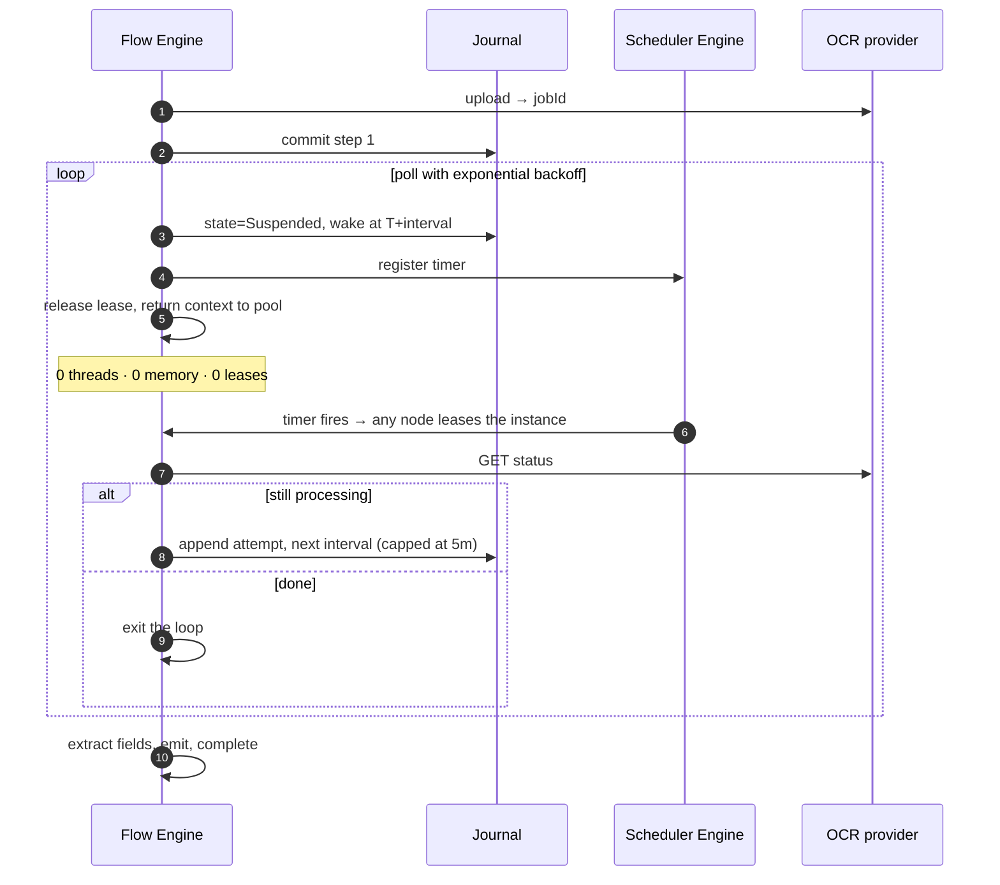

# Sample — Polling a slow external system

**Claim proved:** waiting costs **one database row**, not a thread, a timer or a
container. 100 000 documents in flight consume zero compute while waiting.

## The problem

A third-party OCR service accepts a document and returns a job id. Results take
between 30 seconds and 4 hours. The usual implementations are all bad:

| Common approach | What goes wrong |
|---|---|
| `while (!done) await Task.Delay(5s)` | a thread and a container per document; lost on deploy |
| Hangfire recurring job scanning a table | polls everything, hot-loops, scales badly |
| Webhook only | breaks when the provider's webhook fails, with no fallback |

## The FlowX shape

```csharp
[Flow("document.process", Profile = ExecutionProfile.Durable)]
[FlowDeadline("PT6H")]
[HttpTrigger("POST", "/api/v1/documents")]
public sealed partial class ProcessDocumentFlow : Flow<ProcessDocument, DocumentResult>
{
    protected override void Define(IFlowBuilder<ProcessDocument, DocumentResult> flow) => flow
        .Step<UploadToOcr>().CompensateWith<CancelOcrJob>()
        .PollUntil<CheckOcrStatus>(
            until:    ctx => ctx.Get<OcrStatus>().IsTerminal,
            interval: Backoff.Exponential(from: "PT5S", to: "PT5M"),
            timeout:  TimeSpan.FromHours(4))
                .OnTimeout(f => f.Step<EscalateToManualReview>())
        .Step<ExtractFields>()
        .Emit<DocumentProcessed>()
        .Return(ctx => new DocumentResult(ctx.Get<ExtractedFields>()));
}
```

`PollUntil` is a durable timer loop: between attempts the instance is
**suspended** — no lease held, no memory, no thread anywhere in the cluster.

## What "waiting costs nothing" means



| In flight | Compute cost | Storage cost |
|---|---|---|
| 1 document | 0 while waiting | 1 row |
| 100 000 documents | 0 while waiting | 100 000 rows (~40 MB) |

## Webhook fast path, polling as the safety net

```csharp
.RaceUntil(
    signal: r => r.AwaitSignal<OcrCompleted>(),              // provider webhook, when it works
    poll:   p => p.PollUntil<CheckOcrStatus>(interval: Backoff.Exponential("PT30S","PT5M")),
    timeout: TimeSpan.FromHours(4))
```

Whichever arrives first wins; the loser is cancelled. Webhook latency with
polling reliability, expressed once.

## Tests

```csharp
[Fact]
public async Task Waits_four_hours_in_milliseconds_and_holds_no_resources()
{
    var host = FlowTestHost.For<ProcessDocumentFlow>()
        .WithVirtualTime()
        .Substitute<CheckOcrStatus>(Sequence.Of(Pending, Pending, Pending, Completed))
        .Build();

    var outcome = await host.RunAsync(ADocument());

    outcome.Should().HaveCompleted();
    host.VirtualClock.Elapsed.Should().BeGreaterThan(TimeSpan.FromMinutes(10));
    host.PeakLeasesHeld.Should().Be(0);                 // ← the point of the sample
    host.Trace.PollAttempts.Should().Be(4);
}
```

## Things to try

1. Change `Profile` to `Ephemeral` — build fails with `FLOWX1017`: timers require
   durability, because an in-memory wait cannot survive a deployment.
2. Deploy mid-wait (restart every node) — every suspended document resumes.
3. Set the OCR provider to never complete — the 4-hour timeout fires and
   `EscalateToManualReview` runs, exactly as drawn.
