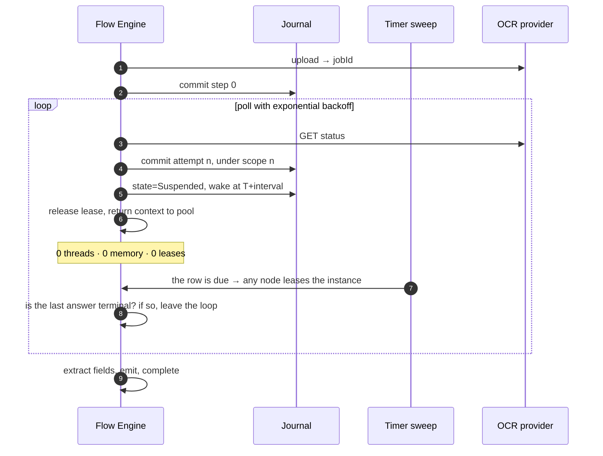

# Sample — Polling a slow external system

**Claim proved:** waiting costs **one database row**, not a thread, a timer or a container.
100 000 documents in flight consume zero compute while waiting.

Run it:

```bash
FLOWX_POSTGRES_CONNECTION="Host=localhost;Port=5432;Database=postgres;Username=postgres" \
  dotnet run --project samples/polling
```

It needs a database, and it needs the timer index on it. That is not incidental — see
[§4](#4-why-this-application-needs-a-database-and-a-sweep).

*This page carried a warning box saying the sample had no code and the DSL it printed did not
exist. Both halves are now false: `PollUntil` and the ISO-8601 `Backoff` overloads are on
`IFlowBuilder` and `Backoff`, `samples/polling` is an application, and `tests/Polling.Tests` runs
it. Two things it printed were **wrong rather than merely absent**, and they are corrected below
rather than implemented as written — [§3](#3-the-escalation-has-to-end-in-a-fail) and
[§7](#7-raceuntil-is-refused-not-missing).*

## The problem

A third-party OCR service accepts a document and returns a job id. Results take between 30
seconds and 4 hours. The usual implementations are all bad:

| Common approach | What goes wrong |
|---|---|
| `while (!done) await Task.Delay(5s)` | a thread and a container per document; lost on deploy |
| Hangfire recurring job scanning a table | polls everything, hot-loops, scales badly |
| Webhook only | breaks when the provider's webhook fails, with no fallback |

## The FlowX shape

```csharp
[Flow("document.process", Version = "1.0.0", Profile = ExecutionProfile.Durable, Owner = "documents")]
[HttpTrigger("POST", "/api/v1/documents", Idempotent = true)]
[FlowDeadline("PT6H")]
public sealed partial class ProcessDocumentFlow : Flow<ProcessDocument, DocumentResult>
{
    protected override void Define(IFlowBuilder<ProcessDocument, DocumentResult> flow) => flow
        .Step<UploadToOcr>().CompensateWith<CancelOcrJob>()
        .PollUntil<CheckOcrStatus>(
            until:    ctx => ctx.Get<OcrStatus>().IsTerminal,
            interval: Waits.OcrPolling,          // Backoff.ExponentialJitter("PT5S", "PT5M")
            timeout:  Waits.OcrBudget)           // TimeSpan.FromHours(4)
                .OnTimeout(f => f
                    .Step<EscalateToManualReview>()
                    .Fail(DocumentErrors.NotReadInTime()))
        .Step<ExtractFields>()
        .Emit<DocumentProcessed>(ctx => new DocumentProcessed(
            ctx.Input.DocumentId, ctx.Get<ExtractedFields>().Values.Count))
        .Return(ctx => new DocumentResult(
            ctx.Input.DocumentId, ctx.Get<ExtractedFields>().Values.Count));
}
```

`PollUntil` is a durable timer loop: between attempts the instance is **suspended** — no lease
held, no memory, no thread anywhere in the cluster.

The schedule is a named property rather than a literal at the call site, for the reason
`samples/workflow`'s `Waits` gives: a duration is a business decision and belongs where it can be
read without opening a flow. It is jittered, which is not decoration — a hundred thousand
documents accepted in the same minute and parked on the same undecorrelated schedule wake in the
same second, and the provider that could not keep up with the originals gets the retries as a
spike.

## What "waiting costs nothing" means



| In flight | Compute cost | Storage cost |
|---|---|---|
| 1 document | 0 while waiting | 1 instance row, plus 1 row per attempt |
| 100 000 documents | 0 while waiting | 100 000 instance rows (~40 MB), plus their attempts |

*The storage column is two numbers rather than one, and the second is the honest correction to
what this table used to say. An attempt is a committed `flow_step` row — that is what makes the
attempt count, the remaining budget and the resume position survive the node that started them —
so a document polled fifty times costs one instance row and fifty step rows. Retention is what
bounds that, not the construct.*

---

## 1. The layout, which is the whole of the design

The compiled plan for the flow above:

```csharp
StepNode.ForCapability(0, Descriptors.Step0, Descriptors.Step0Compensation),  // ocr.upload
StepNode.ForPoll(1, Waits.OcrPolling, Waits.OcrBudget, satisfiedTarget: 5),
StepNode.ForCapability(2, Descriptors.Step2),                                 // ocr.status
StepNode.ForCapability(3, Descriptors.Step3),                                 // document.escalate
StepNode.ForFail(4),
StepNode.ForCapability(5, Descriptors.Step5),                                 // document.extract
StepNode.ForEmit(6, "document.processed"),
```

**There is no backward target in it, and that is not an accident of this flow.** Every target in
every compiled plan points strictly forward, which is the entire termination argument for a step
loop that has no iteration cap by design. A poll keeps it by re-entering the contiguous span
after its own node — index 2, once per attempt — exactly as a `ForEach` re-enters its body. What
replaces "a step runs at most once" is "the number of passes is bounded by a value fixed before
the first one", which is `ForEach`'s own argument with a duration in place of an element count.

**Three numbers are implied rather than stored.** The body is at `Index + 1`, always, so the node
carries no target for it. The escalation begins at `Index + 2`, because the body is exactly one
step. `satisfiedTarget` is the one number that has to be written down: where control goes when
the predicate holds, one past the escalation block. That is `StepNode.ForAwaitSignal`'s convention
read from the other side and for its reason — the escalation is the block that *can* be
contiguous, because the other path out of a wait is the rest of the flow.

**A poll with no `.OnTimeout` carries no target at all**, rather than one equal to the index after
the body. The engine reads the absence as "there is nowhere for this timeout to go" and ends the
flow with `flow.poll_not_satisfied`, unwinding the completed compensable steps behind it.

**The body is one capability and cannot be a block.** `PollUntil` returns `IAwaitBuilder`, which
has no `CompensateWith` — so a compensable step inside a loop that runs an unbounded number of
times, and the unbounded compensation stack that implies, is unrepresentable rather than
discouraged. "Check the status, and if it changed, record it" is two steps and goes after the
loop.

## 2. What the journal holds, and what it does not

An attempt commits a row under its own scope, which is the attempt number:

```sql
select s.scope, s.step_id, s.capability_id, s.outcome
  from flowx.flow_step s where s.instance_id = '019fbd…' order by s.sequence;
--     | 0 | ocr.upload | Success
--   0 | 2 | ocr.status | Success
--   1 | 2 | ocr.status | Success
--   2 | 2 | ocr.status | Success
```

`StepScope` is unchanged and is doing the job it was added for: `(instance, step)` is not unique
for a poll for exactly the reason it is not unique for a `ForEach`, and an append-only table
cannot overwrite a row.

**The poll node itself commits nothing**, and everything it needs on resume is read back off
those rows:

| What it needs | Where it comes from |
|---|---|
| which attempt is next | the lowest scope with no successful row at step 2 |
| when that attempt is due | `flow_instance.wake_at`, written by the commit that wrote `Suspended` |
| when the budget runs out | attempt 0's `nondeterminism → utcNow`, plus the declared timeout |
| whether the loop is already over | the `until` predicate, over the restored state bag |

The third row is worth reading twice. **The budget is measured from the instant the first attempt
*read*, not from the timestamp the store put on the row.** `NondeterminismCapture.UtcNow` is
`FlowContext.UtcNow` captured for replay — the engine's own `IClock`, the same one that decides
whether the next attempt is due. `flow_step.committed_at` is PostgreSQL's `now()`: a second
clock, on a second machine. Bounding a loop by the difference between two clocks is the ambient
read `FLOWX1007` forbids a capability, performed by the engine instead — and under a test clock
the difference is four hours rather than four milliseconds.

The fourth row is the one that is easy to leave out. A poll node commits no row, so an instance
resumed *past* a completed poll arrives at the node again — and without asking the predicate
first, every touch of a finished document would be one more billable call to the provider. What
stops it is the same question that ended the poll:
`PollingTests.AResumePastAFinishedPollDoesNotPollAgain`.

**A failing attempt fails the flow rather than counting as "not yet".** "The job is not finished"
is a successful call with an unfinished answer; "the status endpoint refused" is a failure, and
treating it as the former would poll a broken dependency for four hours and then report a timeout
for something that was never one. Tolerating a transient fault is a `Retry` policy on the
capability — a different declaration, in a different place.

## 3. The escalation has to end in a `.Fail`

This page originally printed:

```csharp
.OnTimeout(f => f.Step<EscalateToManualReview>())
```

That block escalates and then **falls through to `document.extract`**, which would read fields
out of a job that never produced any. Both paths out of a poll rejoin at the step after the
block, exactly as the two arms of a `.When` do; a block that should end the flow has to say so.
It is the same correction `samples/workflow`'s `offer.accept` carries, for the same reason.

Ending it with a failure is also what closes the OCR job. `ocr.cancel` went on the compensation
stack four hours and fifty attempts earlier, on a node that has no memory of it by the time the
budget runs out — and the resumed flow rebuilds the stack from the journal's committed rows,
which is the same frontier scan that decides which attempts to skip.
`PollingTests.ABudgetThatRunsOutEscalatesAndCancelsTheJob` measures all three effects: the
instance is `Failed`, the document is in the review queue, and the job is closed.

## 4. Why this application needs a database *and* a sweep

`document.process` declares `Durable`, and a durable flow on a host that registered no journal
and no lease store is **refused** with `flow.durability_not_configured` before its first step.
That is `samples/workflow`'s §4, unchanged.

What is new here is the second half. **A host that registers a journal and no `ITimerIndex` polls
each document exactly once.** The instance parks correctly, records the instant it is next due,
and nothing ever comes back for it — which is not a hang and not an error, it is a document that
waits for `[FlowDeadline("PT6H")]`. `AddFlowXPostgres` registers all four contracts, and
`Program.cs` also puts the flow in the `FlowCatalog`, because an instance a sweep finds is a row
carrying a flow id and a version and nothing else. Without that registration `FlowTimerScan`
counts the document `NotRunnable` — the honest answer to "this node was not deployed with that
flow", and indistinguishable from outside from a provider that never answers.

**`FLOWX1017` is what makes the profile non-negotiable.** A poll parks between attempts and reads
which attempt it is on out of the journal that parked it; outside one it has neither anywhere to
record when the next call is due nor any way to count the ones already made. Change `Profile` to
`Ephemeral` and the build fails naming the construct.

## 5. What it does on the wire

```
$ curl -i -X POST :5199/api/v1/documents -H 'Idempotency-Key: doc-001' \
       -H 'Authorization: Bearer intake-token' \
       -d '{"documentId":"doc-1","contentType":"application/pdf","pages":12}'

HTTP/1.1 202 Accepted
{"instanceId":"019fbd86-b1be-7398-a9bb-b90a96c6774c","status":"suspended"}
```

**`202` with no `awaiting` array, and the absence is the interesting part.** That array lists the
signals a caller could deliver to continue the instance, and a poll is not waiting for anybody —
it is waiting for a clock. There is nothing to address, so the generator publishes no signal
route for this flow, which is exactly the difference between this sample and
`samples/workflow`'s.

```sql
select state, wake_at, wake_step_id, wake_scope from flowx.flow_instance where instance_id = '019fbd86-…';
-- Suspended | 2026-08-02 09:14:31.221+00 | 1 | 0     ← step 1 is the poll, scope 0 is attempt 0
select count(*) from flowx.flow_lease where instance_id = '019fbd86-…' and expires_at > now();
--  0
```

One row, no lease, and a scope that says which attempt the wait belongs to. A flow that polled
twice would park at the second with the same step id and a different scope — which is why the
wake carries both.

To watch it rather than read about it, wind the two demonstration knobs down:

```bash
FLOWX_POSTGRES_CONNECTION="…" \
FLOWX_SAMPLE_TIMER_SCAN="00:00:01" \
FLOWX_SAMPLE_OCR_PER_PAGE="00:00:02" \
  dotnet run --project samples/polling
```

`FLOWX_SAMPLE_OCR_PER_PAGE` is a property of the in-memory OCR stand-in and reaches nothing the
flow declares. `FLOWX_SAMPLE_TIMER_SCAN` is a *host* setting, so it never reaches the plan or the
manifest either — the two durations the flow declares stay build-time constants, which is what
keeps the manifest's `timeout` field populated. `samples/workflow`'s §2.0 is the account of what
happens when a declared wait is made overridable through the environment, and it is why neither
of these is one.

**A wait is a lower bound and never an upper one.** `FlowTimerScan` runs on
`FlowXOptions.TimerScanInterval` — ten seconds by default, jittered — so a five-second gap
elapses in five to fifteen. That is the same promise a scheduled trigger makes and the only one a
sweep can keep.

## 6. Tests

**The test this page originally printed cannot be written, and the reason is the platform's
rather than this sample's:**

```csharp
var host = FlowTestHost.For<ProcessDocumentFlow>()      // no such overload
    .WithVirtualTime()                                  // no such method
    .Substitute<CheckOcrStatus>(Sequence.Of(Pending, Pending, Pending, Completed))
    .Build();
```

`FlowTestHost` **cannot run a `Durable` flow at all**. Every `RunAsync` on it reaches the
`FlowEngine.ExecuteAsync` overload that passes `durable: null`, and the engine refuses a durable
plan with no instance rather than running it ephemerally — which is the correct refusal, and is
asserted rather than described by
[`WhyTheseTestsDoNotUseFlowTestHostTests`](../../tests/Workflow.Tests/WhyTheseTestsDoNotUseFlowTestHostTests.cs).
`PollUntil` requires `Durable` (`FLOWX1017`), so a poll is exactly the shape that host refuses.
`PeakLeasesHeld` and `Trace.PollAttempts` do not exist either, and neither does `Sequence.Of`;
substitution is by capability id, and the clock seam is `WithClock(IClock)`.

What replaces it is [`DocumentHarness`](../../tests/Polling.Tests/DocumentHarness.cs) — the same
stand-in `tests/Workflow.Tests` uses, with a timer sweep added. The engine, the plan, the pooled
context, the compensation stack, the deadline check, the lease, the fencing token, the journal
writes and `FlowTimerScan` are the production ones; the stores are the conformance suite's
reference implementations. The clock is virtual, and the flow is driven by moving it to the
instant **the instance itself recorded** rather than to one the test computed — the schedule is
jittered, so a test that restated the gap would be asserting against its own copy of `Random`.

```csharp
[Fact]
public async Task WaitingCostsOneRowAndHoldsNoLease()
{
    var harness = DocumentHarness.Create(TimeSpan.FromMinutes(30));

    var started = await harness.StartAsync(ADocument(), ct);

    started.IsSuspended.ShouldBeTrue();
    harness.Instance.State.ShouldBe(FlowInstanceState.Suspended);
    harness.Instance.Wake.ShouldNotBeNull();
    harness.HoldsLease().ShouldBeFalse();               // ← the point of the sample
    started.Trace.Count("ocr.status").ShouldBe(1);      // ← one attempt per invocation
}
```

The last assertion is the one that fails if the engine ever loops in-process between attempts
instead of parking. Such an engine would still complete the document, still commit a row per
attempt, and still pass every other test in the file — while holding a thread for four hours.

The whole class runs in milliseconds and moves the flow's clock through hours, which is the same
fact the sample is claiming about a deployment.

## 7. `RaceUntil` is refused, not missing

This page also specified a webhook fast path:

```csharp
.RaceUntil(
    signal: r => r.AwaitSignal<OcrCompleted>(),              // provider webhook, when it works
    poll:   p => p.PollUntil<CheckOcrStatus>(interval: Backoff.Exponential("PT30S","PT5M")),
    timeout: TimeSpan.FromHours(4))
```

*"Whichever arrives first wins; the loser is cancelled."*

**As a fork over two suspending branches it is refused**, and the reasons are pre-existing
commitments rather than implementation difficulty.
[ADR-0058](../../docs/adr/ADR-0058-a-poll-is-one-wait-not-a-race-between-two.md) is the record;
the two that decide it:

- A fork's branches share one pooled context, so
  [ADR-0015](../../docs/adr/ADR-0015-journal-schema-and-durable-execution.md)'s limit §6.1 — an
  overlapping fork does not replay, because the capture taken at a branch's commit takes
  everything minted since the last commit including a sibling's — would apply to every instance
  of every flow that used it. A construct whose stated purpose is reliability cannot be the one
  that makes an instance unreplayable.
- **"The loser is cancelled" describes threads.** Both branches here are the same one row, and
  the row carries one `wake_at`. Two branches with two wake instants cannot both be recorded, and
  the engine resolves that by taking the earlier — so the poll's schedule would silently become
  the signal branch's too.

**The idea behind it is right and the shape is wrong.** A poll's park and a signal's park are the
same row; ending the wait early on a delivered signal is one call to
`DurableExecution.TakeSignal` from the poll's arrival path, and the honest spelling is a modifier
on the poll rather than a second construct — `.PollUntil<T>(…).OrSignal<TSignal>()`. That is one
wait with two ways to end it, one row, and no loser to cancel.

**That modifier is now built**, and it is on `IPollBuilder`:

```csharp
.PollUntil<CheckOcrStatus>(
    until:    ctx => ctx.Get<OcrStatus>().IsTerminal,
    interval: Waits.OcrPolling,
    timeout:  Waits.OcrBudget)
    .OrSignal<OcrCompleted>()
        .OnTimeout(f => f.Step<EscalateToManualReview>().Fail(DocumentErrors.NotReadInTime()))
```

The instance still parks on one row carrying one `wake_at`; a delivery to
`POST {route}/{instanceId}/signals/ocr.completed` arrives at that row, and the arrival path asks
`TakeSignal` before it asks whether the next attempt is due. **A signal arriving between two
attempts therefore ends the wait rather than parking it again** — no attempt is made, the
escalation is not entered, and control continues where a satisfied predicate would have taken it.
That ending commits one row on the poll's own node, named after the signal, because the predicate
that stops a finished poll re-polling says *not yet* when a delivery is what ended it.
[ADR-0066](../../docs/adr/ADR-0066-a-polls-second-ending-is-a-row.md) is the record and
[`FLOWX1050`](../../docs/diagnostics/FLOWX1050.md) the one rule it needed;
`FlowX.Postgres.Tests.PollSignalHostTests` is the measurement, against a real database.

This flow does not declare one, because the OCR provider it stands in for publishes nothing.

## 8. Things to try

1. Change `Profile` to `Ephemeral` — the build fails with `FLOWX1017`, because a timer outside a
   journal has nowhere to record when it is due and a poll cannot count its own attempts.
2. Poll a capability that has not declared `Idempotent = true` — the build fails with
   [`FLOWX1044`](../../docs/diagnostics/FLOWX1044.md). A poll repeats after every *success*,
   which is the stronger half of the argument `FLOWX1014` makes about a retry.
3. Write `interval: Backoff.Exponential("PT10M", "PT30M")` against
   `timeout: TimeSpan.FromMinutes(5)` — [`FLOWX1043`](../../docs/diagnostics/FLOWX1043.md), a
   warning, because that loop makes one call and then escalates and reads in a journal exactly
   like a provider that never answered.
4. Deploy mid-wait (restart every node) — every suspended document resumes, on whichever node
   sweeps next, with its attempt count and its remaining budget read back off its rows.
5. Set `FLOWX_SAMPLE_OCR_PER_PAGE` past four hours — the budget runs out, the document goes for
   manual review, and the OCR job is cancelled by an unwind that spans the whole wait.
6. Drop the `.Fail` out of the `.OnTimeout` block and watch `document.extract` run against a job
   that produced nothing. [§3](#3-the-escalation-has-to-end-in-a-fail) is why it is there.
