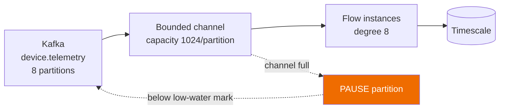
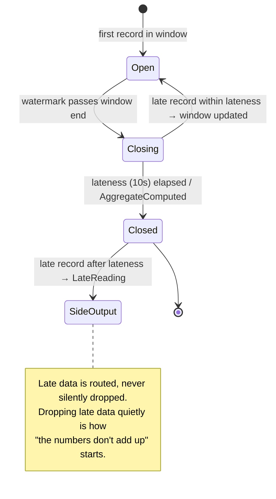

# Sample — Real-time telemetry aggregation

**Claim it is meant to prove:** 250 000 records/s/node with **bounded memory**
under a deliberately slow downstream — windowing, watermarks and checkpointing are
runtime services, not user code (budget B13, principle P9).

> [!WARNING]
> **This sample has no code, and it is the furthest from having any.**
> `samples/realtime-stream/` is this file and nothing else. **There is no stream
> engine**, and a flow declaring `Profile = ExecutionProfile.Streaming` says so
> out loud: [`FLOWX1028`](../../docs/diagnostics/FLOWX1028.md) is a warning whose
> whole subject is that the declaration reaches `ExecutionPlan` validation and the
> manifest's `profile` field and **buys no behaviour** — nothing is checkpointed,
> there is no window, and the flow runs once per trigger like any other. This
> repository sets `TreatWarningsAsErrors`, so the flow below would not build
> *inside this repository* without an `.editorconfig` downgrade carrying a
> `FLOWX-DEBT` owner and expiry. That is deliberate: the diagnostic's own page
> says *"no sample, test or reference application can quietly declare
> `Streaming`."*
>
> **The DSL is not there either.** `.Window(...)` and `.Aggregate<T>(...)` are not
> members of `IFlowBuilder<,>`; they are a row in
> [08 §4](../../docs/08-Flow-Definition.md#4-the-full-builder-surface)'s builder
> table — one row, marked `Streaming` — and a sketch in
> [09 §9](../../docs/09-Trigger-Model.md#9-stream-trigger). `[StreamTrigger]`
> compiles and publishes `"kind": "Stream"` with its source topic — its `Window`,
> `Lateness`, `Checkpoint` and `Parallelism` are not read into the manifest at
> all, and nothing consumes the trigger.
>
> | What has to exist first | Where it comes from |
> |---|---|
> | A stream engine: checkpoints, watermarks, window state, backpressure | **P7**, numbers **WP-110…WP-119** *reserved and unallocated* ([PLAN §6a](../../PLAN.md#6a-p4p9--what-this-plan-does-not-yet-contain)) |
> | A design to build it from | **Does not exist.** PLAN §6a rates P7's packages as *invented* rather than recorded: nothing anywhere defines the checkpoint format, watermark generation, or how window state is journaled. One backpressure diagram and a window-semantics table are the whole of the specification |
> | A Kafka consumer to put records in | **WP-72**, P3 ([event-driven](../event-driven/)) |
> | Budget B13 measured at all | `StreamingBenchmarks` does not exist; [14 §8](../../docs/14-Performance.md#8-benchmark-suite-and-ci-gating) lists B13 among the budgets with **no gate**, becoming measurable at P7 |
> | `FLOWX1028` deleted | The rule is *scheduled for deletion* when P7 lands. Its table row is the only executable-free reminder in the catalogue, and it says so |
>
> Every number in [Benchmarks](#benchmarks) below is a **budget stated in
> advance**, not a measurement. Read the rest as the design P7 would be held to —
> a design that, on this repository's own assessment, is not yet complete enough
> to write work packages against.
>
> **The one thing on this page that is already true** is the argument in
> [Backpressure](#backpressure--the-property-being-demonstrated): a test that
> asserts the system *slows down* rather than that it is fast. That is the shape
> P7's acceptance test should take, and it costs nothing to keep it written down.

## The flow

> **Does not compile here.** `.Window(...)` and `.Aggregate<T>(...)` are not
> members, and `Profile = ExecutionProfile.Streaming` raises `FLOWX1028`, which
> this repository's `TreatWarningsAsErrors` turns into a build failure.

```csharp
[Flow("telemetry.aggregate", Profile = ExecutionProfile.Streaming)]
[StreamTrigger("device.telemetry",
    Window = "tumbling:1m", Lateness = "10s", Checkpoint = "PT5S", Parallelism = 8)]
public sealed partial class AggregateTelemetryFlow : Flow<TelemetryBatch, DeviceStats>
{
    protected override void Define(IFlowBuilder<TelemetryBatch, DeviceStats> flow) => flow
        .Window(w => w.Tumbling(TimeSpan.FromMinutes(1))
                      .AllowLateness(TimeSpan.FromSeconds(10))
                      .SideOutputLate<LateReading>())
        .Aggregate<DeviceStats>((acc, reading) => acc.Add(reading))
        .Step<DetectAnomalies>()
        .Step<PersistAggregate>().WithPolicy(Policies.BulkWrite)
        .Emit<AggregateComputed>();
}
```

No offset management, no watermark bookkeeping, no checkpoint code, no manual
backpressure. Those are Stream Engine responsibilities
([06 §10](../../docs/06-Execution-Engine.md#10-backpressure-streaming-profile)).
*There is no Stream Engine, so today there is none of the bookkeeping and none of
the guarantee — the declaration is a fact in a published contract and nothing
else.* `.WithPolicy(Policies.BulkWrite)` is recorded in the plan and the manifest
and applies nothing at run time; the forward path runs zero policies until P4.

## Backpressure — the property being demonstrated



> **Not runnable.** `StreamTestHost` is in no file under `tests/` or
> `src/FlowX.Testing`, and neither is `WithSlowCapability`. There is no bounded
> channel, no partition to pause and no consumer to pause it.

```csharp
[Fact]
public async Task Slow_sink_reduces_consumption_instead_of_growing_memory()
{
    await using var host = await StreamTestHost.CreateAsync(cfg => cfg
        .WithSlowCapability<PersistAggregate>(delay: TimeSpan.FromMilliseconds(50)));

    await host.ProduceAsync(recordCount: 1_000_000);
    await host.RunFor(TimeSpan.FromSeconds(30));

    host.Memory.PeakBytes.Should().BeLessThan(512.Megabytes());
    host.Kafka.PauseEvents.Should().BeGreaterThan(0);       // ← the actual assertion
    host.Consumed.Should().BeLessThan(1_000_000);           // it slowed down, as intended
}
```

An unbounded queue would pass a throughput test and fail in production at 3 a.m.
This test asserts the *opposite* of throughput: that the system slows down
correctly.

## Late data



## Benchmarks

> **Budgets, not results — and nothing measures any of them.** There is no
> `StreamingBenchmarks` class; the filter below matches nothing.
> [14 §8](../../docs/14-Performance.md#8-benchmark-suite-and-ci-gating) lists B13 among the budgets with no gate,
> *"stated in advance, which is rule zero working as intended"*, becoming
> measurable at P7.

| Metric | Budget | Notes |
|---|---|---|
| Throughput | 250 000 rec/s/node | 1 KB records, 8 partitions |
| Peak memory | < 512 MB | under a 50 ms slow sink |
| Checkpoint p99 | < 50 ms | every 5 s |
| Recovery after kill | < 15 s | resumes from last checkpoint |
| Duplicates after recovery | 0 | at-least-once + idempotent persist |

```bash
dotnet run -c Release --project ../../tests/FlowX.Benchmarks -- --filter '*Streaming*'
```

## Things to try

*None of these can be tried yet — there is no project, no stream engine and no
consumer. Kept as the acceptance list P7 would be written to.*

1. Set `Parallelism = 1` and watch consumer lag grow — then watch KEDA scale
   workers on lag rather than CPU.
2. Kill a node mid-window; the window is rebuilt from the last checkpoint, and
   the aggregate is identical.
3. Emit a record with a 5-minute-old timestamp — it lands in the `LateReading`
   side output, visible in the trace.
