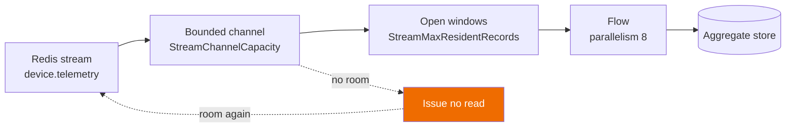
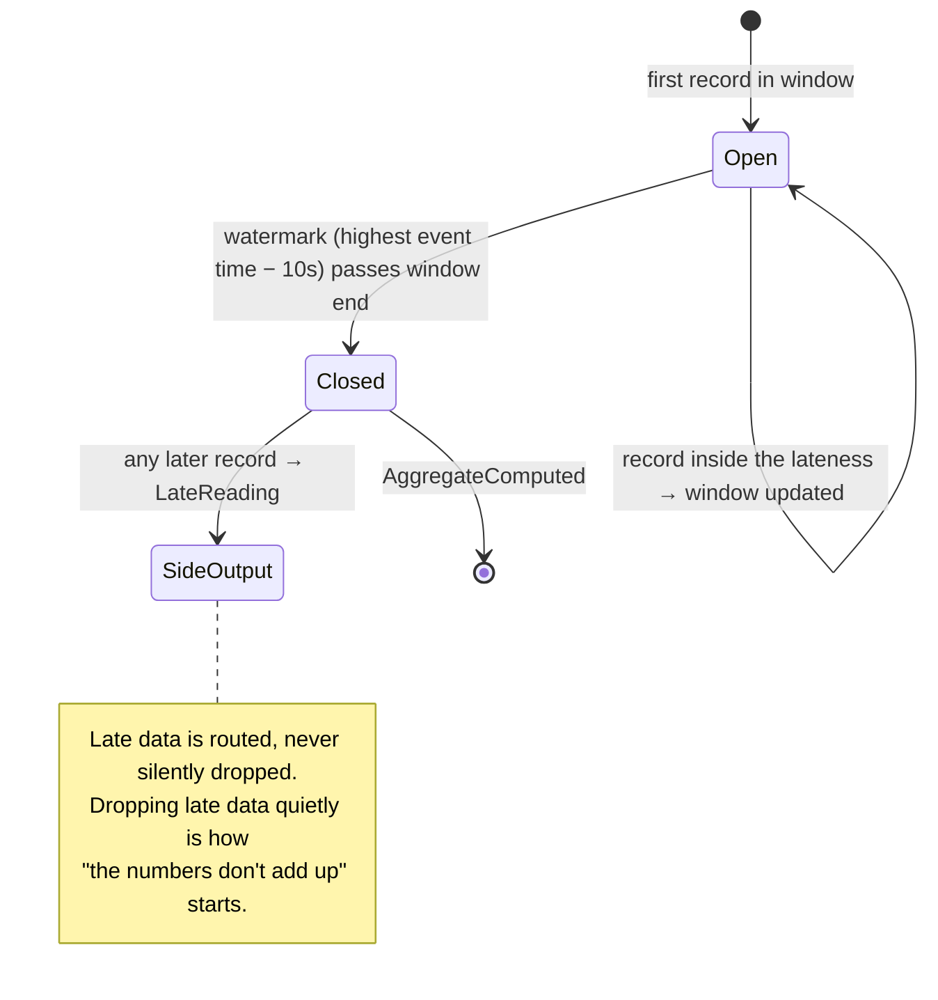

# Sample — Real-time telemetry aggregation

**Claim proved:** windowing, watermarks, lateness and checkpointing are runtime services
rather than user code, and the number of records this process holds stays inside a bound
the deployment declared — however far behind the sink falls (principle P9).

> [!NOTE]
> **The throughput half of budget B13 is not proved here, and this sample ships no
> benchmark.** 250 000 rec/s/node was this page's headline for as long as there was no
> engine to measure. Performance work is deferred until the features are done, so what is
> asserted instead is the property that makes throughput worth having: **bounded memory,
> as a correctness test rather than a measurement**. A peak record count that follows a
> declared capacity is a thing a test can prove on any machine;
> "250 000 records a second" is a thing a benchmark measures on one.
> See [Backpressure](#backpressure--the-property-being-demonstrated).

## Infrastructure

`dotnet run --project samples/realtime-stream` needs two servers.

| | Why | Configuration |
|---|---|---|
| **Redis** | The stream. `RedisStreamSource` is the only `IStreamSource` this repository ships, and it reads with `XRANGE` rather than a consumer group so the engine can re-read from its checkpoint to rebuild an open window. | `FLOWX_REDIS_CONNECTION`, else `localhost:6379` |
| **PostgreSQL** | The journal **and** the checkpoint store. A `Streaming` flow is refused without a journal: the instance id a closed window derives is only exclusive because `flow_instance`'s primary key refuses the second start. | `FLOWX_POSTGRES_CONNECTION`, else `Host=localhost;Port=5432;…` |

The application migrates its own schema at startup and produces its own telemetry, so
there is nothing else to install and no second process to run.

```bash
FLOWX_POSTGRES_CONNECTION="Host=localhost;Port=5433;Username=postgres;Password=postgres;Database=postgres" \
FLOWX_REDIS_CONNECTION="localhost:6399" \
dotnet run --project samples/realtime-stream
```

```
Window 12:01:00-12:02:00: 144 readings from 12 devices, mean 26.2 C, range 21.6-30.0 C.
Window 12:02:00-12:03:00: 144 readings from 12 devices, mean 18.9 C, range 14.3-24.8 C.
Late record 1785672022048-7 on 'device.telemetry': event time 11:58:20 is 00:04:50 behind
  the watermark. Routed to the side output, not dropped.
```

The producer advances *event time* faster than the clock, so a window closes every few
seconds rather than every minute. The engine never reads a wall clock, so this changes how
long you wait and nothing else
([ADR-0056](../../docs/adr/ADR-0056-the-watermark-is-observed-never-wall-clock.md)). It
also resumes from the stream's own last event time, so running the sample twice continues
the series instead of back-dating it.

## The flow

```csharp
[Flow("telemetry.aggregate", Version = "1.0.0", Profile = ExecutionProfile.Streaming, Owner = "platform")]
[StreamTrigger("device.telemetry",
    Window = "tumbling:1m", Lateness = "PT10S", Checkpoint = "PT5S", Parallelism = 8)]
[FlowDeadline("PT60S")]
public sealed partial class AggregateTelemetryFlow : Flow<StreamWindowBatch, DeviceStats>
{
    protected override void Define(IFlowBuilder<StreamWindowBatch, DeviceStats> flow) => flow
        .Step<FoldReadings>()
        .Step<DetectAnomalies>()
        .Step<PersistAggregate, AggregateToPersist>(ctx => new AggregateToPersist(
            ctx.Get<DeviceStats>(),
            ctx.Get<AnomalyVerdict>().IsAnomalous,
            ctx.Get<AnomalyVerdict>().Reason))
            .WithPolicy(Policies.BulkWrite)
        .Emit<AggregateComputed>(ctx => /* … */)
        .Return(ctx => ctx.Get<DeviceStats>());
}
```

No offset management, no watermark bookkeeping, no checkpoint code, no manual
backpressure. Those are Stream Engine responsibilities
([06 §10](../../docs/06-Execution-Engine.md#10-backpressure-streaming-profile)). There is
no hosted service in this project for any of it: `AddFlowXStreamSubscriptions()` is one
generated line in `Program.cs`, written from the attribute above.

### Why there is no `.Window(…)` or `.Aggregate(…)`

This page used to show both. `IFlowBuilder<,>` has neither, and the shipped shape is not a
lesser substitute for them:

- **The window is *declared*, on the trigger.** `tumbling:1m` is what the flow's output
  *means* — a deployment that could retune it would be changing the aggregate, not the
  throughput — so it travels with the registration the compiler emits rather than with
  host configuration. The two values that genuinely are tuning,
  `StreamChannelCapacity` and `StreamMaxResidentRecords`, sit in `FlowXOptions` where the
  other tuning is.
- **The fold is a capability** (`FoldReadings`), because it is a business rule and business
  rules live in capabilities. A builder-level `.Aggregate(acc, x => …)` would take a
  lambda, and a lambda inside a flow definition is code the manifest cannot publish and a
  reviewer cannot find.
- **The interval is input, not a clock read.** It arrives on the `StreamWindowBatch` and is
  journaled on `flow_instance.input`, which is what lets a resumed instance aggregate the
  interval it committed to. `FLOWX1007` and `FLOWX1011` forbid the alternative, and
  `FLOWX1042` reports a stream flow whose input contract is anything else.

`Lateness` is an ISO-8601 duration (`PT10S`); only `Window` takes the short `1m` form —
this page previously wrote `"10s"`, which `StreamWindowSpec.Read` refuses at startup.
`DeclarationTests` now registers the declaration through `FlowStreamCatalog`, so a spelling
the engine would refuse fails as a test rather than as somebody's deployment.

## Backpressure — the property being demonstrated



**The pause is the absence of a read, not a signal sent to a broker.** `FlowStreamScan`
computes the room left in its channel and asks the source for nothing at all when there is
none. A record the source was never asked for is a record in Redis rather than in this
process, which is the only sense in which memory is bounded — a channel with
`BoundedChannelFullMode.Wait` alone would still let an already-issued read materialise a
whole batch.

```csharp
[Fact]
public async Task ASlowStoreBoundsTheRecordsThisProcessHolds()
{
    var harness = StreamHarness.Create(channelCapacity: 16, storeCost: TimeSpan.FromMilliseconds(2));

    StageOneRecordPerWindow(harness, 600);

    await harness.PassAsync(TestContext.Current.CancellationToken);

    harness.Stream.PeakOutstanding.ShouldBeLessThanOrEqualTo(24);  // ← the actual assertion
    harness.Stream.Reads.ShouldBeGreaterThan(150);                 // a few at a time, not one gulp
}
```

**Records, not bytes.** A record handed to the engine and not yet finished with is a record
in this process's heap; a record still on the stream is Redis's problem. So
`HandedOut − Consumed` is exactly the quantity the design bounds, it is an integer rather
than an estimate, and the source samples it inside `ReadAsync` — the instant the engine is
asking for more, which is precisely where an unbounded engine would run away. Asserting on
`GC.GetTotalMemory` instead would give a test that fails when an unrelated allocation
changes and passes when the bound is deleted.

**The bound is what does the work, and that is asserted separately.**
`ThePeakFollowsTheDeclaredCapacity` runs the identical workload at capacity 16 and at
capacity 512 and requires the peak to follow it. Measured: the peak is capacity + 3 at
every capacity tried. Replacing the reader's `capacity - channel.Reader.Count` with a bare
`capacity` — a reader that never consults its channel — moves the tight peak from 19 to 35
and fails both tests.

An unbounded queue would pass a throughput test and fail in production at 3 a.m. These
tests assert the *opposite* of throughput: that the system slows down correctly.

## Late data



There is no separate "closing" state: the watermark already trails the highest observed
event time by the declared lateness, so a window that is still open **is** the window still
accepting late records.

**Registering a side output is not optional.** A host with no `IStreamSideOutput` builds no
stream pass at all — defaulting to a sink that discarded would be the silent drop this
promise exists to forbid, wearing a type name. A failure in the sink holds the checkpoint,
so the record is offered again rather than lost.

## What is asserted

`tests/RealtimeStream.Tests`, driving the sample's own generated plan and dispatcher:

| | |
|---|---|
| `BoundedMemoryTests` | The peak record count is bounded by the declared channel capacity; it follows that capacity when it changes; and a window over `StreamMaxResidentRecords` refuses rather than evicting, because an aggregate computed from part of its input is quietly wrong. |
| `WindowingTests` | A closed window aggregates its own records only; an open one holds the checkpoint; a record past the lateness reaches `LateReading` with the watermark that refused it; one *inside* the lateness still joins its window; a window rebuilt after a node death is not aggregated twice. |
| `CapabilityTests` | The fold, the detector and the derived store key — each constructed with `new` and called, with no engine anywhere. |
| `DeclarationTests` | The declared window is one the engine will serve; the manifest publishes the source and none of the tuning; every capability is `Internal`, because a window has no principal. |

The engine's own tests are `tests/FlowX.Hosting.Tests/StreamScanTests.cs` and
`StreamBackpressureTests.cs`; these are about *this application* being right when the
engine hands it a window.

## Things to try

1. **Stop the process mid-window and start it again.** The window is rebuilt from the last
   checkpoint, derives the same instance id, and is refused by the journal's primary key
   rather than aggregated twice. Its aggregate is also filed under a key derived from the
   interval, so this application would have been correct even if the journal had not caught
   it — which is the half of exactly-once the platform cannot supply for you.
   `WindowingTests.AWindowRebuiltAfterANodeDeathIsNotAggregatedTwice` is that, asserted.
2. **Watch the planted late record.** After forty batches the producer writes one reading
   five minutes behind the watermark; it lands in the side output and is logged with how
   far behind it was.
3. **Change `options.StreamChannelCapacity` in `Program.cs`.** Nothing about any aggregate
   changes — it is tuning, not meaning, which is exactly why it lives there while the
   window lives on the trigger.
4. **Run two copies with different `FLOWX_SAMPLE_NODE`.** One holds the subscription's
   lease and reads; the other finds it contended and waits. Two readers would each hold
   half of every window.
