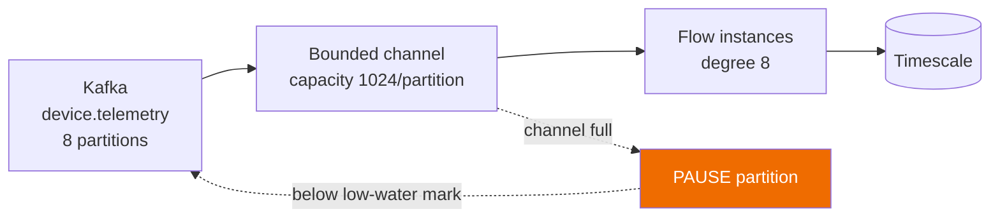
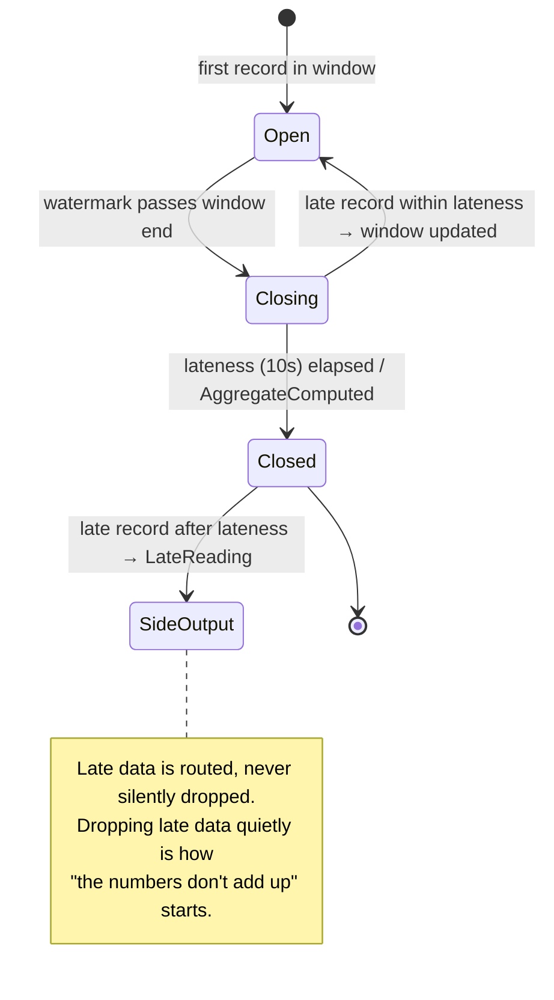

# Sample — Real-time telemetry aggregation

**Claim proved:** 250 000 records/s/node with **bounded memory** under a
deliberately slow downstream — windowing, watermarks and checkpointing are
runtime services, not user code (budget B13, principle P9).

## The flow

```csharp
[Flow("telemetry.aggregate", Profile = ExecutionProfile.Streaming)]
[StreamTrigger("device.telemetry",
    Window = "tumbling:1m", Lateness = "10s", Checkpoint = "PT5S", Parallelism = 8)]
public sealed partial class AggregateTelemetryFlow : Flow<TelemetryBatch, DeviceStats>
{
    protected override void Define(IFlowBuilder<TelemetryBatch, DeviceStats> flow) => flow
        .Window(w => w.Tumbling(TimeSpan.FromMinutes(1))
                      .AllowLateness(TimeSpan.FromSeconds(10))
                      .SideOutputLate<LateReading>())
        .Aggregate<DeviceStats>((acc, reading) => acc.Add(reading))
        .Step<DetectAnomalies>()
        .Step<PersistAggregate>().WithPolicy(Policies.BulkWrite)
        .Emit<AggregateComputed>();
}
```

No offset management, no watermark bookkeeping, no checkpoint code, no manual
backpressure. Those are Stream Engine responsibilities
([06 §10](../../docs/06-Execution-Engine.md#10-backpressure-streaming-profile)).

## Backpressure — the property being demonstrated



```csharp
[Fact]
public async Task Slow_sink_reduces_consumption_instead_of_growing_memory()
{
    await using var host = await StreamTestHost.CreateAsync(cfg => cfg
        .WithSlowCapability<PersistAggregate>(delay: TimeSpan.FromMilliseconds(50)));

    await host.ProduceAsync(recordCount: 1_000_000);
    await host.RunFor(TimeSpan.FromSeconds(30));

    host.Memory.PeakBytes.Should().BeLessThan(512.Megabytes());
    host.Kafka.PauseEvents.Should().BeGreaterThan(0);       // ← the actual assertion
    host.Consumed.Should().BeLessThan(1_000_000);           // it slowed down, as intended
}
```

An unbounded queue would pass a throughput test and fail in production at 3 a.m.
This test asserts the *opposite* of throughput: that the system slows down
correctly.

## Late data



## Benchmarks

| Metric | Budget | Notes |
|---|---|---|
| Throughput | 250 000 rec/s/node | 1 KB records, 8 partitions |
| Peak memory | < 512 MB | under a 50 ms slow sink |
| Checkpoint p99 | < 50 ms | every 5 s |
| Recovery after kill | < 15 s | resumes from last checkpoint |
| Duplicates after recovery | 0 | at-least-once + idempotent persist |

```bash
dotnet run -c Release --project ../../tests/FlowX.Benchmarks -- --filter '*Streaming*'
```

## Things to try

1. Set `Parallelism = 1` and watch consumer lag grow — then watch KEDA scale
   workers on lag rather than CPU.
2. Kill a node mid-window; the window is rebuilt from the last checkpoint, and
   the aggregate is identical.
3. Emit a record with a 5-minute-old timestamp — it lands in the `LateReading`
   side output, visible in the trace.
